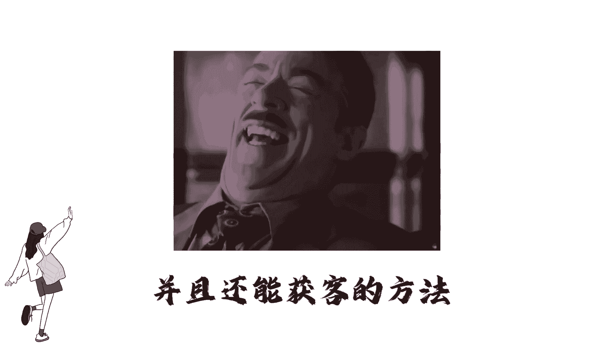
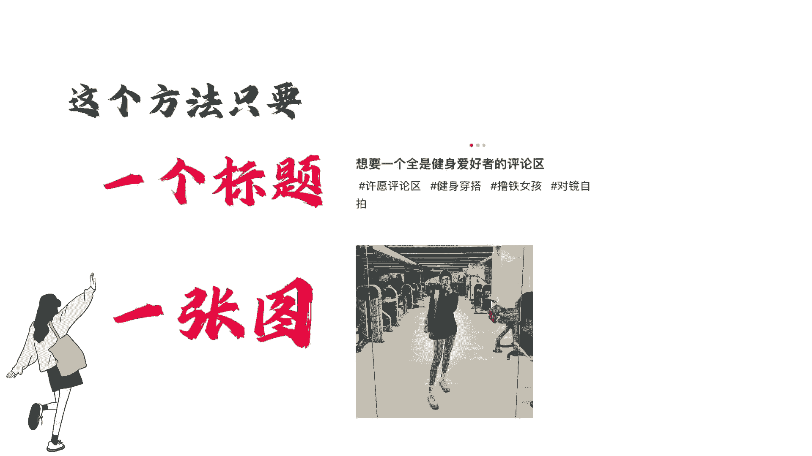
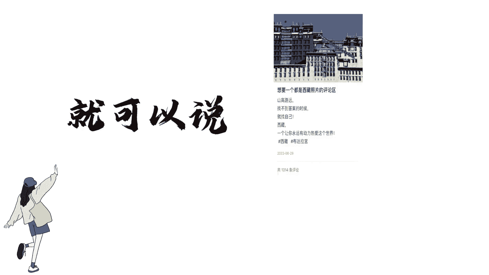

# 【新媒体运营】小红书运营全套课程 零基础进阶起号运营教程 小红书爆款笔记打造／ 商业变现／涨粉技巧／高效就业 完整版流量机制全套课程！ - P7：2.2小红书起号-标题带动法 - 盖周天之变化-吾为王 - BV17bbsewEgX

所有人都告诉你。

小红书现在流量特别好，但从来没有人告诉你怎么做流量才好，你以为做小红书就跟我二奶发朋友圈一样。

随手一拍的照片，配上个感动的文案，刻字就不断。

结果你发完笔记，隔5分钟就打开一看，卧槽没有人看，真是老太太钻被窝给爷整笑了。

今天强哥教你一个做小红书百分百出爆款，并且还能获客的方法。

如果没用，你来找我，我给你投1000聚光，这个方法只要一个标题，一张图，比如你是卖高跟鞋的。

就可以说想要一个全是高跟鞋的评论区，你是做旅游的，就可以说想要一个全是西藏景点的评论区。

你是做健身的，就可以说想要一个全是健身爱好者的评论。

然后在评论区打广告，把自己的广告产品给置顶，只要对你行业感兴趣的用户就会来咨询你。

这个标题不仅适用于任何行业。

