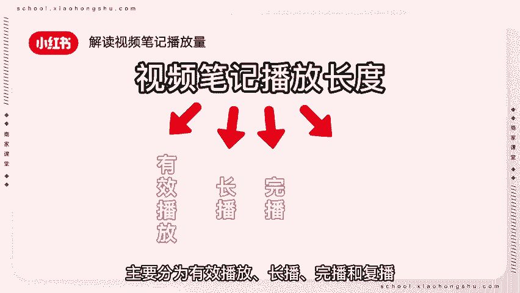

# 【新媒体运营】小红书运营全套课程 零基础进阶起号运营教程 小红书爆款笔记打造／ 商业变现／涨粉技巧／高效就业 完整版流量机制全套课程！ - P7：视频笔记爆款打造（下） - 红书运营小子 - BV17cY5eLEoo

商家朋友们好，欢迎来到本期商家课堂，紧接上期视频，这期视频继续教大家视频笔记爆款打造。

一解读视频笔记播放量。

一个视频笔记的播放长度主要分为有效播放，长播，完播和复播。

分别对应不同的创作考验和用户需求，播放时长直接决定流量的多少，从视频笔记的跳出率到完播率主要分为五部分，零秒到三秒，抓住注意建立期待三秒到七秒，持续铺垫，有效期待七秒到20秒，一波三折突破。

期待20秒到完，沉没成本得到满足，玩到富，意犹未尽，不断满足，根据这五部分时间进行安排，视频笔记流量会得到显著提升，二如何提升视频热度。

快速入题，先公布结果，引起用户好奇心。

然后再描述事情起因，经过增加用户视频停留时长，设置反转，想办法在视频中添加转折效果，提高可看性，善用音乐。

学会用音乐提升对视频的期待值，比如美妆类产品可以使用轻快活泼的音乐，茶具类产品则可以使用舒缓类音乐，画面质感，视频笔记更注重对画面质感的要求，提升画面质感，使其看起来更加高级，三优质短视频四大要点。

完播率我们可以在数据分析中查看视频，完播率采用四大维度提升视频热度，从而提高视频完播率。

点赞率，点赞率等于点赞量除以播放量，提升点赞率的重点在于引发粉丝共鸣，粉丝觉得视频有用或者视频质量高才会点赞，收藏评论率，评论率等于评论量除以播放量，提升评论率的重点在于设置标题的技巧。

大家可以搜索商品笔记标题策划，查看相关课程转发率，转发率等于转发量除以播放量，提升转发率的重点在于视频内容有价值，用户有想要分享的欲望，可以在视频中多多分享干货内容。

提高视频转发量，本期课程为大家讲解了解读视频笔记播放量，如何提升视频热度以及优质短视频四大要点。

各位商家朋友们学会了吗，本期商家课堂到此结束。

