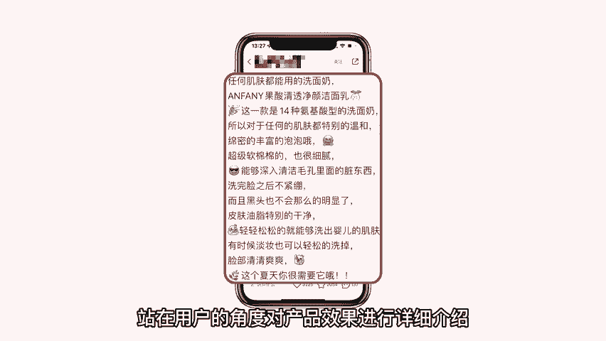

# 【新媒体运营】小红书运营全套课程 零基础进阶起号运营教程 小红书爆款笔记打造／ 商业变现／涨粉技巧／高效就业 完整版流量机制全套课程！ - P8：如何提升商品笔记互动量 - 红书运营小子 - BV17cY5eLEoo

商家朋友们好。

欢迎来到本期商家课堂，互动量是衡量商品笔记是否受欢迎的重要因素。

包含点赞，收藏评论，互动量的多少。

直接反映出用户是否对这篇笔记内容感兴趣，拥有较多互动量的商品笔记。

往往会获得更多的曝光，今天院长就来教大家如何提升商品笔记互动量。

一题文一致，标题和内容要具有一致性。

如果笔记内容与标题毫不相关，即使用户被标题吸引，点击阅读笔记也不会增加笔记的互动量，所以说标题与内容要紧密相连。

可以是笔记的概括，也可以是商品名称效果等巧用问题。

在商品笔记中可以抛出与笔记相关问题，使用户参与互动回答问题。

比如添加选择性问题，这类问题能够很好地起到吸引用户互动的作用，大大增加笔记的互动量，三引发共鸣，在商品笔记中找到与用户相关之处，说出用户的真实心声，解决用户的难题困扰。

比如清洁护肤类产品，站在用户的角度对产品效果进行详细介绍。

对于解决用户问题具有积极作用，吸引用户点赞评论。

四引导用户在商品笔记结尾运用倡议性语言，比如可以写出在评论区提出问题等相关话术。

引导用户评论商品笔记。

五善待杠精，在商品笔记中，不可避免的会出现一些负面评论内容。

商家朋友们一定不要进行回怼，可以幽默且有理有据的回复他们的评论。

增强用户的好感度和支持，以上这些方法是提高商品笔记，互动量的秘密武器，大家可以运用这几个方法发布商品笔记，提升笔记的互动量。

本期商家课堂到此结束。