# 【新媒体运营】小红书运营全套课程 零基础进阶起号运营教程 小红书爆款笔记打造／ 商业变现／涨粉技巧／高效就业 完整版流量机制全套课程！ - P9：如何提升商品笔记阅读量 - 红书运营小子 - BV17cY5eLEoo

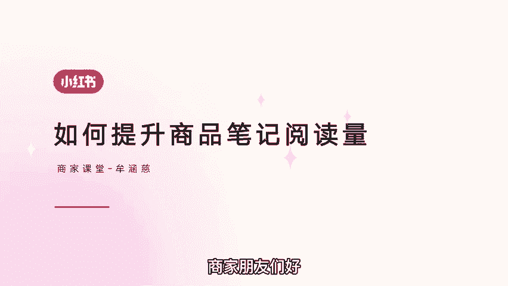

商家朋友们好，欢迎来到本期商家课堂，不知道大家有没有遇到过。

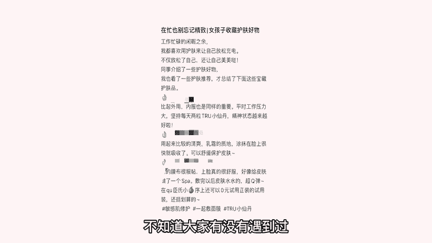

辛辛苦苦写的商品笔记，阅读量迟迟上不去，今天来教大家如何提升商品笔记阅读量。

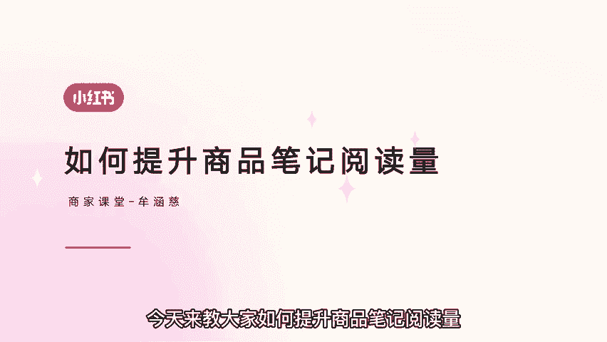

当商品笔记展示在用户眼前，用户能捕捉到三个关键信息。

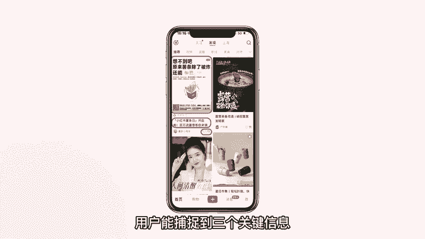

封面标题和点赞数，一封面封面的设计需要有给人眼前一亮的感觉。

选用清晰度高的实拍照片或者效果图片，让粉丝清楚看见商品内容，包装效果也要关注用户需求。

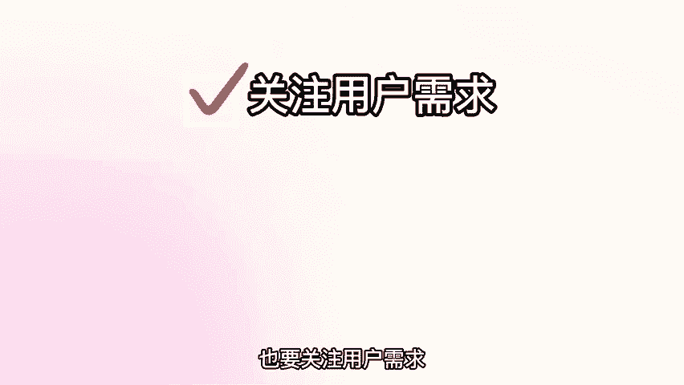

增强画面代入感，引起用户共鸣，比如护肤类商品封面。

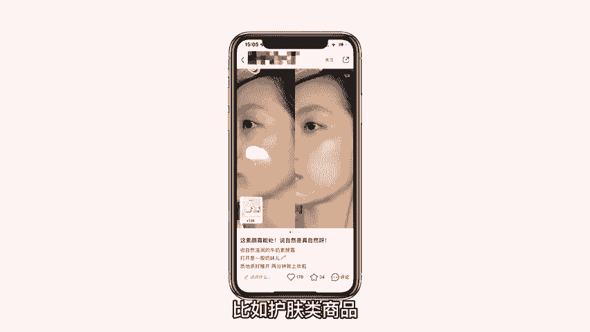

运用真人使用图片，能够看到使用产品后皮肤的改善之处。

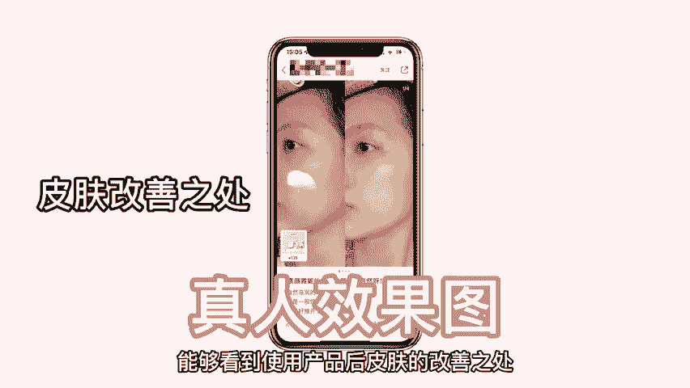

突出产品的功效，从而增加笔记的阅读量，二标题标题简洁。

具有概括笔记内容的意义，粉丝通过标题就能够了解商品笔记的大致内容，吸引人的标题，能够激发用户查看商品笔记的欲望。

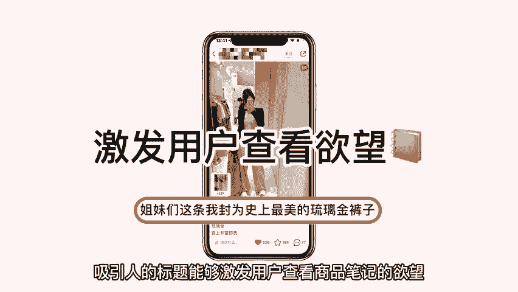

例如儿童服装标题是把毛巾布制作成衣服，展现出衣服的质地和特点。

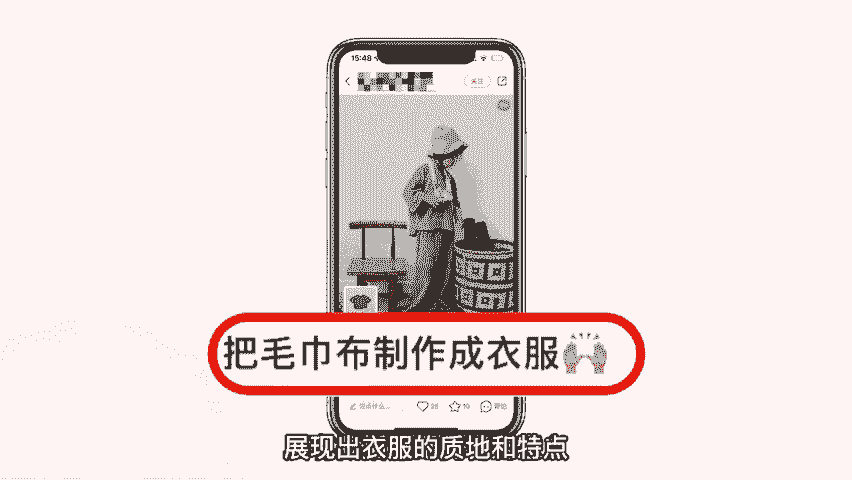

吸引用户点击阅读笔记，同时一篇商品笔记从发布到展现给用户。

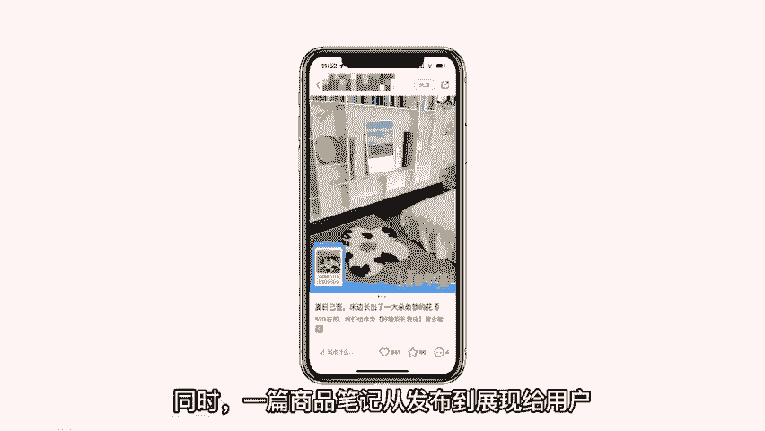

系统会根据关键词对应到人群的标签库。

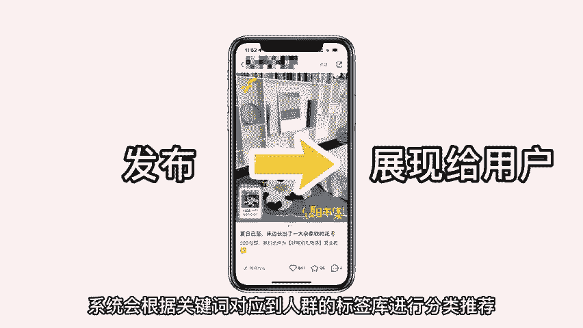

进行分类推荐，比如箱包类产品可以添加适合季节，箱包类型，设计师款等这类关键词可以精准捕捉用户想法，使用户阅读商品笔记。

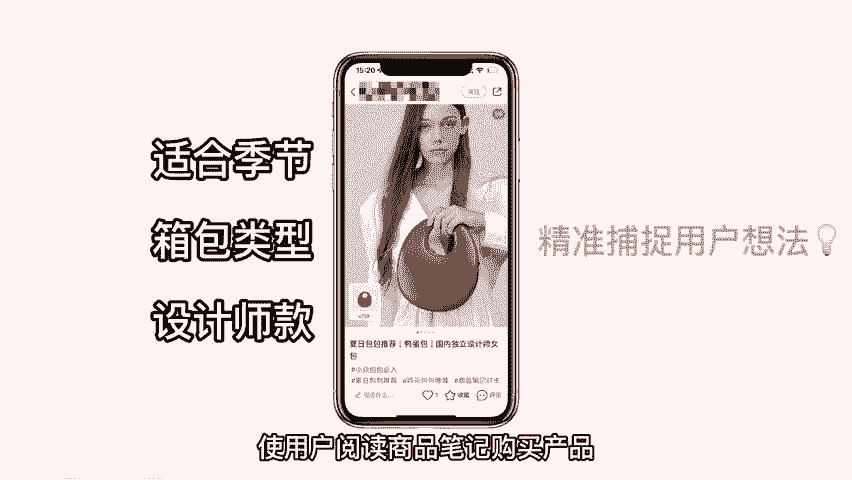

购买产品，三点赞数，内容质量决定点赞数量。

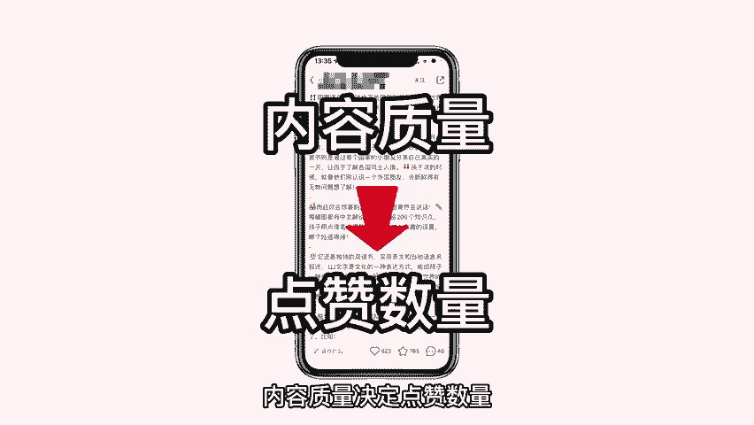

点赞数量影响商品笔记阅读量，关于点赞量的问题，下期视频院长会教大家如何提升互动量，以上几点是提高商品笔记阅读量的重要因素，有了阅读量，才能够使粉丝更加关注到商品本身，增加产品销量。

本期商家课堂到此结束。