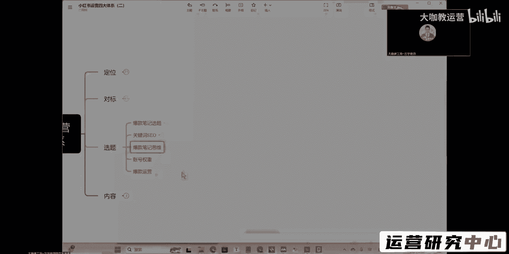
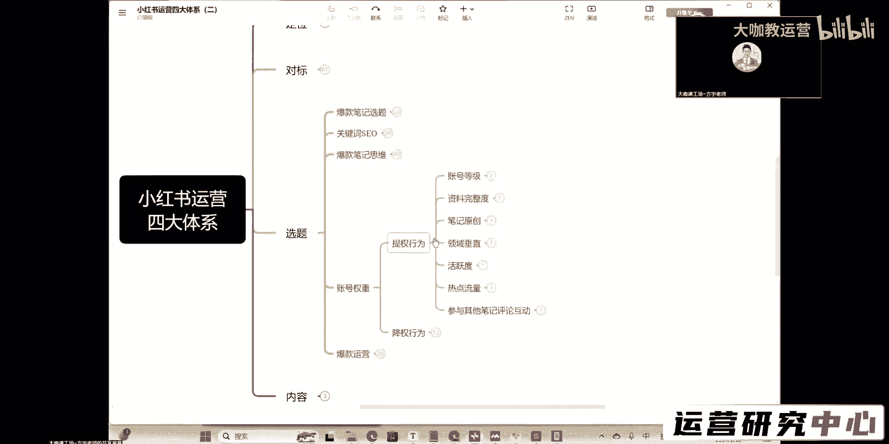
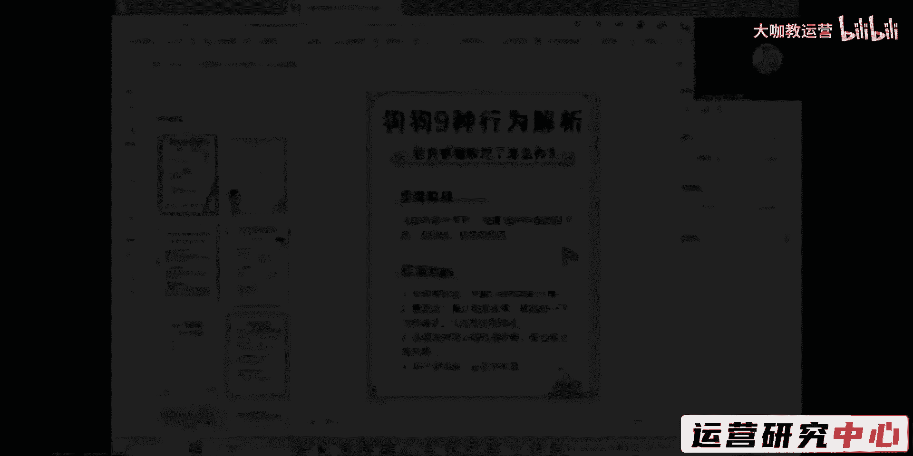
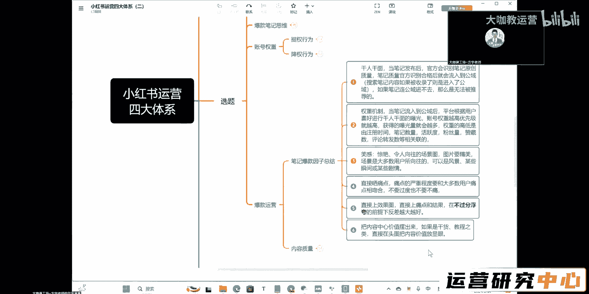

# 【新媒体运营】小红书运营如何提升账号权重 - P1：5.【新媒体运营】小红书运营如何提升账号权重 - 大咖教运营 - BV1t6421f7Bs

然后呢是关于我们权重运营这一块啊。

账号的权重我跟大家讲一下，权重呢，其实我们现在平台所有的账号呢，都有一个基础的权重分，就我把这个打开给你一看，你大概能知道，其实这些东西账号等级，资料完整度，笔记的原创领域，垂直活跃度，热点流量。

这些东西你觉得都很难吗，就是你把这个东西这些东西完成，这些东西都不难，但凡你想把运营做好的话，你花点时间，这些东西都非常非常的简单啊，也就是领域垂直嘛，比去原创嘛可能要花点精力。

但这些东西是我们所有人都在做的事，这个东西叫什么呢，这个现现在基本上可以理解为是什么呀，我们所有人最基础的一个账号的运营的，一个基础的一个权重性权重分，也就是说你把这些权重分拿到了。

你才能算作是一个什么呀，比较较为一般啊，合格的啊，就是说你有资格去瓜分平台，更大流量的一个基础权重，这玩意叫基础权重，你不要以为你满足了这些东西，你的账号就已经做的非常优秀了，其实这些东西内容大把的人。

他都可以做得非常好，但是还是有很多人他不去注重和关注这些点，这是你的权重分，你连基础权重分都没有没有，你更何谈你去嗯把你的这个权重分值提得更高，然后你去获瓜分更多的流量，这是不可能的好吧。

账号等级这一块呢，嗯你们应该啊玩过小红书的都知道对吧，他有这么多的等级，那么努力把这个等级提的越高，对你的账号的属性呢是肯定有增益的好吧，然后呢资料的完整度，这个我就不说了，你所有的资料该填的填。

包括平台给你提供的这什么穿搭呀，你的这个身高啊，体重啊什么这些信息，他需要获取你的信息，你又要在这个平台上去做，那就给他呗对吧，你填的是怎么样的，那是你自己的事情，但是你该填的得填好吧。

职业学校就往牛逼的填好吧，笔记的原创这个就不说了，噻啊嗯我们一直跟大家讲的这个所谓的原创呢，我们要做清轻度原创，前期呢不要去做高度原创，那么我们第一节课就跟大家讲过流量对吧。

我们现在所有的流量其实和我们笔记的一个呃，怎么说呢，就是和我们账号的一个运营阶段有关，我们前期的账号运营，我们只能分到非常非常少的流量，在这个阶段我们做的是什么内容啊，我们是要去讨好平台，对不对。

这个阶段呢，我们是要去跟平台的一个年度粘性提升，然后呢等平台把我们的权重分提起来了，我们在平台这一块的一个整个信任度，和后台的这个分数提升了之后，诶，我们才会有更多的流量，那么前期你要讨好平台。

你就必须得把控，你要有一个量啊，你的内容既要有量，你又得有质，对不对，那这两者你想要去把它兼得，你就没有办法自己去做高度的自我原创，你就只能做什么呀，你就只能去做轻度的，也就是说复刻复刻对吧。

我们前期找对标的作用在哪里，就是让我们在后期做内容选题这一块的方向，有一个明确的方向，好吧啊，然后呢领域垂直这个就不讲了，那么我们有些同学会问，就是我做护肤的，我能不能结合什么呢，我能不能结合穿搭。

能不能结合一些其他的，我认为还不错的这种呃人设啊，高端的啊，类似于这个呃嗯什么其他的啊，这这这这个人设的打造啊，我跟你讲，就是你做什么领域的产品啊，你做什么样的业务。

只要你这个账号最终是往产品方向发展的，那么你就把垂直一路拉到底，你就做垂直做到底，你是护肤的，等你开始运营这个账号的时候，你后面所有的内容全部都是关于护肤的啊，不要去做别的。

这中间不要去穿插别的内容好吧，不要去穿插，哪怕说我们说的蹭热点，什么叫蹭，一定是要跟你这个领域相关啊，然后呢你再跟这个想办法跟热点去蹭上挂钩，这个才叫你单纯去发一些热点，你这个就有点偏离了懂吗。

然后活跃度正常的保持活跃度嘛，就是我们呃要有这个规律的更新是吧，我们规律的更新呢，比如说我们固定在什么时间节点，我们就在什么时间节点去发对吧，那么这里呢也跟他讲了，如果说你的时间节点不好把控。

你就用电脑网页端有一个定时发布的功能，电源电脑网页端的这个小红书，他的创作中心里边是有定时发布的，你用这个定时发布就可以了，好吧，就你提前把这个笔记做好，然后做好了之后呢，它在什么时间节点它会自动发啊。

就是我们按照我们前期的这个发布时间来走，然后热点流量嘛对吧嗯，蹭热点我们前面也跟大家讲了，为什么要蹭热点，因为蹭热点你有了浏览量，你的浏览量上来了，他对你整个账号的权重一样是有提升的。

那么提升了权重了之后呢，你的这个账号就会受到更多人的喜爱，他就会后面的这个阅读量，就从刚开始的五百七百八百一千，就会给你往上提，这个就是热点流量，能给你整个账号带来的一个呃方向的，一个什么的好处好吧。

然后还有一个就是参与其他笔记的一个评论，互动行为，就是你去跟别的笔记去进行形成互动，点赞对吧，那么你回复一些神评论对吧，这些评论呢得到了别人的回复点赞，那么你一样会对你的账号有益处好吧。

这个益处呢可能没有那么明显，但是他是肯定有的啊，肯定有益处的好吧，而且呢你回复点赞，回复评论回复呢，这种东西呢呃还会有吸引很多人进入你的主页，好吧，这个呢就根据你的名字啊。

就跟你起的这个名字啊有一定的关联了好吧，评论互动是有帮助的，然后呢这些是基础的权重提升行为了，那么剩下的怎么去记持续的提升权重，就是根据我们的选题，和我们的内容的一个质量有关，好吧。

这是我，很重要的。

然后呢就是我们要提到的关于内容质量这一块，怎么去把控哈，怎么去把控内容质量啊，内容质量所有的东西呢基本上由这五点去构成，就是你的内容到底是优秀还是比较差的情况，就是由这五点去决定的，第一个是选题的方向。

就你的选题方向，你们一定要按照老师教的这种方式去做，我们前期教大家去找的选题，教大家去做的什么呀，做的我们的这个关键词的一二级搜索词，那么这些就是我们的一个选题，然后呢笔记的一个价值构成。

笔记的价值构成，就是我们正常提供给用户的这个内容啊，就我们的内容点，包括我们的文案，还有我们封面里边后边的这些图片，提供给用户的，你们一定要去找，这种呢就是比较有价值点的东西。

就是可能这个东西呢在别的笔记里边，有可能没有的，或者说别人只讲了那么一点点，但是你在你这一块呢把它重点凸显出来，用一种非常肯定非常夸张的语气跟他说，你不看这一点，你不这样做，你的皮肤就是好不了啊。

用这种语气，用这种内容去吸引用户，把你的这个价值凸显，然后呢优秀的一个文案结构，那这个你们还记得不，如果说现在我让大家去写一篇文案，你们能不能把文案的这个它的一个结构控制好，一个是字数不要太多。

然后的话就是适当的一个换行，把这个内容给列出来啊，分成这么1234点去讲，这个你们估计你们能不能做到啊，把这个文案写好，然后融入我们的关键词，你们觉得这一块有没有问题，上次我教给你们的方法。

然后呢娜娜不是在群里面也跟你们说的吗，你们之前的朋友圈里边发的，有的还可以的东西呢，你们也可以拿来发，是不是啊，就是那些东西呢，其实你们朋友圈发的很多还是比较具有价值的，优秀的文案结构。

这一块应该是没有什么太大问题哈，如果让你们去做实操的话，关键词的布局主要两个方向，一个是标题，然后一个是文案的前中后三个地方啊，啊这三个结构去把你们的关键词做植入。

然后呢这个是互动引导提升数据是什么意思呢，呃你们正常的去花发这个护肤的，可能说你们去发一些这个知识类型的呀，或者说你们的一些经验分享类型的，但是你们可以考虑就是你们的内容里边啊，融入一些噱头类型的对吧。

比如说嗯你们对比一下嗯，就是呃同种情况下，我选择狄安娜的精华，还是说我选择这个其他品牌的一个精华，你们是怎么看的，然后让他们形成这样的一个对峙型的一个讨论，让他们能够在这个评论区啊。

有一定这个噱头型的互动，这个你们能理解老师的意思，不能理解的，扣个一好吧，就是两个品牌之间，就比如说我们举个简单的例子呃，呃两个大两个很很热门的这么一个明星哈，就是像这个呃杨幂对吧，和迪丽热巴。

然后呢这两个人呢你们在这个文案当中去讲，杨幂和迪丽热巴谁的粉丝更有素质啊，谁的粉丝呃更好，这个呢就是其实他们都会有部分的用户群体，和部分的这个使用群体，就你们产品的使用群体。

那么每个人他肯定有他的一个倾向，你让这部分人能够在你的评论区，和你的内容下面进进行一个互动，进行一个呃提升引导，那么你的这个内容的价值就能够快速去凸显，也能快速引爆，好吧，这个呢是一个技巧点。

要就是要用这个东西呢，你们可能要结合一下自己的一个理解好吧，引导评论区的一个互动呢，就是在我们呃，有时候通常呢会在结尾去用一下这样的手法，比如说你平时呃，呃就是分享一下你今天护肤后的一个状态诶。

在评论区打出来，或者说在评论区发出你今天护肤完的一个呃，情况，大胆地发出来，然后怎么怎么的让用户去主动分享，这个也是引导评论区互动的一个方法，当然前提是基于你的这个内容，有人看啊，有人看。

然后的话呢内容质量决定是是否收录，这个我就不说了，这个是我们之前讲过的，那么这个呢是爆款总结这一块，你们去做这个笔记，前面所有的东西呢总结成这么几个点，要融合到你们做的这个笔记和封面当中。

