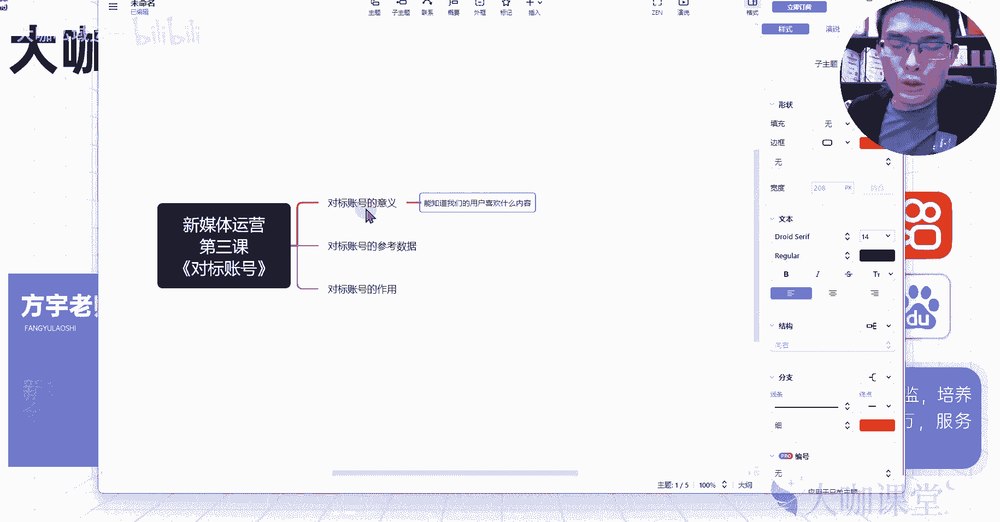
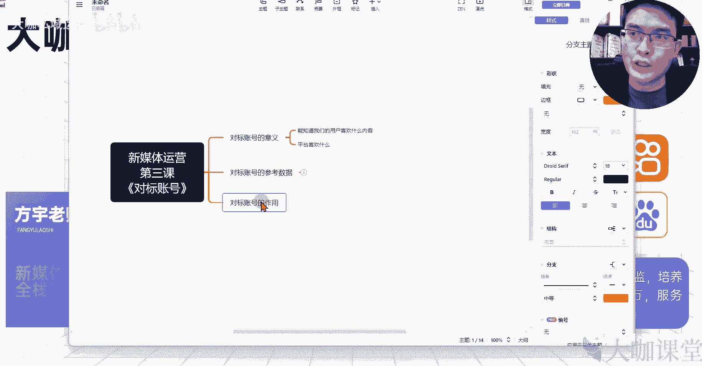
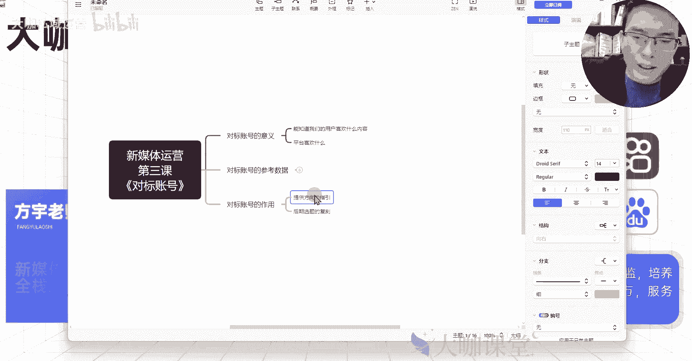

# 【新媒体运营零基础教程】打造专属于你的账号 小红书运营专场教学 涨粉起号／流量玩法／爆款打造／就业变现 大佬亲带 轻松入门！ - P10：9、新媒体运营第三课：对标账号-为什么一定要找好对标 - 大咖私域运营 - BV1FgaUeVEyh

Hello，大家好，我是方宇老师，欢迎大家来到我们这一堂课，那么这堂课呢，我们主要带大家研究一下对标账号。

我们所有做新媒体的同学。

不管你是在别的短视频平台，或者说在这个图文笔记平台，你应该刷到很多人会进去。

跟大家讲对标账号对吧，那么对标账号它到底我们找对标。

它有什么样的一个意义，它能给我们提供什么帮助，我们找对标账号具体要参照它的哪些数据。

它能给我们提供的这些作用到底是什么，那我们通过这一堂课来跟大家讲清楚好吧。

首先呢非常重要的一个点，对标账号的一个意义啊。

对标账号的一个意义，我们通过对标账号我们能够分析出什么东西啊。

我们通过对标账号我们能够分析出什么东西，首先第一点我们能知道，我们的用户喜欢什么内容。

什么意思呢。

对标账号我们去找对标账号，是找这种数据差的呢，还是找这种数据好的呢。

啊肯定是有一定数据量的，但是呢又不是说在这个赛道里边去做的。

特别特别强的对吧，你比如说某图文笔记平台。

在这个平台上面，你找的这个对标账号，你是刚起号的一个新手，你找的对标账号呢，他的粉丝呢在30万，然后他的这个赞仓数据呢有七八十万啊，或者说百来万的这样的一个账号，你觉得对你的参考意义大吗。

他当下新更新的最近的这些内容，对你的参考意义大吗。

并不大对吧，我们应该找什么呢，这里记清楚了，你在某图文笔记平台。

你去找这个对标账号，你的这个数据量一般是在这个旗号阶段。

在三到5万左右是比较有参考意义的，这个粉丝量是比较有参考意义的。

这个时候他的这个数据，它的内容上面能够清晰地告诉我们。

我们这个在这个领域当中，我们的精准的用户群体，他们可能更喜欢什么东西，通过什么展现呢。

通过这个对标账号最近创作的内容方向来表现，比如说他创造了五篇笔记，然后这五篇笔记当中呢，有那么两篇笔记数据是还可以的，然后另外三篇笔记呢数据呢比较差，那么我们就重点关注这两篇数据比较好的笔记。

它是讲什么的，我们再来对它的这个内容呢进行一番拆解，我们再去做复刻，再去做模仿，这就是我们的一个方向，我们能够通过它们来确定我们这个平台。

他们目前我们的用户喜欢的是什么东西，这是第一点，第二点就是嗯。

比如说我们现在去企业里边就业了啊，我们去就职了新媒体运营这么岗位。

然后公司呢丢给我一个新媒体的账号，让我来运营，不管是短视频的或者图文笔记的也好。

那么这个时候我们怎么去知道，我们这个行业里边用户他们关心的点在哪呢。

用户想知道的这些点，我们去分析用户的需求嘛对吧，这个阶段呢我们是去分析用户的需求。

怎么去分析，我们就去看我们的对标账号，他们提供的都是哪些内容，他们到底是提供科普型的讲解知识点，还是直接去做营销去做产品对吧。

这个呢我们做一个规划分析之后，我们就能知道对标账号他在做什么，然后呢我们接下来的账号方向往哪些方向去做，比如说我入职第二天。

领导问我呃，我们接下来你对这个账号的内容规划是什么好。

那么你第一天做的这个表格就有作用了，这个表格能清晰的告诉你，你该告诉领导我们后续的一个方向对吧。

我们做科普类型的内容讲解，我们还要有人设有IP出镜。

我们得搭配一个什么样的一个场景，来做这一块的方向，那么这个是不是就有了这个对标账号。

给我们提供的这个内容方向对吧，第二个点，我们能够通过对标账号去发现平台喜欢什么。

什么意思呢，我们的对标账号他们做的这个数据呃。

做的这个内容数据是不是有好有坏对吧，那么哪些数据好的。

数据好的，然后这些数据本身是有什么样的一个情况呢，我们知道哈。

从流量的底层分发逻辑来讲，你的这个数据，你的这个内容上面呃。

它是从一开始的流量少，到最后的一个流量多的一个过程当中。

是有一个分发的一个积累的，比如说我发出去了之后，我的流量是200对吧，然后呢到了后来我能蹦到1000，我能蹦到1万的这样的一个浏览量是谁给的，流量是平台给的流量对吧。

平台呢当下他需要把这些内容推荐给哪些用户，然后哪些用户通过这个笔记。

获得了一个比较不错的数据反馈，这是不是平台的一个数据层面的体体现是吧。

我们分析五个账号，这五个账号里边最近发的内容。

都是关于什么方向的题材，那么这个方向的内容，是不是说平台当下平台觉得用户喜欢的东西。

对不对，如果说这些内容平台发给了用户。

但是用户呢反馈数据比较差，那么相应的告诉平台。

这些用户呢，这些内容不是用户当下最喜欢的，那么这些内容他能不能得到一个好的数据，他肯定得不到，那么能得到好的数据的，就代表着当前这个内容呢。

在平台上比较受用户的关注，比较受到用户的一个喜欢，我们能够通过账号呃。

我们对标账号的最近的一个内容的，它的一个流量的一个呃升。

这样的一个趋势来分析出哪些内容，使平台和用户共同喜欢的点K。

这个就是我们对标账号的一个关键意义好吧，然后呢对标账号的一个参考数据非常简单。

我们需要参考对标账号的哪些呃。

首先第一个内容结构好吧，它的内容结构具体指什么呢，它是否有人设对吧，它是否有人设出镜对吧。

有人设，有出镜。

第二个他的文案节奏，他的文案节奏一开始是讲什么的。

中间是讲什么的，最后是讲什么的，他的这个文案整体是怎么样去构成的。

讲了用户的哪些点，他的文案节奏到底是快还是慢，然后呢还有他的一个场景。

他是在什么场景下去拍的，他是在室内还是室外，它是固定的场景。

还是说每次都是不同的场景，是不是这个是场景是吧。

然后呢还有这个呃，比如说内容结构对吧。

比如说人物。

他每次讲解的这个人物是固定的人物，还是说有不同的人物在变换。

他打造的这个IP到底是谁，这个IP呢在背后，我们能不能模仿这样的一个方式来打造。

来塑造这样的一个内容结构，好吧，这个是我们参照的一个内容结构的点。

我们对标账号除了参照这些，还可以参照什么它的封面对吧。

除了他的一个封面的话，还有什么，还有它的一个标题。

除了标题之外还有什么，还有它的一个内容选题，他最近在做什么方向的内容。

这个方向的内容呢，比如说他今天在讲这个呃，健身领域的一些注意事项。

他明天呢他在讲这个健身的时候的一个，黄金时间点。

然后呃后天呢他又在讲哪些人群，当下比较急切的需要去健身。

然后健身的这些意义，然后健身的一个对我们的变化等等。

这是不是它的一个选题方向，然后哪些选题获得了一个比较不错的数据。

这是不是我们也可以参考的内容点，这就是我们做对标账号的一个关键的意义，做对标账号的一个分析的一个作用。

然后对标账号呢它其实从作用上面来讲，它能给我们提供一个什么呀。

关键性的，它能给我们提供一个方向的指引啊，方向的指引以及我们后期选题的复刻。

这是比较关键的，方向的指引。

就是我们自己，我们很多同学在做这个新媒体的账号的时候呢，大家都喜欢去做一件事。

就是我虽然说确定了赛道，我确定了人设啊，我可能说也跟着视频学习了一定的选题方向。

但是我们大部分都在想，我们应该做什么样的内容形式。

我的封面到底做成什么样才是用户喜欢的，我才能获得一个比较高的点击率对吧。

比如说我们的图文笔记平台，我们四篇笔记展现在用户的屏幕界面上。

我们怎么样才能获取到这个更高的点击率，我们大部分同学，在没有有足够运营技术的一个支撑下。

大家都喜欢自己去想想，我今天做什么样的封面，我这个封面上面。

是不是要加一个可爱萌的一个表情，我是不是要加一个玩偶，这样是不是能够更加吸引用户的一个视觉。

不要这样去想，我们在找这些东西的时候，对标账号的一个参考数据里边明确告诉大家了。

你的封面先参照着你的对标账号去做。

你不要自己去想，我这个封面我也得加点什么特色，加点什么，这个呃构思进去。

你看账对标账号在做什么，我们就去做模仿就行了，他呢是能够给我们提供一个后期非常明确的，一个方向的指引，有了对标账号，你明确对标账号的一个参考数据之后。

你就能知道我未来一段时间，我应该朝什么方向去做内容。

这是非常关键的点，也是能解决我们大部分人做新媒体，前期起号的时候，我们迷茫的点对吧，不管是你在就业的过程当中去给公司起账号。

还是说你自己做账号，你的对标账号，他们能给你带来的始终就是一个方向性的指引。

因为他们成功了，他们成功的这个方向和路径，就是你可以去参照。

也可以去复刻的好吧，后期选题的复刻，这个也很简单，就是说我们在后期我们要做什么样的一个内容。

我们就参照着它的内容形式，不管说它的标题还是他的文案。

还是他的这个风格，我们觉得成功的我们都可以用什么呀。

用我们之前上节课跟大家讲的，关于差异化的塑造形式，我把他的这个优秀的点组合到我这里。

我的内容当中，我就可以组合成我这个爆款选题的一个复刻。

对吧，这个就是我们对标账号我们要去做的一件事情。

