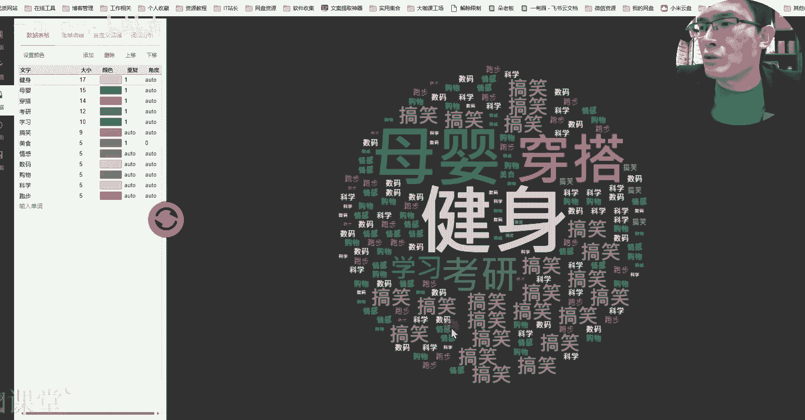
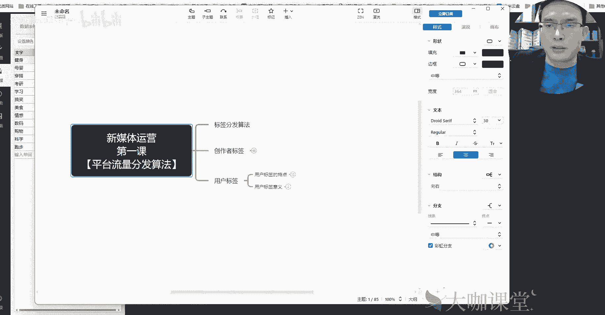

# 【新媒体运营零基础教程】打造专属于你的账号 小红书运营专场教学 涨粉起号／流量玩法／爆款打造／就业变现 大佬亲带 轻松入门！ - P4：3、新媒体运营第二课：用户标签-大数据下的千人千面分发算法 - 大咖私域运营 - BV1FgaUeVEyh

嗨大家好，我是方宇老师，那么上一堂课呢，我们跟大家详细的聊了聊关于创作者标签，它的一个意义，它的作用，还有这个我们账号的第一波流量，或者说我们账号起号的时候，我们视频背后每一个播放或者浏览。

它所代表的意义，以及我们整个账号标签，或者说我们整个流量，它的一个升阶的这么一个过程，到底是怎么形成的，平台是怎么来判断我们的内容是关于什么的，那么这堂课呢我们重点来聊一聊关于用户标签。

用户标签是什么意思呢，就是我们每一个人，你们去使用一款app这种短视频的也好，或者说我们的图文笔记也好，你在使用这个app的一个第一时间用户啊，我们的平台就会对你有一个这样的一个标签。

那么这个标签会随着你浏览内容的一个变化，或者说你的一个兴趣爱好的一个变化，这个标签呢它会有实时的这样的一个可变性，好吧，那么这就是我们要了解用户标签，它到底是什么，用户标签它的一个意义。

或者是它的一个特色啊，首先呢我们来了解一下用户，用户标签的特点，首先第一个用户标签呢它具有多样化，什么意思呢，它跟我们的这个创作者标签不一样，我们创作者标签，我们为了实现流量分发的一个精准化。

我们上节课已经讲了，比如说我们做的是美食的视频，我们自然是希望平台给我们分发的这些流量，不管是一千两千三千也好，这些流量的都是分发出去的用户，他们都是对美食感兴趣的对吧，所以说呢。

我们要保证我们账号的一个标签的唯一性，这样呢，我们前期的这个流量才能分发的更加精准，那么到了后期呢，这是后期要考虑的问题，用户标签就不一样了，用户呢他喜欢的内容多种多样对吧，他喜欢很多的。

比如说呃单纯的美食，或者说美妆对吧，护肤还有什么用户可能喜欢这个app啊，或者说喜欢喜欢这个什么，喜欢游戏或者喜欢健身等等啊，这个呢所有的这些内容，都是根据用户的一个喜好来决定。

平台呢会对用户所有的喜好进行一个罗列，并且按照用户的一个什么呀，按照用户对内容感兴趣的一个程度，给他对进行这对内容进行分级啊，对内容对这个用户的一个标签进行分级，他到底是喜欢美食的内容多一些。

还是喜欢美妆的内容或者护肤的内容多一些呢，你们觉得这些标签的一个分发系统，它有没有办法去判断，完全有办法对吧，你只要在浏览内容上面，你有一些细微的变化，比如说你今天看的视频当中100个视频。

你浏览美食内容的视频当中，有五个美食的内容的视频，你平均浏览的都在十秒以上，然后其他的这个视频呢，你浏览的内容时长都只有两三秒，三五秒这样的一个时间，那么这样平台就能判断诶。

你这个用户呢对美食比较感兴趣，那么我这个平台为了留住你，我让你长期在我的这个平台上面去使用，你去刷你喜欢的内容，我势必要在第二天，或者说在你接下来的使用当中，给你推荐更多对美食跟美食相关的内容。

这就是平台留住用户的一个策略，也是他为了给用户去打标签的这么一个作用，那么为什么这么你们这个点你们应该也能理解，为什么说平台他们要去给我们的创作者，打上这样的一个标签呢。

就是为了把这个优质的内容筛选出来，通过层层用户的一个行为反馈筛出来，然后再推给那些精准的用户，他一定要知道我们的账号到底是做什么东西的，我们做什么方向的，他才能决定把我们的内容推给哪些人。

因为他要保证内容的一个质量，并且呢它不能说我们做了一些呃，很垃圾的这种内容，然后去推荐给了很多的这种用户，最终最终导致所有的用户觉得诶，这个短视频平台现在特别垃圾，我不想用它，那么会形成一个用户的流失。

那么这个就是我们讲的什么呀，就是讲的我们讲的这个用户标签，和我们创作者标签以及平台，他为什么要做这样的一个事情，的一个根本的原因，好吧，那么我们刚才讲了还有一个什么呀，用户标签呢，它还会有什么呀。

还会有分级是吧，分级就是我们刚才说的哪一个，比如说我们像美食对吧，美食这个东西呢，假设说啊我把这个拿过来吧，我们还是通过模型来演示这个分级，比如说用户对美食特别感兴趣，我们给它加个粗。

然后呢给它变个颜色，好这个是美食，然后美妆呢我们也给他加个颜色，加个加粗，美妆呢她可能感兴趣的程度稍微弱一点，那么我们给它一个淡一点的红色，然后呢护肤护肤的内容呢他也挺感兴趣，但是没有前面两个感兴趣。

那么我们给他呢我们不加粗，我们来给它加上一个淡一更淡一点的颜色，那么这样的一个区分你们能不能看得出来对吧，能够理解用户关于内容这一块，平台是怎么去区分的，这个就是用户标签。

也就是说我们所有的用户他浏览了你的内容，他喜欢了你的内容，但是他不光是对你的内容感兴趣，那么这个在我们后续的课程当中，我们也会跟大家去讲，怎么利用用户的一个兴趣点，去制造这种更多的非精准用户的一个。

这个获取的一个方式，好吧，这个是我们讲的有分级对吧，用户标签有分级，还有一点是什么呢，用户标签它具有一个可变性，什么叫可变性呢，我们刚才是不是讲到了一个原理，比如说这个用户他今天对美食的内容。

浏览的时长都非常长对吧，对美妆或者护肤类的内容呢浏览的时间比较短，那么平台会认为这个用户，当前他对美食内容特别感兴趣，不管你是半夜的时候啊，或者说你平常的时候好，Ok，那么假设说你第二天。

平台给你推荐了很多跟美食相关的视频，但是你这个时候你又不想去看美食了，我吃饱了，这个时候我又对什么呢，我可能对健身的内容特别感兴趣，我就想刷点这种内容，OK那么这个时候美食的内容。

你他会把你就是说你推到你的面前，你会把它刷走对吧，你这个时候你不想看，一个刷走，两个刷走，OK好，你刷到了一个健身的视频，那么这个时候呢你突然你在健身的内容当中呢，你又停留了很长时间对吧。

假设说你又停留了长达一分钟的时间，其他的视频呢可能你看个几十秒，这个时候平台会认为什么呢，它的数据实时的波动当中，他会发现诶，这个用户他现在突然对健身的内容感兴趣了，好那么你停留了一分钟。

那么接下来我继续给你推跟健身有关的内容，我来尝试一下你这个用户，是不是你这个兴趣需求变了，好尝试第二个视频诶，你也喜欢，第三个视频你也喜欢，OK那么这个时候你的平台判断的这个用户。

他的一个兴趣行为可能就产生了一定的变化，那么它包括后期再给他推送这个内容的，过程当中，可能就会以健身为主，那么用平台再根据用户对当前内容的一个，实时反馈，来决定我接下来减少哪部分内容的推送。

我增加哪部分内容的一个推送，这个大家能不能理解好吧，这个就是我们用户，他的一个需求的一个可变性啊，一个可变性，那么在可变性当中呢，我们用户变了这样的一个呃浏览行为了之后。

那么这个时候呢美食他可能就没有兴趣了啊，没有兴趣的可能就是说放到最后啊，放到最后都有可能，那么这个时候呢健身成了他第一感兴趣的内容，这个时候他的标签呢就变了，是不是这个就是用户标签的一个可变性啊。

可变性还记不记得我们上堂课跟大家讲了，当我们的内容分发到了5000的时候，为什么说原本对美食内容感兴趣的，这个1000个用户，我们可能应该要获取到600个，这样的一个互动数据，但是为什么没获取到。

一个是基于用户兴趣标签，它存在一个可变性，第二个是用户对内容的一个筛选，对内容的一个挑剔程度变高了啊，这个就是用户他们的一个变化点，那么呢用户标签呢在平台这边呢，他其实还有一个什么东西呢。

就是用户除了这些兴趣行为之外，我们还有一个平台，会还会有一个用户的一个数据库，这个用户数据库，它就跟兴趣这些可能没有太大的关系，这个是平台为了来区分每一个用户，他是在哪里，他做什么事，他现在是什么性别。

他什么年龄，他经济能力是怎么样，这部分属于平台上面特有的一个用户数据库，这个用户数据库你们觉得他能来做什么呢，这些用户数据库可以精准的实现什么呀，就是我们的广告投放，比如说我们现在要在某短视频上面。

我们去投放一个广告，那么在人群的一个标签筛选当中，我们肯定要去筛选哪些用户，我们想把我们的广告推送给哪些用户对吧，这些用户呢他们的经济能力怎么样对吧，比如说是哪个年龄层级的，然后是重点投放哪些地区的。

我们是投同城的还是投全国的，这个时候用户数据库他就派上了用场，用场啊，我们通常来讲用户数据库肯定是至少包含，比如说地区，比如说性别年龄，然后呢所使用的设备，还有他的一个经济能力，他的职业以及他的什么呀。

额啊，以及他的这个呃时间吧对吧，以及他的这个时间等等啊，这是他的一个使用的时间等等啊等等，那么很多人会疑虑哈，我们这当中呢，有些东西它到底是怎么去判断的呢，比如说地区这个好判断对吧。

根据IP来判断你的IP呢归属地是哪里的，这个好判断你的性别，这个玩意怎么去判断判断性别两者，第一者呢是跟你浏览的内容的趋势和方向，这个是完全可以通过大数据来分析出来的，比如说90%或者80%的女性。

运用户，他们浏览的都喜欢哪些内容，这是有一个共通性的，那么突然来了一个新用户，这个新用户，他刚好他喜欢的内容，就属于这80%的女性用户，喜欢的内容当中，这个用户呢可以把他判别为，判断为一个女性用户。

然后呢通过她日常发的视频，或者说通过他自己填写的资料信息，这也可以作为一个初步的判断，然后他的兴趣内容，是可以做更精准的判断的对吧，然后年龄对吧，年龄呢从我们填写的这个数据啊。

或者说你感兴趣的方向内容啊，这个也可以来判断对吧，设备这个很简单，然后你的经济能力，从你的购买力对吧，从你喜欢你加购物车对吧，你平常蹲的直播间，这个也能筛选出来，比如说你喜欢蹲那种九块九的直播间对吧。

然后呢，你又喜欢蹲那些卖高端奢侈品的这种直播间，你的这个经济能力倒是一目了然，以及你的购买行为，你的这个甚至说还有一种可能性，就是你在其他电商平台上面的一个购买行为。

也能成为这里判断你经济能力的一个参照，好吧，职业职业这个东西呢，平台也是有办法去判断的好吧，他会有一个大致的一个标签啊，非常这个分析是非常呃复杂的，还有使用时间，这个就很好说了。

为什么说需要你的一个使用时间呢，这个是提供给在不同的时间段分发给，要精准的系统，把这个广告分发给哪些人群，好来这对这些用户呢做一个行为筛选，比如说你就是半夜，你是属于那种在半夜来使用这个app的。

然后呢你平时白天用的很少，那么你的这个平台的广告呢，它会尽量在你使用特别频繁的时候，把这个广告推送给你，然后你的点击行为，你的重度浏览时间，这个都是能够得到的，好吧，这个叫做用户数据库。

那么通过这个东西呢，我们能够判断出来什么呢，平台对每一个用户，它都有非常强的这个用户画像分析系统，也就是说而且这个分析系统特别特别庞大，而且特别特别精准，为什么说这个某些短视频平台。

或者说某些图文笔记平台现在能做得好，就是基于这么一套系统，它能精准地把内容，一些优质的内容精准地分发到用户的面前，对啊为什么说我们很多人去做内容啊，你们觉得哎呀，我辛辛苦苦做了很多这个视频。

做了很多笔记，为什么我就是没有流量，就是因为什么呢，你没有突破平台对你的一个考核，或者对你的内容筛选的这么一个过程，你的内容根本就到达不了你精准用户的面前啊，这个就是我们用户标签，它这么一个平台。

对它控制的一个特别重要的一个点，好吧，那么通过我们这一系列的分析啊，我们可以看出什么呀，用户标签它有哪些意义啊，用户标签它有哪些意义，首先第一个用户标签决定了，决定了系统给你推荐什么内容。

这个是非常重要的一点，如果说你的账号你想特别看什么内容怎么办，你可以去着重搜索啊，你的这个搜索行为，然后你的这个点赞收藏的这些数据，还有你内容的一个浏览时长，这些都可以为你即将要改变的这些内容。

方向去提供支撑，你通过这些行为呢，你的搜索行为平台也会关注，然后你的点赞收藏，你的这个内容，浏览时长，这些都可以改变你接下来想要浏览的内容，这个就是平台用户标签这一块的一个波动好。

然后呢用户标签这个它反向的决定了什么呢，用户标签它反向的决定了你的账号标签，什么意思呢，就是用户标签这个决反向的决定了你的账标，账号标签的，它的核心意义，就是，平台知道你这个用户他到底是什么属性对吧。

它可以通过你现有的这些标签，比如说我们刚才讲的，你喜欢什么内容，你比如说美食，比如说美妆护肤或者说呃这一类内容，可以判断我们当前这个账号呢是一个女性对吧，还有一定经济能力的这么一个女性。

而且呢比较喜欢美食，那么假设说我们现在有一个用户，她经常关注什么呢，关注考研对吧，关注周末去哪玩儿，然后关注一些这个学习呃，我们考研的这些资料啊，或者说在一些考研的这个直播间，蹲守的时间比较长啊。

那么这个用户的标签是什么，他就是一个正在准备考研的这么一个大学生，是不是啊，那么这个就是我们什么呀，我们的这个用户标签，它决定了我们这是我们感兴趣的，我们所有的这个用户打上的这些标签数据。

它能决定平台知道我们现在这个账号，我们是什么人对吧，他可以判断我们目前是什么人啊，那么我们通过这么一篇分析呢，我们大概知道他的流程是这样，那么如果说你还有，你还是没有办法来理解这一点。

那么接下来我们通过一个图形的方式，来再度了解关于用户标签这么一个东西，那么如果说你看得懂这个图，我现在界面上这个图你就应该大致了解，这个图呢其实就是我们每一个平台，它的后台对用户的一个标签的画像。

现在呢这个标签我们放在这个地方的，可以代表什么呀，它可以代表的就是一个完整的用户的画像，完整的用户画像，那么我们可以看到在这个画像当中，美食是居于第一位的，它是最大的一个标签诶。

那么这个用户他现在就是喜欢美食，哎，他对美食就是最为感兴趣，那么这类用户他更容易刷到什么，更容易刷到跟美食相关的内容，那么比如说我们现在看一下啊，母婴考研穿搭学习对吧，我们按照这个地方有排序对吧。

美食呢是呃感兴趣最大的，然后母婴其次穿搭，其次考研学习好，那么这个时候可能用户平台，我们的平台给这个用户分发的内容比例，他有可能就是这样的，那么美食是十个对吧，每时的内容十个。

然后母婴的内容呢可能有八个，然后穿搭的内容呢可能跟你分发六个，考研的呢可能给你分发五个或者四个学习，给你分发几个啊，给你分发三个或者两个，然后剩下的这些内容呢可能基于去试探，你对这些内容感不感兴趣。

他会随机给你穿插一些这些，其他可能你暂时没有特别感兴趣的内容，推荐过来，然后看看你的反应，你是直接划走，还是你继续浏览很长时间，或者说你提供一些互动的这种行为，OK那么这就是我们整个用户标签。

那么假设说现在这个用户，我们来演示一下它的一个变化的一个过程，我们假设这个用户现在他对这个什么呀，他对健身突然感兴趣了对吧，对对健身突然感兴趣了，我们来看一下美食呢，他可能突然不感兴趣了。

我们给它改为五，然后健身呢16OK17吧，啊健身呢他突然特别感兴趣，我们来看一下他的画像，马上就变了啊，平台呢它也是实时去变动的，我把这里数字呢改成1OK，那么这里能不能看得出来。

很明显的能看得出来哎这个用户，我那么在平台的这个系统的视角里，他就能发现当下这个用户，他就是对健身特别感兴趣，那么我是不是这个时候应该调整，我推送的内容方向，如果这个时候我继续给他推送关于美食的。

但是他就是不感兴趣，他持续刷不到他想要的内容，会造成一个什么后果，我对这个app现在瞬间没有了这个吸引力对吧，这些内容都不是我感兴趣的，我会有一个什么举动，我会把这个app给它关掉啊。

那么系统它也要在运营，他也要去运营，用户去做内容，用户给用户推荐他喜欢的内容，这就是我们来研究什么呀，我们所有做运营人的人。

你一定要了解的这么一个点对吧，用户标签和创作者标签，它对我们整个怎么算呢，对我们整个账号运营过程当中的一个意义，或者说我们系统的它的一个平台的流量，分发的一个算法K好。

