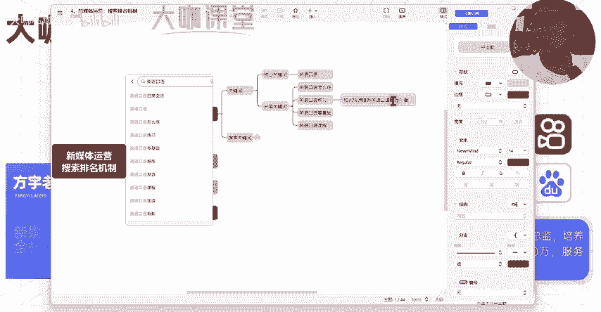
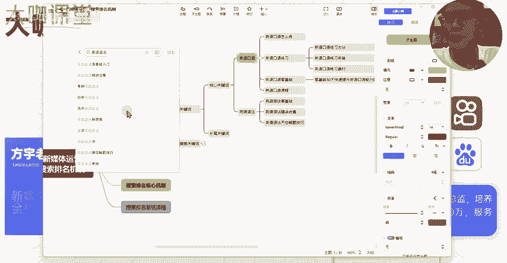
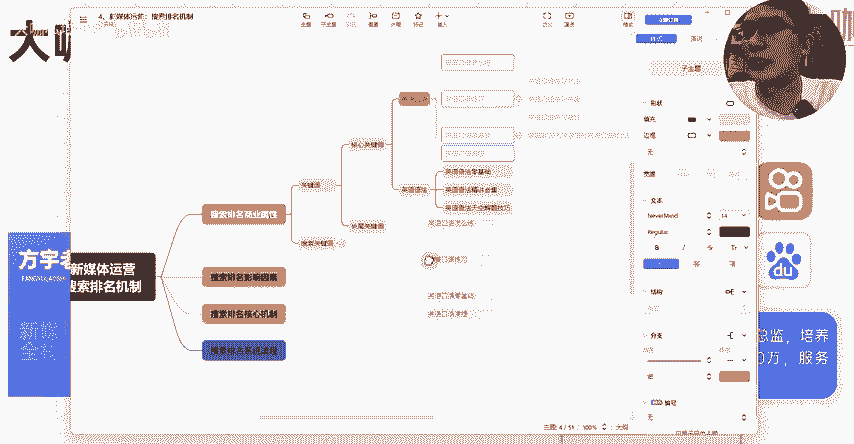
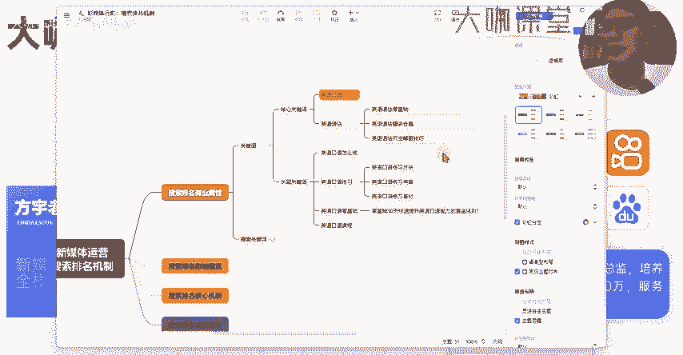

# 【炸裂推出！B站最新新媒体运营教程】零基础学小红书运营全套课程 运营起号／爆文打造／涨粉变现 最全流量机制起号玩法！ - P12：11、新媒体运营第六课：关键词搜索排名（1）mp4 - 大咖私域运营 - BV1QYehenEnW

hello大家好，欢迎大家来到这一堂课。那么我是方宇老师。那么这堂课呢，我们来大家了解一下我们新媒体运营当中非常关键的一个知识点，就是我们的搜索排名，也就是我们的关键词排名，这个知识点呢。

是我们做新媒体运营，或者说我们后续做其他的运营相关的内容，以及我们做用户运营，做内容运营等等等等方向都要用到了一个非常关键的知识点。那我们先来看一下什么叫做搜索排名。那比如说我们现在打开这么一个B站啊。

我们打开B站的这个界面。然后呢，我们在它的这个搜索框里边啊，我们来输入一个英语。😊。

口语。

然后呢，我们接着点击搜索，接下来呢B站呢就会根据我们搜索词在这个下面给我们提供一堆内容。那么这些内容呢，我们先抛开几个项啊，先抛开几项。我们先抛开几项。首先第一项这个地方。

这个地方呢呃第一项这里呢是属于B站的一个课程啊，这个是上家的课程。那么这个课程的一个呃排名我们暂且不算到我们自然视频的这一块的排名。我们算的只是说我们正常作为博主，大家上传的内容之后，所有的博主。

你们上传的关于英语口语的内容。在英语口语这个词下面在B站这个平台上面的一个排名体系。那么这个地方呢它是这个呃第一名对吧？youtube的口语精选，然后这个第二名算不算呢？第二名它不算。

你们看这里它有一个叫做创作推广的东西。那么这个东西呢是属于买了广告位的，也就是说他在这个做了这个关键词的搜索广告的一个投放啊，搜索广告投放。那么这种呢它就不能算在我们自然的排名。

他这种呢广告投放就是你给钱你给B站的这个给钱了，你才能排在这个位置。一旦说他今天把这个广告停了。那么他今天这个位置，他这个视频就排不了在这个地方了。😊，可能排的比较靠后。那么直播这个东西呢暂时也不算。

我们只算自然视频的一个流量。那么这一点这个地方呃这个这个这个eayenglish系列。那么这个呢它也算是这个是排在我们正常来算，它是可以排在第二名的youtube的口语精选排在第一名，这个第二名。

然后这个第三名，这个就是我们搜索排名的一个顺序，也就是搜索排名下面的一个内容展现结果。那么剩下的往下还有这个这个也是课程，对吧？然后第四名，然后第五名第六名，对吧？这个是正确的。

我们在搜索排名下面得到的一个结果。那么这样我们其实通过这样一个界面，我们可以得出什么样的一个呃知识点呢，就是搜索场景下面，那么比如说我现在作为一个正常用户，我想浏览关于英语口语的一些知识点。

那么我搜索之后排在第一名的这个内容，我是不是更有欲望去点击呀，是不是啊？这个其实就相当于是系统在给用户推荐哪些内容可能更加符合你现在搜索英语口语的，你的一个想要的需求。那么我把内容按。😊。

🎼顺序来给你进行排列，那也可以看你自己喜欢的内容。假如说我点进去之后，哎，这个内容确实还不错呢。那么我可能在这个耳机档可能当场去世了哈，不好意思。那么这个内容呢我们表现的呃它符合我的需求。

那么我可能在这个内容里边停留时间比较长，如果说不符合需求，我才会去看剩下的内容，对不对？那么这里得到一个什么结果呢？搜索排名，你越靠前，你得到的流量占比也就越高。

O这是我们初步来演示一下关于搜索排名的一个场景。除了B站之外，我们其他的图文笔记平台，还有我们的短视频平台，只要有搜索场景，包括我们的百度对吧？任何其他的平台，你只要有搜索场景。

那么搜索场景下面的所有的内容它都会有得到一个系统的排序啊，系统的排序，这个就是我们现在关于搜索。那么你想要了解搜索这个东西，你现在就必须得知道一个一个一个一一个一个知识点，就是我们的关键词。

什么是关键词呢？那么我们刚才在这里搜索的这个英语口语，这个东西，它其实就是一个关键词。关键词代表了一个用户的一个确切的搜索需求。😊。

你们想一下，什么场景下用户会去搜索呢？一定是他有确切的需求，对吧？我现在呢想去了解英语口语，我才会去搜我不搜的情况下，我干什么？我一般打开B站，我如果没有搜索行为，我一般都是在这里正常去刷。哎。

看到有的有哪些内容还不错，我点进去看一下，这个属于正常的一个浏览行为，对吧？这个是基于兴趣的，那么搜索是一定有具体的一个搜索需求。这个搜索需求，就根据用户的搜索词来决定。那么好，关于关键词这一块。

我们必须要了解另外的一个知识点，就是它的一个词性的分类，😊，我们呢一般把关键词把一个行业的关键词分为一个核心关键词和长尾关键词。有时候呢也叫做核心词，也叫做长尾词。那么怎么去分类呢？

比如说我们做的新媒体运营这一块，那么我们所有的核心词和我们的核长尾词都是属于我们这个行业里边的都是跟新媒体运营挂钩的，不管是内容运营啊，还是这个短视频运营或者说直播运营等等。

这些都是属于我们这个行业的词。那么如果说现在问你一个叫做这个家居装修这个词算不算我们这个行业的词，那么这个肯定不算装修行业，它有它自己的关键词的体系。比如说呃80频房子的装修，然后装修避坑。

然后装修的这个指南装修攻略等等，这些属于他们这个行业的一个装修词汇，他们有自己的一个词条，对吧？这个词条呢是我们运营人员来进行分析和区分的。好，那么这里我们了解的什么叫做关键词，什么叫做行业关键词。

那我们再来看一下。😊。

关于核心关键词和常尾关键词这么一个东西。

那么我们以我们刚才聊我们看到的这个非常经典的案例叫做英语口语。好吧。那么假设说我现在是一家做这个英语提升的这个机构，那么我在这里呢做这个一做这个要做关键词。我要我现在要来对这个机构的这个词呢。

做一个排序做一个筛选，我要区分出哪些是核心词，哪些是长尾词。那么这里给大家一个选项，一个是英语。然后呢，一个是英语口语。那么大家来考虑一下这两个词，哪个是属于我们机构的一个核心关键词。

我们先来看一下第一个英语，它算不算。

考虑一下这个问题，英语这个词儿它算不算我们做这个英语的这个这个这个机构啊，训练啊，培训提升的这个机构的一个核心关键词。想一想。那么这里跟大家说一下英语这个词，它不算为什么哈？

英语它其实只是一个普通大众代表性的这么一个一门学科的一个名词。那么我们假设一下你现在你作为一个用户，你来搜索英语，你是什么目的？你想要来搜索英语呢？你的目的性有哪些，你是真的完全是想通过英语这个词。

比如说我们现在在这里我们来搜索英语。😊。

你现在呢搜索英语，我一定就是想要去呃去学习吗？我一定想要去提升吗？我是不是可能在这里了解一下他的考试，对吧？了解一下这个英语专业怎么样，对吧？我了解一下英语呢有哪些音标，我只是这方面的一个需求，对不对？

我没办法通过用户搜索英语这个词来判断这个用户到底是否有这个想学习英语，想练习英语，想通过这个我们系统化的方法来做英语的提升，我们没有办法去判断OK那么如果说接下来我们再来看英语口语这个词儿。

英语口语这个词算不算。

英语口语这个词算不算？其实它也不能系统化的，也不能去算。但是它在某些情景下，它又可以算。怎么说呢？英语口语是代表了什么？他从这个整体的词性上面来讲，他其实跟英语没有什么特别大的区别，对不对？

但是到了英语口语这个层面，我们就已经区分了，对吧？我们就已经区分了用户，他想要了解英语某些方面的内容，对不对？你比如说我们刚才搜英语，可能有些人他想要去了解一下英语的这个音标。

他可能想要了解一下英语专业，对不对？但是如果说他搜索了英语口语，那么这个时候他有哪些需求，我们来看一下，我们就来看一下下面这些词，对吧？英语口语的日常交流，他搜索他想看这一类的交流视频。

他是不是有一个学习属性。然后英语口语怎么练英语口语的练习英语口语的零基础，然后跟练发音课程，然后呢，这个连读这些是不是都有他具体跟口语相关的这种内容。

那么如果说我们机构现在是做这个英语，比如说呃音符的，或者说某一些其他的你做这一块的这个英语的提升的。那么英语口语这个可不可以作为你前端的一个这么一个核心词，他是可以的。但是英语就不行。

你如果是单纯做英语做英语，你为了这个词去做大范围的覆盖。那么初中的这个同学他也在去看这个了解英语相关的。那么高中的还有大学的很多，他们这种也是在了解这个英语，他们也在搜这个词。那这样你怎么去区分用户呢？

那么英语口语这种方面的一个提升。就我们很明显能够在这个地方确切的了解用户，他有这个口语化的这个提升方法。但是我刚才为什么说这个词在某些场景下，他又不能作为准确的核心词。

那么其实跟这个词还是有有一定的相似的。我们如果单纯的去做英语口语这个词，我们还是没有办法去区分。但是怎么准确的去确定呢，我们只知道他可能有这个需求。我们怎么准确的去确定这个。😊。

用户他有我们这个产品或者业务的需求。好，那么我们来看这个这个这个上方面的展示，下面有一个这个日常交流，对吧？我们再来看下面有没有这个英语口语的一个练习，英语口语的一个零基础和跟练。

我们把这几个词呢先拿出来。

我们先把这几个词儿给它拿出来，呃，我们把它放在长尾词这里，我们来看一下。英语假设我们现在核心关键词是英语口语，好吧，我们这里写英语口语。

怎么练？然后呢，英语口语练习？唉，英语口语零基础O然后呢，英语口语课程。好，那么我们再来看一下这些词跟这个核心词，我们把这个词删掉，我们现在确定核心词是英语口语。

我们再来看下面根据英语口语得来的其他的这个词，英语口语怎么练。那么这个用户他现在想了解的是什么？他想了解我想提升我的英语口语，我应该怎么去练习，他是不是有这样的一个搜索需求。

那么这个时候我们是不是了解这个用户他的一个具体的疑问点，我们怎么去解决他的问题，我们是不是就有方向了？那么英语口语练习，那么英语口语的练习方法有很多。那么上面呢是要怎么练。

然后下面呢是不是我们要给他提供英语口语的一个练习方法。那么这个时候假设说我们来写一个标题，好吧。

我们根据英语口语，我们来写一个标题叫做。这里我们先不在乎这个词儿啊，我们先不在乎这个词儿，我们就写最高效的英语口语练习。

练习方法。3天。最高效的英语口语练习方法。

嗯。

最高效的英语口学口语练习方法。呃，我觉得我还是要搜索一下，我来根据结果来看一下。

30天英语口语训练。英语听力训练，英语每日跟读训练，然后日常英语口语专辑，建议收藏最佳方式。也可以发育听力提高。我们这样写这些标题呢都写的一半。如何快速提升英语口语？能力。这3个。

这三个方法。

一般人不告诉你。

呃，插了一个词啊，这三个。这三个口语练习方法。

啊，口语练习方法一般人不会告一般人不告诉你。那么这个地方呢，我们就结合英语口语练习来给他提供一个解决方案。我们的这个解决方案就是三个口语练习方法，这个就是三个口语练习方法。

这个就是我们针对用户在这个词下面搜索的一个具体的解决解决方式，对不对啊？好，那么接下来我们再来看另外一个词叫英语口语的零基础。那么这个时候用户的搜索需求是什么呢？

英语口语的零基础。说白了这个用户呢，他现在想了解英语口语，但是呢他又没有基础。那么他的需求肯定就是我在我这种零基础的情况下，我怎么提升我的英语口语能力，对不对？那么这个方向呢可能又具备一点综合性的结果。

我们来尝试写一个标题。

零基础30天，快速提升英语口语能力的。零基础30天快速提升英语口语能力的黄金法则。

啊，我们就简先简单这么写啊，这里呢我们就是提供给用户当前要想了解的零基础怎么去提升你的英语口语能力的一个需求解决方案，对不对？那么我们这里呢简单写的这么两个标题，我们能看出来什么样的一个区别呀，对不对？

我们可以看出来这些我为什么把它放在长尾词，为什么叫它叫做长尾词。因为这些词是依照着我们的核心词英语口语得来的一些衍生词汇，对吧？衍生词汇啊，衍生词汇发音有误衍生词汇什么叫做衍生词汇。

就是我们在英语口语这里，他虽然作为我们的核心词，但是我们没有办法通过这个核心词来确定用户，他具体有哪些需求。那么我们通过细分化的常尾词，我们才能逐一找到这个用户他到底关注的是什么点。

比如说用户在搜索英语口语练习，唉，他可能现在想提升英语口语能力，那么我们给他提供那些方法。然后呢，英语口语的零基础。那么这个时候用户他自身是一个零基础的用户，那么针对这一。😊。

零基础的用户，我再给他提升提供适合零基础的人群提升英语口语能力的这种方法提供内容。然后英语口语课程。那么这种人呢他可能特别想了解我现在急切的想提升，我就是去了解课程。我想做我的整体的英语口语能力提升。

那么这一类人群我们直接跟他推课程，直接跟他讲多少多少节课，然后呢，针对口语的系统化提升，一个月让你达到什么样的一个场景，什么样的一个情况标准水准，这个就是我们长尾词，他的一个具体的展现，那么这还是一种。

对不对？那么除了英语口语，对吧？我们再来看一下所谓长尾词的一个更深层次的一个孵化。

比如说我们这里搜索的是英语口语的一个呃，我们刚才搜索的英语口语，对吧？英语口语下面有这么多。那么你像我刚才这里写的哈，我写了一个英语口语练习。好，那么这个时候我们再来做区分一下。

我们看一下这个词又该怎么叫呢？😊。

我们再来看一下这个词儿又该怎么叫，对不对？我这所有的你像英语口语练习软件，英语口语口语的练习英英，然后呢，高中方法、小学、素材、电影、美音，然后日常这些属于什么？这些属于什么？其实在这里这些词儿。

我们现在挑选出来这些词，它也是属于什么？也是属于长尾词。我们把它放在这里。

我把它放在这里，这个应该放在哪儿呢？应该放在哪儿呢？等一会儿啊，我把这个标题先删了这个词儿这里边的所有的词儿可以说是根据英语口语练习这个常尾词得来的更深层次的一个词一个词汇，我们把它放在这里哈。

叫做英语口语练习方法。😊。

英语口。英英，然后呢英语口语练习的素材，好吧，我就这列这么几个，这些词它也是归类于长尾词的。我们通过这样的一个分类，我们可以了解到关键词啊，他其实可以分的特别细啊，特别细。那么我们尝试一下。

在这种区分情况下，我们可以得到多少词啊，用户的搜索词汇量有多少，其实是非常非常多的。我们以前做搜索引擎优化的时候，我们去做关键词的一个陈列。

我们一个行业的词呢少的有那么两三0百多的可能的高达12000个关键词，长尾词它代表了每个板块，用户的一个确切需求，用户的确切需求。那么用户他在同一个需求下面它的一个搜索行为其实都还是不一样的。

你比如说英语口语怎么练英语口语练习，他他们其实关注的都是不是都是关于英语口语的一个练习方法呀。但是用户的搜索方式他就是不一样。有些用户他直接搜英语口语的练习方法，有些用户他可能直接去搜英语口语。

怎么练对吧？有些用户可能还去搜英语口语怎么提升，是不是这些是不是都是想去找英语口语的一个练习方法和提升方法的？但是用户的搜索属性搜索词，它但凡有一个词的差别，那可能这个词下面的一个排序结果它就不一样了。

对不对？那么我们再来讲一下，这是关于一个核心词。我们再来看一下。😊。

假如说这个时候我们不写英语口语，我们来讲英语的一个呃。

语法。好，我们现在呢我们来看一下这个词英语语法。那么我们可以把这个词呢，英语语法这个词变成我们的什么呀，变成我们的一个核心词，我们给它加一个核心词。

这个核心词就是英语的语法OK那么接下来它有哪些常尾关键词我们就不写在这下面了，它的常尾关键词有哪些？这里也跟我们提示了，对不对？英语语法零基础，对不对？然后呢，英语。

语法精讲。和集OK下面还有什么呃。😊。

英语诶。下面还有英语语法填空。解题。技巧OK那么至于其他的，我为什么这些词不列哈？这个呃后面再讲好吧，后面再讲，这里边涉及到一些我现在讲课里边有一些的问题。好吧，那么这些词都是属于英语语法上面的词。

那么这些英语口语练习，还有这个英语口语练习方法，这些词，这几个词它是属于英语口语的，我们来做一下区分。好吧，这个呢呃它的填充，我给它换一个颜色。OK。😊。

然后呢，这些所有的词呢就是属于英语口语下的一个。这些词属于英语口语下的，好吧，然后呢，这个呢是属于嗯属于属于英语语法的那如果说我这样去给你们调，你们可能更加看得懂，对不对？

那么英语口语下面它有这么多的常尾词。然后呢，英语语法下面也有这么多的长尾词。那我们再试一下英语的这个英语的语法。

零基础好，那么下面还有零基础教学、零基础、自学、零基础速成，还有零基础入门这某某某。那这些是不是属于零基础下面的一个长尾词，这些都是属于长尾词。然后这两个词呢是属于核心词。希望大家能够理解一下。

我们对关键词的区分，对于我们日后做这个新媒体运营的一个方向的笃定方向的一个决定，是有一个非常大的一个影响的。你先要了解到底什么是关键词，然后关键词的一个词性区分。

你后期怎么去根据这些关键词来做符合用户需求的内容，这个是非常关键的。好吧，那么这节课呢我们先讲到这里，下节课我们继续。

