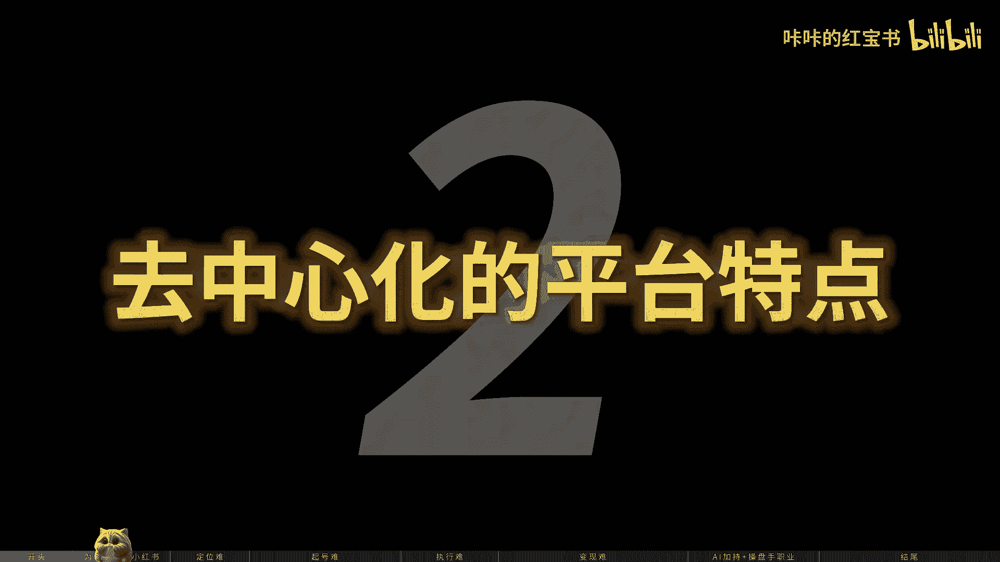
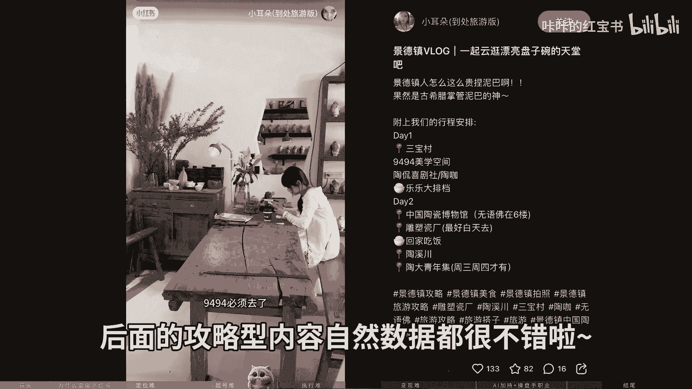
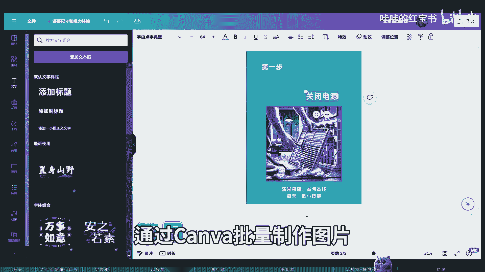

# 【爆肝500小时】如何在7天跑通小红书变现？如何定位？如何起号？如何执行？如何变现？一个视频教会你 - P1 - 咔咔的红宝书 - BV134421U7d4

想象一下，仅仅3000粉丝，小红书账号随便发一发产品图片，就可以月入1万美金，这不是天方夜谭，而是我和我客户的真实经历，零基础的普通人也可以使用小红书赚钱，今天的视频。

我将会分享小红书不为人知的赚钱秘密，一期视频教会你如何从0~1，经营一个会赚钱的小红书账号，解决普通人做小红书定位难，喜好难执行，难，变现难的四大痛点，如果你对这个话题感兴趣，就一定要看到最后，大家好。

我是卡卡，我曾经拥有7年互联网大厂内容运营经验，成功的从0~1打造了抖音小红书，多款百万流量爆款视频，涉及家居情感设计等领域，小红书室内设计账号，一条视频涨粉7K加一个月粉丝突破3万。

人文账号第一篇就是报文，两周内从0~1涨粉1万家，目前主营平台YOUTUBE和B站卡卡的红宝书账号，专注AI加自媒体，创造多条爆款视频，B站运营仅一个月就开通盈利。

好评无数，为什么要做小红书，那在开始之前，你必须要知道小红书的三大特点，一内容创作门槛低，卡卡一直认为t to抖音，YOUTUBE等平台主流内容都是视频，而小红书是一个以图文笔记为主的内容，创作平台。

图文相比于视频的创作门槛更低，你不需要会剪辑，会写脚本，不需要专业的拍摄技能，很多通过手机拍摄的日常内容，就可以获得不错的流量，二去中心化的平台特点。

通俗来说就是新手油耗，小红书平台需要的是源源不断的好内容，而不是头部网红，所以小红书会把流量分发给更多的小博主，给好的内容，所以你平时刷小红书首页，很少会刷到大明星的内容，推送的很多内容点进去看。

其实粉丝量并不高，三低粉变现。

这一点可能会颠覆大家的认知，因为在大众眼里，自媒体的粉丝量等于钱，很多人做自媒体的第一点，就是要把粉丝量做上去，其实在小红书几十个粉丝就可以变现，1000粉就可以开始接广告，而且小红书的粉丝价值很高。

往往都是年轻女性具有比较强的购买力，所以才会有小红书，1万粉等于抖音10万粉的说法。

了解了小红书的特点之后，我们才能更好的开始小红书创作，但是想从0~1经营一个会赚钱的小红书账号，普通人往往会面临小红书定位难，起号难，执行，难变现难的四大难点，别急。

发现问题就代表离解决问题不远了，卡卡今天就来一一带领你解决问题，攻克这些难点，普通人做小红书的四大痛点并未难。

小红书是目前市面上对新人最友好的平台，零基础小白也可以通过小红书快速起号，在开始之前，我们可以先问自己几个问题，我要卖什么产品。

我想通过什么方式变现，谁是我的目标用户，他们有什么需求，有些小伙伴可能要问卡卡了，如果我没有产品怎么办，其实可以从自己喜欢或者擅长的领域出发，比如你喜欢穿搭，那就可以发一些穿搭方面的测评攻略。

笔记更新一段时间后，你就会积累同样对穿搭感兴趣的用户，这时候你就可以挂上带货链接，或者接品牌广告变现啦，这里的产品不仅包括实体物品，更有虚拟产品，比如知识和技能都可以售卖。

你不需要成为领域内的头部，只需要比别人更懂一点，领先一点就可以开始做自媒体，比如你的英语很好，就可以做英语博主，买口语陪练，比如你对留学政策知识很了解，就可以卖留学辅导服务，为了更好的帮助大家。

卡卡提供了快速起号的定位公式。

和卡卡的一V1定位咨询服务，为大家进行全方位的辅导，从旗号的各种定位人设开始，到中终端交付变现资源，让大家起好变现，没有后顾之忧，起号难。

一说到做小红书，大部分新手头疼的问题就是定位难，不会选题内容不知道怎么写，其实小红书起号并没有那么难，在了解起号之前，我们可以了解一下小红书的流量算法，用魔法打败魔法。

根据2017年小红书官方提供的笔记，流量算法公式，SAS等于点赞数乘以一，收藏数乘以一，评论数乘以四，加转发乘以四。

关注数乘以八，我们可以推导出，在发发布完小红书笔记之后，你的内容会被系统打上一系列的标签，然后系统就会把这些内容，推荐给对这些标签感兴趣的粉丝，比如平时爱看减肥类的文章。

平台就会推荐更多关于减肥类的笔记给你，笔记推送给粉丝之后。

根据粉丝的点赞收藏评论，转发关注，给比奇打上内部分数。

以决定是否要继续推送给其他粉丝，而公式中评论数，转发数和关注数的权重影响超过了赞成数据，所以在起号阶段，我们的重点是多发布一些能够引发大家评论，转发和关注的内容，并且内容和后期我们运营的赛道有关。

这样平台就能快速为我们的账号，设立正确的标签，把我们的笔记推送至更精确的用户前，也许大家听起来还是很迷糊，那就来举个例子吧，我们以旅游赛道为例。

这个小红书账号在几号前妻发了这样一篇笔记，看似是很真诚的向大家提问，其实是引发大家评论留言，还想二刷的小众旅行目的地。

还有这个账号看四发帖，真诚寻求旅游搭子，其实也是想让大家评论留言，随着评论区的评论数飙升，讨论的内容又多是旅行目的地，小红书，后台就会给这个账号打上旅游赛道的标签，并把账号后续的笔记都推给。

对旅游感兴趣的用户。

实现精准推流，从而快速起号，然而这个号后续在不断发布攻略性的内容，有了前期的旗号树立标签，后面的攻略型内容自然数据就很不错啦。

如果看到这里，你不知道如何去寻找这样的旗号内容，大可不必担心，卡卡团队准备了不同赛道的起号模板，这是我们团队经过长期测试，并且不断更新的起号模板，我们团队持续更新了30家的内容IP模板。

等于30加各行业变现玩法，希望通过提供1+1=2的内容模板，帮助大家轻轻松松的把爆款内容抄出来。

执行难，更新了几篇笔记后。

发现小眼睛数据上不去，比既没人看，没人互动，时间久了，当热情褪去，随后慢慢停更，这可能是很多人做小红书的状态，我们从根源上去思考一下，为什么坚持发笔记的人那么少。

一方面是因为没有找到对的方法，发的内容不不对，在那里没有目标性的去更新，随便拍拍，随便发发，然后等待命运女神的灵性，另一方面就是没有耐心和持续性，三天打鱼，两天晒网是人的本性所在。

自媒体创业虽然成本很低，但是需要克服人性的拖延和懒散，所以针对这两个现象，卡卡也给大家想到了好办法，如果你不知道那什么内容是对的。

我们会提供100个小红书实战案例库，抖音100套流量密码，为你起号发内容提供实战型的帮助，并且八场直播可从定位喜好引流变现，教会你如何做小红书，理论和实践相结合。

才能发挥1+1大于二的效果，卡卡觉得很多朋友小红书没有坚持更新，并且做下去的原因是知道什么是正确的。

所以在看不到结果的路上半途而废，对于想做小红书的普通人来说，不如直接找已经拿到结果的人学习，少少走弯路，多搞钱，所以看他小红书爆款操盘手特训营ma，每周每节课都会有作业。

一个月的陪跑和实战，有问题可以及时得到答复和解决，只要跟着我们的节奏一步一步来，每个人都能拥有一个可以变现的小红书账号，变现男好不容易涨了几万粉丝。

但是不知道怎么变，现在刚刚开始做自媒体的时候，咔咔也犯过一个错误，我就是觉得粉丝数比变现更重要，所以辛辛苦苦更新内容。

为了每天涨粉，结果发现别人只有几百个粉丝就变现了，而我好不容易到了万粉才开始接广告，在自媒体越来越卷的当下，结果出发，从变现模式出发去做账号，才能起到事半功倍的效果，想要做一个赚钱的小红书号。

我们当然需要了解一下明确的变现方式，比如你是想接广告开店，直播带货。

还是引流到私域流量转化变现，在确定变线与定位之后，我们就要紧紧围绕自己的定位去展开创作，朝着你的方向去深根其中。

接广告变现，属于小红书过去吸金能力最强的变现方式，而现在随着经济下行，品牌广告投放预算不断降低，广告变现已经成为了锦上添花的变现方式。

所以目前的主流变现方法更多是。

电商变现和私域变现，电商变现适合有产品，有货源的玩家，而引流私域便携也需要有资源和项目承接，大家这个时候可能会要问了。

如果我没有货源，也没有资源怎么办呢，为了帮助大家更好去做，小红书，卡卡为大家推荐了两到三个精心挑选的赛道。

高端旅游赛道和买手赛道，提供项目完整的内容，起号模板，思域引流变现话术，小红书海外高端旅游项目拥有前景加变现强，市场大的特点，毕竟强是指小红书平台上获取精准客户流量，通过引流到自己微信。

然后筛选目的名明确的客户，推给旅行社进行交付，这场大则是因为海外高端旅游赛道项目周期长，且地域广，范围覆盖欧洲，美洲，大洋洲，非洲南北等等，全全球都能做，每一个地区都算一个细分赛道都可以来一遍。

大家可能要问了，我没有出去旅游过，也没有旅行社资源，这个赛道我还能做吗，答案是当然可以了，如果参加了训练营，整整个项目下来，你们无需在素材上花到太多的时间，因为我们都会给到你爆款模板。

给你们模仿复制去起航，你们也无需自己找后端产品，我们都会给到丰富的产品库。

你们只需要做的就是认真做笔记，以及把精准流量添加到自己的私域运营好，然后推给旅行社，让他们做进一步的成交和交付。

然后等着分钱就好，而小红书买手赛呢也是前风口下的热门赛道，去年8月，小红书在上海举办电商大会，以买手时代以来为主题，公布小红书的百万买手计划，500亿流量扶持真不小，红书已经告别单纯的社区种草平台。

开始往种草拔闭环的电商时代迈进，我们常常说，在风口上的猪都会能飞。

也就是说平台的政策非常重要，看清楚趋势，趁风做选择，就能实现个体的财富之路，AI加持加操盘手职业。

上个月卡卡去云南旅游，看到咖啡馆里有个小姐姐远成工作，在线接单，工作内容是由meet journey给用户生成宠物肖像，聊了聊，发现这个小姐姐并不上班，通过AI工具每个月可以赚到5000美金。

远离加班熬夜的职场，能在风景如画的云南边旅游边工作，这样的生活是卡卡非常向往的，在过去的时代里，公司这个形式往往招聘几百个员工，实现千万营收，而未来10年的小团体，就能达到千万乃至亿万的营收。

这个是充满机会的时代，AI工具为内容营销带来了颠覆性的变化，为每个普通人都提供了前所未有的机会，而熟练使用用AI工具，对操盘手来说更是如虎添翼。

在未来，每个人都能成为超级个体，卡卡周围就有一群这样的朋友，他们的身份和职业也很特殊，叫做盘手。

随着互联网的发展，未来自媒体操盘手这个新型职业会越来越普及。

也会越来越重要，而卡卡作为卡卡红宝书的操盘手，也一一直在认真思考如何交付给大家，更好的更有价值的内容，我们之前待的职场会强调升职加薪的概念，而升职加薪的核心就是打造自己的简历，其实操盘手这个职业也一样。

我们做产品的核心目的一也是打造案例，最终都要积累信任资产，大家的成果越好，我的信任资产也就越多，XGBT以及它带来的AI生产力革命，对于所有的好行业都将是颠覆性的，对于内容营销领域更是。

现在我们可以通过GBT来创造爆款文案，通过CANVA批量制作图片。

通过SARA制作视频，还能通过mei journey等工具来作图。

而未来随着AI技术的更新迭代，AA的加持会让每一个人都像一个团队，KAKA的团队专注于AI加小红书的流量玩法。

会随时更新最新的AI玩法，并且我们的AI冰细裤，暗力裤也是市面上绝无仅有的。

KARSA曾经带过孵化过一个朋友，他自己是一名家居设计师，并且拥有56年的设计经历，但他并不满足当下的生活，希望自己的生活能够拥有更多自由，于是他决定开始做自媒体，打造个人IP，在KAKA的帮助下。

他已经完成了从产品运营流量转化的闭环，而现在他已经开始期待2024年扩大团队了，熟悉KAKA的朋友都知道，我本人就是我们卡卡红宝书的操盘手，无论是家居行业，代运营行业还是知识付费，我一直战斗在最前线。

这些实战经验帮助我取得了不错的成绩。

我们也希望赋能更多人成为优秀的操盘手。

这才有了我们的卡卡小红书爆款操盘手课程，在自媒体和AI越来越重要的当下，他认为，内容引流获客能力是一个可以终身受益的技能，小红书又是一个非常有潜力，且活跃的平台，小红书操盘手。

这个职业和技能会为未来持续带来巨大的红利，而且在职场越来越卷的当下，掌握一门技能，让自己的未来不仅可以在职场中领先同行，自己也能打造IP，在数字时代靠流量吃饭，我们的课程适合三类人群。

一想要升职加薪，转个行，进入小红书操盘手这个新的高薪职业的人，二想要自己创业，作为操盘手孵化其他IP的人。

三想要自己做IP的人，为了频道成立以来，一直直默默支持卡卡的粉丝朋友们，卡卡将会在7月8日到19日进行早鸟发售，我们会在产品早鸟发售期把价格降到最低，在发售期结束后会立刻恢复原价。

只要你在7月19日前加入，就能够以早鸟最优惠的价格解锁我们所有权益，包括持续更新的30家行业IP模板，100个小红书实战案例库，AI加小红书的流量玩法兵器库等等，最后的最后。

为了感谢大家对卡卡频道一直以来的支持，1月18日晚上，凯凯也会有一场免费的直播，2024~2026年最好赚的行业小红书，高潜力赚钱的赛道，这场直播会免费分享小红书，五个变现最强的赛道，参与直播的小伙伴。

我们团队精心研发制作，准备三个多月的小红书实战攻略手册，和小红书新锐加营销红宝书也会免费赠送给到，大家，可以添加卡卡的微信或转line，来四星718来锁定直播名额，相信这一场直播会对小红书迷茫。

零基础的你有所帮助，而小红书时实战手册会详细的介绍小红书定位，涨粉内容创作方法。

变现路径和小小红书的发展趋势，帮助你从0~1打造一个赚钱的小小书IP，如果你不知道小红书如何快速起号，又或者成为AI时代下的超级个体，那就赶紧上车。

