# 【直播带货】巨量干川三步快速起号判断是否适合付费起号 巨量干川起号投放策略 起号中关注的重点数据 - P1 - 厚昌竞价讲师郝明亮 - BV1iAgLepEL8

那么今天就怎么说呢，来给大家分享一场啊，我自己的一些经验和一些操作，和一些案例的内容是吧，现在直播间呢有两个世峰，还有无名啊，这个头像一响，这个头像让我想起了QQ上的那种头像，QQ上就这个就这个头像啊。

还有余温，还有411啊，还有阿秋，一看这个名字全是新人，因为如果说之前来过，我们这个小额同听过客的啊，基本上他的名字，比如说学员的，他们都会写上几期做什么的，昵称，一看这种没改昵称的啊，全是新人。

看来本场的有多少人是第一次听我讲课的，不包括你们看盗版，看盗版的不算，我知道很多人看到吧，我是第一次啊，看来很多人也是第一次啊，说明这次还是比较好的吧，毕竟啊想要吸引一些新的粉丝朋友圈吧。

看老板的算不算，看老板的一算，嘿嘿嘿嘿，有问题的也可以问啊，也可以聊聊天啊，干嘛的都可以啊，课前呢因为咱们正式课程也好，公开课也好，课前半个小时要不都会讲作业啊，要不就是聊聊天啊。

解决解决问题有哪些疑问的啊，咱们都聊一聊啊，都是这样的啊，有问题也可以聊啊，得得女装LY一般多少啊，像普通女装的话，她们的RY一般广告RY啊，一般能到个四和五啊，如果说是高端女装的话。

可能高的能达到十哈，高端女装，就说你的客单价可能是在1000多块钱啊，大500块钱，500块钱以上的这种高端女装的，像卖貂的，卖貂的，可能他的客单价是在两三千甚至是上万的，都有这种的可能达到十几啊。

告RI啊，光说广告RI，整体RI这个就看你的自然流量了啊，女装她的RY是比较高的，因为女装啊比较吃自然流量，她的一个流量占比这块基本上是80%，至少80%，你是在自然流量推荐费的，大概10%的付费啊。

配合一些粉丝或者说短视频呀，会也更多一些啊，是这样，今天直播间投了进入点击和成交三种，投这么多啊，今天讲的千川在磁力金牛上可以用吗，可以参考，像直播间的一些动作和一些投放的动作，都可以参考。

只不过在磁力金牛那块儿啊，它会比较注重粉丝的一个老粉，以及粉丝的一个培养，特别是在星号上，因为金牛这块啊，从逻辑上来说，他是更加注重它的一个我们所说的信任电商嘛，抖音这块叫兴趣电商。

快手那块叫做信任电商，而这个信任是来自于粉丝的一个信任，你像在抖音这块，你零粉可以开播啊，你可能粉丝只有几百，但是你的直播间GMV能做到几万大几十几万，这也有可能，但是像在快手那块。

你想要做好或者说做多的啊，你的粉丝量啊，是你跟你的GMV，你的销量是成正比的，要关注粉丝量的增长，做我老粉的一个沉淀，是这样的啊，请问一下一般千川起号，比如说建了十多条计划起号啊，如果说刚开始起号。

刚开始起号建议对半开啊，可能说你建啊一两条进入啊，预算很少啊，但是一般如果说起号前三场直播，建议大家投小调碎星推啊，小袋碎星推的成交也好，进入直播间也好啊，一笔一笔算吧，一笔100块钱，一笔100块钱。

两小时，1。5小时一小时，你可以投啊，100块钱，100块钱进入啊，100块钱进入两小时，100块钱进入一小时两笔，然后两笔成交也是，你可以放到1。5小时和两小时，可以投100块钱商品研究点击。

这样五笔啊，一共大概是500块钱，同样的你在投PC端千穿的时候，如果说用到莱卡定向的话，你可以做来两个莱卡定向的计划，配合极速版的达人，这样会更好一些，如果说刚开始起号，建议成交和这种浅层的。

大概五五开就可以，比如说你建啊五条浅层的啊，或者说成交的你大概率跑不出去，但是呢就在这放着它，不管他能跑不跑，跑不出去，哪怕大部分啊99%的可能都跑不出去，但是你放着它啊。

让它带来一些比较说一些能够成交的，因为你的转化目标是成交的，而我们系统会默认的带来成交的用户，是这样的啊，对应对头的进入啊啊停留时间增加了，但是没有转化，后面怎么去调整，后面的尝试去小店随心推投成交。

成交的一个占比更大一些啊，我不知道你的成交能否消费出去啊，如果说能消费出去的话，是OK的，先用浅层，你可能投的进入和点击你投的浅层没有成交，但是呢你的用户你的数据，看看你的五维四率啊。

看看你的五维四律或者说六维五律啊都行啊，去巨量创意巨量创意去查一下大盘，你这个行业大盘的，它的一个维四率大概是在什么值，你当前哪个数据哪个率是低于大盘数据的，比如说啊你的一个到曝光率。

比如说商品的曝光率啊是比较低的，那么你就要去增加你中控，去点击讲解的一个时间，如果说你的曝光进入率是比较低的，那么你看看你的画面的灯光呀，布置呀，主播的实时的一个氛围啊，他的一个情况啊。

是否也可以去优化一下，对不对啊，是这样的，一定要看数据，看完数据优化，某一个点优化完成之后啊，再去下进行下一场的投放也好啊，直播也好，那才能够一步一步的优化的越来越好，一定要动。

而不是不是说我直播完了没有复盘，我不去看数据单播啊，我就说一播一场一场一场这样播，而没有优化的话，这是不行的，对去看，比如说每场录屏下来，我们都会录屏，特别是刚开始起号的时候啊，我们看新版大屏。

新版大屏哪个曲线它下去了，为什么下去，我看看是停留还是互动啊，什么原因导致的，就是停留时间进进进入，进入的曲线和初期的曲线，一看快快挨住了，两个快挨住了，那为什么说这个时候没留住人，我去看一看。

是我当初的话术啊，主播当前嗯的话术有问题，还是当初那个品有问题，就要看这个是数据的，一定要通过数据去看啊，普洱茶的一个RI茶叶类的，做得好的能做到五差的话，应该能做到三茶叶类的啊。

啊广告投进入直播间都是机器人啊，投进入直播间，现在会有很多的那种大拇指啊，鲜花呀，还有那种大头娃娃，但是没办法，一定要找对标达人，如果说你精准点的找对标达人找到啊，不要找那么泛的对标达人啊。

大概是中央部的就行，不要找特别粉丝做的得内衣类目，像这个LI，其实内衣类目更多的是做的自然流量，你要去做付费的话，那一类目它可能能做到也跟复数差不多，能做到五，甚至是能做到八不低的内衣类目。

它相对来说准入门槛是比较高的，因为内衣现在你必须入住地基地，然后自然流量也要好，之前呢是通过有一个我们这儿的自然流量，去起号的，也是啊99块钱三件去做福利，到时候拉到298。

298的一个高客单价的一个啊，注销品主要还是通过自然流量起呃，如果说过于依靠付费的话，怎么说呢，不是不是太好，直播间进来人了，下单不支付太多了，是人群不精准还是主播承接能力还是售卖话术。

其实是话术的问题啊，更多的是在话术的问题啊，你来了流量来了流量，但是他他已经去到了支付页面，但是呢没有下单更多啊，很多种情况下是什么啊，主播321放单啊，放库存，我们的运营去把库存放上去了。

但是这个时候的话，很多主播就哦转品了，就换下一个品了，你是不能够直接转品的，明白吗，而是要去继续的引导，比如说继续引导这个品，你买回去之后啊，是在哪些场景可以去使用对吧，哪些没有站单。

还还是在站着车的一些啊哈小伙伴的一些宝宝，现在一定要争取这次机会，如果说啊我在到给大家最后30秒时间，如果说还在战车呢，我们直接推出去，让给其他的小伙伴，一定要后台实时去看的，而不是说啊你放完库存。

他们下完没有支付，你就不管了，换下一个品了，一方面需要去讲解这个品的场景化的话术，使用我们购买后的话术，另一方面的话也要通过话术去强调，这些正在战车的同学啊，战车的宝宝们不要战车啊，今天的名额是有限的。

如果说30秒之内还没有去支付的，我就要把金额让给别人，一定要去做啊，做福利起号会给直播间的表情打成低消费吗，啊现在的话福利品是不太好起号的，而且就算起来的话，你到时候转正价款的话是不太好转的啊。

非常不好转的，一转就没人了，所以说现在基本上要不平波，要不你你找福利款那种款的话，不能够离你的正价款，它的客单价差的太低，尽量不要去做那种九块九的了对吧，如果说你的主销品是在99块钱左右。

那么你的一个利润品可以啊，你的引流品可以是在29或者说19，如果说你的客单价是在主销品是在一九啊，198啊，1298，398甚至是更高，你可以拿59，69啊，99的做这种引流品，有人说这么高的客单价啊。

那那么的话人家会要吗，你组套餐吗，比如说之前我们做内衣的，就是啊99块钱三件，99块钱，三件品牌的一个内衣在外面，可能说你99块钱只能卖到一件，但是呢这里福利品福利品只剩十个名额，十个名额是三件。

99块钱三件，你把你的量上去，相应的你就可以把你的客单价上上来，天窗已经显示流量限制了，怎么搞，新建计划也跑不动，流量限制的话，一方面可能是你当前是店铺处于新手期啊，每天啊最多1000单。

或者说你当前口碑分还没出来限制投放，或者说你当前的直播间有违规啊，直播有没有违规啊，这几种情况是被显示限制啊，先看看其他情况啊，如果说啊看你有没有口碑分吧，先看有没有口碑分啊。

或者说你当前店铺是否已经卖到了1000啊，新手期卖到了1000单，在直播间的同学，咱们一会儿正式的课程是在八点钟，八点钟正式开始，距离现在还有12分钟，大家可以在直播间的同学啊，可以点击右上角的三个点。

把咱们的直播是免费的啊，分享到你的朋友圈，或者说分享给同样做啊啊，投放做千川的一些朋友啊，来更多的人来听听课好吧，把来听听课分享给大家，因为都是一个圈子里的啊，一方面的话你也可以看看。

这有一个比较干货的课程啊，给给你的朋友去看一看，另一方面的话也透了0。6额，前面那样投放的啊，发一元秒杀都没有转化，怎么破，一元秒杀都没有转化，一元秒杀你直播间现在场关多少，平均在线有多少啊。

这个小艾啊没有口碑分，那是按照17期呃，千川起号的三天30单的方案，没有口碑分被限制，那就先别投了，昨今天已经直播多长时间卖出去多少单了，昨天什么情况，十几个呀，不要做一元秒杀了。

子也只不要做一元秒杀了，或者说你尝试去换个号，你这个号是有问题的，只有十几个厂关，还是说十几个在线啊，十几个在线，我建议你去换个号是最好的，换个号是最好，你这个号是有问题的，十几个在线，一元秒杀没转化。

你是说这个一元的秒杀卖不出去吗，是卖不出去吗，还是说啊我卖出去一元秒杀能卖出去，但是我的签证账户没有流量，那那换号吧，换号吧，号建议你去参考一下别的直播间，预言秒杀都卖不出去了，直播间没有直播推流。

是号废了吗，如果说你是纯付费的直播间的话，你的自然流量推流可能占到百分之个位数，5%啊，6%啊，这种是没办法，你像美妆的啊，今天会去讲美妆的，他就是纯付费，纯付费，他就没有自然推荐，你要看。

如果说你是你看那个名字啊，佛山陶瓷，你是做陶瓷的，像做陶瓷用品的，它的自然流量就特别少啊，像陶瓷用品，你直播间可能他的自然推荐流量，可能只有10%到20%，更多的是可以通过短视频积累粉丝啊。

通过一些短视频投抖加啊，这样去通过短视频流量，要么的话你打包短视频，要么的话你通过付费去带来流量，只有这两个是占到大头的啊，你的自然流量陶瓷类的啊，像景德镇之前我们跑过的啊，基本上没什么自然流量。

全靠付费，或者说你通过短视频啊，像那种啊，我们当前直播间十几个人，连参加一元秒杀的人都没有，要不的话你全是老粉啊，他参加过了，或者说你这个品真的是没人要，一元一元都没人要，你再差不能一元没人要你。

比如说我一元秒杀一个IPHONE13，你看他有人要没有，你看有没有人，对不对，它不一样，维生素你就说再差的话，你不能说一块钱都没人要，或者说你整个产品的价值啊，他怕这种吃的东西反而不应该去一元秒杀。

明白吗，这种吃的东西，特别是入口的东西，你去一元秒杀反而会使人有一种担心担心感，担心感啊，陶瓷类的厂关都不过百，不花钱的话对啊，陶瓷类的没有自然流量啊，你要把你的短视频，其实这类似于什么啊。

不知道有没有做啊，汽车后市场的，像一些雨刮器啊，什么空调空滤，汽车空滤这种，他靠打爆短视频，或者是通过付费自然流量，他直接播的话，可能直播间也是个位数也是个位数，昨天消耗2000。

几乎前半个小时有效互动很多，互动率17%，今天播了两场，第一场消耗31啊，还没出流量限制，下午第二场出现消耗00：01啊，那么话讲直播间问题停一天，明天再播，先停一天，明天再播。

这种出现异常情况就不是操作问题了，再差再差的情况，你只能会说投放，如果说流量正常的话，我们就是要不投投放不出去啊，投放差特别少，但是呢不可能说啊，只消费个几块钱，或者说你的RI会很差，这是正常流量。

而如果说你的流量直接显示了受限，那么你要去不是找投放的问题，不是找投放的问题，你要考虑是不是口碑分，你直播间被限制了，明天再播一场看一看，不要着急，好吧啊，手机壳这类的产品适合什么方式。

旗号后期怎么去稳住流量啊，手机壳是没有什么利润的，低利润的产品的话，建议大家直接是自然流量起号，或者说短视频起号，你可以看一下竞争对手，对啊，你可以看一下竞争对手，因为像手机壳的话。

我经常会搜到一些账号，他的所有的抖音全是拍的，就一个视频，真的他的抖音号里面全是一条视频，一模一样的视频，但是每条视频的话都有几百个点赞，都有100几百个点赞啊，我不知道你没搜到过。

就说各位你们再去选择一个品去做起号的时候，有没有去市场上去抖音上去搜过，或者说一些第三方第三方网站上去搜过，你的对标的竞品，他们是以什么流量为主的，他们的账号有没有视频，他们的直播间在线是多少。

他们的直播形式是多是什么样子，如果说你连这个都不知道啊，都都没有去做过，那我建议千万不要去盲目起号，你起就是死啊，起号现在整个的抖音的所有类目，基本上都有你对标的一个账号，做之前先研究竞对啊。

我们所说的竞品调研是最关键的一步，是最关键，而不是说你脑子一热，我有一个工厂，有一个品，我找到了货源，我就去卖啊，我去盲目的起号，对不对，各位一切脱离实际的啊，调研去盲目的去做的东西都是耍流氓，好吧。

关键我们建材呢线上没成交，纯信息流数据都没办法做，什么意，建材线上没成交，纯信息流数据都没办法做，没没听懂你说的，你是做千川吗，还是做信息流啊，今天只讲千川直播间的小伙伴啊，咱们的分享是从八点钟。

八点钟正式开始，大概的时间是一个半小时啊，八点钟到09：30，中间有任何的问题啊，就关于课程上的问题，咱们可以在评论区打出来，比如说我讲完这块你不太清楚，那么我讲完这块会统一的去回答他的问题。

而如果说你跟本次课程是不相关的，或者是说啊本次正在讲解的内容是不相关的，我可能就直接过了，到后面的话咱们再去答疑，比如说我正在讲这起号的啊，你问我啊，我这个AI是多少对吧，我这广告多少。

我这个场馆太低怎么办，你问我这样的问题，我肯定是不回的啊，咱不能打乱咱们的讲课节奏啊，大概是一个半小时，一个半小时之后咱们还会有答疑的时间，到时候可以去集中的答疑，把你们刚开始听的问题啊。

还有哪儿不明白的对吧，或者说后来进来的同学都可以在后面去问好吧，今晚课程几点，刚才刚刚说了，八点钟到09：30可以准备好你的笔记本啊，今天的课程内容是非常的多，而且非常干货的。

其实把今天的课程去讲完的话，大家对比着你这个产品它的一个成本，它的一个客单价以及去做一下竞对的调研，大概你就能清楚，我的直播间要以什么样的形式去直播，我的起号方式是什么时候去介入付费。

什么时候介入付费比较好，还是不介入付费比较好，我的付费流量大概的占比在多少比较好，我基本上讲完这节课，听完这节课，大家心里都能够有个啊，对自己当前品类的一个理解啊，在这个配件啊。

大盘的筹产大概是广告RI能做到二点多，差点就是看你的客单价，如果说客单价3C类目也很大，3C类目也很大啊，好的能做到，因为客单价差别太大了，利润高的能做到五啊，利润低点的客单价比较低的，可能也就是在1。

5到二，1。5到二，直接显对标账号，对标账号粉丝可以吗，还是说几天都不要限制走反流量啊，过几天再优化人群，建议对标账号对标账号先打标签，如果说直接不限啊，什么是打标签，一会回去讲啊。

前期一定要去帮你的直播间打标签，让系统知道你需要什么样的品，需要什么样的人群，好吧啊，来啊，在直播间听课的同学点击啊，帮帮忙，点击右上方的三个点，可以把我们的直播间分享到你的社群。

你有哪些社群的都是做前传投放的，做信息流的，也可以让你的朋友亲朋好友来听一听，如果说他们有做这方面的东西的啊，或者说分享到你的朋友圈，帮我们宣传啊，让你的朋友或者说有需要的同学都能看到好吧。

今晚课程快手几号也可以用吗，可以去参考，不能说完全照搬快手，它有自己独特的逻辑啊，好时间到了啊，好的时间差不多了，我们准备开始今天的分享内容好，各位小伙伴们，大家晚上好，能够听到我说话。

能够看到课件的同学在评论区打一或者送花啊，今天是我们巨量千川首次的公开课啊，我们叫它分享课也好，公开课也好，因为之前的巨量签收，我从来没有说对外免费分享过内容，除了去官方去讲课，今天也是啊。

在租客的期间给大家去分享一些，关于巨量千川起号的内容啊，这节课程千川操作上各位应该都知道啊，如果说你是老手的话，应该都知道千川操作上的东西是非常简单的，很智能化的，今天要告诉大家三步快速起号。

更多的其实为什么说我讲起号啊，公开去讲这个起号，这个东西其实就是让大家少亏一些钱，因为我刚才看到直播间评论区有很多同学啊，我想去做这个旗号，但是呢很多同学连竞对调研都没去做啊，连去看当前市场上有哪些人。

哪些品，哪些客单价在跑在直播形式，人家直播的人数，这些都没有调研过，你就要去去投放，因为现在大家都知道啊，直播带货是一个风口，我要去做，但是呢你做了可能亏了很多，有没有亏的同学。

有没有在电商直播带货这一块，抖音这一块快手也好，你亏了上百万的，我相信直播间绝对有，而今天讲的旗号其实就是给一些啊，我有一些我之前做信息流，我有一些技术，我我要去投入一些，我要去做直播带货。

我要去做创业的，我给大家刹刹车，往回拉一拉。

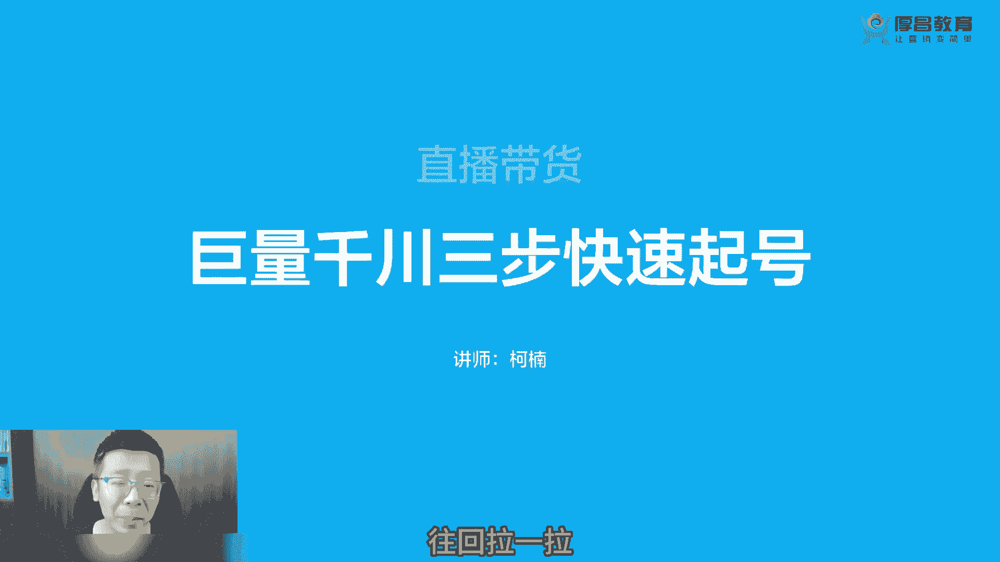

看哪些坑你是不能踩的来，首先咱看一个概念，什么是起号，各位什么是起号，一个新的抖音号，一个新的直播间，为什么说要有起号这个过程，那么起号与不起号有什么区别，为什么说别人的号在线好几百人，甚至是上千人。

而我刚开始直播，我直播间连人都没有，连人都没有，为什么，因为这就需要个旗号，就比如说一个你是一个新人，别人是已经在抖音上混了好几年的人了，人家的资源和你的资源是不平等，记住我这句话。

让系统知道哪些人喜欢你的直播间，你的直播间能够创造多少的价值，对不对，第一句话，哪些人喜欢你的直播间，哪些人能在你直播间停留，为什么今天有了大家来听我柯南去分享千川，因为可能大部分人都对我有印象。

是比较喜欢我的，喜欢在这停留，喜欢听我去讲课，再者第二句话，你的直播间能创造多少价值，简单点来说，你能够让抖音赚多少钱，那么记住这两个，第一哪些人第二价值，那么哪些人对应的什么，我们直播间的动作。

哪些人对应的访客，点击进入你的直播间，一看见你的画面，我比较喜欢，我点进去了，你的短视频，我比较喜欢在你的直播间停留，互动加粉丝团，我们经常说的这些东西，而这个价值代表什么价值，其实就是最简单的啊。

掏钱为什么说有送礼，有pk的直播间，他的人也不少，为什么有pk的直播间，pk的啊，他的直播间一整就好几10万人，对不对，小杨哥，他虽然说也带货，但是他不带货的时候人也不少，为什么他那么多。

因为有人送礼物，嘉年华一直走，再者就是购买等付费行为，我们要做的旗号是什么，让更多的人在我的直播间去进入，去停留，去互动，去加粉丝团，喜欢我，这代表了你能够留住人，再者在你直播间去付费去掏钱，这是几号。

有人说，那我起号和完毕和和起号完之后有什么区别，各位你们有没有这样的问题，什么时候算我的账号标签成熟了，什么时候算我起号成功了，有没有人知道什么时候算你直播间能够稳定的，有一批在线的人。

你这一批在线的人可能是30多个，20多个，50多个，也可能是100多个，甚至是上千个，能够稳定的有一批在线的人在你直播间，而像有些同学，我可能一直直播就没人，就没人，对不对啊，这就是你的标签成熟了。

不管说你是通过付费也好，好通过短视频也好，通过自然流量的也好，你通过付费能够带来一批人，他能够稳定的投出去，稳定的在线本地的付费，那也算就像一些店纯付费的，比如说一些高客单价的，像大家电啊。

一些品牌的直播间，他在线人数不多，可能也就是二三十人，但是呢他的GMV也不少，也不少，它的产出也不少，对不对啊，就是7号稳定，那么起号的方法有哪些，各位把你们所知道的一些起号的方法，打在公屏上。

因为市面上其实我相信啊，市面上讲这种直播间起号的一些内容啊，免费的课程啊非常的多，你听过算不算听过最经典的七天螺旋起号，听过没有听过的，打6667天螺旋起号，什么清仓号，什么鱼塘起号。

这是当前市面上最经最经典的或村，怎么说流传范围最广的，对不对，都对都对对吧啊，不管说各位有没有知道应该做直播的，应该都知道清什么叫青瓷，做陶瓷的最近非常火的，是是叫青衣吗，还是叫叫什么来着啊。

蓝衣青瓷突然之间忘了那个名，南艺青瓷，他起号起的快不快，各位应该都是眼看着他起号的，呵呵对不对啊，当初他刚开始做的时候，刚开始去做rap的时候，其实在我们运营圈里面就唰一下就特别火啊。

眼看着他从几万的粉刷刷涨到几10万的粉，大家觉得男一青瓷他是把哪个流量做到位了，付费流量，免费流量，粉丝流量，还是说哪些流量自然流量，那么看我下面这句话，咱们再说难易青词几号的方法，不管说哪种方法。

本质是通过哪种方式获取访客，并让其留下来，甚至付费，要不付费，来看一下这个图，我们老运营应该都知道，老陶说老运营应该都非常清楚了，我们直播间的流量来源，付费流量，自然流量，粉丝关注流量，短视频流量。

搜索流量二维码，其他流量，对不对，我把付费做到极致，那这就是付费起号，我把自然流量起号，那是自然流量起号啊，我关注粉丝流量，我的粉丝比较多的，比如说我是影视剪辑的，我去卖我的剪辑课程。

我通过这个去起号卖货，起号也有短视频起号，专门做短视频，起号的短分为矩阵，对不对，这四种旗号其实归根到底，你把任意一个做到极致，你把自然流量，你把你的运营技巧，你把你的主播话术，你把你的场景。

你把你的厂，你像那个蓝衣青瓷，它就是自然流量，他是把整个的停留互动做到了极致，对不对，他把直播间啊一进去全是运营对吧，全是运营，把停留互动做到极致，这我不多说，大家都知道这几种方式。

那么今天咱们重点是讲的付费信号好吧，自然流起号我不讲。

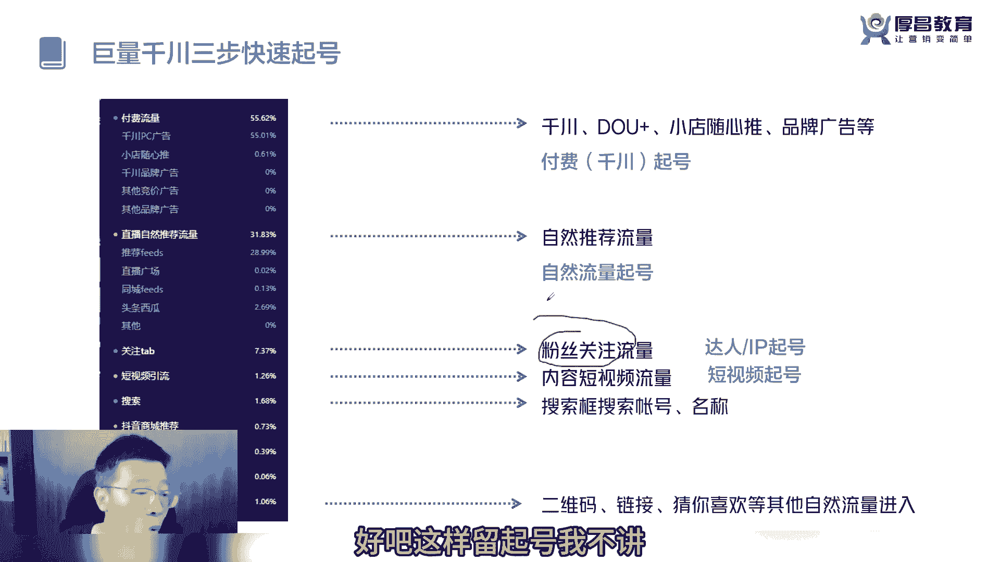

因为我不擅长，我就擅长付费起号来，今天讲的是铅穿三步快速起号，三步哪三步来，第一步先判断你的品类，你的类目是否适合付费旗号，是否适合付费旗号，你如果说这个品类不适合付费旗号，要不你起不来，要不你起来了。

赔的不行，你不赚钱，第二步起号策略，我如果说我适合付费起号了，那么我要制定我的策略啊，通过哪种策略，哪种投放方式，哪种投放方法去跑，再者优化我投放出去要看数据，我分析数据来优化我。

下一步我看我投投的对不对，我应该去优化哪里，记住这三步先判断是否适合，然后再去做策略，再去分析数据，这是这三步，通过这三步去起号好吧。

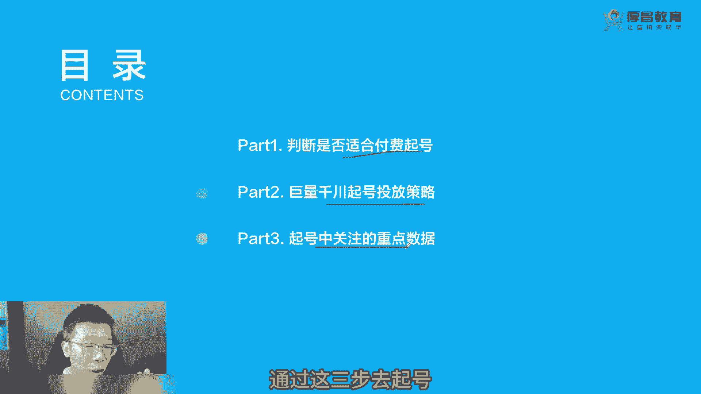

来看一下我们从这两个方向去看，我们哪些是否适合付费旗号，第一直播方式，直播方式当前比较流行的三种过款型，货款型，什么是过款型，最简单的我直播间赢有引流品，有正价款，有福利品，那有有这种做做引流的。

做停留的，受福利的，也有这种啊，获取利润的这种大家应该清楚叫过款型，还有一种平波型，我往这一坐，阿拉说的还有日不落型，日不落日不落，今天不说好吧，因为我们这儿也不做日不落，其实就是平波。

类似于平波中的一种，只不过时间比较长，再者的话赛道选择啊，你是哪一个赛道的哪一个类目的，今天举三个字就是啊五个类目，咱一一看哪些类目类目里面也有区分。

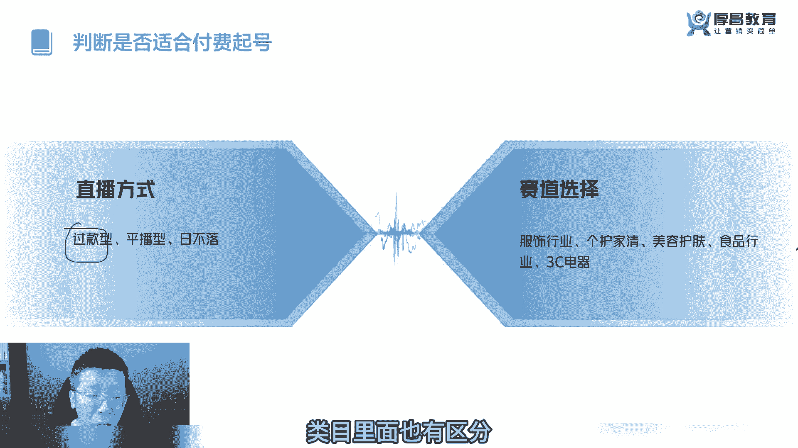

类目里面也不一样，好吧，来首先看这种，来先看这个视频啊，先看这个视频，没想到没有了，我链接删掉了，你们买的普通杯是单边的，为什么做立体，第一浪费面料，第二他是锁闻，第三他是那种太空飞机上的。

太空舱式的保暖黑科技，并且这里面容是九五的，大多我说的容度很大，我我怎么检测都很大，看是不是蓬蓬松，看我刚才圈的地方，各位看我刚才圈的地方，我圈的都是哪里，有没有人看到圈的都是哪里，我圈的都是哪里。

第一看评论区，第一看评论区好多没抢到，这是在干嘛，没抢到，说明他的一个购物车里面会有一些秒杀，以及一些憋库存的，少库存的，第二他往这儿塞了一个纸巾，有什么用头像挡住了是吧好吧，我的错，来往这边点啊。

来看下面没抢到，第一个啊，咱说两个，第一个没抢到，说明他是在商品的库存上去搞了动作了，G上的太空，对不对，像一些福利款，你看他的直播间，这啊有600多1200啊，家纺用品这个客单价是真的高1200。

像第一个第一个我记得是个1万多，周五的大多都很大，第一个是2万3500，对不对，抢到了我没抢到，我们福利品没抢到，他是做秒杀，现在不能改价做秒杀，对不对，这是第一个啊，在秒杀上去做动作啊。

库存和秒杀去做动作，再者刚才我所说的在胸口上去塞纸巾。

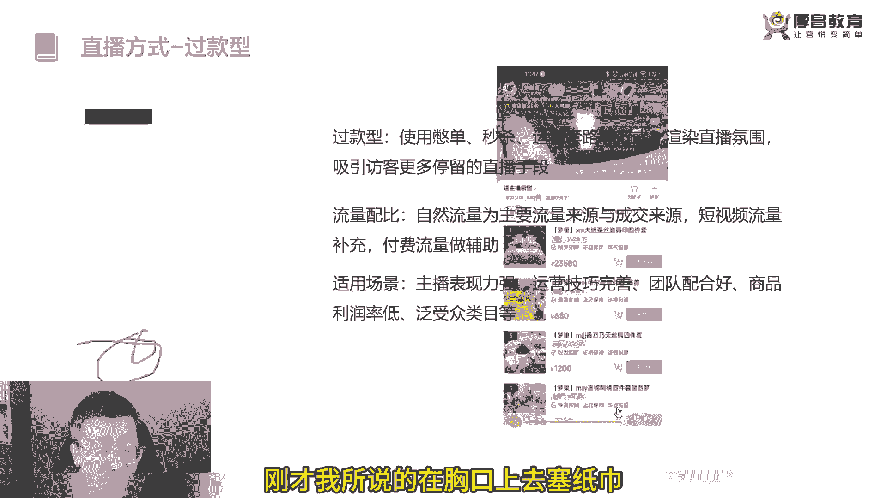

一方面是啊，有人说啊是防防被封，防被封也好啊，也可以可不可以增加停留，可不可以增加话题，对不对，一些老色批，他们会不会停留去增加互动，对不对，这都是一个方法，这就是在通过什么啊。

憋单秒杀和一些运营的套路，包括主播的身上一些我们经常有没有，你们有没有在直播间发现很多有做播的做波，他们在桌子上是法放个什么，这个是什么东西，看我头像，招财猫看过没有，很多的一个直播间。

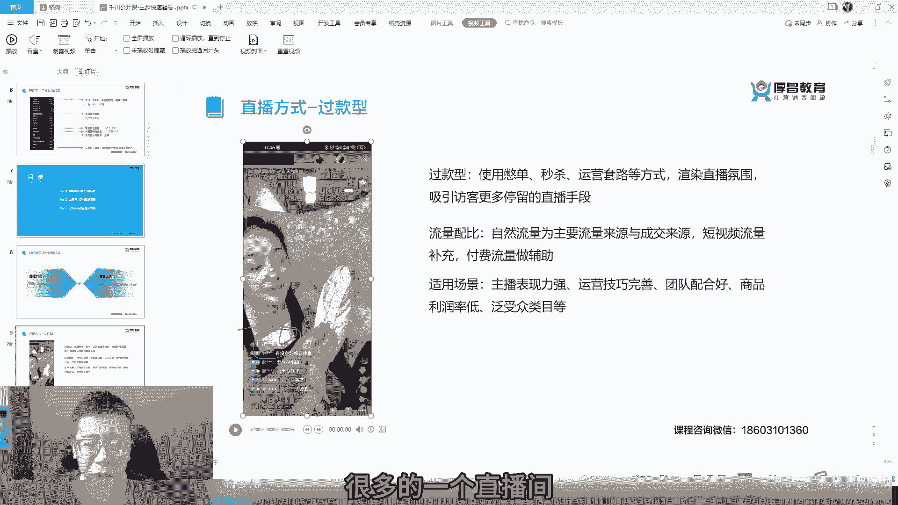

他的桌子上都会有一个小物件，都会有一个小物件进去之后，这些东西也是会增加停留的，所以说像这种过款型的，他们是通过一些运营套路渲染直播间的氛围，吸引访客更多停留的手段。

所以说他更多的重视的是在停留互动这一环节，还有加粉丝团来加粉丝团，加粉丝团，今天啊加了粉丝，各位备注的啊，已经拍了的，一定要回来去打个拍了好吧，拍了加入我的粉丝团，今天呢给大家送一个4号链接，不对啊。

送水杯等等，送水费，今天只只分享给我的粉丝团哎，有些话术一定要注注意啊，这里话术的违规我就不讲了好吧，话术这些违禁的啊，以前的内容我就不讲了，讲这些东西大家知道一些过款型的，他是为了去做做更多的停留。

流量配比，第二个我们看流量配比，自然流量是主要流量来源和成交的来源，短视频流量做补充，付费流量做辅助啊，像一些爆品，比如说家家纺这块，我有一些爆品卖的最好的一个品，我去拍一些短视频。

甚至说我一些直播间的切片去发出去，做短视频，去做补充流量，而付费的话去做补充，去做辅助，适用场景这块主播表现能力强，运营技巧完善，团队配合好，商品利润率低低，泛受众等，这个不是说全部满足啊。

如果说你满足其中两三个，那么你适合这种主播表现能力非常强的啊，运营技巧很很牛逼，团队配合起来也很完善，商品利润率比较低对吧，不愿意去或者说不适合去做大付费的，泛受众品类的，都是比较适合自然流量啊。

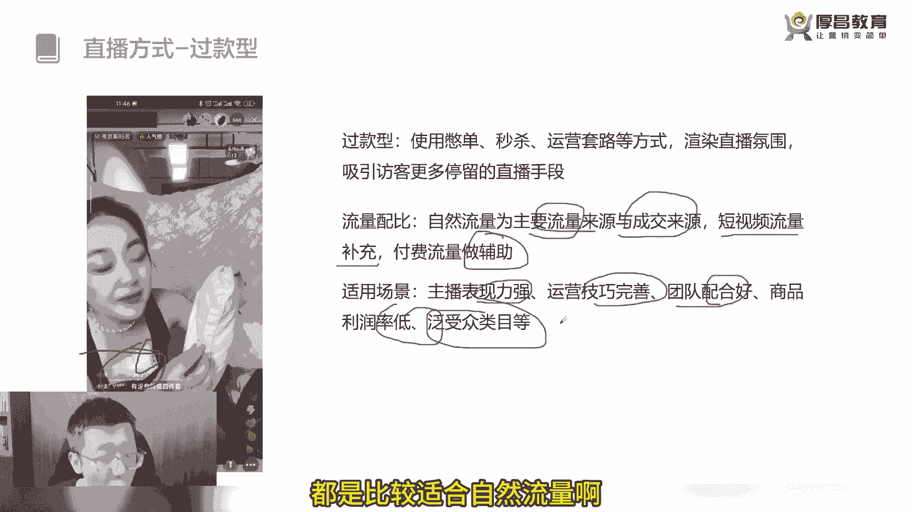

过款型的过款去做的，我们来看看一个数据啊，这是一个视频类目的数据，看他的直播间推荐占到了96%，基本上没有啊，没有这个付费就更没有付费，你看他的流量曲线就一波，有没有这个直播间的流量是这样的。

大部分免费流量就是自然流量的，直播间很多都是一波流一波上去了，你看啊，从03：30到五点就一个半小时，直接到没人，自然流量就是这种不稳定性啊，比如说一些大主播当前开播了，你直播间就刷一下，没自然流量了。

大主播一开播，你这就没自然流量了，很常见这种问题，这是这样的情况，你看他是千次观看，成交金额特别低。

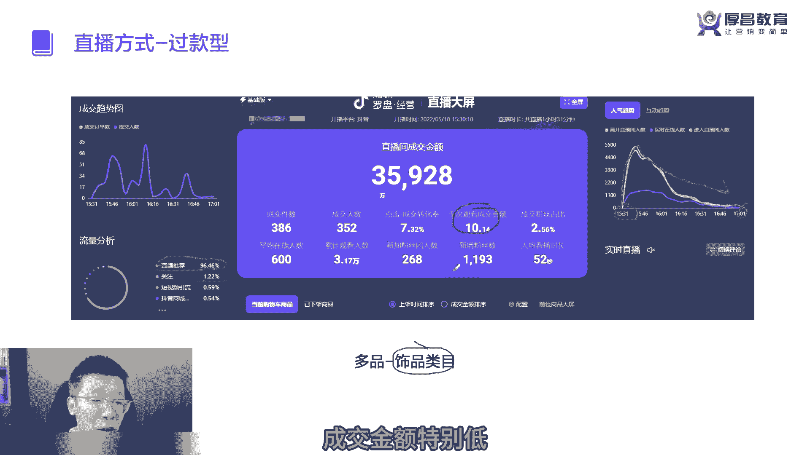

特别低，塔航线哈哈哈，这也是当前江湖上流传比较广啊，我们再看平波形，我们看这个八小时内发货只会早，不会晚，打了，已拍加急，我给你备注一下，优先发货啊，今天拍下的宝宝尽量今天能给大家发出。

我就不给大家拖到明天早拍早付早发货，早享受啊，宝子们，妞妞啊，宝宝如果你只需要水乳的话，你去拍6号链接，如果你不，如果你只需要香奈儿博士，可能有些女生会知道啊，她是做什么美妆的美妆的。

你看如果说你是男生，你刷到这个直播间，你会停留吗，各位男生不会吧，为什么不会，一这个女的长得一般，二什么东西呀，我不知道没兴趣，第三这个主播说的没啥意思，我连个开头都没有，对不对，所以说这就是平波形。

平波请平波情，大部分都是绿幕直播，说后面啊搞个绿幕，通过一些图片搞上去，直播间氛围一般啊，客单价比较平均，像刚才我们看的，他大概低的是80多，90多高的啊，一百一百九十八，298，他重点是循环话术。

反复陈述，像这种这种直播间第一那几套话术，留人话术，刚开始留人逼单话术有人拍了，再者就是回复评论区，比如说评论区有人说4号链接怎么用啊，这个怎么使用啊，它更多的是跟我一样答疑明白吗，如果说没人问。

OK循环话术来回播啊，今天怎么怎么样，是啊什么专场，今天来我给大家讲一下一号链接，今天我们的主销品它是什么东西，就开始这样了，循环话术来来回回就那几套东西啊，其实这种直播间是最简单的。

最最最最简单的投入成本是最低的，你只要搬运一套话术，来个主播，找个绿幕播就行啊，P那么像这种直播间，大家都知道我不会提升，不会吸引我的兴趣，那么付费流量就是它的主要流量来源，和成交来源。

兼顾短视频流量和推荐费的流量，这个时候像这种直播间，像美妆的各位有没有跑过的美妆，他的付费流量可能占到70%，高的能占到80%，这么高，基本上如果说不跑付费，你看他在线40多人，这还是跑了付费的。

不跑付费就是个位数，连个人都没有，单品售卖，不是说只卖一个品，它会有不同的型号，你看刚才刚才咱们看到了，但是啊都是护肤品，或者说都是一些功效的，都是去皱的呀，都是做啊高亮的精华等等，对不对。

都是单一类的品类，再者利润率高，美妆像白酒，美妆的利润率啊，大家都懂的，对不对，垂直品类就是做单一品类的，那么看这是平波。

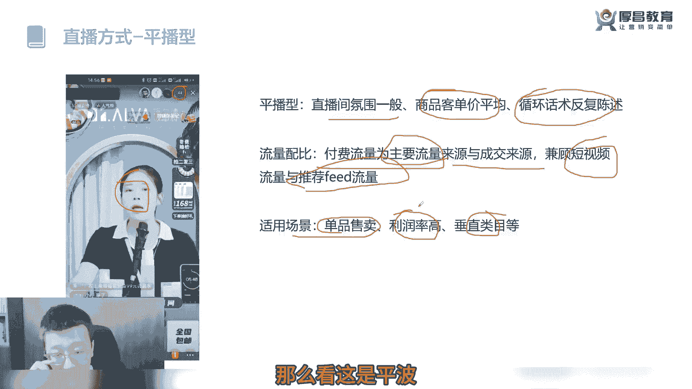

你看这个这就是一个加氢类的啊，没找美妆的，找了一个加氢的，嘉兴这块还不太过分，他的付费占比大概占到了55%啊，自然流量占到了31%，关注7%，它的广告RI2点多，整体RI3点多。

这种的话像平波的RI基本上都高。

都不高，加氢类目是个数据啊，这是直播方式，直播方式日播录我就不说了啊，日播录都是短视频配合，那付费的今天就不说了，好吧，今天我们就讲两款过款型和平波型，那么各位，你们觉得这两种哪个更适合去付费起号。

或者说哪个必须用付费旗号平拨啊，有人收款过款的出去平波，必须或者说尽量是肯定要是用付费旗号的，而过款型它不是说必须用付费起号，你可以通过自然流量起号，你可以通过付费去协助付费。

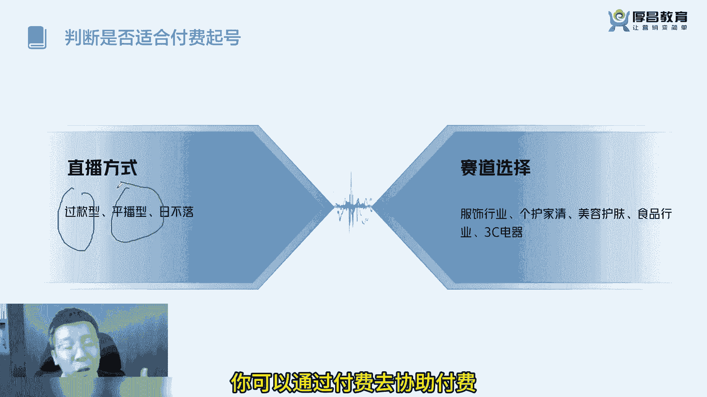

不是必须的，平波付费这块咱们刚才讲过了呀，付费是主要的流量来源，你不付费型号怎么播呀，平波刚才我说过了，像这种平播，你又不感兴趣对吧，长得也不好看，那你留不住人呀，拨款不是说全是付费流量。

不是说免费流量是在起号的时候，你的重要的程度，你说我过款能不能用啊，能不能用付费起号，或者我起号的时候能不能介入付费可以，但是呢不能够太过于依赖付费，就说我人货场，我过款的技巧，我不也不要了。

我全额付费，那么那样不行，我们在看赛道，赛道这块很重要啊，来赛道先看这个，来看这个服饰行业也是当前最卷的一个行业啊，服饰行业，服饰鞋帽对商品要求高，成本透明，为什么，其实现在做服饰就是在找爆品啊。

利润成本已经非常透明了，供应链已经非常成熟了，找到一个好款式，一个好的品类对你的喜好至关重要，很多现在你做作品的，你做做服饰的啊，大家都懂，退货率又高，对不对，又没有多少的赚头，利润率也很低。

但是为什么还有那么多做的供应链成熟啊，打爆品比较快，对不对，季节波动性大，一季一套，每个直播间里面的一个产品，如果说你是垂直类的啊，过完这一季就要换东西了，赛道成熟，有大量的成功案例参考。

如果说你要做行不行，比如说我有服饰的，你能做，但是你不要依赖付费了啊，退货成本高，需要提前考虑，你如果说经受不住退货率的话，就像我之前有一个同学应该是做，他说之前他是做淘宝的，之前做淘宝做服饰的。

现在家里仓库里留的衣服够他们穿两倍的，就这种，你该懂的啊，之前做陶器做服饰的，现在仓库里留的衣服够他做，够他穿两倍的啊，这种做服饰退货率，他的库存也很高的，投放目的像这种的，我们刚才说了，再到成熟。

而且的话对商品体验高，利润也很透明，成本也很透明的，建议大家自然流量起号付费的投放，目的是协调自然流量就不要占比太高了，你说我纯粹的使用千川去大大额币的，大额度的去提这种服饰类的是不太好做的。

不能说不太好做，非常好做，但是呢你后端不盈利，你不赚钱，最后可能说你的运营赚钱了，你的主播赚钱了，但是老板不赚钱，用金钱换时间付费是快速的帮助你起号，而不能够占比太高，一定要了解啊。

我这里会更多的会去说到啊，后面也会强调什么叫做协调自然流量，协调自然流量，我们所说的跳动也好，我更愿意现在叫它协调自然流量，我不叫他撬动，撬动的话，可能会有些同学会误解说我付费去投放了。

我的自然流量就多了，不能说没有这回事啊，但是说不是关键性的因素，不是关键性的因素，这里主要是通过付费流量的介入，帮助我们快速的进入到下一个流量池啊，也有更多的流量进来啊，是这个目的，我再看客户加轻啊。

我这里举的例子是一个做托板拖把的，这种分为了两种，像各户加轻行业低利润品啊，低利润品和高利润品是不一样的啊，刚才我记得有同学问啊，多少的一个毛利率可以去做付费比较合适，这里建议大家啊。

如果说你要去做直播的话，建议你的毛利率在50%以上，算是高利润品了啊，你的毛利率在50%以上，甚至高的能到70%，像美妆的能到90%，这属于高利润品，50%以上就属于高利润品了。

那么这个时候你就可以付费为主，你至少说付费，比如说100块钱，100块钱一个品，你的毛利率是50，那么你可以借助投入的一个费用，最多可能就赚50块钱，五一百的客单价50块钱，一个成本，50块钱一个成本。

那你的利那你的RY是在二，你的二是保本的啊，不排除那些场地啊什么的，那些费用咱先不算啊，那那样算就太复杂了，二你的RI是二啊，那么的话你的广告RI能够达到二，不算自然流量，那你就是盈利的，这经很不错了。

已经很不错了，而如果说你是低利润，低利润品，像这种啊，各户加亲，各户像一些护肤品的啊，每天抹脸的这种的日常的化妆品的，像这种的也是他需要去做短视频，做短视频或者说付费去介入啊，美妆各户日常的各户类用品。

还有加轻的，像厨房用品啊，清洁用品啊这些的，像扫地机器人，他就是高利润品，他就是付费为主，单品直播在线人数少啊，在线他基本上是100多，已经是非常不错的情况了，更多的其实就是带几十人，行业内卷严重。

价格战激烈激烈，利润空间比较少，更多的是日不落直播间啊，像这种的话，像这种家纺和这种加氢好多日不落，好多做日不落的，再者低利润品短视频流量为主，配合少量付费加速拓量，记住啊。

低利润品的少量付费做短视频去啊，高利润品的啊付费流量为主，优投放设置，配合直播间循环滑数，高利润品循环话术做啊，做平播就是这样的，各户加亲，反正每天我3号链接只要一上来就这样，你看就是都比较喜欢这首歌。

他就站着，只不过也是平锅，只不过站着去做，站着去做，他这里也有充分款来，我们再看美容护肤，美容护肤，我一个人手一年的用量，这是属于什么，这是属于货款还是评估各位的，OK来接下来和姐姐们没有点关注的。

赶美妆的又是美妆，美妆的基本上全都是听，不像这种美妆的用户需求量巨大，且需求持续年求高，做美妆，各位女同学，你们在直播间买过化妆品的，打打个777吧，女同学在直播间买过护肤品，美妆用品的。

在直播间打个777，有多少女同学买过的，而且的话你还会不止一次的去买，看到了就想买，经常会啊，效果这么好，我确实我今天满面油光，我要去做一做，搞一搞，而且的话粘性大，他们会不断的买。

真的是女人就买力还是真的棒，真的你为什么说女人的钱是最好赚的，不管说做什么产品啊，各位不管说你是卖什么产品，宝妈这个群体，绝对是付费能力最厉害的一个群体，品牌和白牌两极分化，品牌和白牌是不一样的。

白牌的话他可能会有一些动作呀，它在价格上会有更多的一个弹性，但是品牌这块它价格是定死的，因为它会有很多的线下的一个门店啊，价格上直播间不能跟线下差太多，所以说品牌反而是有时候不如白牌的白牌。

他可能会做一些秒杀，做一些福利，但是品牌这块基本上不让做投放，依赖视频素材，但视频内容把控审核很严，很难过审，各位有没有做美妆的啊，我最近是在做美妆，是真的难，这个视频啊，全部都是审核建议。

而且只要有一条视频，两条视频过审了，没有审核建议，叉叉叉跑的是非常好的啊，达人种草类的素材效果更好，如果说你能够授权一些达人，你的品牌可以去授权一些达人，去拍一些视频的话，效果很不错啊，不投放没流量。

不投放真的没流量，美妆直播付费流量是主力，付费效果看素材，这是两个啊，付费是主力，基本上占到了七八十%，如果说是最后做美妆的同学，美妆各户都算啊，付费效果看素材啊。

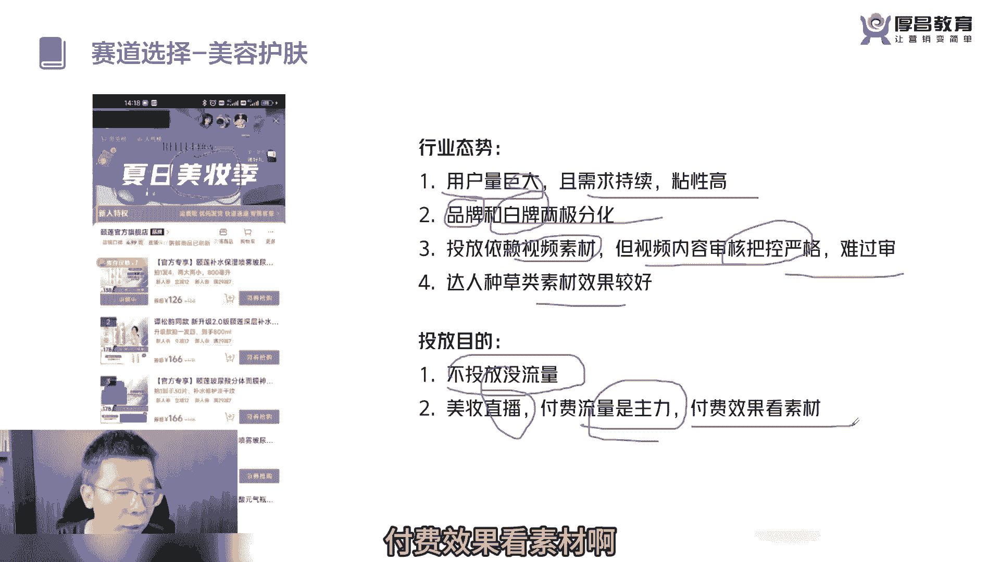

我们再看啊，视频啊，食品行业啊，打错字了啊，食品行业我们看这个快点上关注点，加两块好不好，明白一块九毛钱一整箱的大，我们来判断一下，第一个，第一个各位觉得他是靠付费还是免费，看他的客单价九块九，九块九。

六块九几毛钱，他是靠付费还是免费，第一个来我们看第二个，让客服一对一的给你服务，给你换啊，没有别的了，因为299这锅锅我们过几天就不会再送了，299398598补贴在里面，给你贴了一点成本在里面吗。

这就是不同食品行业，不同食品的类目，不同的客单价，它的投放方法也是不同的，投放方法也是不同的，高客单，像他这个299299这么多牛排，123434十二十二份牛排，299。

它是啊通过组合高SSKU导致的哥谭高客单价，你要单个卖，单个儿卖，你算起来挺便宜，但是组合到一块，他的客单价就高了，突出产品价值，保健也好，营养也好，你像他卖牛排，各位牛排这个当前卖的非常非常火啊。

他们打的都是进口的，澳大利亚进口，新西兰，进口啊，巴西，新西兰进口等等，各种进口的牛排要从国外印出来，纯进口的都是打的这种健康营养，高价值都是打的这种套路，高客单价过高，导致自然流量难有起色。

低客单价零时，那就是以自然流量为主了对吧，难以支撑过多的广告成本，付费流量主要是协同，像一些做清仓号的临时清仓的啊，这种号都是自然流量啊，今天报福利了啊，我们有个同学，他做零食非常牛逼。

他起了好几个号啊，都是自然流量，清仓号。

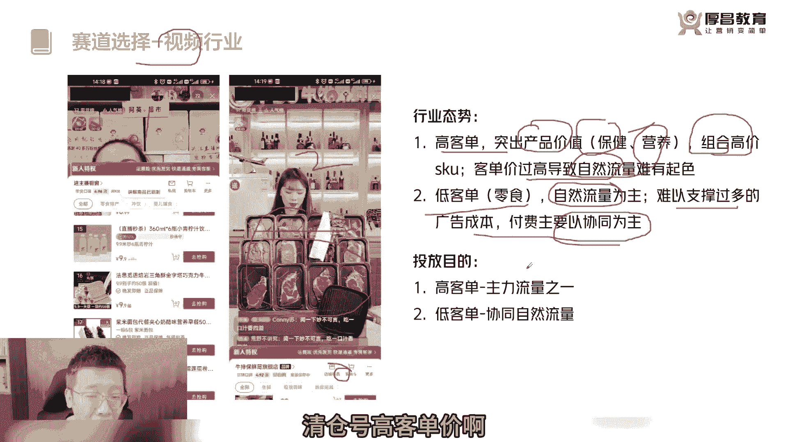

高客单价啊，付费作为主力，流量低，客单价协同自然流量，OK最后咱们再看一个啊，第五个咱快点过啊，半个小时讲完这个3C电器啊，刚才我听见有人响，3C电器起号3C电器的平波平波美女。

这还是一个品牌的品牌的啊，旗舰店其实它也是分为两种，它也是分为两种，高客单价对付费依赖大，品牌认知感强，价格优势不明显，因为像这种3C用品的高客单价的，基本上全部都是品牌品牌货，多组合SKU。

比如说有赠品，一下子卖两个，对不对啊，一下子卖两个，有多个刀头，他把客单价提高多赠品，而如果说像一些低客单价的低客单价，其实就是一些黑科技啊，更多的像什么，像我们做鲁班之前很多做那种黑科技产品。

小太阳有没有做的，有没有之前做小太阳的冷风机，夏天是冷风机，冬天是小太阳，还有最近比较火的脖子上脖子上挂的那个风扇，对不对啊，这种黑科技的产品啊，功能性他们打的就是功能性卖点，这种需要去视频流量去种草。

直播去收割，而这种就是混剪视频，通过混剪视频，你哪怕是通过一些扒来的视频哈，扒来的视频混剪去投放引流到直播间，也是平播引流，直播间就涨就记就行，这就是为什么说我建议大家。

如果说你是个人创业去选品去做直播，我其实建议大家去选那些鲁班之前咱们跑的品，明白吗，如果说各位，你问我哪些类目是比较适合去做个人创业，做人个人直播，你跑图文也好，你跑直播间也好，我建议大家跑之前鲁班。

你就看看之前鲁班有哪些爆品，我一直说的像什么多功能手电筒，渔具啊，户外用品，什么超眼洗眼镜盒，就是这种黑科技类的产品，它相对来说成本很低，成本真的很低，不值钱那玩意儿，但是它的售价功能性卖点。

而且他对视频的展示是非常可以的，而且之前做鲁班的同学，你们都应该会有非常强的这种混剪能力，非常强的混剪能力对吧，做视频是一把好手，我们可以通过视频引流到直播间，你的直播间再烂就是一个绿幕。

绿幕后面贴上产品的标签，就跟这个一样，把它的卖点做起来卖就行了，所以说两个高客单价主力流量，低客单价协同，自然流量与视频流量就是这种，那么我们来总结一下第一个干货，来今天第一个干货起号方法的四象限。

通过这四象限，各位你们之后再去拿到一个品类的时候，再去看我的这个品，或者说我的直播间的形式，我们通过这几个啊，一直播间的形式，二我们品的一个利润毛利率大概多少，对你是平拨的，还是说你是过款型的。

我相信如果说个人创业大部分都是平拨的，你是利润高的还是利润低的，你去选什么是高利润，刚才我说过了，你的毛利率能达到50%以上，就算不错了，就算高利润了，你就可以按照这个算平波型高利润诶，在这个象限。

像一些高价美妆大家电，甚至像一些黑科技的产品，它也属于高频的高利润，你像一些啊汽车的空滤，他其实成本很低，但是大部分市面上都是卖六十九九十九，它的成本可能是在二三十块钱，二三十块钱。

这种做直播也是平波高利润，那么这种就是付费为主，或者说纯付费，纯付费，通过付费旗号做主力流量，你的主力流量可能占到你直播间整体流量的，50%以上，占到50%以上啊，再者我们看如果说你是高利润过款型。

我是过款，我主播有能力，我话术可以，我可以通过一些技巧一些别单啊，我的福袋等等，不要停等等这些东西，像一些高端女装珠宝翡翠，它是属于过款型，利润也很高，这就是自然流量为主，配合付费或辅助去协调自然流量。

加速起号的一个过程，去突破流量池等等啊，如果说我是低利润，想加氢一个拖地机啊，能有多少钱，比如说图书它的利润非常薄的，甚至是赔本，自然流量，短视频流量，付费流量，多频共振，像这种的话。

我就建议大家短视频自然付费都做，那么你的流量可能是，自然流量占到四五十%，短视频流量占到10%到20%，付费流量占到20%到30%，是这样的，四十二十啊，这块30啊，70，其他流量十。

那有人说户外露营用品，咱们往里套啊，户外露营用品你要以什么形式直播，先看看你当前的直播间，你能够承受，或者说你的一个条件适合哪种户外用品，能不能去做过款，可以我可以做一些福利。

比如说一些我给大家准备一些户外，一些简单的护具啊，作为福利去放福利，放十单，对不对，你的一个福利品，这些都可以去放，只不过去选选哪些品去做福利的问题，再者我是高利润还是低利润。

那么你就要看你的产品成本和你的定价，和市面上别人卖多少钱，你的成本能达到多少，这个不是我决定的，我不清楚这个东西对不对，那么你去套看看你适合哪个啊，像我如果说你是做平波，比如说像这种户外用品的。

我建议是在户外直播，如果说没有条件，你做绿幕行不行啊，绿幕往上贴去展示行不行，比如说我是做帐篷，我是卖帐篷，或者说我是卖这种啊，就卖卖帐篷，我在直播间去卖帐篷，后面我全是帐篷，我做单品，我做平波。

首先我是平波，我是低利润，如果说我是低利润的话，利润不足百分之，毛利率不足50%，那我就是自然我做短视频，我都付费自然流量一起去洗，一起去洗，如果说我这自然流量我没有那么太高的技巧。

我平波的一个话术也不行，那你就在重点短视频上，你去多去混剪视频，多去拍视频，多去拍一些家庭户外的视频，如果说你是过款型，但是低利润，像这种普通女装和临时的，那你就是以自然流量为主，像这种能过款的。

你有能力去过款的，而且利润比较低的，那你就去做自然流产啊，有人说造产品，艾草产品属于什么艾草产品的话，基本上不会去过款，不取款也是拼搏，其实大家都是做拼搏，做平波啊，利润有多少，艾草其实利润很高的。

利润很高的，那你就可以做纯付费，你的付费流量可以占到你流量的70%，到80%，像艾草的话，我们之前做过图文的，像做过图文的一些品，其实做纯付费，做出直播间的纯付费几号绝对没问题的，此处可以有鲜花。

所以说大家把这个四象限截图出来，截图出来，明白吗，那么你就对比一下，我当前直播间能做的是过款型，还是说平波型，平波型，我的直播间状态，我的直播主播的形式能不能支撑我去多拨款，再者我的利润是高还是低。

往里一套，我一对比跟他们像不像，对不对，我就看知道我接下来是做哪种流量了，是做哪种流量了，所以说总结一下，总结一下当前我们说的两种纯付费起号，做主力流量和做辅助流量，协调自然流量就这两种。

那么我们就按照这两种形式去讲他的策略。

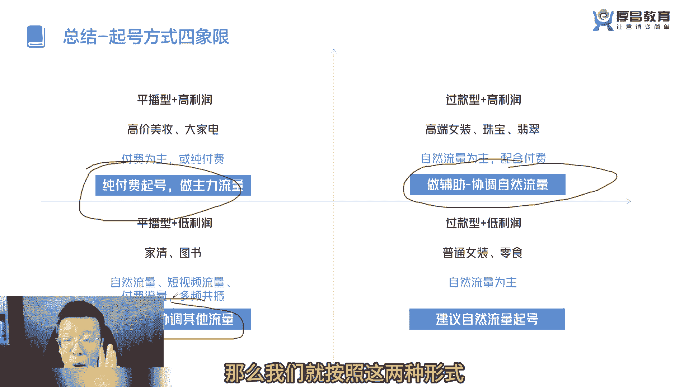

讲他的策略好吧，啥时候过款，如果说刚才讲过的，刚才没来的同学回去听录播好吧，我不再回去再去讲什么时候过坎了，上上面我刚刚刚讲了，既有福利品又有利润品，有福利品，有影流品，有福利品这种过款型啊。

平波的就是单一的平啊，第二个偏穿起号的投放策略。

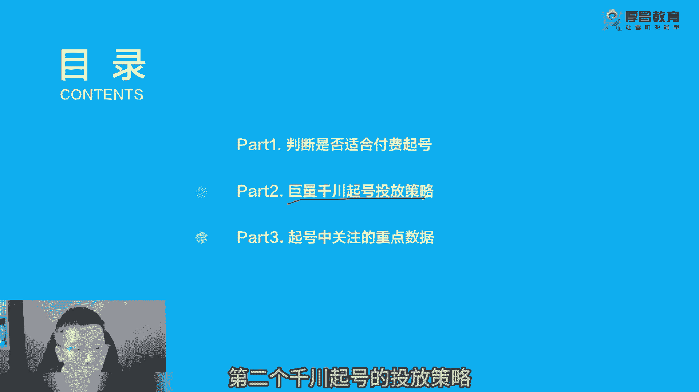

我们刚才讲过了，我们千川付费在直播间的纯付费，主力流量做辅助协调，自然流量就这两个作用，首先我们看纯付费这个图，大家可以截下来，什么是策略，就是从这几个方面去做，如果说你确定了你的直播间是平波加高利。

高利润的产品，OK你就是纯付费，纯付费分为这三步走，第一精准流量打标签，打标签大家都得听得耳朵都磨茧子了，那么我们需要重点关注什么，在打标签的时候，重点关注直播间停留，互动数据，能够保持稳定的在线人数。

明白吗，你不需要说什么，你不需要太高，有人说我是纯付费的，各位我不需要我的直播间啊，几千人在线，上万人在线，各位我不知道不需要上万人在线，我就能够有稳定的二三十人，三四十人，多的100人，这就够了。

精准的流量付费，你要做纯付费，不要不要追求高在线，明白吗，不要追求高在线，高在线反而是流量反啊，小店随机推我的投放方式，投放方式记住了啊，小店随心推达人定向，你选择你的对标达人。

或者是说基础殿下只限定年龄，性别地区年龄性别，基本上比如说我是做纯付费做什么呢，比如说刚才我做帐篷做做纯付费，我找几个户外的达人，我去给他投放，有人说我是投放他的所有粉丝。

还是投放他的一个直播间的互动人群，购买人群也不用只投放粉丝，或者说只投放下单，这些人去全选上，不用刻意去做啊，基础定向只限定一些年龄性别定，那户外的人可能会主要是男性居多，我先投男性，大概是在24到啊。

或者说十八十八到30岁这部分年轻人，我先投这部分人，或者是说极速推广达人定向基础定向，这极速跟小店随行推一样啊，只不过他这里最少300块钱预算，小店随行推是100，所以说建议大家是小店随心推去投100。

100去投啊，专业推广莱卡定向啊，如果说有人说啊，我刚开始没有口碑分，我没有30单啊，我想打标签啊，我小单最近推不了，我推极速和我推专业莱卡行不行，行没问题，这里注意啊。

起号期间你跑莱卡定向不要加太多次，甚至说你可以只选电商互动行为啊，我这里有做过千穿的，应该都知道，行为词那块有电商互动行为，资讯互动，习以为app推广互动行为只选择电商互动行为，勾选上词不用加太多。

就选择核心词，比如说帐篷，帐篷有几个，我看十几个词，跟户外有关的，我几个产品我选上十几个够了，不用说加我加50个，100个，我加精准的进去，这一块就加一个产品词，就加一个帐篷，或者说你有其他的。

可以加上产品词就行了就行了，优先控成本投放跑量困难，可以尝试放量困投放，比如说我客单价是99，我100啊，出价到150了，还是没有消费，还是量少，OK跑放量去了，300块钱预算跑放量去啊，外增创意。

根据类目属性和资源情况选择投放方式，你看你是短视频引流直播间，还是说你是什么呢，你是直投直播间，我说我短视频多，我多投点短视频行不行，可以我知道没有短视频，这里注意啊，刚才有人问了，那会不会跑不出去啊。

你肯定跑不出去成交，我这样跟你说，你起号成交肯定跑不出去，像刚才我所说的，纯付费，一半成交优化目标，一半浅层优化目标，根据流量逐步放开，有人说看到老师，我成交肯定跑不起来，我跑起来了，你总有跑起来的呀。

总有跑起来的，那你说我肯定卖不出去，99。99%行不行，还有0。1%，咱不说绝对的啊，一半浅层目标我成交跑不动，大概率跑不动，99%的都跑不动，你可以放开，先淘宝下单下单，看看能不能跑，但是下单是真差。

现在哪怕他跑动了，但是呢不付款，建议不要跑，对啊小郭说的对，下单能不能跑，你可以试，有人不死心的，可以去试，但是呢你可能跑起来了，有下单，但是就不付款，你还不如去投放商品按钮，点击，或者说进入直播间啊。

就说为什么说刚才我要大家限制那么精准，限制那么精准的定向，莱卡定向达人定向，你也可以选择刚才我所说的宽泛点播放量，这里要干嘛，投进入和商品按钮点击是要去重点关注，去做互动，去做停留直播间啊。

如果你是传传付费，咱们平播没有什么东西，主要干嘛呀，去做一些律上的优化，五维四率上的优化啊，甚至是六维四率啊，如果说还有人不知道五维四率是什么的啊，去去上创意店看看。

或者说找我们助理给你发链接吧啊五维思虑，如果说是是什么呢，是我们投手和运营非常重要的一个工具，非常重要的工具，因为的话由数据可以给你表示你当前直播间，他的一个比啊，进入商品曝光率啊，曝光点击率。

点击下单率，下单成交率啊，这五个绿值它哪一个出现问题，当你把你的数据填写到那个表里之后啊，看看哪个数据哪个率值是低于大盘的，那么就去优化这个数据，它给你提示的内容就行了，是你的场景，是你的话术。

是你的B单还是你的商品的牌品，还是你的曝光，商品曝光不够，有问题去解决问题好吧，这是第一步，先打标签，先用浅层去打标签做停留，找直播间的问题优化好了，慢慢的我们的成交计划就出去了，各位注意啊。

成交计划是要开的明白吗，成交有人说我成交计划跑不出去也要开着吧，开着啊，每一场直播都开几条，不管说你是用小调速应推答案定向，还是用极速啊，答案定向啊，尽量是先用控成本跑着，如果说你着急着急放量。

你可以少放量，但是不要太多太多的话，容易导致你直播间付费流量特别大啊，第二步，我直播间当前成交计划能跑出去了，各位到这一步了，我直播间能够有二三十人稳定在线，我成交，我每场直播都能够有稳定的一些在线。

能够有稳定的一些消费了，我成交计划跑出去了，能有十几单了，能有十几单了，OK测试维度找标杆，测试维度找标杆，重点关注成交和ii数据，找出最优的投放组合，这时候就重点去测试你的一个成交转化目标了。

浅层就不用太多了啊，甚至说就不投了，要选择你直播间，当前是炒得好，极速控成本跑得好，急速放量跑得好，专业控成本好的好，专业放量跑得好，哪种跑得好，要去测，不跑成交就去测啊，这个没有肯定的。

就像有同学说我说我放量跑的好，我就不说我都是空成本，大部分都是空成本，现在我给大家说啊，当前整体上成交转化目标和RY转化目标，跑的比较好，提速成本稳投，有没有跑的好的。

作为你账后主力的打个一极速成本本投，不管说你是成交转化目标还是RY转化目标，占到你账户计划的主力的投放方式打一再者啊，急速速极速偷啊，急速推啊，就是控成本，极速控成本啊，不是成本本头了，急速成本稳啊。

极速控成本投放是占你计划主要投放的打二，再有一个就是专业RI，专业RI有没有这样的计划的，同学在评论区打三，基本上当前已经测试出来啊，我这块大部分账户都是这几，这三种方式占了大部分，你说有没有放量投放。

跑得好呢，有但是呢我这不多，所以说大家在跑的时候找你的标杆计划，标杆计划重点往这儿去找好吧，根据跑量和RI最优的方式去投放哪个，它的跑量效果最好，而且消费能出去就去跑。

这个根据跑量LY方式选一个也是短视频，跑得好，还是直头跑的好，99%的预算，给到成交和RY优化目标啊，这里注意啊，肯定有拉垮的，不能一直跑的好啊，注意啊，在我们在投放的时候啊。

特别是当我们已经到了一个比较稳定的阶段，不要全部都跑通透，各位啊，有没有现在账户里全部是跑通投的，来打个666，我就拉满通透，跑得好，我就只跑拉满通透流量啊，这样会使你的直播间进入到一个限制。

或者是说你可能会有的所说的自然流量，压制自然流量，因为通投通投本质上其实是推广账户，按照直播间自然流量的模型，账户的模型去投放的，这个时候我建议大家啊，你去投放一些莱卡定向，或者说相似达人定向。

偶尔去投一些，有人说我跑不起来跑不起来，你跑放量去一定要跑一些啊，这是干嘛呀，这是给你的一个账户，给你的直播间去破签，去带来一些新鲜血液，而不是说啊只一直是顺着自然流量跑，我痛到我是省劲儿了。

我只见通投复制计划就行了，但是可能会导致你的直播间的流量越来越窄啊，有人说啊对来看RY不好，就是RY不好，就是ROI不好，因为你什么，因为你是带来的新鲜血液，带来一部分其他流量，比如说我是做美妆的啊。

我刚开始全是通投，我跑的可能会去做一些什么呢，我去投一份拉一部分什么的，拉一份高端女装的词，我去拉一波女装的词，我拉一部分去皱的词，我拉一部分去痘的词啊，我会去拉一部分，偶尔去投一投。

不用多500的放量放量投放，因为你我相信大部分，你们跑控成本肯定跑不出去，你是用极速极速放量成交啊，都是啊，成交就行，用成交去放量，还是说用什么IY很难看，没事偶尔跑一跑，跑出去一些。

让直播间气带来一些新鲜血液，让他去跑一跑，这样可能会拉低你的广告RI，但是会拉低你的广告的GPM就要拉低他，不要让它实跟你的一个自然流量的一个GPM，差别太大，听过正式课程的。

应该知道为什么会压制自然流量，他们两个差别太大了，你付费转化太好，付费转化太好了，对不对，那你转化太好，系统给你分配更多，但是你自然流量就转化不好了，直播间全是付费流量，全是付费流量的问题。

那么你剩下那些自然流量的用户，对不对，问到的问题，那么你可能就解答不了，那么相应的他们就留不住，就成交不了，这就是付费压制免费，有没有同学已经悟了了，打个666，你占比低就不用考虑这个了啊，你全是付费。

你也不用考虑压制免费了，你就没有免费，你就没有免费，没有免费了，你全是付费就不用考虑了，全是付费，你怎么投的好就行，但是全是付费的话，也会触到瓶颈，什么瓶颈呢，当你要放量的时候，老板要我要更多的量。

我要更多的量，也建议大家一定要在适当的时候，当你到瓶颈的时候，或者说当前你发现啊，你的付费流量占比越来越高的时候，去刻意的去拉低LY并不是说我带来垃圾流量，而是针对性的带来一些其他的标签流量。

其他的标签里的其他的用户，我再去带来一些洗一洗，这就是为什么说一些新的直播间，各位你们刚开始起号的时候会有极速流量，流量会有R型的极速流量，当你的直播间稳定以后，你的付费流量占比越来越大之后。

你的极速流量会越来越少了，你的直播间刚开始可能会有一小波啊，一些自然流量，但是后面没有那么高峰了啊，很稳的就下来了，是不是都是这样呀，为什么没有在没有泛流量了，没有泛流量，我们就要自己去带来泛流量。

要么通过你的付费的啊，要么通过你的付费去圈选一些其他的人群，或者说通过免费啊，我再去啊，比如说我经常会去说的，你直播间来送，今天抽抽五台IPHONE叉，Iphone12，IPHONE13啊。

我就简简单说啊，比如说通过一些高反，通过一些免单对吧，我去憋一波，我去憋一波泛流量对吧，然后再去洗一下，再去洗一下，抖音都在通过我们的直播间去洗流量，为什么我们自己不洗，流量必须是不断的洗，不断的扩。

然后再洗就行了好吧，自然流量哪里来，自然流量哪里来，自然流量通过你的运营手段，通过你的主播去，通过你的互动，通过你的停留来呀对吧，然后裂变组合去拓展，根据测试出来的最优维度裂变投放啊，降低测试成本。

提高准确度，就是刚才我所说的裂变，你去测啊，比如说我这我现在通透极速控成本跑得好对吧，我试一下极速达人对吧，我试一下专业控成本系统，推荐我试一下极速成本本投，我都偶尔要试一下，对不对，我绝对变去。

你像我专业专业推广，如果说我考得好的话，专业ROI跑的好，我可能都去换标签，我经常会去变换标签，所有的标签我都会换一遍啊，经常会去这样去裂变，去去跑，哎这个时候这个时候直播间动作，像这种纯付费的直播间。

纯付费的直播间基本上就是循环话术，5分钟循环话术对吧，哎留人刚开始啊，刚开始有一段大概是呃一分钟啊，一分钟留人的话术，刚才到高峰了，我留人刚来直播间的宝宝们，今天呢是什么什么专场。

一号产品是今天开场的一个巨大的福利啊，怎么怎么样对吧，再者逼单话术，PO宝已经给大家发321发单了，pa宝宝一定要去做，然后回家之后啊，怎么怎么用怎么怎么用，然后用完之后的话，一定一定注意这几个事项啊。

否则的话反而会起到反效果对吧，就这种啊留人话术，然后呢讲解话术，逼单话术，促单话术啊，来回去做，来回去做对吧啊，直播间中间去建几条计划，也是追计划玩嘛，这个看你直播间的情况呃，如果说你的直播间是呃。

如果说你的账户是以ROI出价为主的，可能你是要去多建计划，多见计划，如果说你的直播间是以成交为主的，你可能会有爆款计划，爆款计划可能两三个计划，它的量就够了啊，但是每场直播我们都要建计划。

每场直播基本上都会更新，80%到90%的计划啊，留下上场直播，他的RI比较好的计划，留下继续开，然后再建一大批计划，再建一大批计划啊，这是循环话术直播间动作，你看啊，我们看案例啊，看案例。

这是一个纯付费的白牌女装的起号过程，来看这个数据啊，这是从2月1号，今年2月1号到今年7月份啊，就是前几天还在投放的啊，618618达到一个顶峰消耗啊，618到啊，618日消耗36万。

618日消耗36万，你看刚开始啊，从2月1号到4月份，中间有过投放，有过3000块钱的投放，有过一周的投放，但是效果不好，然后4月份重新开始之后就起来了，我们看这个是怎么小号的啊，这个是纯付费。

在2月份的时候，2月10号，2月11号这几天投放了大概有五天的时间，效果很差，你看这块他的消耗了一共是8000块钱，但是他的支付RI值有0。32，非常非常的差啊，就算美妆啊，美妆白牌的啊。

甲方给到的目标是一一的RI1打2I，但是当前投到了0。32的RI，特别特别差对吧，花了8000块钱，将近只有产出了，产出了2500，惨不惨对吧。

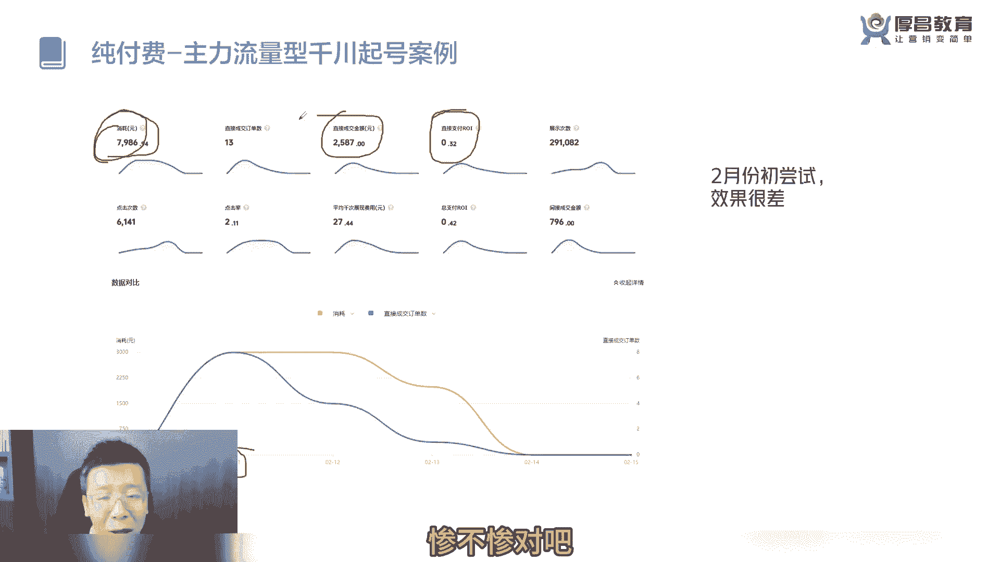

这是为什么，这是这个数据，这是这个数据，大家可以明显的看到啊，付费流量占到了65%啊，自然推荐流量20%，关注4%，所以说这个号基本上没什么推荐啊，都是付费占到了5%啊，65。

而且的话你看整体的GPM2000，广告的JPM1500啊。

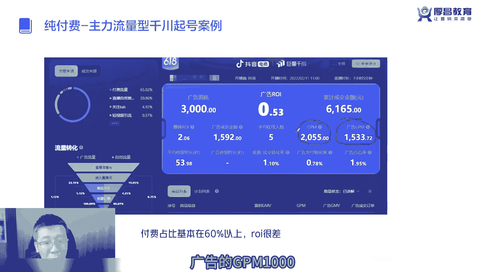

广告还更差一些对吧，JPM更差一些啊，我们看数据啊，这是这是到2月份，2月份2月份我们投放的情况啊，这里投放的情况都是下单啊，成交下单商品按钮点击点击，就说刚开始投不出去，刚开始投不出去。

刚开始我们投不出去，只有下单的能投出去，但是下单的他的RI很差，只有0。540。54，然后下面一直投不出去啊，点击的啊，商品安全点击全部都是矩阵号，粉丝全是用的达人相似粉丝，因为做达人这种的。

他的一个做做美妆的，做美妆的一些达人是非常非常多的，所以说刚开始全部是用的达人啊，有视频有直投对吧，矩阵达人粉丝去打标签，去起号，然后深度转化目标量少，配合一些浅层的转化目标，你看这成交这三个成交的啊。

三个成交消费300多500多啊，也是没有转化很差，所以说开始用下单下单啊，除了这个计划消费比较多之外，还是不行，我就换成了点击对吧，出价六块多，点击出价六块多对吧，然后我们看4月份到4月份。

4月份我们换了主播和直播间脚本，换了循环话术，换了主播之后，达到了1。2目标，我们的目标啊，美妆白牌美妆目标是一的RI，已经非常非常合适了啊，你看一共是4月，从4月7号到4月8号开始去做。

这几天时间就把号起来了，你看消费消费日消费6万，日消费6万，到最高的时候，基本上是通过1234566天的时间，六天的时间达到了日消费6万，有人说你这么滴答RI白牌美妆啊，就是这么滴答RI。

我们看这是消费者一共17万，成交订单金额913，RI是1。19，已经很满意了，总的支付RI能达到1。4了，快这已经赚钱了，1。2就赚钱了，我们看一下它的一个过程啊，出支付ROI优化目标。

4月份当初出了呃支付RI，而且搞到了爆款视频，就专门去找素人，也是找素人，没找达人去拍了几套视频，配合一些对标达人定向直接就起干了，视频报了，这个要注意啊，视频在这里非常重要，特别是对美妆来说。

如果说刚开始你你的直投RY一直很差，各位如果说刚开始你的LY直投，直播间的RI很差，建议多去去测一些视频，哪怕这些视频是翻翻拍搬运的，如果说你没有能力去拍搬运的也行，一定要去测视频。

特别是当你直投的RI比较差的时候，你的直播间能力比较差的时候，视频绝对是一个插入点，而做视频的时候，这里注意，当你有一个视频，你看这里啊，为了美啊，视频合集，为了美，为了美，这就是一个视频的一个代称。

视频的代称，发朋友圈懂什么，不要这都是视频的代，全部都是视频，而且全是支付RI，看到没有，全是支付RI，这里会有一个极速稳投，极速成本稳投，这个支付RI当前是真的不错，真的不错，它都都能达到1。

2度的RI，而且是直接支付RI是这样的，所以说这块如果说你是纯付费流量，各位纯付费流量刚开始的话，你用对标达人也好，莱卡也好去投放，后期都是以成交为主，如果说你的直投的一个效果非常差的话。

或者说RI不好的话，一定要去打包视频，打包视频的时候一定要做评论的维护。

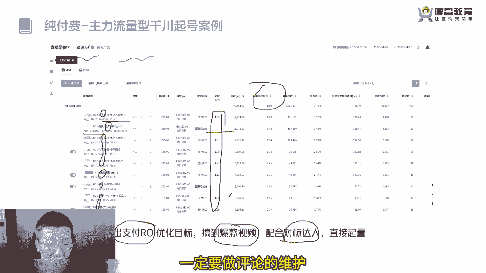

好评的维护，好评去置顶等等啊，这些东西配合答案对标，直接起到了看付费流量占到了69%，这是基本上是一个纯付费了，自然推荐流量12%，关注4%，短视频引流7%也会发视频，视频流量来点就是免费的。

免费的视频流量，只要有每天都会发视频啊，广告消耗11000RI1。68啊，累计成交6万多，这是多个账户投放，多个账户投放，你看有人说啊，你这广告I只成交了六啊，2万多，但是流量占比占到了70%，将近。

这是多账户投放多个账户，投放单账户的RI能达到1。68啊，如果说你要是做纯付费，一定要多账户去测，因为每个账户它是不一样的，各位每个账户他的一个投放效果，投放的量级是不一样的，注意啊。

有的账户他就这个视频能过审，另一个账户视频就不过审，有的账户他就能起来量，另一个账户怎么优化，就是RI很差，特别是纯付费的。

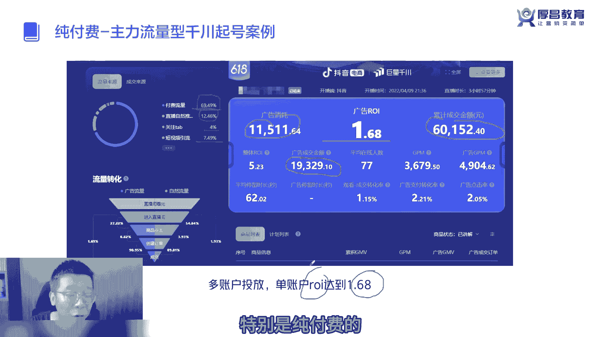

一定要考虑多让户去投啊，找到爆款视频带动铅酸账户起量，你看这里爆款视频视频啊，消费消费2万1万4都是视频的消费啊，各位各位知道，如果说你们会看创意报告的话，会看创业报告，创业报告后台如果说是的话。

直头那里就会有画面，就会有画面，而不是这种视频，好吧，上面这是纯付费总结一下啊，纯付费几号去打标签，刚开始如果说有达人的，像美妆有很多这种达人的，用达人去对标，你用小刀自行推也好，用极速版也好啊。

或者说用专业莱卡也好去打标签啊，如果说你没有一些对标达人去打标签，先投这个，后面呢主要是转成成交和ROI的出价，去测哪种投放方式，你是最好的能够优化出优，优化出来你的比较好的RI的，再者如果说直投不好。

一定要去重点去做视频，特别是像我们这种平波，平波加我们的一个利润又高，对吧啊，你的苹果主播状态不好的话，一定要打视频局啊，来看往后做辅助又不一样了啊，各位该截图的截下来，该截图的截下来了好吧。

又是一张图，做辅助的头发和刚才你要去做付费，像刚才第一种付费做主力流量，你的付费占比都占到了60%，70%了，我们就不考虑什么付费压制免费了，直播间就没有免费流量，就没有自然推荐流量，或者说很少。

那个就不占我们重要作用了，而像如果说我直播间还需要免费流量，怎么投，投放是不一样的，来截图啊，首先轻量投放补流量啊，你就不能够像刚才那样，你直接介入，说直接大额度的去投了，以直播间自然流量为主，付费。

在开播极速流量过后去补流，帮助场关进入第二第三个高峰，这里建议大家小调随形推，我不建议大家用PC端了啊，直接用小调随形推，不建议用PC端用放量投放，直接用放量啊，别用这种控成本直投直播间，接投放直播间。

浅层转化目标为主，中场补量，这个就是刚开始一波流量，你直播间一波流量来了，下去了，又没流量了，OK补100块钱进入直播间啊，用达人定向也好，用年龄性别定向也好，都可以啊，只限定年龄性别也可以。

100块钱，你最少的300块钱对吧，你先少个300块钱，建议大家是100块钱一个小时，100块钱，1。5个小时，100块钱两个小时，这样阶梯投放一共300块钱，这样会更好。

别一笔一下子300块钱更好一些，配合少量的成交目标，说我可不可以投几个成交啊，我300块钱预算投小店随应堆成交行不行可以，但是你时段拉长，拉长到你的直播时间两个小时啊，这样去投有两个。

刚开始起号完毕之后，起号全是通过自然流量运营的流量去起号，当你的直播间能够稳定，像这种直播间，你的直播间的流量基本上在线能够达到100多，200多，高的能达到556百，这种代谢高。

代谢大部分八九十%都是自然流量，那么你投付费只有这两个，为什么说我这里有两个二，不是写错了啊，这两个R不是选错了，这是不同的目的，这是当你的账号起号成功之后，你再介入付费，再投放付费，你的目的深浅。

结合破层级，深层转化目标和浅层转化目标一起去投，去破流量层级，什么意思呢，当前你直播间啊到了1万的场关，一直上不去了啊，怎么优化直播间怎么去做，我这优化我这上不去了，流量涨不上去了。

那你这个时候需要去介入，增加付费的额度，破圈来去破破层级，当自然流量的场观再现，JMV遇到瓶颈，通过付费流量提高场关和GPM，突破到更高的层级，这个时候推广方式看这三种系统推荐，就是系统推荐。

各位不要用什么莱卡，不要用什么达人免费流量，让你的免费流量带着付费流量去走啊，就用智能定向成本稳投不限定项，你最多限定上一个年龄性别啊，最多限定上一个年龄性别啊，其他系统推荐就可以了啊。

优先控成本少预算投放量啊，你说我控成本量太少，补点放量行不行行啊，主要还是控成本啊，空成本能跑下来的，跑控成本，根据跑量和RI的最优方式，选择短视频还是直投啊，90%深层转化目标成交。

或者说RI10%浅层优化目标，做人气和中场补掉，还是这个浅层目标，我建议大家全都是用小单随形推去补就行啊，有人说小道具，那太麻烦，我用PC端行不行，唉没啥问题，你自然流量好啊，你用都行。

但是小的量随星推，它对我们自然流量影响会更小一些，所以说能用小调儿随星推，用小刀碎星推，我说我用不了啊，我用极速达人行不行，我用极速放量行不行，我用专业放量行不行可以，但是定向这一块的话，别限制太多。

让自然流量带着付费流量走成交计划，提销量啊，上面这个是破层级，你需要去投浅层去增加增加你的付费的预算，而提高销量这块付费作为销量的补充啊，深度转化目标投放，控制流量占比在20%以下。

就是说如果说你的直播间要去做自然流量，推荐流量不影响到你的付费流量，不影响到你的自然流量，尽量是保持在20%以下，一定不要超过30%，否则的话，再高就可能会使你的自然流量减少了啊，保持这个度。

保持这个度，在这个度的前提下去增加你的量啊占比，那一定重视，自然就像我刚才所说的，付费为什么会压制免费，这其实是假的，因为你付费直播间的付费的流量，付费的访客太多了，他问的因为付费来的都是精准的用户。

他就是来成交的，问的问题都是啊，我这个该怎么去用，我买了之后有什么什么福利，而不像一些泛流量，泛流量来了之后，他会问啊，这是什么呀，啊，直播间是做什么的呀，啊我怎么去看呀。

那可能你就很很少的话术去再去讲这部分了，那你就留不住这部分人，中间也是一样，还是用系统推荐向自然流量为主的直播间，建议大家用用系统推荐，你想要去破圈级，就像我刚才所说的，你想要去破圈的，破层级的。

那你再去加上莱卡去破圈，好吧啊，不要诠释大部分，如果说你想要去增加流量，或者说想要去维持的，用系统推荐RI是最好的，但是你想要去破层级的，再加上莱卡，再加上达人，再去跑一波，它的优化目标。

深度转化目标为主两个表，记住啊，截图下来，后面是不分享PPT的，只有录播，所以说刚才那两个表，一个纯付费为主的，纯付费的和一个做辅助的，带自然流量的，它的玩法是不一样的，此处可以有现化。

为什么说我们在投放的时候是将要讲究策略的，你不同的一个投放目的，你不同的一个最终的直播间的目的，它的投放方法是不一样的，如果说你投放错了，反而会是你的直播间变差，流量变少，来直播间的动作很重要啊。

刚才我们说了我们投放的策略，再者看我们直播间的动作，开播的时候低价引流品，因为我们是货款型的，我们是过款型的做协助的啊，引流平A提高人气啊，精准定向浅层目标带来大量的精准曝光，有极速流量的可以不投。

如果说我直播间有极速一波流的，我可以不投浅层目标，先转化我的自然流量，如果说没有的，刚开始先来一波，先来一波精准流量进入直播间，100块钱小单水星推，或者说啊300块钱啊，商品研究点击都行啊。

直播过程中高价利润款B啊，这个时候就要做成交了，深度转化目标宽泛，定向自然流量带动付费流量去成交低价引流款，这个时候又有了直播过程中，他俩来回做提高人气达人和自定义年龄性别，浅层目标放量投放。

快速补人去，当我们直播间啊，刚开始没了之后，这波我要上我的一个利润款B利润款B，再者下面到这个时候，我要再次去上我的引流款A，再次上我的引流款A同时我直播间也要多做啊，我不管说用极速也好啊。

我用再去小招随行退也好，再去补一波量，做好ab不同款的切换，获取更多自然流量，付费流量注意啊，付费流量的目的也是加快精准人群的进入量，帮助提高直播间整体的GPM冲击更高的流量池，流量下滑时。

通过付费流量去快速补量，避免的这句话一定要注意注意，避免人数下滑导致的掉流量层级，理解一下下面这句话啊，什么叫做流量下人数下滑导致的流量层级，各位你们有没有碰到过，我本来上场直播很好的。

但是这场直播由于我没接触开播的流量，一直人数上不去了，上场直播我能够最高达到百分之，能够达到100%人的在线，而现在这场直播刚开始一波一波，自然流量没接住，一波来了，正常的后面成交密度没做好。

然后后面一直是个位数在下这八个人，这个时候大家都的策略是干嘛，是关播，等一会重新开，关播重新开，这是为什么，刚开始我们一定要及时的去补量，及时的去补量，当出现人数下滑的时候。

一定要去通过进入直播间去补100块钱的小赵，随星推，或者说你当前千川账户签专账户，去投个300块钱的进入直播间，哪怕中间去停了，到100块钱，我去停了，先去补人好吧，或者说你去提价，有人说我提价行不行。

行没问题。

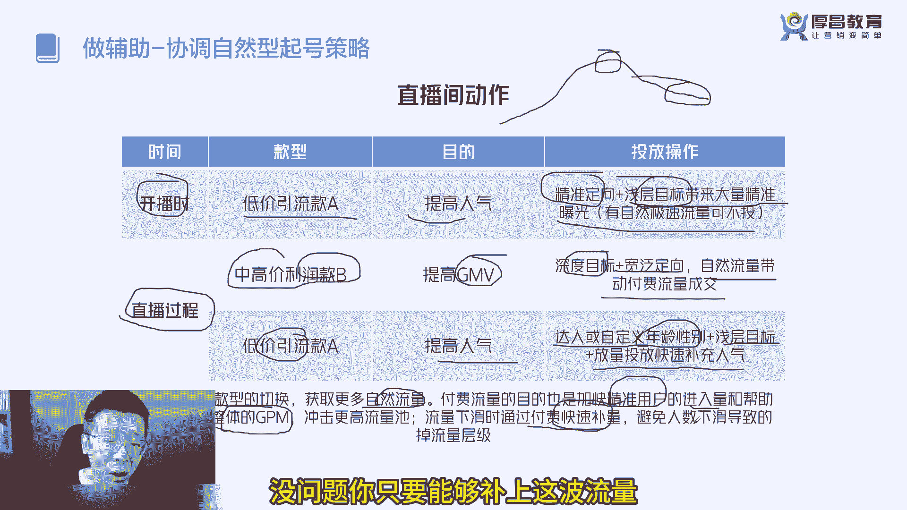

你只要能够补上这波流量，不要你整体直播间的流量，下降掉流量池就可以了，来看这个数据，这是一个单品厨房用品的单品啊，这个也是一个平播的平播的来看这个付费流量，他刚开始这是第一，前几天这是第一天。

第二天起号的过程，第一天他就能达到2000的场馆，已经很不错了，很不错了，看他这个就是一波流，很多自然流量起号都是一波流，看下边这个这个还好一些，起来了，付费流量占到了12%，下面占到了47%。

自然流量起号啊，配合小叉去应推，为什么说它这里找了呀，其实我们投放的投放的小店随心推，金额是没变的，只不过我们整体的场宽增加了啊，导致占比减少了。

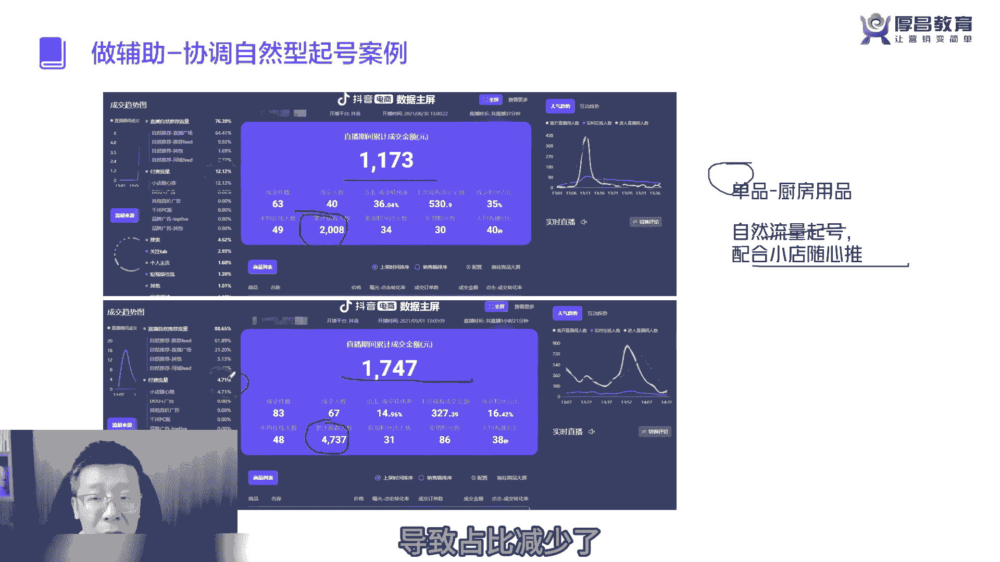

自然流量是增加了，小店随心推效果不错啊，占比不高，付费流量占到了5%，可以直接介入千转投放啊，这这么说，如果说你刚开始付费流量占比太大的话，那你要先去调整直播间，先去调整直播间，把自然流量转化。

再考虑去介入千传PC端，如果说你直接去介入千川PC端，可能导致你的付费流量占比更大更大，你看这个啊5000多啊，广告1。781。48的RI，但是整体的话是7。16的RI啊。

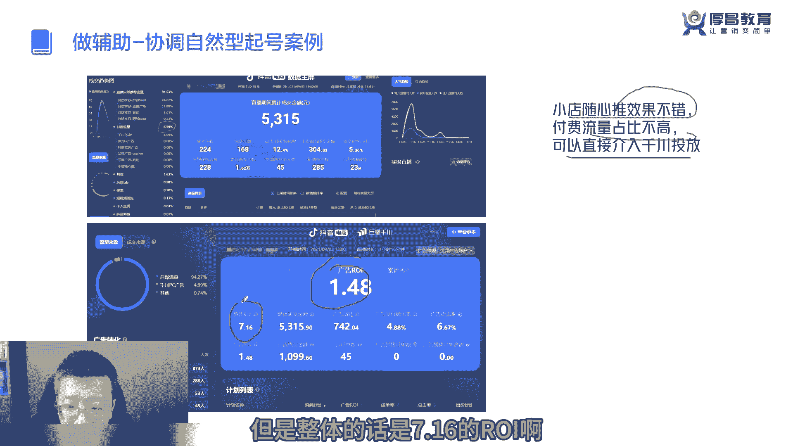

这流量占比很大，这个从9月1号啊，看看这个这个是从8月30号。

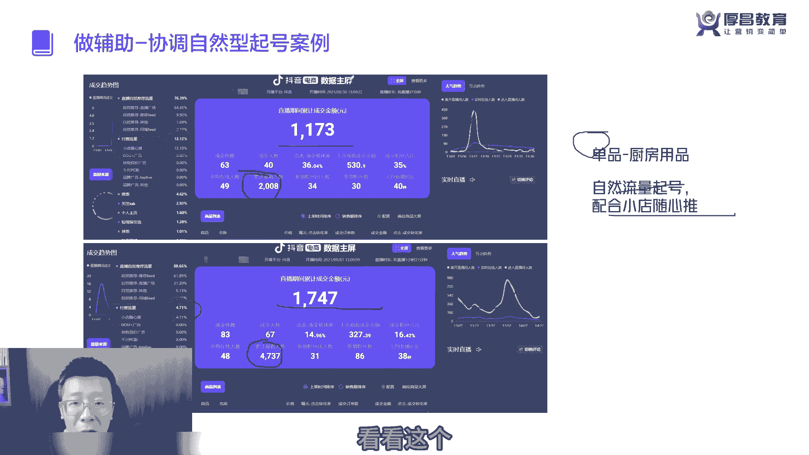

9月1号到10月到10月1号。

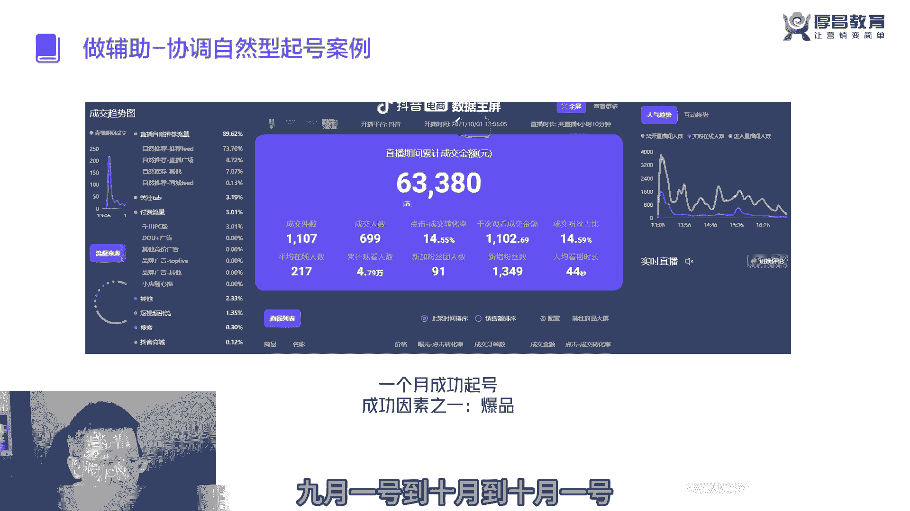

整个的一个起号的一个数据，你看的话，刚开始这是一个自然流量为主的付费流量，去撬动，刚开始用的是小调随行推，小调随行推。

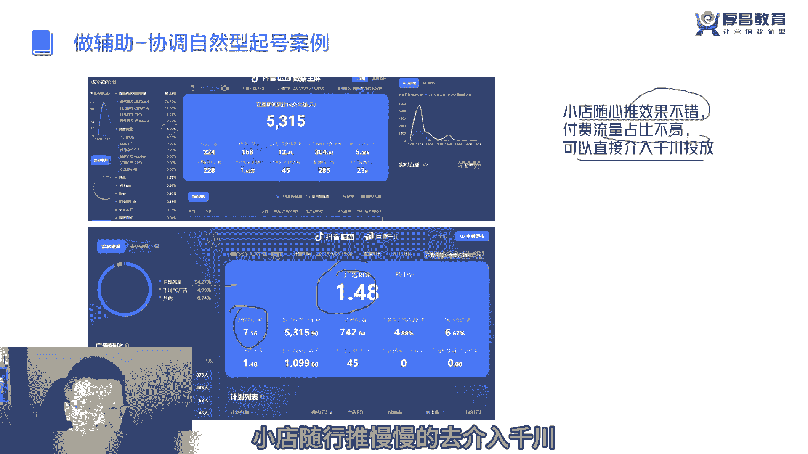

慢慢的去介入千川，但是它也是一波流，自然流量就是这样，一直是一波流到这里，它还是你看基本上一个月之后，他就能有第二个波峰。

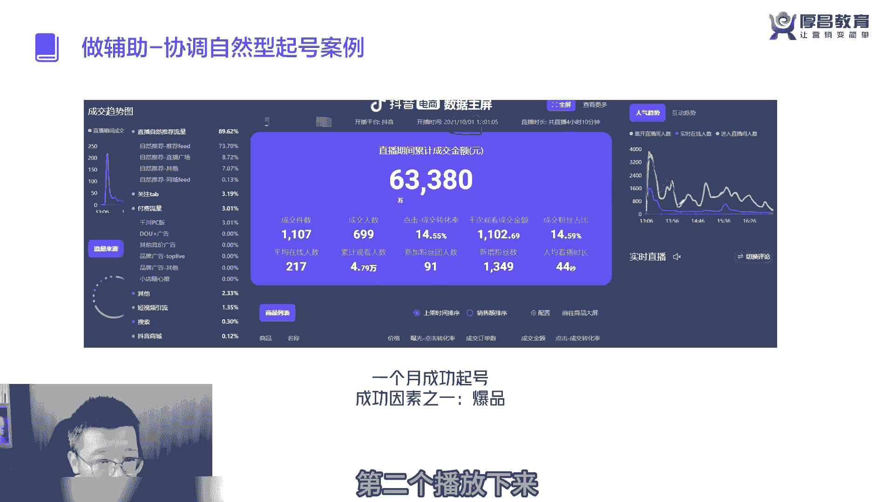

下来之后再通过付费起来，看到没有，你像不像刚才了，之前都是一波流一波后面就没有了。

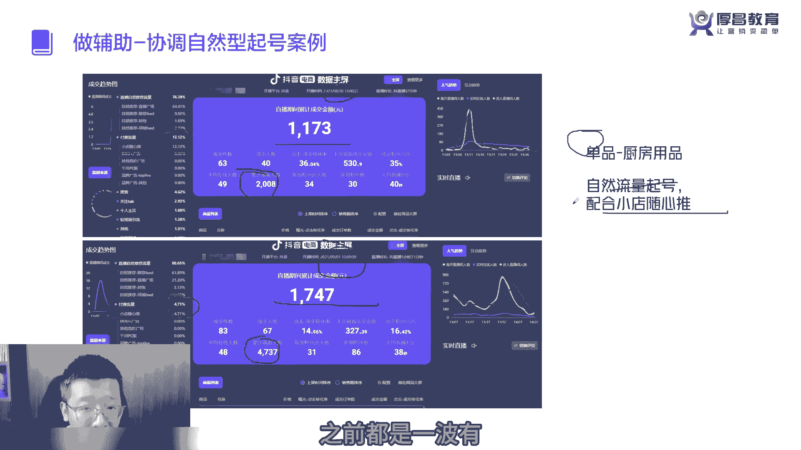

一波后面就没有了，这个也是一波后面就没有了。

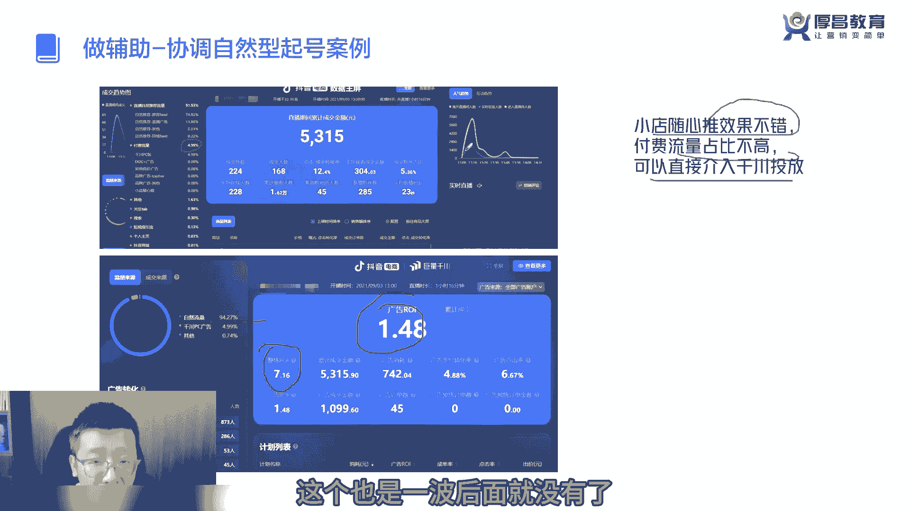

有个小高峰，但是起不来，你看后面一个月之后，通过付费去贷付费这块的话占比3%，但是他的场馆已经很大了，免费占到了89%啊，他慢慢能够通过付费不断的去撬动，不断的去撬动更多的流量，一个月成功起号成功。

要素之一，这个品其实就是找的爆品啊，一个爆品爆了他的啊视频很少，但是呢通过付费啊，通用的自然流量就就带起来了啊，所以说像你想要要去通过自然流量啊，付费去协助自然流量旗号的，一般是你的直播间人很牛逼。

人很牛逼，就像那个男一主播很有特色，而且他这个运营手段话术很牛逼，长场景很很好看，就比如说我们那呃好看的场景，像之前比较多的美少女美少女嗨购，他也算是一个场景，或者说像有一个魔术师。

之前我们说的有一个魔术师的直播间，他的停留就特别高，你的货有爆品都是带动自然流量的。

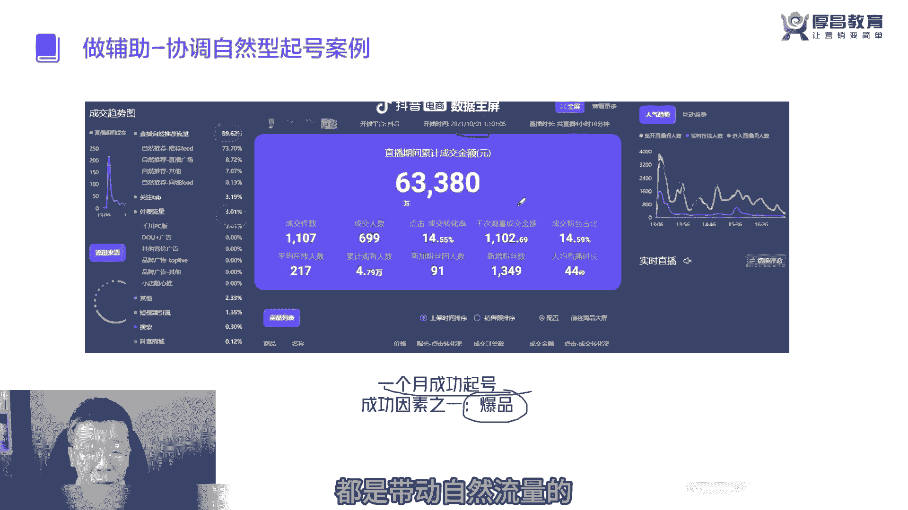

哎刚开刚才咱们说了两个，一个纯付费和一个撬动自然流量，作为辅助的两种策略啊，这基本上就是我们大部分做铅穿是要做的。

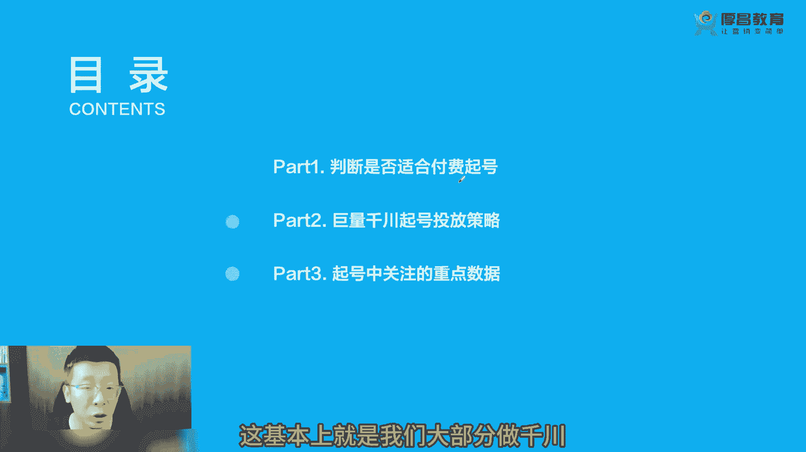

两种策略，我们看重点关注的数据，我们直播间要重点关注哪些数据，新版大屏大家都熟悉吧，新版大屏更新了之后，把千次观看成交金额放到了最前面，实时在线人数，曝光观看之前是曝光曝光观看例啊。

现在呢是签次观看成交金额，不管说哪个在前面吧，咱们做付费的时候，重点要看的东西，第一签字观看成交金额，GPM观看人数，场观我们要看观抢关啊，没有啊，人均观看时长。

观看互动率这个数据其实还要关注这个数据啊，我先要关注这个数据，成交密度与成交高度啊，经常其实这个是直播带货运营方面的内容啊，就说为什么说你看这是进入人数，为什么它进入比较多啊，开播有一波流。

大家都知道开播会有一波啊，一波极速流量，一波自然流量它会比较多，你看这块慢慢才有成交，这是成交金额有一个密度，每一个成交的高峰，后面基本上都会有一个进入的高峰，都会有一个进入高峰。

或者说你可以看你的停留时长，停留时长越越高，相应的它的一个也也都会，就说每一个因素其实都会影响进入这个黄线，进入这个黄线，不管说我们你看这个我这成交了一个，它会有一个高峰，我这成交一个。

他这块有一个高峰，对吧啊，一定要注意这个，当我们一直连续没有成交的时候，就要要不上爆品，要不重新换一下品，要不提示一下主播来状态，往回找一找观看往回找一找啊，你的状态往回找一找啊。

或者说找一点找一点低客单价的品，引流品去上一上。

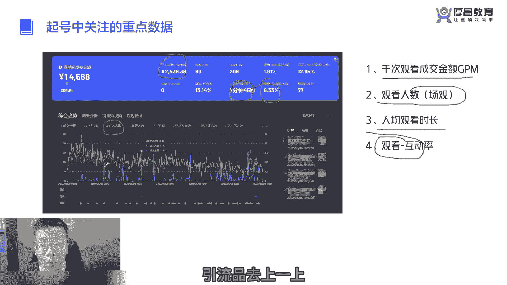

这样的去做，怎么看怎么看来啊，给大家一个表，经常有人问啊，我在起号的时候，我应该重点关注哪些数据，我要看停留有没有一个指标啊，我看我的互动有没有一个指标，看哪一个比较合适，来看这个起号的数据啊。

就是刚才8月31号到10月1号，它整体的起号数据，成交金额，成交金额一千一一千七五千，56万，1万56万，直播时间半小时，一小时，一小时，16分钟，三小时四小时，有人说我起号要不要拉时长。

各位你们觉得起号要不要拉市场，对不要，千万不要拉市场流量走了，该下的下，不要说死磕啊，我当前数据不行，我要必须走下，你越播越没人，越播越没人，因为我们还要做到什么，刚才咱们说的七天螺旋起号有没有道理。

有道理，七天螺旋起号螺，不管说他七天螺旋不螺旋不起来，还起不来，那至少说咱们每一天要比上一场要好，就这一场要比上一场好，有进步，什么叫做进步，场关增加了停留，增加了销售额，增加了，其实重要的我们看啊。

我们看哪个出的第一，我们看往前看啊，这个比较深，先看这加团人数，我们看这是营销额，他的营业额GMV在增加的，加团三十四三十一四十五，这是降了哈，这是降了35，91不成正比吧。

而不是说我的加团人数做的越好，我的一个gm也就越高啊，不一定加团率这个数据也不一定，人均观看时长四十二十八，二十三二十六，反而是下降的这块有点下降，曝光量越大，特别是自然流量，自然流量为主的直播间。

你的观看时长并不长，观看时长并不长，而付费，如果说你付费为主的占到六七十%的，那基本上至少是一分钟甚至是2分钟，而自然流量的自然流量为主的直播间，基本上都是在一分钟左右，甚至是一分钟以下，再看JPM。

有人说JPM重要不重要，就是刚才咱们所说的千次千次观看价值。

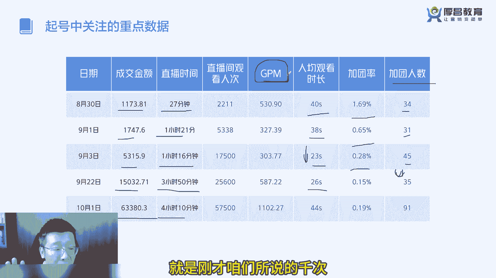

千次观看价值千次，这个浏览价值这个叫什么千字观看成交金额。

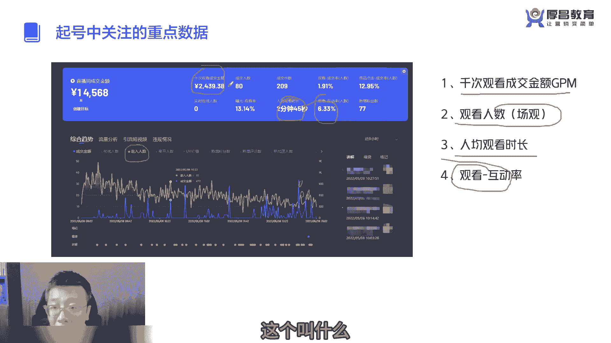

注意啊，来JPM500多，300多，300多，这个其实也是有点下降的，到这里才是上升的，上升的，这里观看人次场关，我们所说的场观他是在不断增加的，它是在不断增加的，这里告诉大家是一个什么道理啊。

就说我们每一场每一场做的比上一场要更好，怎么叫做更好，我觉得大家把这两个数据抓好就行了，一成交金额要多，比上一场多，场关要比上一场多，你其他的像一些停留呀，加团呀，互动呀，你做到尽力就行，做到净利就行。

有人说，那我场关要不要去做到某一个数值啊，不用做到，比如我我停留呀，互动啊，要不要做到哪某个数值啊，不一定，因为随着你的曝光，你的场观，如果说爆爆发式的增长，你的停留和你的互动可能是减少，可能是减少的。

所以说各位注意啊，重点关注起号的时候，各位重点关注，就关注你的成交金额和人次，观看人次，要不我的观看人数要比上一场好不够多不够投，成交金额也一定要往上走，如果说我成交金额，我感觉这场已经废了半个小时。

重开重开，重庆爬啊，这两个数据一定要重点去关注，看这螺旋递增，销量和GPM逐渐递增是整体数据增长的前提，我们看啊，刚才我们说销量GMVJPM，还有我们所说的厂关场观逐渐递增，是整体数据增长的前提。

必须是这几个数据整体往上走，这是螺旋体争，每一场比一场好，再者开源节流，先开源再节流，各位有没有大搜的，有没有从竞价做过来的，有没有从信息流做过来的，所有投放，所有的付费推广都要讲究一个开源。

先开源再接领，是不是很熟悉你现有流量进来，有人说我成交投不出去，我成交投不出去，没成交，先跑再说，成交投不出去，投下单下单投不出去，投商品按钮点击不行的话，投长投观看，投进入进入。

你说那那我进入跑的太慢，定向不会吗，定向你说我不精准不精准怎么办，不精准报课，哈哈哈哈哈啊，学习啊，gm增长缓慢时，需要先优化互动和停留数据，获取更多的场关，才能获取更多销量。

总结一下今天一个半小时课程的内容，巨量千川三步快速起号哪三步，第一先根据你的赛道，你的类目，你的直播的形式是直播，是平播还是过款，是哪一种类目，是高利润品还是低利润品，确定铅穿的介入方式，介入方式。

根据投放目的把控巨量千川的投放策略，达到最好的效果，你是要我确定了我的利润够我全付费去做，我付费达到567十%，我能够盈利，OK不用考虑什么自然流量了，投他如果说我自然流量还要要我利润比较低。

OK那你自然流量，短视频流量，付费流量都要去做，但是这个时候付费流量的投放，就不能够那么夸张了，你要先优化好你的人货场，你主播的话术，你的场景，你的摆件，你的货款，把你的商品的排序优化好。

这些之后有自然流量，或者说要不你去拍短视频，要不到赔本不赚钱呀，那咱投回啥呀，对不对，再去投放，去定策略，最后螺旋递增，开源节流，根据监控啊，监控起号的效果，先螺旋递增，然后再去截流，开源螺旋梯通。

每场比一场好，先开源，先来流，先来流量再去优化，看数据来截流，再去优化好吧。

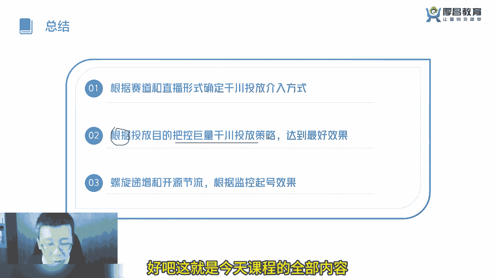