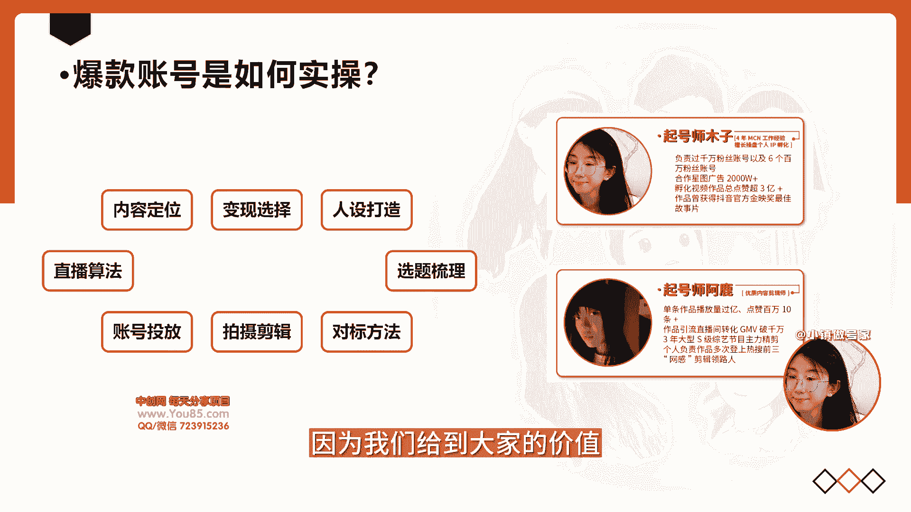
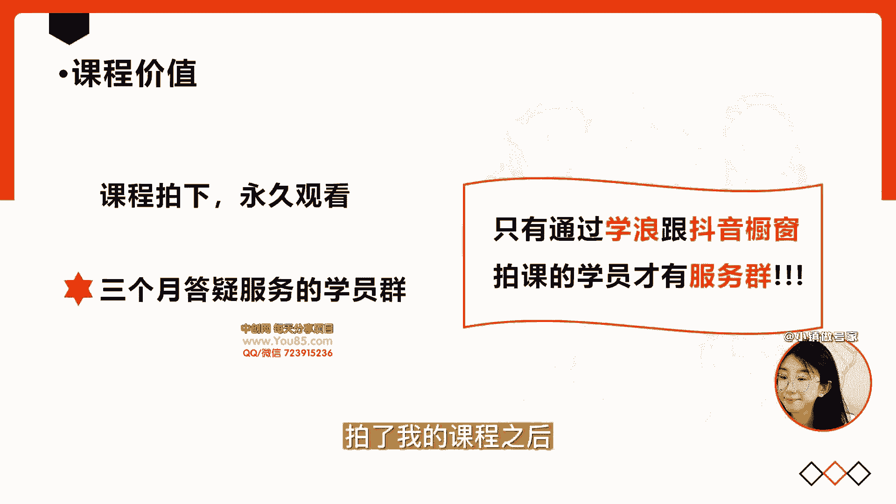
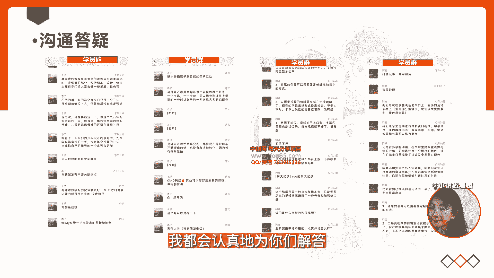
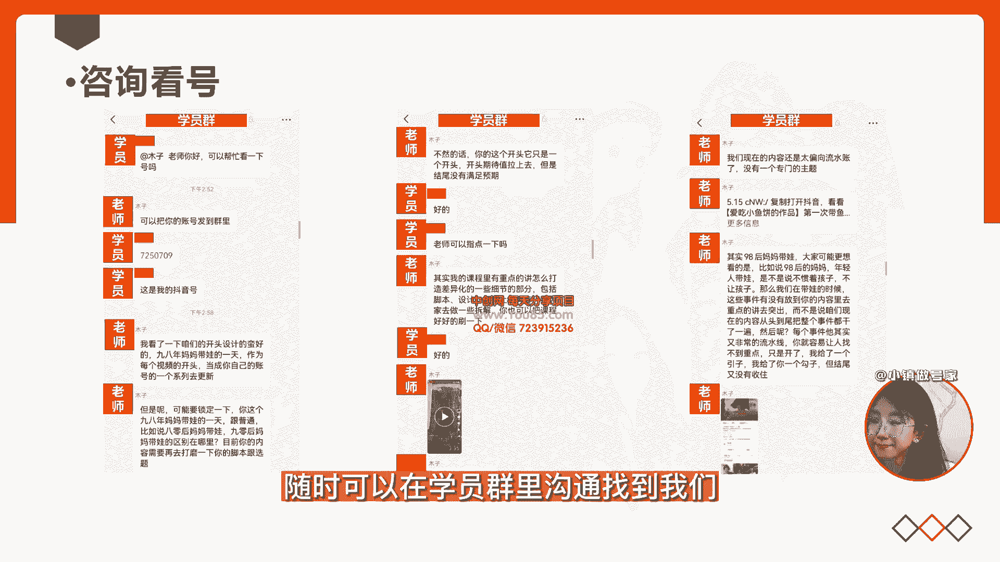
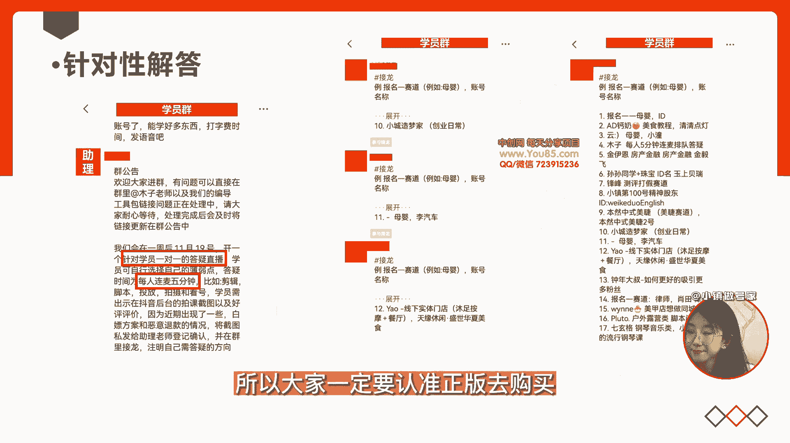
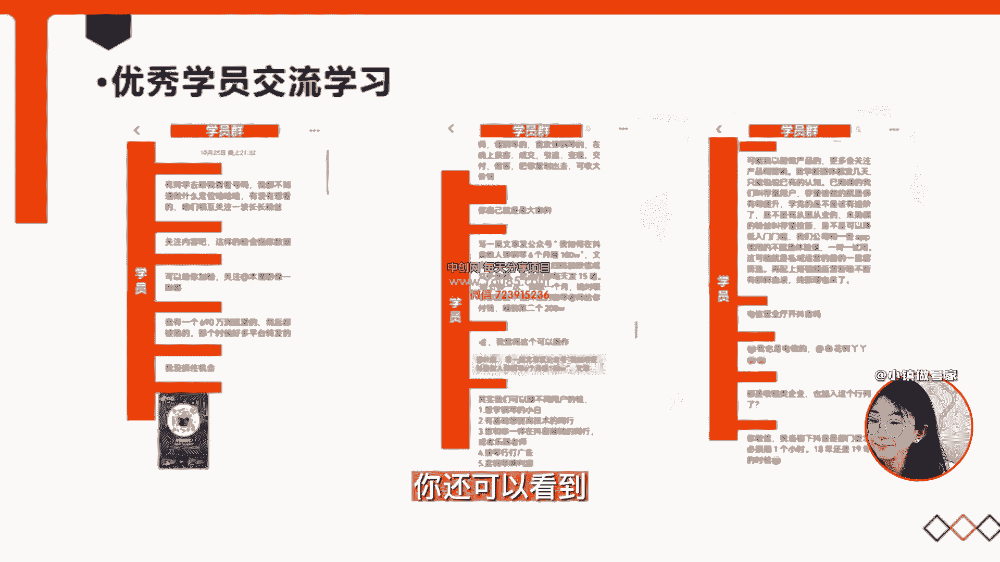
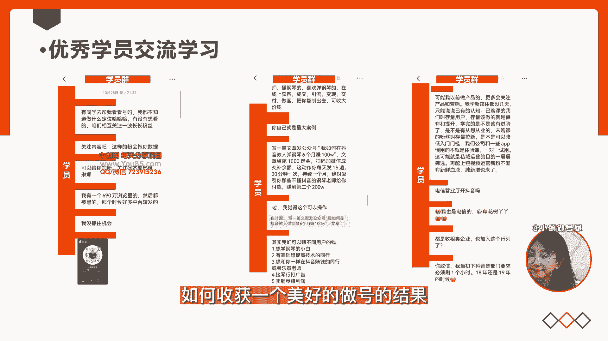

# 【短视频个人IP起号方法68节】01-课程总览 - P1 - 叮咚361 - BV1wD46eLEBt

大家好，欢迎来到小镇做号家的个人IP起号课程，接下来呢将会由我们小镇做号家的成员，带领你深入的学习短视频，如果你是一个新手小白，或者在短视频上遇到了瓶颈，那么我们的课程将会帮你了解。

一个爆款账号是如何操作起来的，让你深入地学习，普通人如何也能打造自己的个性化，差异化的风格的账号，让你迅速的出圈。

我们这套课会从内容的定位，变现的选择，人设的打造，选题的梳理，对标的方法，拍摄剪辑的手法，账号起号如何投放，以及直播的算法的一套全方位的课程，今年所有的赛道都非常的卷，竞争非常的激烈。

普通人如果想把短视频做起来，唯一的可能性就是做个人IP，你才能避免跟一群玩付费流，打价格战的商业团队去比谁砸钱砸得多，买流量买的多，因为个人IP的优势是，让粉丝通过认可你个人品牌的价值，为你的人去买单。

那么赛道再卷，咱们一样可以出圈，不必去砸付费流，不必去打价格战，一样可以轻松的变现，课程呢是由我木子老师以及我们团队，百万爆款剪辑师一同录制讲解课程的，所有的内容，均是我们团队在短视频从业4年做起来的。

十几个百万粉丝账号的经验，都在我们的这套课程里，所以大家一定要记好笔记，因为我们给到大家的价值。

远远不仅这一套录播课，拍了我的课程之后，你可以永久的观看，还有可以进入我的三个月答疑服务的学员群，在这个学员群里。

你可以跟我以及我的团队进行深入的沟通答疑，有问题在群里可以接龙提问，每一个学员的问题我都会认真的为你们解答。

比如你可以像这样提问看号，也可以像这样咨询投放，或者每天可以让编导老师，帮你的账号提一些建议，课程有不懂的地方，随时可以在学员群里沟通，找到我们。

当你实操起号的时候，也可以帮你针对性的解答，以及群里我会有不定时的直播学员连麦答疑，只有通过学浪跟抖音拍课的学员，才能进入我们这个服务的专属的学员群，所以大家一定要认准正版去购买。

除此之外呢，在这个群里，你还可以看到我的学员群里。

已经有很多优秀的学员可以跟他们一起交流，学习短视频的经验，进入到小镇做号家的学习训练营之后，我们还会在我们的学员群里给大家送，我们的十大做号的工具包，里边，包括你们剪辑可以用到的一些专属的爆款音乐。

以及按照悬疑温馨搞笑，不同类型分类的音效的工具包，让你真正的学会如何用抖音记录美好生活，如何收获一个美好的做号的结果。

