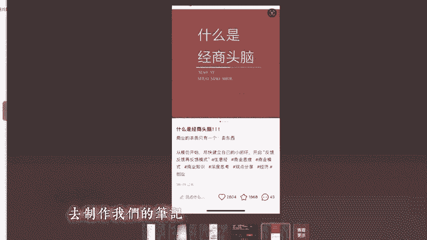

# 【私域引流思路】如何通过小红书日引100+创业粉 - P1 - 私域学前班 - BV1rgpieHEBw

hello，各位B站的小伙伴们，大家好，这里是思域学前班。😊，以后我们会在B站分享一些私域引流方面的玩法，感兴趣的小伙伴们记得给我们点个关注。这期视频主要给大家简单讲解一下小红书私域引流的一种玩法。

在这里我们会以创业粉为例，这个玩法掌握了以后呢，每天微信进限100家完全不是问题。我们为什么选择小红书这个平台呢？首先，小红书和B站一样，他们的用户素质相对比较高。特别是小红书。

她主要以年轻优质的女性为主。本身这个群体自带消费属性，还有一点就是小红书，他的一个作品比较好产出。也就是他的笔记创作门槛比较低。有时候创作一条笔记。可能只需要几分钟。小红书对于新手来说还是比较友好的。

他的作品比较容易曝光。我们要记住的一点就是，不管我们做的是什么平台，他们的推流逻辑无非就是一个看你的作品的一个停留和互动。只要我们能把这两个数据做上来，流量自然也就不会太差。当然了，有优点也就有缺点。

小红书，他现在的一个缺点就是同行比较多。这里说的同行多，也是以某些赛道为例子。比如说我们常见的这些创业呀，兼职这些。他上面的同行就会比较多。就现在的情况来说，小红书还是可以去尝试的。

然后我们再来简单介绍一下微信账号。微信账号作为我们私域引流承接流量的一个载体，有一些细节方面的问题需要注意的。首先我们这个微信号可以把它设置成一个免验证添加。

这样设置的好处就是别人加我们的时候马上就可以通过，也就避免了一些粉丝3分钟热度是吧？有时候我们确认晚了，他们可能也就跑了。然后这样还有一个好处是可以防止这个添加频繁。一般我们坐用这个VX承接的时候。

我们都是多准备几个账号，多账号同时承接，这样也就可以避免一些意外发生。因为有时候你加的人多了，会出现频繁什么的，别人就进不了了。然后另外还有一些，比如说这个微信号的一个设置。这个微信号的话。

我们尽量把这个微信号码设置成简单一点的，不要带复杂的字符。因为这个有时候需要他们粉丝手动输入的话，你弄得太复杂了，也会增加他们的一些操作难度吧。

然后可以绑定一些我们的手机号码或者去租那个短位6位7位的QQ号码过来绑定也是可以的。这个就是微信的一些简单的设置。具体还有一些养号方面的注意事项，小伙伴们可以私下找我领取。

接下来呢我们再来说一下这个账号的准备工作。账号的准备工作。这里我们顺便说一下抖音和一个视频号。因为现在抖音视频号和小红书市场比较常见的几个引流平台。首先呢抖音和这个小红书，它前期都是需要养号的。

这个一机一卡一号，这个是做这些平台一个最基本的要求。然后注册账号。我们主要推荐这个听卡，用听卡注册账号的权重会比较高。如果你是老号，老号直接把以前的作品隐藏了，然后修改一下个人资料。

再刷刷对标作品就可以了。一般来说，养浩，我们推荐刷他个3到7天，第一天把账号注册了，然后就是随便刷一下那些视频啊。笔记啊，然后第二天可以开始修改一些我们的头像资料等等。然后也是同时刷一刷同行的一些笔记。

然后给那些笔记点点赞，发复评论，这样就是主要一个逻辑，就是说要模拟一个真人的操作，让系统觉得我们这个号是真人在操作，而不是机器人。然后还有一点需要注意的，视频号我们是不推荐养号的，视频号都是越新越好。

新号就直接可以发作品，它就不存在一个养号的问题。接下来我们就重点讲解一下。小红书资料的一个设置。因为这里我们主要打的是创业粉，那么我们的个人资料呢要突出和创业粉相关。

可以是什么什么商业思维或者创业笔记、成长日记之类的，或者和自己的1个IP相关的一个关键词。然后昵称设置好以后，就是个人简介。个人简介主要它突出三个主题。第一个就是说要表达出我很厉害。

然后说比如说我是谁做什么的，然后在这方面取得了什么辉煌的成就。然后第二点就是我能带给你什么。比如说我能帮你提升你的一个商业思维，打开你的认知，我可以分享我的创业心得，让你少走弯路。这些。

第三个就是说一个钩子的问题，那什么是钩子呢？钩子就像我们钓鱼一样。这里的钩子主要就是让粉丝进一步添加你的一个联系方式，把他们引导到你的私域里面，对这个创业粉来说，一般这个钩子我们都会设置一个免费送资料。

或者说送这个创业的小项目。这边我给你们看一个案例。

比如说这个。他这个资料就是我是谁谁谁，然后7年的互联网实战家。然后之前这个什么这个讲了一个经历，一个现在的成就月赚5个W是吧？

然后复制小红书就能找到我，这里就是他的一个钩子，粉丝可以领取这个什么搞钱的玩法，这就是一个钩子，它包括下面的一个群聊。你要进了他的群聊以后，直接在他那个群聊里面可以进一步的添加他的一个方式。

然后背景图的话，背景图就要求就不是很高。一般我们随便找一张好看的也就可以了。接下来我们说一下这个作品的制作问题。一般呢我们的作品分为两种，一种就是废耗流，还有一种是肠尾流。这两种玩法。

废耗流就是我们通过发布笔记，然后我们发布的这个笔记，它比较容易违规，它的特点是容易爆。但是这个作品爆了以后，就很容易触发那个人工审核之类的，从而就导致我们账号受到影响。那么长尾流就跟这个相反。

长尾流他的作品比较偏分享和科普类。和废浩流叉最大的区别就是他的作品报起来没那么快，可能他的数据一般都比较普通。但是这个这类作品的话，只要他足够优秀，他的流量是能够源源不断的进来的。比如说。

用户通过搜索我们相关的一些关键词，也能为我们的笔记带来流量。比如说我们作品发布完十几天，二十几天后还是会有流量进来。今天我们就以常尾流为例。我们常尾留的话。我们首先要找到当前平台。

我们这个赛道最近比较热门的一个帖子。一个笔记，然后我们去模仿他。他这个作品能够火起来。肯定有他的一个理由，我们要做的就是尽可能的去复制。尽可能的去模仿他。

比如说。我们在小红书上面找到的这篇帖子，你看他发布的一个时间是8月29号，今天是9月8号，也就是不久之前发的。然后我们看他的一个数据，点赞收藏，然后这个是评论。这个数据还是非常好的。

那么我们就可以以这个帖子以这篇笔记为模板来模仿它，具体怎么样模仿呢？就是说我们他这个图片是这样一个形式，那么我们就可以把他这个图片把它换一个那个换一张底图，然后这些文字可以把它复制到那个底图上面。

就是按照他这样一个形式。去制作我们的笔记。

小红书现在还是以图文笔记为主。然后它的整体我们一个整体思路就是去模仿内人后，就是先找到这个爆款，然后用这个美图或者那个搞定设计去修改模仿的。接下来我们再讲一下这个承接流量的一个问题，承接流量。

他现在小红书大概就有几种方式，比如说我们在我们建一个群聊，然后像这个样子有个群聊，如果粉丝对我们的作品，对我们这个人感兴趣的话，他就会加我们的群聊，然后我们在群聊里面做进一步的引导。

或者说有些粉丝他会直接私信给我们，然后我们也可以把他往这个群聊里面去一个引导，也有一种就是直接用这个小号去承接。就比如说我们在这个个人资料这边，然后给他写一个艾特什么？然后一个小号在这边。

就是说你想领取这些的话，就来找这个小号这边这样做了一个好处。就是说因为我们这个本身多多少少涉及引流吗？这个是和这个平台对抗的，所以说你引流多了，对这个账号肯定是会有影响的。

那么我们通过这个引导这个小号的一个方式就可以降低我们这个大号所承受的一个风险。这个小红书引流的方法主要就是这两种。前端引流。我们主要就是一个思路的一个变化。因为平台的政策它也是在随时改变的。

那么我们需要做的就是说，要根据平台的政策去及时的做一个调整啊。比如说现在现在这个什么私信，这个很容易违规，浪漫，我们就要换一种方法，可以重点引导他们到群聊。

或者说用小号这样一个办法去规避掉平台的一些监管，这样的话才能做得长久。好了，今天的视频就到这里了。这里是思玉学前班，对思域感兴趣的朋友们，记得给我们点个关注，谢谢大家，再见。😊。

