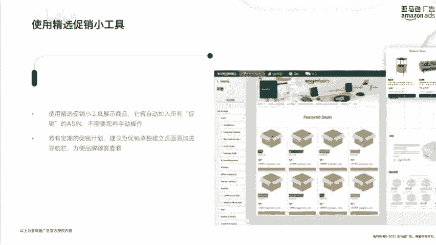
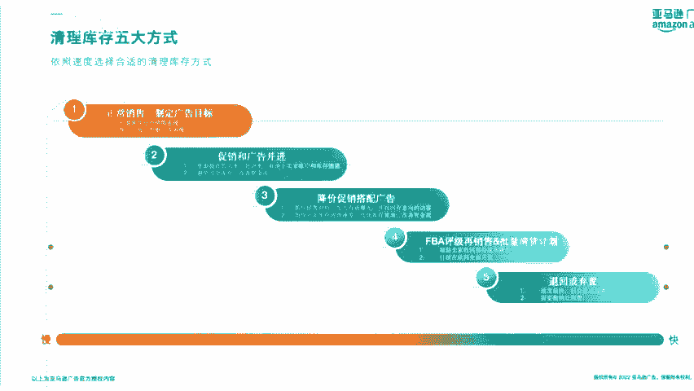

# 【耗时1小时干货!!】亚马逊旺季产品推广技巧！亚马逊运营推广必看！！ - P1 - 西柚找词 - BV1PZsaeDEkC

然后我们欢迎几点出海的小波老师和lucky老师来到我们的直播间。然后他们今天给大家讲解的内容是旺季产品分级推广技巧与旺季广告投放技巧。我想这个话题也是很多朋友们都非常关注的一个话题。

那么我在这里先简单的给大家介绍了一下我们今天的直播嘉宾呃，一位是小波和lucky老师。然后我们也跟小波老师认识了很久了。他目前是基点出海的创始人。

然后也是我们亚马逊广告之深跟卖家讲师和亚马逊广告的明星社区大使，相信在广州的朋友可能很多都已经认识的小波老师。然后lucky老师呃温晶晶老师，然后也是我们基点出海的明星讲师。

然后同时他也是亚马逊全球开店的明星讲师。那么相信他们今天会给我们带来非常精彩的分享。好的好的好的，今天这个话题呢呃又是一个大家非常熟悉。但是每年都会都都一定会出现的一个话题。因为马上就到7月份了。

我们7月呃知道7月份年终的时候，会有这个年终的这个priday，基本上每年大家都会在parday之前说，哎呀今年这个销售怎么怎么样，销售怎么样，就都在day会获得几倍几倍的销量增长。

所以针对这个个情况啊。如果说我们之前。

啊，在P来临之前没有做相关的这个营销动作啊，那很有可能这个销量增长的这个人就不是你对吧？所以我们今天就去呃给大家简单的呃分享一下，那我们这个产品在旺季的时候应该如何去进行一个分级推广啊。

并且我们在旺季的时候广告投放工作要如何去开展。好，那我们今天内容的话主要是分成三个大板块。首先呢会先由我来去给大家简单呃介绍一下我自己的一个旺季产品的一个分级推广的技巧和整体的在旺季的时候。

我们需要去做的一些泛用性的调整的一些技巧。然后呢会由拉克老师来给大家去介绍一下旺季我们的主推产品的大屏式广告布局要如何去进行应用，以及我们的评论和停清产品的旺季广告投放的一相关的技巧。

那么先进入到我的这个部分是关于这关旺季产品的产品分级推广与泛用性调整技巧。首先我知道产品我们一般来说会分成两个大的维度。一个呢是叫做新品啊，就是在新品期内产品啊，我们之为叫新品。

然后第二个维度的产品叫做非新品啊，就是它已经过了新品级。但是呢它当前处于哪个阶段的，我们自己是不是要了解清楚，对吧？然后在根据不同的阶段不同。

维度的这种产品去分别制定相应的营销推广的这个策略。那这边新品的五阶段复盘，其实就是基于产品的一个生命周期生命周期策略中的新品期来去做的一个阶段性复盘工作。那这边呢会有三个叫做关键词。

首先第一就是五阶段五阶段是什么呢？我们产品从这个几步开始到逐渐的进入到这个成长期，再逐渐进入到这个成熟期或者衰费期，总共5个阶段的一个新品，它的阶段演化的这一个过程，我们称之为叫新品阶段啊。

那么第二个呢第二个关键词叫什么？叫三状态，三个状态分别是主推产品平推产品和停清产品。我们的一个运营的这个推广重心一定是放在主推产品上的。然后部分产品呢它可能并没有主推品那么报啊。

但是我们可以给到呃一些就是可以给到一些呃就是合适的预算给到他。那这类产品的话，我们称至为叫评推产品。而有一些产品呢表现特别特别不好。那是怎么办呢？没办法，我们叫就想办法去给大做这个停售进控工作。

所以我们称为叫停清产品啊，那么如何去判断我的产品当前处在哪一个阶段，以及它当前的一个状态是什么状态呢？那我们这前给大家列举了第三个关键词叫持指标，就是给到。

这个阶段性的指标去对这个产品处在哪一个阶段的就是每一个状态进行一个划分。那这个是我们今天第一节的一个重点工作。这边简单看一下啊，产品的生命周期啊，我们正常来说是会有四个大阶段，分别是起步期。

成长期成熟期和衰退期。我们知道不同的产品在不同的阶段，它的获客成本销售额它的一个利润啊，获利啊以及相关的这个产品的竞争力都是会有不同的差异的。其中像货客成本在产品的这个新品期，也就是这个上面写的起步期。

它的获客成本肯定是最高的。然后再逐渐的进入到这个成长期啊，这个货客成本啊慢慢的慢慢的会降低。然后在成熟期和这个衰退期，它的货客成本会降到一个相对就是比较低的一个值相当降到一个低谷。

那么销售额同时也是就是它这个从一开始产品刚上架的时候，它的销售可能会没那么高，对吧？但是一旦过了这个新品期啊，或者说在新品期的过程中，它会逐渐的快速成长啊，进入到这个成长期。然后再慢慢的达到一个高峰。

再到这个衰退期啊开始去逐渐这个下降的情况。然后获利情况呢就是产品的新品阶段啊，一般来说啊是没有多大利润的。根据我们的运营逐渐的去控制我们的推广成本。啊慢慢慢慢的它会开始去获利。然后再导对期啊。

利润出现下降。那么产品刚上架的时候也是那我们可能还没有各种呃没有品牌认知啊，然后产呃消费者对我们产品啊还没有很多的这种认识，对我们品牌也没有很多认识。那么初期的一个竞争力肯定也是不足的。

在慢慢根据我们的运营，在这个整个过程中逐渐的去上升啊，那这个是我们产品生命周期从不同维度来去分析啊，它可能具有它具有它具有的一些特征啊，产品生命周期的一个一个特征。那么我们通过两个案例来简单看一下。

怎么样去区分我当前产品所属的生命周期应该处于哪个阶段呢？这边有两个案例，第一个案例呢就是比如说我产品刚上架啊，目前产品的一个文案图片都是上传了，但还没有进进行优化。

然后整个listing目前评论数量也只有不到15个。那这类产品呢，我们从动作维度上可以判定它为叫做新理级产品。那么第二类呢就是成长级产品啊，经过我们的努力不懈的运营，然后整体的一个星级水平啊提升到了4。

3星以上。然后我们的review啊也大于了15个。那在这个阶段的话同时我们的这个图片文案也经历经类优化之后，我可以通过。呃，对这些呃运营动作的一个一个执行去判断啊，当前我们产品开始进入到成长期了。

然后再逐渐的啊产品脱离到了这个新品了，已经不属于新品了，并且相应的广告投放效益啊也慢慢慢慢的稳定下来啊，并且变得比较理想，那么开始进入到稳定阶段。而这个时候又过了一段时间，比如过了一年这个产品啊。

逐渐的生命周期接近了进入到了镜头，并这个产品相关的实指标被判定成了停清产品。那这个时候就进入到了我们的一个衰落期。那同样我们拿案例2啊，就案例二是一个广告的投放案例，我会注意到在产品刚上架的时候。

一定会有一个阶段的不稳定出单的一个这样的一个阶段。那这个阶段的这个广告的相关的一个数据都是处于一个不稳定的一个阶段啊，包括它的一个出单销销售额对吧？都是不稳定的。但是它的一个广告的一个会很高啊。

花费啊也是一个就是比较就是比较高的一个状态。那么在离开这个新品期啊，进入到这个老品啊，成成为一个老品了之后，我们又注意到那整个产品的一个出单啊花费整体广告表现也会慢慢的趋于稳定。

那这个时候啊我们称之为叫做稳定出单区。把它视视为一个老品啊，或者把它视为一个成熟期的一个产品啊，那这个就是呃两个案例啊，我们能很清晰的去了解到当前产品应该是属于哪个生命周期阶段的。

那么接下来就进入到我们的新品五阶段的一个分析法的一个核心。我们对产品啊会有三个状态的划分，分别是主推产品平推产品和平均产品。其中主推产品一般来说，它会完整的在我们新品五阶段里面过完五个阶段。

并且在过完五阶段之后，它的这个产品生命周期是还处于成长期阶段的。也就是说我们将将这个新品啊划成分划分成了5个。前三个阶段我们称之为叫做起步期或者叫新品期。在进入到第四个阶段的时候。

可以把它当成一个成长期的产品，按成长期的一个运营动作来去进行执行。那么再往下啊，频配产品的话，它很可能在新品五阶段结束的时候，我们就可以把它当成一个成熟期的产品来去对待了。那这个是平配产品。而。

不是每一个产品它都能完整的过完它的整个生命周期的。比如说这个提级产品。那可能在产品上来之后，不到两个阶段，我就发现啊它各项指标数据都非常的糟糕，对吧？

那这个时候其实你在第三个阶段就可以非常果断的把它当成一个平级产品去进行提收期货啊，避免说你的这个预算无用的浪费在他们身上。所以这个时候三个阶段的判定其实很关键啊，如何去判断清楚。

并且根据各阶段的这个数据啊来给到我们一些呃比较合理的呃做出一些合理的这个运营决策，这个是非常关键的。所以接下来我们就会给大家讲这10个指标到底是哪10个指标，这会给大家几个就10个建议啊。

那我们在产品上架的时候，可以分别的去查看产品的一个阶段的一个表现日均量分别是多少。然后再去剔除掉剔剔除掉与我们营销相关的动作啊，营销动作相关的这些单量去计算它的一个阶段真实的日均量啊。

就是它的自然单量到底是多少，然后再去计算真实的订单的占比，然后再去看啊当前这一个阶段它的一个产品的一个review评分，它的一个评论数量分别是多少，以及我。

周啊根据这个呃当前的一个产品状态去给到相应的广告，一个广告花费的一个预算，然后再去呃衡量这个广告的一个周的s，并且查看广告的转化率和它实际的表现转化率分别是多少。

再去根据产品收益定值趋势来去做出我应该增加预算还是减少预算的一个动作。那这边有一个表格，大家可以看一下。这是我们根据我们公司内部啊，我们团队内部啊的一个实际数据表现啊，它不一定适用于所有产品。

但是呃在今品五阶段内，大部分产品啊，它可能就是呃会比较适合我们的一些20美金以下或者30美金以下的一些呃呃的一些客单价的产品。同时呃也比较适合我们的一些呃相对垂类的一些产品啊，就红海类目的产品的话。

可能需要额外的去制定相应的标准。那垂类的这个类目的话，可以参考一下我们这个标准。那这个标准呢，我会给大家呃每一个不同的状态去规定每个阶段啊，它的一个呃产品的表现应该达到一个什么样一个值啊。

这边可以参考一下。就比如说当前我的产品日均量达到C级以上的一个标准，对吧？我把它判定为叫一阶段。

进入到这个三阶段之后，我的产品的阶段日均量需要达到B级以上的标准，才能判断为主推产品。而这个时候我看到我整体的一个周报二次水平啊只有二啊二年级平均比的评分只有3。8以上。评分数量虽然说超过3个啊。

但它真实订单占比只有30%。而主推产品的真实订单占比它可能有50%对吧？而这个时候它的一个阶段日均量也只有C级对吧？所以我这个时候对对这个产品的判定，它只能算是一个平推产品。那同样当我的各项指标。

目前的这个表现都还只是属于成色中的这个表单中的这个数据表现的话，我只能把它当成一个停清产品，并且在进入到第三阶段之后，就会开始考虑对它去进行采取一些停售清货的动作，那这个就是清品五阶段的一个方法啊。

那这边会有一个判断标准是什么呢？因为并不不是每一个产品它的各项指标都会在各个状态的各阶段啊表现出跟你完全一致的这个数据，所以这个时候只要相应的数据指标表现符合这个阶段大部分的标准。

我们就可以判断它是处于当前标准的产品啊。比如像这个呃三阶段还拿三阶段三阶段几举例子。在进入三阶段之后，你的阶段日均量达到B级标准了，整体的一个真实订单啊破到50%了啊，但是你的整体是还没有达到2。

5%的。但你评分已经有了，并且评分数量也够了。那这个时候啊四项判断标准有三项是符合主推产品的那这个时候你就可把它当主推产品。因为相对来说比较低的这种情况，有可能是因为我们投放基准度。

以及我们投放策略的问题，影响到它的这个这个投入产出。所以这个时候的话，我们仍旧可以把它把它当成一个主推产品啊，那么接下来我们简单给大家举个例子，比如说这款产品是我们美国上架的一款产品。

我们去分别统计啊它几个阶段的一个数据表现。我们看到在第一阶段啊有两个数据表现两个指标是处于绿色的第二个阶段四个指标处于绿色两个指标处于橙色对吧？

所以说在这个时候我们其实是可以给它按照主推的力度去进行推广，并且每周的一个周广和率算是可以适当的去进行增加的。那么进入到第三个阶段，我们会注意到我们的整体的表现日均量虽然是达到了A级标准。

但是它的一个真实日均量其实没有达标对吧？以这个我们就需要去考虑说到底什么原因导致它的一个真实订单占比降到了一个比较。不理想的一个水平。那我要想什么办法去想办法去提高它的一个真实真实的订单的一个占比。

对吧？那这个时候是我们阶段三需要做的事情。那阶段四啊，那我们的这个重点啊，除了判断以上的瑕疵表之外，是需要看一下当前在阶段四，因为五阶段就结束了。那么在第四阶段的时候，产品是否已经处于一个正趋向啊。

产品收益意净值的趋势是这个什么概念呢。比如说我当前这个产品它在上架了之后，我花了多少钱，在他身上做推广。那他目前给我赚到了多少钱。那他花的钱和赚的钱的一个呃盈亏平衡点，目前什么时候才能达到。

以及目前呃他赚钱的速度快，还是他花钱的速度快。如果是赚钱的速度快，说明他已经进入到一个正趋向。如果他花钱的速度快，那人就像第一阶段表示一样，它是一个向下滑的一个趋势，对吧？所以通过这个这个五阶段复盘表。

我们就觉得很很清晰明确的去判断当前产品所处的这个阶段状态，以及产品是否已经为我们赚到相应的钱了。讲完了新品之后，那么对于非新品呃我们应该如何去对这个产品去进行一个分级呢？那这边给到大家两个参考的维度。

一是产品当前的一个运。

一个数据表现。数据表现有两个核心数据表现，分别就是它的1个CPR和CPR点击转化率。那么第2块呢就是当前这个产品你上架了之后，你希望产品达呃就是达到一个什么样的一个市场表现情况。比如说你的目标啊。

当前这个产品的占有率达到10，成为这个相应的细分析市场中排名前多少名的存在。或者说是让你这个产品进入到相应获取相应的市场份额，对吧？那这个时候你把它当画几条线，那这条线呢达到这个线呢。

你就可把它当成相应的这个阶段内的一个主推产品，不达到这条线对吧？把当成平类产品，甚至是呃市场占略率极低的情况，你把它当当成一个平均产品，对吧？那这个是两个不同的维度。

但是也给到大家一些呃分级判断的这个建议的标准，这个标准指什么呢？比如说像主推产品，那我们的点击率转化率大于类目的平均值和中中位数，我们就可以把它当成一个主推产品来进行看待。

或者是在一些垂类或者相对竞争难度没那么大的这种类目里面，它排名比较靠前。或者说是当前对这种就是非舒适竞争的这种类目所占市场份额占总市场份额的前80%的部分，这是我们都可以把这个产品当成一个主推产品。啊。

但是有个前提就是你目前的产品是类目中的高级竞品啊，人家把你当成一个高级竞品来看待。那你这个时候你就成功了。那你这个主推产品也成功了啊，那什么是评推产品呢？当前点击率大于0。4%。

但是就是没有达到主推产品的等级标准的或转化率于5%。但也没有达到主推产品等级标准的这类产品可以把它看成平推产品，或者是你的产品的整体的表现相对稳定啊，比如说没有达到S级没有达到A级。

但是你是B级和C级并且非常稳定的，每个月都是按照按照这个等级来出单啊，它的市场占率比较低，你可以把它当平配产品来去看待。而长期点击率小于0。

4%以及转化率长期小于5%的这一类产品啊赶紧清货赶紧进不浪身上啊，然后它的产品表现差，甚至几乎不出单了，那想办法把它货清掉啊，经过就是这个提售进货产品的阶段产品的一个主旋率了。

再或者说是当前产品过了新品期啊，出现上面这种表现？这类产品尽快的去把一进工作去提升日程，甚至是我们的新品如进入到第四个阶段，它就处于平均状态，也可以考虑进入到这个提售进货的这个动作了。那么对于三种不同。

状态我们建议的推广动作肯定是不一样的。比如对于推产品，我们肯定说啊，要么就是保持当前推广力度，要么就是增加它的推广力度，或者是增加它的一个广告的一个投入预算啊。

或者说他当前的这个主推力度啊是是被视为主推产品的。但是它的广告的表现，投入产出并不理想。它只能靠自然来出单的话，那像类似这种情况也需要去适当的去控制我们的每周的广告预算，而平推产品的话有三个建议啊。

首先第一就是去按照平推的力度来去推推广。因为你不可能给到每一个阶段产品相同的这个预算去进行投放的啊进行推广的。所以平推产品啊是按照它平推产品的力度来去投放啊，但是如果说呃你这个平推产品。

你不去设置相应的一个广告预算的话啊，有可能会导成一些平推产品超支，导致你的一个预算的一个计划无法按照你的一个计划来去执行，对吧？所以会有几个限制，一你的每周广告预算，不能高于你的平推上限。

第二个是你的整体的一个推广花费占比也不能够高于你的这个季度的推广花费占比的上限啊，这两个上限把控好了。你的平推产品推广就不会有问题。OK好，那我们再看一下停金产品啊，这类产品希望大家都不要遇到啊。

希望大家所有产品都是主推和平推啊。那停金产品呢就是一旦进入到被列为停金产品之后，我们会停止它的所有推广动作啊，会停止它的所有推广工作啊，使用停售清货的动作来去对它去进行一个清库的操作啊。

当然如果你有做一些比如像品牌品牌街店中有做一些呃停售清货的一些叫做叫做老品大优惠老品大放送类似的这种营销活动，那也可以考虑啊去通过这这个这个形式来去进行推广。

但是你要还要考虑说你当前花的这些推广的预算是否能够拿得回来啊，是否能能够拿得回来。因为在我多其他渠道啊，大家可能会考虑说啊我通过站外广告，或通过站内广告的形式来去推广这个停新产品去让它或者出单。

但是你获得了出单之后，停新产品，它的一个利润利利润率又相对比较低，它的转化率也相对比较低。我花了这么多钱带不来任何的这个利润，那我花这些钱干嘛呢？对吧？还不如直接销毁了啊，所以成本的核算是每一个运营。

每一位运营再去做这个运营推广动作的时候。必须要去做的工啊必须要去做的工作啊，成本核算，不然你在月末一定控制不了你的预算啊，第三就是。预算的控制呢，正常情况下。

公司肯定会给到啊大家一些关于说经过上线的一个每周的广告预算或者每周的一个推广预算，对吧？那对于这类产品的话，我们不要让我们的这个呃就是预算花超了。因为你每超出的一分钱都等于是在浪费你的利润。

都等于是在浪费你利润。就像我们推广广告的，就是进行广告投放的时候一样，为什么会选定啊比如25到30%之间的这样一X的一个范围来作为我们的判断判断标准，是因为选择这个判断标准作为范围的话。

能够让我们的广告投放的波动，自给自足，这是一个很关键的一个动作啊，是一个很关键的动作。所以。已经进入停售进货的产品，更需要注入我们在预算控制。

而平时的话大家也可以积累一下自己的一个停售进货的一些相关资源啊，如何去以更低的成本在各渠道完成批量的进货。好，那么接下来我们进入到今天的这个大主题，就是旺季广告投放应该怎么投对吧？

因为我们通过前面的所有的这些这些介绍啊，给大家了解清楚了。什么叫做主推产品，什么叫平推产品，什么叫做清货产品，那主推产品肯定是以获取到更多的流量作为它的目标的。因为它的转化率足够，对吧？

你给到它足够的流量，它的这个给高它足够的预算，提高它的进价，那他在旺季能够获取足够的流量，那它的一个出单机会也会更高啊，因为它是主推产品啊，那作为平推产品的话。

就不能够以这个流量这个衡量指标来作为唯一指标，而应该以转化作为它的第一优先级指标。以这个时候我们应该采取的是一些高转化的投放动作去提高我们的这个投放的精准度啊，并且对于一些核心热词。

就是流量S排名前5万名的这些词要谨慎投放啊，谨慎投放。但是平推产品在确保它转化率的前提条件下，可以适当的去增加你的预算和进价，但是一定要。

及时的去监控广告表现啊，千万不能不管它啊，不然的话你这平台产品一定是亏的啊。第三呢就是清货产品，它其实会有一个比较典型的促销动作，就是大额的促销折折扣。

但是你需要确保说你不说这个平行产品它能把钱给赚回来。你最起码把你的产品货本和你的这个产品的一个物流成本给赚回来啊，最起码不让我们亏的这么多？以清货产品啊一般来说都会配合大额的促销这个折扣啊。

还可以考虑说借助这个旺季的这个流量来去把这个需经货的产品给清理掉。那么在旺季来之后呢，我们会有一些泛用性的广告调整策略。比如说可以利用亚马逊后台的预算规则功能啊，让它在流量高峰期或者是特定的时间范围内。

我们可以去进行选择的，去增加相应的预算啊，但是啊这个亚马逊广告的这个工具，它只能增加预算，它不能减少预算啊，这是一个不算缺点的缺点啊。

然后第二种形式呢就是我们可以使用预算规则的功能去基于业绩的情况下来去增加预算。比如说我的特特别好？那我就可以让这个广告动去增加相应的预算，去让它跑起来。那第二种形式是基于这。

比如说转化率啊，它转率特别高，那我给到更多预算，让他尽可能的转化成为我的订单，对吧？那这个是在预算方面的调整去配合工具做的一些调整动作啊，那么第二个呢就是就是我们需要去提前做好相应的预算规划动作啊。

比如说对于这个表现优秀的主题产品啊，那我们可以直接设置按时间来增加预算。而对平推产品设置比如像或者转化率。比如我们平推产品那我们以这个R作为衡量指标的话。

我们可以直接给到相应的这个转化率来去作为预算规则的一个判定标准。那这样的话可以保证我既可以保证我们优秀的广告活动不受这个预算的限制，又能确保我们的一些表现比较呃一般的平推产品。

它能够按照相应的转化标准来去获得更多的预算。所以说提前做好预算规划啊，再根据提前做好预算规划的动作是吧，那我们整个在旺季期间的一个投放会相对来更加安心。

那第二个呢就是预算规划怎么去做那可以去根历史的算分配和我们预期的一个销售目标来去推算给到每个广告活动的一个预算啊，给到每个广告活动预算。第三呢就是提前做好相应的广告定向的优化啊，就是。

的定向的方向啊定向策略的方向啊，要确保是当前是在一个高转化的一个定向方向上。那这边有人在问，就是说怎么去定这个预算啊，我我提到了两种不同的方案。一、比如说你去年。去年的广告呃整体的广告表现。

我看一下有哪些产品，对吧？那这个产品中哪些是主推产品去计算主推产品在去年它的一个整体的一个预算占比是多少。那你今年就可以根据你的预期销售目标来去乘以它的相应的这个呃预算占比啊。

就是根据销售目标以及得出你的一个预算的一个目标，再根据预算目标乘以相应的预算比例能够计算到给到相应的主推产品平推产品和这一个停津产品的一个广告预算。那么主推产品，那目前有哪些产品是主推产品。

它的一个总预算是这么多，对吧？再根据历史的一个产品的一个销售比例去分别计算出给到每一个产品，每一个广告活动的一个预算分配啊，当然我们也可以根据预期的销售目标来去啊计算出来啊。

那每一个要达到这样一个销售目标，每一个产品它的一个呃销售比例分别是多少。再根据它销售比例和我们的一个总的预算目标啊去进行相乘，也可以得出它相应的一个预算指标来啊。

两种形式都可以搞定这个预算的这个就是预算策略啊，怎么去定这个预算的问题啊。那么接下来再看对于一些广告表现比较好。

好的，并且平均预算内活跃时间又不够长的产品，对吧？我们还可以去通过这个预算的在线操作面板来去批量操作啊，去提高它的预算啊，然后在呃等到旺季结束了之后，再去进行一些相应的一个预算调整动作。

同样也可以使用这个预算批量操作面板来去对它去进行控制啊，然后我这边呢有4个小建议啊，给大家提一下。首先第一Pday的广告投放啊，最忌讳的一个点，就是我的预算不足啊。

你没有足够的预算给到优质广告活动去跑啊，并且呃这个预算规则的功能啊，也没有去使用它，或者也没有去使用相关的这些第三方的这个呃广告控制软件，对吧？

那这个时候我们会错施很多可以本来可以成为销售的这种这种订单啊。第二呢就是我们无谓的啊去投放一些高流量低关联的大词啊，那这个时候的话就相当于会造成一些预算浪费的情况啊，然后对于这种预算浪费的情况。

怎么去规避呢？这里大家如果说能够把这个广告组合的工具和广告活动啊，去进行不同层级的一个预算上线的一个设置，其实能够解这种。无意义预算风跑的这种情形。那么第三就是旺季来临之前，提前设置好你的否定词啊。

通过否定策略的形式来去确保你的广告投放的精准度，那也能够解决我们预算浪费的情况啊。那第三个错误就是旺季来临了，整体的一个竞价表现，一定会受到影响。那你的竞争对手提高了竞价，你不提高竞价，这个时候怎么办？

对吧？所以也需要适当的去调整你的一个竞价和竞价策略啊，然后第第四个常见的错误呢就是。给每一个产品只创建一种广告活动啊，或者是给你N个产品去创建一个广告活动。这种比较单一的广告结构啊。

一般来说不会发挥出很好的效果。因为每一种设置，每一种广告活动，它往往都有不同的广告投放目的，多种广告的产品组合才能发挥出更好的效果啊，这个是Pday啊，甚至包括忘季的广告投放常见的错误。

大家可以参考一下啊，那么接下来给到大家呃几分钟的时间呃去做一下简单的答疑。大家如果说有问题的话，可以在评论区把这个问题打在啊打出来啊，在公屏中打出来。然后我会给给大家做一些简单的这个呃呃答疑分享啊。

然后在呃几分钟之后啊，会有我们的lucky老师来去为大家去介绍一些关于广告布局应用啊，相关的实操部分的内容。

没钱可以做半境电商吗？呃，这个这个这个这个问题周老师有点尖锐啊，因为怎么说呢？呃，目前这个目前。嗯说。目前2024年呢，跨境电商已经跟跟几年前其实差异很大了。呃，目前对资金的要求其实很高。比如说。

欧洲站你光是要完成整体的一个基础设施建设啊，以及合规的这些成本，可能要花的钱就要大几万啊，甚至大10万，对吧？所以你要是没有钱呃，又没有资源，其实不建议说非常贸贸然的去进入这个行业去进行创业。

因为风险极高啊，但是我们可以考虑说呃通过这种就是创业对吧？那我通过进入一家公司啊，做做到这家公司高层，对吧？那同样也可以获获得相应的这个这个收益，那肯定会比我们直接去呃以更高的风险来去做这个事情。

其实相对来安全一些。特别是在今年公司法啊新公司法推行了之后，那整整个创业门槛就变得非常高啊，就是以前我们是李克强总理所讲到的万中万众创业的时代呃，已经过去了，已经过去了。所以呃如果说衡量一下自己。

如果说没有足够的资金，没有足够的资源，其实不是很建议大家去呃进入这个行业去进行创业，创业是一个高风险的事情啊，特别是跨年创业是个更高风险的事情啊，按照往年的数据，100多万的新增卖家留不下5万。

这些是多残酷的数据啊啊，所以呃。三思啊，如果说真的要要创业的话，三思然后呃差不多5分钟到了啊，那我们接下来就有请我们的lucky老师来我们介绍一下接下来的一个板块内容。嗯，好，那我们谢谢小波的精彩分享。

那接下来的时间，我和大家会分享一下。就是刚刚我们听完小波老师的那个产品分级的概念之后，呃，我会给大家分享一下。在旺季来临之前，我们该怎么去针对不同等级的产品进行一个广告布局。

那第一个部分我会先给大家讲一下，说在旺季来临之前，我们的针对主推产品这个等级，怎么去做一个大屏式广告的一个布局啊。那我们在旺季到来之前呢，主推产品它的一个广告布局呢是至关重要的。

但是有一点可能就是比较容易被大家忽视掉的那就是广告策略的一个重心啊。那在旺季来临之前呢，我们对于主推产品的一个推广，其实更应该侧重于通过我们的一个竞价的提升，它还有一个预算调整以及竞价策略的调整。

去吸引更多的潜在。

客户流量，这样我们才能确保说我们的主推产品能够在忘记这个期间脱颖而出，实现我们的一个销售的一个最大化。那在这里呢，我给大家简单的列举了几个亚马逊站内广告增流的有效途径供大家可以参考一下。

那在旺季到来之前呢，其实我们在亚马逊的站内呢是可以采取多种增流措施的但是今天的话我就给大家先简单的展示这四个相对而言比较简单。但是是实在可用的一些站内广告的几个增流方法。

那基本上我们在那个亚马逊站内的一个广告流量，我们都会去运用到啊。那比如说我们大家经常用的一个商品推广中的一个关键词定向和商品定向，以及可能会被大家忽视掉的一些免费的流量。比如说我们的一个品牌旗舰店。

我们的一个产品视频以及pos这些板块。那在这个板块上面的话，大屏式的广告布局，可能对大家来说会相对新颖一些。那其实这个大屏式广告它的一个核心动作。

就是通过我们全面去覆盖亚马逊账内的免费流量跟呃花钱的这个流量去展示我们的一个产品。相当于就是在无论是在搜索结果页，还是说在那个商品详情页，我们去获得更好的展示位置，拿下更加的一些广告的一个曝光。

以及把竞争对手给挤掉。那我们根据亚马逊当前的一个广告布局来看的话，我们的一个霸屏式广告的策略，可以通过搜索结果页霸屏跟商品定向霸屏去进行布局的那在亚马逊的搜索结果页面的话。

目前亚马逊提供给卖家的一些广告展示位是更多的是商品推广里的一个关键词定向，还有品牌推广里面的一个关键词定向广告。但是呢在商品详情页面上更多的广告位置，我们是可以通过展示型的一个商品定向受众定向。

还有商品推广的这一个商品定向以及品牌推广的商品定向，都可以在这个商品这个页面上面去进行一个霸屏布局的那首先我给大家讲。

一下就是我们得学会区分搜索结果页和商品详情页。那在亚马逊的一个搜索框中输入关键词得到的这一个显示页面，就是我们熟知的一个搜索结果页。那通过这个结果页点进商品的页面，就是我们的一个商品详情页了。

那在这这一个搜索结果页面上呢，我们会更建议大家可以通过关键词定向的广告去进行一个布局。那在商品推广的关键词定向广告中呢，卖家其实是可以采取亚马逊的一个广告位的一个竞价策略去争取在黄金广告位上获者展示。

其实就是说我们把我们的一个产品打到我们想要去打的关键词的这一个搜索结果页的首页首位上面去去获得个展示量更高的一个曝光，去确保我们的产品的一个曝光。

它是一个大量且优质的那在我们的一个除了我们的一个搜索结果页首页首位的这个广告位置呢，其实我们在这一个广告位置的上方，可能就是呃做过的卖家就会比较清晰。在这个。

广告位的上方其实会有一个品牌推广的一个广告位。在这个广告位，我们通常可以看到商品级的一个广告跟自定义的一个品牌推广。那通过卖家呢是可以在品牌推广这一方面。

通过我们的一个自定义图片跟视频的展示形式来呈现出我们的一个产品独特的一个卖点。那这样的展现形式的话，就是既能够生动的去体现出我们的一个独特的卖点，又能够更快以及更好的去吸引到我们潜在客户的一个注意力。

去提升我们的一个产品转化率。那在这里的话，我们在做关键词定向推广的广告之前呢，我们其实是要做一下关键词调研整理与分类的这个准备动作的那关键词调研，一般我们是会通过亚马逊的一个站内品牌工具。

比如说我们经常使用的那个品牌功能里的ABA工具。还有我们的一个商机探测器。呃，再或者我们也可以利用第三方的一些工具进行一个调研的那在这里的话，我给大家简单的演示一遍我们。

我们的团队会怎么去用西柚找词这个工具去进行一个关键词调研的？这个是我们西柚找词的一个页面。那在这里的话，我们可以看到这一块有一个访查关键词，多A层对比跟关键词的一个分析。

还有关键词的一个批量分析以及监控的一个列表。那我们更多会用到的三个功能，在于一个第一个是访查关键词。第二个是多A层的对比。第三个是我们的一个关键词的一个分析。

一般我们在进行商品推广的一个广告之前做的这一个关键词的调研这个动作，我们会优先收集好我们的一些直接对标的一些竞品A层。放到我们的西右找词页面这里的多A对比这里。

那比如说这里我们点进去就可以看得到这些A下面他们获得的那个流量词到底有哪一些。比如说像这个USBC的cable大有火箭的这个标志，我们甚至可以看得到它呃细化到小时的一个排名趋势情况的。那往我们往右边拉。

我们甚至可以看到这个词，它在每一周每一个月它的一个搜索量的一个情况是怎么样的。而且我们在一般一般来说我们通过这个工具，我们会直接去下载我们的一个关键词进行一个筛选。

那我们在做完这一个多as的一个关键词比对之后，我们会来到我们的访查关键词这里。这一步的话，我们更多的是会运用到。比如说我们在做那一个关键词调研的时候。

我们更多可能会用到我们的一个直接竞品的beeller前三的一个asson，我们会仔仔细细的去翻一遍他们的一个流量词广告词究竟有哪一些。那这个时候我们就可以用到访查关键词这个功能的。

而且现在我们不是有很多卖家是在做非标品的嘛。那像亚马逊的话，他其实不会给我们去提供那一个变体的一个月销量的那很多情况下，就算我们用其他的第三方工具，也只能看到这个附体的一个整体销量。

而不能仔仔细细的去分析这一个变体销量。但西柚找瓷这里的新出的一个订单量分析这个板块，我们就可以看得到。Yeah。比如说像这一个，我们能够看得到它不一样的一个变体，它的一个订单占比情况。

以及它不同的子体下面它的一个流量情况是怎么样的？那我们在做完关键词调研的时候，我们甚至可以在做商品推广的时候，在这个监控列表这一个功能去对我们的一个关键词跟Ason去进行一个监控。

看我们的一个投入了广告之后，我们的一个产品的一个排名以及我们的关键词有没有得到一个比较好的转化。那我们现在回到正题。那我们在通过关键词调研得到的这个关键词之后呢。

是需要再去亚马逊账内的ABA工具去获得该词的一个搜索排名的。我们需要通过获得的一个搜索排名去区分我们的一个关键词的一个类型。那比方说我们的运营团队的话，会按照流量的规模去区分出核心热词。

中等大词跟常尾小词的那我们可能会根据ABA工具里面的搜这个词的一个搜索排名，在5万名以内的，我们可能会把它定义成核心热词。那在5万名到20万名之间，我们可能会把它定义成中等大词，在20万名以外。

我们可能会把它定义成常尾小词。那当然不同的一个运营，它有不同的一个定义方式。我们我们会更倾向于使用ABA工具的搜索排名。为我们的一个流量规模进行一个定义。那我们在定义完了我们的一个关键词属性之后。

我们还需要去将这个词放到亚马逊的一个搜索框去进行一个相关度的一个验证。通过这个相关度的。验证去筛选出来这个关键词与我们的产品是否是高相关的还是中相关的还是低相关的对。

这个是我们在过去做的一个关键词调研的一个词库的一个事例。那我们是可以通过excel的一个排序跟筛选的功能，去轻松的对关键词排名进行更加细致的一个筛选。

并且我们是可以从这个词库中去选出我们计划要投放的关键词之后，直接在亚马逊广告后台进行投放就可以了。但是值得一提的是，除了搜索结果页面关键词推广的一个准备工作之外啊，我们在做品牌推广广告的同时。

也是需要我们去投入相应的一个准备经历的那我们先看一下品牌推广前需要做哪一些准备吧。

那品牌旗舰店呢，其实在提升我们的一个品牌形象跟推动产品销售方面呢，还是发挥着比较大的一个作用的那我们想要做好一个品牌旗舰店。首先得先遵循能够突出我们的一个促销信息，凸显产品特色。

以及引导买家关注和促进转化和提高复购的一个设计原则。那当然了，我们在做这些之前，我们的一个品牌旗舰店的设计，一定要遵循亚马逊的一个规则，才去进行一个设计的那大家都知道。

其实我们在商品详情页面呢是不能够去埋入跟促销相关的一个词汇的但是亚马逊的一个品牌旗舰店是允许卖家去写促销信息的那这个的话是因为亚马逊为了能够去提升消费者的一个购物体验，突出卖家的一个品牌特色与优势。

引导消费者去购物才提供的一个要求。那我们同样需要去注意的是，我们在品牌旗舰店写我们的一个促销信息的时候，也是要根据遵循亚马逊的一个文案的一个规则去进行一个编。不是说我们什么促销信息都是可以写的。

大家这一点可能得注意一下。那我们我在这里的话给大家展示一个我们自己的品牌旗舰店专题促销的一个排版事例。那我们这一个的话是我们自己的运营团队呃，做过的一个亚品牌旗舰店的一个专题的一个促销页面事力啊。

那我们的这一个主要的卖点呢是去主打我们的一个主推产品以及我们的一个促销信息。那通过这一个页面，消费者在进入这一个品牌旗舰店专题的时候，他通过我们的排版。他首先可以获得的信息是我的一个主推产品。

它是什么样的？它有什么样的一个卖点和优势，以及我当前的一个主推产品，它有没有促销活动。他点这一个主推产品的一个图片，能不能直接加入购物车去进行一个转化。这个品牌旗舰店页面呢。

其实除了专题的一个促销展示之外，我们还可以去进行一个特定的节日的产品展示。那下面的话有两个是亚马逊给到的一个品牌旗舰店的一个页面案例给大家参考一下。那第一个的话是配合当季的一个主题去。

打造应季的一个品牌旗舰店，这什么意思呢？就是说这是一个以圣诞节为主题的一个子页面。那这个页面的话其实非常巧妙的，他们通过了场景图去展示他们的产品。那你们可以仔细观察一下。

你会发现它的每一张图片都是精心的打造一个产品的使用场景。而且整个页面它都是设计风格相对来说都是很统一和谐且专业的那除了吸引人的图片展示之外，它的页面上面还融入了相对恰当的一个文本描述。

以及展示了这个产品下面适合去使用的一个产品系列。那这样的一个页面设计的话，它其实不仅能够去体现出我们的一个产品多样性。那更是进一步的能够去加深消费者对我们这个品牌的一个认知和信任。

去展示我们的一个品牌的一个专业和实力。嗯，那大家可以在这个板块，它这个其实是一个轮播的一个商品板块。那通过这个板块的话，呃，消费者是可以去呃得知说这个品牌它有哪一些产品。那并且卖家。

可以通过这个场景图片的一个展示，去将你上面的一个系列产品去展示出来的。那这个图片的话，它其实是一个可购物的一个图片链接。你点进它的一个相应产品，就能够跳转到它相应的一个商品详情页内上去的。

那第二个案例的话是我们可以做一个精心打造的一个促销主题子页面。那这一个页面的话，它其实充分的去利用了亚马逊品牌旗舰店内置的一个促销小工具啊。就是说我们不需要去呃一个一个的手动去添加这个东西。

我们只需要把我们要促销的一个商品放进去，它就能够去自动的生成我们的一个促销活动，并且在每一个板块上面，它都有展示出我们的一个促销比例，以及我们的一个购物车的一个标识。

那我们是要去善于运用这一类的自动工具的。呃，在这里的话，我可以给大家分享一个小技巧。就是说我们如果真的要去做亚马逊的一个品牌旗舰店的话，那我是会比较建议大家可以去提前做好一个促销的一个规划。

那在每一次的促销来临之前，那我们只需要更换这一块的主题面板。以及我们的这一块的一个促销产品。那就在结合我们的一个品牌推广活动。那我们就可以轻松的去应对每一次的一个推广节日了。那除了前面展示的。

品牌旗舰店专题活动页面和促销页面之外呢，其实我们还是要同样去重视一下我们品牌推广的一个视频制作的一个要点。那在制作的过程中呢，一定要严格遵循亚马逊的一个制作规范，并且一定要注意5秒王播原则。

那什么是5秒王播原则呢？就是说你在这个视频5秒钟之内尽可能的让消费者去理解你的产品，并且引起消费者的兴趣。呃，这个原则，其实更多的是确保我们的那个产品卖点，能够在短时间内去迅速的吸引消费者的目光。

从而去激发他们的一个购买欲望。因为错过了这5秒的话，那其实你这个视频的转化率，呃，基本上是不会很高的那我们在经过了前面的一个搜索结果页面霸屏式广告的一个探讨之后。

那我们现在把焦点转回我们的一个商品详情页的一个霸屏式广告布局。那首先我们要清楚商品详情页面上，它一共有哪一些广告的一个涨示位置。那我简单给大家讲一下，就是说我们点进这个商品详情页之后，我们的5点下方。

它是有1个SD的一个广告展示位置的那拉往下继续往下拉，它会有2到3行的一个商品推广的商品定向的广告位展示。那继续往下拉，它会有一个品牌旗舰店商品级的一个广告位置。那再继续往下拉。

它会有一个免费的一个板块去进行我们的一个产品展示，跟我们品牌内的一个其他产品展示，就是我们的一个pos板块。那在其实在po板块的下方，它会有一个与我们相关与这个产品相关的一个视频的一个展示栏。

那在这个展示栏呢，是跟这个产品有关系的一些视频。比如说你的一个卖家秀视频。然后买家秀视频，还有一个你的一个直接竞品相关的一个视频，它都会。被放在这一个。视频的板块中进行一个展示。

那同样的我们在做商品推广的一个商品定向外呢，其实也是可以去多多尝试一下品牌推广的一个商品及广告。我们只需要选择品牌旗舰店的子页面作为一个广告的落地页。那这样的话它就可以为我们的一个更多的产品。

去创造出更多的一个展示机会。那同样的展示型推广广告，也是值得比较重视的那比如说我们在怎么去做这一个展示型推广广告啊。比如说我们在旺季来临之前。

我们可以我将我们的产品去做一个受众定向去提高我们的一个产品认知的一个问题。那到了我们的节日过后，我们可以保持我们的一个促销力度，再去开一个7天的回溯期。

并且是一个浏览在营销或者是购买在营销的这样的一个定向去进行一个推广。那这样的话，你的一个流量就不会说在呃一旦这个节日过了，你的流量马上就是断崖式的下跌。而是你会呃相对的去稳定住你的一些节。对不样？

那我们在进行一个商品定向广告之前呢，是需要去做一下我们的一个竞品分类的那我们要怎么去做竞品的一个分类呢？很多的卖家其实不清楚，就是说我们的一个竞品，它其实分为哪一些。那首先我们的竞品。

其实它可以分为我们的一个替代品护肤品替代品指的就是说能够去替代我们当前产品功能的一个产品。那护肤品指的就是说能够与我们的产品进行一个搭配的这一个竞品，它都是我们的一个广告对象。那除了这个之外。

还一个是我们现有的竞品呢也得去做一个就是业内的竞品呢做一个简单的呃划分，比如说哪些人啊是一个相对优势的竞品。对哪些人是相对劣势的竞品。那哪些人是我们差不多的竞品。那不同的分类。

也需要去呃就是采取不同的一个广告投放策略。是的，那如果大家就是不清楚怎么去呃找到我们的一个相关竞品的话，那其实呃我们可以点击你想要做的产类似跟你的一个功能，有跟你的功能保各跟你的功能一致的一个竞品。

进他们的一个类目，去看到这个类目下面baseller的前三将这一个beseller的前三的A复制下来到我们的一个西柚找词的一反差关键词那里去找到这一个产品的一个流量。

再把这个词放到亚马逊的一个ABA放到那个商品探测器里面去找到这个细分市场。那你就可以看得到你有哪一些竞品是你需要去做一下调研跟分析的那我们在结合关键词的一个词库，以及对竞品进行多个维度的分析之后。

我们是要了解不同的一个竞品，在不同关键词下面的一个流量的一个表现是怎么样的。打个比方啊，就是说我们对于高关联的一个核心热词中，能够去占据一定流量的相对劣势的一个竞品。那我们在做商品定向广告时。

其实是可以通过提高搜索词首页首位的一个进竞价去抢到这个词的一个相对合理的一个曝光的那对于中相关或者是高相关的一些搜索词中具有成具有较大规模的。一个流量份额的一个护补品或者是替代品的话。

那它也是可以作为我们商品定向投放的一个目标的。甚至它还可以作为我们商品定投的一个目标。那我们之前一直在。探讨如何借助亚马逊站内的广告去提升我们的一个产品曝光度。但是那一些都是我们需要去花钱做的一个广告。

但是亚马逊在近几年它有开通了一些就是我们可以去免费白嫖的一些流量。那比如说这个比较典型一点的，就是post，其实我在运营的时候有看到我的一些竞品的一些品牌，它其实没有去很好的利用这一个帖子的这个工具。

那特别是现在亚马逊它开通了一个视频的功能。以前的话我们是只能去通过一个图片的展示去展示我们的一个产品的那今年的话，亚马逊它其实开通了一个视频功能。也就是说这个posts。

它其实更类似于我们的一种社交媒体的一种形式。它通过我们的一个社交媒体点进这个图片就能够进行一个商品的一个转化。那在这个posts上面的话呢。

呃它更多的是为我们的产品和品牌服务的在这里大家可以看到的是它这一块是展示的是我们的一个品牌信息，并且它这里直接。就有一个follow的功能，它可以直接关注我们的一个品牌。

这个可以帮助卖家去积累我们的一个粉丝群体。其实是呃当你的一个粉丝群体积累下来之后，你后续想要去做一点营销以及品牌旗舰店的话，都会相对方便的。

并且在这一个品牌信息下方呢是展示我们的一个产品图的这个产品图的话，亚马逊它其实更推荐我们通过场景去进行一个我们的一个产品展示，并且通过这张图片去传达我们想要去表达的一个产品卖点。

以及传递我们的一个产品理念跟品牌的一个理念。而且在这下方呢我们是可以去关联多个a的这个A的话，它其实就相当于他看到你的一个帖子。他点进了你这一个商品之后，他直接就跳转到你的一个商品详情页面去了。

那直接跳到你的商品详情页面上面去呢。它相对来说的话是等于是给你带来了一个更多的一个流量。并且这一个pos的话也是有一个广告面板的。我们在卖家后台的那个广告品牌上面可以去。

我们的一个post的一个点评数据，还有我们的一个互动率的一个表现。那在一个商品关联下面，它会是我们的一个标题文本。这个标题文本的话是我们自己去编写的。那在这里的话，呃。

我推荐大家可以写一些具有行动号召力的一些句子去带动消费者的这一个购买的一个欲望。而且在下方的话，亚马逊会自动给你生成一个分类标签，根据你的这一个分类标签的话，它在posts这个专题下面。

其实会根据你的一个分类标签去为你自动的分类到这一个板块上面去的。就是有一点像我们的那一个嗯那个什么来着？我打个比方，就比如说你这一个是个餐具啊，它不会把你直接放到其他的一个场景。就比如说浴示啊。

还有一个庭院这一些方面去，而是它会通过你的这一个分类标签去定向到更加精准的流量的一个趋势里面去。那通过这一个分类标签的话，他们可以看到更多的跟你的产品相关的一些帖子，对吧？对？然后这里我补充一句啊。

嗯就是在上个月呃其实亚马逊还开通了一个比较特殊的新功能，就是po呃对于表现优秀啊，数据表现比较理想这些呃这些帖子是可以直接一键的去为他去进行广告投放的对，也就是说我们以前做广告啊。

可能可以借助pos的数据来去做。那现在做广告呢可以直接就是用这个po的相关的这个呃图片啊来当当成我们的广告创意素材去进行投放啊。那这个时候的话我们也可以有选择去花钱去做这个事。然后我刚才看到卖家，对。

就是我刚才还看到就就现在讲就是这个pos的推广的功能嘛。对，还看到有有卖家在问对，有卖家在问这个pos，他能够呃跳转到什么地方，引回到什么地方。我们看到这上面有一个点击的这个按钮啊。

他是可以直接跳转到所绑定的一些商品商品详情页面上面去的，同时又能够专门跳转去到相应的这种分分类标签中的这个页面中去，还可以点击这个follow或者说点击我们的品牌头像进入到我们的品牌旗舰店中去。

同时再利用这个广告通光的功能，还能够引导这个流量进入到我们所设定的相应的。比如说子页面啊，作为这个落地页来去承载相应的流量。所以呃pos的玩法在呃以后也会越来越多啊。

我们整个营销动作其实就变得呃越来越丰富。

对，就是大家可能会不知道呃posts会在哪里展示啊。我这里给大家简单的看一下，就是说在这一个板块，你现在如果有在亚马逊做你的一个产品的话，其实你可以点进你的一个竞品，有发布posts这个竞品上面去。

你点到他的一个商品详情页下面，你在你的一个与这个产品相关的视频下方，它会有一个小板块是跟你的这个呃post相关的，只要这一个竞品他发布了这个posts，无论是与你这个产品是否相关，只要是你这个品牌的。

它都会在你的这个产品下方去进行一个展示，并且他展示的前几个posts，就是你的互动率最高的那几个post。好，我看到也有卖家在底下问说小白一般选择哪几个平台呢？呃，这边我们主营的都是亚马逊啊。

主营的都是亚马逊。当然你有有时间啊，就是你可以多去拓展几个平台。当然前提是你的相应的这种团队是配齐的，你的预算是足够的，你才能够去进行多渠到的拓展啊如果说你只是想当成一个呃。

来做，那么建议就是优先选择那些铺破型的平台啊，你可以呃花比较少的时间啊，去做一些重复性的工作，去实现你的第一桶金。对，但是像如果说你选择要呃通过亚马逊来创业的话，那建议还是全职去做啊。

你兼持做亚马逊是大概率是很难做得起来的。夏郭老师讲的很有道理啊。因为确实是比如说像那个不一样的平台它的选择，其实你的前期的投入成本是不一样的那像亚马逊的话，就我们自己运营下来的话。

它其实相对其他的跨境电商平台来说，它的要求会更加的严格一些。那我们现在继续我们的话题啊，那就是说这个免费的流量入口po，它除了可以呃展示到我们的商品详情页上面去呢。那其实这里的话。

我们可以通过更多的一个添加商品的形式去展示出我们现在正在热销，或者说你准备促促销的这一个商品去进行一个推广的那这个的话，它其实它的一个逻辑是这样的你当你将你的一个as付到这个帖子下方去之后。

消费者在看到你这个帖子之后，对你的这个。产品感兴趣，他就能够通过点击你的一个品牌头像去进入到你的一个品牌旗舰店。在这个时候，只要你的品牌旗舰店做得好，那他肯定会关注到你的品牌旗舰店内的一些其他的产品的。

所以他其实更多的是相对于来更多的一个运用的话，是可以运用在一对一代多的一种情况下。而且还有老带新像这种的一个运营方式的话，也是会比较多的去运用上面的那其实铁子的话，它跟品牌旗舰店有那么一点点类似的。

就是说呃你要怎么去玩呢？就是我们也可以根据我们的一个就是我们前面有提到说那个促销的一个主题嘛。那我们这里其实也会去运用到不同的节日主题。那比如说现在不是要来了嘛。那他就是对于我们一个促销主题。

那我们其实可以将我们品牌旗舰店做好的一些图片促销的专题的一些图片稍微去进行一下修改尺寸上面的修改啊。那我们就可以放到我们的pos上面。

通过我们的一个文本加标签的这个形式去让点击你这个产品的人告知这个消费者，我们有这么多的一个产品正在进行一个促销。那其实他对于你的一个嗯高转化还是比较有用的并且我们这个pos上面呢。

也能够跟我们的一个品牌旗舰店，还有我们的那个品牌故事那个板块去形成一个相互的一个呼应的对了，这里可能得补充的一个点，就是说我们的。

家呃也建议如果大家有做产品系列的话，在A加板块，其实也建议大家去做一个购物车的一个绑定。就是说像跟你这一个产品有类似功能或者是同样功能，或者是不同的一个变题主题的时候，你可以通过A加的一个关联板块。

去将你这一系列的产品进行一个绑定的那还有一个小技巧，就是你在你的一个品牌故事上方，也可以去进行你一个A层的绑定。那你在做完商品详情页的霸屏是广告下来的话，它的一个好处在于只要这个消费者。

它点击了你这个产品，出现在你这个产品下面的所有的广告位以及所有能够去展示产品的。它除了是你自己的产品以外，它就只剩下你自己的一个产品了。那呃这个就是我们的一个流量流量闭环的一个逻辑啊。

就相当于我们把商品详情页上面所有能够自己去控制的这一个板块全部把它给运用上来，并且把它全部变成我们自己的产品，那你就形成了一个流量的个闭环的那它不点不买你的产。他就买你旗舰店的其他的一个产品。

它其实就是这样的一个玩法。那我们前面讲完的都是一些霸屏式的一个广告布局。那我们现在可以来讲一下主推产品的第二个增流思路。那就是我们的一个竞价的一个调整的一个思路。通常来讲的话呢，我们的一个主推产品。

它是我们店铺的一个热卖。并且是我们店铺销售额，支撑我们销售额的这样的一个产品。那这一个类型的产品到了旺季的话，我们是要及时的去调高我们的竞价，并且把它设置为提高或降低这样的一个动态竞价策略。

这样你才能够去保证这个产品在旺季期间给你带来更多的一个流量的一个展示。同时就为了配合我们的一个霸屏式的一个广告布局。我们的一个主推产品呢，是可以根据广告的一个效果。

通过尝试广告位竞价的形式去将商品打到搜索结果页面首页的一个广告位置下面的，去争取一个获得旺季的一个黄金展示位的。

对那我们在探讨完了主推产品。在旺季期间的一个广告布局之后呢，我们简单的来梳理一下，针对平推的这个产品和清货产品。我们在旺季期间要怎么去利用好旺季的这个流量去迸发出它更好的一个表现。

那首先我们可以看一下这个平推产品的一个广告布局，它的核心。其实对于平推产品来说呢，嗯呃它不会是我们的一个重点关注的一个对象。但是它在旺季期间呢也同样的重要。因为这一类型的产品。

不会是你的一个店铺销售额的一个支撑点。但是这个量大起来量变达成质变，它就会达成你的另外一个主推产品的一个，也就是你的一个销售额的另外一个支撑点。那针对这一类型的一个产品的话。

我们其实可以根据它过去的一个广告表现，去进行一个精准度的一个优化投放，适当的去进行我们的一个预算提高，优化一下我们的一个预算的一个结构，以及我们的一个竞价调整的一个策略。

让我们的支出去获得更好的一个收入。

在这里的话我简单的给大家罗列一下，就是我们的运维运营团队在过去是怎么让这一个平推的产品的广告预算花的更加有价值的那首先我们调整的是我们的一个定向目标，我们会在实际的投放过程中。

会把我们的重心放在相对有优势的一个高转化的一个定向目标上面去。只有我们自身的产品在投放定向目标当中，是处于相对优势的一个地位，我们才能够去保证我们的广告转化。它是在提高的这样的一个趋势。

那另外我们会把我们的一个重心放在嗯高转化的一个定向目标上。那这一个的目的，它其实是为了让我们本来就已经出单的很好的这个目标去让它更好的去出单，提高它一个更好的一个转化率。

那第二个的话就是我们会去进行我们一个广告投放的一个精准度的一个提高。那在产品的精准度的一个定向目标上面的一个转化率的话，它其实是远高于我们低关联的一个。

定向目标的那比如说我们可以借助品牌分析工具来验证并收集精准的定向目标。那品牌分析工具的话，在亚马逊账内的话，大家可以去用一下那个商机探测器以及那个ABA工具，这些都是对我们来说都是比较好运用的一个工具。

而且这这两个工具的类型的话，我们在进行一个广告优化上面也是会起到比较大的一个作用的那第三个的话就是说如果你有去进行比较放的。比如说自动广告。

或者是说商品推广的一个词组广告向还有一个商品推广的一个品类投放的话，像这种比较放一点的那一定要去善于运用这个否定的策略，通过否定的投放去否掉你那一些跑出来的不相关的。

或者是说呃弱相关表现极差的一些定向把它给否定掉，让你的降下来，然后让你的一个广告的一个目标控制在你相对精准的一个方向上面去跑。那最后的话是我们在频推产品上面可能会更加关注。的一个广告指标的话。

是我们的一个转化率。那转化率的话，我们自己是进行了一个转化提升十一法的总结。那转化十一法的话嗯就是说我们的一个产品销量上不去啊。其实我们要去解决的一个问题，就是说你得去排查一下你根源的问题。

也就是说你的一个投放精准度的问题，你先把投放精准度这个问题解决了，你再去考虑说你的一个转化的问题。因为如果你的一个投放精准就是都不精准。比如说你先卖钢笔的，你把它投到了那个铅笔那个市场上面去。

那其实你这个就相当于你在根源上面就已经出现的问题啊。那这种情况下的话，基本上你不会获得比较高的一个转化的那除此之外，你还需要再去关注一下，就是说你的一个评论，就不是是你的一个购物车。

就是当你发现你的广告一直没有转化的时候，你除了去呃检查你的投放精准度的问题以外，你还得去看一下你的购物车它在不在你的手上。因为如果这个购物车它不在你手上的话，你就算投放的越精准。

你都不会去获得这个销量的。而且大家都。不知道这个亚马逊的分卖的一个那个机制嘛，那我们每一天都一定要去做好我们的一个购物车的一个情况的检查。那第三个的话就是说转化它跟什么有关系啊？是你这个消费者。

他点击了你这个产品进来在你的一个商品详情页面上面，他才会去进行的一个动作，是加入购物车，只有加入购物车之后才会去进行一个转化。那这个时候你首先得去分析你的一个商品详情页面，它哪里做的不好。

那你在分析这个之前一定要把你的一个广告投放的精准度，还有你的一个购物车先给它排查清楚啊。第三步，你才会去进行一个商品详情页面上面的优化。那首先第一个问题，就是说你的标题埋词。

买的是否是你的一个高关联的一个方向。那如果你连埋词都是埋的一个弱关联的一个方向的话，那比方说你是广告的一个投放了。那你在自然流量的获取上面你都是一个问题。

那第二个点就是接下来往标题下面往下看下来你的一个图片是否有足够的一个吸引力。你是否去完全表达了你的一个卖点比较生动形象的去展示了你的一个产品。那第三个是过来是你的一个价格策略，还有你的一个评分情况。

那在接下来就是你的一个5点信息。那在5点信息下来的话，你能看得到的就是说你的一个A加页面，你有A加跟没有A加，它都是不一样的一个转化率的O感谢拉老师呃为我们讲解啊。

就是我们可看到就是其实如何去提升转化率啊，就在拉老师刚刚讲过的这个PPT里面前三个板块，他讲的是我们如何去通过提升广告投放质量的手段去提升我们的转化率。那么第四个这个动作呢。

它其实更多的是要结合我们产品实际来去来去进行分析啊，比如说我当前呃就是产品的各。像这个转化阶段的这些呃动作是否已经做到极致了，对吧？那当买家进入到商品详情页，他为什么要买你的产品。

那我们可以把自己当成一个客户当成一个消费者来去查看这个页面。如果你看完这个页面之后，你想买啊，你你认为自己是这样一个人，对吧？想买的这个产品。那你这个动作把上面表现优势的这种动作就已经就已经达到了。

那简简单来说，他就是转化十一法。所以说想要了解的什么是呃转化提升十一法呢，那也可以在我们呃建出来公众号，比如说把获取相关的这个资料啊，那我们把时间呃有给他表示。的，谢谢小郭老师。

那我们最后的话是我们的一个呃不对，是我们在竞价调整思路上面的话，我们针对那个平推产品其实更多的调整思路的话是我们会把它设置为我们的一个固定竞价。那为什么我们不会去把它设置提高或降低这样的一个竞价策率呢。

是因为我们呃首先第一个是我们的一个重心是在主推产品上面，你一定要一个运营，它的一个精力是十分有限的，你一定要去区分什么产品是你的一个主推产品，什么产品是你的一个平推产品。

你的重点工作一定要放在你的一个主推产品上面去，其次才是你的一个平推产品上面去。所以我们会更多的把它的一个竞价调整为我们的一个固定竞价。那我们的一个运营团队的话，其实是会根据这个产品。

它在过去以及我们预期它在未来的一个表现会去进行一个手动的一个竞价的调整。那当然了，这样的好处的话，就是说我们可以在一定的程度上去节省我们的一个不必要去节省我们的一个不必要的一个广告花费。

让我们的钱花的更有价值。那不好的地方就是说呃很多卖。他可能没有那个ERP啊，呃，现在的ERP其实都比较智能的嘛。ERP它有这一个自动调整竞价的这一些工具嘛。那没有ERP的话。

这个运营团队可能就是说需要消耗运营相对大量的一个时间跟精力去进行的那最后的话就是我们平推产品的一个广告预算的调整上面去。那我的建议的话是可以大家可以上用那个亚马逊的一个预算调整的一个工具。

这一类型的工具的话，我们其实是可以通过设置我们的一个指标去先去把这些投入长出存在问题的广告筛选出来。再针对这一类型的广告去利用亚马逊的一个预算调整工具去批量进行一个预算的调整。你需要去提高你的预算的。

你就可以批量进行提高。那你不需要去提高预算的。你觉得这个广告表现不好，并且你不想要去再跑这个广告了。你也可以把这个广告进行一个暂停这样的一个动作。那这一个的话，预算板块的话。

它的一个最大的好处在于我们能够直接我们可以通过我们的一个筛选，可以快速的去找到它存在。

问题的一些广告活动。那最后的话我们是来到了今天分享的一个最后的一个板块。在这个板块上面的话，我给大家分享的是我们如何借助旺季的这个流量去给停售清仓的一个产品进行一个清货的那我们对于清货的一些产品的话。

通常来说我们会呃通过账内的一个批量清货，或者是奥特莱斯去进行的那大家可能得去了解一下。如果你想参加那个批量清货或者是奥特莱斯的话，呃，我建议卖家可以先去了解一下他们的一个价格折算的一个方式。

因为呃亚马逊它批量清货跟奥特莱斯，其实更有更像是那更像是回收的一种形式，把你的个价格。呃，我记得好像批量清货是只会回收5%到10%的一个销售额的那所以我们还有还有一些比较大家熟知的一些清货方式啊。

那就是联系账外的一些旧网站，或者是说联系第三方的服务商去帮我们去进行。一个清货。但是我不知道卖其他卖家有没有去算过，就是说通过这些渠道清货的一笔费用啊。

那我曾经是使用过亚马逊账内的一个批量清货工具去进行一个清货的那我在清货完了之后，发现算了一下，发现我不仅亏了，我还倒亏给亚马逊更多的钱了。那我最到最后我钱也没有得到产品也没有得到流量也没有得到。

什么都没有，反而反而还需要给亚马逊倒贴一些钱。那像这种情况的话，那我们怎么可以去做呢？那其实我们可以去呃尝试借助一下旺季的这个流量去帮助我们的产品进行一个清货的。打个比方啊。

那呃现在我们有产品A跟产品B。那这两个产品它的一个都已经有比较长的一个呃库存呢，已经再收取我们的一个长期仓储费用了，并且你在算了之后，你发现这个产品再不去清仓的话，它你只会呃给到亚马逊扣更多的钱。

那像这种情况下，特别是day即将来临了。像这种情况下，你可以去先整理出来，你需要去进行。清仓的这一些asen，然后在你的一个品牌旗舰店专门做一个大折扣促销的一个子页面去呃进行一个引流啊。

那同样的这个大呃折扣的促销呢，它可以你不一定是都得把你的一个大额促销都放到一起。而是说你这个产品，它有专门的一个板块，是叫做大额促销的板块。你不要明晃黄的写上，这是你的一个清货产品。

而是你要把这个产品当成你的一个引流款去给你的其他主推产品跟平台产平推的产品带来更大的一个流量。那我们呃结合广告的一个推广啊，这样利用这样的一个那个引流的一个号召的话。

它其实是可以给我们的一个主推产品跟品类产品引入更大的一个流量的那当然了，在给期货产品进行一个广告推广的时候，一定要注意适当的给预算，不要给太多了。而且我们的你不能一股脑的去进行分配，一定要做好规划。

那呃在流量上面的选择的话，呃，可以建议大家就是说选一些比较便宜的常规的这个流量作为我们的一个定向目标，尽量说让这一个广告能够去花更少的钱去获得更好的反馈吧。那我们今天的分享是快要结束了嘛。

那最后我给大家分享一下，就是说呃亚马逊这一边给到清理库存的一个方式啊。那我们从慢到快的这个时间线来看。那当你的一个产品，它处于一个正常销售的一个阶段的时候，我们可以通过自己制定的一个广告目标。

按照自己的一个节奏继续去走下去就可以了。但是在这样的一个销售期间。的话一定要去定期的分析你的一个库存健康度的一个销售表现，定期的去下载你的一个广告报告，查看现在的一个指标和数据是否有异常。

当你的一个产品一旦出现了库存周转时间过长的时候，或者是说某些卖家他是想要通过广告这样的一个方案去进行提高你的一个销售速度的时候。

那这个时候你可以通过呃促销跟促销去广促销搭配广告或者是降价搭配广告的一个形式，双广齐下去呃抓住这个流量的流量的缺口。嗯，需要注意的是呃在使用广告的时候。

我们要明确一定一定要明确自己的广告目标是为了增加商品的曝光，还是说点击还是说你是要去提高转化。那你不同的一个目标。我们的解决方案是不一样的那最后当然了就是说当你的产品到了最后的阶段，你已经通过广告。

还还有降价促销都已经无法去进行一个销售的情况下，并且它已经产生的大额的一个长期仓储费的时候，那这个时候。我们可能就需要去提交批量清货去进行一个处理了。

虽然说我们退回跟气质这样的一个操作是呃速度最快的去清理一个库存的。但是我们尽量还是说不要去使用它吧。因为这样的一个方式，他对于卖家来说，亏损的程度是最大化的。那我们今天的分享就到这里了。

如果大家有什么疑问的话，可以在直播间留下你们的一个问题。那我们现在把猪场交给小郭老师我刚看到卖家有问到一个问题说怎么找关键词，咱们需要找词就是一个专门帮大家找关键词的一个工具啊。

然后刚刚那个拉老师也给大家去介绍一下。那在这边呢我们可以去点击反查关键词，将竞品的as输入这个搜索框啊，然后反查啊，那我们就可以找到跟这个竞品相关的这个流量词的来源，对吧？然后如果是有批量的需求的话。

还可以通过关键词的批量分析的这个功能啊来去完成我们的一个批量化这样一个关键词的一个查询啊，然后还看到一个问题啊，就大是在有就是一位呃做灯饰产品的。

大家问到的，如果广告的出单很少，基本上都是自然单。那这个广告还要继续投吗？那l老师怎么认为呢？是哪一个问题我还没听清广告出单很少啊，基本上都是自然单，那广告还需要继续吗？需要呀。

那你你你自然单都已经出的这么好了。你的广告应该是要去找出你的一个为什么你的广告单不好的一个问题，而不是说你觉得广告单不好，然后你就直接去进行一个暂停。那我们所有的广告动作。

他不是为了说去直接开启直接暂停它就可以的，而是说这个广告它为什么不好，你一定要找到你的一个根源的一个问题去进行一个呃解决。因为你得让广告是我们去花钱的。

是相当于我们用钱去买这个流量的那一定要让这个广告在于你的就相当于在你的控制范围内走出你想要让他走的一个方向，而不是说你开了就这样就行了，然后不好，我就关掉它。对l老师说的很有道理啊。

就是我们在投广告之前啊，我就一直在强调的一个事情。我们一定要。清楚的知道自己为什么要投这个广告。你比如说你自然单都能投呃都能表现的这么好。那你广告给到更多的流量的时候，你的广告凭什么会表现不好呢？对吧？

这是第一个点。第二个点，你也要判断下当前你的产品处在一个什么样一个阶段，比如说你现在是作为一个成熟期产品的这个广告的流量占比自然是会相对较少一点的。但是我们的广告的投放。

它会有在这个阶段投放的一个目的是什么呢？是要持续的去维护你的产品在呃各个流量来源的一个呃就是位置啊，就是你的自然位置，有时候也需要依靠你的广告的一些一些流量来去维持它当前的表现，对吧？

所以保持一定范围内的推广订单，其实更加有助于我们的整体的一个GMV以及整体品牌的长线发展啊，那这边再看一下大家底有什么其他的问题，就是我想给大家提个醒的，就是说呃我会经常看到很多的一个从卖家。

他在做广告的时候，碰到这样的问题。他一个广告活动只给了5块钱的预算。然后呢这个广告活动里面呢。有一个广告组，那这个逻辑是没有问题的那问题点在哪呢？问题点在于他这个广告组呢？他又开了广泛，又开了词组。

又开了精准，甚至说这三种不同的形式，他一个形式都给了5个关键词。嗯，我好像大概呃也也见过这位卖家朋友，然后呃还有卖家有问到说强转化怎么投会比较好呢？强转化，我能不能理解。

就是说当你这个产品或者你这个广告活动，它的转化表现比较好的时候，或者你这个产品相应的词汇转化表现好的时候啊，你要考虑怎么进行投放。呃，大概是这么一个意思。那我们就按照这个逻辑来进行分析。呃。

比如说呃正常情况下像我们再去做规划的时候，那对于呃绩效表现比较好的词汇，一般情况下会单独的去作为一个呃广告活动或者一个组呃一个组合的广告活动去进行投放。那这样的话其实更好的会对这些呃这这一类产品啊。

这一类广告活动去进行一个统合的管理啊，去给到他同呃一个呃整体的一个预算上限，那也更好的能够去让我们按照我们的预算计划来去执行这个广告活动。呃，拉铁老师有什么补充吗？呃。

我觉得你就是对于针对这个强转化的这个产品，呃，你应该要这么想，就是说你的产品的转化率已经很高了。那这个时候说明你的一个投入产出品肯定是很好的。那你更应该要去做的。

就是说呃去导到更多的一个渠道的一个广告去让你这个产品好上加好嗯。好，然后我我看到有卖家问说回放在哪里呀？呃，这个回放的话呃，大家可以联系咱们西柚找词的的这个老师，然后去看看能不能获取到相关的回放。

当然当然要是对我们今天讲的内容呃，有更呃有其不懂的地方的话，也可以联系我们的小助理。那我们也会将近的内容去呃整理成这个文稿或者是其他视频形式的内容去发布出来啊吧，让更多的人啊。

包括你们自己呃去进行一个复习和查看OK。那，大家还有什么疑问呢？啊，大家看还有什么其他的疑问。如果主推款没有流量。大的词，而且也是强相问词要怎么推才能快速拿到这些词啊。

就是说主推款目前你没有就是在任何流量大的词呃流量大的强相关词上获得相应的位置，要怎样推才能快速拿到这些词。呃，这边的话呃小波先给到大家两个建议让luck老师也给到大家两个建议。

第一个建议呢就是主推款你需要确认一下当前你这个主推款啊，他当他在这个市场中呃，它大概是一个什么样的一个层次的一个产品。比如说这是一个红海市场。然后也没有说存在一些呃能够让我们垂直切入的细分分利市场。

对吧？那这个时候你的一个整体的一个销售百分比啊，并没有进入到前的前20%。那这个时候其实还没有进入到这个前端，这意味着其实你很难会在这个红海的细分利场中取得你就是你想要拿这个位置。

除非说你愿意投入巨大的预算啊，巨大的广告话费啊，投入巨大的成本才有可能抢到这些词。所以说首先要看清楚自己的定位啊。那第二种情况，假如当前你做的是一个相对蓝海的市场，或者说是没那么。的市场。

并且能够在相应的市场中找到你的每一个呃就是你的一个相对来说你的占比相相对要高的一个市场啊。那对于这样一个词汇的话，那你可以考虑说通过这个SPE啊，就是SP就是那个商品推广的一个呃金准匹配啊。

以及其他的形式啊去主打这个词啊，去让你这个词汇能够在这个市场表现中获得更多的一个曝光啊，那这是给到大家的两种不同场景的一个建议。好，然后呃这边的话大家可以再考虑一下啊。那对于一个主推款啊。

然后它是一个强相关的词汇啊，那我们目前并没有在相应的呃位置取得取得相应的词。那还有第三种可以考虑的动作，那就是我们的一个流量啊就是我们的一个广告的这个竞价策略中的按位置竞价的这个策略按位置进价。

它其实既会出现在SB广告中也会出现SP广告中啊，那它作为我们的一个主推词的话，那在同样设置好相应的这个呃就是广告设置动作之后，还可以尝试去将这个产品啊，在这个top位置。

也就是首页首页的位置上去尝试的去加一下价，对吧？那你能够在这上面加价，并且又获得良好的表现的话，那它是一个非常有效的动作啊，是一个非常有效的动作啊，如果说目前做的是一个SB的一个广告的话。

品牌推广广告对吧？那非首页非首页的这个加价，也可以考虑去做一下啊，但是需要注意SBS广告，它并不是一个能够对相关关键词定向和商品定价位置提升直接带来直接提升的一个广告活动。

它能够对你整体的一个权重带来一个间接。一个缓慢的提升啊，就说单量慢慢大起来呢，它可能对你的整体的一个相应的定向位置啊，会有比较好的一个辅助作用。但是它无法像SP广告一样直接带来直接提升啊。

所以除了这个之外，那还有些站略的手段也是大家去去这个考虑的。比如说前我有一个非常精准的群体。这个群体的人群都会购买产品，或者大部分会购买个产品，那是不是能够直接将这个产品投放到这个品类中啊。

比如说像我们国内我拉一社群，这是人全是要购买我们西手找辞对？那然后我把这个西手沼词的活动啊，就是哗啦往群里一放，那大家看到这活动哗啦啦买了这个群里0个人其中100人买过的产品，对吧？

那这是不是也变相的去提高了在相应词汇上的一个转化率，对吧？那也能够去提升我的产品啊在这个相应词词的一个个排位。对那这边看看大家还没有问题或者有有什补充的就是关于这个问题我应该有想到一个比较好的例子。

就是说他这个产品有可能是就是那种上级市场。就比如说是那个水杯嘛就是。水杯的这个上级市场。但是你现在在做的这个款呢，它没有一个相对来说比较强相关，而且是流量大的这个词。但是呢它的一个强相关的这个词呢。

它可能是一个流量相对的也很小很小的。就比如说它可能是只是它的一个长尾词啊，长尾词是它的一个强相关的一个词。但是它的一个流量相对大的词，可能都是一些呃核心热词跟中文大词，但是它并不存在强相关的这种关系。

我都是否可以这样理解呢？嗯那如果像这一种的话，其实你要怎么去快速去推呢？呃，首先呃我认为的话是有有一种方式，就是说你可以走，其实你可以尝试去走一下这一个没有流量没有那么大的词。

并且它但是它是一个强相关的词，先把这些词它的一个转化份额给它拿到手了。然后我们再去往上面去走。因为像这些词的话，它是能够去就是让我们的一个产品的一个排名，很快就上去的一个产品嘛。

那当我们在这些词下面已经拿到了。

相对好的一个转化份额的时候，我们再跳出来去做流量没有那么大的词，而且是呃非常相关的这些词的话，那我们在广告花费上面也会相对来说不用花特别高的钱，并且它也具有一定的转化率。O好，那接下来有个有位卖家说。

如播讲讲西柚找词今年更新的哪些功能。那对于这个西柚找词相关的功能更新的话，呃，有几个入口大家可以去看一下的。一是在这个界面上会有一个知识库啊。

有个知识库大概在知识库中找到一些呃新功呃新更新功能的一些功能解释。另外的话我们呃西柚找词词呃西柚找词助手啊，也去给大家去列了一下，会有这个订单量分析价格趋势流量诊断仪。

那这些也都是今年新更新的一些功能啊，那具体的这些功能呢，大家也可以直接与我们的呃西柚找词这个助手啊去联系，去获取相关的一个呃相关的一些功能介绍。好，那今天的直播就先到这里。

