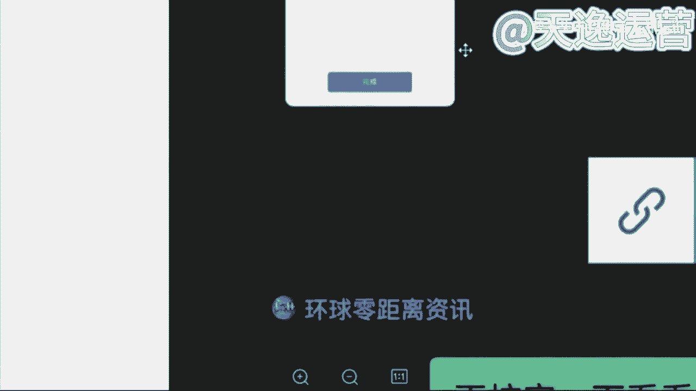
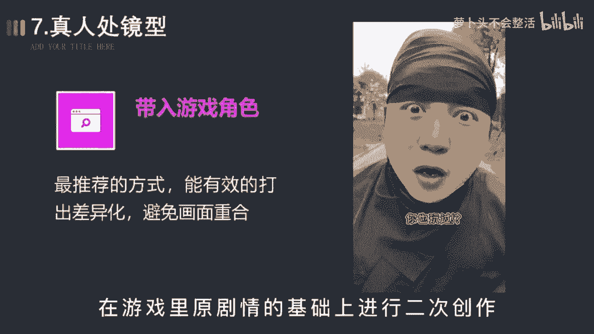

# 【自媒体教程视频】自媒体快速涨粉起号教程 新手必看：抖音运营全套教程，手把手带你玩转自媒体，运营／剪辑／创业全搞定！ - P1 - 萝卜头不会整活 - BV1ui42117Ec

🎼在本期视频开始之前，请问能先给个三连吗？哇，你要白嫖啊，那就给个免费的赞呗。不用实拍，不用写文案也能做中视频计划。今天啊再给大家分享一个复制粘贴，就能在抖音上搞钱的最新玩法。

这个玩法就是最近非常爆火的小说推文项目。先给大家看一个抖音上的视频。我看着身边的男朋友陷入沉思。我运营了我们大学的表白墙账号，因为觉得看着别人表白很有意思。没告诉任何人，这个号皮下是我。

因为担心会让表白墙失去神秘感，也担心吃不到朋友的瓜。这个视频呢爆了2000多的赞，几十万的播放，你可别小看这几十万的播放，就这一条视频给他带来了两三千的效益。最关键的是这种视频呢。

它根本就不用你去实拍出镜，也不用你写文案。文案呢就是复制粘贴的，而且呢也不用投抖荚。操作难度啊非常小，应该说呢是最适合新手铺过的一个项目。😊。

🎼那么有的人可能会问啊，这种视频它是怎么变现的呢？难道就通过中视频计划就能够一条视频变现两三千吗？答案不是的啊，因为这个视频呢它除了参加中视频计划吃播放量的收益之外呢，它最重要的还有一点就是这个视频啊。

它带有CPA的属性。你看它虽然画面播放的是减压的视频。但是它的文案呢是一直在读某一个小说里边的内容。只要有人通过他这个视频去搜这个小说的完整版。那么它每位小说平台推荐一位读者啊。

它就能够拿到10块左右的佣金。这个效益啊可不次于中视频计划。如果大家去看一下这类视频的评论区的话，你会发现啊作者一般都会顶置一条让你去找这个小说完整版的一条评论。玄机啊其实就在这条顶置的评论里边。

他让你去搜的这个关键词呢，实际上啊可能并不是小说本来的名字。🎼而是平台跟作者约定好的一个特定的关键词，只要用户通过这个关键词去平台上找到了这个小说，并且成为了用户之后呢。

就算这个作者给这个平台成功的推荐了一名用户。而这个关键词呢就是这个作者跟平台之间的一个约定。这个玩法呢，平台上已经有一些人在做了，而且呢做的非常不错，这就是小说推文项目，它的原理。

通过抖音去发作品来给小说呢推荐用户，从而呢获取佣金，就是这样一个简单的模式，我们圈里边呢就有人在做这个项目，已经做到了一个月好几个W的水平。那么这样的一个项目到底应该怎么操作呢？

接下来啊给大家详细的讲解。那么要操作这个项目啊，主要就是这两大步。第一步呢就是你要成为推荐官，拿到小说平台的授权。也就是我们也要拿到每个小说对应的推荐的关键词。那么到底应该怎么授权呢？在这儿呢。

没有办法。🎼直接说啊在视频的结尾我会告诉大家到底应该怎么操作。接下来很重要的一步呢就是视频的制作了。其实视频的制作啊非常简单，因为它压根儿不需要你写文案。

文案呢就直接用小说里边比较经典的比较能够引发大家好奇心的这些段落，找到之后呢，我们复制一定的段落，大概呢1000字左右，直接呢给它粘贴到AI的配音工具里边，然后呢选择一个你听上去还比较舒服的主播的声音。

然后就可以直接导出配音文件了。这样的话呢我们就有了一个配音的音频文件了。接下来呢我们可以去找一些解压类的视频，就像我一开始给大家展示的那个视频一样。这个地方要注意一下这个解压视频啊，千万不要只用一个。

而是选取很多个解压视频呢给它进行重新的组合，把解压视频的原声呢给它调小，最后呢用剪音把它导出来。这样的话呢，一个视频就完成了。这样的视。🎼频它的生产速度是非常快的，基本上一个视频啊10分钟以内就能搞定。

最后呢我给大家算笔账啊。这个小说推文的项目啊，经过我的了解呢，基本上啊你在抖音上的1万次播放，它就能够出2到5单，一单的效益啊大概是在10左右，那么我们试想一下，假如说你在抖音上拥有10个号。

每个号呢每天发三条视频，每条视频就按抖音给的基础的500个播放，那么它也有15000个播放，怎么也能够出5单以上了。而事实上呢我们圈里边有很多小伙伴一个人呢就操作二三十个号，这个呢毫不夸张。

而且呢据观察基本上每发100条作品里边肯定会有一条爆款视频。那么一旦出现爆款视频之后啊，这个播放量可就非常非常高了。就这一条视频就有可能给你带来好几千的效益。好了。

关于前面提到的小说推荐官这个授权到底怎么去搞定这个。🎼AI配音的工具又是什么？这些呢我都给大家准备好了，你可以到我的。🎼回复小说就能拿到了。好了，关于最近爆火的这个抖音小说推文的玩法。

就为大家分享到这儿了。这期视频啊可是干货满满，看懂的就赶紧行动起来吧。首先第一个板块呢就是自媒体它的一个现状和前景。就是无论我们做任何一个行业哈，无论是做前职也好，还是兼职也好，我们得清楚这个行业。

它的一个现状和前景。我们去做，对于我们来说有一些什么样的好处呢？那到底可不可以去做呢？是吧？我们了解清楚了过后，我们再去上手。我们才能更放心一点。那第二个板块呢，就是零基础的同学。

我们如何去打造一个高收益的账号，就很多可能了解一点自媒体的同学，或者说你是有做过自媒同学，可能都知道哈呃我们这个视频发出去，要么它是零播放量，要么你去抖音和这个快手上面，你去做视频。

啊靠这个播放量没有人来给你结算收益的这是为什么呢？那这个板块当中呢，我会教大家怎么去选择这个平台，怎么去选择领域和这个渠道，我们才能把这个收益赚到手。那第三个板块呢就是一个亿万流量的一个多种变现玩法。

就是很多同学了解自媒体呢可能都知道我们自媒体呢，就是我们做视频或者是文章发到。😊，这个平台上面去有人观看，我们可以靠这个播放量去结算收益。那除了这个之外呢。

还有很多种玩法都适合我们零基础同学去上手的那这个板块呢，我会给大家讲的那第四个板块，就是我们自媒体变现的一个正确打开方式啊，是怎么说呢？就是如果说你是听完整堂课。你觉得这个自媒体比较适合你的。

你也有时间来做的那我会教大家怎么去规划我们自己的账号，以及系统性的把这个钱赚到手啊，这是我今天内容板块一个划分。那么首先呢先来了解一下到底什么是自媒体呢，自媒体的话呢，我用大白话给大家讲吧。

就是我们今天打开我们自己的手机，百度去百度上面搜索一个自媒体平台，然后去这个平台上面注册一个属于我们自己的账号，在我们自己这个账号上面去发布我们自己做的文章，或者说视频啊，我们有人观看。

就可以靠这个播放量去结算收益。这个就叫做。🎼自媒体，我这样讲能不能明白？那我们了解了一下到底什么是自媒体。那我们得清楚这个行业它的一个平台现状如何呢？是吧？到底可不可以去做呢？

就是我不知道同学们在这之前有没有了解过这样一些新闻哈，就现阶段呢，我们整个社会呢，它是非常浮躁的，就很多人都想赚钱。就是在这之前呢，就原来很多人想赚钱的时候。

但是采取了一些不合法的手段去到缅甸这样地方被干腰子了的新闻，这样新闻有了解过嘛。有的来打个有字吧。就这个呢就是不合法的，国家呢它已经明令禁止了的，我们不能去做，因为我们去做。

对于我们来说没有任何的一个好处嘛，对吧？那么现阶段呢自媒体行业是属于国家支持的那国家支持呢，它现在已经把这个文件已经下达到了各个地方政府，包括你们现在看见这个呢是一个荆州市的六项措施啊。

助力自媒体以及新媒体高质量发展的一个文件，包括这个文件呢是今年6月2号人社局来发布的。人社局。😊，国家单位包括这个文文件当中呢也指出了，我们要加大政策宣传力度，有力支持自媒体以及新媒体行业的蓬勃发展。

包括你们也可以来看一下，有没有你们自己的那一个地方。包括往下边看，这个是这个是那个广西壮族自治区的，看见没？都是新媒体的，包括这个四川省人民政府的新媒体。

包括这个浙江省人民政府的以及杭州市人民政府和这个江西省赣州市人民政府都发布了相应的一个政策性文件，包括这个文件当中呢也知道了，啊也说到了，说我们要坚持正确导向内容为王，什么意思呢？

就是我们未来作为这个自媒体创作者，我们创作的这个文章和视频，它才是结算收益最重要的一个方式和途径。我这样讲能明白吗？就包括你们听到这里，你觉得这个自媒体行业，它可以来做吗？就是国家现在支持的。

因为他已经把这个政府文件下达出来了，你觉得他可以来做吗？可以是吗？对了，那除此之外呢，就现在政策性文件也有了是吧？来支持我们去做视频。那我们自媒体平台他也得响应国家的号召，他出钱让我们来做视频。

那他出多少钱呢？来我们去看一个视频来了解一下。我们希望接下来能够帮助更多的中视频创作者成为职业创作人。职业创作人的意思就是以创作视频为职业，并且通过创作视频就可以过上更好的生活。那为了实现这个目标。

未来一年，西瓜视频决定将额外拿出20亿元补贴中食品创作人。我想强调两点哈。😊，第一，这是真金白银的20亿元，不包含任何的商单、直播和电商的收入是纯补贴。我们也会积极探索保底将分成的模式。

助力创作人职业化，这可能也是行业首创。第二，20元只是保底上不封顶。啊，说到这里呢，我想起了一件事情。😊，好，同学们从这个视频当中了解到了一个什么关键的信息呢？就这个平台，他给到我们多少钱去做视频。

多少钱呀？20亿元对不对？包括刚才这个创始人，他也提到了这20亿元，它不包含任何的商单直播以及电商的收入，这什么是纯补贴。就是我们未来去做视频，我们就能去拿到这20亿元里面的收益。

这个就是我们未来能够赚到的钱。那除此之外呢，现阶段我们自媒体行业呢有一个优势，就他的用户数量非常庞大的，有多少呢？接近9。4亿了。

包括今年这个2022年这个中国研究生网站啊也出台了相应的一个自媒体行业的市场调查以及发展前景的分析报告。这个报告呢是今年9月9号来发布的这个报告当中指出了我国现阶段中国网民规模多少人是9。

4亿人接近10亿了，这9。4亿人呢，就是看视。频的人，他有手机有这个视频平台，每天都会去刷视频。那看视频的人有这么多了，做视频的人肯定也有吧，有多少呢？来往上边看，截止去年为止。

我就我国全职从事自媒体的，是370万人，兼职从事自媒体的是600万，就加在一起，一共做视频的人才970万人，我们应该算个整数，我们算1000万，好吧，就有1000万的人，他在做视频，有10亿的人。

他在看视频，这个相当于什么呢？相当于100个人里面只有一个人在做视频，问一下同学们，我一个人做的视频够不够，你们100个人去看我一个人做视频的速度能不能赶上你们看视频的速度。😡，其实是什么呢？

其实是不够的，对不对？为什么呢？这个就是我们国家为什么支持我们自媒体行业发展的一个原因。因为我们国家未来的一个发展趋势一定是在这个互联网行业当中。啊，是从哪里可以看出来的呢？

就是从我们小时候啊看的是这个黑白电视，就我们长大了之后看的是彩电。那包括到现在呢我们自己家的电视上面都能连接wifi了。这以后我们做的视频，我们自己家的电视上面，它都能够看见。

你可以思考一下这个用户数量是多么的庞大了。对？包括我们的用户人群呢也不断的在扩张。😊，那除此之外呢，现阶段我们自媒体这个行业呢最大的一个优势就是我们去做，不需要我们有任何的一个粉丝基础。

那我们只用靠这个播放量就能够赚到钱。但是我们呃说到这里哈，很多同学会有这样一个问题了。艾森老师，我们去做视频，但是我们没有粉丝，这个播放量是哪里来的呢。😡，就有没有这样疑问我去做视频是吧？没有粉丝。

那这个视频的播放量是哪里来的呢？首先要告诉大家，这个播放量是平台扶持的流量。刚才我们讲到了，国家支持它的文件已经有了平台它是会扶持我们去做视频的，就看你作品的质量如何了，就可能同学们现在了解到的平台。

自媒体平台哈可能更多的，要么就抖音，要么就是快手，是不是就平常刷视频用的最多的，是不是抖音和快手这样个平台，我们都知道抖音这个平台在前两年他短视频最火热的时候，就他在抖音直播带货最赚钱。

但是我们都知道你想要去这个带货，你必须要有粉丝基础吧，你没有粉丝基础，你去带货谁来买呢？是不是？那除此之外呢，我们自媒体平台跟抖音它是有一个本质的区别的。我们只需要去这个平台上面去做视频，有人观看。

我们就能够靠这个播放量去结算收益的，我们只需要了解一点，什么呢？一万的播。😡，放量他能够拿到多少钱？很多同学会问了，曾老师，为什么不是以千0为单位呢？是以万为单位呢？

当然有嗯有1000阅读量的单价但是只有我们拿到1万阅读量的收益的这个播放量的时候，我们才能够去结算收益，才能够把这个收益提现到我们的银行卡里面来。我这样讲能明白吗？

就我们去看一下这个1万的播放量的单价到底是多少啊，首先呢我们这边可以看见一个千次的阅读单价能看见吗？千次的阅读单价是多少钱是3。4块钱看见吗？这是1000的啊。

就1000的阅读量我们能够赚到3块钱那1万的阅读量有多少呢？我们乘以1万嘛，就是34块钱，这个单价你们要记清楚，这个就是我们未来能够揣在自己兜里面的钱啊。

等一下曾总老师会问的这11万的阅读量单价到底是多少呢？是吧？这个要记住好吧，那我们现在知道了这个单价了。很多同学会说，曾老师。😊，反正他都赚钱是吧？😡，那我现在不做，我以后再来做吧，是吧？反正他都赚钱。

反正他都赚钱是吧？这个行业我现在不做吧，我以后再来做有没有这样想法的，有的你就打个有字，就说到这里呢，问同学们这样一个问题，就是如果说这个未来自媒体行业，它发展成为像这个九年义务教育一样。

所有人都能来做的时候，你觉得你还能不能做起来。就未来我们这个自媒体行业，国家说哎同学们朋友们，我们现在已经把它纳入到这个九年义务教育阶段了，你全都来做还能来做起来嘛？

有的说能有的说不能就问同学们这样一个问题吧，就是这个呃就跟原来这个18年的抖音是一样的道理哈。18年抖音刚出来的时候，他是最火的时候刚刚站在风口上面是吧？那个时候选择做抖音的人，他是最赚钱呢。

他也赚到钱了，但是现在你再去做抖音，你还能做起来吗？现在你再去做抖音还能做。😡，起来嘛，就做不起来了，对不对？是一样的道理。每一个行业它都有相应的一个风口存在的。这个机会放在这里。

它是不会等着你来选它的。风口它是会过去的，你就不能来做了是吧？如果说未来你去大街上面随便拉一个人问他，你知道自媒体吗？他说哎我知道那个时候我就劝你不要来做了啊，因为你就需要花更多的时间更多的精力。

你才有可能能做起来。包括我们刚才说到的，这个行业的一个市场报告啊，就调查的这个报告是今年9月9号来发布的。说明我们是了解到这一个信息的。第一部分人群，我们刚刚站在这个行业的风口上面。

小米创始雷军曾经说过哈，站在风口，猪都能起飞，就看咱们要不要去做一只风口上面的猪。😡，是吧这个就是我说到的一个行业的风口啊，就看你自己愿不愿意来选择了。那说到这里问一下同学们。

你觉得这个自媒体行业它值得你来做吗？你觉得它值得咱们来做吗？是吧？这个风口嘛，就看你自己要不要去选。😡，好，那除此之外呢，有很多同学也会说到了是吧？好，曾总老师，我觉得可以做是吧？

我觉得能赚到钱也值得去做了。但是为什么我发的这个视频发出去，它永远都是零播放量呢，要不然只有几百甚至1000多的播放量，是不是这个平台他不喜欢我，他看不干我，所以说他不给我推送流量啊，其实不是的。

是因为我们自媒体平台呢，它总共有30多个啊，这30多个平台呢，同学们全部截图保存啊，这30多个平台我们未来都能够用到的，今着截图啊吧，因为这30多个平台呢。

它每一个平台结算收益的方式适合的领域都是各不相同的。同学们熟悉嘛，对他们了解吗？其实不太了解，对不对？那首先我们来看一下，其实每一个平台它适合的领域都是各不相同的。包括给你举个例子吧。

比如说今天啊我说我要做一个这个今日头条这个头条号，我说我要做，那我先把这个平台账号注册好。那。😊，注册好了过后，我去选择一个适合B站去做的舞蹈领域，我能在这个头条上面做起来吗？觉得能做起来吗？

我去做的是头条号这个平台，但是我偏偏就选了一个适合B站去做的领域。为什么呢？这个就是很多这个自媒体嗯呃这个人没有做起来账号的原因。你连平台以及领域都没有选择对这个平台，他凭什么给你推送流量的。

他不会把这个流量浪费在你的身上的，他是会去扶持适合他这个平台适合用户去观看的领域的。这个呢我到时候送给大家好吧，这个领域的区分，到时候我送给大家啊，让你们有一个领域区分的地方。

但是呢我得看你们的表现好吧，谁今天啊互动性是最强的，是真正想要学习到这个知识的，我就送给你们啊，因为曾老师特别喜欢这个爱学习的同学，好吧，看你们的表现喽。😡，那除此之外呢。

这30多个平台呃30多个平台里面我们该去选择什么样的这个内容，我们来做视频呢？是吧？那首先问一下同学们，平常在这个刷视频的过程当中，我们刷什么样的视频，刷的是最多的，你看什么样看的视频看的最多。

是影视的呢？解说的呢是吧？单视频剪辑的呢，还是说游戏的呢综艺的呢，动漫的呢搞笑的呢？你看什么看的是最多的，美女。😊，好的好的，我知道了。那喜欢看美女的同学非常的不错呀。曾的老师也喜欢看美女啊。

但是我们把看美女的时间，我们去做一个美女的盘点视频，它可能赚钱会更快一点，是吧？影视的是萌正能量的、搞笑的。还有呢其他同学呢看什么样的视频看的是最多的。😊，还有没有其他的？基本上都是影视了，是吗？

好的好的，我知道了。影视呢在所有的平台上面确实扩散量是最大的啊，军事的也有是吗？军事的它在我们国内的平台是可以做的，但是涉及到一些呃会比较外网的平台，它是做不了的。嗯。

像现在的那个ttok它就做不了这个是吧？那首先呢在这个平台上面，我建议同学们哈一定要去选择对赛道，我刚才说到了，你赛道选择对了这个平台他才会给你推送流量。我建议你们去做的话，就以这三个类型的视频为主。

首先第一个视频剪辑类的。第二个解说视频类的，第三个混剪视频类的，这三个类型的视频是现在所有平台大数据分析之下，用户的点击量阅读量以及完播率是最高的三个领域。大数据是什么意思，知道吗？

同学们大数据比如说我举个例子吧。比如说我们平常就很多同学呢会说看的东西是比较多的，就刷到什么看什么。比如说呃这这一类型的视频的话，就是我们所有同学说不知道的也是啊一样的，就平常刷到什么，看什么。

你在所有的类型的视频的这个停留时间它是一样的。但大数据呢就是如果说我们今天选择抖音这个平台，我今天刷美女刷的时间更长，从明天开始这个平台，他给你推送美女的视频绝对是最多的。

如果说你看美食类看的是最多的那从明天开始这个平台他给你推送美食类相关的视频，它就是最多的。有没有这样的情况是不是这样子的，这个叫大数据啊，大数据呢。

他现在可能比我们自己的爸爸妈妈还要了解我们知道我们到底喜欢什么样的内容，什么样的东西，跟着大数据去做视频，啊，你的这个播放量呢，它才会更高。😊，🎼啊，那首先呢。我们先来讲第一个视频剪辑类，好吧。

视频剪辑的话呢分为很多都可以去做这个视频剪辑。比如说首先第一个就是这个电影的，就影视的剪辑嘛。电影的啊除此之外呢，像这个电视剧的或者说综艺的啊。

这个都是这个视频剪辑类的那如果说我们想去做这个视频剪辑类的呢？我们首先要去干嘛，要去找素材，对不对？那这个素材我们该怎么去找呢？找素材呢，我们先从这几个平台去找。首先第一个所有的视频平台。

知道视频平台有哪些吗？啊，那现在不知道的同学来看一下，这个就是我刚才让你们截图保存的这30多个自媒体平台，现在不知道的同学在截图保存一次啊，这30多个自媒体平台呢都是我们能够找到素材的地方。

啊这30多个自媒体平台呢，我们都能找到素材，那除此之外呢，第二个我们可以去一些影视网站里面去找，我不知道同学们有没有了解过哈，影视网站。比如说我举一个例子，就原来我们所说的这个豆瓣电影。

这样子的呢都是这个影视的网站。包括我自己呢整理了将近有这个50多个啊影视的一些网站，这些网站里面所有的一个影视素材，它全部都是没有版权要求的。这个呢我到时候也可以送给你们。除此之外呢，这个平台呢。

就这些网站呢，它是关于影视类的。就很多同学说哎，曾老师那我不想做影视类的是吧？我想做一些其他的什么动漫的综艺的搞笑的，我想做一些这些类型的O也可以啊。

我自己呢也整理了将近有60多个这60多个网站呢里面除了影视类的，像这个旅游的啊，这个图片类的啊音效类的评论的体育的美食的动漫的综艺的搞笑的或者说各个国家的境内境外的视频素材。我们都是能找到的啊。

都是能找到的这个呢我后边也送给你们好吧，让你们能有一个找素材的地方。那除此之外呢，第三个就是我所讲到的这个影视推广的平台。就影视推广的平台呢，现在他可能做的更多。就是我们在这个抖音或者说快手上面。

我们很多同学都知道哈，你去抖音或者说快手上面做视频有做过的来，就是去这个抖音或者说快手上面发过视频的。有没有就我们都知道啊，就抖音和快手这两个平台，你去发布视频，最多最多。

可能只能达到一个涨粉的作用是吧？这个播放量它是变不了线的那如果说我们去做这些影视推广平台里面的这些影视素材啊，我们是可以靠这个播放量去拿到奖金的啊，这个平台呢等一下我会着重奖啊，我会着重奖。

那么首先呢如果说我们要去做这个视频的剪辑，我们素材该怎么去找呢？比如说我给你举个例子吧。啊吧我们今天打开我们自己手机的百度啊，我们先打开这个百度打开了过后呢，我们随便去搜索一个自媒体平台吧。嗯。

用这个西瓜视频。😊，我们搜索一下这个西瓜视频，然后点击百度。我们打开它的网页。比如说我今天举一个例子，我想要去做一个这个关于综艺类型的是吧？我想要找一个人，比如说综艺类型的，就是他跟娱乐是相关的。

就同学们平常看直播吗？直播看不看，就像一些网红的直播，什么大杨哥，小杨哥是吧？比如说我们想要找一些这一类的素材，我们直接去搜索他们这一个关键词就可以了。什么关键词呢？就直接搜名字啊，大洋哥。小杨哥。

我们直接搜索关键词，然后点开搜索，我们就能找到非常多的一个素材了。现在我们按照这种关键词的方式去找素材，能不能找到？但是在这个找素材过程当中，我得给你们强调一点，我们正确找素材的一个方式。

不是让你们把这个视频直接下载下来，就很多同学我不知道同学们有没有听到过这样一个词语，就你们可能听过课程的哈，有的老师叫你去做搬运有没有听过的，或者说有没有做过搬运的。如果说你直接去把这个视频下载下来。

他跟搬运就没有什么区别了啊，搬运的内容，现在平台95%的人，你去做都通过不了审核。所以说告诉你们正确找素材的一个方式，就是我们要从这么多的这个视频当中去找到符合我们自己视频主题的视频片段。

就每一个片段呢大概保持在10秒钟左右啊，10秒钟这个数字，你们要记住，到时候。我们找到素材，我们去做视频，平台在审核的过程当中才能给你通过，是不会有违规存在的。这个记住了吗？记住了公屏上打一啊。

10秒钟左右，每一个素材片段，就按照这个这个时长去找就可以了。那除此之外，再举一个例子，比如说我们今天想要做一个沈腾的是吧？沈腾明星明星网红它都是自带呃这个热点的啊热度的，你去做它不缺流量啊。

不缺流量的那一样的。我们打开一个。关键词直接搜索，就你们能找到素材呢是非常多的啊是非常多的那现在我们素材能找到了吗？那如果说我们这个视频素材我们自己能找到了。

那我们想要去做视频OK那我们是必须要用到什么呢？用到剪映这个软件的。做视频的话呢，问一下同学们用哪一个软件用的是最多的，手机还是电脑你用哪个我等一下就用哪一个给你们实操好吧，根据你们的一个要求来。

都是手机啊，没有一个打电脑的吗？好的，我知道了，就你经打手机的，这个速度就让我感觉到，生怕我看见电脑是吗？好的，稍等一下，我投个屏好吧，我投个屏。😊，啊，那我们今天呢如果说我们要做视频哈。

我们首先呢要确定一个什么呢？主题。比如说我举个例子吧，我说我们今天去做一个综艺类型的，我们就要确定一个人物什么人物呢？我们今天去做一个这个呃沈腾的搞笑名场面吧，就这一个视频的主题，我们的主题确定了。

那这个视频的素材当中必须要有沈腾这个人啊，这个是主题，到时候你们要记清楚。好吧。那现在同学们能看见我的手机了吗？能看见我的手机了吧。那么首先呢在我们自己的手机上面找到一个剪映的软件啊。

就这一个剪映的话呢，它这个手机端和电脑端图标找的都是一模一样的啊，没有什么区别。我们找到这个软件过后呢，直接点开它，点开了过后，我们可以看见一个加号的界面，就是开始创作这个界面。

我们直接点击这个加号的位置，然后把我们自己找的一个视频素材，先给它添加进去一个，那么这个视频素材添加进去了之后呢，首先讲一点，我们自己做视频的话呢，素材它是能找到的。但是我们要做的这一个视频的主题背景。

它是找不到的，只能我们自己去制作。那怎么做呢？首先我们要找到这个视频轨道有右边有一个加号的位置，看见了吗？直接点击这个加号的位置，然后我们找到这个手机自带的素材库，啊，这剪映自带的，看见没？素材库。

我给你们圈出来，找到素材库了过后来直接点开。我们在热门里面就可以看到非常多的一个背景主题非常多。包括我们用的话呢，像这一类型的，或者说这种的这种的包括这种的，我给你们圈出来这种背景呢，它都是可以用的啊。

都是可以用的。但是我更建议你们呢去选择一些简单明了的，就是用户点进来一看，我就知道你做的这个视频是什么主题，就是黑白色的这个背景，我们就选择一个黑色的背景添加进去吧。啊。

那这个背景添加进去了过后来首先背景有了，我们得添加主题吧。那这个主题该怎么去添加呢？来左下角有一个文字的选项，直接点击文字然后点击最左边这一个新建文本啊，看一下文本框出来了。

那现在我们要打我们自己做的这个视频的主题，我们刚才说到的，我们今天要做的这一个视频的主题人物，他是谁是谁呀？这个我们一定要记住哈，我们的主题人物，如果说明确了，你找的视频素材当中必须要有他啊。

必须要有他。如果说没有这个素材，我们就用不了，是谁还记得吗？我们刚才说到的，我们刚才说到的是谁来着我们今天要做一个沈腾的搞笑名场面啊，沈腾这个人，你们是必须要记住的。这个沈腾名字确定了。

我们所有的这个素材当中必须要有他出。线啊，如果说没有，到时候这个素材用不了，重新找好吧，这一点是要记住的哈。那么首先呢先来打两个字，就是谁呢？就主题人物沈腾。沈腾的什么呢？沈腾呢他有自己的综艺场面。

也有自己的影视场面。如果说你找的素材是跟影视相关的。你就打影视啊，如果是跟综艺相关的，咱们就打综艺，好吧，这个咱们区分开来。沈腾的综艺报笑名场面。O这个名字我们确定了过后。

但是我们看一下是不是非常白白色的文字，我看起来不太好看，不太好看是吧？我们所有人呢他都喜欢一些色彩鲜艳的东西，这是比较抓人眼球的。那接下来呢我们也不要去选择什么样式和花字了，不用。

我们直接去选择右下角这个文字模板，我们直接往上套啊，这样是最方便的。那么这个文字模板呢，根据你自己的实际情况来，它有收费的，有免费的啊，我们自己去选就可以了。我们随便选择一个模板来看一下。

同学们觉得这个模板可以吗？觉得这个模板可以用吗？我觉得还不错啊，这个模板我们找到了过后呢，来直接选择右上角的这一个对勾。OK我们的主题背景有了。那我们选完之后呢。

直接手动的选择整体这个文本框的右下角给它放大一点，好吧，让我们这个文本看起来更清晰。好，这个文本就这个背景我们制作完了过后，OK名字是有了，但是我们不能让用户点进来看什么看哑巴电视吧，不可以。

谁都喜欢有声音的东西。那问一下同学们会配音吗？同学们会配音没会配音的，你打会字吧，不会的，你打不会，如果说会配音的同学，咱们自己就打开自己手机里面的录音机，我们把这个名字自己念一遍就可以了啊。

如果说不会的，没有关系，我们直接选择右下角这个文本朗读，我们直接往上套就行了啊，这个是比较方便的。我们选择文本朗读了过后来你看一下，就是特别多的声音，什么方言音啊，什么男生喜欢的萝莉音啊。

什么女生喜欢的这个男士的播音腔O都有的。但是我更建议同学们去使用一些这个方言音啊，就方言音在现在所有平台，它上面的一个呃运用率它是比较低的，它是比较有吸引力的，你们去做，它是比较能够吸引到人的。

像方言的。😊，话呢我最近呢比较喜欢一些广西的方言，因为我觉得很有意思，也没有广西的同学，我觉得很有意思。好吧，我们就先来听一下这个方言音。😊，神腾公寓爆销名场面。沈腾中艺爆笑名场面。沈腾中医报效名场面。

深腾总一保小命昌面。沈腾总一包厢明唱面。沈腾综艺报校名场面。深圳中医报销名场面是不是非常多的方言音啊，咱们自己去选就可以了。那我就选一个广西的方言。那我们这个方言音，我们选择完了过后。

直接点击右下角有一个对勾。OK它就会自动的去下载这个音频。那这个音频下载完了之后，我们从头来听一下。沈腾中医报销名场面OK现在声音呢它是有了。那我们现在呢手动的选择这个黑色的背景。

你直接点击它一下就可以了。那点完了过后呢，我们自己手动的来给它缩短一点，让它能够音化同步。那这个主题的背景我们制作完了过后来，紧接着重要的来了。就我们本身视频的本身，首先我们来看一下。

有没有沈腾这个人O有那这个素材我们就能用。我们刚才讲到的，如果说这个里面没有沈腾，那咱们就用不了啊，这个你要记住，那首先呢在讲的过程当中，我边讲边给你们讲细节。首先第一点我们要做的这个视频。

它必须是16比9的一个横屏，这是所有平台，它硬性的一个标准，如果不是这一个比例，O平台的审核是不会给你通过的一定要记住这个比例啊，我给你们打在公屏上了。那除开这个呃抖音啊，除开抖音，因为抖音的话。

它是需要9比16的竖屏啊，除了这个抖音之外，其他平台都是16比9的一个横屏。这两个咱们记住，咱们把区分开来，到时候做视频的时候，比例要选择。对那这个比例呢首先我们来看一下该怎么去做啊。

就像我们这个视频一样，它明显不是1个16比9的横屏，我们该怎么去调整呢。来，首先最简单的一种方式，我们找到这个手机下方有一个比例的选项，直接选择它来。

现在我们看见有1个16比9的横屏的选项没给你们圈出来，看见了吗？就是这个找到了过后直接点击它我们现在就来看。这个素材视频它到底动还是没动，如果说它动了，okK它就可以用这种方式去做比例的调整。

那如果说像这个视频一样，它移动也不动，那该怎么去调呢？我们自己手动调，该怎么调呢？这样可以增加我们使用素材的这个几率啊，就是我们能够用到的素材就更多了。首先呢我们选择左下角有一个剪辑的选项，找到剪辑。

然后选择里边有一个编辑的选项，看见了吗？直接选择编辑，然后我们自己来干嘛？裁剪这一个画面，那裁剪过程当中呢，首先强调一点哈，所有的这个视频当中原有的这个字幕，咱们不要留，直接给它裁掉。

我们等一下自己做就可以了。那在这个裁剪过程当中呢，包括这个边框，到时候你们少给他留一点啊，少留一点边框，到时候留多了过后，它会有一个黑色边框会不好看，少留一点就可以了。这个画面我们裁剪完了过后。

直接点击右下角的对勾。OK来看一下这个比例是不是调整了，视频它明显的放大了，但是它也不是1个16比9的横屏。如果是的话呢，它就不会有这个黑色的背景了。那接下来该怎么去调呢？

找到我们手机右下角有一个背景的选项。在这里看见没？背景直接选择它，然后右下角有一个什么呢？画不模糊，看见吗？直接选择画布模糊。我们调整到第一个清晰的画面。

现在你也再来看一下这个是不是就是1个16比9的横屏了呀？同学们这个步骤要记住啊。啊，记住了，对吗？好，来接下来一样的右下角对勾点起来啊，这个比例我们弄好了弄好了过后呢，来接下来第二点，我们每一个视频呢。

它毕竟不是一个原有的视频，不是一整个每个视频呢大概在10秒钟左右，对吧？那这个视频之间呢，它是必须要有衔接的，我们必须要添加这个转场的视频。

就我不知道同学们有没有这个在看视频过程当中有没有看到过一些转场。就比如说呃有的这个视频看完了之后，中间会给你添加一个不属于这个视频当中任何一个片段的，搞笑的界面，有没有看到过有对不对？

为什么要添加转场呢？我们要让用户明确的知道它每一个片段的内容是不一样的啊是不一样的。如果说每一个片段不一样的情况之下，你不添加转场。他在看第二个视频的时候，心里会咯噔一下。

因这个视频的片段怎长得不一样呢？视频内容怎么不一样呢？往往有这种情况的时候，我们会做出什么一个动作呢？退出去看一下我今天看的这个视频是什么。如果说他有这个退出去这个动作了，我们的视频完播率它会直线下降。

完播率是会影响到我们整体的单价和收益结果的。所以说转场必须要添加。那该怎么去添加这个转场呢？来一样的，这个视频轨道右边有一个加号的位置，看见了吗？我们用它的机会是非常多的，点击这个加号，一样的选择谁呢？

选择这个素材库啊，我们一样去找到这个素材库，点击它在这个热门里面非常多的一个这个转场，包括像这种的这种的包括这种的熟悉吗？同学们这种转场是不是看的非常多，包括现在所有做的视频，只要是添加了转场的。

转场基本上都从这个简易里边找的，你们都可以去用啊，这个没有什么问题的，那在找转场的过程当中呢，强调一点。我们不要去找太长的，像这种16秒钟的，不要去选啊不要去选。因为太长了。

我们没有任何一个人会把不重要的东西，我们有耐心看完的。没有。所以说我们选择尽量保持在3到5秒钟的一个转场那最合适的我们选择一个3秒钟的来我们给它添加进去啊。这个转场，我们添加完了过后来看一下一样的。

也要强调一点，转场的视频，它也必须跟我们所有的一个视频比例保持一致，什么呢？16比9那这个视频我们出来了过后，右下角直接会有一个画布模糊，画布模糊这个选项啊，直接找到它点击第一个清晰的画面。这个背景。

它就是一个16比9的一个横屏了啊，现在要记住，我们找到这个画布模糊之后呢，依然右下角的这个对勾点起来啊，点起来啊一样的，我们这个视频的比例呢，它做完了这个步骤。有没有记住啊。

我们该怎么去做这个视频能听懂吗？这个步骤啊，我们该怎么去裁剪这个比例，该怎么去添加这一个背景的主题能是不是好的好的，那么这个视频能做到现在来接下来下一步，我们要去添加我们这个视频的文案就是字幕。

我们该怎么去添加呢？依然找到我们手机左下角这一个文字的选项来点击它一下，我们新建文本右边有一个什么呢？有一个识别字幕看见了没？直接点击这个识别字幕，然后我们选择这个开始匹配。

它就会自动去给我们识别这个音频当中，或者说这个视频当中人物所说的话给我们形成一个字幕来看见了吗？字幕现在出来了，稍微调整一下，怎么调呢？放大一点，就这个字幕，文本框的右下角。看见没？给它往右边拖。

那现在放大了过后，整体把这个文本框拖动到视频最下方的一个位置，现在看起来是最舒服的。就你调整完了一个字幕过后，第二个你就不用调了，因为它都会随之来调整啊，这是最方便的。现在这个视频该怎么去做啊。

该怎么去剪这个视频，这个视频我们该怎么去做，知道了吗？我们一定要按照这一个比例或者说按照所有的一个步骤，找素材也是严格的去做好吧，不要去找太长的一个视频，到时候平台在这个审核的过程当中。

那要不然他就不会给你通过了。知道这个视频做起来难不难，同学们其实不难，对不对？好，很多同学呢在这个过程当中也会说到了。哎，曾老师。

这个视频确实不难是吧？

那很多同学呢也说到曾老师，那这个视频一样的，我如果说想要去发到这个抖音或者说这个快手上面，我们该怎么去结算这个收益呢？这个曾曾老师要给你们讲到哈，我们这些视频呢，他发到其他的一个平台上面去。

如我刚才所给你们讲到的。这个视频我们剪完了过后，发到这30多个自媒体平台，就除开抖音和快手，其他的平台呢，我们都是可以靠这个视频本身给我们的一个播放量去结算收益的，这是可以的。

但是抖音和快手这两个平台呢，就像我刚才讲到的这个视频发上去最多最多他可能只能增长粉丝啊，这个就是我所要强调的，就有没有同学你们是只想去做抖音和快手这两个平台的，就只想去做自己熟悉的平台。抖音和快手。

曾老师我想去做这两个平台，但是我同时去做呢，不光想涨粉，但是我也想靠这个播放量去结算。收益的有没有有的在公屏上打有字吧。让我刚才所讲到的这个所有的一个视频的话呢，它发布的平台呢。

你们就可以去这个抖音快手小红书以及微信视频号上面去发，就这四个平台熟不熟悉，同学们熟悉吗？就你平常会用到的对不对？这个小红书呢，包括很多这个呃可能女性或者稍微年轻一点的。95后可能用小红书这个平台呢。

可能用的比较多一点，像微信视频号呢，就我们人手都有一个微信，微信里面有一个这个小程序就叫视频号，我们可以去发布这几个平台啊，这几个平台发布了过后，我们通过什么样的途径呢？我们去通过这个视频。

这个影视推广这个平台，我们去做任务。然后我们通过这个任务去结算奖金，我们可以看一下素材的话呢是非常多的，包括这个红字的部分，你们就可以看一下，包括爱奇艺的任务。

搜狐的任务，这个呢就是所有影视剧的名字。看见没？影视推广是什么意思，知道吗？同学们影视推广是什么？知道吗？就影视推广的话，就是每一个电视剧或者说每一个电影或者说每一个综艺，它都会涉及到宣传啊。

宣传就很多这个现在很多广告商呢，就是因为很多明星也好，或者说很多网红也好，我们拍完了这些电视剧或者说短剧，之前因为疫情的原因，没有办法到线下去这个宣传。他们都会运用到这个影视推广的平台。

就我们去做视频帮他去推广。我们就可以靠这个播放量去让他给我们结算奖金。包括每一个这个视频，就每一个电视剧这个视频，我们做完了之后，我们是需要添去这个提交一个这个任务的这个回填链接的，就我们要去报名。

就我们要填写自己的微信号账号昵称，或者说我们自己抖音或者说快手的ID包括我们自己做的是哪一个电视剧，我们要添加清楚，包括。😊，这个电视剧这个作品的链接你是发到哪个地方的，你要粘贴上去。

发布的时间是哪一天，包括你要把这个视频的播放量的截图上传上去。到时候我们这个回填链接填完了过后，我们就会给你结算收益了，这个就是影视推广哈。因我们也可以看一下这个影视推广的话呢。

它的这一个收益呢会比纯播放量的一个收益会更高一点。那现在我给你们看一下。😊，看见没？包括短剧的话呢，其实是非常多的。短剧的话呢，就是现在很多这个不是很多传媒公司嘛，就有很多网红，他们会自制一些短剧。

短剧话呢就是他没有办法自己去做一些这个广告的宣传，他就会让我们自己来做这一个视频，发布到抖音小红书视频号，那没这三个平台都是可以去发布的。然后呢，根据播播放量的这个要求去计算我们的收益。

没有粉丝要求的啊，对于我们自己的账号是没有粉丝要求的，有没有粉丝跟他没有关系啊，我们一部剧呢最高播放量的三个作品，加起来的总和去给你结算，包括这个总和该怎么去计算的。

看一下抖音这个平台一万的播放量奖金是50块钱。就最开始我给你们算的那个单价，还记得是多少嘛？就一万的播放量单价，就一万的播放量单价是34块钱。那个是头条号34啊，对，34。就那个呢是头条号。

它这个播放量的一个单价的收益。像这个抖音的话，你明显的感觉到这个一万的播放量奖金收益是会更高一点的。因为抖音的话呢，它这个每天的日活跃用户接近10亿了，非常庞大的啊，是非常庞大的啊第二个视频号的话。

就是微信视频号，你发上去一万的播放量奖金是10块钱，为什么它的单价会低呢？是因为我们每一个人都有微信啊，每一个人都有微信都会去看这个视频号的，所以说它单价呢会少一点啊，会少一点。像这个小红书的话。

它单价是最高的啊，小红书的单价是1000的播放量，奖金是30块钱1000啊，就我们叠加起来呢，每一个这个呃视频，就如果说我们去结算这个收益过后，每增加一万的播放量到时候还是会有奖金的啊。

这个就比较可观了是吧？除此之外呢，像一些搜狐的短句。搜狐视频的话就是现阶段我们可能看见的是比较少了，就我们原来看的时候呢会更高一点。就是搜狐视频。搜狐视频呢它也买了很多视频的版权。

但是因为这个本身这个视视频，它的这个知名度可能不是很高啊，可能不是很高。所以说他很多短剧呢，没有办法去拿到一个好的评分，或者说更高的一个这个播放量，但是会拿过来给我们去做的。像这个抖音和快手。

这是需要两个平台都去发的啊。抖音加快手让他按照什么结算呢？点赞计算，也是没有粉丝要求的，就单条作品如果说有5000个赞是怎么的？就是我们抖音和快手，我们右边它是会看什么，就会看那个点星星，知道吗？

那个是点赞5000个赞是100块钱，抖音的话，如果是1万个赞是200块钱，快手1万个赞，它是180，他给的单价是最高的啊。这个搜狐的短剧，单价是最高的，就这一个有没有兴趣的。因为这个影视推广的话。

它收益结算的话呢，是一个月结一次啊，是一个月结一次，这个能接受吗？就我们是月底结算的这个收益结算的话呢，就按照播放量计算。我刚才说到的，每一个这个短句呢要求是不同的，我们按照他的一个要求来就可以了。

像这个呃呃除此之外，就如果说同学们做这个影视的推广。除了这四个平台之外，你们可以靠这个播放量去结算这个奖金。如果说在这个基础之上，你们还愿意去添加解说的，就我们一个作品，一个视频。

你是可以获取双份收益的，什么意思呢？就除了刚才我们讲到那四个平台之外，你可以发布到其他平台，你是同时还是有这个什么呢？还是有版权的，你可以去做影视的解说一个视频我们拿双份收益。包给你看一下吧。

就我之前有一个小伙伴也是。这个就这个小伙伴呢之前做的就是这一个影视的推广。你们看一下这个收益吧。当时这个小伙伴他是自己有想法的，他对抖音这个平台是比较喜欢的，但是看中这个抖音的一个带货能力。

但当时呢他自己的账号粉丝也很少，他想要去做带货。但当时呢他说先积累粉丝，后期呢他是想要带货的，做的就是影视推广，因为影视推广的话，当时他问我可不可以朝这个方向发展。我说可以呀。

当时我直接把那个回填链接发给他了，报名的渠道，我说每一次你去做之前，你先把这个报名渠道填完，填完了过后做了视频，你要去填那个回填链接，就我刚才给你们看见的那个账号的ID你是必须要写清楚的。

到时候要不然到时候这个抖音就结算不了哈。这个当时我给他看的就是因为最开始呢他做的是什么呢？做的是短剧。因为短剧的话呢，他是这个推广的渠道是很少的。如果说我们去做这个播放量的这一个收益呢，他是会更多的。

当时他做了第一个短剧，这个短句的话，要求是发三个视频。😊，就每一个短句他会有不同的要求，他让你发三个，你必须要发3个，他让你发10个，你就必须要发10个啊，这个我们得按要求做事情的。

要不然到时候他是会给你下架处理的。当然他这个视频做完了之后呢，播放量是很高的，186万。因为短剧嘛它是比较能够贴近现实的，就比较能够抓住我们用户的一些心理啊，所以说他这个播放量呢是比较高的。

他也觉得很恐怖。但是就是这些短剧呢，他只是说我们平常看的比较少而已，就所以说这个话题度是很不错的。当时呢他这个短剧186万的一个播放量结算的话呢，差不多在500左右，结算是结算这么多。

但是如果说后期每增加一万的播放量我们还会给他添加10块钱的这个奖金，这机会是很好的。但是这一个那做的第二个短句呢就是效果就没有这么好了。因为第二个短句呢，他选择这个短剧呢可能就是本身的话题度就不是很高。

但是呢呃它的单价会更高一。啊，这个就是有不同的一个选择了嘛。当时他这个短剧的话呢，过程当中是1。4万的一个播放量啊，1。4万就很低。但是呢单价的话是给到了150的，所以说单价不同。

他给的这一个收益呢也是不同的。当时这个过程当中的话，它是做了将近一周的时间7天，因为一个月结一次嘛，刚好碰到月底的时间了，结算收益的话，当时官方系统那边给我结算的。因为他是第一波做这个影视推广的人啊。

所以说结算给我的。如果说后期的话呢，我们全部走这个对公账户啊，全部是走对公账户。因为系统那边要核销的。那结算的话，四个短剧，一周7天他做了4个，第一个短剧的话是在那个186万的基础上面。

后面又正增加了1个6万的播放量，叠加是60，总共结算是580。第二个播放量不高，但是结算了150块钱还是可以的。第三个呢就是因为他没发快手，这个是很可惜的。因为那一个作品要求发抖音和快手，他只发了抖音。

没发快手，所以说只给他结算了一半的收益是120块钱。第四个呢，因为本身任务的单价是比较低的，只结算了45，当时总计的话是895块钱，这一周的收益，这个还可以吗？满足了嘛？就7天的时间，啊做了4个短句。

当然这个根据咱们自己的实际情况来，你有更多的时间你就可以做更多的短句，然后去填回填链接，一个月给你结算一次，还可以的。这个收益还可以了吧。7天的时间啊，这个呢后期全部走这个对公账户。

但是呢过程当中得给你们强调一点，这个渠道是我给你的，你做的视频呢是必须要发给我的。我审核通过了之后，你才能去发要不然直接给你下架掉啊，直接给你下架了之后，你就没有办法去靠这个播放的结算收益了啊。

这个要给你讲清楚就是这个渠道的话呢就很多同学会有这样一个疑问，说哎曾老师，为什么他们自己不去发广告呀，要把这一个。视频就这个影视推广拿给我们去做呢？有没有这样疑问的？而曾老师，他为什么不自己去做宣传。

发广告呢？他要让我们去做这个影视的推广。😡，有没有这样疑问的？因为我不知道同学们有没有了解过这样一些信息哈，就每当一个这个影视作品或者说制片方出品人，他们去发这一个广告，他们的费用，不知道你了不了解哈。

就低的话呢？基本上每一个这个广告低的话是10万左右，一个广告，他可能发的地方呢是比较少的，多呢？他是100万起步的，这个广告的费用，你是觉得他把这个影视的这个推广拿给我们去做，给我们结算的这个奖金。

他花的钱多，还是他们去发广告花的钱更多呢？你觉得是哪一个，你觉得是推广花的钱多，你打推广你觉得他自己去发广告花的钱多，你打广告，你觉得是哪一个他花的钱更多一点。😊，是不是他自己发广告花的钱更多，是不是？

这个就是为什么他要把这个影视推广拿给我们去做。因为我们人多力量大，我们去做视频，它的这个扩散度是更高的。包括因为这个疫情期间哈，这个机会呢，他原来是没有的。

是因为现阶段的疫情它真的放开了之后可能会更加的这一个扩散度会更庞大了。所以他们不会选择去线下宣传，基本上都是拿给我们做这个影视的推广的，这是一个机会啊，就看你自己愿不愿意去做这个了。😊，那除此之外。

就问同学们一下，有没有想去做解说的啊，你说曾老师，我就想做这个影视的这个推广是吧？我在这个基础之上我还是想想去添加解说。我也想要去争这个双份的收益的。有男有子吧，有想要去做解说的，是吗？好的好的。

我看见了。在这个影视解说的话呢，就很多同学在选择这个解说之前，有问同学们这样一个问题，你在没有来听我的课之前，有没有听到过这样一句话，就很多老师告诉你，哎，同学们不要去做解说了，解说他已经赚不到钱了。

😡，有没有听到过这样言论的？没关系。如果说有听过的呢，我们就不要去信。好吧。如果说没有听过的呢，咱们就不要去听了啊，因为影视解说或者说解说的视频，它是我们所有的视频领域当中最赚钱的一个领域，赚钱的东西。

我们为什么不去做呢？只是说在这个过程当中呢，我们一定要选择好赛道。因为我刚才讲到的影视解说呢，它不是不可以做，它是可以做的，只是说不太好做而已，不好做是在哪里呢？很多同学如果说你没有版权的情况之下。

当然我们就没办法去做。因为影视版权它是会非常重要的。但如果说你去做这个影视的推广，你去做解说它是有版权的，它就对于我们来说就比较好做了。那如果说很多同学你不想做这个影视推广的。

同时呢你想去做这个解说的视频。我们就去选择一些跟这个教育类相关的。教育类相关的呢，就有很多，就现在呃社会当中有句话说的是非常好的，就很多人都。说 it。我们所有人，包括我们自己也好，我们的父母也好。

在这个教育这个领域当中，这个行业当中花的钱是最多的。这句话认可吗？认可的在公屏上打个认可两个字吧，认可吗？就这句话，就很多人在教育这个行业里面花的钱是最多的。我们做视频，我们就去贴合教育这个领域去做。

我们做解说一样的，我们就选择教育相关的动物类的纪录片类的科普类的，就包括我们小时候也是一样的哈，我们在家里面的时候，我们放假的时候，我们爸爸妈妈也好，是吧？我们的爷爷奶奶也好。

从来不希望我们在这个家里面去看一些什么动画片啊，是吧？或者说什么动漫呀，不希望我们看这些没有营养的东西，我们可以看什么呢？动物世界有看到过吗？动物世界有看到过吗？就我们小时候肯定都会看的哈。

包括这个动物的纪录片的科普的。😊，现在国家都比较支持这些行业啊，这个领域为什么呢？是因为我们所有人在观看这些视频的过程当中，它是可以获取一些不同的社会常识的。就对于整个社会来说，它是有用的。

这个我们就可以去做。因为平台给的扶持流量，它是会高于其他领域的啊，就这几个领域。当然我在讲这个解说之前呢，一样的，得给你闭个坑什么坑呢？就很多老师给你们讲解说的时候。

他会教你们说以同学们我们不会写这个文案没有关系，我们可以去找素材来用，我们找什么样的素材呢？我们直接去做洗稿，有没有听过洗稿的，有没有做过洗稿的，有没有听过的，或者说有没有做过洗稿的。有是不是？

那首先你们强调一点啊，洗稿的内容不要去做了啊？这个国家都是发布了文件的，明令禁止不能去做洗稿内容。你想一下，国家都发了文件的内容，你去做这个平台审核能通过吗？通不过的，就很多同学可能没了解过的。

给你们讲一下洗稿什么意思。😊，这个坑你们必须要避开，就有很多人呢他确实想做解说的视频，但是呢自己不会写文案，或者说自己不想写文案，直接把人家的这个解说视频下载下来，通过工具把它的这个解说文案。

就文字全部提取出来，然后再通过洗稿的工具，或者说自己手动的方式，把这一个文字颠倒顺序，然后我们拿过来使用，这个就是洗稿了啊，这个就是洗稿，现在不能做平台明令禁止了的。然后我做过这个视频的人肯定都知道。

你这个视频呢发出去，永远在一个小时之内，它的播放量就已经到达上限了。这样子的视频你就思考一下，它一定是重复度过高了。因为如果说我们视频的重复度达到了60%到85这一个阶段的。基本上平台审核。

你们是通不过的。因为近6年期间我也在审核很多作品，我跟这个字节跳动出有合作的。就我在审核作品的过程当中，我觉得很可惜的一点是什么呢？就很。很多人都想用这个呃这个自媒体来赚钱。

但是确实采取了一些不合法的手段，就不对的方式。你去做这个解说洗稿，我想给你通过，但是没办法，规则是放在那里的，我是不能给你通过的，要不然对其他的人他是不公平的。就包括现在你们看见这个。😊。

啊，这就是每个平台审核它的一个机制。如果说这个内容你发出去重复度过高了，就为我刚才讲到了60%到85%，平台审核是不会给你通过的。如果说你恰恰踩在了这个50%的一个重复度。这个地方啊。

你成为了那个漏网之鱼，你发视频的时候，这个平台呃是会给你通过审核的。但是你这个视频永远在一个小时之内，你的播放量就已经到达上限了，平台就不会再给你推送流量了，有没有这样情况的啊。

这个就是我们俗称的重复度内容有的有重复度内容的这个作品，我们不会给你推送很多的一个流量。如果说你的内容不重复。我们才会给你推送更高的一个流量池，就我不知道同学们有没有看到过这样的视频。

就有的视频我在月初的时候，我能看见它。但是我在月末的时候，我依然能够刷到它。有没有看到过这样子的，这就是我们俗称的。优质的作品啊，这个质量比较高的内容没有重复的，我们会愿意给他推送流量。

就我们会持续给他推荐一天一周，甚至一个月。就这一个月里面，哪怕你不做视频了，哪怕你去玩了。你这个视频在这个平台上面，我们持续去给你推荐流量。这个叠加的流量，你们都可以去结算收益的啊，有这样情况。

是不是这个就是我所说到的啊，质量好的作品，没有重复度的，他没有做洗稿的一个内容，这个首先给你逼一个坑啊，讲到这里呢，还是那句话，就你听完这堂课，无论你跟我学还是不跟我学。

我都希望你们做的是一个正确的事情，不要去浪费咱们自己的时间啊，不值得，它也不划算，是不是？所以说洗稿内容不要去做，我今天也不会给你们讲。

那么们在讲解说之前呢，我们首先先去看一下什么样的视频，它叫做解说是从哪几方面来组成的。先去了解一下。

🎼真的抗打，胡子哥的胜利来之不易，比赛竞级，大家请勿模仿，如果给你一个机会，你愿意参加这种比赛吗？

就我们刚才看见这一个视频呢，这个视频呢就是非常典型的一个这个解说类的视频了。三方面组成的哪三方面呢？包括给你们放小一点，我们可以再看一下首先第一个呢就是这一个画面啊视频。那第二个呢就是有这个文案看见没？

有这个文案的情况之下呢，还是会配音的啊，就有这三方面去组成的，包括你们现在看见这个呢是一个这个国外综艺的解说啊，因为国外综艺呢，现在走的真的非常的野啊，除了你们现在看见这个什么扇耳光的也好，是吧？

经常刷视频的人应该都有看到过一些奇奇怪怪的就是什么掰腕子的呀，什么真心话大冒险的呀，包括这个国外不是走这个开放嘛，是吧？什么这个综艺里面穿什么比基尼的呀，这样的视频真的特别多啊，特别多。

不过现在呢就可能这个也比较抓人眼球啊，未来你们可以去做这样的视频。国外的一些那今。天呢我可能不会给你们讲啊，因为这一个国外综艺的话呢，它是会涉及到一些国外的平台和国外的素材。

今天自己官方的人员在听我的课啊，所以说如果感兴趣的同学下课之后，你可以加我的微信来问我，我教你怎么去做好吧，我们刚才讲到了解说呢就三方面组成。第一个画面，第二个文案，第三个配音。

那如果说我们不会自己写文案的同学，或者说自己不想写的那我们就去找素材来用。说到找素材呢，我要问你们一个问题了。😊，就我们本身做的是一个视频的解说，你找素材还能不能去找视频的文案来用，同学们觉得能吗？

就我刚才讲到的不能。哎呦说能的，这么问肯定不能。😊，可以呀，上道了是吧？对，不能啊，打能的同学嗯先给自己一巴掌啊，打能的同学先给自己一巴掌。我刚才说到了。😊，我们本身做的是一个视频的解说。

你还要去找这个视频的文案来用，它跟洗稿就没有什么区别了啊，就没有什么区别了。首先它是不能的啊是不能的对了，那我们找素材呢，我们要学会什么，我们要学会逆向思维。什么思维呢？我们本身做的是一个视频。

我们就不要去找视频了，我们可以去找文章或者说音频来用啊，因为我们所有的一个平台我是非常清楚的，它文章和视频是分开审核的，不会有任何内容重复度的一个出现。我们可以去找文章或者说音频来用。

这个小窍门呢是我自己的一个独家小技巧哈，就原来我做这个自媒体的时候，我不光在做视频，我也在写文章的，就最开始呢我自己的文章是我自己纯原创的，我自己手动去写的。😊，就最开始这个文章的话呢，当时做的人很少。

我做起来了过后呢，我的账号就越来越多了。到那时候我账号多了之后，我就明显能感觉到我自己写不过来了，就很多账号我发不过来了，当时我就在思考，哎，我说我能不能去通过一些什么样的方式，去增加一下作品的数量。

同时不会去增加这个内容的一个重复度呢。当时我写文章，我当时用的就是一些音频，就音频嘛非常多，像什么喜马拉雅呀、企鹅FM呀，这样的音频平台，我当时是把他们的音频提取出来的啊，文字我拿了过来当文章用的。

当时呢我自己主账号呢就主要做的就是文章类的，我给你们看一下吧，就这个收益的话真的还不错。😊，这还可以，你们看一下，我给你们刷新一下，你们就可以看一下，每天他这个文章和视频的收益，你可以看一下谁更高啊。

同学们是文章吗？对了，这个文章呢每天的收益会更高一点。你为什么呢？因为我堆量也是堆上去了的。我每天文章呢差不多在12篇左右啊，12篇文章，我数量也够了的，所以当时结果还不错。

那我最开始后边做这个视频的时候，我当时也在思考，我说我可不可以用这种方式我也去堆一下量呢？当时试了一下，结果还不错啊，所以说这个方式呢交给你们可以去用的。😊，🎼那么们今天找素材的话呢。

我们就要用到一个小白神器，一搜猫的一个素材库。那找到我们自己的微信啊，然后小程序里面就有一个一搜猫啊，就是这个小程序找到了过后，首先来讲一下我们该怎么去用。那第一个视频的资源呢。

就是我们所有平台上面的视频，所有我们想要做的这个视频主题的视频，我们都是能找到的。比如说举个例子吧，因为我们按照沈腾来是吧？就是搜索一下。我们直接搜索这样的一个关键词，所有平台的一个关于沈腾的视频。

我们都是能找到的。看见吗？这是视频资源。那我们今天找素材呢，我们要用这个自媒体资源，这就是文章了啊，我们点开这个自媒体资源，上边这个领域的话呢，就是我们自己做的是哪个领域，你自己随机去选就可以了啊。

我们选择领域了过后呢，下边有个来源。就是所有的一个自媒体平台都在上边，我们自己去选啊，我们就选择一个百家号来看一下，是吧？这就是所有的一个文章，这就是我们找素材的一个来源了。该怎么去找呢？来。

我找一个就是最近我们比较熟悉的。😊，我们看一下哪个文章我们能用。非常多，嗯，我们都可以来看一下是吧？包括我们就看这个吧，最近这个胡歌演的电视剧是吧，县委大院在县委县委大院不是比较火嘛？你就根据这个来。

我们要做解说视频。首先第一步，我们要去找一个视频的素材，视频素材我们该怎么去找呢？就根据它这个主题来是吧？热播剧县委大院儿，我们直接把这一个名字复制下来，然后打开我们自己手机上边的西瓜视频，啊。

我们直接去找西瓜视频，然后在这里搜索这一栏，我们直接去搜索这一个电视剧的名字，什么呢？县委大院儿。😊，来直接搜索就可以了。来看一下我们这个视频资源素材能不能找到了。现在能的来打个能字吧。

视频素材能不能找到了？一样的啊，在这个找素材过程当中，我还是强调那一点，你们不要紧着一个人的去用，好不好？不要直接去下载啊，我们刚才说到了每一个视频片段，你保持在10秒钟左右。

这才是我们能够用的视频素材，现在能不能找到了，能是不是啊，这个视频的素材我们能找到了。OK那下一步文案是从哪里来的呢？文案就是从这个文章当中，我们去提取出来的文字啊，这个文字我们有了文案有了配音会吗？

同学们自己会配音的，自己会配音吗？因为我刚才讲到的哈，咱们手机里面有录音机这个东西吧，有没有有吧？录音机我们打开，然后我们自己把这个文字念一遍，我们自己去配音，到时候呢人家想搬你的这一个文案。

或者说这个。😊，和视频搬都搬不走啊，这是我们自己纯原创的一个内容，就不会配音的同学是不是害怕自己普通话不好啊，是不是担心自己普通话不好？如果说担心自己普通话不好的同学，我们就可以用方言啊。方言。

就现在方言音呢，刚才我也讲到了，所有平台方言音它运用的是比较少的，它是比较有创新度的。比如说举个例子吧。😊，这同学们是哪个地方的人呀？比如我是四川人，你就来听一下我的四川方言，跟我们自己说的这个普通话。

它明显的不一样。啊。比如说我们四川话说什么嗯，这个包ber啊乖乖呀，这样听起来是比较好听。第三就你这样一听，你就会觉得我的四川话是不是更亲切一点是吧？一样的。因为我们人与人之间我们看视频的话呢。

它也是有这个地域差异的啊，你们去用这个方言音呢，它是比较有亲切感，就你的这个视频但是比较有吸引力的啊。这个同学说把死死的一样的啊，我们就可以用方言，但如果说你连方言，你也不想去用的。

你说昨晚说不想自己配音的没有关系，我们直接把这个文字复制下来，复制下来了过后点回一搜猫的首页位置，我们可以看见左下角有一个智能配音的选项，看见了吗？直接点开它把这个文字粘贴进去。

然后选择右边呢有非常多的一个。😊，这个声音，什么这个邻家小姐姐呀，什么可爱宝贝的呀，萝莉音御姐音都在上边，咱们自己去选。选择完了过后呢，这个语速我们给它调快一点，音量放大一点。选完了之后。

我们直接点击左下角的试听配音，我们就来听一下。😊，好，现在合成了来听一下林志为张新城市到光明县参加工作后的第一天，没有人理会他的时候，他就想方设法的与同事进行沟通。当镜头给到江霞的时候。

我以为他们俩会是走到最后的一对，可能是最这个声音还可以吧，这还可以吧，是不是这个文案也不用自己写了，这个视频素材也不用我们自己去找了，是吧？这个配音还一键给我们配的，方便吗？这样方便能大方便吧？嗯。

当然如果说你不想用这个一搜猫的呢，嗯，可以打开我们自己这个微信上面有个小程序叫配音神器，啊，配音神器，你们也可以记一下，他就也是一个专门配音的一个软件。

我记得配音神器好像一个月是29块钱的会员29块钱愿意去花嘛，就我们得记住这一句话叫什么呢？叫这个小投资大回报啊，我们一万的播放量，它的单价呢，都不止29块钱了是吧？就如果说你不想使用的。

你就可以去那个配音神器，如果说你不想。😊，去用这个配音神器也可以是吧？这个一搜猫的会员呢，如果说我们后边有缘分，我送给你们啊，我送给你们使用这个一搜猫没有多大问题的。就除此之外呢，很多同学说曾老师。

我不想用这个一搜猫的素材库了是吧？那怎么办呢？有没有其他方式呢？当然可以啊，是吧？我自己呢也是有一个解说文库的啊，我自己有一个解说文库的，就是所有的一个文案呢，是我自己纯原创的内容。

这个呢我可以送给你们来使用，这个没有多大关系的啊，纯原创的，我现在包括我自己所有的一个小伙伴都会实时更新的。每一个文案的话呢，大概两三千0字左右。你只需要根据我的文案去找视频来合成就可以了啊。

找找这个视频就合成就可以了，这是比较方便的一种方式。😊，就除此之外呢，有很多同学说哎，曾老师我也不想啊，我也不想用你的，我也不想用一搜猫的。问一下同学们有没有想自己写纯原创文案的。那个你告诉曾老师说。

哎，曾老师，我就想自己写纯原创的文案，有没有我之前真的就遇到过啊，那个同学告诉我，哎，曾老师，我就想自己写纯原创的文案。😡，真的特别的。😡，有底气是吧？我就喜欢这种人，如果说想自己写纯原创文案的。

我支持你。因为纯原创的文案，它比我们找来的素材播放量的收益，单价都会高出两倍的啊，单价都会高出两倍的，这是有优势的。因为我自己呢是有一个这个文案课程的，就包括我自己写文案也好。

或者说我自己小伙伴写文案也好，就是从这个课程里面来提取的。就很多同学说完总总说不想自己写文案，我害怕就是不是觉得这个文案是一个非常专业的一个东西呀？是不是觉得他是一个非常专业的，像写作文一样的。

其实不是的，如果说想写文案的同学，害怕写文案同学记住我这一句话，我们的解说文案说人话就可以了，什么意思呢？大白话就是口水话的意思，比如说呃给你们举个例子吧，就是我们把一件事情讲清楚。

就我们平常给我们自己的爸爸妈妈或者说朋友们，我们安利一个电视剧的时候，你要告诉他，你看这个电视剧。多么的精彩，你想让他也来看的时候，你一定不是这样说的吧，什么还有一个头头尾尾的，是么还有个开头过程。

还有个结尾的妈妈，我今天看了一个电视剧，我觉得很好看。嗯，你说这个电视剧名字叫什么是吧？他是哪个导演来拍的啊，他是哪个时间上映的，这个男主角叫什么名字？这个女主角叫什么名字？第一集发生了什么？

第二集发生了什么，第三集发生了什么，你一定不是这样说的是吧？你一定是妈妈，我今天看了一个电视剧真特别好看，怎么好看呢？那个男主角真的超级帅气，那女主角也真的超级漂亮的，因为他们好般配呀。

发生了一件什么样的事情呢？这两个人是吧相爱十年了，马上就要结婚了，但是那个男的这个婚前出轨了，是吧？女的知道之后去捉奸，找到之后删了那个男的一巴掌说离婚吧，我不跟你结婚了，你一定是这样说的。

是不是这个就是我们俗称的口水话，不是像什么写作文一样的，还要有个星期级，这一天是这个哪个导演出现发生了一件什么样的事情，不这样子的，如果你这样去做，谁还来看你的影视解说呀，谁还来看你的解说视频呢？

我都去看电视剧了，是吧？这让我们最。😊，最典型的一个例子是什么呢？是原来这个甄嬛传有看过吗？就非常典型哈。原来甄嬛传真特别好看，我也喜欢看甄嬛传。但是我有时间我能看第一集，那没时间的时候。

第二集我看不了第三集的时候，我就已经看不懂了。😊，是不是当时非常多的人做这个甄嬛传的影视解说是绝对赚钱的啊，包括这个影视当中还有一些什么文言文，谁的学历有这么高啊，我还能把这个文言文看懂。

是不是当时做影视解说的人，他就是说的大白话。你让我知道这个事故事当中，这一集发生了一些什么事情就可以了，是吧？是不是包括呢我自己所有小伙伴当中做这个视频解说的人是最多的，啊，最多的做解说的人，为什么？

就因为这个影视解说或者说这个解说视频，它是最赚钱的，给你们看一下是不是做解说的人真的特别多。😊，美纪录片的解说的，包括这儿有个综艺解说的，认没？这电视剧解说的。

包括这儿动物解说的电视剧的科普解说的历史解说的、动漫解说的非常多，是不是为什么他都要去做解说呢？就是因为解说它并不难，而且它也是最赚钱的一个领域，包括给你们分享一个吧。我们你分享一个动物解说吧。

就如果说你们现在想要去做解说视频的。一、你要做这个影视推广，你就可以去做这个影视解说，它是有版权的啊，是能起到一个决定性作用的那如果说不想做影视的，我就建议你们去做这个动物的解说。

因为动物解说现在在平台上面做的人是比较少的。平台的扶持流量是最庞大的。你们可以去做。😊，包括像我们这一个小伙伴的话，当时他是一个五金店的小老板嗯，有没有自己家里面开店的？

他就是嗯当时他自己是有一个五金店的。但是他当时跟我学的时候呢，他稍微有一点基础。他跟其他自媒体老师就其他机构老师有学过的，这也是非常典型的一个例子，他当时做或者当时学学的就是洗稿的内容。

确实是他当时做洗稿的话，做了一个月。😊，但是一个月期间呢，赚到了100多块钱。但是一个月之后呢，平台直接把他账号给他封掉了啊，所以说他觉得这个洗稿不能做。所以当时报名的时候，他给我打了半个小时电话。

他只问了我一个问题。那老师我就想自己写纯原创的文案，你能不能把我教会我当时听见他这个问题的时候，我直接斩钉截铁的告诉他，我说你想做，我一定让你拿到这个结果，但当时呢他心里面也有特别多的傲气。

因为小老板嘛就原来也赚到过钱所以说过程当中呢，我们的沟通呢，还是出现了一点小插曲的。他虽然是一个这个五金店小老板，但是呢当时也是处于一个欠债的状态，就因为疫情的原因嘛。

就是自己的这个五金店收益不是特别好，当时呢一度也是面临倒闭，但他找亲戚朋友们呢借了很多钱，在这店里面垫了很多钱。后边疫情呢也是反反复复没有一个很好的结果。当时呢他做这个呃自媒体的时候。

做洗稿赚到了100多块钱。他觉得这个行业是可以的。当时就跟我做，就做的就是纯原创内容嘛。😊，他赚钱的欲望真的特别足，你从他这句话当中就可以看出来，他一定必须成功，没有撤退可言。我说我就欣赏这种人是吧？

我说你有这种动力，我就一定能把你带出结果。我当时特别欣赏他。但是当时呢我给我所有的小伙伴说的是，我说你们的视频必须要全部发给我审核通过了之后，你们再去发布，但他没有他当时觉得自己可以做。😡。

他直接把这个视频做完了之后，直接就去发了。发了之后呢，他给我看，他说老师你给我看一下。他说我当时做的是这个影视解说发的王牌特工二的，让我给他分析一下不好的地方，问题出在哪呢？

问题出在他当时做第一个视频之前，我当时正在给他对接这个影视推广。我正在给他对接版权，他还没有拿到手，他直接去做这个影视解说，当时出现一个什么问题呢？那当然流量特别少啊，因为影视解说如果说没有版权的话。

他会有重复度，甚至说这个版权的要求的，平台在审核的过程当中会给你降低这个流量的推送。当时有这样一个问题啊，当时问题是什么呢？就是当时他这个视频做出来了之后，2万的一个播放量赚了1。99块。😊，嗯。

当时他直接问我，老师这个单价怎么这么低呀？😊，我说单价低两个原因，因为你自己版权没有拿到嘛，剩余的就是你这个视频发出去，播放量时长低了。什么意思呢？如果说你做的是一个两分钟的视频，用户点进去看了之后。

他只看了十几秒钟20秒钟是吧？他这个单价这个播放量时长低了之后，会有影响到我们单价也会影响到我们整体的一个收益结果的。我当时给家讲，那第二个呢就是很多用户，他反复的去点你的视频，他又不看完。

因为重复的播放量他是不会计算在这个单价里面的，所以当时他这个单价是比较低的，收益也很低。当时我直接问他，我说现在呢我先让你不要去做这个影视解说。我说你为什么还要去做呢？他说我有点不甘心。

他说原来我做洗稿的时候，我还赚到了100多块钱。我说你等一等，我说把这个版权我给你了之后，你再去做都可以的。我当时建议他先做的是什么呢？建议他做的就是这个动物的解说。因为当时做动物解。😊。

所有人真是少之又少。我说你去做这个流量，我们一定能拿到手的。当时我给他这样说的，我说你做吗？他说可以，我当时建议他做动物的时候，我说这个视频方面呢，我们就去找一些国内外的保护动物，就像现在什么意大利的。

😡，这个大街上面养袋鼠的是吧？家里面养黑熊的动物袭击人的事件真的特别多。我说你拿过来给我们国内的用户做个普及，是吧引起一下用户的共鸣。他是具有科普作用的。这样的视频是比较有吸引力的。

当时他做的就是这一类，就过程当中的话呢，是因为稍微有一点基础。所以说我们做这个纯原创内容的时候呢，发布平台也非常多的，像什么B站皮皮虾视频号多多视频快手百家企鹅西瓜抖音，每一个平台他都在做。

当时呢我稍微有一点点担心，因为平台太多了，我怕他一个人顾不过来，但是当时呢他这个赚钱用望很足，我也没拦着他，他说我就想把这视频横竖频都发一次，因为抖音是需要视频发放的，有这样一个规则。当时呢他说没办法。

为了生活全身心都在上边了。我说我能理解你我说你先跟你老婆一起顾一顾，因为他和他老婆一起在做的，两个人都在做这个视频，也很不错。当时呢我说一旦过程当中有这个。😊，播放量降低了。

或者说这个单价降低的情况出现了，所是你立马先停掉两个平台。我先我们先把我们能够抓住的这个收益，我们先赚到了再说，那尽力而为嘛。包括当时的话也是文案是自己纯原创的当时他给我发了一个快手的截图啊。

这是他快手的。当时老师一个热门就200块钱，我能不发吗？我说发呀，能赚钱为什么不去发呢？当时快手的话，热门就是每隔一天就会有一个热门出现。你可以看一下这个播放量42万的56万的，听见没？

59万的100万的，包括这个71万的，这个63万的播放量真的还可以吧。这个热门的收益就一个热门是200块钱，它跟这个播放量单价是另算的啊，是另算的，不会很合成在一起的但收益呢虽然可可可观的。

当时给我说到一个星期就这个热门的收益保底都是630块钱。😊，这个收益还可以吧。当时呢他快手也报了一个作品，1143万的那老师这个作品还没有评奖，我不知道拿多少。就是我们把我们视频的作品质量估好了。

你能够变现的途径是很多的。这个奖金。如果说他能够评到奖。奖金起码都是3000左右的这是非常可观的。当时呢也是这个过程当中呢，我觉得他特别优秀的一个点，就是过去作品当中啊过程当中我们做视频。

他有了这个播放量，有了这个收益过后，他依然会去顾质量，他不会去要求数量的。当时我说我们的账号是需要有一个稳定期的。我每天先把这个账号活跃度提起来。后边我们的对这个平台给我们推送流量的时候。

就会慢慢的去增加我们的这一个扶持流量了。当时他说我不追求数量的，做一个是一个每天必须有一个不会做多，这是我最欣赏他的一个地方，思路是非常清晰的。当时过程当中呢，也是说到了，但是没办法。

如果说做了没有结果，不是我的风格。我当时也说到，我说如果说我带你没有带出结果，这也不是我的风格。啊。当时他做这个视频的话呢，做将近一个半月的时间。结果真的还可以给你们看一下。😊。

那没播放量1288万的视频的收益22616块钱，这是一个半月的时间。当时还没有到这个月的15号，所以大概也就一个半月。这个收益满足嘛，你觉得还可以吧，这个收益对你来说你觉得满足了吗？当时一个半月的时间。

2万多块钱，他真的当时给我打电话说自己自己差点差点跳起来，人真的特别高兴，我也真的特别开心。过程当中呢还是按照我的要求去做的。我给你们看一下吧。当时他第一个爆款视频，你们也可以看一下他到底做的怎么样。

😊，Yeah。🎼的绝杀时刻，一只狮子在这里拦截迁徙的角马家族群，他先是漫不经心的驱赶角马群。一看他就是狩猎经验丰富。为了捕捉猎物，他耐心的观察，不急于出手，他终于发现了适合的角马就全力加速追赶过去。

角马们吓得四散而逃。他的奔跑速度，惊人让狮子感觉有点棘手，他果断放弃，快速转向另一只比较弱的角马，他说真是来的早不如来的巧就是你了。狮子把角马驱赶进了草丛里，这样可以减缓角马的速度，他一个腾空飞跃过去。

就按住了角马，混乱中死死的咬住他，还抱着不撒手。角马腾突万分，可还是毫不畏惧，他一心只想甩掉狮子的束缚，急的是原地转圈圈，他们都觉得是展现自己实力的时候到了，他们不肯认输，又来到了空旷的草地上。

想要一争高下，双方已追我赶，搞的是不亦乐乎。角马今天如有神猪一样越战越勇，把狮子一顿无情的驱赶。狮子也猛圈了，心里在想，你这小子今天是抽什么风，昨晚是不是喝多了，他一连去的腾挪躲避后，忽然在地上。😊。

🎼滚了一圈，然后出其不意，就跳过去抱住了角马的头。这操作绝了。角马说，你小子净耍花招，反正我是见招拆招，他顺势就把狮子放倒在地上，而狮子也毫不示弱，仅仅抱住了他的头，还用他全身的力量往下拉。

可狮子这样就变成了肚皮朝天，把自己最柔软的部位赤裸裸的露了出来。角马一看反击时候到了，他快速将狮子压倒在身下，好，这些视频我们先看到这儿哈，同学他视频做的怎么样，你觉得还可以的，来666打起来。

你觉得可以吗？这是当时第一个视频的话，做的结果还不错。当时播这个爆款的播放量的话是51。1万的，你们也可以看一下他这个解说文案当中哈，使用的就是一些口水话，包括说什么嗯，你小子是不是昨晚喝醉了。

你抽什么风是吧？这操作绝了，这样的话，你们平常会说嘛？这样的话，我们平常应该都会说到是不是你小子抽什么风，是不是昨晚上喝醉了，这就是我们用户想要听到的口水话，我能听懂的语言。😊，是吧有趣有梗的语言。

就是你平常都会说，为什么不拿来放到自己的解说文案当中呢？是不是这才是我们用户想要听到的，想要看到的解说文案，不要觉得它特别难，其实非常简单的啊，就除此之外呢。就很多同学你们就可以思考一下了，是吧？

我讲到这儿，你们到底想要去做这个解说呢，还是想要去做这个影视的推广呢？是吧？我们自自己一定要有一个想法的啊，我们自己一定要有想法，我们再去做，我们才能够更快的去上手的。😊，🎼那除此之外呢。

第三个我要给你们讲到就是这个混剪视频了。混剪视频的话呢，讲之前也跟你们讲一句啊，就这个混剪视频，它是我们所有的视频领域当中最难的一个最难的一个。就我最开始呢自己有手动剪过这个混剪的视频，就给你们说实话。

我也不怕你笑话哈，就我们我最开始手动剪的时候，给我一度自己做到崩溃。为什么呢？真的特别浪费时间，如果说我要做一个5分钟的混剪视频，我起码要剪100个视频片段。

我能我才能够去组成一个这个呃合适的一个时长的混剪，当时越剪越生气。这过程当中，因为我自己做的账号也特别多，我也在运营公司的账号，包括解说我也在做，包括视频剪辑，里面推广，我也要去做，包括这个混剪。

我也要做，我当时就越剪越生气，我说真的特别浪费时间。我就是找我们老板，我说老板我真不想做这个了。我说真的浪太浪费时间了。我说我顾不过来，但是我说我们公司这么多这个技术部门的小伙伴就不能让他们做一个软件。

😊，出来嘛，是吧？拿来我堆量也好呀，当时我特别生气，因为我老板听了呢也笑了笑，没说话。但是我们公司呢也是浪花了4年多的一个时间给我们研发出来了一个这个软件啊，就叫批量剪辑的软件。我现在去全靠它来堆量的。

所以今天呢我就教你们怎么去用这个工具去做一个混剪的视频，后期可以帮助我们去堆量，拿这个播放量的收益的。当然这个呢是我的一个资深法宝啊，这个法宝名字呢，它就叫批量剪辑，嗯，名字就叫批量剪辑啊。

我们不搞那些花里胡哨的东西，我们能听懂能用就可以了。好吧，那这个批量剪辑的话呢，就混剪的视频，我们要去区分领域的，什么样的领域最好做呢？首先第一个就是影视方面的？就影视方面呢。

它是最好做混剪的国内外的这一些电影，同学们看不看。😊，看得来公屏上打一个看字吧，就同学就国内外的这个电影，你们平常会不会看？就像我们国外的什么哈利波特呀是吧？或者说什么漫威呀，或者说什么速度与激情呀。

这样的影视他最好做混检的那除此之外呢，像一些我们国内的什么。😊，这个什么武打片儿，就像这个枪战片这一类型呢，它是最好做魂检的。除此之外呢，像一些这个美食类的。啊，美食类的也可以做混剪。除此之外呢。

像一些动漫的，就国漫呀，或者说日漫，我们中国自有国产动漫、日本动漫就是一些特效场景，它也是比较容易做这个混剪类型的那做影视的话呢，同样的啊，如果说你去做这个影视推广，到时候版权拿到手了之后呢。

随你做那随你做，这是比较有优势的啊，首先我们要去找素材的话呢，我们换一个吧，我们最开始用的是西瓜。现在我们换一个平台。我们去用B站吧，B站什么哔哩哔哩就这个平台知道吗？同学们这个平平台哔哩哔哩啊。

我们平常一搜索网页都会有的，我们直接点开这个搜索栏，我们今天就去做一个我最喜欢的一个这个国外大片，哈利波特有看过吗？有的来公屏园打友字吧。就哈利波特，我们就去做一个哈利波特的文简，一样的。

我们点开搜索这一栏，我们直接去搜索哈利波特。😊，这样的一个关键词就可以了啊，搜索完了之后来直接点开。现在我们可以看一下，这就是全部都是哈利波特的视频。我们随便点一个来看一下。

Your attention， please。Let the feast。Begin。🎼First things。🎼mustSa all the words is up my。あ。啊。

这个视频呢它就是哈利波特的哈那如果说我们想要去用这些素材呢，就是任何一个平台都是一样的。西瓜视频也好，B站也好，或者其他的视频平台。我们想要去下载这个素材呢，你可以看一下。

下方没有任何一个选项是可以来下载的那怎么办呢？我想用这个素材来，我们直接找到我们手机上边有一个这个网页的链接看见了吗？我们手机上边都有的，我们直接去把这个链接复制下来，复制下来了过后。

找到我们微信小程序一搜猫，我们可以看见左下角有一个视频下载的一个选项，直接点开它，然后把这一个链接点进去开始解析。那这个视频呢我们就能下载了啊，这是比较方便的一种方式。当然这也是单个下载的一个途径啊。

但是我们要做这个批量的一个文剪的话，我们肯定是要下很多素材的，不止一个了。那怎么办呢？😊，一样的，我们去找到这个链接，同样的去复制它，然后我们就可以看见跟它同样长度的视频是有非常多的。来。

我们随便去复制一个那复制完了过后呢，我们就来搜索一下啊，看一下有多少个这个步骤呢，到时候你们可以记清楚啊。因为我们后边也会用到的来看一下有多少将近20多个视频我们直接复制。

然后我们要用到一个批量下载的软件啊，这个名字呢也叫批量下载，也是我们公司自己研发的。后边呢我可以送给你们使用啊，这个没有问题的，我们直接点击这一个粘贴，然后所有的一个视频链接呢，它会自己去解析啊。

然后自己去下载，可以看一下，是不是哈利波特的是不是自己就会开始下载了。

🎼那在这个下载过程当中呢，我们必须要用到一个批量剪辑的工具。这就是曾正老师说到的知撑法宝了。首先来看一下该怎么去使用。那首先第一个呢，分割提取就是无论你做的是这个。解说还是视频剪辑，还是说批量混剪。

我们都可以用到它。就这个我们只需要把这个链接粘贴进去，然后呢，干嘛？我们只需要去调整一个时间参数就可以了。就右边每段的时长，我建议你们每5秒钟为一个片段，这是最好的也是最精彩的一个片段。

我们直接去调整就可以了啊，5到10秒钟10到15秒钟这样去调就可以了。那么今天要用到的呢就是这个超级混剪多视频混剪这一个选项了。首先第一点就把你们自己下载的一个视频素材全部添加进去。然后这个魂检的话。

它是肯定需要音乐的。我找了一个音乐给你们听一下，你们来听一下它合不合适，好不好？来听一下这个音乐。Ss。🎼不是为。好，那么首先呢我们这个音乐添加完了过后来左下角我们要去添加第一个什么呢？

就是有一个生成单个视频的时长。我们刚才说到了哈，就如果你要做的是一个一分钟的是60秒。如果是一个2分钟的是180秒。如果是一个3分3分钟的就是180秒。我按照这样的一个时长去调啊，这个调整完了之后。

左下角有一个单个视频片段随机抽取。这个按照我刚才说的来，每5秒钟去调整一个片段，它是最精彩的啊，15秒到20秒或者说20秒到25秒钟，我们就选择中间的这一个片段，它是最精彩的，我们可以去用。

那这个调整完了过后呢，右下角有一个生成的视频数量，就你想要做多少个，你要做10个，你就添加10个，你想做100个就添加100个。这个根据我们自己呃下载这个视频素材的数量来啊。

我们今天呢先做一个为了更快的去看见这个成品。这个数量我们添加完。😊，过后只需要点击左下角的开始，然后他就会自己去执行任务，抽取音频，采取这一个视频的片段，这个他就会自己去做一个这个混剪的视频。

我们只需要稍等一分钟啊，这一分钟呢让他去剪，我们来唠一个嗑，对吧？那这个呢我也给你们讲清楚这个工具呢，它毕竟是工具。如果说你想让它剪出来的视频，跟我手动剪的一样的好，它达不到啊，它达不到。

这个得给你说实话，就这个视频呢，它剪出来这个混剪视频，工具剪出来的，每一个呢它能达到一个正常推流机制，就是每一个在5000左右的一个播放量，就问一下同学每天半个小时时间有没有就半个小时。

我们就花半个小时时间啊，我们去剪多少个视频呢，我们就剪10个嘛，就是我们最开始也说到了一分钟呢，它就能剪一个视频，半个小时肯定不止剪10个，我们就按照最低的一个标准来算。10个视频，一个视频。

5000的一个播放量。这播放量是多少了？5万了，我最开始算的一万的播放量的单价还记得吗？还记得来，你把这个单价打出来，就我最开始算的啊单价多少？1万的播放量。😊，1万的播放量是34块钱。哎，对了。

34块钱我们就来算一下吧1万的播放量是34，5万的播放量乘以34。来看一下，我们做10个视频，170块钱的收益。😊，满不满足就170块钱10个视频，我们一个月呢我们也不说多了。我们周末呢也休息一下。

我们按照正常的一个工作日来算，我们一个月做24天的视频啊，我们乘以24啊那一个月我们就靠这个工具，我们每天去堆量，4000块钱，能不能接受能的来公屏上大能子吧，这个收益能接受吗。

如果说你觉得这个收益你满足不了，你接受不了的，O那你就花更多的时间更多的是精力，把这个量你俩堆上去啊，我是按照最低10个标准来算的，你就去做20个，做30个啊，当然这个过程当中呢，我们的账号他也要多。

我们才能够平平均每一天去发布的啊，这个我要提前给你们讲的因为我自己所有的小伙伴当中呢，做这个批量剪辑的人真的不是很多啊，不是很多，就是他们都在做批量剪辑，但是不是主体在做的那每一个呢要么在做解说。

要么在做盘点辅助工具是这个。呃，混检的工具，他们拿去堆量的。我还记得有一个主要在做这个批量剪辑，我看一下。对，就这一个。因这个同学呢他是一位宝妈啊，当时呢他主要做的就是这个批量的混检。

就只做了一个批量的混检。当时呢他是呃因为自己过程当中家里面有孩子，就没有办法自己出去工作，所以当时呢想来做自媒体，就有没有宝妈的，有的来公平上打柚子吧。因没有宝妈同学，他当时就是他有三个孩子。

当她跟我说的时候，我都特别惊讶，我说你这么年轻，有三个孩子了，她说是的，当时呢他也特别想出去工作，但是因为孩子的原因呢，没办法，她放心不下。就过程当中呢，他跟我说她她跟自己有公婆住在一起的。

就因为公婆的关系不是特别好。当时呢生活费是每个月她老公发了工资，😊，她去要才会给的。当时就有这样的一个情况。当时呢因为孩子要这个呃开学了，想给孩子买一些这个开学的新衣服新文具。我觉得这是一个好事嘛。

对不对？当时他说她婆婆知道了，她找这个老公要钱，她婆婆给直接把那个生活费抢过去了。给他说那你天天在家里面是吧？又不挣钱，还要花我儿子的钱，他说我儿子的钱是大风刮来的嘛？当时我听的时候真的特别惊讶。

我说是真的吗？他说是真的，我说我以为电视剧里面才有这样的情节，但说当时我也觉得特别生气，他说我过够了这种手心向上的生活，我也是自己有能力的，但说如果不是我是吧？他的这个我老公怎么能安心出去赚钱呢，是吧？

他说这一切好像也应该是我换来的吧，他时特别生气，但说我就想让他们来看一看，我是可以靠自己的能力赚到钱改变自己的生活，给我孩子一个好的教育条件的，当时他特别硬气，但是呢随之而来的一个问题。

但当时时间真的特别少。😊，每天要照顾孩子，每天最多最多。他跟我说，老师，我每天最多能给你挤出半个小时时间。我当时听了之后呢。😊，其实还是有点为难。我当时给他说，我说那你就先做这个批量剪辑吧。

我说后边孩子上学去了之后，我们再去拓展一些其他的领域去提升一下收益。当时呢他做了两个月，其实结果还可以给你们看一下。😊，有两个月的时间了，从一开始的什么都不懂，到现在这个月收入已经到13000了。

非常感谢我们这些宝妈提供的这个学习平台，还要特别感谢我的解答老师，细心耐心的给我解答和指导。才让我有了这么好的成绩。下面呢我给大家看一下我后台的收益数据。😊，Yeah。给大家看一下。

这个是我这个月的总收益13338。看一下收益数据。从第一页。第一页。25号这都是每天100多几十300多。300多100多、200多、500多的。还有一页，这这边中间就有几个爆款了。

900多1000多2500的，然后100多100多200多100多。然后这几天也有一个爆款。100多600多、200多、400多。昨天有一个爆款，还没出来数据呢。好了，这都是我的收益。

这就是我这两个月的收益情况。现在我每天的收益都很稳定了。就算没有爆款的时候，每天也有100多。我觉得吧做这个自媒体就是要耐着性子坚持不断更，肯定就会有不错的收获啊，后面的收益也会越来越稳定的。

最后还要感谢老师们和我的解答好，这个视频呢，我们就先看到这里哈，啊，这个宝妈呢刚才也说到了，如果说呢每天没有爆款的情况之下，收益呢也在100多左右啊，这是一个稳定的收益。

当时呢呃两个月差不多1300的一个收益。我觉得这个结果呢是因为过程当中他自己的时间呢慢慢的有增加，当时他把这个作品的数量也是提升了的。包括他讲的一句话是我最认可的，就做自媒体就是要坚持不断更。为什么呢？

因为我们需要活跃，自己的账号，你的账号越活跃，平台给你的扶持流量才会越多。这也是很多人自媒体没有做起来的原因，因为他坚持不了，同时觉得你自己能坚持吗？😊，是吧确实啊说实话。

现在很多人呢也做不到这两个字啊，我的要求是你们可以期一周7天的时间，不用每一天都去发，但是至少要保证你发的时间要多于你休息的时间是吧？一周7天，你发4天，你休三天都可以啊，你每隔一天去发也可以。

你不要发一周，第二周我不发，这样是不可以的啊，这样不可以的。平台他有计自有一个计算方式的这样的方式，我们的账号它才会更活跃。😡，是吧包括呢到现在我们一个一分钟时间也到了。

我们来看一下他这个视频剪完了没有？好，这个视频呢它剪完了，那没执行完毕了。好，那我们就来看一下这个工具剪的视频到底怎么样呢？它能不能配得上这个5000的播放量，我们来看一下。😊。

Just like that。🎼走开。🎼有你我。🎼しす。🎼我知道。🎼天你我。Bur it up the way， if I let the world up for just one day。

 watch this man this colorful chae。🎼Just like。🎼风开。🎼给。🎼不是为。🎼就。Just like that。🎼走开。🎼This man。🎼你我。します。

🎼你我。burnur up the way， I let the world up for just one day。 watch this man this colorful cha。

Just like。🎼。🎼不是为。好，这个视频我们先看到这儿哈。同学们你觉得这个视频做的怎么样还可以吗？这个工具剪的我说实话哈，虽然说它真的没有我自己手动剪的好。

但是它绝对比大部分做自媒体视频的人要好的多啊，这个是实话这个5000的播放量它能配得上的吗？是不是包括我讲到现在哈同学们就可以思考一下，你自己想要做混剪呢，还是想要做解说呢？还是想要做这个影视的推广呢？

你想要做哪一个？如果说你现在已经有想法了。同学啊，你可以自己思考一下，但是呢我所讲到的哈，这三个领域呢，你不能每一个都想做啊，我们最开始呢肯定要选择一个领域，我们去专攻的。我们有了这个收益结果。

我们慢慢的再去拓展一些领域啊，因为我们没有人能够一口气吃成个大胖子的啊，不可以，所以说你们一定要对自己要做这个领域，我说这个视频的这一个类型，你一定要有想法的，有想好吗？同学们做解说的人。😊。

我最喜欢的，因为我自己最擅长的就是这一个呃文案的这个写作。那我这是我最擅长的。所以说你如果说跟着我去做这个呢，你一定能够拿到一个很好的结果。包括我刚才讲到这三个领域的视频呢？

这是我所讲到的我们自媒体行业当中最基础的一个变现方式叫什么呢？内容变现，按内容变现。😊。

这个内容变现的话呢，就是如果说我们能够做到坚持啊这两个字你去实时的去发布作品，每天都能去发这个播放量的要呃这个播放量的收益呢肯定是会更高的。包括这个内容解说呢，他也是我们零基础同学最稳定的一种变现方式。

包括你们现在看见这个呢是我们刚才那些同学今年的收益啊，刚才那些同学今年的收益，因为我每年只会带一批学生，所以说你们最先看到呢是他们去年的他们今年的收益呢，我也找他们要了。

当时啊他们这个同学这个收益的话是我们这个呃刚才那一位宝妈就做批量剪介那个同学，他今年的收益。因为今年的话他开始陆陆续续的去接触了一些这个盘点的视频。我说也在做这个影视的推广，所以说收益的话呢。

这个播放量的收益是比较高的啊，你可以看一下400多600多的，都是有增长的。包括像这个同学是吧？每天的收益当天的。1000多的2000多的这个给你们说实话，它肯定不止一个账号了啊，它有4个账号。

就每天的话呢，他靠这个批量剪辑堆量，他也能有一个不错的结果啊，这个给你们讲清楚。除此之外呢，像这个。就每天你们想要啊就是拿到你们这个这个单价，能够达到像这个3000的、5000的、7000的。

这个是全职。🤧嗯。啊，这个是全职给你们讲清楚。就是他自己呢呃这个同学他有自己的5个账号。除此之外呢，他就每天也在做视频，他不是在做视频，就是在做视频的路上，他把所有的时间都花在这上面的。

所以说他的是这个收益的话呢，是比较稳定的啊，这是全职。包括像这个给你们看一个非常典型的一个同学。当然这个小伙伴呢，就是当天的收益，最高的一天13000。当然这个也是个例啊，这也是个例。

当时呢因为这个同学他也是全职，当时正值节假日，节假日的时间呢就每天都在做视频，做完了之后，他是累积到一天去发的。因为他自己的账号也特别多啊，这是个例了，1万多的收益。

平常的话也就稳定在过程当中是57000左右的啊，包括每一个平台，他结算收益的一个时间，你们也要记清楚像头条他这个平台是呃月底的那一周，周一和周四啊，是结算收益的像大于和百家。😊。

啊或者说其他的平台基本上都是月初体啊，就是这个月月末结算好之后，下个月月初体现啊，每一个平台它是不一样的。像我们这一个小伙伴的话。这也是全职了啊这也是全职了。

这个小伙伴当时嗯一个月的一个提现金额是78000。当时他主攻的呢是因为过程当中做了一个中视频计划啊，中视频计划的话呢，是一个视频这三个平台同时都会给你结算收益的，所以他的收益呢是比较可观的啊。

这个过程当中呢，他能做到现在呢，真的过程当中他家人的支持也非常重要的。这个小伙伴当时他自己做的过程当中，他老婆也特别支持的啊，我觉得这个信任的力量是非常庞大的。所以他结果是最好的。

包括当时如果说你们每一天哈能够稳定在像这个小伙伴一样，每天能有200多这样的一个单天收益，其实你们的播放量呢其实已经差不多了啊，其实已经可以了。如果我们能有这样播放量的时候，我们就自动解锁。

第二种变现方式叫什么呢？叫广告变现，广告变现，就像我们这个玩游戏是一样的是吧？通关了第一关通关了，第二关自动解锁。😊，这广告变现是因为所有的平台上面都有广告商就有有没有了解过的广告商。

比如说像我们举个例子，像这个什么小红书上面啊，是吧，都有非常多的什么美妆的什么临食的或者说美容方面的是吧？非常多广告商都在上边，当然他不会让你知道他是谁哈，他会主动来找你的。因为你有播放量了。

他会来亲自给你对接这个广告，会给发私信，说哎我是做什么的。我今天想要跟你对接一个这个呃视频挂链接，还是说视频带货。这个是两种不同的方式。😊，就未来有没有想进行这个视频带货的？

就未来如果说你们想要去做这个视频带货的，想朝这方面去发展的，后边呢也可以给你对接这方面的资源啊，像什么千万级粉丝的一些这个带货视频直播回放都可以对接给你们，你们直接去减，然后挂小黄车都可以的啊。

不需要自己囤货，这种方式也是比较可观的。就这个视频带货的，就是视频挂链接的话，讲一下，他是都是按单条计费的啊，每一条算价，视频挂链接呢，每一条这个单价底价是1000底价是1000块钱。

就如果说呃你后边会对接到这类似广告的话，到时候你也可以跟我说一下，我来给你把控这一个对接的这个价格合作的价格。当时这个小伙伴呢，他成交了一条这个视频挂链接，成交价格是200，但是最开始报没有报这么高。

广告商只给他报1000块钱，当时呢他来找我，他说曾总老师说可以接嘛？我说可以啊，但当时我多了多问了一嘴，我说你播放量大概多少了？他说我最近的话。

也能稳定在将近8万左右。这不错了，这个播放量当时我给他说了一件，我说你先跟那个广告商周旋一下，跟砍砍价吧。我说你说你这个合作价格成交价你要2000块钱，我当时直接让提的，当天确实这么提的，2000块钱。

但，当天没有答应啊，广告商没答应，因为他也非常尖，思考了一天，第二天晚上答应的。但是当时呢提了一个要求，在他作品里面去放了一个商家的二维码啊，就这个要求，当时呢成交价格就2000块钱。

当然如果说是视频带货的话呢，他单价很高了，单价每一条大概是在5000左右啊，这也是底价，你的播放量越高，他的这一个呃成交价格也是越高的。后边我们可以来呃这个了解一下，是吧？😊。

那除此之外呢，就是你做自媒体，你也可以考虑一下来进行灵活的就业。就这个呢比较适合于一些嗯现阶段就是临近大学毕业了，马上要去社会上就业了，不知道哪一个行业有这个发展前景的，你可以考虑一下自媒体。

就也适合于一些就是现阶段。自己本职的这个工作，他已经没有很好的一个升值或者涨薪的空间了。你想要转行这个互联网行业的。这分同学呢也可以来考虑一下自媒体。因为现在自媒体的教学。

或者说这个专业的自媒体运营师运用的行业也非常广泛的。像现在的话就是每一个行业他都会运用到宣传这两个字，什么宣传呢？就像这个无论你是做餐饮的，还是说做传媒的，还是说做教育的，一定会涉及到宣传啊，发广告嘛。

就现在我们很少能够在这个大街上面看见什么发传单，发这个小卡片的了吧，很少能看到了，他们不做宣传了吗？他们要做去哪里做呢？转战互联网平台了啊，这个就是我们未来这个自媒体运营师工作范围之一啊，像现在的话呢。

国家也是把这个全媒体运营师纳入这个国家职业分类的啊，去年2月份纳入的这是一个合法的职业，包括像现在的话，这个boss直聘上面给到底薪，真的非常的可观啊，这又是零经验的。

从来没有做过这个自媒体运营的人给到底薪，看见没？5000到8000的5000到7000的7000到8000的，真的还可以了吧。就问一下有没有想转行的小伙伴啊，有没有想转行的，想未来做这个互联网行业的。

就如果说你。😊，🎼未来真的想要做做这个转行，做这个互联网行业的，你可以考虑一下啊，来到曾尊老师的这个团队里面，跟我一起共事。包括给你们看一下吧。我们公司的话呢，现阶段是在这个江西省赣州市啊。

恒客产业园里面，我们是政府园区，邀请我们进去办公的。包括像我们这个业务知持中心的话，这是我们前端的部门，就为我们后端所有的这个呃部门去做扶持的。除此之外呢，像这个课程研发中心，这个我重点讲一下，好吧。

因为这个是我现阶段主要在负责的一个部门，就无论是这个平台的更新还是这个课程的更新，全部是由我全权在把控的。如果说未来你真的考虑转行，我欢迎你来到我这个团队，好吧，我也是比较惜才的哈，除此之外呢。😊。

🎼像我们公司也是有这个流量中心的这流量中心是干嘛的呢？就是现阶段主要负责给我们自己内部的学员对接官方的流量的啊，包括像一些什么这个影视的宣传推广，就是影视推广平台，除此之外呢。

像这个什么抖音的直播切片啊，挂小黄车这样的一些这个千万级访网红的一些视频，我们都是会来对接的啊，这就是流量中心要做的事情。除此之外呢，像这个VIP服务中心。这个呢就是我们学员进来了过后。

我们后端的一些扶持了。那你一定会涉及到素材不会涨，或者说这个视频不知道该怎么去做的。我们的老师呢都是通过一些语音视频或者说远程操控的方式去帮助你解决这些问题的。

有一个呢就是你可以看一下我们后端的这些VIP老师长得真的都非常的好看你可以考虑一下是吧？除此之外呢，像我们的话也是比比较注重这个内在的啊，除了像这个平常工作之外，像我们也会有读书会呀。😊。

🎼如我们也是拥有这个咖啡厅的，或者说这个影音室健身房，我们都是有的啊，因为是希望我们所有的伙伴们能够在这个工作过程当中开心的去工作，开心的去挣钱啊，这个你们可以可以考虑一下阿班。

如果说未来你们是真的考虑转行的小伙伴，你可以来找我。但是呢说到这里得提一嘴，我们是真的肚子里面有墨水的，你再来阿班，咱们是有这个技术傍身的。因为我要对我自己的团队和未来的学员去负责的啊。

到时候你可以来找我，就讲到现在问一下同学们，我讲的这些内容对于你来说有收获有帮助的就我们自己花了时间来听的东西来学的东西，总得带点回去是吧？不要浪费咱们自己的时间嘛。😊，🎼大家好。

今天呢就来讲一下做自媒体的网友呢。特别关心的一个问题。最近呢也是有一个网友找到我问我有哪些平台是发视频有播放量就有收益的呢？其实平台内有非常多，但收入稳定可观的却是少数。

那么我这里整理了10个平台都是根据自己5年自媒体经验总结出来的，都是体系完善，收益稳定可观的平台几乎包含了所有领域，建议大家收藏起来。如果你也想要通过自媒体获得一份收益，评论区扣一个学习。

最后呢我会免费分享自媒体的实操直播。第一个，百家号、百度旗下的自媒体属于自媒体的顶流平台，几乎包含了你能想到的所有领域内容，用户数量多，推荐流量大，权益体系完善，创作扶持优厚，更重要的是呢。

只要完成实名认证，开始发布内容注册即可产生收益。百家号主要分发的渠道呢。手机百度百度搜索百度百科好看视频，百度知道百度文库度小事百度网盘几个。😊，🎼会转发到百度贴吧。

那第二个呢就是头条号字节跳动旗下的自媒体，属于自媒体的顶流平台，首创的中视频计划，网络无数优质创作者几乎包含你所有想到的领域的内容。并且呢包括自媒体式的小说。

比如说在网上广告满天飞的番茄小说就是头条加的收益权益体系完善，平台的流量是极大，对于优质内容推荐度呢和扶持度是非常高的，是现存的所有自媒体平台能达到作品阅读播放量单价最高的平台。没有之一。

那头条号主要分发的渠道呢。有今日头条、西瓜视频、抖音、抖音极速版、抖音、火山版、悟空问答、番茄小说。第三个，企鹅号、腾讯旗下的自媒体属于自媒体一流的平台，旗下分发矩阵庞大。

但是由于近几年的运营方式的问题呢，导致原创作者大量流失，作者收益下滑严重。那主打的领域有动漫、影视、娱乐、游戏搞笑、生活资讯等等，以视频内容。🎼为主，图文较少。

主要集中在腾讯新闻企鹅号主要分发的渠道有腾讯看点、腾讯新闻、腾讯视频、腾讯体育、QQ小事件。第四个，快手快手科技旗下自媒体属于竖屏视频的内容顶流平台，包含除必须文字展示的内容外。

几乎所有的领域与抖音一样，全面创作全民分享收益，除了带货视频任务，直播打赏以外呢，想获得流量收益，通常是需要满足至少一万粉丝的条件。快手主要分发渠道有快手快手极速版、快看点。第5个。

哔哩哔哩俗称B站国内最大的动漫二次元游戏社区和内容生产基地。这三个呢也是哔哩哔哩的主打内容创作人气和数量极高，除此以外呢，还有美食、搞笑、宠物、科普等领域流量也是不错的。获得收益不难，但是有一定的门槛。

创作者的收益和扶持的体系完整。B站呢虽然有图文内容，但远不及视频内。🎼内容的10分之1，那哔哩哔哩主要分发的渠道哔哩哔哩新视频。第六个爱奇艺号，爱奇艺旗下自媒体属于自媒体二流的平台。

侧重点的明显主要是偏向于影视娱乐，资讯科普等领域，其他的领域内容推荐量是极少的，但旗下短视频品牌随科视频近日发布公告，停止运营，非主打的领域收益极少，前期获取有一定的难度，涨粉比较难。

那爱奇艺号主要分发渠道就是爱奇艺。第七个腾讯视频号虽然作为企鹅号的分发渠道，但是腾讯视频的创作体系呢，是自成一方的视频的收益相对一般，同时侧重的领域也是很明显的。主要偏向于影视娱乐的。

腾讯视频号呢主要分发渠道有腾讯视频。第八个大于号，阿里巴巴旗下的自媒体属于自媒体的二流平台，侧重点主要偏向于娱乐时尚美妆生活影视等领域，其他领域的推荐量和收益都是一般的，有新手期获取权益呢有一定的难度。

那大于号主要。🎼分发渠道UC浏览器、UC头条、优酷土豆、淘宝等。第9个小红书行营信息科技旗下自媒体属于自媒体二流平台，没有流量收益，但500的粉丝呢，可以开通视频号，平台的活动是比较多的。

可以通过参加活动获取奖金、美妆时尚娱乐健身宠物美食生活领域的创作者资深社区主要收益来源呢，是以带货广告为主。第10个知乎国内最大的内容知识分享交流社区，创作者主要是以知识课程类为主。

娱乐类的推荐是极少的，需要有真正的干货，真正有实力的内容才能发展起来。有图文和视频双收益，但推荐的内容质量要求非常高。那么以上呢就是我给大家的分享。那视频的最后呢也是兑现福利的时候了。

朋友们点赞收藏转发本条视频，评论区扣一个学习，就可以免费领取自媒体的直播教程了。那今天的视频呢就分享到这里了。我们下次再见，驻点赞的朋友好运连连。🎼心想事成。🎼B有。🎼你要点赞，你要投币。😡，🎼好不好？

点赞呢，投币刷下一个视频吧，你们B站以后刷不到我了，没关系，你要给别人投币啊，币啊。😡，🎼哎呀。🎼比奥，你每次都卖着我怎么活？比奥。🎼你这个兵占有我。ああ。🎼气死我了，三彩艺。

为什么别人的视频做的比你烂，却还是播放量比你高呢？根本原因啊在于运营的节奏出了问题。😡，🎼我们从小接受的教育是要赢在起点。但其实呢回顾一下整个学生生涯，你会发现，即使当年最差的学生到了三四年级。

也会拼于识字四自运算。所以啊当时间到了一定的阶段，很多曾经很难理解的知识，其实啊都能轻松的掌握。只是呢我们太着急了。一个小学的数学考试都要会外语，各有家长把整个一年级的课程全部提前学完了。

这就导致呢很多的孩子到了初高中后，后觉不足，而美国呢则恰恰相反，讲究的是输在起点赢在终点。😊，🎼通过这件事啊可以看出来，我们被教育的做什么都是求快，心态浮躁，想要立马有结果。

却忘记了坚持才是最重要的能力。😡，🎼对他做抖音来说，总共加起来没发10条作品，就焦虑的不行啊，陷入深深的自我怀疑之中。😡，🎼没发之前呢，感觉哪哪都满意。😡，🎼大凡一看，200播放又感觉哪哪都不行。

乱改一头再撒一遍。结果呢播放还那样，恨不得呀一条作品就上一个热门，殊不知，专业的团队也做不成那样。😡，🎼而且啊人一旦敏感过度，根本没法把精力和时间集中到工作上，而这一直处于没有意义的内耗之中。

所以记住做短视频和任何行业一样，是一个循序渐进的过程。你发到第100条，肯定和现在不一样。所以呢不要时不时的就让自己陷入到情绪漩涡之中，把每一件事儿都放到长远的时间上去看过3个月后啊。

你会发现这件事情对你的人生没有任何的影响，甚至呢可以忽略不计。😡，🎼而且那时啊估估计你的损失量和播放量都已不再是问题。你要继续克服新的难题。😡，🎼现在啊所有的老师都在强调，你要学会这个技巧。

学会那个套路，但没有人啊告诉你要学会坚持。🎼帮助你克服心理的焦虑。🎼作为一个初学者，你能做到60分的作品就已经超越80%的人。🎼所以呢你要相信自己，你的作品就是很棒。无论别人怎么看有多少播放量。

绝对不打乱自己的运营节奏，就是坚持更新。😡，🎼另外呢这些方法呀也不是说没用，但那些技巧不是灵丹妙药，不是使用了立马就会有播放。而是呀要学会这其中的运营逻辑。🎼就像上学时候一样，你要学会举一反三。

🎼说啥也不做抖音了，做短视频最崩溃的就是写文案啊，群里有个伙伴刚做短视频一个月，说什么也不去虚干了。😡，🎼天天写800字的文案稿，还没啥人看，说自己啊都快成精神病了。😊，🎼然后呢。

他就问我有没有一种输出方式可以不这么累。在自己一个人做的时候呢，也能保持作品的数量和质量。🎼我说啊有是有，但是手段呢有点不齿啊，我是不太推荐的。🎼但是呢有一个大V就是靠这个办法积累到了上千万的粉丝。

🎼这个办法是什么呢？其实啊用一句话就可以说明白。😊，🎼任何一个图文平台出现过的10万家内容，你都可以用短视频的形式再做一遍。🎼什么意思呢？啊？比如说啊你在朋友圈看到了1个10万加的文章，大家呢都在转发。

说面啊这篇文章已经被至少10万个人认同啊甚能产生情绪共鸣高质量内容啊，就比如说这个讲拼夕夕砍价的文章。😊，🎼普通人呢就是满腔的愤怒，而觉得终于有人发声给出了口热气。🎼然后呢，你也想蹭这个热点。

🎼你自己说三言两语，肚子里就没货了，怎么办呢？哎，你就去某号某户啊搜索相关的话题。🎼你用口播的形式再拍一遍就好。🎼要做其他领域呢也是一个道理啊，比如说你觉得健身减肥啊是一个好的项目赛道。

🎼卖清卡零食或者减肥代餐什么的，有搞头，但你是门外汉啊，不懂，那这个呢还是有这个办法那，你就去找爆款的门案，就这么讲3个月。😊，🎼看的多了说的多了，粉丝呢也就走了，你呢也成了行业的专家。😊。

🎼这个呢是第一个阶段，通过转换输出的方式来帮助自己快速起好。🎼因为曾经火过的内容，一定可以再火。🎼那第二个阶段呢就不能这么用了。🎼万一让人发现啊，你都没有自己的观点，迟早啊口碑人设会崩溃。😡。

🎼所有人都在吹中视频计划怎么怎么样赚钱，但是啊没有人教给你中视频计划操作的时候，应该注意哪些坑。很多人做中视频计划上来就是学习一通，我么要提高播放量啊，怎么样制作视频啊等等这些技巧。

但是实际上在操作任何一个项目之前，先学会避坑才是最重要的。因为以下我要讲的这些坑，只要你有一个不注意的话，你的中视频计划一定做不好。在聊这些坑之前啊。

我们先来说一说什么是中视频计划来照顾一下小白中视频计划说白了就是头条西瓜抖音共同推出的一个来激励创作者不断创作优质作品的一个活动。那么他跟短视频的区别呢，就在于视频的时长要大于一分钟以上。

注意我说的一分钟以上是不包含一分钟的。我之前啊就遇见过一个人，每次呢就是发的作品呢都是一分钟。因为他知道呢中视频在一分钟以上。所以他所有视频呢都剪辑。🎼一分钟，结果发布的时候呢。

发现你的视频呢根本就不是中视频，所以你必须要大于一分钟。这里边呢是不包含一分钟的视频的这一点一定要注意。那么中视频计划到底应该怎么开通呢？很多小伙伴呢不知道就听了一些课之后呢。

就赶紧跑到头条上面去注册去了，结果发现呢头条上面不让注册倒腾一通之后呢，发现账号怎么都没办法注册啊，其实啊很简单，现在头条啊，你注册很难。但是如果你通过西瓜创作的电脑客户端去注册的话，其实是很简单的。

我们知道头条跟西瓜其实是共用一个账户的。所以你在西瓜上注册完之后呢，就默认你的头条就开通了，这是注册账号，那么有了账号之后呢，我们怎么样开通中视频计划呢？官方啊有两个核心的要求。

一个呢就是你要发布三个原创的作品。再一个呢你的所有视频加起来，就是三个平台。头条西瓜抖音。所有。🎼视频加起来的播放量要达到17000以上，这样的话才能达到申请中视频计划的门槛。那么达到这个门槛之后呢。

就可以在西瓜的后台啊去申请，基本上啊隔天就能开通了。那有的朋友呢可能会问这三个原创的视频怎么搞定啊，1700的播放量怎么搞定。其实啊都是非常简单的，原创的视频还不好说吗？

你拿着手机随便去拍一下你家附近的街景或者拍一下天空云朵啊，或者拍一下夕阳西下等等这些场景，只要拍够一分钟，它都属于原创的视频，再加个背景音乐就可以了。核心在于17000的播放量，有很多朋友啊搞不定。

这一点啊在我之前分享的中视频计划如何快速开通那期啊，有详细的讲解，如果不知道的朋友呢可以去翻看我前边的视频，这里啊就不给大家去啰嗦了。今天的重点呢在于给大家规避中视频计划操作当中的那些坑。

我们中视频计划开通。🎼之后啊接下来啊给大家分享一下，在操作中视频计划的时候，你必须要注意的几个坑。首先刚才也说了，一分钟以上属于中视频，它是不包含一分钟的，这个一定要注意。

再一个呢就是你发布视频的时候啊，一定要标上原创。这个原创呢是可以同步到三个平台的。如果不标原创的话，一个是你的推荐量呢会比较低。再一个呢就是它会影响你的收益。而且呢这个地方要注意一下。

如果你的作品不是原创的话，你标上了原创，很有可能啊导致你的账号违规，所以这一点一定要注意。再一个呢就是我们发布的视频啊，一定要是横屏的。我们知道抖音上啊其实是竖屏的西瓜和头条都是横屏的。

但如果我们要作为中视频计划来操作的话，必须发布横屏的。抖音上也可以发布横屏的。只要我们在西瓜发布的时候同步到抖音，它就可以在抖音上播放横版的视频，在抖音上就会出现一个全屏播放的按钮。用户啊。

🎼也可以把手机横过来进行横屏播放。再一个呢就是画面当中啊一定要避免一些低俗的场景。不管你发的视频是通过混剪的，还是你自己原创的视频，一定要注意着装，包括你在拍摄的时候，你背景上挂了一张图片，那个图片。

如果着装啊比较简单也是不行的。这一点一定要注意。再一个呢就是关于收益啊，其实抖音是很低的啊，抖音的万次播放啊只有几块钱。但是呢西瓜和头条就不一样了。万次播放能够达到几十甚至上百。所以我们要做中视频计划。

收益啊主要来源还是在于头条和西瓜抖音啊我们只作为同步的平台就可以了。我们在发布作品的时候呢，通过西瓜的后台去发布。然后点呢同步到抖音就可以了。这点啊，我之前接触过有很多人啊都踩了这个坑。

把重点呢放在了抖音，但是实际上抖音的收益是很低的。所以这一点一定要注意。再有一点啊就是我们做中视频。🎼计划因为重点放在了头条和西瓜。但是呢有很多人呢还用做抖音的思维去做头条和西瓜的视频，肯定是不行的。

因为抖音我们知道它是滑动推荐的机制。你是在外边你是看不到这个视频的。但是头条和西瓜就不一样了，它更看重标题和封面，因为你的标题和封面决定了你这个视频的点进去的人有多少，所以标题和封面一定要抓眼球。

这一点啊跟抖音是完全不一样的。抖音其实在创作视频的时候呢，最重要的就是前5秒的完播率，还有视频的互动率，所以你就想尽各种方法，把前边的5秒的完播率给提上去，把视频的互动率给提上去。

你这个视频在抖音一定有一个不错的播放。但是头条和西瓜其实是更看重标题和封面的，这点一定要注意，那么有的朋友可能会问了，什么样的标题才算好的标题呢？这边啊推荐大家在做头条西瓜视频的时候呢。

采用三段式的这种标。🎼题写法也就是什么呢？主题槽点加悬念，什么意思呢？我们第一句呢可以把主题抛出来啊，也就是说我这个视频要讲什么内容，我先告诉你，比如说我下边举的这个例子。

🎼就中视频一夜报600万播放啊，那就告诉你了，我这个视频要讲的是这个内容。第二句话呢就是一个槽点啊，博主呢却不高兴，哎，这样就引起了别人的好奇。那博主为什么播放量600万还不高兴呢？那这就是一个槽点嘛。

大家引发大家的好奇心啊，最后呢就是一个悬念，把这个悬念啊给他抛出来，然后呢就说了一个原因啊让人无法相信，那原因让人无法相信到底是什么原因呢？就是一个极大的悬念，这样的标题啊，让人更有欲望去点进去去观看。

那因为我自己做中视频也有三年的时间了。所以我把我三年以来的自媒体经验都整理成了一套详细的教程。😊，🎼你可以在我的评论区回复一个6就可以免费拿到。好了，这期视频呢就给大家分享到这儿了，我们下期再见。

🎼B有。🎼你要点赞，你要投币。😡，🎼好不好？点赞呢投币刷下一个视频吧，你的B站以后刷不到我了，没关系，你要给别人投币啊，屁啊。😡，哎呀。🎼比，你为什么瞒着我怎么活？比啊。🎼你这个兵占又如何？😡。

🎼故事号无人直播怎么搞？这大概啊是最详细的拆解了。😊，🎼复超的直播和短视频的制作是不太一样的，单靠手机啊没办法完成。所以呢你必须要准备一台电脑。

🎼电脑呢是用来开软件挂直播的。🎼第二个呢是养泡，这个养套呀和别人说的可不一样，没有那么多的骚操作，不会让你立马破破泡或者吸粉什么的。😡，🎼主要呀是为了养粉丝。🎼因为开直播的条件是要有1000个粉丝才行。

🎼所以啊这段时间你需要不断的发视频吸粉，或者图快的话，你刷一刷。哎，你懂的。🎼然后呢，是直播时长，有的朋友啊觉得肯定是越长越好，搞什么日不落直播间，一波波24小时。😊，🎼这是大错特错的，你要这么操作。

不出几天就会封号出来。😡，🎼涉情营销、虚假直播什么。🎼所以啊最好的时长是控制在6到10个小时为宜。🎼不要太长，也不要太短，就跟上班一样。🎼这样平台就会认为你是一个正常，不给你正常的评分。🎼一般来说啊。

连续播一周后，你的直播数据呢就会有所提升。🎼这里要注意的是，当你发现数据停滞不前，比如说观众不涨反跌，你就得及时的关闭直播间，等几分钟重新再开卡下直播广场，增加你的曝光度。

🎼这就好比啊你的作品上了热门之后，会有更多的播放量一样。🎼我这边实测的数据是能保证开播30分钟，场关总数可以达到1300到1600左右。🎼那一旦开播呢，左上角就一直不断的接持。

🎼每一两秒钟就会现来一个人。🎼这时呢就算是踏上直播广场了。🎼之后啊会获得源源不断的推变。🎼那昨天呢讲的视频的变现手段，今天啊再说一下直播的。😊，🎼主要呢三个方面。🎼第一个是直播打赏。🎼当你能做到直播间。

每天能有几百上千人在现实，收益啊是很不错的。🎼我身边呢有个小伙伴就是场均都不到千人，但每天光打赏就有一两百。🎼这还不算视频端那边的收益。🎼然后再过段时间呢，把账号权重再养一养，搞个三五百是没问题。😊。

🎼第二个是直播推广，当你的粉丝达到了一定的量级，就可以接一些推广业务。🎼不了解了呢，你就去点一下别人直播间的小风车，哎你就知道了。🎼广告推广结算方式有CPA按效果付费，有CPM按展示付费。

🎼第三个是收图。🎼做影视号也好，同声号也好，各行各业都会有收土的现象，这很正常，没啥可说的。😡，🎼你会发现啊很多粉丝较多的账号都会在名字后面加收徒儿字。🎼收费啊在几百左右，高了呢也没人愿意学。

毕竟啊也没啥技术含量。😊，🎼不过呢这个在中期是电线的大头。🎼故事号虽然涨粉迅速，但这种玩法呀不见得长久。所以为了保险起见，我也给大家准备了后。🎼当你发现账号被警告，或者呢同行开始弃更的时候。

🎼你可以转型去做好物推荐，去搞视频带货。这些品类啊离生活很近，也是长辈比较关注的视频类型。😊，🎼改个名字，重新做号，我会让大家觉得很突兀。粉丝呢还是有可能再次喜欢你的。😊，我们点开我们的一个剪映。

打开剪映之后，大家注意两个点，一个是我们的这个里开始创作，就是做作品的一个按钮。下面就是无论你们做好作品或者是呃中途做到一半的作品，对吧？它都会保留在我们的一个草稿箱里面，好吧，这就是我们的草稿箱。

然后接下来我教你们怎么样去啊，通过我们一个简单的一个案例，去了解一下基础的一个界面啊，我们点开。点开之后，大家注意这两个点啊，一个叫视频，就是你导入的东西。视频的视频的东西。然后这个呢是照片啊。

一定要注意照片在照照片里面千万不要在视频里面去找照片啊，是找不到的。好吧，那接下来我们打开我们的素材库，我们剪易里面很多的素材，看到吗？各式各样的素材啊，喜欢的可以下下来用。

接下来我用这个黑色的一个背景来教你们来给你们解说一下我们剪易的一个基础的界面啊，点开。😊，加进去对吧？加进去之后，我们这个是预染框，好吧，预览框这个这个比例一定要记住横的切万记住啊。

最基最基本的这叫16比9。我们如果要把它改回来，改成9比16抖音是不是支持9比16呀，对吧？我们所以往我们这里有个比例，选择9比16，对吧？看就竖下来了。好，接下来我们还要操作。

首先大家一定要养成这个习惯，撤退对吧？来到主工具栏。😊，接下来比如说你要打字呀，我们这里有文本啊，点开文本，这里面就可以打字。好吧，音频什么意思啊？音频就是我们添加啊里面的音乐。比如说你要添加音乐的。

点开音频好吧，剪辑就是针对这段素材来进行操作，好吧，然后贴纸的话就是说嗯杂七杂八的，我们也知道小时候玩的有些贴纸可以贴手上呀，对吧？这个就可以贴在它的一个表面，对吧？各式各样贴纸。😊。

对吧我们可以打开来看一下，随便看看看是不是各式各样的贴纸。😊，对吧然后点开来之后我们不需要了，一定记得返回来到主工具栏，好不好？这是主工具栏里面。你看画中画是我们添加另一的另外的素材加进去。

等于说什么呀？这上面不是有一段素材嘛，我们要添画中画，画中画在下面的啊，听到下面了。你看我比如说画中画新增画中画，对吧？比如说我要随便找一个素材，比如说我找个这个这个吧，好吧，给它加进去，看到吗？

画中画是不是就又加了一段素材给它叠上去，然后比如说你要放大，我们双子给它放大双双子给他一往往外面移，这就会放大了，这样看到没？这样就会两段素材，看到吗？上面别忘了，我们覆盖住，但是上面还是有素材的啊。

上面是黑的，你看我们选择下面的素材，你看是不是黑的出来了。😊，只是把它覆盖住而已，好吧，然后我们返回接下来这种混合模式啊，到时候我会专门针对嗯我们的作品教你们怎么样去玩。好吧。

那还有就是我们经常用得到的。比如说你看这不是有分割呀，我们这里分割什么意思？就是比如说你后面的素长对吧？素材跟我们的这个你看这个可以拉倒。比如说你这个三秒钟往后拉就是延长嘛，对不对？图片是有这个特性的。

可以把图片延长，各式你你想延长很长都可以，好吧，然后比如说啊你比如说这个素材太长了，那我我想把它拿掉怎么办，把它移掉，把它取取掉一部分怎么办？我们可以选择它。😊，找到我们这里有个分割的功能，好吧。

最基本的功能跟你们讲讲，然后不想要的，我们就选择它给它扔到垃圾桶，这就是我们的分割功能，还可以选择它往左面拉，这也是一个小分割啊，微调的一个功能，好吧，这个应该大家都能了解，然后返回啊，返回之后呢。

这里有个特效，看到吗？特效就是给我们图片啊，增加一些就漂亮的一些，就是说嗯，效果，对吧？滤镜就是我们就像美颜啊，它是不是每隔嗯每个有一个滤镜的一个功能，就是我们点开来看一下啊。😊，看到吗？

这里面给你们设置很多很多的一些滤镜，叫比如说你美颜，对吧？是不是这照片你想弄好看一点，对吧？自你不用一个个自己调，这里面可以选择你们想想要的一些，就是说颜色呀，对吧？配色是吧，都有。

好OK然后接下来返回啊，一定记在主工主工具栏里面啊，比例跟你们讲了是吧？😊，还有背景，背景是什么东西啊？背景就是我们后边这个黑的，就是这个东西啊，这个叫背景啊，我们选择背景啊，我们可以更改它。

比如说我们要更改它的画布的样式，比如说你看我们选择你看当你选择之后，大家会发现哎，老师没有变啊，什么都没变是吧？其实他变了，我们返回啊，给你们看一下，选择这个素材给他本来变成一条了是吧，我们选择圆的。

他就会变成两个，这就是很多新手朋友，有时候经常会发现哎，老师我怎么突然间就是说把这两个变成一条呀，我该怎么样找出来呢，等会我再给你们教个方法，怎么样让这个两个自己出来啊，然后刚刚给你们讲的。

就是刚刚换的背景，我们看不到是吧？因为我们盖住了，我们给他往后拉，是不是背景是不是出来了，后面这个就叫背景哈，能听懂吧？O。好，接下来返回返回啊返回一定要记得返回到主工具栏之后。

大家会发现哎小老师明明刚刚有两段素材，我怎么现在变成一条了，大家看到这个这个小圆圈了没？这小圆圈一点哎，这两个就出来了，还有什么呢？返回啊返回，还有怎么样？选择我们下边这个画中画一选A又出来了，看到吗？

画中画的话，它会直接跳出来，因为它是在画中画这个层的，好吧，很多新手朋友经常会在这里啊找不到自己的素材了，突然间不见了，对吧？这样的话啊，大家应该对于我们的整体的一个简易的一个基础界面啊会有所了解。

好吧？还有就是说我们有些朋友可能这个屏幕太小了，我想全屏的预览看一下对吧？我们这个地方你看有个放大，哎，他全屏了缩小，对吧？然后最后我们做好的作品一定要记得，就是说我们这个地方有个叫导出的功能，对吧？

我们可以给它导出来。😊，对吧这样的话就直接把我们的素材给他导出来了。看到吗？这个是最后一步啊，做好作品之后导出来，导出的时候一定要注意，我们这里面可以选啊，看到没？1080P30帧60帧。一般说来。

我们都是选择1080P60帧的比较多一点，好吧啊，比较高清一点。OK我们给它返回啊返回。😊，返回。返回啊返回过来。好，然后接下来的话，我们这个这里面界面基本上都给大家讲了一遍，对吧？

然后接下来我会针对于我们这个里面的所有的一些界面啊，所有的用法，我会慢慢慢慢给你们教哈。具体的用法啊，在下一节课我会慢慢给你们一个个教，好吧。😊，🎼最近你是不是流量不太好。

这是因为啊抖音的算法有了大变动，很多账号的流量都有严重的下滑。😡，🎼知名网红毛毛姐一夜掉粉80万。不过呢这对小博主来说，却是一次弯道超车的好机会。看到视频最后啊，一定会对你有所帮助。😡。

🎼那造成这个现象的主要原因是因为抖音算法新增了一个铁粉机制。所谓铁粉就是长期支持你的粉丝。再下我们只能看到粉丝的总数，这就导致强者恒强，粉丝多的人播放量就越多。

哪怕就是拍一段毫无意义的吃水果也会被吸引走几十上百万的流量。🎼这对普通人来说啊，就是一种不公平。对平台来说你是不健康的。😡，🎼所以呢这个铁粉系统就会从一定程度上打破这种局面，让流量的分配更加均衡。

让珍心做好内容的你能获得更多的流量图鉴。🎼无论大号呢是有几百万的粉丝，在作品发布的初期，都会优先让他的铁粉观看平静。🎼只有过了铁粉追关后，才会进行大范围的推荐。🎼一般呢1按播放以内啊。

铁粉播放要占到6到7成的比例。🎼比如呢我是做运营教学的，我发现最近流量不太好，也去发些炫富我眼球的话题。😡，🎼老粉看到呢就会不乐意，觉得我这个干货博主初新变了，所以流量呢也不见得会变了。然后再说一下。

为什么对中小博主来说是此机会。首先呀你要明白一个基本的概念，每一个行业赛道粉丝的体量是不一样的。你做娱乐好，粉丝到1000万都有可能。但你做技能培训，比如开挖掘机最多啊就是10万的体量。😊。

🎼原因呢有以下两点，第一是学习枯燥。🎼看短视频啊，主要还是以消遣为主。🎼第二呢是学挖掘机的人本来就少。所以呢当你看到一些人做教学视频，不要上来就怼人家这么点粉丝还做教学。😊。

🎼这是由平台的总用户体量来决定的，不是所有的行业都能做到百万粉，也不是所有的百万粉的号都能健康的变相。明白了这个后，我们再说机会是什么。😊，🎼之前啊头部账号在各自的领域占据了大量的流量资源。

随便水一篇都有几十万的播放。🎼而平台呢在这个赛道的流量是固定的，这就导致新号的流量很不稳定。假设呢你是美妆赛道，大家每天啊均分2000万的固定流量。🎼大号每个人都拿走20分之1。

小号呢可不就剩点流量费完了吗？😡，🎼而想要破播放，也就只能发一些博眼球的话题。🎼比如呢边唱歌边化妆，去想别的像娱乐类的流量池，让行业啊不断的内卷。🎼而铁粉机制的出现，会让水视频的大号流量有所限制。

🎼不再单纯依靠粉丝数来分配。🎼这样呢就会有更多的行业流量给到其他认真做视频的账号，让平台的生态和价值导向更加健康，鼓励更多的中小博主走向流量的共同富裕。你以为录个屏就能玩好游戏发行人计划。没收益。

那是你不会编故事，大家游戏画面都一样，但你不会编故事就是发的再多也是徒劳。不同的游戏使用不同的文案才会让流量收益最大好。😊。

🎼为此呢，我花费了3天，看了200多条游戏视频，总结出了这套游戏文案的写法。学会后，你就能轻松抓住用户的注意，达成5秒斑播，让你的作品获得更多的推荐。😊，🎼第一种对立对比性。

南方VS北方男生对女生白羊座对狮子座，找出不同人群的对立点，引起评论区的争论。你在模棱两可的站个队进一步啊提高作品的互动数据。比如这样。🎼女生的送命题，没有男生能回答上来。宝宝嗯，在哪？

你猜我去买药的路上看见谁了？😡，🎼第二种请求帮助性。假装你是个菜鸟，请求大山玩家帮你通关，让观众产生想要试一试的冲动。进而呢点击游戏试玩，达成我们的目的。比如这样。🎼哼你们骗人红色加黄色加白色。

根本就调不出皮肤的颜色。快看我按照你们的方法挑出来的颜色根本就不对。😡，🎼第三种，蹭热点线，用热门动漫或游戏主播开场，吸引扩大用户的范围，突破小学生的圈子。🎼像一条小团团张大仙这种人尽皆知。

你完全可以拿来用。比如这样开放兑换码顾时末5月11日凌大量日血航蟹的玩家以着消息刷屏。张大仙的粉丝在这游戏里有特殊福利。第四种玩法解说型装备介绍人物介绍技能介绍观卡介绍。

反正啊就是围绕着游戏的玩法去解说。最好呢那通过你的解说，让大家发现游戏有趣的一面。比如这样，兄弟们兄弟们，咱们第三个SSR也是终于出了呀。这一次抽到的是工程师爱骂，单从技能不难看出这是个强力辅助。

第五种老色批型，利用游戏衍生的cosplay去吸引眼球，毕竟啊漂亮的小姐姐人人都爱，这可是啊流量密码。😊，🎼发作品的时候，记得艾特我一下，比如这样。🎼Can you go。🎼第六种，警告诱惑性。

通常啊用肯定和疑问的语气搭配上游戏最有看点或者可玩性最强的那一关来调取观众的胃口，是一种万能的开张方式。比如这样你千万不要玩这个没事走两步，否则你很容易连走路都不会了。第七种，真人出尽去。

在游戏原剧情的基础上进行二次创作，把自己啊带入到游戏角色中，引导观众点击试玩。这个呢是最推荐的方式，能有效的打出差异化，避免画面的重合。比如这样游者的力量都是一步修炼来的。没玩过人者必须，你也玩过。

那当然了，多够人创玩法点燃战斗可槽。那以上呢就是小游戏制作的一个文案总结，相信你掌握好，能帮助你更快速的获得视频推荐。好了，今天的内容呢就到这里结束了，我们下期再见吧，我也知道好内容才会被推荐。

但到底什么才是好内容，这个也太抽象了，有没有什么办法能把抽象的价值。😊。

🎼变成可视化的短视频语言了。🎼还真有教你一个公式，爆炒虎头，十锦猪肚、红烧鲍饼，什么意思呢？有句话叫客户买的不是产品，而是感觉。🎼爆炒虎头就是说开头的5秒要开的精彩，像虎头般斑斓夺目。比如这样，那一天。

上海感受到了被吞噬的恐惧，夜空中出现了一张血盆大口，钢筋森林都被他吸进嘴里。开头就写出它的具体表现，而不是给大家推荐一部高分末日电影。🎼再或者这样有人说来上海旅游没什么好玩的。

那可能是你的打开方式不太对。作为十年的老护漂，我想送你今天这份上海旅行攻略，写出你要为观众解决什么苦恼，而不是我给大家分享三个上海的景点。😊，🎼石锦猪肚呢则是内种，就像猪肚那样饱满丰富。

🎼包括画面的切换，也要符合情绪的递节。🎼比如这样，然而啊过了一天，个股股市呢又普遍的回血了。那问题就来了。接下来这场仗对全球的经济到底会有什么样的影响呢？内容充实、丰富饱满，一定不能出现任何的节奏拖沓。

华而不实的内容。😡，🎼红烧鲍尾则是指豹子般意味深长的结尾，用最简短有力干脆利落的语言将总结打好。比如这个屏幕前的你看完会不会食欲大增了？反正我能多干两碗米饭，用一句反问来提高评论互动数据。

🎼再比如这样吞下了委屈，伟大的格局，改变不了别人，就改变自己。把前面写的小范围事件设成到较大的范围，从而升化视频的主题。😡，🎼明白了这个故事后，你再问问自己，你的内容真的优质吗？是不是开头不够细节。

内容节奏拖沓，让人看不到最后。而结尾呢就有一句，我们下期再见。

