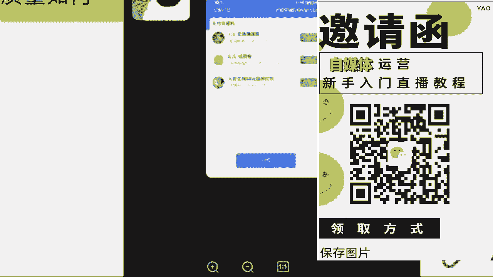
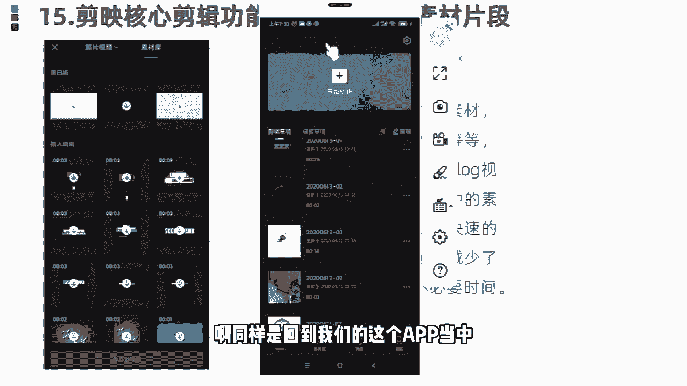
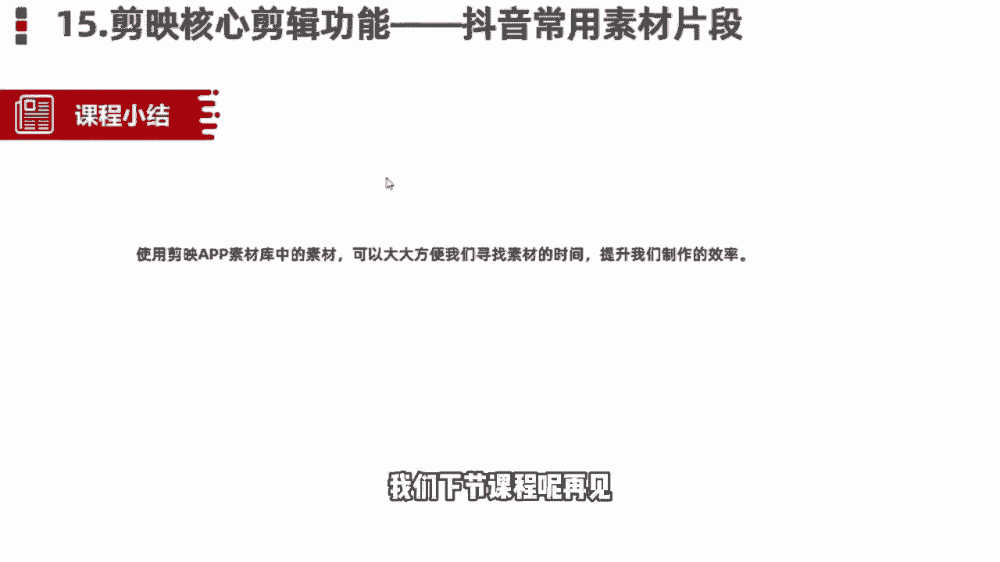

# 【自媒体教程视频】自媒体快速涨粉起号教程 新手必看：抖音运营全套教程，手把手带你玩转自媒体，运营／剪辑／创业全搞定！ - P1 - 藕孔欧克 - BV1gy411a7XP

🎼你的人生刚开始没有到头。我的天哪，千万别滑抖。因为接下来我要分享的内容可能颠覆你对中视频的认知。我们已经跑通了一个方法，就是中视频可以用AI工具全自动的创作。那么跑通的第一时间呢。

我就赶紧过来给大家分享一下。这就相当于中视频可以帮助你全自动的搞钱了，你先别着急质疑，看完我这个视频啊，你一定会被震撼到。那么有的朋友可能会疑问了，凭借AI全自动创作的中视频，它能够通过中视频计划吗？

它能够有很好的播放量吗？它能够通过平台的审核吗？答案是可以在分享具体操作方法之前呢，我问大家一个问题，就是平台它喜欢什么样的中视频作品，毫无疑问。首先你视频的文案要足够的优秀。其次。

你的画面要高度的吻和高度的相关，而且呢要有一定的精彩程度。这样的视频才能够获得。

🎼平台的青睐。好，那么知道这些之后呢，我们要用到三个工具。第一个就是文案创作的神器。最近火遍全球的chatGPT可能有的朋友还不太了解，我简单介绍一下这款人工智能的创作工具。简单来说呢。

它不是专门用于文案创作的，但是他的文案创作能力，确实是现在最强的chatGPT的推出呢，甚至引起了很多人的恐慌。因为很多专家学者对他深度考察之后呢，他现chat gPT它不仅仅是一个人工智能的工具。

他甚至拥有了人的思维，人的情感。因为他回答你的问题也好，写出来的东西也好，你明显能够感觉到这不像是一个机器人写出来的东西，它里边是有丰富的情感的，能够感受到他写东西的一种情绪，这就非常的可怕了。

但是我们做中视频计划，恰恰需要这样的一款神级的工具。那么有了高度原创。而且非常优质的文案之后呢，我们。🎼需要把这个文案进行配音，这一步就比较简单了。我们用到AI配音的工具。比如我们可以用配音神器。

这样的话我们就根据文案把配音搞定了。接下来最后一步是我们要根据配音和文案来匹配高度相关的画面。而且呢这个画面质量不能太低，不能用剪映里边的一键成片，那个东西啊，很多人教给你们，但是呢它不好用。

跟你匹配一大堆静态的图片，轮番播放这样的一种形式肯定是不行的。这里边呢我给大家推荐一个工具就是33搜真，它会根据你每一句的文案去跟你匹配高度吻合的动态视频画面，非常给力。那么结合这三个工具。

我们就能够实现中视频AI的全自动创作。接下来我给大家演示具体怎么操作，建议呢点赞收藏一下，干货非常多。首先就是chatGPT那么有的朋友可能会说啊，chatGPT我不会用，也没有账号，这个没有关系啊。

我在视频的结尾。🎼会给大家一并分享，你先知道怎么用就可以了。比如说呢我们拿历史故事为例。我在chatGPT上给他提一个问题，就是说我需要一份1000字左右的中国历史故事，你帮我写一下。

大家可以看一下右边我截的这张图，就是他给我的答案差不多1000字左右，写的是曹操和华佗的故事。当然我只是演示啊，大家可以发挥自己的脑洞，你想让他写一个什么的故事，他就会帮你自动写出来。

比如说你可以让他写一个民间故事，你还可以加上定语。比如说你给我写一个湖南地区的民间故事，或者你给我写一个篇门冷门的民间故事，他都能够帮你写出来。因为我是演示，所以我说的比较笼统。你提问的问题越精细。

他给你的答案也越精细化。而且呢你提完了要求他给你的答案，如果你不满意的话，你还可以追加条件。比如说在刚才他回答的这个曹操和华佗的故事里边，我想让他再加入一个人物，然后呢，我就跟他。

🎼我说你说的故事啊挺好的，但是呢我还想要更多的人物加入到这个故事里边，而且故事的字数不要变。哎，他就把寻彧这个人物加进去了。故事一下看起来就没有那么的大众化了。

可能还真的有很多人不知道他们三个人发生的这些故事。那么有了高度原创的文案之后呢，接下来我们就要给这个文案啊进行配音了。我们打开配音工具，然后呢点击制作配音。

把刚才呢我们得到的这个高度原创的文案呢给它粘贴进去，然后呢点更多主播，在里边呢可以选择很多主播的风格，我们选择一个自己喜欢的主播风格。然后呢让他进行配音，最后呢我们选择保存作品就可以了。

我们得到配音文件之后呢，最后一步呢就是我们要找到高度匹配的视频画面。我们用到的工具呢就是33搜真。这个工具呢能力特别强大。你只要输入你想找的视频画面，它的大概意思，你点搜索它就会自动帮你找。

🎼出来很多相关的画面，而且呢都没有版权都可以拿过来直接用。基于这样的一个功能呢，它还有一个特别强大的功能叫AI合成视频。你只需要导入配音文件，它就会自动帮你匹配画面。我们回到33搜真的首页。

然后呢点合成视频。点击之后呢，他会根据你的台词跟你匹配N多个相符合的画面，我们选择好匹配的画面之后呢，拉到最底下有个生成视频，就能够生成这种高质量的原创视频啊，我们一起来看一下效果。

康熙皇帝的五皇子应期非常有实力。为什么没有参与夺嫡。康熙的皇子很多，蝼椅却只有一把夺嫡成功的概率不大，失足的可能不小。作为皇子只要不捅出篓子，在身份待遇上一般都不差，怎么样？还不错吧。好了。

那么关于以上提到的三个工具，以及他们使用的具体方法，我也给大家整理好了，你可以到我的回复中视频全自动就可以拿到了。

首先第一个板块呢就是自媒体它的一个现状和前景。就是无论我们做任何一个行业哈，无论是做前置也好，还是兼职也好，我们得清楚这个行业，它的一个现状和前景。我们去做，对于我们来说有一些什么样的好处呢？

那到底可不可以去做呢？是吧？我们了解清楚了过后，我们再去上手，我们才能更放心一点。那第二个板块呢就是零基础的同学，我们如何去打造一个高收益的账号，就很多可能了解一点自媒体的同学。

或者说你是有做过自媒同学，可能都知道哈呃我们这个视频发出去，要么它是零播放量，要么你去抖音和这个快手上面，你去做视频，啊，靠这个播放量没有人来给你结算收益的这是为什么呢？那这个板块当中呢。

我会教大家怎么去选择这个平台，怎么去选择领域和这个渠道，我们才能把这个收益赚到手，那第三个板块呢就是一个亿万流量的一个多种变现玩法。就是很多同学了解自媒体呢，可能都知道我们自媒体呢？

就是我们做视频或者是文章发到。😊，这个平台上面去有人观看，我们可以靠这个播放量去结算收益。那除了这个之外呢，还有很多种玩法都适合我们零基础同学去上手的那这个板块呢我会给大家讲的那第四个板块。

就是我们自媒体变现的一个正确打开方式呃，怎么说呢？就是如果说你是听完整堂课，你觉得这个自媒体比较适合你的，你也有时间来做的那我会教大家怎么去规划我们自己的账号，以及系统性的把这个钱赚到手啊。

这是我今天内容板块一个划分。那么首先呢先来了解一下，到底什么是自媒体呢自媒体的话呢，我用大白话给大家讲吧。就是我们今天打开我们自己的手机，百度去百度上面搜索一个自媒体平台。

然后去这个平台上面注册一个属于我们自己的账号，在我们自己这个账号上面去发布我们自己做的文章，或者说视频啊，我们有人观看就可以靠这个播放量去结算收益。这个就叫做。自媒体我这样讲能不能明白？

那我们了解了一下到底什么是自媒体。那我们得清楚这个行业它的一个平台现状如何呢？是吧？到底可不可以去做呢？就是我不知道同学们在这之前有没有了解过这样一些新闻哈，就现阶段呢我们整个社会呢，它是非常浮躁的。

就很多人都想赚钱。就是在这之前呢就原来很多人想赚钱的时候，但是采取了一些不合法的手段去到缅甸这样地方被干腰子了的新闻，这样新闻有了解过吗？有的来打个有字吧，就这个呢就是呃不合法的。

国家呢它已经明令禁止了的，我们不能去做，因为我们去做，对于我们来说没有任何的一个好处嘛，对吧？那么现阶段呢自媒体行业是属于国家支持的那国家支持呢，他现在已经把这个文件已经下达到了各个地方政府。

包括你们现在看见这个呢是一个荆州市的六项措施啊，助力自媒体以及新媒体高质量发展的一个文件，包括这个文件呢是今年6月2号人社局来发布的。人社局。😊，国家单位包括这个文文件当中呢也指出了。

我们要加大政策宣传力度，有力支持自媒体以及新媒体行业的蓬勃发展。包括你们也可以来看一下，有没有你们自己的那一个地方。包括往下边看，这个是这个是那个广西壮族自治区的。看见没？都是新媒体的。

包括这个四川省人民政府的新媒体，包括这个浙江省人民政府的以及杭州市人民政府和这个江西省赣州市人民政府都发布了相应的一个政策性文件，包括这个文件当中呢也知道了，啊也说到了，说我们要坚持正确导向内容为王。

什么意思呢？就是我们未来作为这个自媒体创作者，我们创作的这个文章和视频，它才是结算收益最重要的一个方式和途径。我这样讲能明白吗？就包括你听到这里，你觉得这个自媒体行业，他可以来做吗？就是国家现在支持的。

因为他已经把这个政府文件下达出来了，你觉得他可以来做吗？可以是吗？对了，那除此之外呢，就现在政策性文件也有了是吧？来支持我们去做视频。那我们自媒体平台他也得响应国家的号召，他出钱让我们来做视频。

那他出多少钱呢，来我们去看一个视频来了解一下。我们希望接下来能够帮助更多的中视频创作者成为职业创作人。

职业创作人的意思就是以创作视频为职业，并且通过创作视频就可以过上更好的生活。那为了实现这个目标，未来一年，西瓜视频决定将额外拿出20亿元补贴中视品创作人。我想强调两点哈。😊，第一。

这是真金白银的20亿元，不包含任何的商单、直播和电商的收入是纯补贴。我们也会积极探索保底将分成的模式，助力创作人职业化，这可能也是行业首创。第二，20元只是保底上不封顶。

啊，说到这里呢，我想起了一件事情。好，同学们从这个视频当中了解到了一个什么关键的信息呢？就这个平台，他给到我们多少钱去做视频，多少钱呀？20亿元对不对？包括刚才这个创始人，他也提到了这20亿元。

它不包含任何的商单直播以及电商的收入，是什么？是纯补贴，就是我们未来去做视频，我们就能去拿到这20亿元里面的收益，这个就是我们未来能够赚到钱。那除此之外呢，现阶段我们自媒体行业呢有一个优势。

就他的用户数量非常庞大的有多少呢？接近9。4亿了。包括今年这个2022年这个中国研究生网站啊也出台了相应的一个自媒体行业的市场调查以及发展前景的分析报告。

这个报告呢今年9月9号来发布的这个报告当中指出了我国现阶段中国网民规模多少人是9。4亿人，接近10亿了。这9。4亿人呢？就是看视。频的人，他有手机有这个视频平台，每天都会去刷视频。

那看视频的人有这么多了，做视频的人肯定也有吧，有多少呢？来往上边看，截止去年为止，我就我国全职从事自媒体的，是370万人，兼职从事自媒体的是600万，就加在一起一共做视频的人才970万人。

我们应该算个整数，我们算1000万，好吧，就有1000万的人，他在做视频，有10亿的人，他在看视频，这个相当于什么呢？相当于100个人里面只有一个人在做视频，问一下同学们，我一个人做的视频够不够。

你们100个人去看我一个人做视频的速度能不能赶上你们看视频的速度。😡，其实是什么呢？其实是不够的，对不对？为什么呢？这个就是我们国家为什么支持我们自媒体行业发展的一个原因。

因为我们国家未来的一个发展趋势一定是在这个互联网行业当中啊，是从哪里可以看出来的呢？就是从我们小时候啊看的是这个黑白电视。就我们长大了之后看的是彩电。

那包括到现在呢我们自己家的电视上面都能连接wifi了。这以后我们做的视频，我们自己家的电视上面，它都能够看见，你可以思考一下这个用户数量是多么的庞大了。对？包括我们的用户人群呢也不断的在扩张。

那除此之外呢，现阶段我们自媒体这个行业呢最大的一个优势就是我们去做，不需要我们有任何的一个粉丝接触。那我们只用靠这个播放量就能够赚到钱。但是我们呃说到这里哈，很多同学会有这样一个问题了。

艾森老师我们去做视频，但是我们没有粉丝，这个播放量是哪里来的呢？😡，就有没有这样疑问，我去做视频是吧？没有粉丝，那这个视频的播放量是哪里来的呢？首先要告诉大家，这个播放量是平台扶持的流量。

刚才我们讲到了国家支持它的文件已经有了平台，它是会扶持我们去做视频的，就看你作品的质量如何了，就可能同学们现在了解到的平台，自媒体平台哈，可能更多的，要么就抖音，要么就是快手。

是不是就平常刷视频用的最多的，是不是抖音和快手这样个平台，我们都知道抖音这个平台在前两年它短视频最火热的时候，就他的抖音直播带货最赚钱，但是我们都知道你想要去这个带货，你必须要有粉丝基础吧。

你没有粉丝基础，你去带货谁来买呢？是不是？那除此之外呢，我们自媒体平台跟抖音它是有一个本质的区别的。我们只需要去这个平台上面去做视频，有人观看，我们就能够靠这个播放量去结算收益的，我们只需要了解一点。

什么呢？一万的播。😡，放量他能够拿到多少钱？很多同学会问了，曾老师，为什么不是以千0为单位呢？是以万为单位呢？当然有嗯有1000阅读量的单价，但是只有我们拿到1万阅读量的收益的这个播放量的时候。

我们才能够去结算收益才能够把这个收益体现到我们的银行卡里面来我这样讲能明白吗？就我们去看一下这个1万的播放量的单价到底是多少啊，首先呢我们这边可以看见一个千次的阅读单价能看见吗？千次的阅读单价是多少钱。

是3。4块钱，看见吗？这是1000的啊，就1000的阅读量我们能够赚到3块钱那一万的阅读量有多少呢？我们乘以1万嘛，就是34块钱，这个单价，你们要记清楚，这个就是我们未来能够揣在自己兜里面的钱啊。

等一下曾总老师会问的，这一1万的阅读量单价到底是多少呢？是吧？这个要记住好吧，那我们现在知道了这个单价了。很多同学会说，哎曾老师。😊，反正他都赚钱是吧？😡，那我现在不做，我以后再来做吧，是吧？

反正他都赚钱，反正他都赚钱是吧？这个行业我现在不做吧，我以后再来做有没有这样想法的，有的你就打个有字，就说到这里呢，问同学们这样一个问题。就是如果说这个未来自媒体行业，它发展成为像这个九年义务教育一样。

所有人都能来做的时候，你觉得你还能不能做起来，就未来我们这个自媒体行业国家说哎同学们朋友们，我们现在已经把它纳入到这个九年义务教育阶段了，你全都来做还能来做起来吗？

有的说能有的说不能就问同讯这样一个问题吧，就是这个呃就跟原来这个18年的抖音是一样的道理哈。18年抖音刚出来的时候，他是最火的时候，刚刚站在风口上面是吧？那个时候选择做抖音的人，他是最赚钱呢。

他也赚到钱了，但是现在你再去做抖音，你还能做起来吗？现在你再去做抖音还能做。😊，做起来嘛，就做不起来了，对不对？是一样的道理。每一个行业它都有相应的一个风口存在的。这个机会放在这里。

它是不会等着你来选它的。风口它是会过去的，你就不能来做了是吧？如果说未来你去大街上面随便拉一个人问他，你知道自媒体吗？他说哎，我知道那个时候我就劝你不要来做了啊，因为你就需要花更多的时间更多的精力。

你才有可能能做起来。包括我们刚才说到的。这个行业的一个市场报告啊，就调查的一个报告是今年9月9号来发布的，说明我们是了解到这一个信息的第一部分人群，我们刚刚站在这个行业的风口上面。

小米创始雷军曾经说过哈，站在风口，猪都能起飞。就看咱们要不要去做一只风口上面的猪。😡，是吧这个就是我说到的一个行业的风口啊，就看你自己愿不愿意来选择了。那说到这里问一下同学们。

你觉得这个自媒体行业它值得你来做吗？你觉得它值得咱们来做吗？是吧？这个风口嘛就看你自己要不要去选。😡，好，那除此之外呢，有很多同学也会说到了是吧？好，曾总老师，我觉得可以做是吧？

我觉得能赚到钱也值得去做了。但是为什么我发的这个视频发出去，它永远都是零播放量呢，要不然只有几百甚至1000多的播放量，是不是这个平台他不喜欢我，他看不干我，所以说他不给我推送流量啊，其实不是的。

是因为我们自媒体平台呢，它总共有30多个啊，这30多个平台呢，同学们全部截图保存啊，这30多个平台我们未来都能够用到的。接着截图好吧，因为这30多个平台呢。

它每一个平台结算收益的方式适合的领域都是各不相同的，同学们熟悉嘛，对他们了解吗？其实不太了解，对不对？那首先我们来看一下，其实每一个平台他适合的领域都是各不相同的。包括给你举个例子吧。

比如说今天啊我说我要做一个这个今日头条这个头条号，我说我要做。那我先把这个平台账号注册好那。😊，注册好了过后，我去选择一个适合B站去做的舞蹈领域，我能在这个头条上面做起来吗？觉得能做起来吗？

我去做的是头条号这个平台，但是我偏偏就选了一个适合B站去做的领域。为什么呢？这个就是很多这个自媒体嗯呃这个人没有做起来账号的原因你连平台以及领域都没有选择对这个平台，他凭什么给你推送流量了。

他不会把这个流量浪费在你的身上的，他是会去扶持适合他这个平台，适合用户去观看的领域的。这个呢我到时候送给大家好把，这个领域的区分，到时候我送给大家啊，让你们有一个领域区分的地方。

但是呢我得看你们的表现好吧，谁今天啊互动性是最强的，是真正想要学习到这个知识的，我就送给你们啊。因为曾老师特别喜欢这个爱学习的同学，好吧，看你们的表现喽。😡，那除此之外呢。

这30多个平台啊30多个平台里面我们该去选择什么样的这个内容，我们来做视频呢？是吧？那首先问一下同学们，平常在这个刷视频的过程当中，我们刷什么样的视频，刷的是最多的，你看什么样看的视频看的最多。

是影视的呢？解说的呢是吧？单视频剪辑的呢，还是说游戏的呢综艺的呢，动漫的呢搞笑的呢？你看什么看的是最多的，美女。😊，好的好的，我知道了哈。那喜欢看美女的同学非常的不错呀。曾的老师也喜欢看美女啊。

但是我们把看美女的时间，我们去做一个美女的盘点视频，它可能赚钱会更快一点，是吧？影视的是萌正能量的、搞笑的。还有呢其他同学呢？看什么样的视频看的是最多的。😊，还有没有其他的？基本上都是影视了，是吗？

好的好的，我知道了。影视呢在所有的平台上面确实扩散量是最大的啊，军事的也有是吗？军事的它在我们国内的平台是可以做的，但是涉及到一些呃会比较外网的平台，它是做不了的。嗯。

像现在的那个ttok它就做不了这个是吧？那首先呢在这个平台上面，我建议同学们哈一定要去选择对赛道，我刚才说到了，你赛道选择对了这个平台他才会给你推送流量。我建议你们去做的话，就以这三个类型的视频为主。

首先第一个视频剪辑类的。第二个解说视频类的。第三个混剪视频类的。这三个类型的视频是现在所有平台，大数据分析之下，用户的点击量阅读量以及完播率是最高的三个领域。大数据是什么意思，知道吗？同学们大数据。

比如说我举个例子吧。比如说我们平常就很多同学呢会说看的东西是比较多的，就刷到什么看什么。比如说呃这这一类型的视频的话，就是我们所有同学说不知道的也是啊一样的，就平常刷到什么，看什么？

你在所有的类型的视频的这个停留时间它是一样的。但大数据呢就是如果说我们今天选择抖音这个平台，我今天刷美女刷的时间更长，从明天开始这个平台他给你推送美女的视频绝对是最多的。

如果说你看美食类看的是最多的那从明天开始这个平台他给你推送美食类相关的视频，它就是最多的。有没有这样的情况是不是这样子的，这个叫大数据啊，大数据呢。

他现在可能比我们自己的爸爸妈妈还要了解我们知道我们到底喜欢什么样的内容，什么样的东西，跟着大数据去做视频啊，你的这个播放量呢，它才会更高。😊，🎼啊，那首先呢。我们先来讲第一个视频剪辑类，好吧。

视频剪辑的话呢分为很多都可以去做这个视频剪辑。比如说首先第一个就是这个电影的，就影视的剪辑嘛。电影的啊，除此之外呢，像这个电视剧的或者说综艺的啊。

这个都是这个视频剪辑类的那如果说我们想去做这个视频剪辑类的呢？我们首先要去干嘛，要去找素材，对不对？那这个素材我们该怎么去找呢？找素材呢，我们先从这几个平台去找。首先第一个所有的视频平台。

知道视频平台有哪些吗？啊，那现在不知道的同学来看一下，这个就是我刚才让你们截图保存的这30多个自媒体平台。现在不知道的同学在截图保存一次啊，这30多个自媒体平台呢。

都是我们能够找到素材的地方啊这30多个自媒体平台呢，我们都能找到素材，那除此之外呢，第二个我们可以去一些影视网站里面去找，我不知道同学们有没有了解过哈，影视网站。比如说我举一个例子。

就原来我们所说的这个豆瓣电影，这样子的呢都是这个影视的网站。包括我自己呢整理了将近有这个50多个啊影视的一些网站，这些网站里面所有的一个影视素材，它全部都是没有版权要求的。这个呢我到时候也可以送给你们。

除此之外呢，这个平台呢，就这些网站呢，他是关于影视类的。就很多同学说哎，曾老师那我不想做影视类的是吧？我想做一些其他的什么动漫的综艺的搞笑的，我想做一些这些类型的O也可以啊。

我自己呢也整理了将近有60多个这60多个网站呢里面除了影视类的。像这个旅游的啊这个图片类的啊音效类的评论的体育的美食的动漫的综艺的搞笑的或者说各个国家的境内境外的视频素材。我们都是能找到的啊。

都是能找到的这个呢我后边也送给你们好吧，让你们能有一个找素材的地方。那除此之外呢，第三个就是我所讲到的这个影视推广的平台。就影视推广的平台呢，现在他可能做的更多。就是我们在这个抖音或者说快手上面。

我们很多同学都知道哈，你去抖音或者说快手上面做视频有做过的来，就是去这个抖音或者说快手上面发过视频的。有没有就我们都知道啊，就抖音和快手这两个平台，你去发布视频最多最多，可能只能达到一个涨粉的作用是吧？

这个播放量它是变不了线的那如果说我们去做这些影视推广平台里面的这些影视素材啊，我们是可以靠这个播放量去拿到奖金的啊，这个平台呢等一下我会着重奖啊，我会着重奖。那么首先呢如果说我们要去做这个视频的剪辑。

我们素材该怎么去找呢？比如说我给你举一个例子吧。啊吧我们今天打开我们自己手机的百度啊，我们先打开这个百度打开了过后呢，我们随便去搜索一个自媒体平台吧。嗯，用这个西瓜视频。😊，我们搜索一下这个西瓜视频。

然后点击百度。我们打开它的网页。比如说我今天举一个例子，我想要去做一个这个关于综艺类型的是吧？我想要找一个人，比如说综艺类型的，就是他跟娱乐是相关的，就同学们平常看直播吗？直播看不看。

就像一些网红的直播，什么大杨哥小杨哥是吧？比如说我们想要找一些这一类的素材，我们直接去搜索他们这一个关键词就可以了。什么关键词呢？就直接搜名字啊，大洋哥。小杨哥，我们直接搜索关键词，然后点开搜索。

我们就能找到非常多的一个素材了。现在我们按照这种关键词的方式去找素材，能不能找到。但是在这个找素材过程当中，我得给你们强调一点，我们正确找素材的一个方式，不是让你们把这个视频直接下载下来。

就很多同学我不知道同学们有没有听到过这样一个词语，就你们可能听过课程的哈，有的老师叫你去做搬运，有没有听过的，或者说有没有做过搬运的。如果说你直接去把这个视频下载下来，它跟搬运就没有什么区别了啊。

搬运的内容，现在平台95%的人，你去做都通过不了审核。所以说告诉你们正确找素材的一个方式，就是我们要从这么多的这个视频当中去找到符合我们自己视频主题的视频片段，就每一个片段呢大概保持在10秒钟左右，啊。

10秒钟这个数字，你们要记住，到时候。我们找到素材，我们去做视频，平台在审核的过程当中才能给你通过，是不会有违规存在的。这个记住了吗？记住了公屏上打一啊，10秒钟左右，每一个素材片段。

就按照这个这个时长去找就可以了。那除此之外，再举一个例子，比如说我们今天想要做一个沈腾的是吧？沈腾明星明星网红它都是自带呃这个热点的啊，热度的，你去做它不缺流量啊，不缺流量的那一样的。我们打开一个。

关键词直接搜索，就你们能找到素材呢是非常多的啊是非常多的那现在我们素材能找到了吗？那如果说我们这个视频素材我们自己能找到了。那我们想要去做视频OK那我们是必须要用到什么呢？

用到剪映这个软件的做视频的话呢，问一下同学们用哪一个软件用的是最多的，手机还是电脑，你用哪个我等一下就用哪一个给你们实操好吧，根据你们的一个要求来，都是手机啊，没有一个打电脑的吗？好的，我知道了。

就你们打手机的这个搜度就让我感觉到，生怕我看见电脑是吗？好的，稍等一下，我投个屏好吧，我投个屏。😊，啊，那我们今天呢如果说我们要做视频哈，我们首先呢要确定一个什么呢？主题。比如说我举个例子吧。

我说我们今天去做一个综艺类型的，我们就要确定一个人物什么人物呢？我们今天去做一个这个呃沈腾的搞笑名场面吧，就这一个视频的主题，我们的主题确定了。那这个视频的素材当中必须要有沈腾这个人啊，这个是主题。

到时候你们要记清楚。好吧。😊，那现在同学们能看见我的手机了吗？能看见我的手机了吧。那么首先呢在我们自己的手机上面找到一个剪映的软件啊，就这一个剪映的话呢，它这个手机端和电脑端图标找的都是一模一样的啊。

没有什么区别。我们找到这个软件过后呢，直接点开它点开了过后，我们可以看见一个加号的界面，就是开始创作这个界面，我们直接点击这个加号的位置，然后把我们自己找的一个视频素材，先给它添加进去一个。

那么这个视频素材添加进去了之后呢，首先讲一点，我们自己做视频的话呢，素材它是能找到的。但是我们要做的这一个视频的主题背景，它是找不到的，只能我们自己去制作。那怎么做呢？首先我们要找到这个视频轨道。

有右边有一个加号的位置，看见了吗？直接点击这个加号的位置，然后我们找到这个手机自带的素材库。啊，这剪映自带的，看见没？素材库。我给你们圈出来，找到素材库了过后来直接点开。

我们在热门里面就可以看到非常多的一个背景主题非常多。包括我们用的话呢，像这一类型的，或者说这种的这种的，包括这种的，我给你们圈出来这种背景呢，它都是可以用的啊，都是可以用的。

但是我更建议你们呢去选择一些简单明了的，就是用户点进来一看，我就知道你做的这个视频是什么主题，就是黑白色的这个背景，我们就选择一个黑色的背景添加进去吧。好，那这个背景添加进去了过后来首先背景有了。

我们得添加主题吧。那这个主题该怎么去添加呢？来左下角有一个文字的选项，直接点击文字，然后点击最左边这一个新建文本啊，看一下文本框出来了。那现在我们要打我们自己做的这个视频的主题，我们刚才说到的。

我们今天要做的这一个视频的主题人物他是谁是谁呀？这个我们一定要记住哈，我们的主题人物如果说明确了你找的视频素材当中必须要有他啊，必须要有他。如果说没有这个素材，我们就用不了，是谁还记得吗？

我们刚才说到的，我们刚才说到的是谁来着？我们今天要做一个沈腾的搞笑名场面啊，沈腾这个人你们是必须要记住的，这个沈腾名字确定了，我们所有的这个素材当中必须要有他出。😊，线啊，如果说没有。

到时候这个素材用不了，重新找好吧，这一点是要记住的哈。那么首先呢先来打两个字，就是谁呢？就主题人物沈腾。沈腾的什么呢？沈腾呢他有自己的综艺场面，也有自己的影视场面。如果说你找的素材是跟影视相关的。

你就打影视啊。如果是跟综艺相关的，咱们就打综艺。好吧，这个咱们区分开来，沈腾的综艺报笑名场面O这个名字我们确定了过后，但是我们看一下是不是非常白。白色的文字，我看起来不太好看，不太好看是吧？

我们所有人呢他都喜欢一些色彩鲜艳的东西，这是比较抓人眼球的，那接下来呢我们也不要去选择什么样式和花字了，不用，我们直接去选择右下角这个文字模板，我们直接往上套啊，这样是最方便的。

那么这个文字模板呢根据你自己的实际情况来，他有收费的，有免费的啊，我们自己去选就可以了，我们随便选择一个模板来看一下。同学们觉得这个模板可以吗？觉得这个模板可以用吗？我觉得还不错啊。

这个模板我们找到了过后呢，来直接选择右上角的这一个对勾。OK我们的主题背景有了。那我们选完之后呢，直接手动的选择整体这个文本框的右下角给它放大一点，好吧，让我们这个文本看起来更清晰。好。

这个文本就这个背景我们制作完了过后，OK名字是有了，但是我们不能让用户点进来看什么看哑巴电视吧，不可以，谁都喜欢有声音的东西。那问一下同学们会配音吗？同学们会配音没会配音的，你打会字吧，不会的。

你打不会如果说会配音的同学，咱们自己就打开自己手机里面的录音机，我们把这个名字自己念一遍就可以了啊，如果说不会的，没有关系，我们直接选择右下角这个文本朗读，我们直接往上套就行了啊，这个是比较方便的。

我们选择文本朗读了过后来，你看一下，就是特别多的声音，什么方言音啊，什么男生喜欢的萝莉音啊，什么女生喜欢的这个男士的播音腔O都有的。但是我更建议同学们去使用一些这个方言音啊，就方言音在现在所有平台。

它上面的一个呃运用率它是比较低的。但是比较有吸引力的，你们去做，但是比较能够吸引到人的。像方言的。😊，话呢我最近呢比较喜欢一些广西的方言，因为我觉得很有意思，有没有广西的同学，我觉得很有意思。好吧。

我们就先来听一下这个方言音。😊，神腾风医报销名场面。沈腾中艺爆笑明场面。沈腾中医报效名场面。深腾总一保小命昌面。沈腾总艺包厢明唱面。沈腾综艺报校名场面。深腾中医报销名场面是不是非常多的方言音啊。

咱们自己去选就可以了。那我就选一个广西的方言。那我们这个方言音，我们选择完了过后，直接点击右下角有一个对勾。OK它就会自动的去下载这个音频。那这个音频下载完了之后，我们从头来听一下。

整成中医报销名场面OK现在声音呢它是有了。那我们现在呢手动的选择这个黑色的背景，你直接点击它一下就可以了。那点完了过后呢，我们自己手动的来呀缩短一点，让它能够音化同步。那这个主题的背景。

我们制作完了过后来紧接着重要的来了。就我们本身视频的本身。首先我们来看一下，有没有沈腾这个人O有那这个素材我们就能用。我们刚才讲到的如果说这个里面没有沈腾，那咱们就用不了啊，这个你要记住。

那首先呢在讲的过程当中，我边讲边给你们讲细节。首先第一点我们要做的这个视频，它必须是16比9的一个横屏，这是所有平台它硬性的一个标准。如果不是这一个比例，O平台的审核是不会给你通过的。

一定要记住这个比例啊，我给你们打在公屏上了。那除开这个呃抖音啊，除开抖音。因为抖音的话。它是需要9比16的竖屏啊，除了这个抖音之外，其他平台都是16比9的一个横屏。这两个咱们记住，咱们把区分开来。

到时候做视频的时候，比例要选择。对那这个比例呢，首先我们来看一下该怎么去做啊，就像我们这个视频一样，它明显不是1个16比9的横屏，我们该怎么去调整呢？来，首先最简单的一种方式。

我们找到这个手机下方有一个比例的选项，直接选择它，来，现在我们看见有1个16比9的横屏的选项没给你们圈出来，看见了吗？就是这个找到了过后直接点击它，我们现在就来看。这个素材视频它到底动还是没动。

如果说它动了，OK它就可以用这种方式去做比例的调整。那如果说像这个视频一样，它移动也不动，那该怎么去调呢？我们自己手动调，该怎么调呢？这样可以增加我们使用素材的这个几率啊。

就是我们能够用到的素材就更多了。首先呢我们选择左下角有一个剪辑的选项，找到剪辑，然后选择里边有一个编辑的选项看见了吗？直接选择编辑，然后我们自己来干嘛？裁剪这一个画面，那裁剪过程当中呢，首先强调一点哈。

所有的这个视频当中原有的这个字幕，咱们不要留，直接给它裁掉，我们等一下自己做就可以了。那在这个裁剪过程当中呢，包括这个边框，到时候你们少给它留一点啊，少留一点边框，到时候留多了过后。

它会有一个黑色边框会不好看？少留一点就可以了。这个画面我们裁剪完了过后，直接点击右下角的对勾。OK来看一下这个比例是不是调整了，视频它明显的放大了，但是它也不是1个16比9的横屏，如果是的话呢。

它就不会有这个黑色的背景了。那接下来该怎么去调呢？找到我们手机右下角有一个背景的选项，在这里看见没？背景直接选择它，然后右下角有一个什么呢？画不模糊，看见吗？直接选择画布模糊。

我们调整到第一个清晰的画面，现在你也再来看一下这个是不是就是1个16比9的横屏了呀？同学们这个步骤要记住啊。啊，记住了，对吗？好，来接下来一样的右下角对勾点起来啊，这个比例我们弄好了弄好了过后呢。

来接下来第二点，我们每一个视频呢，它毕竟不是一个原有的视频，不是一整个每个视频呢大概在10秒钟左右，对吧？那这个视频之间呢，它是必须要有衔接的。我们必须要添加这个转场的视频。

就我不知道同学们有没有这个在看视频过程当中，有没有看到过一些转场。就比如说呃有的这个视频看完了之后，中间会给你添加一个不属于这个视频当中任何一个片段的，搞笑的界面，有没有看到过有对不对？

为什么要添加转场呢？我们要让用户明确的知道它每一个片段的内容是不一样的啊是不一样的。如果说每一个片段不一样的情况之下，你不添加转场，他在看第二个视频的时候，心里会各噔一下。

那这个视频的片段中长的不一样呢，视频内容怎么不一样呢？往往有这种情况的时候，我们会做出什么一个动作呢？退出去看一下我今天看的这个视频是什么。如果说他有这个退出去这个动作了，我们的视频完播率它会直线下降。

完播率是会影响到我们整体的单价和收益结果的。所以说转场必须要添加。那该怎么去添加这个转场呢？来一样的，这个视频轨道右边有一个加号的位置，看见了吗？我们用它的机会是非常多的，点击这个加号，一样的选择谁呢？

选择这个素材库啊，我们一样去找到这个素材库，点击它在这个热门里面非常多的一个这个转场，包括像这种的这种的包括这种的熟悉吗？同学们这种转场是不是看的非常多，包括现在所有做的视频。

只要是添加了转场的转场基本上都从这个简易里边找的，你们都可以去用啊，这个没有什么问题的那在找转场的过程当中呢，强调一点。我们不要去找太长的，像这种16秒钟的，不要去选啊不要去选。因为太长了。

我们没有任何一个人会把不重要的东西，我们有耐心看完的。没有。所以说我们选择尽量保持在3到5秒钟的一个转场，那最合适的，我们选择一个3秒钟的来我们给它添加进去啊。这个转场我们添加完了过后来看一下一样的。

要强调一点，转场的视频它也必须跟我们所有的一个视频比例保持一致，什么呢？16比9那这个视频我们出来了过后，右下角直接会有一个画布模糊，画布模糊这个选项啊，直接找到它点击第一个清晰的画面。

这个背景它就是一个16比9的一个横屏了啊，现在要记住，我们找到这个画布模糊之后呢，依然右下角的这个对勾点起来啊，点起来啊，一样的，我们这个视频的比例呢，它做完了这个步骤。有没有记住啊。

我们该怎么去做这个视频能听懂吗？这个步骤啊，我们该怎么去裁剪这个比例，该怎么去添加这一个背景的主题能是不是好的好的，那么这个视频能做到现在来接下来下一步，我们要去添加我们这个视频的文案就是字幕。

我们该怎么去添加呢，依然找到我们手机左下角这一个文字的选项来点击它一下，我们新建文本，右边有一个什么呢？有一个识别字幕，看见了没？直接点击这个识别字幕，然后我们选择这个开始匹配。

它就会自动去给我们识别这个音频当中，或者说这个视频当中人物所说的话给我们形成一个字幕来看见了吗？字幕现在出来了，稍微调整一下，怎么调呢？放大一点，就这个字幕，文本框的右下角。看见没？给他往右边拖。

那现在放大了过后，整体把这个文本框拖动到视频最下方的一个位置。现在看起来是最舒服的。就你调整完了一个字幕过后，第二个你就不用调了，因为它都会随之来调整啊，这是最方便的。现在这个视频该怎么去做啊。

该怎么去剪这个视频，这个视频我们该怎么去做，知道了吗？我们一定要按照这一个比例，或者说按照所有的一个步骤，找素材也是严格的去做。好吧，不要去找太长的一个视频，到时候平台在这个审核的过程当中。

那要不然他就不会给你通过了。知道这个视频做起来难不难，同学们其实不难，对不对？好，很多同学呢在这个过程当中也会说到了。哎，曾老师。

这个视频确实不难是吧？

那很多同学呢也说到曾老师，那这个视频一样的，我如果说想要去发到这个抖音或者说这个快手上面，我们该怎么去结算这个收益呢？这个曾曾老师要给你们讲到哈，我们这些视频呢，他发到其他的一个平台上面去。

如我刚才所给你们讲到的。这个视频我们剪完了过后，发到这30多个自媒体平台就除开抖音和快手其他的平台呢我们都是可以靠这个视频本身给我们的一个播放量去结算收益的，这是可以的，但是抖音和快手这两个平台呢。

就像我刚才讲到的，这个视频发上去最多最多他可能只能增长粉丝啊。这个就是我所要强调的。就有没有同学你们是只想去做抖音和快手这两个平台的，就只想去做自己熟悉的平台，抖音和快手。曾老师我想去做这两个平台。

但是我同时去做呢？不光想涨粉，但是我也想靠这个播放量去结算。收益的有没有有的在公屏上打有字吧。让我刚才所讲到的这个所有的一个视频的话呢，它发布的平台呢。

你们就可以去这个抖音快手小红书以及微信视频号上面去发，就这四个平台熟不熟悉。同学们熟悉吗？就平常会用到的对不对？这个小红书呢，包括很多这个呃可能女性或者说稍微年轻一点的95后可能用小红书这个平台呢。

可能用的比较多一点，像微信视频号呢？就我们人手都有一个微信，微信里面有一个这个小程序就叫视频号。我们可以去发布这几个平台。啊，这几个平台发布了过后，我们通过什么样的途径呢？我们去通过这个视频。

就个影视推广这个平台，我们去做任务，然后我们通过这个任务去结算奖金，我们可以看一下素材的话呢是非常多的，包括这个红字的部分，你们就可以看一下，包括爱奇艺的任务。

搜狐的任务，这个呢就是所有影视剧的名字。看见没？影视推广是什么意思，知道吗？同学们影视推广是什么？知道吗？就影视推广的话，就是每一个电视剧或者说每一个电影或者说每一个综艺，它都会涉及到宣传啊。

宣传就很多这个现在很多广告商呢，就是因为很多明星也好，或者说很多网红也好，我们拍完了这些电视剧或者说短剧，之前因为疫情的原因，没有办法到线下去这个宣传，他们都会运用到这个影视推广的平台。

就我们去做视频帮他去推广。我们就可以靠这个播放量去让他给我们结算奖金。包括每一个这个视频，就每一个电视剧这个视频，我们做完了之后，我们是需要添去这个提交一个这个任务的这个回填链接的。就我们要去报名。

就我们要填写自己的微信号账号昵称，或者说我们自己抖音或者说快手的ID包括我们自己做的是哪一个电视剧，我们要添加清楚，包。😊，这个电视剧这个作品的链接你是发到哪个地方的，你要粘贴上去，发布的时间是哪一天。

包括你要把这个视频的播放量的截图上传上去。到时候我们这个回填链接填完了过后，我们就会给你结算收益了。这个就是影视推广哈。因我们也可以看一下这个影视推广的话呢。

它的这一个收益呢会比纯播放量的一个收益会更高一点。那现在我给你们看一下。😊，看见没？包括短剧的话呢，其实是非常多的。短剧的话呢，就是现在很多这个不是很多传媒公司嘛，就有很多网红，他们会自制一些短剧。

短剧话呢就是他没有办法自己去做一些这个广告的宣传，他就会让我们自己来做这个视频发布到抖音小红书视频号，那没这三个平台都是可以去发布的然后呢，根据播播放量的这个要求去计算我们的收益，没有粉丝要求的啊。

对于我们自己的账号是没有粉丝要求的。有没有粉丝跟他没有关系啊，我们一部剧呢最高播放量的三个作品，加起来的总和去给你结算，包括这个总和该怎么去计算的。看一下抖音这个平台，一万的播放量奖金是50块钱。

就最开始我给你们算的那个单价还记得是多少嘛，就一万的播放量单价，就一万的播放量，单价是34块钱。那个是头条号34啊，对，34。就那个呢是头条号，它这个播放量的一个单价的收益。像这个抖音的话。

你明显的感觉到这个一万的播放量奖金收益是会更高一点的。因为抖音的话呢，它这个每天的日活跃用户接近10亿了，非常庞大的啊，非常庞大的啊第二个视频号的话，就是微信视频号，你发上去1万的播放量奖金是10块钱。

为什么它的单价会低呢？是因为我们每一个人都有微信啊，每一个人都有微信都会去看这个视频号的，所以说它单价呢会少一点啊，会少一点。像这个小红书的话，它单价是最高的啊。

小红书的单价是1000的播放量奖金是30块钱1000啊，就我们叠加起来呢，每一个这个呃视频，就如果说我们去结算这个收益过后，每增加1万的播放量到时候还是会有奖金的啊，这个就比较可观了是吧？除此之外呢。

像一些搜狐的短句。搜狐视频的话就是现阶段我们可能看见的是比较少了，就我们原来看的时候呢会更高一点。就是搜狐视频。搜狐视频呢他也买了很多视频的版权，但是因为这个本身这个视视频。

它的这个知名度可能不是很高啊，可能不是很高。所以说他很多短剧呢，没有办法去拿到一个好的评分，或者说更高的一个这个播放量，但是会拿过来给我们去做的。像这个抖音和快手这是需要两个平台都去发的啊。抖音加快手。

让他按照什么结算呢？点赞计算，也是没有粉丝要求的，就单条作品，如果说有5000个赞是怎么的？就是我们抖音和快手，我们右边他是会看什么，就会看那个点星星，知道吗？那个是点赞，5000个赞是100块钱。

抖音的话，如果是1万个赞是200块钱，快手1万个赞它是180，他给的单价是最高的啊。这个搜狐的短剧，单价是最高的，就这一个有没有兴趣的。嗯。因为这个影视推广的话，它收益结算的话呢，是一个月结一次啊。

是一个月结一次，这个能接受吗？就我们是月底结算的这个收益结算的话呢，就按照播放量计算。我刚才说到的，每一个这个短句呢要求是不同的。我们按照他的一个要求来就可以了。像这个呃呃除此之外。

就如果说同学们做这个影视的推广。除了这四个平台之外，你们可以靠这个播放量去结算这个奖金。如果说在这个基础之上，你们还愿意去添加解说的，就我们一个作品，一个视频，你是可以获取双份收益的，什么意思呢？

就除了刚才我们讲到那四个平台之外，你可以发布到其他平台，你是同时还是有这个什么呢？还是有版权的，你可以去做影视的解说一个视频，我们拿双份收益，包给给你看一下吧。就我之前有一个小伙伴也是。

这个就这个小伙伴呢之前做的就是这一个影视的推广。你们看一下这个收益吧。当时这个小伙伴他是自己有想法的，他对抖音这个平台是比较喜欢的，但是看中这个抖音的一个带货能力。但当时呢他自己的账号粉丝也很少。

他想要去做带货。但当时呢他说先积累粉丝，后期呢他是想要带货的，做的就是影视推广，因为影视推广的话，当时他问我可不可以朝这个方向发展。我说可以呀，当时我直接把那个回填链接发给他了，报名的渠道。

我说每一次你去做之前，你先把这个报名渠道填完，填完了过后做了视频，你要去填那个回填链接，就我刚才给你们看见的那个账号的ID你是必须要写清楚的。到时候要不然到时候这个抖音就结算不了哈。

这个当时我给他看的就是因为最开始呢他做的是什么呢？做的是短剧。因为短剧的话呢，他是这个推广的渠道是很少的。如果说我们去做这个播放量的这一个收益呢，他是会更多的。当时他做了第一个短句。

这个短句的话要求是发三个视频。😊，就每一个短句他会有不同的要求，他让你发三个，你必须要发3个，他让你发10个，你就必须要发10个啊，这个我们得按要求做事情的，要不然到时候他是会给你下架处理的。

当然他这个视频做完了之后呢，播放量是很高的，186万。因为短剧嘛，它是比较能够贴近现实的，就比较能够抓住我们用户的一些心理啊，所以说他这个播放量呢是比较高的。他也觉得很恐怖。但是就是这些短剧呢。

他只是说我们平常看的比较少而已，就所以说这个话题度是很不错的。当时呢他这个短剧186万的一个播放量结算的话呢，差不多在500左右，结算是结算这么多，但是如果说后期每增加一万的播放量。

我们还会给他添加10块钱的这个奖金，这机会是很好的。但是这一个那做的第二个短句呢就是效果就没有这么好了。因为第二个短句呢，他选择这个短剧呢，可能就是本身的话题度就不是很高。但是呢呃它的单价会更高一。啊。

这个就是有不同的一个选择了嘛。当时他这个短剧的话呢，过程当中是1。4万的一个播放量啊，1。4万就很低。但是呢单价的话是给到了150的，所以说单价不同，他给的这一个收益呢也是不同的。当时这个过程当中的话。

它是做了将近一周的时间7天，因为一个月结一次嘛，刚好碰到月底的时间了，结算收益的话，当时官方系统那边给我结算的，因为他是第一波做这个影视推广的人啊，所以说结算给我的。如果说后期的话呢。

我们全部走这个对公账户啊，全部是走对公账户，因为系统那边要核销的。那结算的话，4个短剧，一周7天，他做了4个，第一个短剧的话是在那个186万的基础上面，后面又正增加了1个6万的播放量，叠加是60。

总共结算是580。第二个播放量不高，但是结算了150块钱还是可以的。第三个呢就是因为他没发快手，这个是很可惜的。因为那一个作品要求发抖音和快手，他只发了抖音，没发快手。

所以说只给他结算了一半的收益是120块钱。第四个呢，因为本身任务的单价是比较低的，只结算了45，当时总计的话是895块钱，这一周的收益，这个还可以吗？满足了吗？就7天的时间啊做了4个短句。

当然这个根据咱们自己的实际情况来，你有更多的时间你就可以做更多的短句，然后去填回填链接，一个月给你结算一次，还可以的。这个收益还可以了吧。7天的时间啊，这个呢后期全部走这个对公账户。

但是呢过程当中得给你们强调一点，这个渠道是我给你的，你做的视频呢是必须要发给我的，我审核通过了之后，你才能去发，要不然直接给你下架掉啊，直接给你下架了之后，你就没有办法去靠这个播放的结算收益了啊。

这个要给你讲清楚就是这个渠道的话那就很多同学会有这样一个疑问。说哎曾老师，为什么他们自己不去发广告呀，要把这一个。😊，视频就这个影视推广拿给我们去做呢？有没有这样疑问的？而曾老师。

他为什么不自己去做宣传，发广告呢？他要让我们去做这个影视的推广。😡，有没有这样疑问的？因为我不知道同学们有没有了解过这样一些信息哈，就每当一个这个影视作品或者说制片方出品人，他们去发这一个广告。

他们的费用不知道你了不了解哈，就低的话呢，基本上每一个这个广告低的话是10万左右，一个广告，他可能发的地方呢是比较少的多呢？他是100万起步的，这个广告的费用。

你是觉得他把这个影视的这个推广拿给我们去做，给我们结算的这个奖金，他花的钱多，还是他们去发广告花的钱更多呢？你觉得是哪一个，你觉得是推广花的钱多，你打推广你觉得他自己去发广告花的钱多，你打广告。

你觉得是哪一个他花的钱更多一点。😊，是不是他自己发广告花的钱更多，是不是？这个就是为什么他要把这个影视推广拿给我们去做。因为我们人多力量大，我们去做视频，它的这个扩散度是更高的。包括因为这个疫情期间哈。

这个机会呢，他原来是没有的，是因为现阶段的疫情它真的放开了之后可能会更加的这一个扩散度会更庞大了，所以他们不会选择去线下宣传，基本上都是拿给我们做这个影视的推广的这是一个机会啊。

就看你自己愿不愿意去做这个了。😊，那除此之外，就问同学们一下，有没有想去做解说的啊，你说曾老师，我就想做这个影视的这个推广是吧？我在这个基础之上我还是想想去添加解说。我也想要去争这个双份的收益的。

有男有子吧，有想要去做解说的是吗？好的好的，我看见了。在这个影视解说的话呢，就很多同学在选择这个解说之前，有问同学们这样一个问题，你在没有来听我的课之前，有没有听到过这样一句话，就很多老师告诉你，哎。

同学们不要去做解说了。解说他已经赚不到钱了。😡，有没有听到过这样言论的？没关系。如果说有听过的呢，我们就不要去信。好吧。如果说没有听过的呢，咱们就不要去听了啊，因为影视解说或者说解说的视频。

它是我们所有的视频领域当中最赚钱的一个领域，赚钱的东西，我们为什么不去做呢？只是说在这个过程当中呢，我们一定要选择好赛道。因为我刚才讲到的影视解说呢？它不是不可以做，它是可以做的，只是说不太好做而已。

不好做是在哪里呢？很多同学如果说你没有版权的情况之下，当然我们就没办法去做。因为影视版权它是会非常重要的。但如果说你去做这个影视的推广，你去做解说，它是有版权的，它就对于我们来说就比较好做了。

那如果说很多同学你不想做这个影视推广的。同时呢你想去做这个解说的视频，我们就去选择一些跟这个教育类相关的。教育类相关的呢？就有很多，就现在呃社会当中有句话说的是非常好的，就很多人都。For it。

我们所有人，包括我们自己也好，我们的父母也好，在这个教育这个领域当中，这个行业当中花的钱是最多的。这句话认可吗？认可的来公屏上打个认可两个字吧，认可吗？就这句话。

就很多人在教育这个行业里面花的钱是最多的。我们做视频，我们就去贴合教育这个领域去做，我们做解说一样的，我们就选择教育相关的动物类的纪录片类的科普类的，就包括我们小时候也是一样的哈。

我们在家里面的时候我们放假的时候，我们爸爸妈妈也好，是吧？我们的爷爷奶奶也好，从来不希望我们在这个家里面去看一些什么动画片啊，是吧？或者说什么动漫呀，不希望我们看这些没有营养的东西，我们可以看什么呢？

动物世界，有看到过吗？动物世界有看到过吗？就我们小时候肯定都会看的哈，包括这个动物的纪录片的科普的。😊，现在国家都比较支持这些行业啊，这个领域为什么呢？是因为我们所有人在观看这些视频的过程当中。

它是可以获取一些不同的社会常识的。就对于整个社会来说，它是有用的，这个我们就可以去做。因为平台给的扶持流量，他是会高于其他领域的啊，就这几个领域。当然我在讲这个解说之前呢，一样的，得给你闭个坑什么坑呢？

就很多老师给你们讲解说的时候，他会教你们说以同学们我们不会写这个文案没有关系，我们可以去找素材来用，我们找什么样的素材呢？我们直接去做洗稿，有没有听过洗稿的，有没有做过洗稿的，有没有听过的。

或者说有没有做过洗稿的。有是不是那首先你们强调一点啊，洗稿的内容不要去做了啊，这个国家都是发布了文件的，明令禁止不能去做洗稿内容。你想一想，国家都发了文件的内容，你去做这个平台审核能通过吗？通不过的。

就很多同学可能没了解过的，给你们讲一下洗稿什么意思。😊，这个坑你们必须要避开，就有很多人呢他确实想做解说的视频，但是呢自己不会写文案，或者说自己不想写文案，直接把人家的这个解说视频下载下来。

通过工具把它的这个解说文案，就文字全部提取出来，然后再通过洗稿的工具，或者说自己手动的方式，把这一个文字颠倒顺序，然后我们拿过来使用，这个就是洗稿了啊，这个就是洗稿，现在不能做平台明令禁止了的。

然后我做过这个视频的人肯定都知道，你这个视频呢发出去，永远在一个小时之内，它的播放量就已经到达上限了。这样子的视频你就思考一下，它一定是重复度过高了。

因为如果说我们视频的重复度达到了60%到85%这一个阶段的，基本上平台审核，你们是通不过的。因为近六年期间我也在审核很多作品，我跟这个自己的跳动出有合作的。就我在审核作品的过程当中。

我觉得很可惜的一点是什么呢？就很。多人都想用这个呃这个自媒体来赚钱，但是确实采取了一些不合法的手段，就不对的方式。你去做这个解说洗稿，我想给你通过，但是没办法，规则是放在那里的，我是不能给你通过的。

要不然对其他人他是不公平的。就包括现在你们看见这个。😊。

啊，这就是每个平台审核它的一个机制。如果说这个内容你发出去重复度过高了，就为我刚才讲到了60%到85%平台审核是不会给你通过的。如果说你恰恰踩在了这个50%的一个重复度。这个地方啊。

你成为了那个漏网之鱼，你发视频的时候，这个平台呃是会给你通过审核的。但是你这个视频永远在一个小时之内，你的播放量就已经到达上限了，平台就不会再给你推送流量了。有没有这样情况的啊。

这个就是我们俗称的重复度内容有有重复度内容的这个作品，我们不会给你推送很多的一个流量。如果说你的内容不重复，我们才会给你推送更高的一个流量池。就我不知道同学们有没有看到过这样的视频。

就有的视频我在月初的时候，我能看见它。但是我在月末的时候，我依然能够刷到它。有没有看到过这样子的，这就是我们俗称的。优质的作品啊，这个质量比较高的内容没有重复的，我们会愿意给他推送流量。

就我们会持续给他推荐一天一周，甚至一个月。就这一个月里面，哪怕你不做视频了，哪怕你去玩了。你这个视频在这个平台上面我们持续去给推荐流量。这个叠加的流量，你们都可以去结算收益的啊，有这样情况。

是不是这个就是我所说到的啊，质量好的作品，没有重复度的，他没有做洗稿的一个内容，这个首先给你闭一个坑啊，讲到这里呢，还是那句话，就你听完这堂课，无论你跟我学还是不跟我学。

我都希望你们做的是一个正确的事情，不要去浪费咱们自己的时间啊，不值得，它也不划算，是不是？所以说洗稿内容不要去做。我今天也不会给你们讲。

那么们在讲解说之前呢，我们首先先去看一下什么样的视频，它叫做解说是从哪几方面来组成的。你先去了解一下。

🎼真的抗打，胡子哥的胜利来之不易，比赛竞级，大家请勿模仿，如果给你一个机会，你愿意参加这种比赛吗？

就我们刚才看见这一个视频呢，这个视频呢就是非常典型的一个这个解说类的视频了。三方面组成的哪三方面呢？包括给你们放小一点，们可以再看一下。首先第一个呢就是这一个画面啊视频。那第二个呢就是有这个文案看见没？

有这个文案的情况之下呢，还是会配音的，啊，就有这三方面去组成的。包括你们现在看见这个呢是一个这个国外综艺的解说啊，因为国外综艺呢，现在走的真的非常的野啊。除了你们现在看见这个什么扇耳光的也好，是吧？

经常刷视频的人应该都有看到过一些奇奇怪怪的就是什么掰腕子的呀，什么真心话大冒险的呀，包括这个国外不是走这个开放嘛，是吧？什么这个综艺里面穿什么比基尼的呀，这样的视频真的特别多啊，特别多。

不过现在呢就可能这个也比较抓人眼球啊，未来你们可以去做这样的视频，国外的一些。那今。天呢我可能不会给你们讲啊，因为这一个国外综艺的话呢，它是会涉及到一些国外的平台和国外的素材。

今天自己官方的人员在听我的课啊，所以说如果感兴趣的同学下课之后，你可以加我的微信来问我，我教你怎么去做好吧，我们刚才讲到了解说呢就三方面组成。第一个画面，第二个文案，第三个配音。

那如果说我们不会自己写文案的同学，或者说自己不想写的那我们就去找素材来用。说到找素材呢，我要问你们一个问题了。😊，就我们本身做的是一个视频的解说，你找素材还能不能去找视频的文案来用，同学们觉得能吗？

就我刚才讲到的不能。哎呦说能的，这么问肯定不能。😊，可以呀，上道了是吧？对，不能啊，打能的同学嗯先给自己一巴掌啊，打能的同学先给自己一巴掌。我刚才说到了。😊，我们本身做的是一个视频的解说。

你还要去找这个视频的文案来用，它跟洗稿就没有什么区别了啊，就没有什么区别了。首先它是不能的啊，是不能的对了，那我们找素材呢，我们要学会什么，我们要学会逆向思维。什么思维呢？我们本身做的是一个视频。

我们就不要去找视频了，我们可以去找文章或者说音频来用啊。因为我们所有的一个平台我是非常清楚的。它文章和视频是分开审核的，不会有任何内容重复度的一个出现，我们可以去找文章或者说音频来用。

这个小窍门呢是我自己的一个独家小技巧哈，因原来我做这个自媒体的时候，我不光在做视频，我也在写文章的，就最开始呢我自己的文章是我自己纯原创的，我自己手动去写的。😊，就最开始这个文章的话呢，当时做的人很少。

我做起来了过后呢，我的账号就越来越多了。到那时候我账号多了之后，我就明显能感觉到我自己写不过来了，就很多账号我发不过来了，当时我就在思考，哎，我说我能不能去通过一些什么样的方式，去增加一下作品的数量。

同时不会去增加这个内容的一个重复度呢。当时我写文章，我当时用的就是一些音频，就音频嘛非常多，像什么喜马拉雅呀、企鹅FM呀，这样的音频平台，我当时是把他们的音频提取出来的啊，文字我拿了过来当文章用的。

当时呢我自己主账号呢就主要做的就是文章类的，我给你们看一下吧。就这个收益的话真的还不错。😊，这还可以，你们看一下，我给你们刷新一下，你们就可以看一下，每天他这个文章和视频的收益，你可以看一下谁更高啊。

同学们是文章吗？对了，这个文章呢每天的收益会更高一点。你为什么呢？因为我堆量也是堆上去了的。我每天文章呢差不多在12篇左右啊，12篇文章，我数量也够了的，所以当时结果还不错。

那我最开始后边做这个视频的时候，我当时也在思考，我说我可不可以用这种方式我也去对一下量呢？当时试了一下，结果还不错啊，所以说这个方式呢交给你们可以去用的。😊，🎼那么们今天找素材的话呢。

我们就要用到一个小白神器，一搜猫的一个素材库。要找到我们自己的微信啊，然后小程序里面就有一个一搜猫啊，就是这一个小程序找到了过后，首先来讲一下我们该怎么去用。那第一个视频的资源呢。

就是我们所有平台上面的视频，所有我们想要做的这个视频主题的视频，我们都是能找到的。比如说举个例子吧，就为我们按照沈腾来是吧，就是搜索一下。😊，我们直接搜索这样的一个关键词，所有平台的一个关于沈腾的视频。

我们都是能找到的。看见吗？这是视频资源。那我们今天找素材呢，我们要用这个自媒体资源，这就是文章了啊，我们点开这个自媒体资源，上边这个领域的话呢，就是我们自己做的是哪个领域。你自己随机去选就可以了啊。

我们选择领域了过后呢，下边有个来源，就是所有的一个自媒体平台都在上边，我们自己去选啊，我们就选择一个百家号来看一下，是吧？这就是所有的一个文章，这就是我们找素材的一个来源了，该怎么去找呢。来。

我找一个就是最近我们比较熟悉的。😊，我们看一下哪个文章我们能用。非常多，嗯，我们都可以来看一下是吧？包括我们就看这个吧，最近这个胡歌演的电视剧是吧，县委大院在县委县委大院儿不是比较火嘛？你就根据这个来。

我们要做解说视频。首先第一步我们要去找一个视频的素材，视频素材我们该怎么去找呢？就根据它这个主题来是吧，热播剧县委大院儿，我们直接把这一个名字复制下来，然后打开我们自己手机上边的西瓜视频，啊。

我们直接去找西瓜视频，然后在这里搜索这一栏，我们直接去搜索这一个电视剧名字，什么呢？县委大院儿。😊，来直接搜索就可以了。来看一下我们这个视频资源素材能不能找到了。现在能的来打个能字吧。

视频素材能不能找到了一样的啊，在这个找素材过程当中，我还是强调那一点，你们不要紧着一个人的去用，好不好？不要直接去下载啊，我们刚才说到了每一个视频片段，你保持在10秒钟左右，这才是我们能够用的视频素材。

现在能不能找到了，能是不是啊，这个视频的素材我们能找到了。O那下一步文案是从哪里来的呢？文案就是从这个文章当中，我们去提取出来的文字啊，这个文字我们有了文案有了配音会吗？同学们自己会配音的。

自己会配音吗？因为我刚才讲到的哈，咱们手机里面有录音机这个东西吧，有没有有吧？录音机我们打开，然后我们自己把这个文字念一遍，我们自己去配音，到时候呢人家想搬你的这一个文案，或者说这个。😊。

和视频搬都搬不走啊，这是我们自己纯原创的一个内容，就不会配音的同学，是不是害怕自己普通话不好啊，是不是担心自己普通话不好？如果说担心自己普通话不好的同学，我们就可以用方言啊。

方言就现在方言音呢刚才我也讲到了，所有平台方言音它运用的是比较少的，它是比较有创新度的。比如说举个例子吧。😊，这同学们是哪个地方的人呀？比如我是四川人，你就来听一下我的四川方言跟我们自己说的这个普通话。

它明显的不一样。啊。比如说我们四川话说什么嗯这个包ber啊，乖乖呀，这样听起来是比较好听。第噻，就你这样一听，你就会觉得我的四川话是不是更亲切一点，是吧？一样的，因为我们人与人之间我们看视频的话呢。

它也是有这个地域差异的啊，你们去用这个方言音呢，它是比较有亲切感。就你的这个视频，它是比较有吸引力的啊。这个同学说把死的一样的啊，我们就可以用方言，但如果说你连方言你也不想去用的。

你说曾晚师我不想自己配音的，没有关系，我们直接把这个文字复制下来，复制下来了过后点回一搜猫的首页位置，我们可以看见左下角有一个智能配音的选项，看见了吗？直接点开它把这个文字粘贴进去。

然后选择右边呢有非常多的一个。😊，这个声音什么这个邻家小姐姐呀，什么可爱宝贝的呀，萝莉音御姐音都在上边，咱们自己去选。选择完了过后呢，这个语速我们给它调快一点，音量放大一点。选完了之后。

我们直接点击左下角的试听配音，我们就来听一下。😊，好，现在合成了来听一下林志伟张新城市到光明县参加工作后的第一天，没有人理会他的时候，他就想方设法的与同事进行沟通。当镜头给到江霞的时候。

我以为他们俩会是走到最后的一对，可能是最这个声音还可以吧？这还可以吧，是不是这个文案也不用自己写了。这个视频素材也不用我们自己去找了，是吧？这个配音还一键给我们配的，方便吗？这样方便能大方便吧？嗯。

当然如果说你不想用这个一搜猫的呢？嗯，可以打开我们自己这个微信上面有个小程序叫配音神器，啊，配音神器，你们也可以记一下，它就是也是一个专门配音的一个软件，我记得配音神器。

好像一个月是29块钱的会员29块钱愿意去花嘛，就我们得记住这一句话叫什么呢？叫这个小投资大回报啊，我们一万的播放量，它的单价呢都不止29块钱了，是吧？就如果说你不想使用的，你就会去那个配音神器。

如果说你不想。😊，去用这个配音神器也可以是吧？这个一搜猫的会员呢，如果说我们后边有缘分，我送给你们啊，我送给你们使用这个一搜猫没有多大问题的。就除此之外呢，很多同学说哎曾老师。

我不想用这个一搜猫的素材库了是吧？那怎么办呢？有没有其他方式呢？当然可以啊，是吧？我自己呢也是有一个解说文库的啊，我自己有一个解说文库的，就是所有的一个文案呢，是我自己纯原创的内容。

这个呢我可以送给你们来使用，这个没有多大关系的啊。纯原创的，我现在包括我自己所有的一个小伙伴都会实时更新的。每一个文案的话呢，大概两三千0字左右。你只需要根据我的文案去找视频来合成就可以了啊。

找找这个视频就合成就可以了，这是比较方便的一种方式。😊，就除此之外呢，有很多同学说哎，曾老师我也不想啊，我也不想用你的，我也不想用一艘猫的，问一下同学们有没有想自己写纯原创文案的。那个你告诉曾老师说。

哎，曾老师，我就想自己写纯原创的文案，有没有我之前真的就遇到过啊，那个同学告诉我，那，曾老师，我就想自己写纯原创的文案。😡，真的特别的。😡，有底气是吧？我就喜欢这种人，如果说想自己写纯原创文案的。

我支持你。因为纯原创的文案，它比我们找来的素材播放量的收益，单价都会高出两倍的啊，单价都会高出两倍的，这是有优势的。因为我自己呢是有一个这个文案课程的，就包括我自己写文案也好。

或者说我自己小伙伴写文案也好，就是从这个课程里面来提取的。就很多同学说完总老说不想自己写文案，我害怕就是不是觉得这个文案是一个非常专业的一个东西呀，是不是觉得它是一个非常专业的，像写作文一样的。

其实不是的，如果说想写文案的同学害怕写文案同学记住我这一句话，我们的解说文案说人话就可以了，什么意思呢？大白话就是口水话的意思。比如说呃给你们举个例子吧，就是我们把一件事情讲清楚。

就我们平常给我们自己的爸爸妈妈或者说朋友们我们安利一个电视剧的时候，你要告诉他，你看这个电视剧。多么的精彩，你想让他也来看的时候，你一定不是这样说的吧，什么还有有个头头尾尾的，是吧还有个开头过程。

还有个结尾的。妈妈，我今天看了一个电视剧，我觉得很好看。嗯，你说这个电视剧名字叫什么是吧？他是哪个导演来拍的啊，他是哪个时间上映的，这个男主角叫什么名字？这个女主角叫什么名字，第一集发生了什么？

第二集发生了什么？第三集发生了什么，你一定不是这样说的是吧？你一定是妈妈，我今天看了一个电视剧真特别好看，怎么好看呢？那个男主角真的超级帅气，那女主角也真的超级漂亮的，因为他们好般配呀。

发生了一件什么样的事情呢，这两个人是吧？相爱十年了，马上就要结婚了，但是那个男的这个婚前出轨了，是吧？女的知道之后去捉奸，找到之后扇了那个男的一巴掌说离婚吧，我不跟你结婚了，你一定是这样说的。

是不是这就是我们俗称的口水话，不是像什么写作文一样的，还要有个星期集，这一天是这个哪个导演出现发生了一件什么样的事情，不是这样子的，如果你这样去做，谁还来看你的影视解说呀，谁还来看你的解说视频呢？

我都去看电视剧了，是吧？就让我们最。😊，最典型的一个例子是什么呢？是原来这个甄嬛传有看过吗？就非常典型哈。原来甄嬛传真特别好看，我也喜欢看甄嬛传。但是我有时间我能看第一集，那没时间的时候。

第二集我看不了第三集的时候，我就已经看不懂了。😊，是不是当时非常多的人做这个甄嬛传的影视解说，是绝对赚钱的啊，包括这个影视当中还有一些什么文言文，谁的学历有这么高啊，我还能把这个文言文看懂，是不是？

当时做影视解说的人，他就是说的大白话。你让我知道这个事故事当中，这一集发生了一些什么事情就可以了，是吧？是不是包括呢我自己所有小伙伴当中做这个视频解说的人是最多的啊，最多的做解说的人，为什么？

就因为这个影视解说，或者说这个解说视频，他是最赚钱的，给你们看一下是不是做解说的人真的特别多。😊，美纪录片的解说的，包括这儿有个综艺解说的，那没？这是电视剧解说的。

包括这儿动物解说的电视剧的科普解说的历史解说的、动漫解说的非常多，是不是为什么他都要去做解说呢？就是因为解说它并不难，而且它也是最赚钱的一个领域，包括给你们分享一个吧。我们你分享一个动物解说吧。

就如果说你们现在想要去做解说视频的。一、你要做这个影视推广，你就可以去做这个影视解说，它是有版权的啊，是能起到一个决定性作用的那如果说不想做影视的，我就建议你们去做这个动物的解说。

因为动物解说现在在平台上面做的人是比较少的。平台的扶持流量是最庞大的。你们可以去做。😊，包括像我们这一个小伙伴的话，当时他是一个五金店的小老板啊，有没有自己家里面开店的？

他就是嗯当时他自己是有一个五金店的，但是他当时跟我学的时候呢，他稍微有一点基础。他跟其他自媒条老师就其他机构老师有学过的这也是非常典型的一个例子，他当时做或者当时学学的就是洗稿的内容。

确实是他当时做洗稿的话，做了一个月。😊，但是一个月期间呢，赚到了100多块钱。但是一个月之后呢，平台直接把他账号给他封掉了啊，所以说他觉得这个洗稿不能做。所以当时报名的时候，他给我打了半个小时电话。

他只问了我一个问题。那老师我就想自己写纯原创的文案，你能不能把我教会我当时听见他这个问题的时候，我直接斩钉截铁的告诉他，我说你想做，我一定让你拿到这个结果，但当时呢他心里面也有特别多的傲气。

因为小老板嘛就原来也赚到过钱所以说过程当中呢，我们的沟通呢，还是出现了一点小插曲的。他虽然是一个这个五金店小老板，但是呢当时也是处于一个欠债的状态，就因为疫情的原因嘛。

就是自己的这个五金店收益不是特别好，当时呢一度也是面临倒闭，但他找亲戚朋友们呢借了很多钱，在这店里面垫了很多钱。后边疫情呢也是反反复复没有一个很好的结果。当时呢他做这个呃自媒体的时候。

做洗稿赚到了100多块钱，他觉得这个行业是可以的。当时就跟我做，就做的就是纯原创内容嘛。😊，他赚钱的欲望真的特别足，你从他这句话当中就可以看出来，他一定必须成功，没有撤退可言。我说我就欣赏这种人是吧？

我说你有这种动力，我就一定能把你带出结果。我当时特别欣赏他。但是当时呢我给我所有的小伙伴说的是，我说你们的视频必须要全部发给我审核通过了之后，你们再去发布，但他没有他当时觉得自己可以做。😡。

他直接把这个视频做完了之后，直接就去发了。发了之后呢，他给我看，他说老师你给我看一下。他说我当时做的是这个影视解说发的王牌特工二的，让我给他分析一下不好的地方，问题出在哪呢？

问题出在他当时做第一个视频之前，我当时正在给他对接这个影视推广。我正在给他对接版权，他还没有拿到手，他直接去做这个影视解说，当时出现一个什么问题呢？那当然流量特别少啊，因为影视解说如果说没有版权的话。

他会有重复度，甚至说这个版权的要求的，平台在审核的过程当中会给你降低这个流量的推送。当时有这样一个问题啊，当时问题是什么呢？就是当时他这个视频做出来了之后，2万的一个播放量赚了1。99块。😊，嗯。

当时他直接问我，老师这个单价怎么这么低呀？😊，我说单价低两个原因，因为你自己版权没有拿到嘛，剩余的就是你这个视频发出去，播放量时长低了。什么意思呢？如果说你做的是一个两分钟的视频，用户点进去看了之后。

他只看了十几秒钟20秒钟，是吧？他这个单价这个播放量时长低了之后，会有影响到我们单价，也会影响到我们整体的一个收益结果的。我当时给家讲，那第二个呢就是很多用户，他反复的去点你的视频，他又不看完。

因为重复的播放量他是不会计算在这个单价里面的。所以当时他这个单价是比较低的，收益也很低。当时我直接问他，我说现在呢我先让你不要去做这个影视解说。我说你为什么还要去做呢？他说我有点不甘心。

他说原来我做洗稿的时候，我还赚到了100多块钱，我说你等一等，我说把这个版权我给你了之后，你再去做都可以的。我当时建议他先做的是什么呢？建议他做的就是这个动物的解说，因为当时做动物解。😊。

说人真是少之又少。我说你去做这个流量，我们一定能拿到手的。当时我给他这样说的，我说你做嘛？他说可以，我当时建议他做动物的时候，我说这个视频方面呢，我们就去找一些国内外的保护动物，就像现在什么意大利的。

😡，这个大街上面养袋鼠的是吧？家里面养黑熊的动物袭击人的事件真的特别多。我说你拿过来给我们国内的用户做个普及，是吧引起一下用户的共鸣。他是具有科普作用的，这样的视频是比较有吸引力的。

当时他做的就是这一类，就过程当中的话呢，是因为稍微有一点基础。所以说我们做这个纯原创内容的时候呢，发布平台也非常多的，像什么B站皮皮虾视频号多多视频、快手百家企鹅、西瓜抖音每一个平台他都在做。

当时呢我稍微有一点点担心，因为平台太多了，我怕他一个人顾不过来，但是当时呢他这个赚钱用望很足，我也没拦着他，他说我就想把这视频横竖频都发一次，因为抖音是需要视频发放的，有这样一个规则。

当时呢呃他说没办法，为了生活全身心都在上边了。我说我能理解你我说你先跟你老婆一起顾一顾，因为他和他老婆一起在做的，两个人都在做这个视频也很不错。当时呢我说一旦过程当中有这个。😊，播放量降低了。

或者说这个单价降低的情况出现了，所以你立马先停掉两个平台。我先我们先把我们能够抓住的这个收益，我们先赚到了再说，那尽力而为嘛。包括当时的话也是文案是自己纯原创的，当时他给我发了一个快手的截图啊。

这是他快手的。当时老师一个热门就200块钱，我能不发吗？我说发呀，能赚钱为什么不去发呢？当时快手的话，热门就是每隔一天就会有一个热门出现。你可以看一下这个播放量42万的56万的，听见没？

59万的100万的，包括这个71万的，这个63万的播放量真的还可以吧，这个热门的收益就一个热门是200块钱，它跟这个播放量单价是另算的啊，是另算的不会很合成在一起的。但收益呢谁然可可可观的。

当时给我说到一个星期就这个热门的收益保底都是630块钱。😊，这个收益还可以吧。当时呢他快手也报了一个作品，1143万的那老师这个作品还没有评奖，我不知道拿多少。就是我们把我们视频的作品质量估好了。

你能够变现的途径是很多的。这个奖金。如果说他能够评到奖。奖金起码都是3000左右的这是非常可观的。当时呢也是这个过程当中呢，我觉得他特别优秀的一个点，就是过去作品当中啊过程当中我们做视频。

他有了这个播放量，有了这个收益过后，他依然会去顾质量，他不会去要求数量的。当时我说我们的账号是需要有一个稳定期的。我每天先把这个账号活跃度提起来。后边我们的对这个平台给我们推送流量的时候。

就会慢慢的去增加我们的这一个扶持流量了。当时他说我不追求数量的，做一个是一个每天必须有一个不会做多，这是我最欣赏他的一个地方，思路是非常清晰的。当时过程当中呢也是说到了，但是没办法，如果说做了没有结果。

不是我的风格。我当时也说到，我说如果说我带你没有带出结果，这也不是我的风格。啊，当时他做这个视频的话呢，做将近一个半月的时间，结果真的还可以，你们看一下。😊。

那没播放量1288万的视频的收益22616块钱，这是一个半月的时间。当时还没有到这个月的15号，所以大概也就一个半月。这个收益满足嘛，你觉得还可以吧，这个收益对你来说你觉得满足了吗？当时一个半月的时间。

2万多块钱，他真的当时给我打电话的时自己自己差点差点跳起来，人真的特别高兴，我也真的特别开心。过程当中呢还是按照我的要求去做的。我给你们看一下吧。当时他第一个爆款视频，你们也可以看一下他到底做的怎么样。

😊。

🎼的绝杀时刻，一只狮子在这里拦截迁徙的角马家族群，他先是漫步经心的驱赶角马群。一看他就是狩猎经验丰富。为了捕捉猎物，他耐心的观察，不急于出手，他终于发现了适合的角马就全力加速追赶过去。

角马们吓得四散而逃。他的奔跑速度，惊人让狮子感觉有点棘手，他果断放弃，快速转向另一只比较弱的角马，他说真是来的早不如来的巧就是你了。狮子把角马驱赶进了草丛里，这样可以减缓角马的速度，他一个腾空飞跃过去。

就按住了角马，混乱中死死的咬住他还抱着不撒手。角马腾突万分，可还是毫不畏惧，他一心只想甩掉狮子的束缚，急的是原地转圈圈，他们都觉得是展现自己实力的时候到了，他们不肯认输，又来到了空旷的草地上。

想要一征高下，双方已追我赶搞的是不亦乐乎。角马今天如有神柱一样越战越勇，把狮子一顿无情的驱赶。狮子也猛圈了，心里在想，你这小子今天是抽什么风，昨晚是不是喝多了，他一连去的腾挪躲避后，忽然在地上。😊。

🎼滚了一圈，然后出其不意，就跳过去抱住了角马的头。这操作绝了。角马说，你小子净耍花招，反正我是见招拆招，他顺势就把狮子放倒在地上，而狮子也毫不示弱，仅仅抱住了他的头，还用他全身的力量往下拉。

可狮子这样就变成了肚皮朝天，把自己最柔软的部位，赤裸裸的露了出来。角马一看反击时候到了，他快速将狮子压倒在身下，好，这些视频我们先看到这儿哈，同学他一视频做的怎么样，你觉得还可以的，来666打起来。

你觉得可以吗？这是当时第一个视频的话，做的结果还不错？当时播这个爆款的播放量的话是51。1万的，你们也可以看一下他这个解说文案当中哈，使用的就是一些口水话，包括说什么嗯你小子是不是昨晚喝醉了。

你抽什么风是吧？这操作绝了，这样的话，你们平常会说嘛？这样的话，我们平常应该都会说到，是不是你小子抽什么风是不是昨晚上喝醉了，这就是我们用户想要听到的口水话，我能听懂的语言。😊，是吧有趣有梗的语言。

就是你平常都会说为什么不拿来放到自己的解说文案当中呢？是不是这才是我们用户想要听到的，想要看到的解说文案，不要觉得它特别难，其实非常简单的啊，就除此之外呢。就很多同学你们就可以思考一下了，是吧？

我讲到这儿，你们到底想要去做这个解说呢，还是想要去做这个影视的推广呢？是吧？我们自自己一定要有一个想法的啊，我们自己一定要有想法，我们再去做，我们才能够更快的去上手的。😊，🎼那除此之外呢。

第三个我要给你们讲到的就是这个混剪视频了。混剪视频的话呢，讲之前也给你们讲一句啊，就是这个混剪视频，它是我们所有的视频领域当中最难的一个最难的一个。因为我最开始呢自己有手动剪过这个混剪的视频。

就给你们说实话，我也不怕你笑话哈。就我们我最开始手动剪的时候，给我一度自己做到崩溃。为什么呢？真的特别浪费时间，如果说我要做一个5分钟的混剪视频，我起码要剪100个视频片段。

我能我才能够去组成一个这个呃合适的一个时长的混剪，当时越剪越生气，这过程当中，因为我自己做的账号也特别多，我也在运营公司的账号，包括解说我也在做，包括视频剪辑里面的推广，我也要去做，包括这个混剪。

我也要做，我当时就越剪越生气，我说真的特别浪费时间。我就是找我老板，我说老板，我真不想做这个了，我说真的浪太浪费时间了。我说我顾不过来，但是我说我们公司这么多这个技术部门的小伙伴。

就不能让他们做一个软件。😊，编出来嘛，是吧？拿来我堆量也好呀，当时我特别生气，因为老板听了呢也笑了笑，没说话。但是我们公司呢也是浪花了4年多的一个时间给我们研发出来了一个这个软件啊，就叫批量剪辑的软件。

我现在去全靠它来堆量的。所以今天呢我就教你们怎么去用这个工具去做一个混剪的视频，后期可以帮助我们去堆量拿这个播放量的收益的。当然这个呢是我的一个知深法宝啊，这个法宝名字呢它就叫批量剪辑，嗯。

名字就叫批量剪辑啊，我们不搞那些花里胡哨的东西，我们能听懂能用就可以了，好吧，那这个批量剪辑的话呢，就混剪的视频，我们要去区分领域的，什么样的领域最好做呢？首先第一个就是影视方面的。

就影视方面呢它是最好做混剪的。国内外的这一些电影，同学们看不看。😊，看得来公屏上打一个看字吧，就同学就国内外的这个电影，你们平常会不会看？就像我们国外的什么哈利波特呀是吧？或者说什么漫威呀。

或者说什么速度与激情呀，这样的影视，他最好做混检的那除此之外呢，像一些我们国内的什么。😊，这个什么武打片，就像这个枪战片这一类型的，它是最好做魂检的。除此之外呢，像一些这个美食类的。啊。

美食类的也可以做混剪。除此之外呢，像一些动漫的，就国漫呀，或者说日漫，我们中国自有国产动漫、日本动漫就是一些特效场景，它也是比较容易做这个混剪类型的。就做影视的话呢，同样的啊，如果说你去做这个影视推广。

到时候版权拿到手了之后呢，随你做那随你做这是比较有优势的啊，首先我们要去找素材的话呢，我们换一个吧，我们最开始用的是西瓜，现在我们换一个平台。我们去用B站吧，B站什么哔哩哔哩就这个平台知道吗？

同学们这个平平台哔哩哔哩啊，我们平常一搜索网页都会有的，我们直接点开这个搜索栏，我们今天就去做一个我最喜欢的一个这个国外大片，哈利波特有看过吗？有的来公屏上打有字吧。就哈利波特。

我们就去做一个哈利波特的魂剑一样的，我们点开搜索这一栏，我们直接去搜索哈利波特。😊，这样的一个关键词就可以了啊，搜索完了之后来直接点开。现在我们可以看一下，这就是全部都是哈利波特的视频。

我们随便点一个来看一下。Your attention， please。Let the feast。Begin。🎼First， these。🎼must say all the words is my。

あな。啊，这个视频呢它就是哈利波特的哈那如果说我们想要去用这些素材呢，就是任何一个平台都是一样的。西瓜视频也好，B站也好，或者其他的视频平台。我们想要去下载这个素材呢，你可以看一下。

下方没有任何一个选项是可以来下载的那怎么办呢？我想用这个素材来，我们直接找到我们手机上边有一个这个网页的链接看见了吗？我们手机上边都有的。我们直接去把这个链接复制下来，复制下来了过后。

找到我们微信小程序一搜猫，我们可以看见左下角有一个视频下载的一个选项，直接点开它，然后把这一个链接点进去开始解析。那这个视频呢我们就能下载了啊，这是比较方便的一种方式。当然这也是单个下载的一个途径啊。

但是我们要做这个批量的一个文件的话，我们肯定是要下很多素材的，不止一个了那怎么办呢？😊，一样的，我们去找到这个链接，同样的去复制它。然后我们就可以看见跟它同样长度的视频是有非常多的。来。

我们随便去复制一个那复制完了过后呢，我们就来搜索一下啊，看一下有多少个这个步骤呢，到时候你们可以记清楚啊。因为我们后边也会用到的，来看一下有多少将近20多个视频，我们直接复制。

然后我们要用到一个批量下载的软件啊，这个名字呢也叫批量下载，也是我们公司自己研发的，后边呢我可以送给你们使用啊，这个没有问题的，我们直接点击这一个粘贴，然后所有的一个视频链接呢，它会自己去解析啊。

然后自己去下载，可以看一下，是不是哈利波特的是不是自己就会开始下载了。

那在这个下载过程当中呢，我们必须要用到一个批量剪辑的工具。这就是曾曾老师说到的知撑法宝了。首先来看一下该怎么去使用。那首先第一个呢，分割提取，就是无论你做的是这个。解说还是视频剪辑，还是说批量混剪。

我们都可以用到它。就这个我们只需要把这个链接粘贴进去，然后呢，干嘛？我们只需要去调整一个时间参数就可以了。就右边每段的时长，我建议你们每5秒钟为一个片段，这是最好的也是最精彩的一个片段。

我们直接去调整就可以了啊，5到10秒钟10到15秒钟这样去调就可以了。那么们今天要用到的呢就是这个超级混剪，多视频混剪这一个选项了。首先第一点就把你们自己下载的一个视频素材全部添加进去。

然后这个魂剪的话，它是肯定需要音乐的。我找了一个音乐给你们听一下，你们来听一下它合不合适，好不好？来听一下这个音乐。Like。🎼不是为。啊。

那么首先呢我们这个音乐添加完了过后来左下角我们要去添加第一个这么呢？就是有一个生成单个视频的时长。我们刚才说到了哈，就如果你要做的是一个一分钟的，是60秒。如果是一个2分钟的是180秒。

如果是一个3分3分钟的就是180秒。我按照这样的一个时长去调啊。这个调整完了之后，左下角有一个单个视频片段随机抽取这个按照我刚才说的来，每5秒钟去调整一个片段，它是最精彩的啊。

15秒到20秒或者说20秒到25秒钟，我们就选择中间的这一个片段，它是最精彩的，我们可以去用那这个调整完了过后呢，右下角有一个生成的视频数量。就你想要做多少个你要做10个，你就添加10个。

你想做100个就添加100个。这个根据我们自己呃下载这个视频素材的数量来啊。我们今天呢先做一个为了更快的去看见这个成品。这个数量，我们添加完。😊，过后只需要点击左下角的开始，然后他就会自己去执行任务。

抽取音频，采取这一个视频的片段，这个他就会自己去做一个这个混剪的视频，我们只需要稍等一分钟啊，这一分钟呢让他去剪，我们来唠一个嗑对吧？那这个呢我也给你们讲清楚这个工具呢，它毕竟是工具。

如果说你想让他剪出来的视频，跟我手动剪的一样的好，它达不到啊，它达不到，这个得给你说实话，就这个视频呢，它剪出来这个混剪视频，工具剪出来的每一个呢它能达到一个正常推流机制。

就是每一个在5000左右的一个播放量，就问一下同学每天半个小时时间有没有就半个小时，我们就花半个小时时间啊，我们去剪多少个视频呢，我们就剪10个嘛，就是我们最开始也说到了一分钟呢，他就能剪一个视频。

半个小时肯定不止剪10个。我们就按照最低的一个标准来算。10个视频，一个视频5000的一个播放量。这播放量是多少了？5万了，我最开始算的一万的播放量的单价还记得吗？还记得来，你把这个单价打出来。

就我最开始算的啊，单价多少？1万的播放量。😊，1万的播放量是34块钱。哎，对了，34块钱我们就来算一下，吧一万的播放量是34，5万的播放量乘以34。来看一下，我们做10个视频，170块钱的收益。😊。

满不满足就170块钱10个视频，我们一个月呢，我们也不说多了。我们周末呢也休息一下，我们按照正常的一个工作日来算，我们一个月做24天的视频啊，我们乘以24啊一个月我们就靠这个工具。

我们每天去堆量4000块钱，能不能接受能的来公上大能子吧，这个收益能接受吗。如果说你觉得这个收益你满足不了，你接受不了的O那你就花更多的时间更多的是精力，把这个量你给堆上去啊。

我是按照最低10个标准来算的，你就去做20个，做30个啊。当然这个过程当中呢，我们的账号它也要多，我们才能够平平均每一天去发布的啊，这个我要提前给你们讲的，因为我自己所有的小伙伴当中呢。

做这个批量剪辑的人真的不是很多啊，不是很多，就是他们都在做批量剪辑，但是不是主体在做的啊每一个呢要么在做解说，要么在做盘点辅助工具是这个。呃，混剪的工具，他们拿去堆量的。

我还记得有一个主要在做这个批量剪辑，我看一下。对，就这一个。因为这个同学呢他是一位宝妈啊，当时呢他主要做的就是这个批量的婚检，就只做了一个批量的混检。当时呢他是呃因为自己过程当中家里面有孩子。

就没有办法自己出去工作，所以当时呢想来做自媒体，因为有没有宝妈的，有的来公屏上打柚子吧，因为有宝妈同学，她当时就是她有三个孩子，当她跟我说的时候，我都特别惊讶。我说你这么年轻，有三个孩子了。她说是的。

当时呢她也特别想出去工作。但是因为孩子的原因呢，没办法，她放心不下，就过程当中呢，他跟我说她他跟自己有公婆住在一起的，就因为公婆的关系不是特别好，当时呢生活费是每个月她老公发了工资。😊，他去要才会给的。

当时就有这样的一个情况。当时呢因为孩子要这个呃开学了，想给孩子买一些这个开学的新衣服，新文具。我觉得这是一个好事嘛，对不对？当时他说她婆婆知道了，她找这个老公要钱，她婆婆给直接把那个生活费抢过去了。

给他说，但你天天在家里面是吧？又不挣钱，还要花我儿子的钱，她说我儿子的钱是大风刮来的嘛，当时我听的时候真的特别惊讶，我说是真的吗？她说是真的，我说我以为电视剧里面才有这样的情节。

但是当时我也觉得特别生气。他说我过够了这种手心向上的生活，我也是自己有能力的，但说如果不是我是吧？他的这个我老公怎么能安心出去赚钱呢，是吧？她说这一切好像也应该是我换来的吧，她时特别生气。

她说我就想让他们来看一看，我是可以靠自己的能力赚到钱，改变自己的生活，给我孩子一个好的教育条件的，当时他特别硬气，但是呢随之而来了一个问题，她当时时间真的特别少。😊。

每天要照顾孩子，每天最多最多。他跟我说，老师，我每天最多能给你挤出半个小时的时间。我当时听了之后呢。😊，其实还是有点为难。我当时给他说，我说那你就先做这个批量剪辑吧。我说后边孩子上学去了之后。

我们再去拓展一些其他的领域去提升一下收益。当时呢他做了两个月，其实结果还可以给你们看一下。😊，有两个月的时间了，从一开始的什么都不懂，到现在这个月收入已经到13000了。

非常感谢我们这些宝妈提供的这个学习平台，还要特别感谢我的解答老师，细心耐心的给我解答和指导，才让我有了这么好的成绩。下面呢我给大家看一下我后台的收益数据。😊，给大家看一下。

这个是我这个月的总收益13338。看一下收益数据。从第一页。第一页。25号这都是每天100多几十300多。300多100多、200多、500多的。

还有一页，这这边中间就有几个爆款了，900多1000多2500的，然后100多100多200多100多。然后这几天也有一个爆款。100多600多、200多、400多。昨天有一个爆款，还没出来数据呢。

好了，这都是我的收益。这就是我这两个月的收益情况。现在我每天的收益都很稳定了。就算没有爆款的时候，每天也有100多。我觉得吧做这个自媒体就是要耐着性子坚持不断更，肯定就会有不错的收获啊。

后面的收益也会越来越稳定的，最后还要感谢老师们和我的解答好，这个视频呢我们就先看到这里哈啊，这个宝妈呢刚才也说到了，如果说呢每天没有爆款的情况之下，收益呢也在100多左右啊，这是一个稳定的收益。

当时呢呃两个月差不多1300的一个收益。我觉得这个结果呢是因为过程当中，他自己的时间呢慢慢的有增加。当时他把这个作品的数量也是提升了的。包括他讲的一句话是我最认可的。就做自媒体就是要坚持不断更。

为什么呢？因为我们需要活跃，自己的账号，你的账号越活跃，平台给你的扶持流量才会越多，这也是很多人自媒体没有做起来的原因，因为他坚持不了，同时觉得你自己能坚持吗？😊，确实啊说实话。

现在很多人呢也做不到这两个字啊，我的要求是你们可以期一周7天的时间，不用每一天都去发，但是至少要保证你发的时间要多于你休息的时间是吧？一周7天，你发4天，你休三天都可以啊，你每隔一天去发也可以。

你不要发一周，第二周我不发，这样是不可以的啊，这样不可以的。平台他有计自有一个计算方式的这样的方式，我们的账号它才会更活跃。😡，是吧包括呢到现在我们一个一分钟时间也到了，我们来看一下。

他这个视频剪完了没有？好，这个视频呢它剪完了，那没？执行完毕了。啊，那我们就来看一下这个工具剪的视频到底怎么样呢？它能不能配得上这个5000的播放量，我们来看一下。😊，Just like the。

🎼Okay开。🎼不是为。🎼给定为。🎼就。

🎼愿你为。Bur it up the way， I let the world up for just one day， Watch this man。🎼的风是锐。🎼Just like。🎼冬天。

🎼Yeah。🎼口是伪。🎼在这。Just like fire。🎼this man。

🎼不是为。🎼欢迎。🎼你我。

🎼します。

🎼给我。🎼就。🎼Bur it up the way。 fucking let the world for just one day。 Watch this man this colorful cha。

 No one can be。🎼Just like。🎼。🎼不是为爱。好，这个视频我们先看到这儿哈。同学你觉得这个视频做的怎么样还可以吗？这个工具剪的我说实话哈，虽然说它真的没有我自己手动剪的好。

但是它绝对比大部分做自媒体视频的人要好的多啊，这个是实话，这个5000播放量他能配得上的吗？是不是包括我讲到现在哈同学们就可以思考一下，你自己想要做混剪呢，还是想要做解说呢？还是想要做这个影视的推广呢。

你想要做哪一个？如果说你现在已经有想法的。同学啊，你可以自己思考一下，但是呢我要所讲到的哈，这三个领域呢，你不能每一个都想做啊，我们最开始呢肯定要选择一个领域，我们去专攻的，我们有了这个收益结果。

我们慢慢的再去拓展一些领域啊，因为我们没有人能够一口气吃成个大胖子的啊，不可以，所以说你们一定要对自己要做这个领域。我说这个视频的这一个类型，你一定要有想法的，有想好吗？同学们做解说的人。😊。

我最喜欢的，因为我自己最擅长的就是这一个呃文案的这个写作。那我这是我最擅长的。所以说你如果说跟着我去做这个呢，你一定能够拿到一个很好的结果。包括我刚才讲到这三个领域的视频呢。

这是我所讲到的我们自媒体行业当中最基础的一个变现方式叫什么呢？内容变现按内容变现。😊。

这个内容变现的话呢，就是如果说我们能够做到坚持啊这两个字你去实时的去发布作品，每天都能去发这个播放量的要呃，这个播放量的收益呢肯定是会更高的。包括这个内容解说呢。

它也是我们零基础同学最稳定的一种变现方式，包括你们现在看见这个呢是我们刚才那些同学今年的收益啊，刚才那些同学今年的收益，因为我每年只会带一批学生，所以说你们最先看到呢是他们去年的。

他们今年的收益呢我也找他们要了。当时啊他们这个同学这个收益的话是我们这个呃刚才那一位宝妈就做批量剪介的那个同学，他今年的收益，因为今年的话他开始陆陆续续的去接触了一些这个盘点的视频。

我说也在做这个影视的推广。所以说收益的话呢，这个播放量的收益比较高的啊，你可以看一下400多600多的，都是有增长的。包括像这个同学是吧？每天的收益当天的。1000多的2000多的这个给你们说实话。

他肯定不止一个账号了啊，它有4个账号，就每天的话呢，他靠这个批量剪辑堆量，他也能有一个不错的结果啊，这个给你们讲清楚。除此之外呢，像这个。就每天你们想要啊就是拿到你们这个这个单价。

能够达到像这个3000的、5000的、7000的，这个是全职。🤧嗯。啊，这个是全职给你们讲清楚。就是他自己呢呃这个同学他有自己的5个账号。除此之外呢，他就每天也在做视频，他不是在做视频。

就是在做视频的路上，他把所有的时间都花在这上面的。所以说他的这个收益的话呢，是比较稳定的啊，这是全职，包括像这个给你们看一个非常典型的一个同学，当时这一个小伙伴呢就是当天的收益最高的一天13000。

当然这个也是个例啊，这也是个例。当时呢因为这个同学他也是全职。当时正值节假日，节假日的时间呢就每天都在做视频，做完了之后，他是累积到一天去发的。因为他自己的账号也特别多啊，这是个例了，1万多的收益。

平常的话也就稳定在过程当中是57000左右的啊，包括每一个平台，他结算收益的一个时间，你们也要记清楚。像头条他这个平台是呃月底的那一周，周一和周四啊，是结算收益的，像大于和百家。😊。

啊或者说其他的平台基本上都是月初体啊，就是这个月月末结算好了之后，下个月月初体现啊，每一个平台它是不一样的。像我们这一个小伙伴的话。这也是全职了啊，这也是全职了。

这个小伙伴当时一个月的一个提现金额是78000。当时他主攻的呢是因为过程当中做了一个中视频计划啊，中视频计划的话呢是一个视频这三个平台同时都会给你结算收益的。所以他的收益呢是比较可观的啊。

这个过程当中呢，他能做到现在呢真的过程当中他家人的支持也非常重要的。这个小伙伴当时他自己做的过程当中，他老婆也特别支持的啊，我觉得这个信任的力量是非常庞大的，所以他结果是最好的。

包括当时如果说你们每一天哈能够稳定在像这个小伙伴一样，每天能有200多这样的一个单天收益其实你们的播放量呢其实已经差不多了啊，其实已经可以了。如果我们能有这样播放量的时候，我们就自动解锁。

第二种变现方式叫什么呢？叫广告变现。广告变现就像我们这个玩游戏是一样的是吧？通关了第一关通关了，第二关自动解锁。😊，这广告变现是因为所有的平台上面都有广告商就有有没有了解过的广告商。

比如说像我们举个例子，像这个什么小红书上面啊是吧？都有非常多的什么美妆的什么零食的，或者说美容方面的是吧？非常多广告商都在上边，当然他不会让你知道他是谁哈，他会主动来找你的，因为你有播放量啊。

他会来亲自给你对接这个广告会给发私信，说哎我是做什么的。我今天想要跟你对接一个这个呃视频挂链接，还是说视频带货，这个是两种不同的方式。😊，就未来有没有想进行这个视频带货的？

就未来如果说你们想要去做这个视频带货的，想朝这方面去发展的，后边呢也可以给你对接这方面的资源啊，像什么千万级粉丝的一些这个带货视频直播回放都可以对接给你们，你们直接去减，然后挂小黄车都可以的啊。

不需要自己囤货，这种方式也是比较可观的，就这个视频带货的，就是视频挂链接的话讲一下，但是都是按单条计费的啊，每一条算价，视频挂链接呢，每一条这个单价底价是1000底价是1000块钱。

就如果说呃你后边会对接到这类似的广告的话，到时候你也可以跟我说一下，我来给你把控这一个对接的这个价格合作的价格。当时这个小伙伴呢，他成交了一条这个视频挂链接，成交价格是200。

但是最开始报没有报这么高广告商只给他报了1000块钱。当时呢他来找我，他说曾总老师说可以接嘛，我说可以啊，但当时我多了多问了一嘴，我说你播放量大概多少了，他说我最近的话。

也能稳定在将近8万左右。这不错了，这个播放量当时我给他说了一件，我说你先跟那个广告商周旋一下，跟砍砍价吧。我说你说你这个合作价格成交价你要2000块钱，我当时直接让你提的。

当天确实这么提的2000块钱但当天没有答应啊，广告上没答应，因为他也非常尖，思考了一天，第二天晚上答应的，但是当时呢提了一个要求，在他作品里面去放了一个商家的二维码啊，就这个要求。

当时呢成交价格就2000块钱。当然如果说是视频带货的话呢，它单价很高了，单价每一条大概是在5000左右啊，这也是底价，你的播放量越高，他的这一个呃成交价格也是越高的。后边我们可以来呃这个了解一下是吧？

😊。

那除此之外呢，就是你做自媒体，你也可以考虑一下来进行灵活的就业。就这个呢比较适合于一些嗯现阶段就是临近大学毕业了，马上要去社会上就业了，不知道哪一个行业有这个发展前景的，你可以考虑一下自媒体。

就也适合于一些就是现阶段。自己本职的这个工作，它已经没有很好的一个升值或者涨薪的空间了。你想要转行这个互联网行业的啊，这分同学呢也可以来考虑一下自媒体。因为现在自媒体的教学。

或者说这个专业的自媒体运营师运用的行业也是非常广泛的。像现在的话就是每一个行业他都会运用到宣传这两个字，什么宣传呢？就像这个无论你是做餐饮的，还是说做传媒的，还是说做教育的，一定会涉及到宣传啊。

发广告嘛？就现在我们很少能够在这个大街上面看见什么发传单，发这个小卡片的了吧，很少能看到了，他们不做宣传了吗？他们要做去哪里做呢？转战互联网平台了啊，这个就是我们未来这个呃自媒体运营师工作范围之一啊。

像现在的话呢，国家也是把这个全媒体运营师纳入这个国家职业分类的啊，去年2月份纳入的，这是一个合法的职业，包括像现在的话，这个boss直聘上面给到底薪，真的非常的可观啊，这又是零经验的。

从来没有做过这个自媒体运营的人给到底薪，看见没？5000到8000的5000到7000的7000到8000的，真的还可以了吧。就问一下有没有想转行的小伙伴啊，有没有想转行的，像未来做这个互联网行业的。

就如果说你。😊，🎼未来真的想要做做这个转行，做这个互联网行业的，你可以考虑一下啊，来到曾尊老师的这个团队里面，跟我一起共事。包括给你们看一下吧。我们公司的话呢，现阶段是在这个江西省赣州市啊。

恒客产业园里面，我们是政府园区，邀请我们进去办公的。包括像我们这个业务知持中心的话，这是我们前端的部门，就为我们后端所有的这个呃部门去做扶持的。除此之外呢，像这个课程研发中心。这个我重点讲一下，好吧。

因为这个是我现阶段主要在负责的一个部门，就无论是这个平台的更新还是这个课程的更新，全部是由我全权在把控的。如果说未来你真的考虑转行，我欢迎你来到我这个团队，好吧，我也是比较惜才的哈。除此之外呢。😊。

🎼像我们公司也是有这个流量中心的这流量中心是干嘛的呢？就是现阶段主要负责给我们自己内部的学员对接官方的流量的啊，包括像一些什么这个影视的宣传推广，就是影视推广平台，除此之外呢。

像这个什么抖音的直播切片啊，挂小黄车这样的一些这个千万级访网红的一些视频，我们都是会来对接的啊，这就是流量中心要做的事情。除此之外呢，像这个VIP服务中心。这个呢就是我们学员进来了过后。

我们后端的一些扶持了。那你一定会涉及到素材不会涨，或者说这个视频不知道该怎么去做的。我们的老师呢都是通过一些语音视频或者说远程操控的方式去帮助你解决这些问题的。

有一个呢就是你可以看一下我们后端的这些VIP老师长得真的都非常的好看你可以考虑一下是吧？除此之外呢，像我们的话也是比比较注重这个内在的啊，除了像这个平常工作之外，像我们也会有读书会呀。😊。

🎼如我们也是拥有这个咖啡厅的，或者说这个影音室健身房，我们都是有的啊，因为是希望我们所有的伙伴们能够在这个工作过程当中开心的去工作，开心的去挣钱啊，这个你们可以可以考虑一下好吧。

如果说未来你们是真的考虑转行的小伙伴，你可以来找我。但是呢说到这里得提一嘴，我们是真的肚子里面有墨水的，你再来好吧，咱们是有这个技术傍身的。因为我要对我自己的团队和我未来的学员去负责的啊。

到时候你可以来找我。就果讲到现在问一下同学们，我讲的这些内容对于你来说有收获有帮助的。如我们自己花了时间来听的东西来学的东西，总得带点回去是吧？不要浪费咱们自己的时间嘛。那么从今天开始呢。

我们就进入正式的零技础，快速学会刷爆朋友圈的抖音爆款视频课程当中的正式讲解内容。我们今天要给大家讲的是第一小节，快速的认识剪APP那么在正式讲解课程之前啊，老师呢首先给大家提醒一下。😊。

我们接下来给大家讲的是围绕剪映。APP的剪辑未来讲解的。所以大家在学习课程之前呢，首先是打开自己的手机进入我们手机的应用商店，然后下载下来剪映APP。如果你是苹果的那你下载苹果版的。如果是安卓的话。

需要下载安卓版本的剪映APP好了，那么进入今天的正式课程讲解。我们今天要给大家讲的是快速的了解剪映这款神器。那讲解知识。我们首先来。了解一下我们的课程内容。那本节课的学习目标呢一共是分为三个小点。

首先是了解剪映的前世今生。第二个的话是了解剪映制作视频的优势有哪些？第三个是了解适合用剪映做视频的人群特点。再来看一下我们的目录，目录呢也是分为三个部分。第一个介绍的剪映是什么。第二。

剪映做短视频的优势有哪些？第三，哪些人适合用剪映来做短视频？好，我们首先来看第一个小点剪映是什么。

剪映是由抖音官方推出来一款手机视频编辑工具。可用用我们手机短视频的一个剪辑制作和发布。他拥有一个非常全面和非常。简洁的剪辑操作功能啊，支持变速啊、滤镜呀。还有转场啊等等多种剪辑效果。

并且带有抖音官方的丰富的音乐素材资源。说起这个剪映啊，就不得不提。制作和推出剪映神器这款公司。那这个制作和推出剪映APP这个公司呢，它叫深圳联盟科技有限公司。联盟科技有限公司啊，如果说。之前对视频剪辑。

尤其是手机视频剪辑这块儿比较感兴趣的小伙伴应该了解联盟科技呢，它是被字节跳动，也就是我们所谓的抖音公司呢是给搜购过来的。那收购了之后呢，有联盟科技。它本身也是个做贴纸。这样一款。公司。

那么他在被抖音收购之后呢。为了迎合抖音短视频的更好发展，或者说为了迎合头条戏在抖音。布局短视频赛道上的更好发展。那推出了剪映APP这款神器，它是在去年3月份的时候上线的。我们知道快手的话。

快手在早期起步的时候呢，也是以主打视频剪辑工具为主的。那快手在早期呢叫jef的一个动图制作工具。然后随着快手短视频的发展，那它可能。剪辑操作这块的变得更加的娴熟和技术的更加丰富。随后呢。

快手也单独推出了自己的一个剪辑工具，叫什么？叫快影。那抖音也是为了应对快手的。发展或者说在短视频在市场里生耕领域，或者说更好的推动抖音的一个发展，辅助于它的一个后期的发展的话，它推出了剪映这款神器。啊。

这是剪映它的一个。出发点或者说检映它由此得来的一个。原因。OK那么我们了解了这个对于我们今后。开始做剪映视频或者说抖音视频的时候，那就为什么明白在抖音上有很多所谓的爆款视频是由什么剪映发布的。啊。

因为他是获得了抖音官方的流量扶持和推荐的。这对我们想要进入抖音这个赛道上进行深根发展的话，是有非常大帮助的。OK那这一块的话是简单了解一下剪映APP。如果各位小伙伴手机上还没有下载剪映的话。

那么建议大家课程结束之后呢，赶紧去手机上下载自己的剪映APP。那么我们接下来讲解的剪映视频教程呢，都是围绕它来展开的。

好，那么我们来小结一下剪映是什么？剪映是由抖音官方推出的一款超级好用的免费的剪辑APP。那这里也要强调一个点，就是我们过去在手机上可能下载了很多，比如说快剪辑呀、爱剪辑呀。

viidedeo leap、乔颖啊等等。这是各位早期都能接触到的比较熟悉的手机视频剪辑的APP。但是这些视频剪辑工具有一个通的特点，就是一般都是收费的，要求我们开通会员。

那么剪映呢它是一个完全免费的这样一个视频剪辑神器啊，这一点是非常nice的，因为它不是以。剪辑工具来给它。赚钱的而是靠什么剪映来推动抖音发展的这样一个辅助类的工具。那所以它是有完全免费的。

而且它非常好用。比我们前面讲到的爱剪辑快剪辑，或者说video leap，它的一个操作的界面或它的功能都是非常简洁上手的。对新手小白来说太友好了。我们拍摄完之后，或者我们剪辑完之后。

直接可以一键上传分享到我们的抖音平台。OK那是这这会儿给大家分享的简映是什么？那接下来的话要给大家讲的是。第二小点。剪映做短视频的优势有哪些？我们为什么要给大家讲剪映？在这块的话。

我们总结了一共是5点关于剪易做短视频的优势。简单来跟大家分享一下。第一个呢是简单好用。剪映它是一个对零技础或小白来说，非常nice的这样一个神器，就它的操作界面或它的操作功能，非常简单。

我们一学就会不用有很复杂的一个剪辑逻辑在里面，非常简单。第二个的话是它是一个完全免费的剪辑神器，不需要我们开通会员啊，或者说我们花钱买什么样的一个素材啊等等，完全是免费的。

你像早期的时候videoip呀、巧颖啊，还有爱剪辑呀，包括自缩啊之类的这些剪辑APP他们啊都是打着所谓的免费剪辑神器这样一个。噱头呢吸引用户去下载。但是呢我们想要制作出一些比较好的视频。

或者是使用一些特效的时候呢，都会需要要让我们付费。所以这一块的话剪映是非常不错的，完全免费。第三个呢是功能强大，简映。虽然它现在还只有2。7的版本。

但是呢它还在陆续的更新当中剪映目前应用的功能是非常强大的。几乎可以说满足于我们在抖音上做小视频的各类需求。啊，像文本呀、音频呀、贴纸呀、特效啊，包括最近刚刚上映的。色图。包括最近刚刚上线上映的。

色度抠图。啊，把我们一些绿木素材呢放入到其中啊，通过画中画特特效功能，可以实现我们一个摄度抠图，把我们绿木素材植入其中啊，实现我们合成的那种所谓的特效视频啊，这是它的功能非常强大。第三个的话是海量素材。

第四个的话是海南素材，抖音上提供了大量的。音视频素材库。那么我们在剪映当中剪辑视频的时候，可以直接拿过来这些视频的素材，或者说拿过来这些。热门的BZM。然后呢，剪辑到我们的视频当中，做出同款的热门视频。

啊，除此之外呢，剪映本身也自带了大量抖音当中经常用到的一些竖屏素材。那我们在剪辑的时候可以完全拿过来，非常的方便快捷，不用我们自己去寻找。对小白或新手来说是非常好用的一个这样的特点。那最后一个的话。

不得不强调和。再次重新声明一下，就是官方推荐。啊，抖音。和剪映他是一个什么都是一个兄弟，他都属于自节跳动这个公司。那么我们通过剪映剪辑的视频，在发布到抖音的过程当中呢。

抖音默认情况下是给到流量推荐和浏量扶持的这是为什么我们在抖音上看到很多视频的下方，它带有小的字幕标明。简映分享或者是简映制作。他就是告诉我们是通过这个视频呢，是通过剪映制作完之后之后呢。

一键分享到抖音上的。那么我们想要在抖音这个平道平台深根发展的话，那么剪映就是一个非常好的。推荐渠道和流量。啊，因为官方是自动会给到我们流量的。OK那这一块的话是给大家总结的关于剪映做短视频的五项优势。

好，我们也拉一块来小结一下使用剪映来制作短视频的五大优势。第一个简单好用。第二个呢完全免费。第三个功能非常强大。第四个呢，海量素材最后一个官方推荐。好，刚才呢给大家分享的是第二点。

剪映做短视频的优势有哪些？那接下来的话给大家分享的是我们最后一个小点，哪些人适合用剪映呢？做短视频。我们归纳了三个小点。第一个呢。是喜欢拍摄，嗯，姐要学剪映，或者说喜欢。剪辑视频。那这个第一个是其次。

OK刚才呢跟大家讲的是第二小点。剪易做短视频的优势有哪些？那接下来的话讲的是我们第三个小点，哪些人群呢适合用剪映做短视频？简映虽然说是一个。入门级的这样一个视频剪辑神器。

对于各位新手或者说小白来说非常的nice。但是。他并不适用于所有人。那我们只是提出来他对哪些人特别的友好，或者说特别适合哪些人用剪映来做短视频。我们归纳了三类。第一类呢是喜欢拍摄类的。

各位网友或各位用户。那么我们知道现在是一个什么移动互联网时代，我们很多操作时特别是喜欢用手机来完成的，能不用电脑的就不用电脑。对于拍摄同样是我们知道，虽然拍摄神器或者是剪辑神器，传统的PRAAE啊。

或者说国产类的汇尘辉影啊。爱星万星神箭手啊。但是如果说我们卖出的时候，拿电脑来剪辑是非常不方便的，严重影响我们的一个工作效率。而且。用PR或AE剪辑的话，是对各位要求比较高的。

那么我们知道它不光对电脑的硬件配置，还是对你的剪辑技术要求都是非常高的。是一个专业的剪介软件。但是呢我们通过剪映的话，可以非常快速的制作出这样一款视频。那，所以第一个是什么？喜欢拍摄视频的。

这类用户第二个的话是愿意分享。我们知道抖音也好，快手也好，这类短视频平台更多的是提倡各类用户呢在平台上分享我们的日常生活，分享我们的日常点滴，分享我们的感悟，亲情柔性爱情等等。所以第二个要愿意分享。

你有更多的故事愿意分享的时候呢，我们才愿意什么？把我们的视频呀，把我们的内容呢记录下来，然后呢在平台上发布。第三个的话是非常适合于短视频新手，对于那些想在短视频领域深耕。

或者说想做短视频自媒体小白来说的话，剪映是一个非常nice的这样一个剪辑神器。它不需要很多的一个什么剪辑技术，或者说它的一个操作度是非常简单的。对小白或新手来说，可以快速的上手，简单实用。

OK我们同样来小结一下哪些人适合做。简映短视频的三类人，第一个喜欢拍摄的人群。第二个呢愿意分享的人群。第3个。对视频的新手。好，这是我们本节课程跟大家分享内容，一共是总结下三个小点。第一个。

剪映是抖音官方推出来的一款免费剪辑神器。第二，剪映制作短视频的五大优势。刚才也给大家分享了最后一个三类人群适合用剪映做短视频。OK好好学好好看，这是本期给大家分享的主要内容，我们下节课再见。

那今天呢要给大家分享的就是剪映APP的一个界面结构。我们要正式讲解剪映的时候呢，首先是给大家简单的介绍一下简密的一个。界面结构有哪些功能和模块，每个功能和模块的。具体含义是什么？

或者说具体的内容又包括哪些？好，首先来看一下本节课的一个学习目标，了解剪映APP的界面结构以及各个功能的。首先来了解一下简映的APP界面结构，以及各个模块的功能内容有哪些。好。

目录的话也是围绕剪映APP的界面结构，给大家展开来进行拆分介绍。好，接下来进入我们的课程，正式讲解，剪映APP界面结构拆解。剪映APP的界面啊其实非常的简洁。

我们在上节课就给大家简单介绍它的界面操作非常的简单，主要包括呢四项模块分别是呢剪辑剪同款消息和我的。那熟悉这四个模块或功能是我们开启剪辑APP。记录的正确打开是方式。是我们。开启剪辑之路的正确打开方式。

那接下来先简单的带领大家介绍一下每个模块的功能和内容。那。介绍完之后呢，我们再进入实际的一个剪映软件操作界面给大家介绍。好，首先我们看到的是第一部分剪辑。启动剪映APP之后呢。

我们进入的首页就是剪辑页面。我们如果想要剪辑视频的话，需要点击顶部这块开始创作，开始创建我们的短视频制作项目，然后把我们素材导入其中就开始剪辑了。这是我们第一部分啊就是这个小剪刀这一块儿。

然后在首页的界面当中，也可以看到我们之前剪辑过的一些项目，包括我们的草稿箱等等。第二个叫简铜款。剪同款的话是什么呢？剪映APP啊，它自带了大量的短视频模板。对于新手或小白来说。

我们在抖音上看到很多爆款的视频，特别羡慕，也想做这样一款爆款的视频。但是呢又碍于自己的技术不会剪或不会做了。那这种情况下，剪映推出了剪同款。我们可以直接拿同款视频的一个模板过来。

把我们相关的视频素材填入到其中当中，就可以快速的一键制作相关的，或者是同款的这样爆款视频啊，大大方便了小白新手快速的制作出爆款视频。当然这个剪同款的话，我们具体在实际的剪辑过程中，它是划分为很多类别的。

比如说卡点视频呀啊毕业季呀，比如说最近刚刚过去的6一儿童节等等。它是划分很多类别的，我们只需要相关选中一些类别模板之后呢，把一些素材按照要求填入到其中，设置好视频的视频的时长和片段就可以了。

第三个是消息，剪映APP啊和抖音是直接打通的。可以直接授权登录我们的抖音账号。当我们的抖音账号内出现一些，比如官方发布的消息呀，有人给你点赞了呀，或者是有人给你留言的时候呢。

我们在自己的剪映APP当中呢，同样也是可以看到消息的。这是第三个部分，剪映的消息部分。最后一个呢是我的也是我们个人信息页。刚才说了，剪映APAPP目前是和抖音打通的，也就是我们账号是互通的。

我们一旦授权成功，自己的抖音账号登录检验之后的话，那么我们在我的这块的话，是可以看到我们信息页的相关内容的。就是你的个人账号信息页。比如说头像啊名称呀，抖音号啊，粉丝量啊、点赞量啊等等啊。

是在这块可以看到的，而且可以直接跳转到我们什么抖音账号主页。这块的话是第四部分啊，我的。O然后呢，关于剪映APP界面的四个部分就基本上给大家介绍完了。然后呢，我们接下来进入。实操的一个环节。

进入剪映这个软件界面。实际看一下它到底长什么样子。

好，我们首先呢是点击启动剪映。

启动好之后呢，我们首先进入的这个界面呢。是简铜款。啊，可以看到在这块的话，检易官方推出了大量的同款模板视频。比如说。推荐类的我们看到的是什么热门的那还有什么卡点的视频。

以及什么跟拍呀、跟唱呀、创意玩法啊、旅行大片北log等等。啊，这上面有很多，比如我们选一个。vlog看一下。独自旅行创意海报啊，我们来预览一下这个。🎼那个。🎼あま？I。🎼安纯。🎼那心。朝さ？啊。

我们可以看到这个视频呢是一个旅行vlog的这样一个模板。如果说我们小伙伴也喜欢拍这一样一个视频的话，怎么办呢？可以直接按照它的提示要求导入相关素材啊，或者说我们直接点击右下角有一个简同款。

然后比如说导入什么。导入。8个片段。啊，就可以制作这个视频。然后我们点击剪同款。然后我们找4个素材。

好，导入点击下一步。

导入完之后呢，我们就可以直接预览。Oh。🎼し。单纯。我的心。OK如果说我们导入在视频当中呢，我可以给视频呢进行一个简单的编辑。怎么编辑呢？啊，我们可以给它进行一个单独拍摄，或者说我们替换素材。

甚至给这个视频素材的片段进行一个裁切。第二个的话是什么呢？可以文本编辑啊，我们看到这个视频模板当中啊，有不少的这样文字。那这些文字呢我们同样也是可以编辑的。啊，比如说我们点击。

然后呢可以对这两个字进行编辑。O那么我们通过这样的话，制作就可以快速的制作出这样一款同款视频啊。如果说我们做作的没有问题，预览一下。如果预览没有问题的话，点击右上角的导出，那么我们就完成成品了。

导出的时候呢，需要我们设置一下视频的分辨率。那目前来说啊，抖音官方一般我们推荐的视频呢是1080P的。好，然后呢我们直接导出。那视频片段呢比较稍微长一些，所以我们需要稍稍微耐心的等待一下。

他正在渲染导出。在导数的时候呢，注意请不要锁屏或者什么切换程序，我们只要稍微耐心等一下就可以，已经快结束了。好，完成。

那么我们就可以通过什么减同款这种模式呢，快速的创作出这样一个同款的。类似视频啊，这块是给大家分享的简同款功能。然后接下再再给大家讲的是我们第一个剪辑功能回到首页，我们点击部分这块叫首页。啊。

我们在这块呢进行剪辑。如果说我们要剪辑视频的话，首先是点击顶部开始创作。

然后呢，把我们相应的素材呢导入到我们的什么。导入到文们的。项目当中，然后点击添加到项目。OK那这样的话，我们就首先创建出这样一个页面，然后简单跟大家说一下，在上面这部分呢是我们的视频预览窗口啊。

这部分是我们的视频预览窗口。我们在这个地方呢可以预览视频。那这个部分呢中间这个部分呢是我们的一个视频轨道，也叫我们的视频时间轴。所有的视频剪辑软件中间都会有这样一个视频剪辑轨道。

因为我们知道视频它是按时间流线不断的在往前推进的。其实如果我们把视频放慢，拆分开之后的，可以看到它是什么由连续的画面组成的，也就是我们静态的画变成动态的画。组合起来的。所以在这块有一个时间轴。

那么我们在这个时间轴中间呢可以看到这条线。白线它是一定是站立在视频的正中间的那这个线呢叫时间线。

啊，这个叫时间线，我们所有的操作的时候呢，可以把一些视频定位的点都是以这个时间线为基准来进行一个拆分呀。或者是转场啊等等一系列。这叫时间线。然后接着再往下看的话，底部的话，这一块叫什么呢？

底部的话叫我们的工具栏。我们首先看到的是一级工具栏，包括什么剪辑呀、音频呀、文字呀。还有什么画中画特效。啊，滤镜比例调节。等等，这都是我们一级菜单上看到的。那么我们如果想要对视频进行剪辑和操作的话。

就是围绕这些功能啊，比如选择分割呀、变速呀、动画、蒙版等等啊，我们就需要首先是选中这个素材，然后呢给它点击。进行一个剪辑的操作。就是。

这会儿关于剪辑，然后我们返回。第三个的话是消息。就是刚才给大家说的，我们在这块呢是可以看到抖音官方，或者说我们账号发布的一些评论呀，甚至账号粉丝量增长啊、点赞呀，在这块是可以直接看到的。

最后一个的话就是我的那我们在这个位置呢可以看到我们账号的相关信息。啊，你的账号名称啊，账号头像呀，还有我们的抖音主页这块也可以直接点击，可以跳转到这个地方啊。

那下面看到的这些就是我们点赞收藏过的一些视频。

总体来说，简映APP这是一款非常简洁方便的。

剪辑神器，对于各位新手小白，或者说对于想要。做短视频的各位小伙伴来说的话，都是一款非常不错的剪辑神器。

那么我们一块儿呢来总结一下，在本节课当中，我们主要是给大家讲解的是剪映APP的一个界面，由剪辑简同款消息和我的四项内容组成。对于我们创作者来说呢，主要使用的是剪辑和剪同款的功能。熟悉剪辑和简通话。

这个功能是我们快速上手。剪映APP的一个。前提或者说给我们打下一个良好的基础。好了。😊，本节课程内呢就给大家分享到这里，我们下节课程再见。咱们今天呢接天给大家分享的是剪映核心剪辑功能滤镜调色啊。

我们知道在拍摄视频过程当中啊，很多小伙伴有一个胡脑的，就是我们拍的视频啊，色彩不够鲜亮，看起来呢。视频看起来没有色彩，或者是比较单调。我们看到很多。视频其实并不是拍摄很难。

但是它的镜头感拍出来的视频的画面非常细腻，色彩呢非常鲜亮。那这些其实就是我们在剪辑过程当中呢，运用到了滤镜和调色的方法。那么今天这节课呢告诉大家应该如何借用剪映当中的滤镜和调色功能。

对我们的视频进行一个调色，使我们的视频也变得鲜亮富有色彩。

如何快速提升视频的一个质感，答案就是调色。过去传统的视频剪辑当中，我们比如说通过PR在PR当中可以通过调色的面板或者是调色的插件给我们视频进行调色。还有说专业的调色软件，比如达芬奇。

但是对于我们小白来说，这些东西我们都不会。那怎么办？在剪映当中同样也提供了一些调色的功能啊，就是我们接下来给大家讲到的滤镜和调色两个部分。先说滤镜就是我们看到的。已经调好的这个色块的模板。

那我们只需要套用相应的。滤镜就可以使是我们的视频呢马上调现出这种视频风格。那调色呢就是我们单独的对视频呢进行一个个性化的调整。比如说我想让视频。啊，天空变得更蓝一些，或者小草呢变得更绿一些。

那我们需要单独的对天空啊、小草啊，蓝色和绿色进行调整。O那这块关于我们在剪映当中的一个滤镜调色介绍，就先到这块儿。然后接下来的话就是我们进入一个实战的调整环节，给大家详细讲解如何使用滤镜和调色。

好，同样我们首先呢是开始创作。

导入我一段素材。好，这个呢是我们的原素材，我们简单看一下。你都是。啊，我们看到原素材呢。这块看到的一些树木呢不够绿，然后呢，天空呢不够蓝，那我们要调色的话，需要怎么办呢？就是让天空变得更蓝。

小小树呢或者是花草呢变得更绿。那这样的话才符合我们看到的一些比较鲜亮的色彩。OK那么我们了解了调总需求之后呢，接下来进行一个滤镜的调整。那怎么样调整呢？首先我们可以选择简映APP自带的一些滤镜。

在右下角我们点击滤镜。可以选择它自带一些模板，比如说选择一个限量。是不是看一下是不是变得变化很大。比如原图，我们再看一下啊。原图是这样的，然后我们点击限量。是不是天空比原来变得亮多了？啊。

这会有很多风格，我们比如说再换一个其他的。啊，可以在这会测试一下。换一个其他的。这是我们看到的滤镜。它直接自带相应的效果。OK我们这块以限量为主啊。可以看到原视频和。调色后的视频变化非常明显。

如果说我们觉得还有一些地方调色不太满意，还需要进行调整的话，怎么办呢？我们可以使用啊个性化的调色啊进行一个单独调整。啊，比如说我们选择底部的新增调节。

可以对我们视频的亮度、对比度、饱和度、锐化、高光、阴影色温、色调、褪色等等。多个方面的进行调整。还是以这个视频为例。那我们现在要呢首先是它的亮度已经够了，那我们需要给它稍微降一下亮度。好，然后呢。

提升一下它的对比度。然后饱和度那我们让色彩变得更丰富，肯定让饱和度提升上来。饱和度加大。好，锐化，那让视频呢更加丰富细腻。第五个高光高光的话是我们的色彩呢看起来比较柔和一些。那这个需要我们微调。

然后还有一个设温。啊，三文的话也是需要给他简单调一下。啊，然后还有一个色调。好，我们调整完之后呢，再看一下前后的对比效果。这是我们第一次调整的，用鲜量调色。这是原视频。

然后我们再看一下后来调增之后的效果。是不是天空变得更蓝了？嗯，我们来预览一下。我们看一下原视频效果。和我们调色后的视频效果，点击中间的播放按钮。是不是天空变得更蓝了？同学们。这是原视频，对吧？

我们再看一下调整后的视频。看天空和这个数木。是不是变了，天更蓝了，树更绿了。啊，这个呢就是跟大家分享那么我们借用这个滤镜和调色。当然呃我们这块给大家分享的是调整天空和小树苗。是蓝色和绿色。

当然我们有的情况下可能调整的是什么人物画像。那这种的话调整的还有我们的美食产品，那调整的颜色可能不一样，需要我们根据的实际情况来进行调整。但是调整的方法呢，就是刚才老师给大家分享的，一个是选择滤镜。

另外一个呢，我们可以选择调节，通过对它的亮度啊、锐度啊、饱和度啊、高光啊、褪色啊、色温啊、色调等等进行调整之后，实现我们想要的那个效果。

好，我们一块来小结一下。那本节课呢主要给大家分享的是简映的核心剪辑功能，滤镜调色。在简易当中啊，滤镜库和我们的什么调色这一块提供了强大的一个调色的这样一个功能。那么我们在制作视频的时候呢。

可以根据我们制作的一个视频的颜色需要选择相应的滤镜模式，或者说我们通过调色来提升我们整体的一个视频色彩敏感度和丰富度。那提升完之后呢，对我们视频的整体质量和质感来说，也是一个飞跃的发展。

O那本节课程关于简易的核心简易功能就给大家分享到这里，我们下节课程再见。各位小伙伴们，大家好，欢迎呢来到我们的新媒体加短视频运用的营销课堂。咱们今天呢接着给大家分享的是简映的核心剪辑功能。

第13个功能变声功能。很多小伙伴呢在刚开始做短视频的时候呢，很多人会苦恼自己的声音或者说配音呢不够理想。还有一些就是我们看到的视频对话，多人对话视频。那这个时候呢就会用到一些变声的处理。

比如说把男生变成女生，女生变成男生，或者是变成大书生、萝莉声等等等等。那这个的话在我们剪影当中啊也是有啊，特别是我们看到一些搞笑作梗的一些视频当中啊，经常会用到这个变声的功能。

那实现多人对话的这样一个效果，或者什么一个搞笑的这样的效果。OK那么我们介绍的话就讲到这块儿。然后呢，接下来的话同样是进入到我们的软件当中进行一实操。

好，打开我们的剪影，然后呢我们导入一段视频素材。好，我们先来预览一下，这是李佳琪啊，在618直播间带货。好，这是我们看到的原声啊，他是个男生。但是我们如果想要使用变声功能怎么办呢？

那我们比如说在底部啊先选中视频素材，然后在底部呢。二级菜单底部有一个变声功能啊，然后我们选中变声。那这块会有自带了许多，比如说大书生、萝莉生、女生、男生怪物啊，我们先选择一个比较个性的女生。啊。

就变成女生，然后再试一下萝莉。好，是不是就变得特别有意思啊？那我们看到很多视频当中啊，视频的声音变声了，怎么变呢？就是使用了这块一个变声功能。啊，非常简单，我们直接在选中视频，然后呢在二级菜单底部。

会有一个变声功能啊，然后我们点击变声就可以了。

那么这一块关于变声功能的话，我们简单的了解一下，使用变声功能的，不但可以解决声音不优美的尴尬，还可以实现呢多人对话的一个互动效果。比如说一个人可以派分分担多个角色。

比如说可能是老爸老妈或者说什么儿子和妈妈啊，甚至什么男朋友女朋友之间情侣对话等都是可以的啊，大大方便了什么小白新手用户，通过变声功能呢提升我们视频的音频质感和我们呃多人对话的这样一个互动效果。

OK那么本节课程呢给大家分享了关于剪映的核心剪辑功能。变声功能呢，我们就讲讲到这里。下节课程呢我们再见。那么今天这节课呢还是给大家分享的我们剪映的核心剪辑功能最后的一个功能。第15个功能。

抖音的常用片段素材。这些片常用的片段素材呢，很多小伙伴在刚开始特别是新手制作的时候啊，经常苦恼这些素材从哪儿来的？我怎么用呢？我从哪儿找呢？其实啊在我们的剪映APP当中啊，自带了大量的视频素材啊。

比如说黑屏啊、白屏啊、雪花故障等等啊，在我们制作一些沙雕类搞笑类段子或者日常北log视频当中啊，可以直接套用素材库当中的一些视频素材，大大方便了我们新手小白。

或者是说我们刚开始的初学者呢找素材这个时间成本啊，提高了我们一个制作的效率。减少了我们寻找素材当中不必要的一些时间浪费。那么这个剪映当中的素材库在哪儿呢？啊，我们一块儿来看一下啊。啊。

同样是回到我们的这个app档当中。

啊，然后呢我们在顶部这块有一个开始创作，我们看点击开始创作，然后呢。

再导入视频素材库这一块可以看到左侧呢是照片和视频。这一块我们看到的照片和视频呢是我们手机上自带的像素。

是我们手机上当中的自带的一些什么素材，视频素材图片素材。但是呢在右侧这块细心的小伙伴会发现有一个素材库啊，对，就是这个地方。我们在这个地方呢同样也是可以添加相关的视频素材。那这些地方添加的食频素材。

呢就是我们刚才给大家讲到的剪映APP当中自带的一些视频素材。那我们在制作一些视频。比如说要在那个雪花啊，还有像这种视这种雪花，都是我们比如在制作的一个日常的沙雕视频当中经常会看到的。

那还有比如说绿木，那这些地方当中也提供了很多绿木。那比如说我们看到的像这个小鱼啊、飞机啊，对吧？比如说我们可以看一下。可预览一下。

啊，就是简易当中自带的一些特效。再比如动物。

恐龙。

那也是可以直接拿过来使用的这些视频素材，就特别方便我们啊，这块书视频素材非常多啊。喜欢的或者感兴趣的小伙伴们呢，我们可以呢在这块多看一些或者多使用一些，反复调试一下啊，里面因为非常多。

比如说我们遇到一些搞笑的视频片段，像这个。那很多小伙们可能在视频当中经常会看到这个视频接头。那，这都是剪映当中视频库自带的啊。啊，我们同样点击加号回到添加素材库，然后我们可以再往下滑有很多啊。

那这块有很多。啊，比如新闻类的春节类的，它会发挥很多类别啊，我们可以直接选择啊新闻类的。

比如说我们再选择一个。搞笑雷的看一下。啊，这是我们在视频当中经常会看到的一些视频片段啊，它就是进入了我们这个建APP当中自带的素材库。啊，我们可以在这些素材库当中呢，直接把这些素材呢拿过来调用就可以了。

非常的方便各位小白，我们不需要再自己再寻找其他素材了，直接可以在这块调运就可以。

O那么本节课程给大家讲解的关于抖音当中藏用的素材片段啊，或者说我们剪映当中的视频素材库呢分享内容就给大家讲到这块儿，我们下节课程呢再见。

hello，大家好，欢迎来到我们画中画篇章抠象回忆沙视频的制作。今天呢我们要学习到我们滤镜城和滤镜的区别。还有智能抠像以及我们卡点技巧的一个复习。我们先来看一下这一节课的一个案例。好，我们现在开始制作。

点击我们上方的一个开始创作。将我们的一个视频导入到我们的素材中来，选中它，点击添加按钮，点击。好，这样的一个视频就被我们导入进来了。我只能先把它的原声关掉，连这里关闭原音，这样的话视频就没有声音。

点击添加音频。点击提取音乐。将样我为大家准备好的回忆杀视频啊，仅导住视频的声音，点击，这样的话就只有音乐被导入进来了。我们来听一下。我们这个画面呢已经是根据这个音乐的一个节拍，为大家剪辑好了。

如果你们自己剪辑的话，我们要根据音乐的节拍来做一个卡点，效果会更好。我们来听一下音乐。噔噔噔噔噔噔噔噔噔噔噔噔噔一声呢，我们就换一个画面，对吧？噔一声换一个画面。

🎼噔等等等噔噔噔噔噔噔等噔噔等等等噔噔噔噔噔等等噔。噔一声呢，我们就换一个画面。好，这个就是我们卡点篇章的一个复习。接下来呢我们点击后方的添加按钮。将我们人物回头的一个视频导入到我们的视频中来。

点击添加。好，点击选中这一个人物回头的视频。点击我们切画中画，点击切画中画，这样呢我们就得到了这样一个上面主视频轨道的一个环境视频。还有我们画中画的人物回头视频。接下来呢我们要根据音乐的节奏。

在音乐启示的地方，我们听一下音乐启示的地方。它前面是等的等噔噔等噔，开始的时候，我们将这一个人物视频切成两半。好，我们如何在这里我们看不到音乐的一个波形图，对吧？我们可以返回。返回返回主菜单这个地方。

我们就可以看到音乐的波形图。放大它，双手滑动放大。我们可以看到。啊，我们的音乐是在这个地方。在这个地方开始启示的噔等等噔啊，我们可以在这个地方把视频切成两半，点击我们的画妆画。

点击这个地方进入我们的画妆画。你们也可以点击下方的画中画进入我们的画中画画面。将这个视频一分为2，我们可以点击分割按钮。点击分割，这样的话视频就被分成了两段。接下来呢我们点击后面这一段视频。

点击下方的抠下。点击抠像，点击智能抠像。好，这里的话就会显示正在抠项中。我们勾选一下，这里有个勾选，点击勾选。接下来呢我们就可以看到我们的视频啊，人物被抠出来了，背景就出现了。是这样的。

前面这一段呢不用添加智能抠像，后面这一段呢就要添加把针抠出来，就可以做出这样的效果。前面不添加抠项，后面添加抠项。好，接下来的话呢我们就要为这个背景添加一个滤镜。我们添加滤镜的方法有两种。

第一种是选择这一个视频。点击下方这个滤镜。我们选中我们滤镜中的黑白滤镜。添加一个好本滤镜。强度拉到100%。点击勾选。好，这样呢是添加滤镜的一种方法。另外一种方法呢，我们返回一下，返回返回好。

返回到它没添加滤镜的时候。第二种添加滤镜的方法就是我们点击这里的返回按钮，返回主菜单返回。进入我们主菜单页面，这里是主菜单页面长这样子。我们点击这里的滤镜。我们为画面添加一个黑白滤镜中的好本滤镜。

将强度拉到100%，我们点击勾选。我们可以看到在主菜单上面点击的滤镜会生成一个滤镜图层，这个蓝色就是我们写着好本的，就是我们的一个滤镜图层。那么我们可以看到现在的话，人物和画面都发生了颜色的变化。

都发生了颜色的变化，这个就是我们主菜单的一个滤镜和选择视频之后去添加滤镜的一个区别。主菜单是。主菜单上面的滤镜呢会生成一个滤镜图层。这个滤镜图层呢我们可以看到没出现的地方，它就没有添加滤镜。

有出现的地方呢，他就为我们添加了这一个好本滤镜。第二种区别就是我们添加的好本滤镜，它会作用于我们的画中画画面。这个人物就是我们画中画的一个画面，它也会被作用到。好，我们点击删除它。好，我们点击删除它。

进入我们画中画。也就是说，我们选择视频之后去添加滤镜，它只会作用在这一个视频上面。如果如果你回到主页菜单去添加滤镜，那么这个滤镜呢就会作用于我们整一个视频。

这个就是我们单独去添加一个视频滤镜和主页菜单滤镜层的区别。这个是我们本节课要学习的一个重点。好，我们进入我们的画中画画面。选中我们这个视频，为这个视频添加我们刚刚的一个。黑白是滤镜中的一个好本滤镜。

点击黑白滤镜，点击好本滤镜。将我们的一个强度拉到10%。点击勾选。接下来我们就要为这一个背景添加一个特效，我们返回主菜单。返回主菜单。选择主菜单里面的一个特效。主菜单下面这里有个特效，点击特效。

选择画面特效。画面特效。这里第一个就是我们的画面特效，点击它。在弹出来的这个画面呢，我们给它选择一个复古。选择一个黑色噪点。复古中的黑色噪点点击。🎼都选。这样呢我们的视频就添加了一个黑色噪点一个特效。

现在我们的视频就添加了一个黑色噪点的特效。接下来呢我们还可以为画面添加多一个特效返回。画面特效。点击我们再为这一个画面呢添加我们投影中的一个车窗特效。投影选择投影。🎼选择我们的车窗椅点击。勾选。好。

将这个车窗影的一个特效呢，还有这个黑色噪点呢拉到我们整个视频上。因为我们可以看到啊，如果你不拉到整一个视频的长度一样。那么没有这一个。没有这个黑色噪点涂层的地方，它就没有显示效果。

没有显示效果没有显示车窗影和黑色照点的效果。有这个特效图层覆盖的地方，那么它就会出现这一个车窗影的效果。好，这一个就是我们特效图层的应用。我们要将它拉到整一个视频的长度一样。将它的视频长度拉长。好。

那么这样的话我们视频就初步完成。我们来看一下。好，我们可以看到后面人物呢消失了，我们可以返回返回。返回我们的主菜单，主菜单长这样子。我们可以进驻我们的画中画中。将人物对吧？素材的话长度不够，对吧？

没办法拉动它了，拉不动。那么我们可以选择这个人物，给它点击一下变速。变速的话，后面我们会详细讲解。这里呢我们初步的应用一下。点击常规变速。将常规变数变成0。8。点击勾选，相当于将这个视频放慢0。8倍。

也就是我们的慢放。好，这样的话呢，我们的视频就变长了，我们将它剪短一点点。跟视频对齐。好，返回主菜单，我们来看一下最终的效果。这一节课呢我们学习了三个点。第一个呢我们进入画中化来。

第一个就是我们滤镜的使用。首先你选中一个视频，在下方的菜单栏选择添加滤镜。那么这个滤镜呢只会作用于这个视频。选择这一个去添加滤镜。它就只会作用于这一个选择这一个去添加滤镜，就只会作用的于这一个。

接下来第二个是我们滤镜图层，返回主菜单页面的滤镜，你去添加滤镜的时候呢，会生成一个滤镜图层。滤镜图层呢它会覆盖于整一个视频上面。就是你画中画呢也会受到影响，画中画也会受到影响。好，我们撤回一下。

这个就是滤镜和滤镜涂层的区别。接着我们学习了我们的特效，选择特效，学了我们的画面特效，画面特效呢是可以叠加的，你可以添加多个特效。特效图层呢会作用于覆盖到它的画面。如果你没有覆盖到的地方。

它就没有显示这一个特效。这个就是我们特效图层。前面有覆盖到就会有效果，后面没有覆盖到就没有效果。我们看一下背景素材。背景素材的卡点如果还不清楚的，我们可以看一下我们第一篇章的卡点篇章。好。

接下来呢我们就可以点击我们的导出了，点击导出。这样一个视频就完成了。大家好，我们今天来学一个画中画篇章中的一个动漫分屏效果。我们来看一下今天的一个实战案例。好，这个案例是如何制作的呢？我们现在正式开始。

点击开始创作。将我们为大家准备好的这个视频素材呢导入到我们的。里面来。将视频素材导入进来。点击添加。接下来呢我们将图片啊，这里的话给大家准备了4张图片，将它们导进来。点击图片，将我们海贼王火影忍者。

鬼灭之刃，还有这一个咒速回战的4个海报给它导入进来，点击添加。那么这4张海报就被我们导入进来了。接下来呢我们首先第一步对这4张海报进行裁剪。首先选择它点击下面这里有个编辑，选中点击编辑。连接裁剪。

选择5。8。勾选。好，每一张海报呢我们都给它改成5。8的这个比例。5。8。这个比例呢你们选中5。8之后呢，是可以去调整它的位置的，调整它的位置的。好，给它勾选一下。这样的话。

4张图片我们就已经把它的比例做好了。接下来呢我们就要让4张图片出现在我们这上面，那么我们就用到了我们的画中画，我们点击将我们的海报切到画中画中。好，都给他们切到画中画里面去。好，这样的话呢。

我们的这一个图片就会出现在我们的视频上方了。视频上方了。接下来呢我们就给他们排一下他们的顺序。我们点击我们这里的层级，点击成级。好，我们将海贼王呢拖到最前面来，这里是海贼王。

可以在这个小窗口里面看到将海贼王拖到最前面。好，第二个是火影忍者给他排在第二。第三个是我们的鬼灭之刃，排在第三啊，这个成级呢我们在前面的篇章中已经有学习到了。好，给它勾选一下。

那么我们就得到了这样的一个效果啊，我们先把4张海报呢给它排列一下。系仔。好，接下来是我们的鬼灭之刃。好，最后呢是我们的这个咒速回战啊，在后面的。好，这样的话呢我们就已经初步排版好了初步排满好了。

接下来呢我们就对他们添加一个驻场的一个效果。我们选中这个海贼王的点击啊，我们下方的这里有个动画。选择一个入场动画选择一个入场动画。我们这里呢可以选择一个向下滑动，向下滑动的一个转场。

找一个向下滑动这一个。好，我们将速度呢稍微给它拉慢一点点啊，拉到差不多一秒钟左右。好，勾选一下。接下来呢我们对这一个火影忍者的一个也去添加一个入场动画。好，也是添加一个向下滑动。时长呢一定要去拉啊。

让他们的一个时长是一样的。接下来每一个图片呢都是这样去操作，都是这样去操作它。向下滑动。好，这样的话我们就有4张图片从上面滑下来的一个效果。好，接下来呢我们就让它逐个出现。

我们先把这个时间轴给它放大一点，放大好，然后呢，我们在这里第十的时候啊，将我们的火影忍者拖到第十这个地方。第十。啊，那么接下来每隔10个F，看到没有？这里有201020，对吧？前面也有讲到的。

再出现我们的这个鬼灭之刃。好，那么到一秒的时候呢，再出现我们的这个昼速回涨啊昼速回涨。好，那么我们就得到了这样的一个效果。啊，这个效果呢我们就初步完成了。接下来呢我们就要让他们出去，对吧？

从这边滑到这边出去。怎么操作呢？我们这下面呢有一个叫做啊动画给他们可以添加一个出场动画出场动画。那么我们只需要将这后面的三个先给它移出去就可以了。啊，因为我们后面的话第一段是海贼王，对吧？啊。

第一段是海贼王的，所以我们不用移出去。我们等会会在这边呢加一个啊对应动漫的一个图片，对应动漫的图片。啊，所以我们接下来呢就对这个火影忍者添加一个出场动画，我们添加一个向左滑动。

我们看一下在下面出厂动画这个地方。找到我们的向左滑动啊向左滑动啊，在这。啊，我们这里呢动画呢前面这个一秒青色的这个呢就是我们入场动画的一个时长，后面这个红色的写着50。5秒的。

就是我们的一个出场动画的一个时长啊。这个地方我们要清楚啊，不要搞错了好，勾选一下。好，接下来呢我们为这一个也给它添加一个动画。🎼出场动画啊，也去给他添加一个向左滑动的一个效果。啊。

时长呢我们先让他们的时间先是0。5秒。啊，时长先0。5秒，点击动画，点击出场。向左滑动啊，都让他们0。5秒。所以我们来看一下效果是怎么样的。好，我们来看一下。好，那么就是他们播放完之后呢。

他们会一起出去，对吧？啊，那么我们如何让这一个呢更早出去呢？这个呢慢一点，然后这个最慢了对吧？啊，就会有出现那种折叠的一个效果。我们如何制作？我们先选中这一个点击它的动画，我们让它的动画呢更提前一点啊。

比如说我们可以啊0。9啊，可以0。9或者0。8啊，0。8吧。0。8啊，那么这一个是第二个出去的对吧？啊？我们现在就得到了它一个先出去的一个效果，先出去对吧？先出去啊，那么接下来呢这第二个呢。

我们可以选择0。6啊，0。6。啊，我们每隔0。2秒呢就。一个对吧？0。2秒1个好，选择海贼王点击动画啊，现在的话0。6减0。2就等于0。4，对吧？我们来看一下效果。啊。

他们就会有一个依次折叠进去的一个效果，对吧？啊，这样的话看起来效果会更好一点，更好一点。好，接下来呢啊它折叠进去之后呢，我们的海贼王呢去给它拉长一点啊拉长。啊，因为我们后面的海贼王还是要继续，对吧？啊。

等到我们这后面呢出现了第二部动画片的时候，我们再去啊换另外一张图片。把们给他拖动。好，到这里对吧？后面是火影忍者的火影忍者好，那么我们将将这一个呢啊将这个图片呢去往后拖动啊，拖动啊拖到这个地方啊。

放手好，那么接下来后面的画面呢就是我们的啊我们的火影忍者。那么我们如何制作呢？我们可以点击这个火影忍者给它复制多一份。啊，我们点击复制，点击复制，将它呢给它移动到我们这后面来，移动到后面这个地方。

移动到后面啊，那么我们就得到了这样的一个效果啊。嗯，对吧它从上面滑下来的一个效果啊，但是呢啊我们这里呢要给它调整一下它的位置，对吧？调整它的位置，给它放到最左边这个地方来。啊，最左边的地方来啊。

因为我们是复制的，所以我们这一个呢火影忍者的这个海报是有一个从上往下滑动的一个效果的。啊，然后它还有一个往左滑动的一个出场出去的一个效果，对吧？我们刚刚前面这里有添加过了啊，所以的话这里我们不需要出场。

我们怎么操作，我们将点击动画啊，点击出场动画啊，你们可以在这前面呢给它选择个无啊，在出场动画里面选择无。如果是入场动画，不要就在入场动画里面选择无啊，我们这里选择出场动画啊，可以给他选择无啊，对吧？啊。

那么这后面就没有了，没有出场动画了，勾选一下。🎼好，那么我们要在这里海贼结束之后呢啊在这里啊海贼王出也结束之后出现火影忍者，对吧？啊，我们看到它滑下来是需要时间的，需要时间的对吧？啊。

那么我们在它滑到底部的这个时间呢，我们这海贼王是不能消失的对吧？啊，那么我们往前滑啊，滑动给它拉长一点，对吧？啊，在我们火影忍者这个海报下来的时候呢，海贼王的画面不要消失不要消失啊。

那么就有这样的一个效果。好，那么去延长这一个火影忍者的这一个视频啊啊滑动到我们的鬼灭之刃出现，对吧？啊，在这个地方啊啊好，那么接下来呢我们就是把鬼灭之刃的这个也给它复制一下。复制。好，拖动拖动。拖动。

拖到我们这个地方去对齐啊，那他这个鬼灭之刃出现呢，我们就有这个动画滑下来，对吧？滑下来啊，我们先将它也是移到最前面的地方来。移到最前面，然后呢点击动画，将它的出场动画呢。给它改成没有啊，没有勾选。好。

那么接下来呢我们只要把这个火影忍者呢也要去延长它一点，延长到我们的这个鬼灭之刃的海报滑下来的时候再消失。啊，到这里再消失啊，长一点也可以的哈，长一点再消失也可以啊。因为它是盖住的啊，它是盖住的。

如果你们的层级错误呢，你们可以点击它。点击层级对吧？啊，让这一个呢是盖在海贼王啊，盖在我们的火影忍者上面的对吧？好，接下来呢我们继续去把这个变长一点。好，到这里出现了我们的昼数回战，对吧？啊。

到这里结束后面是昼速回战的啊，同样的道理，我们点击。然后选择复制的复制它啊，然后将它。拖到这里。好，拖到后面这个地方拖到后面这个地方。啊，然后将它放到前面来啊，放到这最前面的地方啊，放手。

出厂动话呢啊也去给它关掉关掉。好，这个呢延长一点延长一点。哦。ok。然后给它对齐我们的结尾。那么这样的话呢，我们的一个动漫分屏的一个视频就做好了。我们来看一下。好，这个的话呢就是我们动漫分屏的一个效果。

我们还可以怎么操作呢？啊，比如说我们这里对吧？海贼王这个画面呢，我们要让它居中这边不要太靠近这个边，对吧？我们可以将这个视频呢给它切开啊，切开。因为我们前面是有个底部视频的对吧？底部视频。

我们这里呢可以给它切开，切完之后呢，我们可以将这个视频往右边挪一点。啊，总体往右边挪一点，对吧？啊，因为这边呢其实这边呢是没有的，这边是空的，这里的话被我们的这个海贼王的图片给挡住了，对吧？

所以我们的视频呢可以往右移动一点移动一点，让我们的人物主角居中啊，居中这边啊居中这边会更好看一点。啊，对吧啊，刚刚如果不往这边拖动的话呢，我们的人就是这样的对吧？啊，太靠这边了啊，我们把它放过来一点。

那么视觉效果呢会更好，视觉效果更好。好，那么本节课呢我们就学了这个动漫分屏的效果啊，大家主要掌握的就是我们的画中画，还有我们的出场动画，入场动画以及我们对每一张图片进行的一个啊，我们编辑对吧？啊。

然后点击裁剪编辑里面的裁剪啊，去把这个图片的比例呢给它设置好啊，一般的情况下呢，我们一个画面啊横屏的画面呢，4张图片就是5。8啊，5。8这个比例。好，这个需要大家重点去掌握，重点去掌握。hello。

大家好，欢迎来到我们画中画篇章的学习。本次篇章呢分为六节课。第一节课是我们画中画的基础用法。第二节课是人物抠像回忆杀玩法。第三节课，人物定格介绍效果。第四节课，人物遮挡文字效果。第五节课分身合体效果。

第六节课，我们的卡点玩法。我们来看一下本节课的主要学习内容。我们画中画是什么，还有它的应用，点击添加一个视频进来，选中它，点击添加。然后呢，我们在下方这一个地方啊，选中视频的话，这里是我们的视频工具栏。

你们点返回返回可以看到我们这外面的一个工具栏。这里有个画中画，点击画中画，点击新增画中画，选中我们要导入进来的视频，点击添加。那么我们的视频呢就会添加在这一个画面上面，这个的话就叫画中画。

画筒画呢我们最多可以添加6个，我们还可以选择啊返回去点击添加画筒画，可以选择多个画面导入，最多可以添加6层，最多可以添加六层。画中画呢有一个用法，比如说我们要把这一个视频放到最上面这一层来，不会被挡住。

那么我们可以选中这里的层级。可以拖动可以拖动，摁住拖动这一个视频，把它放到最前面。那么我们的视频就不会被刚刚那个视频挡住了。主轨道永远是处于我们的最下方的。

我们可以调整的只是主轨道上面的画中画的一个层积关系。比如你把这一个视频，你想放到最上面来，那么你可以选择置顶或者直接拖动到它前面来，选择置顶或置顶啊，这里有置顶啊，它就在最上面了。我们可以看到。好。

那么我们的画中画呢，还有另外一种方法可以添加画中画，就是切换我们主轨道上面的视频。比方我们把这一个视频分成两半，我们想把这一段视频放到它下方来，变成画中画。你拖动呢是没办法达到的，你要选中它，然后呢。

这里后方有一个叫做切换画中画。切画中画，点击。那么我们可以看到我们这个视频呢就会被放到下面来了。我们可以缩小一下，看看这个视频呢就是变成了画中画的视频。我们也可以选中画中画中的视频。然后呢。

点击我们的切主轨道，那么我们的画中画视频就会去到主轨道。点击。好，这个的话就是我们画中画的一个主要用法。那么它可以应用在什么场景中呢？我们来看一个例子。我们可以点击画中画，点击新增画中画。

选择我们素材库中的黑场视频。点击添加。好，然后将它放到下方来。然后选中这一个画中画，点击复制。将它拖动到我们的画中画下方，我们的画中画呢是可以拖动的，互相拖动。那么我们可以把这一个黑色的遮幅放到上方来。

那么我们这样一个有黑色遮幅的视频就制作完成了。主轨道的缩放是不会影响我们这个遮幅的。不会影响我们画中画的大小。好，这个是一种用法。第二种用法呢，我们可以作为一个人物头像使用。怎么操作呢？我们可以看一下。

我们新增一个画中画。点击添加我们的视频，击添加我们的视频，我们可以为这一个。视频添加一个。门板我们点击添加门板。点击添加圆形门板，这个时候呢我们可以选中吴彦祖的头，点击勾选。

那么我们经常在直播中经常在直播中看到的一个主播效果呢就出现了，对吧？我们可以缩小一点。啊，比如说游戏主播对吧？他的头像会出现在视频的左上方出来解说，会打吗？你会答有个屁用啊啊，可以做出这种效果。

我们也可以给这一个头像添加一个。白色的边怎么添加呢？我们可以新增画中画，点击选中我们的一个白场视频，选中它。点击添加百场视频，然后呢给这一个百场视频也添加一个蒙版，圆形蒙版，点击勾选。

然后我们可以把这一个圆形门板啊给它缩小一点。权动它缩小。然后将它放到我们的视频下方来啊，视频下方现在的话挡住了，对吧？我们可以怎么样调整它的层级，选中这里的层级。将这一个呢置到底。

至底也可以去拖动这个视频的往前面来。那么这样的话我们的一个头像就会在这一个白底的上面，我们可以调整它的大小，这样的话就会有一条白边。好，这个是我们的另外一种使用方法。我们还有一种使用方法。

就是我们可以给视频添加字幕，我们先点击删掉。点击将这些删掉。我们还可以点击新增话中画，选中我们的黑场视频。点击添加到我们的视频中来放大。将它拖到底部。这个时候呢，你们可以把主轨道调上面一点点。

可以在下方这里新增我们的字幕，点击返回我们的主页面。添加文本，我们可以新增文本。字幕。字母位置。点击勾选，调整我们字幕的大小，将它放在我们下方。可以制作我们的视频字幕。

我们来看一下我们画中画的另外一种使用方法，三分屏打吗？你会的这种如何制作呢？首先我们点击创建我们的视频。将我们需要三分屏的视频添加到我们的视频中来。然后点击我们下方的比例，点击下方的比例。

将比例换成我们的9比169比16，然后选中这一段视频。点击添加化妆法。添加画中画，点击新增画中画，将这一段视频继续添加进来，继续添加进来，然后前面对齐。然后选择复制多一层，选择复制多一层。好。

我们应用我们刚刚学到的知识点，可以将这一个视频拖动到我们的最下方来。好，对齐我们的画面，对齐我们的画面。这个时候呢我们就有两个画中画，我们可以去调整它的位置和大小。调整它的位置和大小。

让呢让他这个视频呢对吧？三分屏均匀的分布在我们的视频中来。好，这样的话我们的三分屏视频就制作完成了。我们来看一下我们画中画的另外一种使用方法。我们经常可以看到我们综艺类的抖音视频会有这种边框。

我们可以新增画中画。点击新增画中画，可以将我们的视频。放到这个边框里面，放到我们的视频。我们还可以去添加一个白色的视频，将它这一个遮住。我们可以怎么样新增画中画。再增正多一个化妆法。选择我们的素材库。

将白色的这一块视频添加进来，然后去遮住它，去遮住它。好，我们可以给这一个加一个。啊，增加一个门板。选择我们的。矩形门板啊，这个时候我们可以去拖动可去变换它的位置。然后呢，将它挡住这些字体。这样的话。

然后我们可以去打上属于我们自己的文字，打上属于我们自己的文字。这里呢可以多复制多一层复制。按到下方来可以拖动。啊，下方呢也给它挡住。然后这个时候你们可以在上面添加我们自己的文字。比如说添加我们的文本。

点击文本，点击新建我们的文本。我们这里说啊吴彦祖吴彦祖。然后呢啊给他换一种颜色，给他换一种颜色啊。换成我们的红色啊红色。然后去调整它的位置啊，比如说放到上面来好，具体的使用方法就是这样。

我们来看一下本节课的主要学习内容。本节课呢我们就学习了我们画中画的几种使用方法。这节课的内容呢相对比较简单，但是希望大家能够去操作一遍，你才能知道自己掌握了没有。

🎼所有人都在吹中视频计划怎么怎么样赚钱，但是啊没有人教给你中视频计划操作的时候，应该注意哪些坑。很多人做中视频计划上来就是学习一通，我们要提高播放量啊，怎么样制作视频啊等等这些技巧。

但是实际上在操作任何一个项目之前，先学会避坑才是最重要的。因为以下我要讲的这些坑，只要你有一个不注意的话，你的中视频计划一定做不好。在聊这些坑之前啊，我们先来说一说什么是中视频计划来照顾一下小白。

中视频计划说白了就是头条西瓜抖音共同推出的一个来激励创作者不断创作优质作品的一个活动。那么他跟短视频的区别呢，就在于视频的时长要大于一分钟以上。注意我说的一分钟以上是不包含一分钟的。

我之前啊就遇见过一个人，每次呢就是发的作品呢都是一分钟。因为他知道呢中视频在一分钟以上。所以他所有视频呢都剪辑成。🎼一分钟，结果发布的时候呢，发现你的视频呢根本就不是中视频，所以你必须要大于一分钟。

这里边呢是不包含一分钟的视频的这一点一定要注意。那么中视频计划到底应该怎么开通呢？很多小伙伴呢不知道就听了一些课之后呢，就赶紧跑到头条上面去注册去了，结果发现呢头条上面不让注册倒腾一通之后呢。

发现账号怎么都没办法注册啊，其实啊很简单，现在头条啊，你注册很难，但是如果你通过西瓜创作的电脑客户端去注册的话，其实是很简单的。我们知道头条跟西瓜其实是共用一个账户的。所以你在西瓜上注册完之后呢。

就默认你的头条就开通了，这是注册账号。那么有了账号之后呢，我们怎么样开通中视频计划呢？官方啊有两个核心的要求。一个呢就是你要发布三个原创的作品。再一个呢你的所有视频加起来，就是三个平台。

头条西瓜抖音所有。🎼视频加起来的播放量要达到17000以上，这样的话才能达到申请中视频计划的门槛。那么达到这个门槛之后呢，就可以在西瓜的后台啊去申请，基本上啊隔天就能开通了。

那有的朋友呢可能会问这三个原创的视频怎么搞定啊，17000的播放量怎么搞定，其实啊都是非常简单的。原创的视频还不好说吗？你拿着手机随便去拍一下你家附近的街景或者拍一下天空云朵啊。

或者拍一下夕阳西下等等这些场景，只要拍够一分钟，它都属于原创的视频，再加个背景音乐就可以了。核心在于17000的播放量，有很多朋友啊搞不定这一点啊，在我之前分享的中视频计划如何快速开通那期啊。

有详细的讲解。如果不知道的朋友呢可以去翻看我前边的视频，这里啊就不给大家去啰嗦了。今天的重点呢在于给大家规避中视频计划操作当中的那些坑。我们中视频计划开通。🎼之后啊接下来啊给大家分享一下。

在操作中视频计划的时候，你必须要注意的几个坑。首先刚才也说了，一分钟以上属于中视频，它是不包含一分钟的，这个一定要注意。再一个呢就是你发布视频的时候啊，一定要标上原创。这个原创呢是可以同步到三个平台的。

如果不标原创的话，一个是你推荐量呢会比较低。再一个呢就是它会影响你的收益。而且呢这个地方要注意一下，如果你的作品不是原创的话，你标上了原创，很有可能啊导致你的账号违规。所以这一点一定要注意。

再一个呢就是我们发布的视频啊，一定要是横屏的。我们知道抖音上啊其实是竖屏的，西瓜和头条都是横屏的。但如果我们要作为中视频计划来操作的话，必须发布横屏的。抖音上也可以发布横屏的。

只要我们在西瓜发布的时候同步到抖音，它就可以在抖音上播放横版的视频。在抖音上就会出现一个全屏播放的按钮。用户啊。🎼也可以把手机横过来进行横屏播放。再一个呢就是画面当中啊一定要避免一些低俗的场景。

不管你发的视频是通过混剪的，还是你自己原创的视频，一定要注意着装，包括你在拍摄的时候，你背景上挂了一张图片，那个图片，如果着装啊比较简单也是不行的，这一点一定要注意。

再一个呢就是关于收益啊其实抖音是很低的啊。抖音的万次播放啊只有几块钱。但是呢西瓜和头条就不一样了。万次播放能够达到几十甚至上百。所以我们要做中视频计划。

收益啊主要来源还是在于头条和西瓜抖音啊我们只作为同步的平台就可以了。我们在发布作品的时候呢，通过西瓜的后台去发布，然后点呢同步到抖音就可以了。这一点啊，我之前接触过有很多人啊都踩了这个坑。

把重点呢放在了抖音，但是实际上抖音的收益是很低的。所以这一点一定要注意。再有一点啊就是我们做中视频。🎼计划因为重点放在了头条和西瓜。但是呢有很多人呢还用做抖音的思维去做头条和西瓜的视频，肯定是不行的。

因为抖音我们知道它是滑动推荐的机制，你是在外边你是看不到这个视频的。但是头条和西瓜就不一样了。它更看重标题和封面。因为你的标题和封面决定了你这个视频的点进去的人有多少，所以标题和封面一定要抓眼球。

这一点啊跟抖音是完全不一样的。抖音其实在创作视频的时候呢，最重要的就是前5秒的完播率，还有视频的互动率，所以你就想尽各种方法，把前边的5秒的完播率给提上去，把视频的互动率给提上去。

你这个视频在抖音一定有一个不错的播放，但是头条和西瓜其实是更看中标题和封面的，这点一定要注意。那么有的朋友可能会问了，什么样的标题才算好的标题呢？这边啊推荐大家在做头条西瓜视频的时候呢。

采用三段式的这种标题。🎼写法也就是什么呢？主题槽点加悬念，什么意思呢？我们第一句呢可以把主题抛出来啊，也就是说我这个视频要讲什么内容，我先告诉你，比如说我下边举的这个例子。😡。

🎼就中视频一夜报600万播放啊，那就告诉你了，我这个视频要讲的是这个内容。第二句话呢就是一个槽点啊，博主呢却不高兴，哎，这样就引起了别人的好奇。那博主为什么播放量600万还不高兴呢那这就是一个槽点嘛。

大家引发大家的好奇心啊，最后呢就是一个悬念，把这个悬念啊给他抛出来，然后呢就说了一个原因啊，让人无法相信。那原因让人无法相信到底是什么原因呢？就是一个极大的悬念。这样的标题啊。

让人更有欲望去点进去去观看。那因为我自己做中视频也有3年的时间了。😊，🎼所以我把我三年以来的自媒体经验都整理成了一套详细的教程。🎼你可以在我的评论区回复一个6就可以免费拿到。好了。

这期视频呢就给大家分享到这儿了，我们下期再见。

🎼い有。🎼你要点赞，你要投币。😡，🎼好不好？点赞呢投币刷下一个视频吧，你们B站以后刷不到我了，没关系，你要给别人投币啊，币啊。😡。

你呀。🎼你，你为什么摆着我怎么活？比啊。🎼你这个兵战又如何？😡。