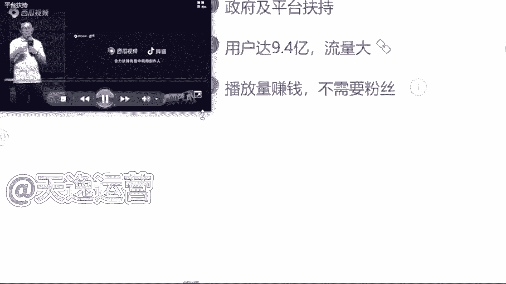
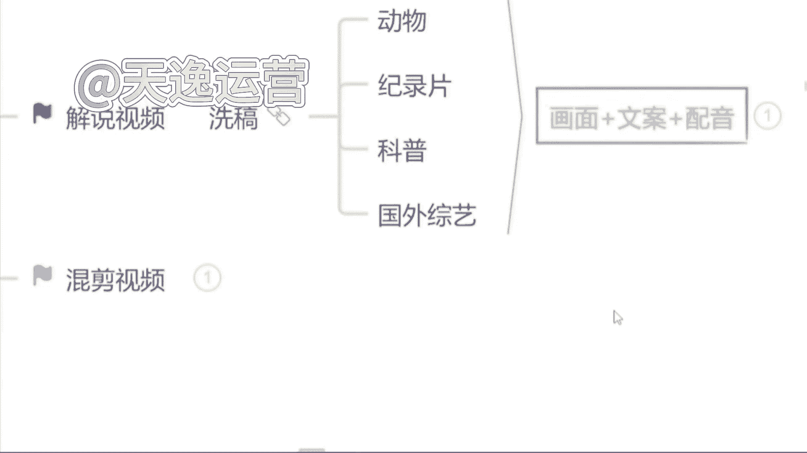
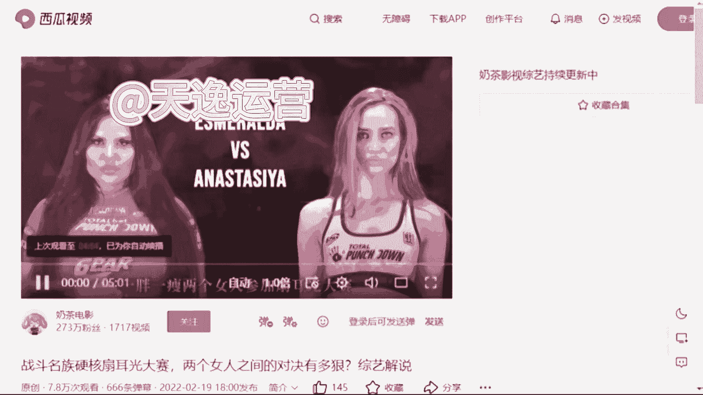
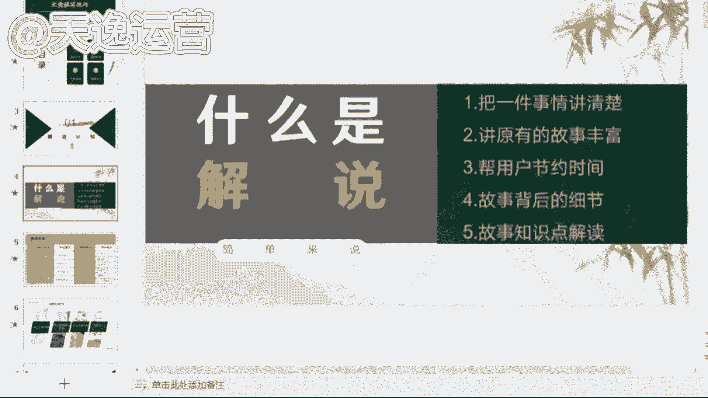
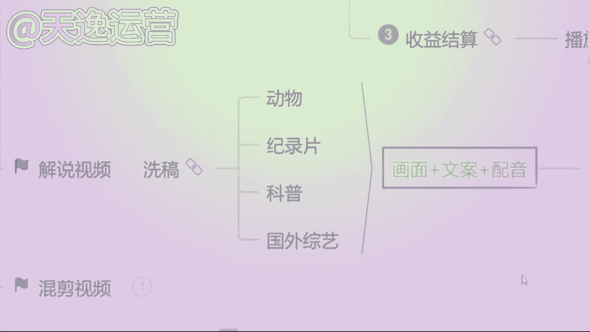

# 【自媒体起号保姆级教程】如果你还在盲目自学自媒体那么一定要看过来，全程干货，全流程拆解（原理+方法+实操）超简单轻松日入1000+！！！ - P1 - 无人随从2 - BV1XAWDejENS

牛逼做抖音如何快速起号，并不是打开某某开关就能火，那些都是骗流量的，下面告诉你真正的起号方法，按照步骤操作，你也可以像我这样上热门，首先要搞清楚什么叫做起号，抖音有八个流量池，起号的本质就是流量池突破。

至少要达到二级流量池，拥有几千基础播放量才能叫做起号成功，但是99%的人都不会起号，账号不符合系统推荐算法，所以只有几百播放，下面是几号的五个步骤，缺一不可，这是MCN机构内部资料。

建议收藏一找对标内容，抖音搜索热点宝，点击观测，选择你的行业，找到最近七天涨粉最多的十个账号，然后搜索你行业的热点视频，点击低粉爆款视频榜，找到最近七天热门的低粉号，这才是找对标最正确的方法。

也是最恶心的方法，二确定表现形式，这是需要把对标账号的所有视频看一遍，找一个你能模仿并且超越的表现形式，确定谁来拍，怎么拍，拍给谁看，我这里选择的是mg动画形式，以此代替真人出镜，三超热门选题。

从对标账号中找七个热门话题，在抖音搜索热门话题内容，找到三个相关的视频复制链接转化为文字，然后组成为一篇内容，用自己的理解进行表述，最终形成一篇原创热门文案，四测试爆款，通过定好的形式完成视频制作。

每天定时发布一条视频，连续发布七天，不出意外，必有一条爆款，因为一个新号一般会有三次上热门机会，期间可以购买抖加投达人相似加速测试，结果我复制爆款上热门之后，粉丝量会暴涨。

然后就是复制爆款视频提高粉丝粘度，这时你就会神奇的发现，你发的视频再也不是三五百播放，随随便便就是几千几万播放，这是我其中的一个账号，从抖音起号到开通中视频计划，用了三个月左右的时间。

现在每天的收入都能稳定在600~1000，只要坚持下去，还是可以赚到一份不错的收益的，如果你也想做，可以在下方评论区留言一个六，大家可以一起玩，首先第一个板块就是自媒体，它的一个现状和前景。

就是无论我们做任何一个行业哈，无论是做全职也好还是兼职也好，我们得清楚这个行业它的一个现状和前景，我们去做对于我们来说有一些什么样的好处呢，它到底可不可以去做呢，是吧，我们了解清楚了过后，我们再去上手。

我们才能更放心一点，那第二个板块呢就是零基础的同学，我们如何去打造一个高收益的账号，就很多可能了解一点自媒体的同学，或者说你是有做过自媒体的同学，可能都知道哈，呃我们这个视频发出去，要么他是零播放量。

要么你去抖音和这个快手上面，你去做视频啊，靠这个播放量没有人来给你结算收益的，这是为什么呢，那这个板块当中呢，我会教大家怎么去选择这个平台，怎么去选择领域和这个渠道，我们才能把这个收益赚到手。

那第三个板块就是一个亿万流量的，一个多种变现玩法，就是很多同学了解自媒体呢，可能都知道我们自媒体呢就是我们做视频，或者说文章发到这个平台上面去，有人观看，我们可以靠这个播放量去结算收益。

那除了这个之外呢，还有很多种玩法，都是和我们零基础同学去上手的，那这个板块呢我会给大家讲到，那第四个板块呢，就是我们自媒体变现的一个正确打开方式，呃，是这怎么说呢，就是如果说你是听完整堂课。

你觉得这个自媒体比较适合你的，你有时间来做的，那我会教大家怎么去规划我们自己的账号，以及系统性的把这个钱赚到手啊，这是我今天内容板块的一个划分，那么首先呢先来了解一下到底什么是自媒体呢，自媒体的话呢。

我用大白话给大家讲吧，就是我们今天打开我们自己的手机，百度去百度上面搜索一个自媒体平台，然后去这个平台上面，注册一个属于我们自己的账号，在我们自己这个账号上面去发布，我们自己做的文章或者说视频啊。

我们有人观看，就可以靠这个播放量去结算收益，这个就叫做自媒体，我这样讲能不能明白，那我们了解了一下到底什么是自媒体，那么得清楚这个行业它的一个平台现状如何呢，是吧，到底可不可以去做呢。

就是我不知道同学们在这之前，有没有了解过这样一些新闻哈，就现阶段呢我们整个社会呢它是非常浮躁的，就很多人都想赚钱，就是在这之前呢，就原来很多人想赚钱的时候，但是采取了一些不合法的手段。

去到缅甸这样地方被噶腰子了的新闻，这样的新闻有了解过吗，有的来打个有字板，就这个呢就是呃不合法的国家呢，他已经明令禁止了，但我们不能去做，因为我们去做，对于我们来说没有任何的一个好处嘛对吧。

那么现阶段呢自媒体行业是属于国家支持的，那国家支持呢，他现在已经把这个文件已经下达到了，各个地方政府，包括你们现在看见这个呢，是一个荆州市的六项措施啊，包括这个文件呢是今年6月2号，人社局来发布的。

人社局国家单位，包括这个文，文件当中呢也指出了我们要加大政策宣传力度，有力支持自媒体以及新媒体行业的蓬勃发展，包括你们也可以来看一下，有没有你们自己的那一个地方，包括往下边看。

这个是这个是那个广西壮族自治区的。

看见没，都是新媒体的。

都发布了相应的一个政策性文件，包括这个文件当中呢也知道了啊，也说到了说我们要坚持正确导向，内容为王，什么意思呢，就是我们未来作为这个自媒体创作者，我们创作的这个文章和视频。

它才是结算收益最重要的一个方式和途径，我这样讲能明白吗，就包括你们听到这里，你觉得这个自媒体行业他可以来做吗，就是国家现在支持的，因为他已经把这个政府文件下达出来了，你觉得他可以来做吗，可以是吗，对了。

那除此之外呢，就现在政策性文件也有了是吧，来支持我们去做视频，那我们自媒体平台他也得响应国家的号召，他出钱让我们来做视频，那他出多少钱呢，来我们去看一个视频来了解一下。

我们希望接下来能够帮助更多的中视频创作者。

成为职业创作人，职业创作人的意思就是以创作视频为职业，并且通过创作视频就可以过上更好的生活，那为了实现这个目标，未来一年，西瓜视频决定将额外拿出20亿元，补贴中视频创作人，我想强调两点哈。

第一这是真金白银的20亿元，不包含任何的商单，直播和电商的收入，是纯补贴，我们也会积极探索保底加分成的模式，助力创作人职业化，这可能也是行业首创，第二二十元只是保底，上不封顶啊，说到这里呢。

我想起来一件事情，好同学们从这个视频当中了解到了一个什么，关键的信息呢，就这个平台他给到我们多少钱去做视频，多少钱呀，20亿元，对不对，包括刚才这个创始人，他也提到了这20亿元，它不包含任何的商单。

直播以及电商的收入是什么，是纯补贴，就是我们未来去做视频，我们就能去拿到这20亿元里面的收益，这就是我们未来能够赚到的钱，那除此之外呢，现阶段我们自媒体行业呢有一个优势。

就它的用户数量非常庞大的，有多少呢，接近9。4亿了，包括今年这个2022年，这个中国研究生网站啊，也出台了相应的一个自媒体行业的市场调查，以及发展前景的分析报告，这个报告呢是今年9月9号来发布的。

这个报告当中指出了，我国现阶段中国网民规模多少人，是9。4亿人，接近10亿了，这9。4亿人呢就是看视频的人，他有手机，有这个视频平台，每天都会去刷视频，那看视频的人有这么多了，做视频的人肯定也有吧。

有多少呢，来往上边看，截止去年为止，我就我国全职从事自媒体的是370万人，兼职从事自媒体的是600万，就加在一起，一共做视频的人才970万人，我们应该算个整数，我们算1000万好不好。

就有1000万的人，他在做视频，有10亿的人，他在看视频，这个相当于什么呢，相当于100个人里面只有一个人在做视频，问一下同学们，我一个人做的视频够不够，你们100个人去看，我一个人做视频的速度。

能不能赶上你们看视频的速度，其实是什么呢，其实是不够的，对不对，为什么呢，这个就是我们国家为什么支持，我们自媒体行业发展的一个原因，因为我们国家未来的一个发展趋势，一定是在这个互联网行业当中啊。

是从哪里可以看出来的呢，就是从我们小时候啊看的是这个黑白电视，就我们长大了之后看的是彩电，那包括到现在呢，我们自己家的电视上面都能连接WIFI了，这以后我们做的视频，我们自己家的电视上面他都能够看见。

你可以思考一下这个用户数量是多么的庞大了，对包括我们的用户人群呢也不断的在扩张，那除此之外呢，现阶段我们自媒体这个行业呢，最大的一个优势就是我们去做，不需要我们有任何的一个粉丝基础。

那我们只用靠这个播放量就能够赚到钱，但是我们呃说到这里哈，很多同学会有这样一个问题了，艾森老师，我们去做视频，但是我们没有粉丝，这个播放量是哪里来的呢，就有没有这样疑问，我去做视频是吧，没有粉丝。

那这个视频的播放量是哪里来的呢，首先要告诉大家，这个播放量是平台扶持的流量，刚才我们讲到了，国家支持它的文件，已经有了平台，它是会扶持我们去做视频的，就看你作品的质量如何了。

就可能同学们现在了解到的平台自媒体平台哈，可能更多的要么就是抖音，要么就是快手，是不是就平常刷视频用的最多的，是不是抖音和快手这两个平台，我们都知道，抖音这个平台在前两年他短视频最火热的时候。

就他在抖音直播带货最赚钱，但是我们都知道你想要去这个带货，你必须要有粉丝基础吧，你没有粉丝基础，你去带货谁来买呢，是不是，那除此之外呢，我们自媒体平台跟抖音，它是有一个本质的区别的。

我们只需要去这个平台上面去做视频，有人观看，我们就能够靠这个播放量去结算收益的，我们只需要了解一点什么呢，1万的播放量他能够拿到多少钱，很多同学会问了，曾老师为什么不是以千为单位呢，是以万为单位呢。

当然有啊，有1000阅读量的单价，但是只有我们拿到1万阅读量的收益的，这个播放量的时候，我们才能够去结算收益，才能够把这个收益提现到我们的银行卡里面来，我这样讲能明白吗，就我们去看一下。

这个1万的播放量的单价到底是多少啊，首先呢我们这边可以看见一个千字的阅读单价，能看见吗，千字的阅读单价是多少钱，是三块四毛钱，看见吗，这是1000的啊，就是1000的阅读量，我们能够赚到三块钱。

那1万的阅读量又有多少呢，我们乘以1万嘛，就是34块钱，这个单价你们要记清楚，这个就是我们未来能够揣在自己兜里面的钱啊，等一下曾曾老师会问的这11万的阅读量，单价到底是多少呢是吧，这个要记住好吧。

那我们现在知道了这一个单价了，很多同学会说诶，曾老师反正他都赚钱是吧，那我现在不做，我以后再来做吧是吧，反正他都赚钱，反正他都赚钱是吧，这个行业我现在不做吧，我以后再来做，有没有这样想法的。

有的你就打个友字就说到这里呢，问同学们这样一个问题，就是如果说这个未来自媒体行业，它发展成为像这个9年义务教育一样，所有人都能来做的时候，你觉得你还能不能做起来，就未来我们这个自媒体行业，国家说诶。

同学们朋友们，我们现在已经把它纳入到这个，9年义务教育阶段了，你们全都在做，还能来做起来吗，有的说能，有的说不能，就问同学们这样一个问题吧，就是这个呃，就跟原来这个18年的抖音是一样的道理哈。

18年抖音刚出来的时候，他是最火的时候，刚刚站在风口上面是吧，那个时候选择做抖音的人，他是最赚钱的，他也赚到钱了，但是现在你再去做抖音，你还能做起来吗，现在你再去做抖音还能做起来吗，其实做不起来了。

对不对，是一样的道理，每一个行业它都有相应的一个风口存在的，这个机会放在这里，他是不会等着你来选他的风口，他是会过去的，你就不能来做了是吧，如果说未来你去大街上面随便拉一个人问他，你知道自媒体吗。

他说哎我知道那个时候我就劝你不要来做了啊，因为你就需要花更多的时间，更多的精力，你才有可能能做起来，包括我们刚才说到的这个行业的一个，市场报告啊，就调查的这个报告是今年9月9号来发布的。

说明我们是了解到这一个信息的第一部分人群，我们刚刚站在这个行业的风口上面，小米创始人雷军曾经说过哈，站在风口猪都能起飞，就看咱们要不要去做一只风口上面的猪是吧，这个就是我说到的一个行业的风口啊。

就看你自己愿不愿意来选择了，那说到这里问一下同学们，你觉得这个自媒体行业它值得你来做吗，你觉得他值得咱们来做嘛是吧，这个风口嘛就看你自己要不要去选，好那除此之外呢有很多同学也会说到了是吧，好曾总老师。

我觉得可以做是吧，我觉得能赚到钱也值得去做了，但是为什么我发的这个视频发出去，它永远都是零播放量呢，要不然只有几百甚至1000多的播放量，是不是这个平台他不喜欢我，他看不惯我，所以说他不给我推送流量啊。

其实不是的，是因为我们自媒体平台呢它总共有30多个啊，这30多个平台呢同学们全部截图保存啊，这30多个平台我们未来都能够用到的，今日截图好吧，因为这30多个平台呢，它每一个平台结算收益的方式。

适合的领域都是各不相同的，同学们熟悉吗，对他们了解吗，其实不太了解，对不对，那首先我们来看一下，其实每一个平台它适合的领域都是各不相同的，包括给你举个例子吧，比如说今天啊我说我要做一个这个今日头条。

这个头条号，我说我要做，那我先把这个平台账号注册好，那注册好了过后，我去选择一个适合B站去做的舞蹈领域，我能在这个头条上面做起来吗，你觉得能做起来吗，我去做的是头条号这个平台。

但是我偏偏就选了一个适合B站去做的领域，为什么呢，这个就是很多这个自媒体嗯，呃这个人没有做起来账号的原因，你连平台以及领域都没有选择，对这个平台，他凭什么给你推送流量啊。

他不会把这个流量浪费在你的身上的，他是会去扶持适合它这个平台，适合用户去观看的领域的，这个呢我到时候送给大家啊，把这个领域的区分到时候我送给大家啊，让你们有一个领域区分的地方。

但是呢我得看你们的表现好吧，谁今天啊互动性是最强的，是真正想要学习到这个知识的，我就送给你们啊，因为曾曾老师特别喜欢这个爱学习的同学，好吧，看你们的表现咯，那除此之外呢，这30多个平台呃。

30多个平台里面，我们该去选择什么样的这个内容，我们来做视频呢是吧，那首先问一下同学们，平常在这个刷视频的过程当中，我们刷什么样的视频，刷的是最多的，你看什么样啊，看着视频看的最多是影视的呢。

解说的呢是吧，单视频剪辑的呢，还是说游戏的呢，综艺的呢，动漫的呢，搞笑的呢，你看什么看的是最多的，呵呵美女好的好的，我知道了，那喜欢看美女的同学非常的不错呀，曾曾老师也喜欢看美女嗯。

但是我们把看美女的时间，我们去做一个美女的盘点视频，她可能赚钱会更快一点是吧，影视的什么正能量的，搞笑的，还有呢其他同学呢看什么样的视频，看的是最多的，还有没有其他的基本上都是影视了是吗，好的好的。

我知道了，影视呢在所有的平台上面，确实扩散量是最大的啊，军事的也有是吗，军事的它在我们国内的平台是可以做的，但涉及到一些呃会比较外网的平台，他是做不了的，嗯像现在的那个to talk。

他就做不了这个是吧，那首先呢在这个平台上面，我建议同学们哈一定要去选择对赛道，我刚才说到了，你赛道选择对了这个平台，他才会给你推送流量，我建议你们去做的话，就以这三个类型的视频为主。

首先第一个视频剪辑类的，第二个解说视频类的，第三个混剪视频类的，这三个类型的视频，是现在所有平台大数据分析之下，用户的点击量，阅读量以及完播率是最高的三个领域，大数据是什么意思，知道吗，同学们，大数据。

比如说我举个例子吧，比如说我们平常就很多同学呢会说，看的东西是比较多的，就刷到什么看什么，比如说呃这这一类型的视频的话，就是我们所有同学说不知道的也是啊一样的，就平常刷到什么看什么。

你在所有的类型的视频的这个停留时间，它是一样的，但大数据呢就是，如果说我们今天选择抖音这个平台，我今天刷美女刷的时间更长，从明天开始，这个平台他给你推送美女的视频绝对是最多的。

如果说你看美食类看的是最多的，那从明天开始这个平台，它给你推送美食类相关的视频，他就是最多的，有没有这样的情况，是不是这样子的，这就叫大数据啊，大数据呢，他现在可能比我们自己的爸爸妈妈还要了解。

我们知道我们到底喜欢什么样的内容，什么样的东西，跟着大数据去做视频啊，你的这个播放量呢它才会更高，啊那首先呢我们先来讲第一个视频剪辑类好吧，视频剪辑的话呢，分为很多都可以去做这个视频剪辑。

比如说首先第一个就是这个电影的，就影视的剪辑嘛，电影的啊，除此之外呢，像这个电视剧的或者说综艺的啊，这个都是这个视频剪辑类的，那如果说我们想去做这个视频剪辑类的呢，我们首先要去干嘛，要去找素材，对不对。

那这个素材我们该怎么去找呢，找素材呢我们先从这几个平台去找，首先第一个所有的视频平台，知道视频平台有哪些吗，啊那现在不知道的同学来看一下，这个就是我刚才让你们截图保存的，这30多个自媒体平台。

现在不知道的同学再截图保存一次啊，这30多个自媒体平台呢，都是我们能够找到素材的地方，那这30多个自媒体平台呢我们都能找到素材，那除此之外呢，第二个我们可以去一些影视网站里面去找。

我不知道同学们有没有了解过哈，影视网站，比如说我举一个例子，就原来我们所说的这个豆瓣电影这样子的呢，都是这个影视的网站，包括我自己呢整理了将近有这个50多个啊，影视的一些网站。

这些网站里面所有的一个影视素材，它全部都是没有版权要求的，这个呢我到时候也可以送给你们，除此之外呢，这个平台呢就这些网站呢它是关于影视类的，就很多同学说哎曾曾老师，那我不想做影视类的是吧。

我想做一些其他的什么动漫的，综艺的，搞笑的，我想做一些这些类型的，OK也可以啊，我自己也整理了将近有60多个，这60多个网站了，里面除了影视类的，像这个旅游的啊，这个图片类的啊，音效类的，评论的。

体育的，美食的，动漫的，综艺的，搞笑的，或者说各个国家的境内境外的视频素材，我们都是能找到的啊，都是能找到的，这个呢我后边也送给你们好吧，让你们能有一个找素材的地方，那除此之外呢。

第三个就是我所讲到的这个影视推广的平台，就影视推广的平台呢，现在他可能做的更多的，就是我们在这个抖音或者说快手上面，我们很多同学都知道哈，你去抖音或者说快手上面做视频，有做过的。

来就去这个抖音或者快手上面发过视频的，有没有，因为我们都知道哈，就抖音和快手这两个平台，你去发布视频，最多最多可能只能达到一个涨粉的作用是吧，这个播放量它是变不了线的，那如果说我们去做这些影视推广。

平台里面的这些影视素材啊，我们是可以靠这个播放量去拿到奖金的啊，这个平台呢等一下我会着重讲啊，我会着重讲，那么首先呢如果说我们要去做这个视频的剪辑，我们素材该怎么去找呢，比如说我给你举个例子吧啊吧。

我们今天打开我们自己手机百度，那我们先打开这个百度，打开了过后呢，我们随便去搜索一个自媒体平台吧，嗯用这个西瓜视频，我们搜索一下这个西瓜视频，然后点击百度，我们打开它的网页，比如说我今天举一个例子。

我想要去做一个这个关于综艺类型的是吧，我想要找一个人，比如说综艺类型的，就是它跟娱乐是相关的，就同学们平常看直播吗，直播看不看，就像一些网红的直播，什么大杨哥，小杨哥是吧。

比如说我们想要找一些这一类的素材，我们直接去搜索他们这一个关键词就可以了，什么关键词呢，就直接搜名字啊，大杨哥，小杨哥，我们直接搜索关键词，然后点开搜索，我们就能找到非常多的一个素材了。

现在我们按照这种关键词的方式去找素材，能不能找到，但是在这个找素材过程当中，我得给你强调一点，我们正确找素材的一个方式，不是让你们把这个视频直接下载下来，就很多同学。

我不知道同学们有没有听到过这样一个词语，就你们可能听过课程的哈，有的老师叫你去做搬运，有没有听过的，或者说有没有做过搬运的，如果说你直接去把这个视频下载下来，它跟搬运就没有什么区别了啊，搬运的内容。

现在平台95%的人，你去做都通过不了审核，所以说告诉你们正确找素材的一个方式，就是我们要从这么多的这个视频当中去找到，符合我们自己视频主题的视频片段，就每一个片段呢大概保持在十秒钟左右啊。

十秒钟这个数字你们要记住，到时候我们找到素材，我们去做视频平台，在审核的过程当中才能给你通过，是不会有违规存在的，这个记住了吗，记住了，公屏上打一啊，十秒钟左右，每一个素材片段。

就按照这一个这个时长去找就可以了，那除此之外再举一个例子，比如说我们今天想要做一个沈腾的是吧，沈腾明星明星网红，他都是自带呃这个热点的啊，热度的你去做，他不缺流量啊，不缺流量的那一样的。

我们打开一个关键词直接搜索，就你们能找到素材呢是非常多的啊，是非常多的，那现在我们素材能找到了吗，那如果说我们这个视频素材我们自己能找到了，那我们想要去做视频，OK那我们是必须要用到什么呢。

用到剪映这个软件的，做视频的话呢，问一下同学们用哪一个软件，用的是最多的手机还是电脑，你用哪个，我等一下就用哪一个给你们实操好吧，根据你们的一个要求来，都是手机呀，没有一个打电脑的吗，呵呵好的。

我知道了，就你们打手机的这个速度，就让我感觉到生怕我看见电脑是吗，好的，稍等一下，我投个屏好吧，我投个屏，啊那我们今天呢如果说我们要做视频哈，我们首先呢要确定一个什么呢主题，比如说我举个例子吧。

我说我们今天去做一个综艺类型的，我们就要确定一个人物，什么人物呢，我们今天去做一个这个呃沈腾的搞笑名场面吧，就这一个视频的主题，我们的主题确定了，那这个视频的素材当中必须要有沈腾这个人，这个是主题。

到时候你们要记清楚好吧，那现在同学们能看见我的手机了吗，能看见我的手机了吧，那么首先呢在我们自己的手机上面，找到一个剪映的软件啊，就这一个剪映的话呢，他这个手机端和电脑端，图标长得都是一模一样的啊。

没有什么区别，我们找到这个软件过后呢，直接点开它，点开了过后，我们可以看见一个加号的界面，就是开始创作这个界面，我们直接点击这个加号的位置，然后把我们自己找的一个视频素材，先给它添加进去一个。

那么这个视频素材添加进去了之后呢，首先讲一点，我们自己做视频的话呢，素材它是能找到的，但是我们要做的这一个视频的主题背景，他是找不到的，只能我们自己去制作，那怎么做呢，首先我们要找到这个视频轨道。

有右边有个加号的位置，看见了吗，直接点击这个加号的位置，然后我们找到这个手机自带的素材库啊，这是剪映自带的，看见没素材库，我给你们圈出来，找到素材库了，过，后来直接点开。

我们在热门里面就可以看到非常多的一个背景，主题非常多，包括我们用的话呢，像这一类型的，或者说这种的这种的，包括这种的，我给你们圈出来这种背景呢它都是可以用的啊，都是可以用的。

但是我更建议你们呢去选择一些简单明了的，就用户点进来一看，我就知道你做的这个视频是什么主题，这是黑白色的这个背景。

我们就选择一个黑色的背景添加进去吧，啊那这个背景添加进去了，过后来首先背景有了，我们得添加主题吧，那这个主题该怎么去添加呢，来左下角有一个文字的选项，直接点击文字，然后点击最左边这一个新建文本。

好看一下，文本框出来了，那现在我们要打我们自己做的这个视频的主题，我们刚才说到的，我们今天要做的这一个视频的主题人物，他是谁是谁呀，这个我们一定要记住哈，我们的主题人物如果说明确了。

你找的视频素材当中必须要有它啊，必须要有它，如果说没有这个素材，我们就用不了是谁，还记得吗，我们刚才说到的，我们刚才说到的是谁来着，我们今天要做一个沈腾的搞笑名场面啊，沈腾这个人你们是必须要记住的。

这个沈腾名字确定了我们所有的这个素材当中，必须要有他出现啊，如果说没有，到时候这个素材用不了，重新找好吧，这一点是要记住的哈，那么首先呢先来打两个字，就是谁呢，就主题人物沈腾，沈腾的什么呢，沈腾呢。

他有自己的综艺场面，也有自己的影视场面，如果说你找的素材是跟影视相关的，你就打影视啊，如果是跟综艺相关的，咱们就打综艺好吧，这个咱们区分开来，沈腾的综艺爆笑名场面，OK这个名字我们确定了过后。

但是我们看一下是不是非常白白色的文字，我看起来不太好看，不太好看是吧，我们所有人呢他都喜欢一些色彩鲜艳的东西，这是比较抓人眼球的，那接下来呢，我们也不要去选择什么样式和花字了。

不用我们直接去选择右下角这个文字模板，我们直接往上套啊，这样是最方便的，我们这个文字模板呢根据你自己的实际情况来，他有收费的，有免费的啊，我们自己去选就可以了，我们随便选择一个模板来看一下。

同学们觉得这个模板可以吗，觉得这个模板可以用吗，我觉得还不错啊，这个模板我们找到了过后呢，来直接选择右上角的这一个对勾，OK我们的主题背景有了，那我们选完之后呢，直接手动的选择整体这个文本框的右下角。

给他放大一点，好吧，让我们这个文本看起来更清晰，好，这个文本就这个背景，我们制作完了过后，OK名字是有了，但是我们不能让用户点进来看什么，看哑巴电视吧，不可以，谁都喜欢有声音的东西。

那问一下同学们会配音吗，同学们会配音，没会配音的，你打惠子吧，不会的，你打不会，如果说会配音的同学，咱们自己就打开自己手机里面的录音机，我们把这个名字自己念一遍就可以了啊，如果说不会的，没有关系。

我们直接选择右下角这个文本朗读，我们直接往上套就行了啊，这个是比较方便的，我们选择文本朗读了过，后来你看一下是不是特别多的声音，什么方言音啊，什么男生喜欢的萝莉音啊，什么女生喜欢的这个男士的播音腔。

OK都有的，但是我更建议同学们去使用一些这个方言音啊，就方言音在现在所有平台它上面的一个呃，运用率它是比较低的，但是比较有吸引力的，你们去做，但是比较能够吸引到人的，像方言的话呢。

我最近呢比较喜欢一些广西的方言，因为我觉得很有意思，有没有广西的同学，我觉得很有意思，好吧，我们就先来听一下这个方言音，沈腾综艺爆笑名场面，沈腾中介报销名场面，沈腾综艺爆笑名场面，沈腾综艺爆笑名场面。

沈腾综艺爆笑名场面，沈腾综艺爆笑名场面，沈腾综艺爆笑名场面，是不是非常多的方言音啊，咱们自己去选就可以了，那我就选一个广西的方言，那我们这个方言音我们选择完了过后，直接点击右下角有一个对勾。

OK它就会自动的去下载这个音频，那这个音频下载完了之后，我们从头来听一下沈腾综艺爆笑名场面，OK现在声音呢它是有了，那我们现在呢手动的选择这个黑色的背景，你直接点击它一下就可以了，那点完了过后呢。

我们自己手动的来给它缩短一点，让它能够音画同步，那这个主题的背景我们制作完了过，后来紧接着重要的来了，由我们本身视频的本身，首先我们来看一下有没有沈腾这个人，OK有，那这个素材我们就能用。

我们刚才讲到的，如果说这个里面没有沈腾，那咱们就用不了啊，这个你要记住，那首先呢在讲的过程当中，我边讲边给你们讲细节，首先第一点我们要做的这一个视频，它必须是16比九的一个横屏。

这是所有平台它硬性的一个标准，如果不是这一个比例，OK平台的审核是不会给你通过的，一定要记住这个比例啊，我给你打在公屏上了，那除开这个呃抖音啊，除开抖音，因为抖音的话它是需要九比16的竖屏啊。

除了这个抖音之外，其他平台都是16比九的一个横屏，这两个咱们记住，咱们把它区分开来，到时候做视频的时候，比例要选择对，那这个比例呢首先我们来看一下该怎么去做啊，就像我们这一个视频一样。

它明显不是一个16比九的横屏，我们该怎么去调整呢，来首先最简单的一种方式，我们找到这个手机下方有一个比例的选项，直接选择它来，现在我们看见有一个16比九的横屏的选项，没给你们圈出来，看见了吗。

就是这个找到了过后，直接点击它，我们现在就来看这个素材视频，他到底动还是没动，如果说它动了，OK他就可以用这种方式去做比例的调整，那如果说像这个视频一样，它一动也不动，那该怎么去调呢。

我们自己手动调该怎么调呢，这样可以增加我们使用素材的这个几率啊，就是我们能够用到的素材就更多了，首先呢我们选择左下角有一个剪辑的选项，找到剪辑，然后选择里边有一个编辑的选项，看见了吗，直接选择编辑。

然后我们自己来干嘛，裁剪这一个画面，那裁剪过程当中呢，首先强调一点哈，所有的这一个视频当中，原有的这个字幕，咱们不要留，直接给它裁掉，我们等一下自己做就可以了，那在这个裁剪过程当中呢，包括这个边框。

到时候你们少给他留一点啊，少留一点边框，到时候留多了过后，它会有一个黑色边框，会不好看，少留一点就可以了，那这个画面我们裁剪完了过后，直接点击右下角的对勾，OK来看一下这个比例是不是调整了，视频。

它明显的放大了，但是它也不是一个16比九的横屏，如果是的话呢，它就不会有这个黑色的背景了，那接下来该怎么去调呢，找到我们手机右下角有一个背景的选项，在这里看见没背景，直接选择它，然后右下角有一个什么呢。

画布模糊，看见吗，直接选择画布模糊，我们调整到第一个清晰的画面，现在你再来看一下，这个是不是就是一个16比九的横屏了呀，同学们这个步骤要记住啊，啊记住了对吗，好来接下来一样的右下角对勾点起来好。

这个比例我们弄好了，弄好了过后呢，来接下来第二点，我们每一个视频呢，它毕竟不是一个原有的视频，不是一整个每个视频呢大概在十秒钟左右对吧，那这个视频之间呢它是必须要有衔接的，我们必须要添加这个转场的视频。

就我不知道同学们有没有，这个在看视频过程当中，有没有看到过一些转场，就比如说呃有的这个视频看完了之后，中间会给你添加一个不属于这个视频当中，任何一个片段的搞笑的界面，有没有看到过，有，对不对。

为什么要添加转场呢，我们要让用户明确的知道，它每一个片段的内容是不一样的，而是不一样的，如果说每一个片段不一样的情况之下，你不添加转场，他在看第二个视频的时候，心里会咯噔一下，诶。

这个视频的片段怎么长得不一样了，视频内容怎么不一样呢，往往有这种情况的时候，我们会做出什么一个动作呢，退出去看一下我今天看的这个视频是什么，如果说他有这个退出去这个动作了，我们的视频完播率它会直线下降。

完播率是会影响到我们整体的单价和收益，结果的，所以说转场必须要添加，那该怎么去添加这个转场呢，来一样的这个视频轨道，右边有一个加号的位置，看见了吗，我们用它的机会是非常多的，点击这个加号一样的选择谁呢。

选择这个素材库啊，我们一样去找到这个素材库，点击它在这个热门里面非常多的一个这个转场，包括像这种的这种的，包括这种的熟悉吗，同学们这种转场是不是看的非常多，包括现在所有做的视频，只要是添加了转场的转场。

基本上都是从这个简易里面找的，你们都可以去用啊，这个没有什么问题的，那在找转场过程当中呢，强调一点，我们不要去找太长的，像这种16秒钟的不要去选啊，不要去选，因为太长了。

我们没有任何一个人会把不重要的东西，我们有耐心看完的没有，所以说我们选择，尽量保持在3~5秒钟的一个转场，那最合适的我们选择一个三秒钟的来，我们给它添加进去啊，这个转场我们添加完了过后来看一下，一样的。

也要强调一点，转场的视频，他也必须跟我们所有的一个视频比例保持一致，什么呢，16比九，那这个视频我们出来了过后，右下角直接会有一个画布模糊，画不模糊这个选项啊，直接找到它，点击第一个清晰的画面。

这个背景它就是一个16比九的一个横屏了，嗯现在要记住，我们找到这个画布模糊之后呢，依然右下角的这个对勾点起来啊，点起来啊，一样的，我们这个视频的比例呢，它做完了这个步骤有没有记住啊。

我们该怎么去做这个视频能听懂吗，这个步骤啊我们该怎么去裁剪这个比例，该怎么去添加这一个背景的主题，能是不是好的好的，那么这个视频能做到，现在来，接下来，下一步我们要去添加我们这个视频的文案，就是字幕。

我们该怎么去添加呢，依然找到我们手机左下角这一个文字的选项，来点击它一下，我们新建文本右边有一个什么呢，有一个识别字幕，看见了没，直接点击这个识别字幕，然后我们选择这个开始匹配。

它就会自动去给我们识别这个音频当中，或者说这个视频当中人物所说的话，给我们形成一个字幕来，看见了吗，字幕现在出来了，稍微调整一下，怎么调呢，放大一点，就这个字幕文本框的右下角看见没，给他往右边拖。

那现在放大了过后，整体把这个文本框，拖动到视频最下方的一个位置，现在看起来是最舒服的，就你调整完了一个字幕过后，第二个你就不用调了，因为它都会随之来调整啊，这是最方便的，现在这个视频该怎么去做啊。

该怎么去剪这个视频，这个视频我们该怎么去做，知道了吗，我们一定要按照这一个比例，或者说按照所有的一个步骤找素材，也是严格的去做，阿班不要去找太长的一个视频，到时候平台在这个审核的过程当中呃。

要不然他就不会给你通过了，知道这个视频做起来难不难，同学们其实不难，对不对，好很多同学呢在这个过程当中也会说到了，哎曾老师这个视频确实不难是吧，那很多同学呢也说到曾老师，那这个视频一样的。

我如果说想要去发到这个抖音，或者说这个快手上面，我们该怎么去结算这个收益呢，这个曾曾老师要给你们讲到哈，我们这些视频呢它发到其他的一个平台上面去，如我刚才所给你们讲到的这个视频。

我们剪完了过后发到这30多个自媒体平台，就除开抖音和快手，其他的平台呢，我们都是可以靠这个视频本身，给我们的一个播放量去结算收益的，这是可以的，但是抖音和快手这两个平台呢，就像我刚才讲到的这个视频。

发上去最多最多他可能只能增长粉丝啊，这个就是我所要强调的，就有没有同学，你们是只想去做抖音和快手这两个平台的，就只想去做自己熟悉的平台，抖音和快手，曾老师，我想去做这两个平台，但是我同时去做呢。

不光想涨粉，但是我也想靠这个播放量去结算收益的，有没有有的在公屏上打，有字吧，那我刚才所讲到的这个所有的一个视频的话呢，他发布的平台呢，你们就可以去这个抖音快手。

小红书以及微信视频号上面去发，就这四个平台熟不熟悉，同学们熟悉吗，就我们平常会用到的，对不对，这个小红书呢包括很多这个呃，可能女性或者稍微年轻一点的，九五后可能用小红书这个平台呢，可能用的比较多一点。

像微信视频号呢，如我们人手都有一个微信，微信里面有一个这个小程序，就叫视频号，我们可以去发布这几个平台啊，这几个平台发布了过后。

我们通过什么样的途径呢，我们去通过这个视频就是影视推广这个平台，我们去做任务，然后我们通过这个任务去结算奖金，我们可以看一下素材的话呢是非常多的，包括这个红字的部分，你们就可以看一下，包括爱奇艺的任务。

搜狐的任务，这个呢就是所有影视剧的名字，看见没，影视推广是什么意思，知道吗，同学们影视推广是什么，知道吗，就影视推广的话，就是每一个电视剧或者说每一个电影，或者说每一个综艺，他都会涉及到宣传。

按宣传就很多，这个现在很多广告商呢就是因为很多明星也好，或者说很多网红也好，我们拍完了这些电视剧，或者说短剧之前，因为疫情的原因，没有办法到线下去，这个宣传他们都会运用到这个影视推广的平台。

就我们去做视频，帮他去推广，我们就可以靠这个播放量，去让他给我们结算奖金，包括每一个这个视频，就每一个电视剧，这个视频我们做完了之后，我们是需要贴去这个提交一个这个任务的，这个回填链接的。

因为我们要去报名，因为我们要填写自己的微信号，账号昵称，或者说我们自己抖音或者快手的id，包括我们自己做的是哪一个电视剧，我们要添加清楚，包括这个电视剧这个作品的链接，你是发到哪个地方的，你要粘贴上去。

发布的时间是哪一天，包括你要把这个视频的播放量的截图上传上去，到时候我们这个回填链接填完了过后，我们就会给你结算收益了，这个就是影视推广哈，就我们也可以看一下这个影视推广的话呢，它的这一个收益呢。

会比纯播放量的一个收益会更高一点，就现在给你们看一下，啧，看见没，包括短句的话呢，其实是非常多的，短剧的话呢，就是现在很多这个不是很多传媒公司嘛，就有很多网红他们会自制一些短剧，短句话呢。

就是他没有办法自己去做一些这个广告的宣传，他就会让我们自己来做这个视频，发布到抖音小红书视频号，认为这三个平台都是可以去发布的，然后呢根据播播放量的这个要求去计算，我们的收益，没有粉丝要求的啊。

对于我们自己的账号是没有粉丝要求的，你有没有粉丝跟他没有关系，我们一部剧呢，最高播放量的三个作品，加起来的总和去给你结算，包括这个总和该怎么去计算呢，看一下抖音这个平台，1万的播放量奖金是50块钱。

就最开始我给你们算的那个单价，还记得是多少吗，就1万的播放量，单价就1万的播放量单价是34块钱，那个是头条号，34嗯，对34，就那个呢是头条号，他这个播放量的一个单价的收益，像这个抖音的话。

你明显的感觉到这个1万的播放量奖金，收益收益更高一点的，因为抖音的话呢，他这个每天的日活跃用户接近10亿了，非常庞大的啊，非常庞大的，那第二个视频号的话就是微信视频号，你发上去1万的播放量。

奖金是十块钱，为什么他的单价会低呢，是因为我们每一个人都有微信啊，每个人都有微信都会去看这个视频号的，所以说他单价呢会少一点嗯，会少一点，像这个小红书的话，那单价是最高的啊。

小红书的单价是1000的播放量，奖金是30块钱1000嗯，就我们叠加起来呢，每一个这个呃视频，就如果说我们去结算这个收益过后，每增加1万的播放量，到时候还是会有奖金的啊，这个就比较可观了是吧。

除此之外呢，像一些搜狐的短剧，搜狐视频的话，就是现阶段我们可能看见的是比较少了，就我们原来看的时候呢会更高一点，就是搜狐视频，搜狐视频呢他也买了很多视频的版权，但是因为这个本身这个视视频。

他的这个知名度可能不是很高，嗯可能不是很高，所以说他很多短句呢，没有办法去拿到一个好的评分，或者说更高的一个这个播放量，但是会拿过来给我们去做的，像这个抖音和快手，这是需要两个平台都去发的啊。

抖音加快手，让他按照什么结算呢，点赞计算也是没有粉丝要求的，就单条作品如果说有5000个赞是怎么的，就是我们抖音和快手，我们右边他是会看什么，就会看那个点心心，知道吗，那个就点赞。

5000个赞是100块钱，抖音的话，如果是1万个赞是200块钱，快手1万个赞，他是180，他给的单价是最高的啊，这个搜狐的短剧单价是最高的，就这一个有没有兴趣的，因为这个影视推广的话。

他收益结算的话呢是一个月结一次啊，是一个月结一次，这个能接受吗，就我们是月底结算的，这个收益结算的话呢，就是按照播放量计算，我刚才说到的每一个这个短句呢要求是不同的，我们按照他的一个要求来就可以了。

像这个呃呃除此之外，就如果说同学们做这个影视的推广，除了这四个平台之外，你们可以靠这个播放量去结算这一个奖金，如果说在这个基础之上，你们还愿意去添加解说的，就我们一个作品，一个视频。

你是可以获取双份收益的，什么意思呢，就除了刚才我们讲到那四个平台之外，你可以发布到其他平台，你是同时还是有这个什么呢，还是有版权的，你可以去做影视的解说，一个视频，我们拿双份收益，包括给你们看一下吧。

就我之前有一个小伙伴也是这个，就这个小伙伴呢，之前做的就是这一个影视的推广，给你们看一下他这个收益吧，当时这个小伙伴他是自己有想法的，他对抖音这个平台是比较喜欢的，但是看中这个抖音的一个带货能力。

但当时呢他自己的账号粉丝也很少，他想要去做带货，但当时呢他说先积累粉丝，后期呢还是想要带货的，做的就是影视推广，有影视推广的话，当时他问我可不可以朝这个方向发展，我说可以呀。

当时我直接把那个回填链接发给他了，报名的渠道，我说每一次你去做之前，你先把这一个报名渠道填完，填完了过后做了视频，你要去填那个回填链接，就我刚才给你们看见的那个账号的id，你是必须要写清楚的。

到时候要不然到时候这个抖音就结算不了哈，这个当时我给他看的，就是因为最开始呢他做的是什么呢，做的是短句，因为短句的话呢它是这个推广的渠道是很少的，如果说我们去做这个播放量的这一个收益呢，它是会更多的。

当时他做了第一个短句，这个短句的话要求是发三个视频，就每一个短句它会有不同的要求，他让你发三个，你必须要发三个，他让你发十个，你就必须要发十个啊，这个我们得按要求做事情的。

要不然到时候他是会给你下架处理的，当时他这个视频做完了之后呢，播放量是很高的，186万，因为短距嘛他是比较能够贴近现实的，就比较能够抓住我们用户的一些心理嗯，所以说他这个播放量呢是比较高的。

他也觉得很恐怖，但是就是这些短剧呢，他只是说我们平常看的比较少而已，就所以说这个话题度是很不错的，当时呢他这个短剧186万的一个播放量，结算的话呢差不多在500左右，结算是结算这么多。

但是如果说后期每增加1万的播放量，我们还会给他添加十块钱的这个奖金日，机会是很好的，但是这一个那做的第二个短句呢，就效果就没有这么好了，因为第二个短句呢他选择这一个短句呢。

可能就是本身的话题度就不是很高，但是呢呃它的单价会更高一点啊，这个就是有不同的一个选择了吗，当时他这一个短剧的话呢，过程当中是1。4万的一个播放量啊，1。4万就很低，但是呢单价的话是给到了150的。

所以说单价不同，他给的这个收益呢也是不同的，当时这个过程当中的话，他是做了将近一周的时间七天，因为一个月结一次嘛，刚好碰到月底的时间了，而结算收益的话呢，当时官方系统那边给我结算的。

因为他是第一波做这个影视推广的人啊，所以说结算给我的，如果说后期的话呢，我们全部走这个对公账户啊，全部是走对公账户，因为系统那边要核销的，那结算的话四个短句，一周七天他做了四个，第一个短句的话。

是在那个186万的基础上面，后面又正增加了一个6万的播放量，叠加是60，总共结算是580，第二个播放量不高，但是结算了150块钱还是可以的，第三个呢就是因为他没发快手，这也是很可惜的。

因为那一个作品要求发抖音和快手，他只发了抖音，没发快手，所以说只给他结算了一半的收益，是120块钱，第四个呢，因为本身任务的单价是比较低的，只结算了45，当时总计的话是895块钱。

这一周的收益这个还可以吗，满足了吗，就七天的时间，他做了四个短句，当然这个根据咱们自己的实际情况来，你有更多的时间，你就可以做更多的短句，然后去填回填链接，一个月给你结算一次还是可以的。

这个收益还可以了吧，七天的时间啊，这个呢后期全部走这个对公账户，但是呢过程当中给你们强调一点，这个渠道是我给你的，你做的视频呢是必须要发给我的，我审核通过了之后，你才能去发，要不然直接给你下架掉啊。

直接给你下架了之后，你就没有办法去靠这个播放量结算收益了啊，这个要给你讲清楚好吧，就是这个渠道的话，那就很多同学会有这样一个疑问，说诶曾老师为什么他们自己不去发广告呀，要把这一个视频。

就这个影视推广拿给我们去做呢，有没有这样疑问的，而曾老师他为什么不自己去做宣传发广告呢，他要让我们去做这个影视的推广，有没有这样疑问的，因为我不知道同学们，有没有了解过这样一些信息哈。

就每当一个这个影视作品或者说制片方出品人，他们去发这一个广告，他们的费用不知道你们了不了解哈，就低的话呢，基本上每一个这个广告低的话是10万左右，一个广告它可能发的地方呢是比较少的多呢。

它是100万起步的，这个广告的费用，你是觉得他把这个影视的这个推广，拿给我们去做，给我们结算的这个奖金，他花的钱多，还是他们去发广告花的钱更多呢，你觉得是哪一个，你觉得是推广花的钱多，你打推广。

你觉得他自己去发广告花的钱多，你打广告你觉得是哪一个，他花的钱更多一点，是不是他自己发广告花的钱更多，是不是，这个就是为什么，他要把这个影视推广拿给我们去做，因为我们人多，力量大，我们去做视频。

他的这个扩散度是更高的，包括因为这个疫情期间哈，这个机会呢它原来是没有的，是因为现阶段的疫情他真的放开了之后，可能会更加的这一个扩散度会更庞大了，所以他们不会选择去线下宣传。

基本上都是拿给我们做这个影视的推广的，这是一个机会啊，就看你自己愿不愿意去做这个了，那除此之外就问同学们一下，有没有想去做解说的啊，你说曾老师，我就想做这个影视的这个推广是吧，我在这个基础之上。

我还是想向去添加解说，我也想要去争这个双份的收益的，有人哪有字吧，有想要去做解说的是吗，好的好的，我看见了哈，在这个影视解说的话呢，就很多同学在选择这个解说之前，就问同学们这样一个问题。

你在没有来听我的课之前，有没有听到过这样一句话，就很多老师告诉你，唉，同学们不要去做解说了，解说他已经赚不到钱了，有没有听到过这样的言论的，没关系，如果说有听过的呢，我们就不要去信好吧。

如果说没有听过的呢，咱们就不要去听了嗯，因为影视解说或者说解说的视频，它是我们所有的视频领域当中，最赚钱的一个领域，赚钱的东西，我们为什么不去做呢，只是说在这个过程当中呢，我们一定要选择好赛道。

就我刚才讲到的影视解说呢，他不是不可以做，他是可以做的，只是说不太好做而已，不好做是在哪里呢，很多同学如果说你没有版权的情况之下，当然我们就没办法去做，因为影视版权它是会非常重要的。

但如果说你去做这个影视的推广，你去做解说，他是有版权的，他就对于我们来说就比较好做了，那如果说很多同学，你不想做这个影视推广的同时呢，你想去做这个解说的视频，我们就去选择一些跟这个教育类相关的。

教育类相关的呢就有很多，就现在也呃社会当中有句话说的是非常好的，就很多人都说哎我们所有人，包括我们自己也好，我们的父母也好，在这个教育这个领域当中，这个行业当中花的钱是最多的，这句话认可吗，认可的。

来公屏上打个认可两个字吧，认可吗，就这句话，就很多人在教育这个行业里面花的钱是最多的，我们做视频，我们就去贴合教育这个领域去做，我们做解说，一样的，我们就选择教育相关的动物类的，纪录片类的科普类的。

就包括我们小时候也是一样的哈，我们在家里面的时候，我们放假的时候，我们爸爸妈妈也好是吧，我们的爷爷奶奶也好，从来不希望我们在这个家里面去看一些，什么动画片啊是吧，或者说什么动漫呀。

不希望我们看这些没有营养的东西，我们可以看什么呢，动物世界有看到过吗，动物世界有看到过吗，就我们小时候肯定都会看的哈，包括这个动物的纪录片的科普的，现在国家都比较支持这些行业啊，这个领域为什么呢。

是因为我们所有人在观看这些视频的过程当中，它是可以获取一些不同的社会常识的，这对于整个社会来说它是有用的，这个我们就可以去做，因为平台给的扶持流量，他是会高于其他领域的啊，就这几个领域。

当然我在讲这个解说之前呢，一样的得给你避个坑，什么坑呢，就很多老师给你讲解说的时候，他会教你们，所以同学们我们不会写这个文案，没有关系，我们可以去找素材来用，我们找什么样的素材呢，我们直接去做洗稿。

有没有听过洗稿的，有没有做过洗稿的，有没有听过的，或者说有没有做过洗稿的，有是不是，那首先你们强调一点哈，洗稿的内容不要去做了，嗯这个国家都是发布了文件的，明令禁止，不能去做洗稿的内容，你想一想。

国家都发了文件的内容，你去做这个平台审核能通过吗，通不过的，就很多同学可能没了解过的，给你们讲一下洗稿是什么意思，这个坑你们必须要避开，就有很多人呢他确实想做解说的视频，但是呢自己不会写文案。

或者说自己不想写文案，直接把人家的这个解说视频下载下来，通过工具把他的这个解说文案，就文字全部提取出来，然后再通过洗稿的工具，或者说自己手动的方式把这一个文字颠倒顺序，然后我们拿过来使用。

这个就是洗稿了啊，这个就是洗稿，现在不能做平台明令禁止了的，然后我做过这个视频的人，肯定都知道，你这个视频呢发出去永远在一个小时之内，它的播放量就已经到达上限了，这样子的视频你就思考一下。

他一定是重复度过高了，因为如果说我们视频的重复度，达到了60%到85这一个阶段的，基本上平台审核你们是通不过的，因为近6年期间我也在审核很多作品，我跟这个字节跳动社有合作的，就我在审核作品的过程当中。

我觉得很可惜的一点是什么呢，就很多人都想用这个呃这个自媒体来赚钱，但是确实采取了一些不合法的手段，就不对的方式，你去做这个解说洗稿，我想给你通过，但是没办法，规则是放在那里的，我是不能给你通过的。

要不然对其他人他是不公平的，就包括现在你们看见这个啊，这就是每个平台审核它的一个机制，如果说这个内容你发出去重复度过高了，因为我刚才讲到60%到85，平台审核是不会给你通过的。

如果说你恰恰踩在了这个50%的一个，重复度这个地方啊，你成为了那个漏网之鱼，你发视频的时候，这个平台呃是会给你通过审核的，但是你这个视频永远在一个小时之内，你的播放量就已经到达上限了。

平台就不会再给你推送流量了，有没有这样情况的啊，这个就是我们俗称的重复度内容，有的有重复度内容的这个作品，我们不会给你推送很多的一个流量，如果说你的内容不重复，我们才会给你推送更高的一个流量池。

就我不知道同学们有没有看到过这样的视频，就有的视频我在月初的时候我能看见他，但是我在月末的时候我依然能够刷到他，有没有看到过这样子的，这个就是我们俗称的优质的作品啊，这个质量比较高的内容没有重复的。

我们会愿意给他推送流量，就我们会持续给他推荐一天，一周甚至一个月，就这一个月里面，哪怕你不做视频了，哪怕你去玩了，你这个视频在这个平台上面，我们持续去给你推荐流量，这个叠加的流量你们都可以去结算收益的。

嗯有这样情况是不是，这个就是我所说到的啊，质量好的作品没有重复度的，他没有做洗稿的一个内容，这个首先给你避个坑啊，讲到这里呢，还是那句话，就五你听完这堂课，无论你跟我学还是不跟我学。

我都希望你们做的是一个正确的事情，不要去浪费咱们自己的时间啊，不值得，他也不划算，是不是，所以说洗稿内容不要去做，我今天也不会给你们讲，那么在讲解说之前呢，我们首先先去看一下什么样的视频。

它叫做解说是从哪几方面来组成的。

我们先去了解一下真的抗打。

胡子哥的胜利来之不易，比赛竞技大家请勿模仿，如果给你一个机会，你愿意参加这种比赛吗，就我们刚才看见这一个视频呢，这个视频呢就是非常典型的一个。

这个解说类的视频了，三方面组成的哪三方面呢，包括我给你们放小一点，你可以再看一下，首先第一个呢就是这一个画面啊视频，那第二个呢就是有这个文案，看见没有这个文案的情况之下呢，还是会配音啊。

就由这三方面去组成的，包括你们现在看见这个呢，是一个这个国外综艺的解说嗯，因为国外的综艺呢现在走的真的非常的野啊，除了你们现在看见这个什么扇耳光的也好是吧，经常刷视频的人，应该都有看到过一些奇奇怪怪的。

就是什么掰腕子的呀，什么真心话大冒险的呀，包括这个国外不是走这个开放吗是吧，什么这个综艺里面穿什么比基尼的呀，这样的视频真的特别多啊特别多，不过现在呢这可能这个也比较抓人眼球啊。

未来你们可以去做这样的视频，国外的一些，那今天呢我可能不会给你们讲啊，因为这一个国外综艺的话呢，它是会涉及到一些国外的平台和国外的素材，今天字节官方的人员在听我的课啊，所以说如果感兴趣的同学下课之后。

你可以加我的微信来问我，我教你怎么去做好吧，我们刚才讲到了解说呢就三方面组成，第一个画面，第二个文案，第三个配音，那如果说我们不会自己写文案的同学，或者说自己不想写的，那我们就去找素材来用。

说到找素材呢，我要问你们一个问题了，就我们本身做的是一个视频的解说，你找素材还能不能去找视频的文案来用，同学们觉得能吗，就我刚才讲到的不能哎呦，说能的呵，这么问肯定不能诶，可以啊，上道了是吧，对不能啊。

打能的同学嗯先给自己一巴掌嗯，打能的同学先给自己一巴掌，我刚才说到了，我们本身做的是一个视频的解说，你还要去找这个视频的文案来用，它跟洗稿就没有什么区别了啊，就没有什么区别了，首先它是不能的啊。

是不能的对了，那我们找素材呢，我们要学会什么，我们要学会逆向思维，什么思维呢，我们本身做的是一个视频，我们就不要去找视频了，我们可以去找文章或者说音频来用嗯，因为我们所有的一个平台我是非常清楚的。

他文章和视频是分开审核的，不会有任何内容重复度的一个出现，我们可以去找文章或者说音频来用，这个小窍门呢是我自己的一个独家小技巧哈，就原来我做这个自媒体的时候，我不光在做视频，我也在写文章的。

就最开始呢我自己的文章是我自己纯原创的，我自己手动去写的，就最开始这个文章的话呢，当时做的人很少，我做起来了过后呢，我的账号就越来越多了，到那时候我账号多了之后，我也明显能感觉到我自己写不过来了。

就很多账号我发不过来了，当时我就在思考诶，我说我能不能去通过一些什么样的方式，去增加一下作品的数量，同时不会去增加这个内容的一个重复度呢，当时我写文章，我当时用的就是一些音频，就音频嘛非常多。

像什么喜马拉雅呀，企鹅FM呀这样的音频平台，我当时是把他们的音频提取出来的啊，文字我拿了过来当文章用的，当时呢我自己的主账号呢，就主要做的就是文章类的，我给你们看一下吧，其实这个收益的话真的还不错。

这还可以你们看一下，我给你们刷新一下，你们就可以看一下，每天他这个文章和视频的收益，你可以看一下谁更高啊，同学们是文章嘛，对了，这个文章呢每天的收益会更高一点，因为什么呢，因为我堆量也堆上去了的。

我每天文章呢差不多在12篇左右啊，12篇文章我数量也够了的，所以当时结果还不错，那我最开始后边做这个视频的时候，我当时也在思考，我说我可不可以用这种方式，我也去对一下量呢，当时试了一下，结果还不错。

嗯所以说这个方式呢教给你们可以去用的，那我们今天找素材的话呢，我们就要用到一个小白神器，一搜猫的一个素材库，要找到我们自己的微信啊，然后小程序里面就有一个一搜猫啊，就是这一个小程序找到了过后。

首先来讲一下我们该怎么去用，那第一个视频的资源呢，就是我们所有平台上面的视频，所有我们想要做的这个视频主题的视频，我们都是能找到的，比如说举个例子吧，就我们按照沈腾来是吧，比如搜索一下。

我们直接搜索这样的一个关键词，所有平台的一个关于沈腾的视频，我们都是能找到的理解吗，这是视频资源，那我们今天找素材呢，我们要用这个自媒体资源，这就是文章了啊，我们点开这个自媒体资源上边这个领域的话呢。

就是我们自己做的是哪个领域，你自己随机去选就可以了啊，我们选择领域了过后呢，下边有个来源，就是所有的一个自媒体平台都在上边，我们自己去选，那我就选择一个百家号来看一下是吧，这是所有的一个文章。

这就是我们找素材的一个来源了，该怎么去找呢，来我找一个就是最近我们比较熟悉的，那么看一下哪个文章，我们能用，非常多嗯，我们都可以来看一下是吧，包括我们就看这个吧，最近这个胡歌演的电视剧是吧。

县委大院在县委县委大院儿不是比较火嘛，你就根据这个来，我们要做解说视频，首先第一步我们要去找一个视频的素材，视频素材我们该怎么去找呢，就根据他这个主题来是吧，热播剧县委大院。

我们直接把这一个名字复制下来，然后打开我们自己手机上边儿的西瓜视频啊，我们直接去找西瓜视频，然后在这里搜索这一栏，我们直接去搜索这个电视剧的名字，什么呢，县委大院，来直接搜索就可以了。

来看一下我们这个视频资源素材能不能找到了，现在能的来打个能字吧，视频素材能不能找到了一样的啊，在这个找素材过程当中，我还是强调那一点，你们不要紧着一个人的去用好不好，不要直接去下载啊。

我们刚才说到了每一个视频片段，你保持在十秒钟左右，这才是我们能够用的视频素材，现在能不能找到了，能是不是啊，这个视频的素材我们能找到了，OK那下一步文案是从哪里来的呢，文案就是从这个文章当中。

我们去提取出来的文字啊，这个文字我们有了文案，有了配音会吗，同学们自己会配音的，自己会配音吗，因为我刚才讲到的哈，咱们手机里面有录音机这个东西吧，有没有有吧，录音机我们打开。

然后我们自己把这个文字念一遍，我们自己去配音，到时候呢人家想搬你的这一个文案，或者说这个视频搬都搬不走啊，这是我们自己纯原创的一个内容，就不会配音的同学，是不是害怕自己普通话不好啊。

是不是担心自己普通话不好，如果说担心自己普通话不好的同学，我们就可以用方言啊，方言就现在方言音呢，刚才我也讲到了所有平台方言音，它运用的是比较少的，它是比较有创新度的，比如说举个例子吧。

就同学们是哪个地方的人呀，比如我是四川人，你就来听一下我的四川方言，跟我们自己说的这个普通话他明显的不一样，嗯比如说我们四川话说什么，这个宝贝啊，乖乖呀，这样听起来还是比较好听的撒，就你这样一听。

你就会觉得我的四川话是不是更亲切一点是吧，一样的，因为我们人与人之间，我们看视频的话呢，它也是有这个地域差异的，嗯你们去用这个方言音呢，它比较有亲切感，就你的这个视频他是比较有吸引力的啊。

有个同学说巴适是吧，一样的啊，我们就可以用方言，但如果说你连方言你也不想去用的，你说曾老师我不想自己去配音的，没有关系，我们直接把这一个文字复制下来，复制下来了过后点回一搜猫的首页位置。

我们可以看见左下角有一个智能配音的选项，看见了吗，直接点开它，把这个文字粘贴进去，然后选择右边呢有非常多的一个这个声音，什么这个邻家小姐姐呀，什么可爱宝贝的呀，萝莉音，御姐音都在上边，咱们自己去选。

选择完了过后呢，这个语速我们该调快一点，音量放大一点，选完了之后，我们直接点击左下角的视听配音，我们就来听一下，好现在合成了，来听一下林志伟，张新城市到光明县参加工作后的第一天，没有人理会他的时候。

他就想方设法的与同事进行沟通，当镜头给到江霞的时候，我以为他们俩会是走到最后的一对，可能是最这个声音还可以吧，觉得还可以吧，是不是这个文案也不用自己写了，这个视频素材也不用我们自己去找了是吧。

这个配音还一键给我们配的方便吗，觉得方便大方便吧，呃当然如果说你不想用这个一搜猫的呢，呃可以打开我们自己这个微信上面有个小程序，叫配音神器啊，配音神器，你们也可以记一下。

它就是也是一个专门配音的一个软件，我记得配音神器好像一个月是29块钱的，会员，29块钱愿意去花吗，就我们得记住这一句话叫什么呢，叫这个小投资大回报啊，我们1万的播放量，它的单价呢都不止29块钱了是吧。

就如果说你不想使用的，你就可以去那个配音神器，如果说你不想去用这个配音神器也可以是吧，这一搜猫的会员呢，如果说我们后边有缘分，我送给你们啊，我送给你们使用这个一搜猫没有多大问题的，就除此之外呢。

很多同学说哎曾老师，我不想用这个一搜猫的素材库了是吧，那怎么办呢，有没有其他方式呢，当然可以呀是吧，我自己呢也是有一个解说文库的啊，我自己有一个解说文库的，就是所有的一个文案呢是我自己纯原创的内容。

这个呢我可以送给你们来使用，这个没有多大关系的啊，纯原创的，我现在包括我自己所有的一个小伙伴，都会实时更新的，每一个文案的话呢大概两三千字左右，你只需要根据我的文案，去找视频来合成就可以了。

嗯找找这个视频去合成就可以了，这是比较方便的一种方式，就除此之外呢，有很多同学说哎曾老师我也不想啊，我也不想用你的，我也不想用一搜猫的，问一下同学们，有没有想自己写纯原创文案的，那你告诉曾老说诶。

曾老说我就想自己写纯原创的文案，有没有，我之前真的就遇到过嗯，那个同学告诉我，那曾老师我就想自己写纯原创的文案，真的特别的有底气是吧，我就喜欢这种人，如果说想自己写纯原创文案的，我支持你。

因为纯原创的文案，它比我们找来的素材播放量的收益，单价都会高出两倍的啊，单价都会高出两倍的，这是有优势的，因为我自己呢是有一个这个文案课程的，就包括我自己写文案也好，或者说我自己小伙伴写文案也好。

都是从这个课程里面来提取的，就很多同学说外语曾老师我不想自己写文案，我害怕，这，是不是觉得这个文案是一个，非常专业的一个东西呀，是不是觉得他是一个非常专业的，像写作文一样的，其实不是的。

如果说想写文案的同学，害怕写文案的同学记住我这一句话，我们的解说文案说人话就可以了，什么意思呢，大白话就是口水话的意思。

比如说嗯给你们举个例子吧，就是我们把一件事情讲清楚，就我们平常给我们自己的爸爸妈妈或者朋友们，我们安利一个电视剧的时候，你要告诉他，你看这个电视剧是多么的精彩，你想让他也来看的时候。

你一定不是这样说的吧，什么还要有个头头尾尾的什么还有个开头过程，还有个结尾的嗯，妈妈我今天看了一个电视剧，我觉得很好看，嗯你说这个电视剧名字叫什么是吧，他是哪个导演来拍的啊，他是哪个时间上映的。

这个男主角叫什么名字，这个女主角叫什么名字，第一集发生了什么，第二集发生了什么，第三集发生了什么，你一定不是这样说的是吧，你一定是妈妈，我今天看了一个电视剧，真的特别好看，怎么好看呢。

那个男主角真的超级帅气，那女主角也真的超级漂亮的，因为她们好般配呀，发生了一件什么样的事情呢，这两个人是吧，相爱10年了，马上就要结婚了，但是那个男的这个婚前出轨了是吧，女的知道之后去捉奸。

找到之后扇了那个男的一巴掌说离婚吧，我不跟你结婚了，你一定是这样说的，是不是，这就是我们俗称的口水话，不是像什么写作文一样的，还要有个星期几嗯，这一天是这个哪个导演出现，发生了一件什么样的事情。

不是这样子的，如果你这样去做，谁还来看你的影视解说呀，谁还来看你的解说视频呢，我都去看电视剧了是吧，就像我们最典型的一个例子是什么呢，是原来这个甄嬛传有看过吗，就非常典型哈，原来甄嬛传真的特别好看。

我也喜欢看甄嬛传，但是我有时间我能看第一集，那没时间的时候，第二集我看不了，第三集的时候我就已经看不懂了，是不是当时非常多的人，做这个甄嬛传的影视解说是绝对赚钱的啊，包括这个影视当中还有一些什么文言文。

谁的学历有这么高啊，我还能把这个文言文看懂，是不是当时做影视解说的人，他就是说的大白话，你让我知道这个事，故事当中，这一集发生了些什么事情就可以了是吧，是不是包括呢我自己的所有小伙伴当中。

做这个视频解说的人是最多的啊，最多的做解说的人，为什么，就因为这个影视解说或者说这个解说视频，他是最赚钱的，给你们看一下，是不是做解说的人真的特别多，这没纪录片的解说的，包括这有个综艺解说的。

那没这电视剧解说的，包括这动物解说的，电视剧的科普解说的，历史解说的，动漫解说的非常多，是不是为什么他都要去做解说呢，就是因为解说它并不难，而且他也是最赚钱的一个领域，包括给你们分享一个吧。

我们也分享一个动物解说吧，就如果说你们现在想要去做解说视频的一，你要做这个影视推广，你就可以去做这个影视解说，他是有版权的啊，是能起到一个决定性作用的，那如果说不想做影视的。

我就建议你们去做这个动物的解说，因为动物解说，现在在平台上面做的人是比较少的，平台的扶持流量是最庞大的，你们可以去做，包括像我们这一个小伙伴的话，当时他是一个五金店的小老板，有没有自己家里面开店的。

他就是嗯当时他自己是有一个五金店的，但是他当时跟我学的时候呢，他稍微有一点基础，他跟其他自自媒体老师，就其他机构老师有学过的，这也是非常典型的一个例子，他当时做或者当时学学的就是洗稿的内容。

确实是他当时做洗稿的话做了一个月，但是一个月期间呢赚到了100多块钱，但是一个月之后呢，平台直接把他账号给他封掉了啊，所以说他觉得这个洗稿不能做，所以当时报名的时候，他给我打了半个小时电话。

她只问了我一个问题，那老师我就想自己写纯原创的文案，你能不能把我教会我，当时听见他这个问题的时候，我直接斩钉截铁的告诉他，我说你想做，我一定让你拿到这个结果，但当时呢他心里面也有特别多的傲气。

因为小老板嘛就原来也赚到过钱，那所以说过程当中呢，我们的沟通呢还是出现了一点小插曲的，他虽然是一个这个五金店小老板，但是呢当时也是处于一个欠债的状态，就是因为疫情的原因嘛。

就是自己的这个五金店收益不是特别好，当时呢一度也是面临倒闭，但他找亲戚朋友呢借了很多钱，在这店里面垫了很多钱，后边疫情呢也是反反复复，没有一个很好的结果，当时呢他做这个呃自媒体的时候，做洗稿。

赚到了100多块钱，他觉得这个行业是可以的，当时就跟我做，就做的就是纯原创内容嘛，他赚钱的欲望真的特别足，你从他这句话当中就可以看出来，他一定必须成功，没有撤退可言，我说我就欣赏这种人是吧。

我说你有这种动力，我就一定能把你带出结果，我当时特别欣赏他，但是当时呢我给我所有的小伙伴说的是，我说你们的视频必须要全部发给我，审核通过了之后，你们再去发布，但他没有，他当时觉得自己可以做。

他直接把这个视频做完了之后，直接就去发了，发了之后呢，他给我看，他说老师你给我看一下，他说我当时做的是这个影视解说，发的王牌特工二的，让我给他分析一下不好的地方，问题出在哪儿呢。

问题出在他当时做第一个视频之前，我当时正在给他对接这个影视推广，我正在给他对接版权，他还没有拿到手，他直接去做这个影视解说，当时出现一个什么问题呢，那当然流量特别少啊，因为影视解说如果说没有版权的话。

他是会有重复度，甚至说这个版权的要求的平台，在审核的过程当中会给你降低这个流量的推送，当时有这样一个问题嗯，当时问题是什么呢，就当时他这个视频做出来了之后，2万的一个播放量赚了一块九毛九嗯。

当时他直接问我老师这个单价怎么这么低呀，或者单价低两个原因，因为你自己版权没有拿到嘛，剩余的就是你这个视频发出去播放量时长低了，什么意思呢，如果说你做的是一个2分钟的视频，用户点进去看了之后。

他只看了十几秒钟，20秒钟是吧，他这个单价这个播放量时长低了之后，会影影响到我们单价，也会影响到我们整体的一个收益结果的，我当时给大家讲，那第二个呢，就是很多用户他反复的去点你的视频，他又不看完。

因为重复的播放量，他是不会计算在这个单价里面的，所以说当时他这个单价是比较低的，收益也很低，当时我直接问他，我说现在呢我先让你不要去做这个影视解说，我说你为什么还要去做呢，他说我有点不甘心。

他说原来我做洗稿的时候，我还赚到了100多块钱，我说你等一等，我说把这个版权我给你了之后，你再去做都可以的，我当时建议他先做的是什么呢，建议他做的就是这个动物的解说，因为当时做动物解说的人真是少之又少。

我说你去做这个流量，我们一定能拿到手的，当时我给他这样说的，我说你做吗，他说可以，我当时建议他做动物的时候，我说这个视频方面呢，我们就去找一些国内外的保护动物，就像现在什么意大利的这个大街上面。

养袋鼠的是吧，家里面养黑熊的动物袭击人的事件真的特别多，我说你拿过来给我们国内的用户做个普及，让引起一下用户的共鸣，它是具有科普作用的，这样的视频是比较有吸引力的，当然他做的就是这一类。

这过程当中的话呢，是因为稍微有一点基础，所以说我们做这个纯原创内容的时候呢，发布平台也非常多的，叫什么B站皮皮虾视频号，多多视频，快手百家企鹅，西瓜抖音，每个平台他都在做，当时呢我稍微有一点点担心。

因为平台太多了，我怕她一个人顾不过来，但是当时呢他这个赚钱欲望很足，我也没拦着他，他说我就想把这视频横竖屏都发一次，因为抖音是需要竖屏发放的，有这样一个规则，当时呢呃他说没办法，为了身生活。

全身心都在上边了，我说我能理解你，我说你先跟你老婆一起顾一顾，因为他和他老婆一起在做的，两个人都在做这个视频也很不错，当时呢我说一旦过程当中有这个播放量降低了，或者说这个单价降低的情况出现了。

不是你立马先停掉两个平台，我先我们先把我们能够抓住的这个收益，我们先赚到再说，那尽力而为嘛，包括当时的话也是文案是最纯原创的，当时他给我发了一个快手的截图，而是他快手的当老师，一个热门就200块钱。

我能不发吗，我说发呀，能赚钱，为什么不去发呢，当时快手的话，热门就是每隔一天就会有一个热门出现，你可以看一下这个播放量，42万的，56万的，看见没，59万的，100万的，包括这个71万的。

这个63万的播放量，真的还可以吧，这个热门的收益就一个热门是200块钱，他跟这个播放量单价是另算的，而是另算的，不会合成合成在一起的，那收益呢非常可格可观的，当时给我说到一个星期。

就这个热门的收益保底都是630块钱，这个收益还可以吧，当时呢他快手也报了一个作品，1143万的，那老师这个作品还没有评奖，我不知道拿多少，就是我们把我们视频的作品质量估好了，你能够变现的途径是很多的。

这个奖金如果说他能够评到奖，奖金起码都是3000左右了，这是非常可观的，当时呢也是这个过程当中呢，我觉得他特别优秀的一个点，就是过程作品当中啊，过程当中我们做视频，他有了这个播放量，有了这个收益过后。

他依然会去顾质量，他不会去要求数量的，当时我说我们的账号是需要有一个稳定期的，我们每天先把这个账号活跃度提起来，后边我们的对这个平台给我们推送流量的时候，就会慢慢的去增加我们的这一个扶持流量了。

当时他说我不追求数量的，做一个是一个每天必须有一个不会做多，这是我最欣赏他的一个地方，思路是非常清晰的，当时过程当中呢也是说到了，但是没办法，如果说做了没有结果，不是我的风格，我当时也说到。

我说如果说我带你没有带出结果，这也不是我的风格嗯，当时他做这个视频的话呢，做了将近一个半月的时间，结果真的还可以给你们看一下，那每播放量1288万的视频的收益，2万2616块钱，这是一个半月的时间。

当时还没有到这个月的15号，所以大概也就一个半月，这个收益满足吗，你觉得还可以吧，这个收益对你来说，你觉得满足了吗，当时一个半月的时间，2万多块钱，她真的当时给我打电话的时候，自己自己差点差点跳起来。

人真的特别高兴，我也真的特别开心，过程当中呢还是按照我的要求去做的，我给你们看一下吧，当时他第一个爆款视频，你们也可以看一下他到底做得怎么样，的绝杀时刻，一只狮子在这里拦截迁徙的角马家族群。

他先是漫不经心的驱赶角马群，一看它就是狩猎，经验丰富，为了捕捉猎物，他耐心的观察，不急于出手，他终于发现了适合的角马，就全力加速追赶过去，角马们吓得四散而逃，它的奔跑速度惊人，让狮子感觉有点棘手。

他果断放弃，快速转向另一只比较弱的角马，他说真是来的早，不如来的巧，就是你了，狮子把角马驱赶进了草丛里，这样可以减缓角马的速度，他一个腾空飞跃过去，就按住了角马，混乱中死死的咬住它，还抱着不撒手。

角马疼痛万分，可还是毫不畏惧，他一心只想甩掉狮子的束缚，急得是原地转圈圈，他们都觉得是展现自己实力的时候到了，他们不肯认输，又来到了空旷的草地上，想要一争高下，双方你追我赶，搞得是不亦乐乎。

角马今天如有神助一样，越战越勇，把狮子一顿无情的驱赶，狮子也蒙圈了，心里在想，你这小子今天是抽什么风，昨晚是不是喝多了，他一连续的腾挪躲避后，忽然在地上滚了一圈，然后出其不意就跳过去抱住了角马的头。

这操作绝了，角马说，你小子净耍花招，反正我是见招拆招，他顺势就把狮子放倒在地上，而狮子也毫不示弱，紧紧抱住了他的头，还用他全身的力量往下拉，可狮子这样就变成了肚皮朝天。

把自己最柔软的部位赤裸裸的露了出来，角马一看，反击时候到了，他快速将狮子压倒在身下，好这期视频我们先看到这哈，同学觉得他视频做的怎么样，你觉得还可以的，来666打起来，你觉得可以吗。

真人当时第一个视频的话，做的结果还不错，当时播报这个爆款的播放量的话，是51。1万的，你们也可以看一下他这个解说文案当中哈，使用的就是一些口水话，包括说什么嗯，你小子是不是昨晚喝醉了，你抽什么风是吧。

这操作绝了，这样的话你们平常会说吗，这样的话我们平常应该都会说到，是不是你小子抽什么风，是不是昨晚上喝醉了，这就是我们用户想要听到的口水话，我能听懂的语言是吧，有趣有梗的语言，就是你平常都会说。

为什么不拿来放到自己的解说文案当中呢，是不是，这才是我们用户想要听到的，想要看到的解说文案，不要觉得它特别难，其实非常简单的啊，就除此之外呢，就很多同学你们就可以思考一下了是吧，我讲到这。

你们到底想要去做这个解说呢，还是想要去做这个影视的推广呢是吧，我们自自己一定要有一个想法的啊，我们自己一定要有想法，我们再去做。

