# 【自媒体运营教程】强到无法呼吸，抖音起号必备黄金法则，这么简单的爆账号方法不看真的亏嘛了！！！ - P1 - 落叶随风飘3 - BV1WaWoeQErs

我全都要做抖音，如何快速起号，并不是打开某某开关就能火，那些都是骗流量的，下面告诉你真正的起号方法，按照步骤操作，你也可以像我这样上热门，首先要搞清楚什么叫做喜好，抖音，有八个流量池。

起号的本质就是流量池突破，至少要达到二级流量池，拥有几千基础播放量才能叫做起号成功，但是99%的人都不会起号，账号不符合系统推荐算法，所以只有几百播放，下面是几号的五个步骤，缺一不可。

这是MCN机构内部资料，建议收藏一找对标内容。

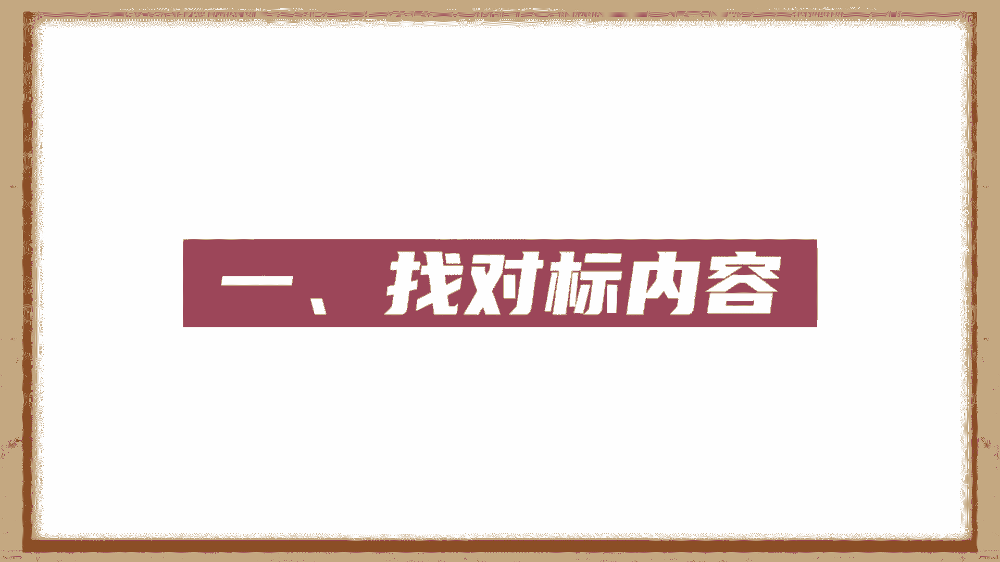

抖音搜索热点榜，点击观测，选择你的行业，找到最近七天涨粉最多的十个账号，然后搜索你行业的热点视频，点击低粉爆款视频榜，找到最近七天热门的低粉号。

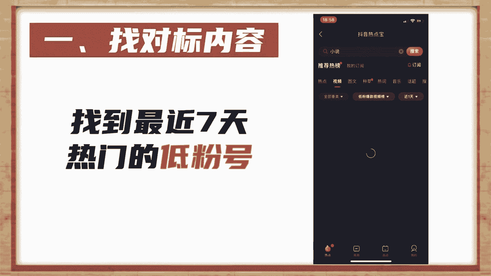

这才是找对标最正确的方法，也是最恶心的方法，二确定表现形式，这是需要把对标账号的所有视频看一遍，找一个你能模仿并且超越的表现形式，确定谁来拍，怎么拍，拍给谁看，我这里选择的是mg动画形式。

以此代替真人出镜，三超热门选题，从对标账号中找七个热门话题。

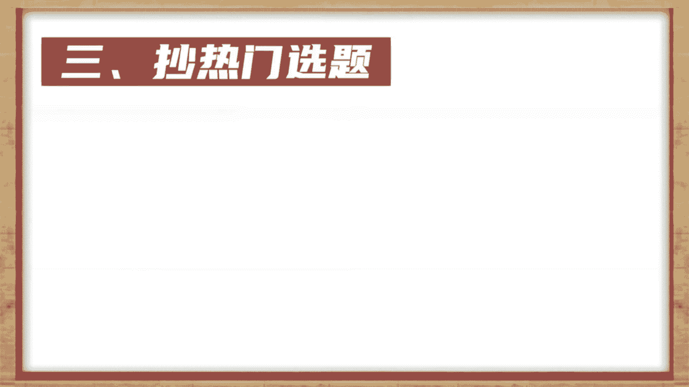

在抖音搜索热门话题内容，找到三个相关的视频。

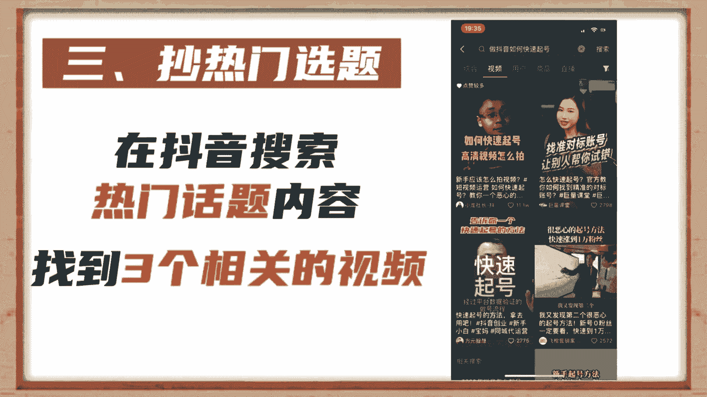

复制链接转化为文字，然后组成为一篇内容，用自己的理解进行表述，最终形成一篇原创热门文案，四测试爆款，通过定好的形式完成视频制作，每天定时发布一条视频，连续发布七天，不出意外，必有一条爆款。

因为一个新号一般会有三次上热门机会，期间可以购买抖加投达人相似加速测试，结果我复制爆款上热门之后，粉丝量会暴涨，然后就是复制爆款视频提高粉丝粘度，这时你就会神奇的发现，你发的视频再也不是三五百播放。

随随便便就是几千几万播放，这是我其中的一个账号，从抖音起号到开通中，视频计划用了三个月左右的时间，现在每天的收入都能稳定在600~1000，只要坚持下去，还是可以赚到一份不错的收益的，如果你也想做。

可以在下方评论区留言一个六，大家可以一起玩。

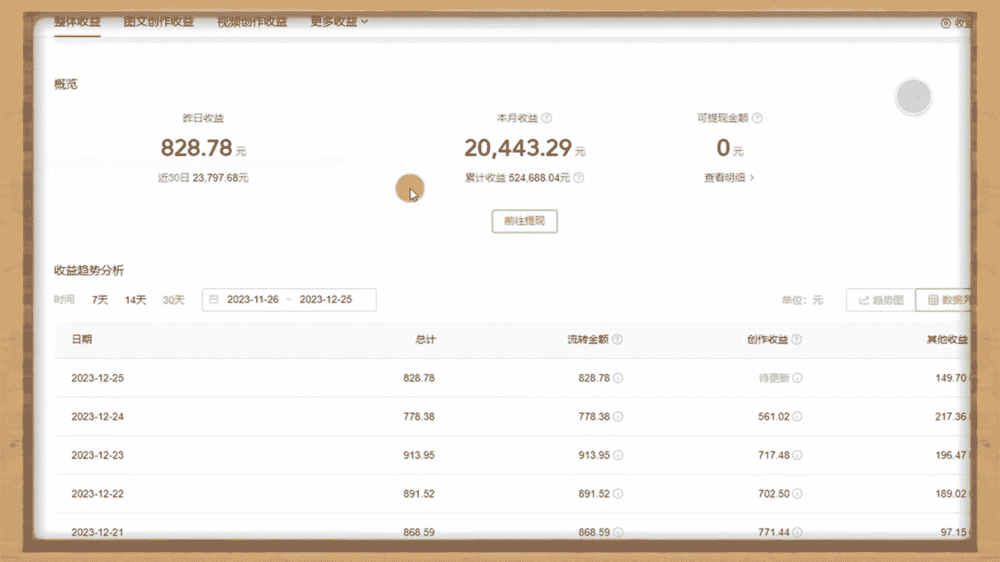

给你们揭秘一个爆款文案套路，各行各业谁用谁火，在这个内容为王的时代，运营者必须要具备一定的脚本创作能力，而想要拥有创作能力，我们首先要弄清楚什么是好文案，其实啊就一点记好了，要让对方认为与自己有关。

也就是所谓的引起共鸣，如果你说的我都不关心。

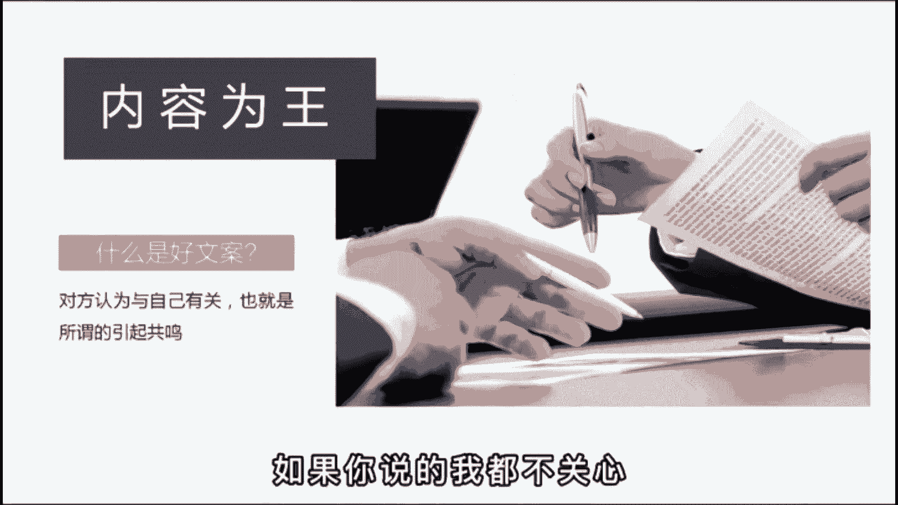

怎么可能会有人看呢，那到底是明白了要怎么做呢，给你一个万能公式，现象加危害加原因加解决办法，怎么理解呢，现象筛选用户关系与你有关，就会停留危害，负责放大情绪，不让你五秒划走原因引导继续观看，提高完播率。

最后呢给出解决办法，鼓励点赞，提升互动率，那举个例子来说，比如服装行业梨形身材的女孩儿太难买裤子了，挑错了样式显得腿又粗又短，但梨形身材呢是天生的，很难改变，而这三种裤子不仅显瘦，还显腿长。

穿上第二天就被小哥哥搭讪了，姐妹们赶快收藏起来吧，你看这段短文是不是完美契合了这个公式，开头一句话就把目标客户给锁定了，然后不断购入，他看完视频，有了这样的精准粉丝，后面变现起来也很容易。

我们再来个运营行业，每天啊用心制作短视频，但发完只有100播放，继续下去呢只是浪费时间，徒增焦虑，这跟你啊没有系统的运营底层逻辑有关，现在呢去看完我的前三条视频，不花一分钱也能学会运营知识。

还不快快行动起来，懂了吧，用好这个套路，不管什么行业往里套肯定没问题，都是不足30秒的短文案，后边派遣起来呀也轻松，尤其搞个矩阵什么的，效率会很快，但以上呢我已经举一反二了，至于反三就交给你了。

你可以根据你的行业特性，把你的思考过程发出来。

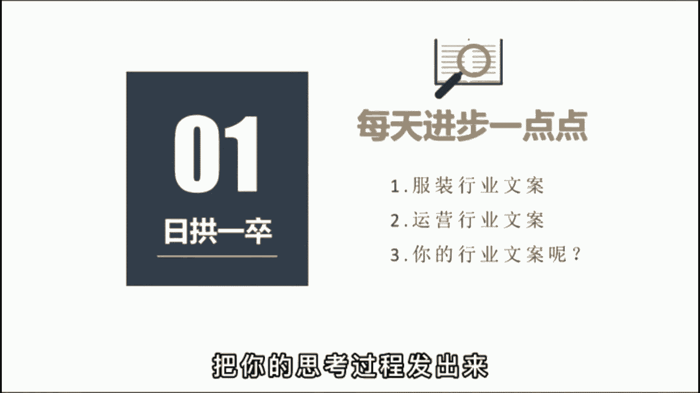

让我来帮你判断一下可行性，最近你是不是流量不太好，这是因为抖音的算法有了大幅变动。

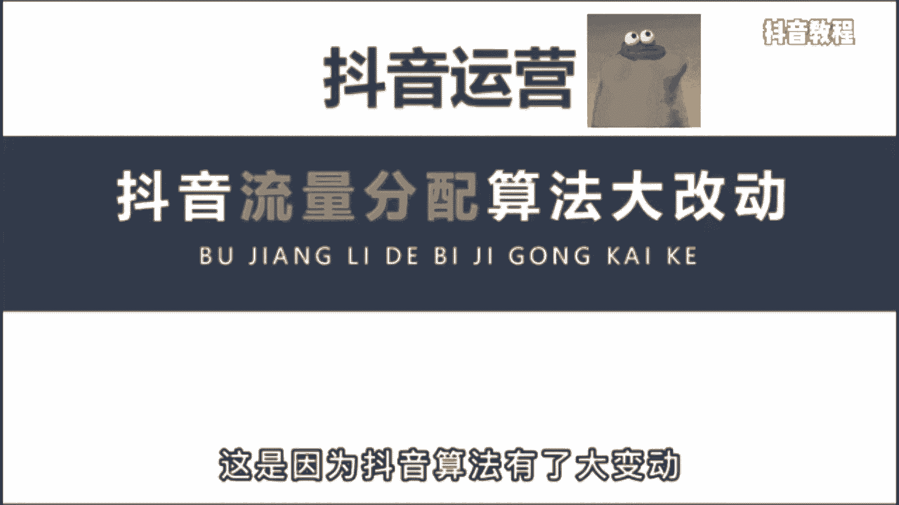

很多账号的流量都有严重的下滑，知名网红毛毛姐一夜掉粉80万，不过呢这对小博主来说，却是一次弯道超车的好机会，看到视频最后啊一定会对你有所帮助，那造成这个现象的主要原因是。

因为抖音的算法新增了一个铁粉机制，所谓铁粉就是长期支持你的粉丝，在以前我们只能看到粉丝的总数，这就导致强者恒强，粉丝多的人播放量就越多，哪怕就是拍一段毫无意义的吃水果，也会被吸引走几十上百万的流量。

这对普通人来说却是一种不公平，对平台来说你是不健康的，所以呢，这个铁粉系统就会从一定程度上打破这种局面，让流量的分配更加均衡，让真心做好内容的你能获得更多的流量推荐，无论大号呢是有几百万的粉丝。

在作品发布的初期，都会优先让他的铁粉观看评级，只有过了铁粉这关后，才会进行大范围的推荐，一般呢10万播放以内啊，铁粉播放要占到6~7成的比例，比如呢我是做运营教学的，我发现最近流量不太好。

也去发一些炫富博眼球的话题，老粉看到了就会不乐意，觉得我这个干货博主初心变了，所以流量呢也不见得会变好。

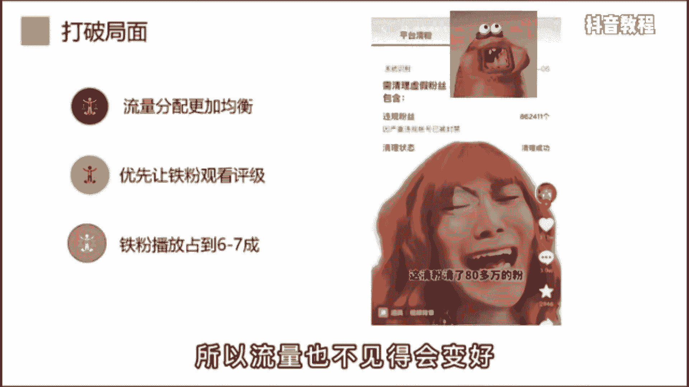

然后再说一下，为什么对中小博主来说是次机会，首先呀你要明白一个基本的概念，每一个行业赛道损失的体量是不一样的，你做娱乐号粉丝到1000万都有可能，但你做技能培训，比如开挖掘机最多啊，就是10万的体量。

原因呢有以下两点，第一是学习枯燥，看短视频啊，主要还是以消遣为主，第二呢是学挖掘机的人本来就少，所以呢当你看到一些人做教学视频，不要上来就怼人家，这么点粉丝还做教学，这是由平台的总用户体量来决定的。

不是所有的行业都能做到百万粉，也不是所有的百万粉的号都能健康的变现。

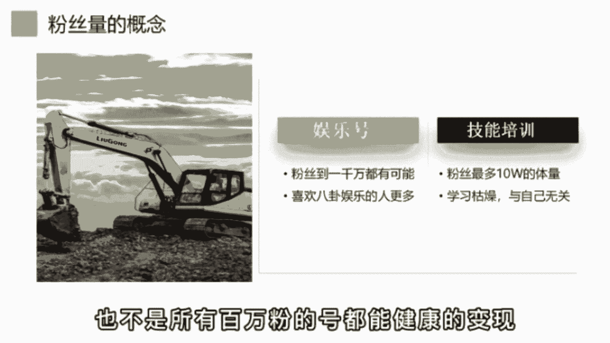

明白了这个后，我们再说机会是什么，之前啊，头部账号在各自的领域占据了大量的流量资源，随便水一篇都有几10万的播放，而平台呢在这个赛道的流量是固定的，这就导致新号的流量很不稳定，假设呢你是美妆赛道。

大家每天啊均分2000万的固定流量，大号每个人都拿走1/20，小号呢可不就剩点流量尾巴了吗，而想要破播放，也就只能发一些博眼球的话题，比如呢边唱歌边化妆，去想别的，像娱乐类的流量池，让行业啊不断的内卷。

而铁粉机制的出现，会让水视频的大号流量有所限制，不再单纯依靠粉丝数来分配，这样呢就会有更多的行业流量给到其他，认真做视频的账号，让平台的生态和价值导向更加健康。

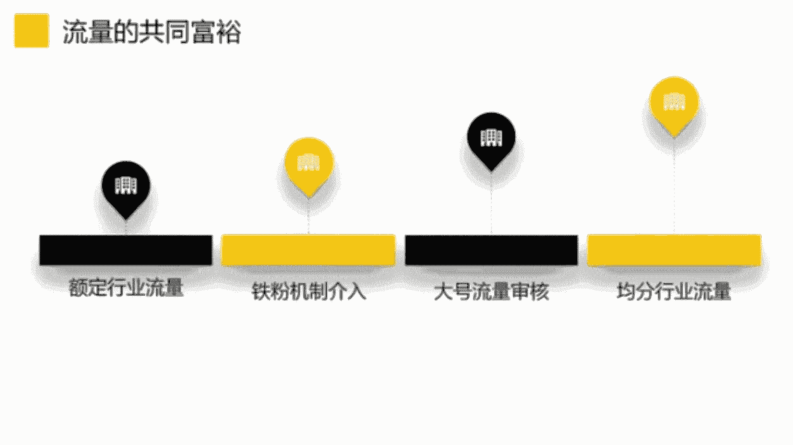

话题选不好，流量少一半，很多人啊觉得话题这个功能鸡肋没啥用，不重视，但我劝你啊，可别小看这个功能，这其中呢隐藏着大大的心机，用好了能够帮助新号快速完成的启动。

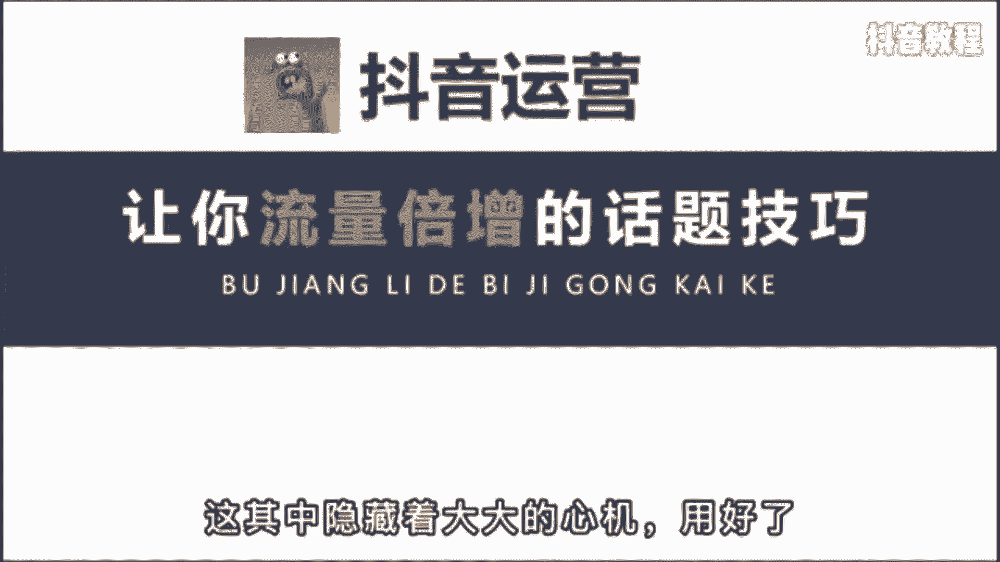

因为添加一个合适的话题，能够帮你带来更多的曝光机会和精准流量，一般来说啊，话题分为三类领域话题，内容话题和热点话题，领域话题用来覆盖行业大类内容，话题细分识别人群，热点话题就是蹭流量的话题。

选择的优先级与正确与否，决定着你的视频播放数据，举个例子来说，你是做萌宠吃播的账号，分别对应的话题啊，就是领域宠物日常内容，边牧吃播热点，宠物出道计划这个热点话题啊，有可能是时下热点。

也有可能呢是平台的流量扶持计划需要啊，你自己去找找，但是呢你可千万别看别人用什么，你就用什么，很可能啊那个热点已经过时了，具体方法呢就是登录电脑版的抖音服务中心，选择创作灵感，点击创作素材。

再点击热门话题就可以看到了，这里面都是时下热门的话题标签，你可以根据自己的行业来选择，比如刚才说的萌宠，你就可以选择动植物，排名第一的就是宠物出道计划，然后点击后边的发布视频，就可以自动打上该话题了。

那关于话题标签啊，另外还有两种情况，第一你是星号期则内容话题大于领域，话题大于热点话题，原理呢是让系统快速精准的知道，你究竟是干什么的，盲目的蹭热点，有可能啊会影响你的标签。

第二是老号破圈则领域话题大于热点，话题大于内容话题，原理呢是老号的流量比较稳定，需要突破领域的限制，破圈获得更多的流量推荐，但是呢就算学会了这个方法，你也不要指望一定能上热门。

任何的运营技巧都是锦上添花的操作，最重要的还是要打磨你的作品质量，不然呀就会像标题党一样虚有其表，会出现点开没两秒就立马关闭的情况，你还是涨不了粉好了，如果你还有其他的运营问题，可以在评论区向我提问。

我也正好看看之后讲什么好。

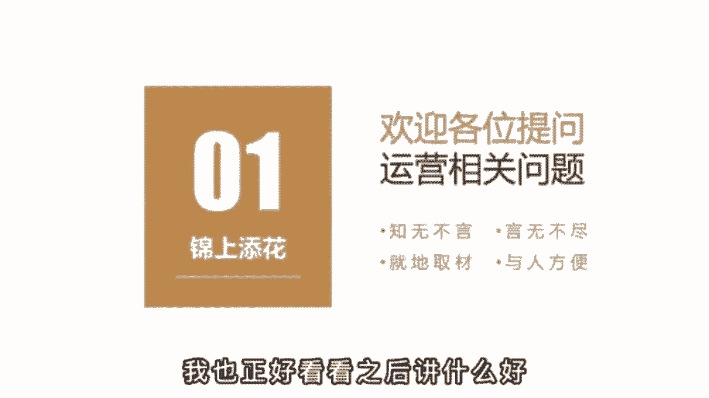

说啥也不做抖音了，做短视频最崩溃的就是写文案啊，群里有个伙伴刚做短视频一个月，说什么也不继续干了，天天写800字的文案稿。

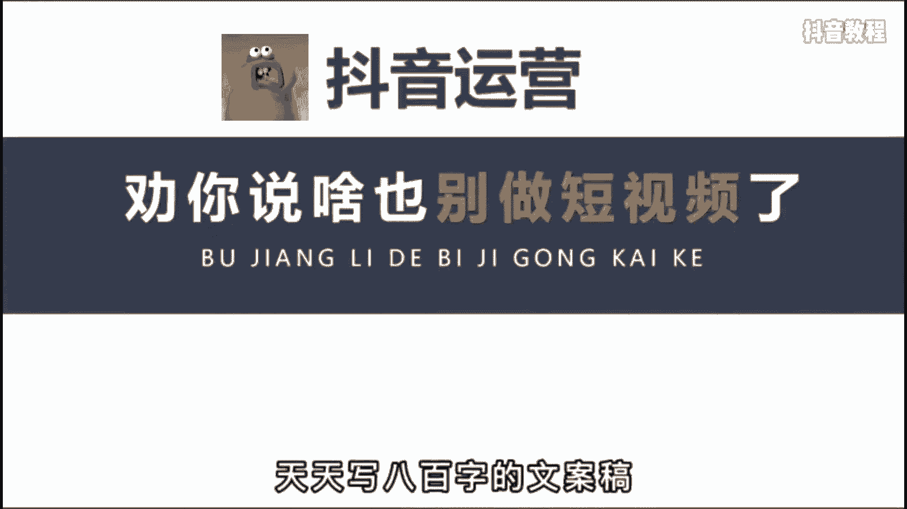

还没啥人看，说自己啊都快成精神病了，然后呢他就问我，有没有一种输出方式可以不这么累，在自己一个人做的时候呢，也能保持作品的数量和质量，我说啊有是有，但是手段呢有点不值啊，我是不太推荐的。

但是呢有一个大V就是靠这个办法，积累到了上千万的粉丝，这个办法是什么呢，其实啊用一句话就可以说明白，任何一个图文平台出现过的10万加内容，你都可以用短视频的形式再做一遍，什么意思呢，啊。

比如说啊你在朋友圈看到了一个10万加的文章，大家呢都在转发，说明啊，这篇文章已经被至少10万个人认同，而是能产生情绪共鸣的高质量内容啊，就比如说这个讲拼夕夕砍价的文章，普通人呢就是满腔的愤怒。

而觉得终于有人发声，给出了口恶气，然后呢你也想蹭这个热点，但是啊你自己说三言两语，肚子里就没货了，怎么办呢，哎你就去某号某乎啊，搜索相关的话题，你用口播的形式再拍一遍就好，要做其他领域呢也是一个道理啊。

比如说你觉得健身减肥是一个好的项目，赛道卖轻卡零食或者减肥代餐什么的，有搞头，但你是门外汉不懂，那这个呢还是用这个办法哎，你就去找爆款的文案，就这么讲，三个月看的多了，说的多了，粉丝呢也就900。

你呢也成了行业的专家，这个呢是第一个阶段，通过转换输出的方式来帮助自己快速起号，因为曾经火过的内容啊，已经可以再火，那第二个阶段呢就不能这么用了，万一让人发现啊，你都没有自己的观点，迟早口碑人设会崩溃。

那这时呢你就得学会结构化文案，把你的文案变得像完形填空一样简单啊，比如说我常用的一个结构，一提出一个精准人群的问题，第二给出具体的解决方案，第三给出实操的对标案例，你看这不就是填空吗。

当你第一阶段积累了一定的知识储备后，第二阶段就会很好做了啊，比如还是减肥这个问题，我能提出哪些问题呢，第一新手健身该怎么制定计划啊，减肥做什么运动最有效，少吃多餐对身体有没有影响。

然后啊你就按照1234给出具体的意见，再给出一个已经瘦身成功的案例来佐证观点，那这样一篇有理有据的原创作品就诞生了，那这个呢就是结构化思维的好处，很多人啊为什么做不起来账号，就是因为他肚子里没货。

没有办法持续的输出，然后呢还不愿意花时间去积累，只想速成，那想速成呢也行对吧，你付费向有经验的老师学习，他花时间花钱得到的经验，肯定呢是对你有帮助的啊，你做半年都想不通的点。

可能啊老师的一句话你就醒悟了，但有部分人啊，他自己的时间就不值钱，也不尊重别人的事情啊，我关注你，你就该为我免费解答，不然呢我就取关威胁，或者呢直接割韭菜言论，好像大家都该无偿帮助他似的。

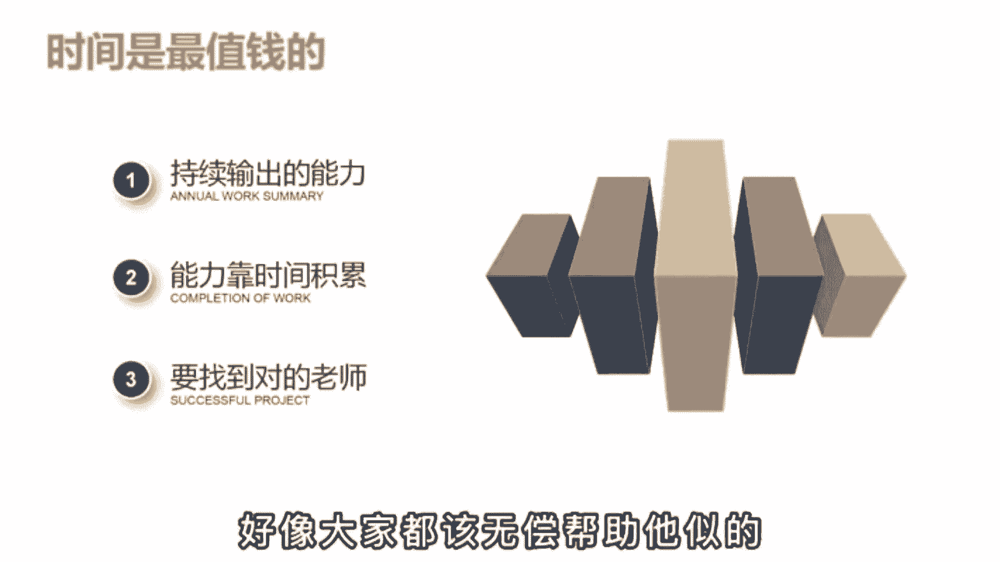

为什么同样的方法，你用的就是没效果，于是啊你开始怀疑自己的能力有问题，其实啊做短视频最重要的不是创意。

不是套路，也不是颜值，而是标准化的工作流程，这就跟宋丹丹的小品一样，把大象关进冰箱里，需要几步，需要三步，一把冰箱门打开，二把大象放进去，三把冰箱门关上，就这么简单，MCN机构拿到一个账号啊。

首先就是确定定位，你是做美食，美妆还是才艺，得有一个清晰的定位，确定了你的粉丝群体是哪类人，视频的展现形式是什么样的，未来如何进行变现等等，第二步在抖音里选择关键词，比如美食，点击右上角的筛选。

选择一周内最多点赞的作品，统计前30个热门作品，准备超选题，注意啊，抄选题和抄文案是有本质区别的，超选题抄的是趋势。

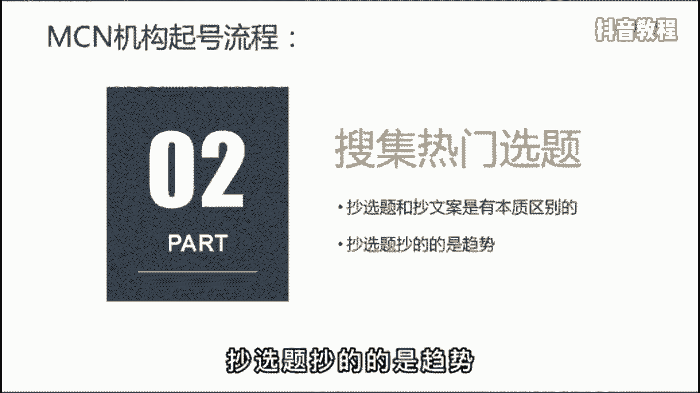

举个例子来说，假设啊你发现焦做年夜饭的视频很多，你就也可以选择年夜饭这个主题，比如挑战15天，学会为家人做顿年夜饭。

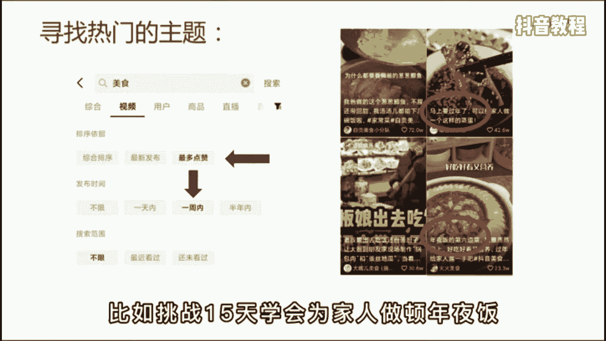

这就是一个不错的选题，第三步，打上账号标签，这是啊整个流程中最重要的，很多人啊做不起来账号就是因为没有打上标签，所以没有稳定的流量来源，MCN机构打标签方法很简单，就是透透件精心打磨10~15条作品。

每个作品投510天啊，投三个五天就能打上标签，起号成功，后面呢就是不继续追投，也会有稳定的基础播放，一般呢是5000到5万左右的播放，这个数据和粉丝的数量是没有关系的，那普通人没有那么多预算怎么办呢。

你就保证啊雷打不动的稳定更新就好了，至少啊一天一个作品先发上100条冷启动，只要内容能达到60分及格，一般啊两到三个月肯定能打上标签，很多人呢就是又穷又心急，明明还没发几个作品，一看不到500播放。

就急得满世界找老师，找婆婆放的技巧，其实啊谁做都一样，除非你有大号，已经混了个脸熟，那再起新号肯定快，不然呢就选择做时间的朋友或者投抖家吧，那判断账号打没打上标签啊，这里有个鉴别方法。

就是用另一个号去到你的主页，点击关注旁边的小三角，如果下面推荐的是领域相关的账号，就是打上了，如果是乱七八糟的人，就是没有学会后，赶紧去试试吧。

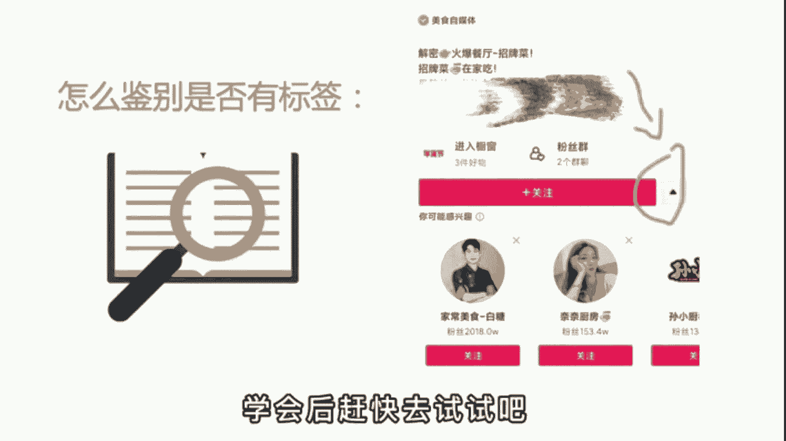

今天我要分享的是如何找到一个必火的话题，一个好的选题就是内容再差，也会有一定的流量，而如果你的干货都在中间啊，别人开头就划走了。

也没有意义，很多人啊都发出选题啊，不知道选择什么方向，但找选题这个事，其实呢，我们可以通过已经火过的内容来找到规律啊，比如说大蓝啊，你把他10万点赞的视频标题啊都扒下来。

就会直观的发现他的选题呢无外乎就这三点，大众话题反智内容与你有关啊，比如说七句话把房价的问题彻底说明白，房价问题呢永远是自带流量的，那属于啊刚才说的大众话题，而我要跟你彻底说明白。

唉这就是与你有关的范畴，这个选题呢同时的采购了两个要点，那它呀必然是一个优秀的选题，那最终数据呢点赞22万，评论1万，而反制内容呢则是指颠覆了大多数人的认知啊，比如为什么外国富豪喜欢捐光所有财富啊。

正常老百姓会想有那么多财富，不得飞机游艇挥霍起来吗，那为什么要捐了呢，这个呢就是吸引大家想要看下去的诱因啊。

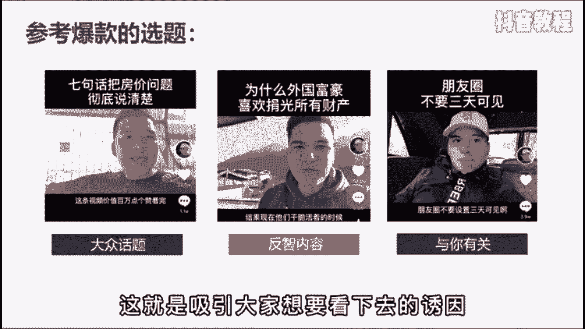

最终数据是157万，点赞6。2万的评论，那道理是明白了，怎么筛选匹配的话题呢，啊比如说你是做口播知识类账号的，今天呢同时有三个热点，拼多多6万人在线砍价不成功啊，长沙女子洗澡洗妇儿家没了，第三个。

恒大变卖了5000万资产续命，你会选择哪个选题来做呢，答案都可以，你今天去说拼多多有多恶心，点赞肯定是过万的爆款视频，在这里呢有一个基本的原则，就是在话题的选择上，大公司的话题大于小公司的话题。

国内民生话题大于国际的民生话题，富人翻车的话题大于穷人逆袭的话题，这个呢就是朴实无华的大众价值观，那在第二点上估计有人会反驳，而最近国际形势才是热门啊啊老李你说的不对，但这种事情呢是特殊事件。

而不具备参考意义，一般在正常的情况下，大家只会关心自己的生活，这个呢才是人性。

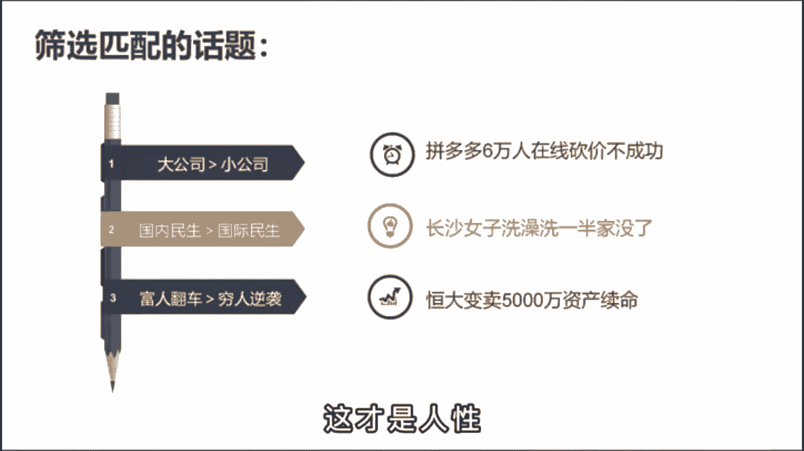

那无论你是做什么类型的账号，想要有流量，就不能过多的被自己的主观感受所影响，你的感受呢是没有流量的，大众关心的事儿才是流量密码，尤其啊在内容质量相差不大的情况下，想要战胜同领域的对手。

你就得依赖一个好的热点选题。

你现在做抖音流的泪都是定选题时，脑子里进的水，是不是想选题想得头都秃了，不知道明天该发啥，今天啊教你一套公式，一分钟帮你解决这个苦恼。

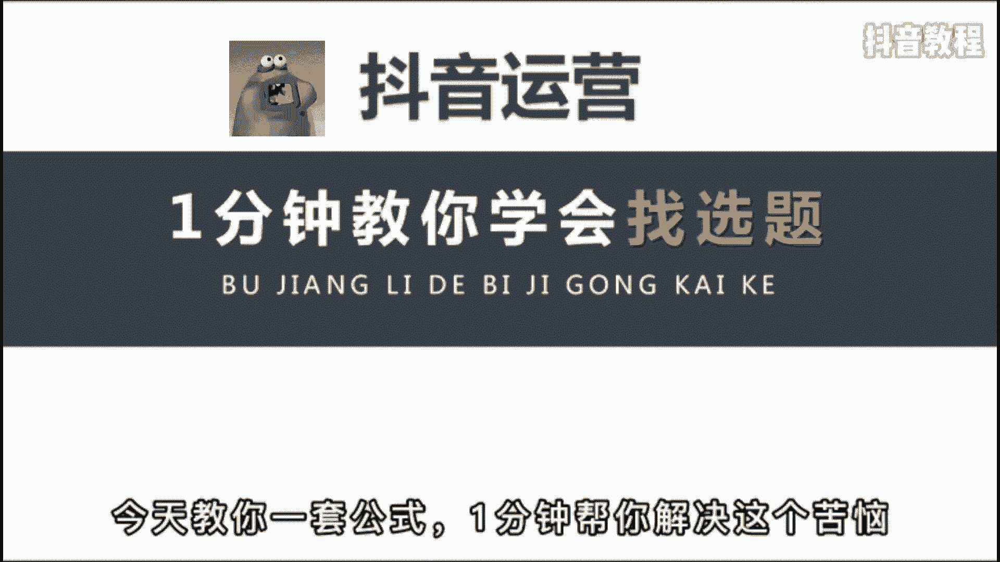

会找选题的人呀，他会有更多的时间去制作视频，每天发三条，一个月就是九条，靠堆量都能卷死，根本不需要透豆加，而且会做选题的人啊，能比你更精准的找到用户的痛点所在，也更容易得到精准粉丝的驻足观看。

从而快速打上账号标签，那有什么办法解决吗，当然有，这是一套啊，百万粉丝博主常用的选题技巧，为了方便理解，我把它总结成了一个公式，就是内容定位加用户痛点加借势热点，用好这个公式，你的内容啊一定不会跑偏。

比如你想和我一样做一个知识博主，就得去啊挖掘一些行业的关键词，想播放量，粉丝量，定位选题等等，这些都是关键词，没有任何的主观描述，然后呢在这个基础上去寻找用户的痛点，比如像便捷高效技巧教学内容输出。

最后去蹭近期的热点，把它们进行任意的组合就可以，那我们呀再把这个公式套在别的行业里再试试，比如美妆行业内容定位是美白除皱口红，用户痛点呢是平价好用，明星同款避坑扫雷，最后啊借势热点进行排列组合。

比如迪丽热巴同款美白面膜推荐七七千，万别送女朋友口红等等，那以上啊，我已经举一反二了，至于反三就交给你了，你可以根据你的行业特性，把你的思考过程发出来，让我来帮你判断一下可行性。

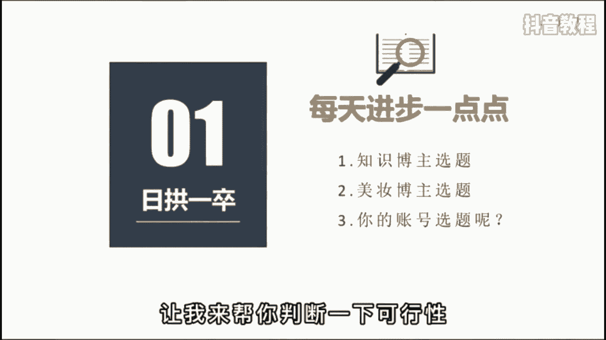

专业玩家是怎么偷豆家的，首先分三个阶段，第一个1000粉丝以内混搭投放在自然流，跑完后，先选择100智能推荐，选择点赞评论，跑完之后再选择五个对标账号，投100达人相似，那这里啊选择对标账号的标准就是。

最好是选短期内刚1万粉丝的这种，因为这种粉丝啊粘性不强，而且不在乎你是不是大号，所以呢对新号就很友好，而第一步先投100，智能推荐的原因是让系统啊给你美化一下数据，点赞评论多一些，大家才更愿意多看两眼。

这就是利用了心理上的从众心理，第二个3000粉丝以内定向投放，在视频自然流跑完后啊，直接选择投200个达人相似，同样选择短期内刚有1万多粉丝的这种，但到这里啊还没结束，你要根据自己的账号受众选择年龄。

性别地域等附加条件，比如呢你是家居好物，你就肯定啊要选女性，30~40岁左右，你要是同城号的话，再加个地域，这样呢能让你吸的粉丝更精准，加速打上标签，冲击1万粉丝，很多人啊都不告诉你这个秘密。

这些做课程的就是这样，那今天呢我都告诉你了，第三个1万粉丝以上智能投放，在视频自然流跑完后啊，选择一条播放表现最好的，投200的点赞评论，那这里啊不投达人，相似的原因是1万粉，基本啊账号都打上标签了。

你会有一个稳定的播放量，几千到几万不等，就是纯靠粉丝称，你也有1万的播放，所以此时呢破播放对你来说就不再是问题，投放的意义在于冲击热门，通过热门去增粉，而不是靠洗同行的粉。

所以这个阶段我的建议是可投可不投，你就专注打磨作品质量就行，但是如果啊你觉得某条作品自己很满意，是呕心沥血的佳作，肯定能上热门，但结果呢事与愿违了，你就可以啊投个抖加试试，让他参加个补考。

也许呢还有希望，那以上呢就是完整的投放策略了。

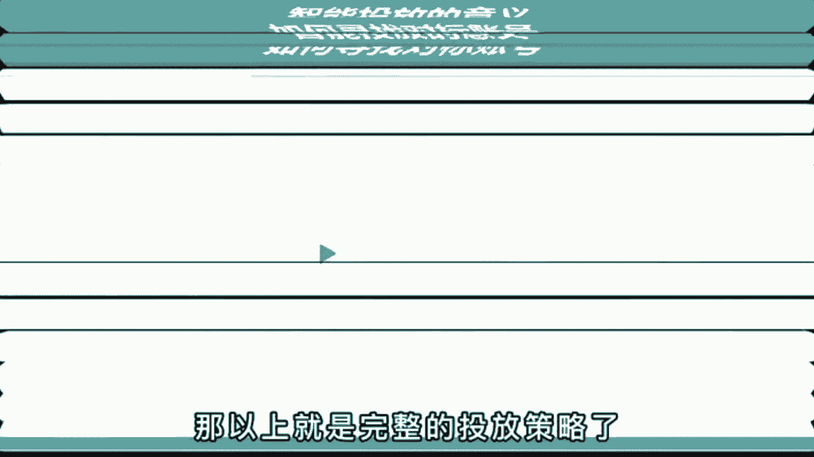

为什么很多人做短视频做不起来，给你分享一个终身受益的思维方式，平台思维只要拥有了这个意识以后，你做任何事情都不会失败。

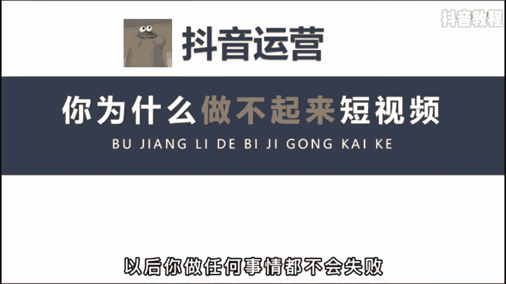

想象一下，如果你是平台，你要怎么做，才能让作者源源不断的为你去创造内容，你可能会想当然是要有收益了，给钱我们才干活。

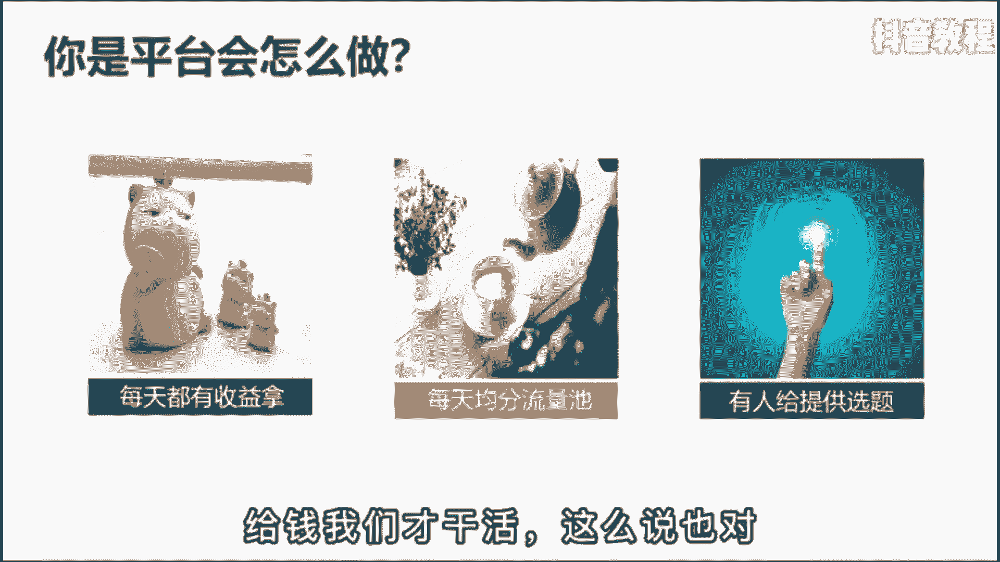

这么说也对，但严格来说是要有激励机制，平台呢就像是一个牌桌，我们的作品就是我们的手牌，每次发作品时摸到的都是不同的牌，虽然之前啊拿到的牌不太好，但是好在每次都有拿新牌的机会，这就是第一个要点，不确定性。

不确定性可以极大的激发一个人的热情，激发他心中好赌的欲望，刺激他源源不断的做下去，你要是说每天只要发作品就给你十块钱，一天封顶，发五个流量平均分配，那这样呢你就看不到优质的作品，大家都会变得麻木。

尽管每天都能捡到钱，很快平台就会灭亡。

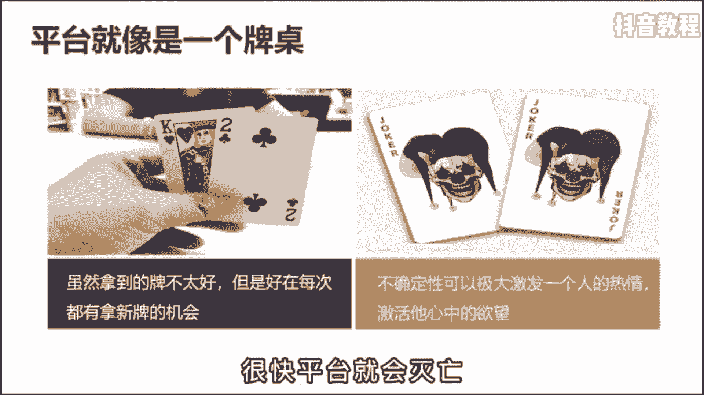

但反过来，如果平台给你不确定的奖励，只要发到一个关键作品，你就会直接山鸡变凤凰，流量爆炸，收益倍增，这个玩法才是最刺激的，让你根本舍不得下拍桌，因为你不知道未来会不会火，每当你快要放弃的时候。

平台就突然给你来一梭子，大家内容相同，质量差不多，但就是给你流量要多得多，让你满血复活，等你再次拥有了创作热情，不会离开牌桌的时候，平台就会再次用同样的方法刺激一下别人，这样每个人都会拼尽全力去创作。

你会认为是自己的努力得到了回报，是自己的内容战胜了别人，其实不然，第一名和第11名并没有那么大的差距，因为好坏是没有明确的界定标准，我可以让你火，也可以让他火，这才是平台真正的核心规则。

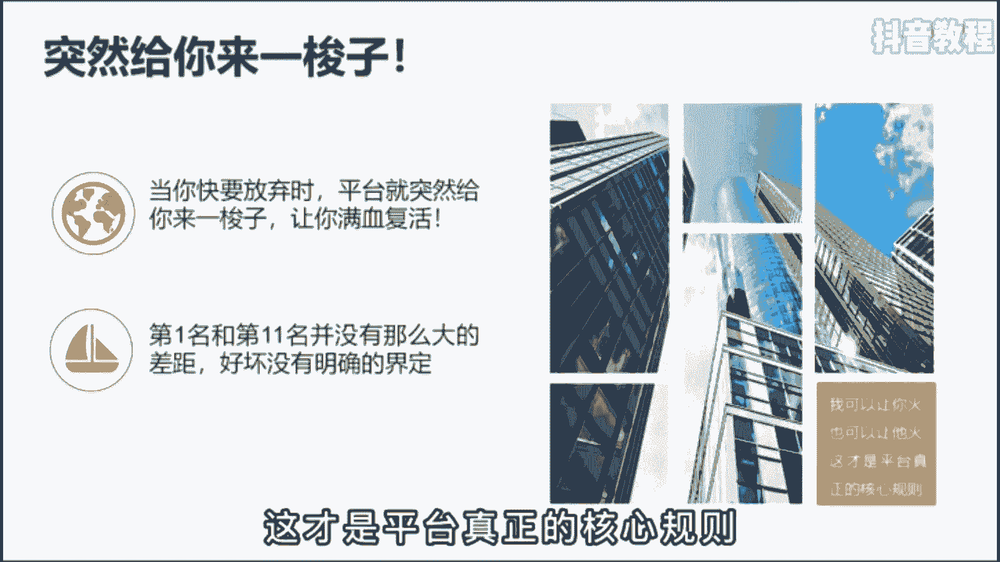

企图用最小的代价激发你最大的创作动力，那明白了这个道理，我再问你想要做起来短视频应该怎么办，答案是持续更新，因为它一定要给你奖励，否则你就会流失啊，这是平台不愿意看到的，所以当你更新的越多。

你离下一次的奖励就越近，哪怕是同样的质量，他一定会优先给你流量，让你鲜活，论视频表现里，我一个烂PPT都有人看，你还能不如我吗，可为什么还有这么多人放弃呢，因为他们目光太短浅，太功利了。

功利心太重的人生注定会是一场灾难，你不能克服自身的惰性，甚至没有足够的耐心，等到我视频的结尾，这样的人做任何事情都会一事无成，只是他们刚好选择做了短视频，目盲者贪利，心宅者耗功，你越是想要获利。

越是不想要吃亏，最后反而会失去更多机会，所以向有结果的人学习。

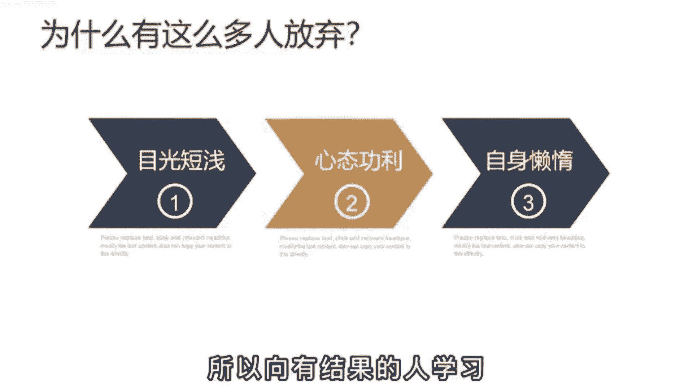

是你进步最快的方式，做好抖音最重要的核心是什么，大多数人都进入了一个误区，明明学习了很多课程，懂得了很多技巧，感觉自己就算没在新媒体行业做过，也算半只脚踏进来了，再怎么差，也比新人旗号快吧。

但结果呢往往事与愿违，最常见的现象就是视频卡500播放，甚至呀卡100，没有一个人点赞，投了抖家也无济于事，于是你的心态思路一团糟，去翻找各种知识博主，学习破播放的技巧，一个个的尝试。

哪怕是打开某种开关，这种鬼话你也信，也要去试试，因为你实在是没招了，那做抖音最重要的核心是什么呢，我认为不是变现，不是运营，而是你的兴趣，这就是道与术的区别，任何人在账号初期都是很难获得流量的。

你会有很长的一段低谷期，没有播放，没有点赞，没有一点粉丝，那这就是常态，平台每天啊有上百万个作品在发布，你就会被埋没在其中，除非啊你长得像沈腾一样人见人爱，或者像迪丽热巴一样花见花开，但没有播放呢。

不意味着你的作品不好，只是时机未到，我用影视号做过实验，同一个账号不投流的情况下，把曾经隐藏的作品再发出来，播放量一样会涨，要知道那些被隐藏的作品，是当初认为不太好的内容，那这个不太好呢是你自以为是的。

观众可不这么想，所以呢你需要做的就是雷打不动的保持更新，用三个月100条视频告诉平台，你是谁，你能给用户带来什么样的价值，等你打上标签，自然啊会获得稳定的流量，哪怕你吃个苹果，也有几千上万的播放。

可是要怎么坚持更新呢，那就是寻找你的兴趣点，因为只有热爱才能让你坚持下去，当你热爱旅行，哪怕要经受路途的颠簸，阳光的暴晒也依然不会迁徙，当你热爱跳舞，哪怕是要遭受无尽的训练，承受拉筋压腿之苦。

你也不会退却，原因啊，全都是因为热爱，当你热爱一件事情的时候，你所面对的困难都不会再是困难，哪怕是真有障碍，它也只会让你坚定内心的信念，但如果你实在是不知道自己喜欢什么。

你可以在我往期的视频里找一找答案，我做了20多个抖音项目拆解，对他们从定位，内容运营变现等角度进行了详细的剖析，相信啊总有一款是适合你的，那什么样的内容才会被推荐，才值得投放抖家来撬动更大的流量呢。

上一节视频啊已经给出了答案，但是这个答案没有实际做过账号的小白，根本无法实际理解，有些东西啊只有经历过才会懂，这就和学开车一样，你嘴上说的头头是道，但一让你上路就手忙脚乱，这就是没有实操的原因。

所以这期视频呢我会给你一套打分的标准，哪怕没有经验，靠这套算分值的方式，也能判断自己的内容是不是优质，到底应该优化哪里，这个打分标准分为内功和外功两个部分，首先外功啊看的是这三点，画面观感剪辑节奏。

叙事逻辑总体呢是40分，画面观感啊属于比较基础的要求，你的画面字体颜色，配乐等搭配也让人感觉舒服协调，清晰度呢保证720P以上，其中啊影响观感最重要的因素就是光线的利用，在拍口播类短视频时。

常常需要通过打光来让人物和主体进行分离，其主体很清晰，背景很暗，那这种光应该怎么打呢，啊就像这张图这样，只需要三盏灯就可以做到，然后呢是剪辑的节奏，什么跳切啊，离切啊啊这些专业名词我就不科普了。

只要你是做出境类的，我都强烈建议你看看静静香这个账号，他的整个剪辑节奏的把控，镜头的切换，每三秒的一个反转，抛开剧情都能牢牢的锁住你的眼球，你直接啊去看视频去了解吧，那最后一个呢是叙事的逻辑。

这个呀是很多新手不太容易掌握的地方，短视频呢它不像聊天那么随意，你必须三秒内就抓住注意力，不然呀后边就是再精彩也没有用，那我这里呢给大家一个我自己用的方法论，第一个开头抛出问题加123解答加结尾总结。

或者呢开头抛出问题加讲述自己的经历加结尾，升华时间呢控制在一分钟左右，这样调理就会比较清晰，没有废话，每一句都是重点，接着说内功有运营能力，内容价值差异化，这三点总分呢是60分。

那为什么会比外公高20分呢。

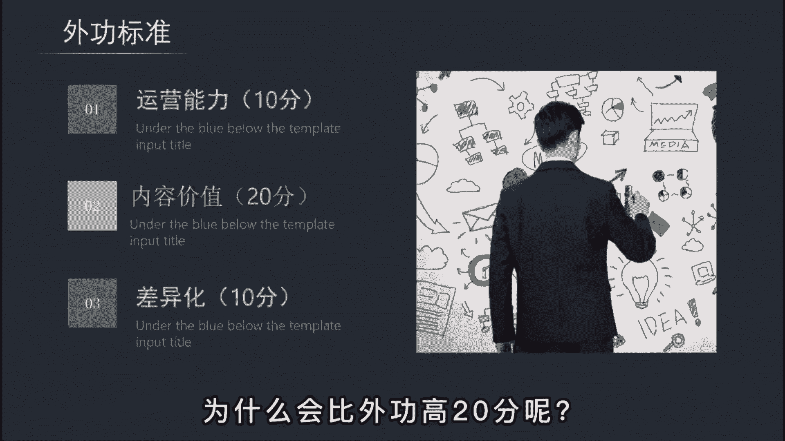

因为啊内容的价值远比技术重要得多，普通人啊一听到运营就感觉啊这东西好专业啊，自己弄不来，其实呢没必要把运营想的那么高级，我用人话给你解释一下，就是解决一类人群的核心需求，让他带着疑问看完你的视频。

可以尽可能的提高完播率，最后呢还能得到他想要的答案，这就是运营的工作，就比如我这条视频，你想想自己为什么要看到这里，在期待什么，第二个呢是内容价值，本质上就能够对用户产生影响的内容。

那这个呢比较难说清楚，不过啊这些内容普遍都有一些这样的特点，引我思考，引我发笑，与我激励，教我新知，按照这个标准，你可以对比一下自己的作品有没有做到，最后一个呢就是差异化，这里啊有个小技巧。

比如说你想做一个萌宠号，那就画一个九宫格出来，把所有你个人的爱好写上去。

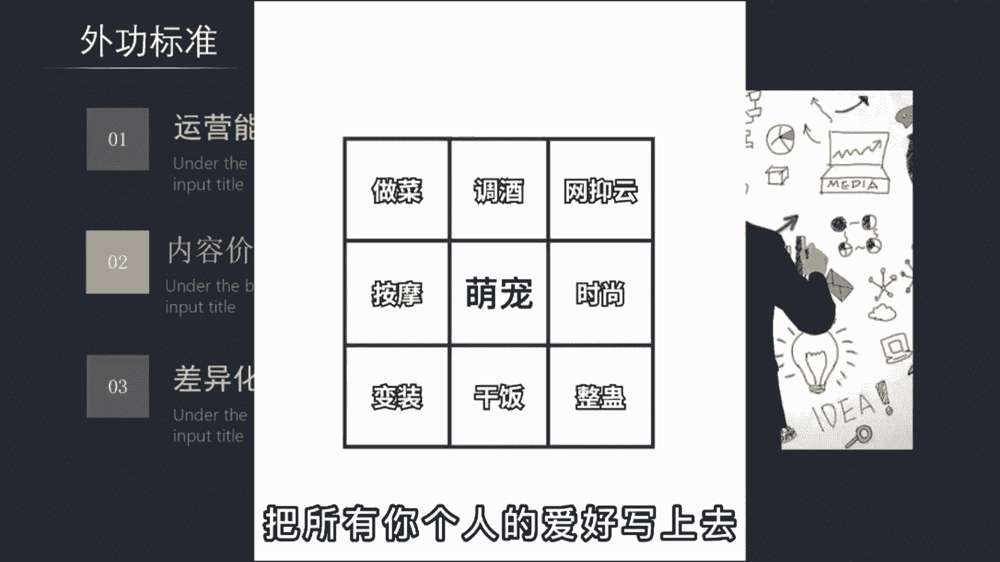

任意的选择两到三个点，这样呢就会出现一个差异化的创意，比如他就是用这个方法，最终变成了一个1300多万粉丝的账号，因为啊猫咪会做饭实在太稀奇了，通过这个评判标准，你可以看看自己的作品能打几分。

综合达到60分呢，为及格，可以正常的发布80分以上呢为优质视频。

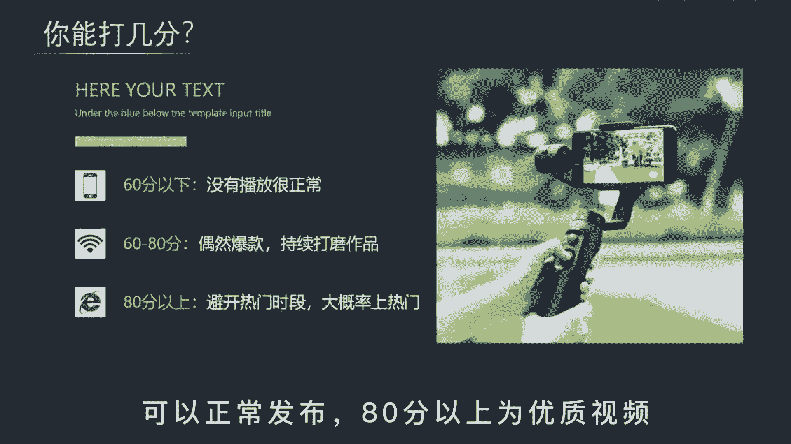

适合投抖加，然后呢持续日更就罢了，因为大多数人啊最擅长的就是放弃别人呀，还在对标优质内容，但你有了这个标准就可以对标生产队的驴了，送你一句话，成功的道路并不拥挤，只是能坚持的人太少了，小白做短视频。

从开始到放弃啊，都是卡在了，不知道如何起号上不知道怎么打标签啊，就一直啊这么稀里糊涂的做着。

直到呀放弃的那天，但其实呢做短视频新号起步是不需要原创的，也没必要原创，在这里呢不是说让大家去抄啊，他不是这个意思，而是说你是小团队运作，或者呢个人在做账号，时间精力经济成本都非常的有限。

你花费太多的时间在原创上，费劲巴拉的做出一个作品，那由于呢你对短视频的内容感知还不足，所以呢很可能怎么发都没有播放，会长时间的陷入到一个自我怀疑当中，就很容易放弃，所以呢新手啊在做短裙的第一步。

就是要学会如何低成本的气候，我呢把它总结为了三个阶段，第一步低成本起号打标签，第二步验证变现模型，第三步原创做个人IP up，我一个个给大家解释一下，那为了方便理解呢，我就用中视频来举例。

比如做户外美食的账号，一般人都会想着说自己去采购食材，然后呢找个地方去拍做饭，那想法呢是挺美好，但实际做过呀，你就会知道这个人力物力都是消耗不起的，在二线城市，三个人的小团队，各种花销加在一起。

一个月就得3万，那怎么办呢，这事啊就去油管去搬就好了，上面呢有好多优秀的博主也在发美食，他的画面声音场景跟你自己比起来，只有过之而无不及，哎你直接发就好，三个人呢一天剪个60条还不过分吧，又不用你写完。

就这么坚持发一个月啊。

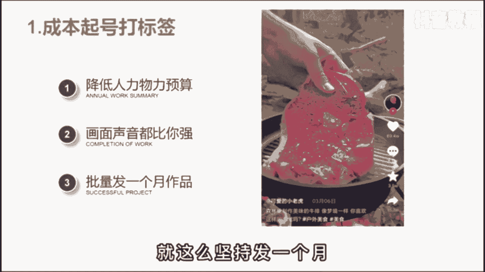

基本上啊有的号就能打上标签了，然后第二步全力去测试变现模型，最简单的呢，就是根据发的作品来找到合适的商品去带货，然后呢还有星通广告啊，比如说会有一些厨房用品的商家来找你合作，那第三个呢就是做培训啊。

你就算起号的概率只有2%，十六十个作品就是12个号，那这个粉丝加起来至少都有几百万了，在一个月的时间同时能起12个账号，而累计几百万的粉丝，在外人看来是一件很恐怖的事情，想入行的人呢都会想要跟你学习。

但是呢只有你自己才知道是近战的概率问题，第三步，当你的变现模式跑通之后，就来到了原创环节啊，你不能一直靠这种玩法吃一辈子，得为了以后的长远来打算，不然呢像有些广告要把产品植入到视频里面，都是搬的。

肯定做不到，就会啊错失很多的机会，所以这个阶段你就按照之前的视频风格，去搭建一模一样的场景啊，比如做的是野外烧烤，你就去找个什么风景秀丽的地方，在一个小河边堆个吹火啊，连他拍摄用的相机你都买同款的。

争取啊，完成一比一的复制，那到了这里呢，你之后再去参加个什么地方的直播活动，就可以直接拿着十几个账号去参加活动，是补贴了，那这套起号流程呢啊你不只是在做视频，你做任何的赛道都可以借鉴，比如这个口播领域。

无论是做美妆健身育儿都行的痛苦啊，你就把别人有结果的视频换个角度直接翻拍啊，一天拍个30条，怎么都起来做短视频啊，和这个创业一样啊，你不要觉得说很简单，是个人都能做，它就是个概率游戏。

学会去堆料来打破概率的限制，这个呢才是做短视频正确的玩法。

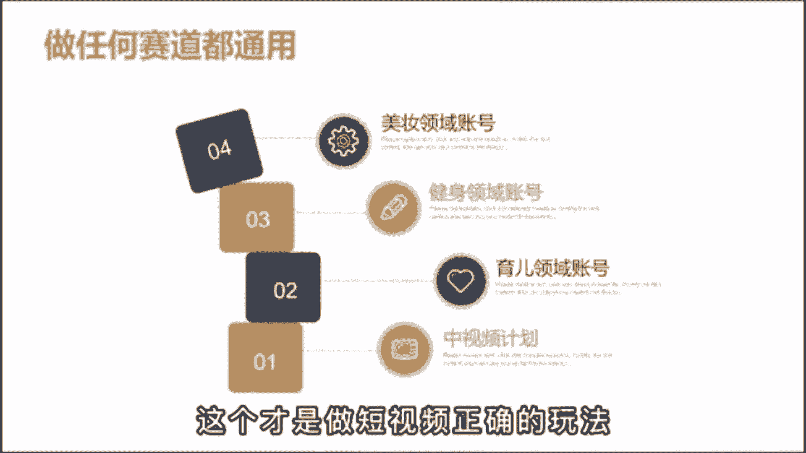

我也知道好内容才会被推荐，但到底什么才是好内容，这个也太抽象了，有没有什么办法能把抽象的价值，变成可视化的短视频语言呢。

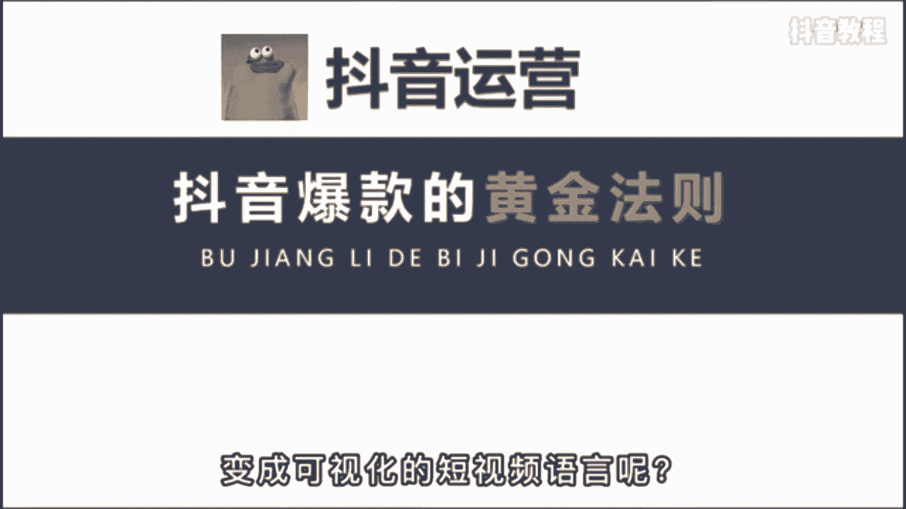

还真有教你一个公式，爆炒虎头，什锦猪肚，红烧爆肚，什么意思呢，有句话叫客户买的不是产品，而是感觉。

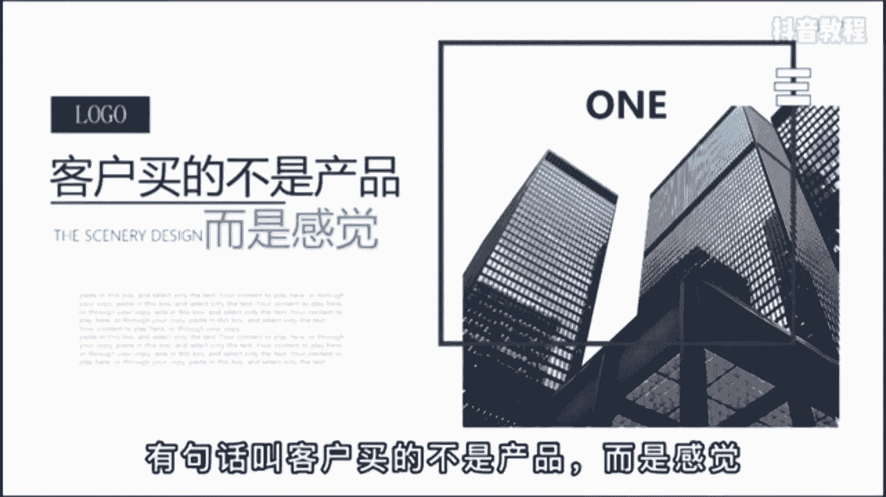

爆炒虎头，就是说开头的五秒要开的精彩，像虎头般斑斓夺目。

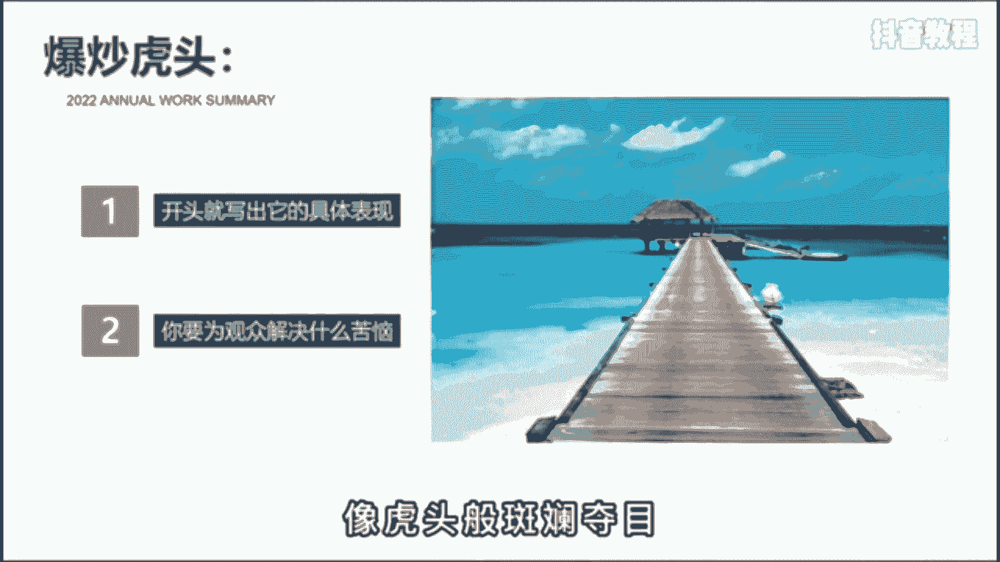

比如这样，那一天上海感受到了被吞噬的恐惧，夜空中出现了一张血盆大口。

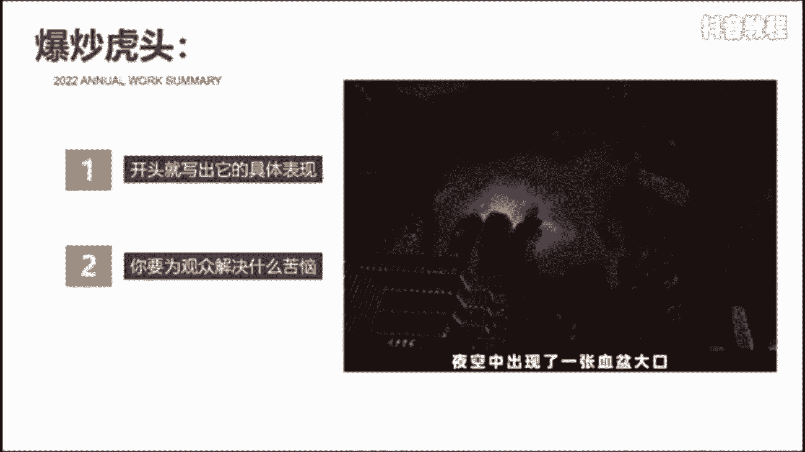

钢筋森林都被他吸进嘴里，开头就写出他的具体表现，而不是给大家推荐一部高分末日电影，再或者这样，有人说来上海旅游没什么好玩的，那可能是你的打开方式不太对，作为10年的老沪漂，我想送你今天这份上海旅行攻略。

写出你要为观众解决什么苦恼，而不是我给大家分享三个上海的景点，什锦猪肚呢则是内容要像猪肚那样饱满丰富，包括画面的切换也要符合情绪的递进。

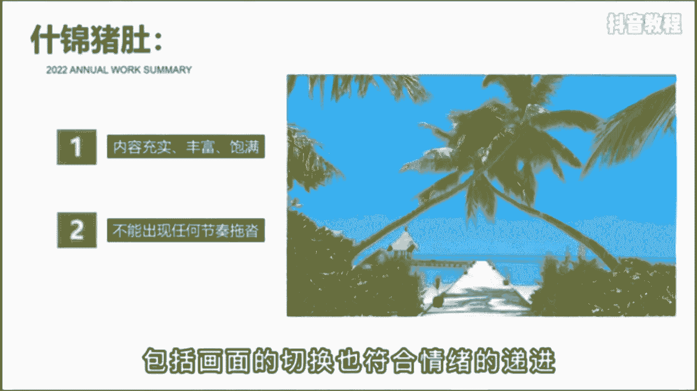

比如这样，然而啊过了一天个股股市呢又普遍的回血。

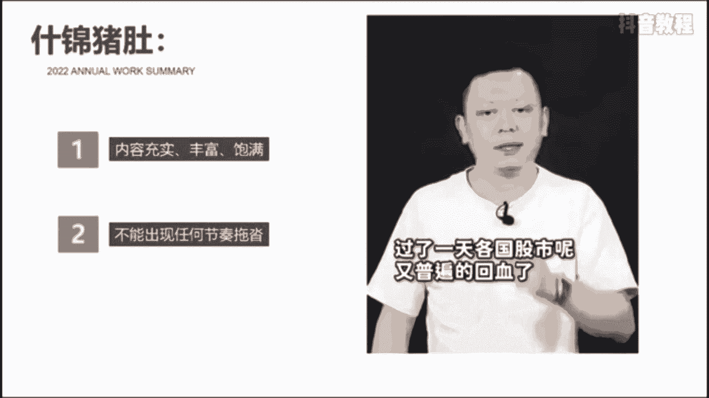

那问题就来了，接下来这场仗，对全球的经济到底会有什么样的影响呢。

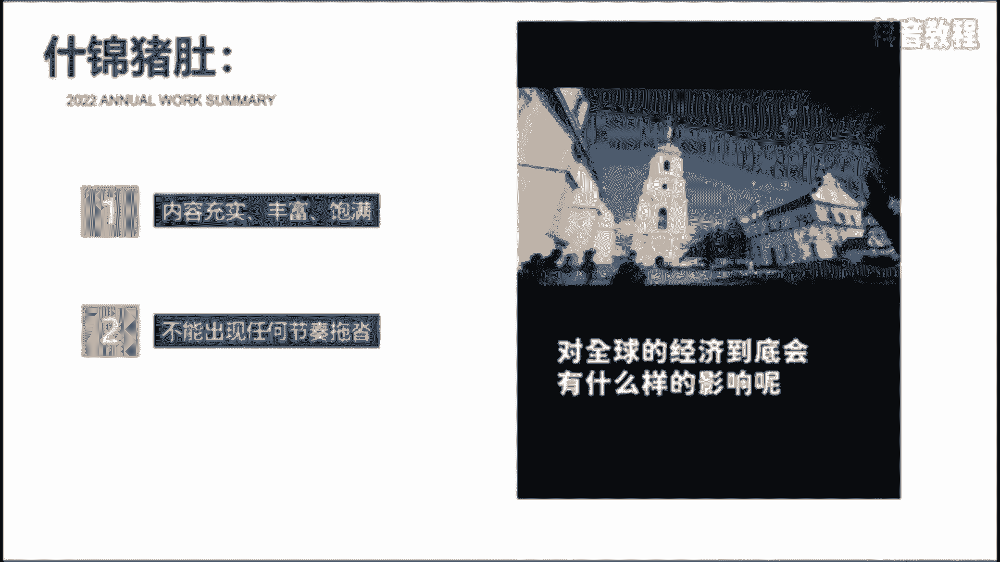

内容充实丰富饱满，一定不能出现任何的节奏拖沓，华而不实的内容，红烧豹尾则是指豹子般意味深长的结尾，用最简短有力。

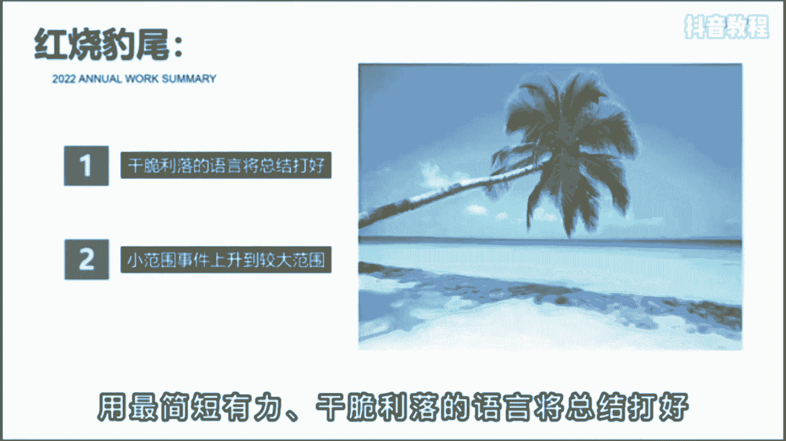

干脆利落的语言将总结打好，比如这个屏幕前的你看完会不会食欲大增呢。

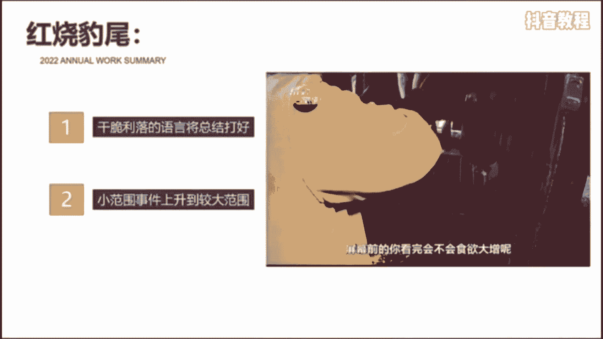

反正我能多干两碗米饭，用一句反问来提高评论互动数据。

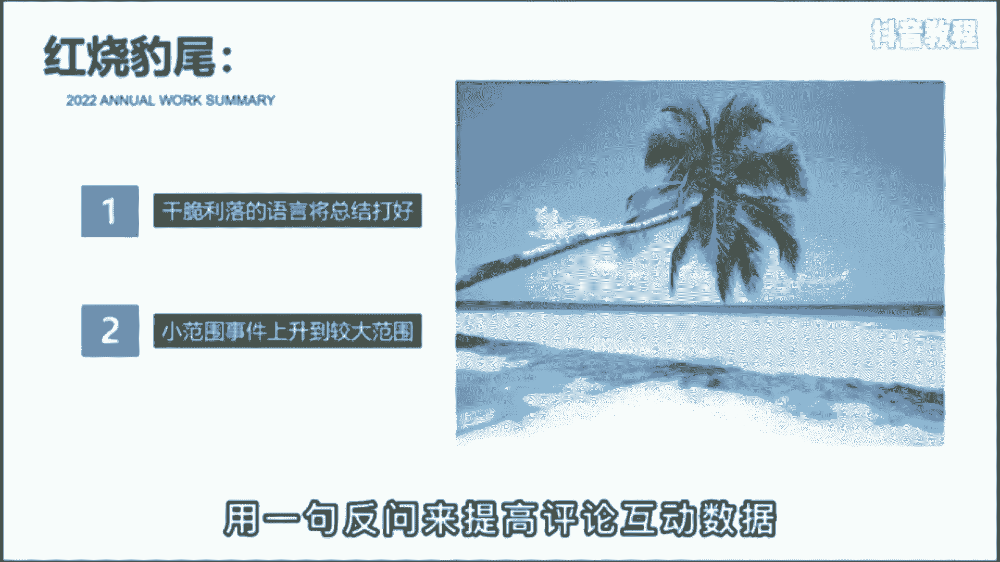

再比如这样吞下了委屈，喂大了格局，改变不了别人就改变自己。

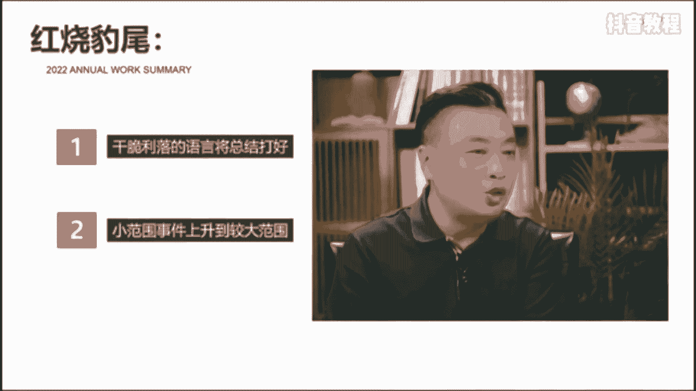

把前面写的小范围事件上升到较大的范围，从而升华视频的主题。

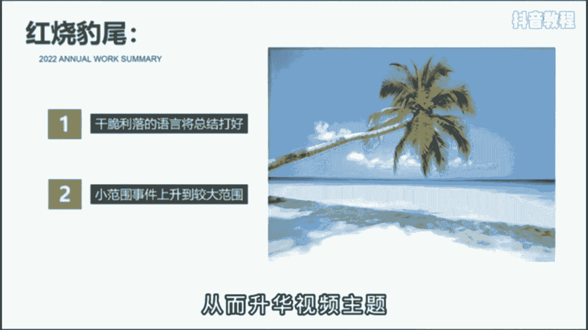

明白了这个故事后，你再问问自己，你的内容真的优质吗，是不是开头不够细节，内容节奏拖沓，让人看不到最后，而结尾呢就一句，我们下期再见，这就是你投抖加没效果的核心原因。

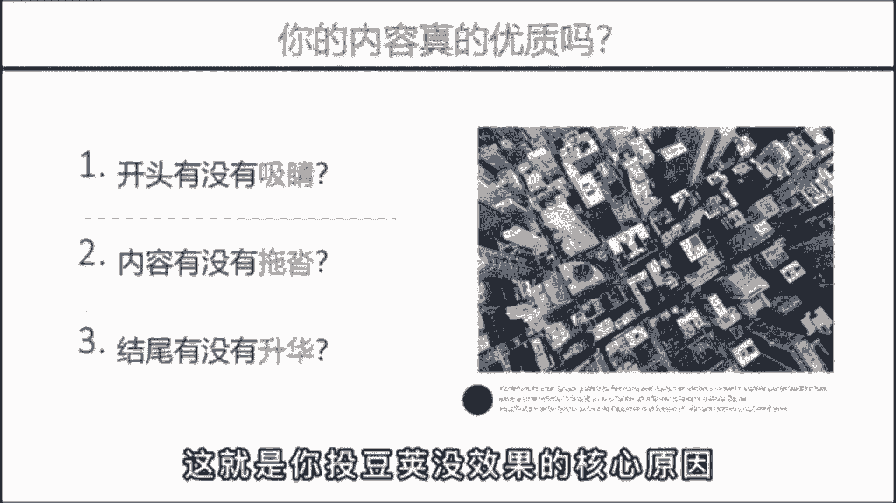

不是平台想收钱，而是你不充钱。