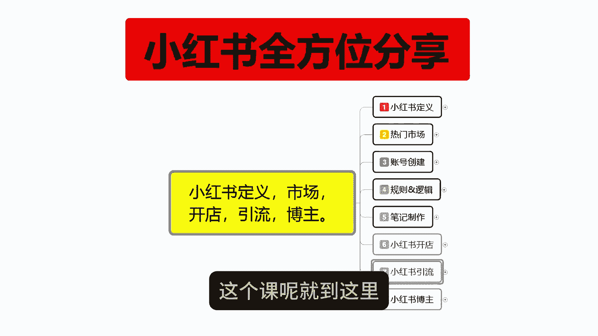

# 【自学小红书运营】2024B站最新的小红书运营课程，小红书运营大佬专为为学渣研制的小红书开店、小红书起号零基础保姆级教程，白嫖党必备！ - P1 - 淘宝运营小助手 - BV1LmbyeDEC6

大家好，今天给大家分享的是小红书，全方位的一个整体分享，这一整期的课程呢包括小红书的一个定义，市场开店引流博主这五个方面的一个讲解，定义呢就是说了解小红书他具体是做什么的。

他有一些什么样的一个呃市场和所熟悉，我们进行分享的一个整体内容，第二个呢是市场，市场的话，就说小红书目前的一个热门市场，比较适合做什么样的一个产品宣传，和一个交流沟通的一个方式，后面呢是开店引流博主。

这个呢是小红书，我们在小红书上面进行变现转换的一种方式，就是说他这个里面的话，包括在小红书上面直接进行开店卖产品，第二个呢是做引流，把小红书的一个用户的话，转到我们自己的一个交流群上面。

然后宣传我们自己的一个产品，第三个呢是网络博主，网络博主的话，小红书的网络博主，和其他的网络博主有一定的区别，因为他的话操作稍微额对比抖音啊之类的，其他推广平台会简单很多。

这个呢就是这一期要给大家进行整体分享的，一整套内容，五个分为八个大课时，第一课呢是给大家讲解小红书的一个整体定义，第二个呢是热门市场，第三个呢是账号创建应用小红书的一个账号，创建账号的一个整体创建的话。

如果说我们前期没有规划好，包括中后期的话呃，你再去调整账号的一个属性的话，会比较麻烦，第四个呢是小红书，它整体的话运营的一个规则和运呃，推荐的一个流量逻辑，第五个呢是教大家怎么去在小红书上面。

把笔记制作好啊，这个是最重点的一个核心，你不管是开店引流，或者说做博主，以笔记制作的一个方式，如果说不了解的话，那这三个方向你都做不了，你了解市场的一个定义和市场的一个热门商品，你了解完。

你如果说不会做笔记的话，你后续的内容你也做不出来，第六课呢是给大家分享，小红书开店整体的一个运营思路，第七个呢是引流，第八个呢是博主就说，我会按照这一套整个流程去给大家进行一个，完整的分享。

这一节呢只是说给大家介绍一下，我后续分享所有内容的一个大纲，让大家了解一下，如果说你们对里面某一一个范围的内容，感兴趣的话，可以自己去往后面观看，因为的话你如果说做开店，做引流，做博主的话。

他们都是分开来操作的，但是你前面那几个的话，前面五条啊，就是五个大课时的话，额你是了解整个小红书的一个动态，你只有了解小红书的动态以后的，你才能去做开店引流，或者说是博主三个额转变流量的一个方式。

就是变现，你只有了解这前面五个点了以后，你才能去做678这三个点，不然的话你光怎么说呢，就说你上来直接小红书上面，我说小红书上面我想去开个店，然后的话其他我不了解，我只需要把产品放上去，那肯定也不行。

你做引流也是一样，做博主也是一样，你如果说不了解整个小红书的一个，操作逻辑的话，我们后续也是没有办法去操作的，那从下一节课开始呢，我会从第一节小红书的定义给大家进行分享啊。

他整个的话就是一套系统性的一个课程分享，在这一节呢给大家介绍一下大纲。

