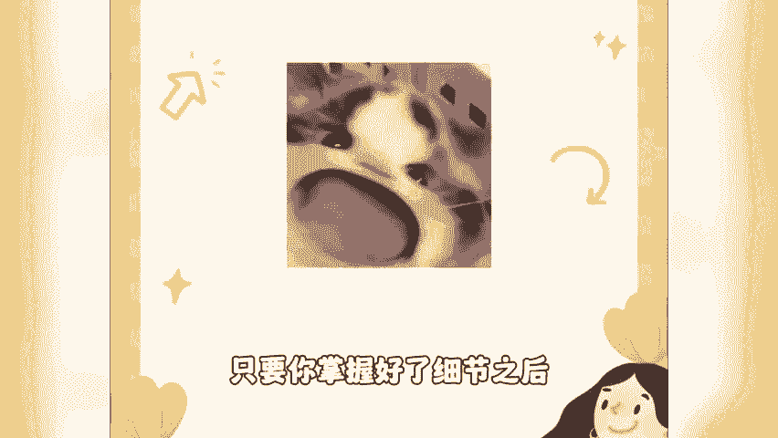
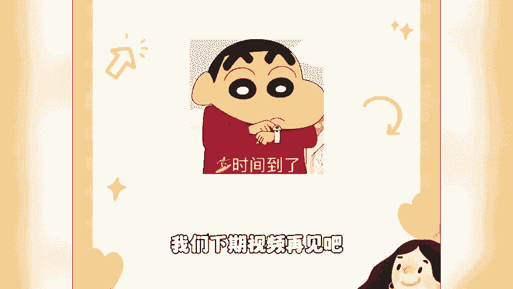

# 【视频号起号教程】微信视频号新玩法，抓住当下这波风口，打造月入10w的自媒体账号！ - P1 - 视频号运营2 - BV1XS2gYGER4

有好日子，我们一起过视频号如何快速的起好。我给你讲一个惊人的数据，就你按照我这个方法去做啊，获得视频号的推荐流量真的是非常的简单。那我在讲这个方法之前呢，我先讲一下视频号它的底层的一个推荐的算法。

因为只有你懂了这个底层推荐的一个逻辑，你才能够更好的运用这个方法，这个推荐算法呢，如果说你到外面去进行学习，至少是上万块钱的一个东西。那视频号到底是根据你的什么来给你推荐流量的呢。

首先第一个就是你必须要搞清楚，就我们发布页面的这么几个点。我们发布的时候，视频的本身的一个内容里面重复出现了这些关键词包括视频的描述，以及我们艾特的话题，还有我们的地点，还有我们的这个短标题。

那我们视频号最初的一个流量，就是按照这几个点去给你推荐的那如果说你在发布的时候，你填写的不准确，或者说。你直接就是乱填写的。那么你的第一波初始的一个推荐的流量就不精准。那如果说你第一波的流量不精准的话。

你的数据反馈就会不好。那后面的一个推荐流量就会越来越少。那接着我们重点就来了啊，那么我们有了第一波的推荐流量之后，后面是怎么再给我们持续的推荐流量呢？不知道你们有没有发现这么几个点了。

就视频号里面有没有关注到这么几个按钮，第一个呢是我们私密的点赞，第二个是转发，第三个是爱心，那第四个呢是一个评论，你可能有看到这几个按钮，但是你可能呢就没有去好好的去思考它背后的一个逻辑。

那么几个按钮背后的一个逻辑，我就给你好好的解析一下。首先第一个点赞的一个按钮，这个代表呢是一个私密点赞。这个点赞是只有你自己能看见别人看不见。你按了这个按钮之后呢，系统还会给你推送类似的一些内容。

第二个呢是转发的一个按钮，你仔细想一下，什么样的内。内容你会愿意转发给你的朋友或者说是你的家人呢，甚至是啊，你转发给你的领导，是不是跟你有同类型爱好。

或者说是这个内容对于你的家人或者说领导有用的那这个意味着什么？意味着转发他带来的都是非常精准的一个潜在的客户。那第三个按钮呢就是爱心的一个按钮。这个按钮啊，它的神奇之处就在于他的这个双击。

它就是一个爱心，它不是大拇指，它是这个爱心。那么这个爱心呢？它点赞了之后呢，它会显示在哪里呢？是不是在这个位置嘛，那你经常看到你的朋友或者是谁谁谁点赞了什么内容，你就会好奇的去看一下。

那他看到什么样的内容，我也想看一看。那么这个起到的作用是什么呢？就是一个裂变。那什么样的内容用户会更愿意点爱心呢？这个内容是不是那些搞笑类的呀？娱乐类的呀，经文类的呀。

或者是啊你可以彰显自己这个逼格的嘛？我再看这样的内容，或者说呢？就是鸡汤类的。因为有些话你不好发在这个朋友圈，但是呢有别的人替你说了这些话。你非常非常的认同，然后呢你就点赞。

让你的好友列表里面的人都看见。那我们搞清楚这几个按钮的一个逻辑之后，我们接下来就应该怎么样去操作呢？那我们实操的一个方法，如何运用这么几个按钮去撬动推荐流量和裂变流量。首先第一步。

搞清楚你的目标人群是谁。你比如说像我的目标人群，那就是你呀你更需要的是什么？你更需要的内容呢是干货型的。那么干货型的呢，它主要的按钮就是什么呢？是点赞和转发，它不是爱心，再比如说你是一个情感某种。

那么你需要的内容方向呢，就不应该是干货型的，而是裂变型的替用户说出哎，他想要说出的这些话。那么你要注重的按钮呢就应该是这个爱心。那第二步，那我们如何去快速的去制作生产出这样的一个内容呢？

最好的方法就是去我们唉某音你某音的收藏对应的是我视频号的私密点赞。我们某音的爱心呢对应。是我们视频号的爱心点赞。那么接着最后一步啊，你制作好内容了之后。

我们怎么样去快速的让它进入到我们的一个推荐流量的一个池子。这个我刚才讲的一些推荐算法，你只需要做一个操作就行了。就你安排人，然后呢去给你点私密点赞，给你点转发给你点这个爱心。

那这个时候呢一定要注意你数据的一个指标啊，至少是要做到50个以上。那懂的都懂了啊，那么这一波操作完了之后，基本上过2到3个小时之后，你就会收到系统给你的这样一个通知你已经获得推荐流量。

OK那如果说你对于视频号怎么样运营，还很迷茫。想学习更多视频号的一个技巧，可以直接在评论区找我交流，并且啊我还会负责视频号从0到1起号的一道全套的运营资料。说这个工作看起来比较笨，但是啊来前真的挺快的。

那具体的一个操作流程呢，我已经整理出了一个很详细的攻略。有需要的话呢，可以在下方留言，我直接分享给你。

🎼就我自己的一个经验而言啊，只要你掌握好了细节之后，收益后期呢也是可以很稳定的那这期视频呢我就先给大家分享到这边，我们下期视频再见吧。😊。

