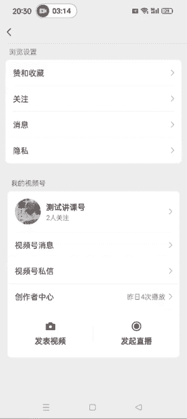
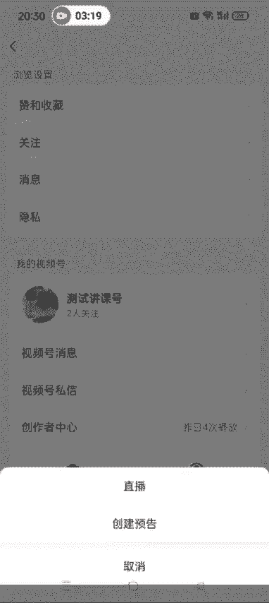
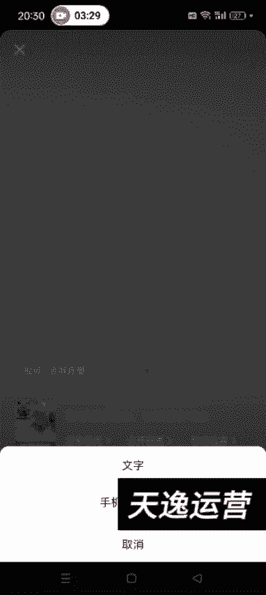
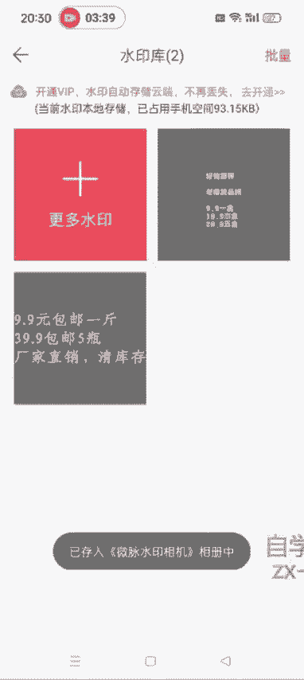
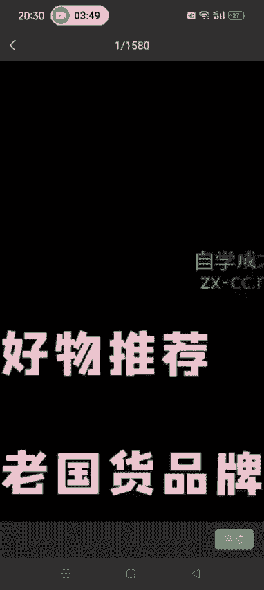
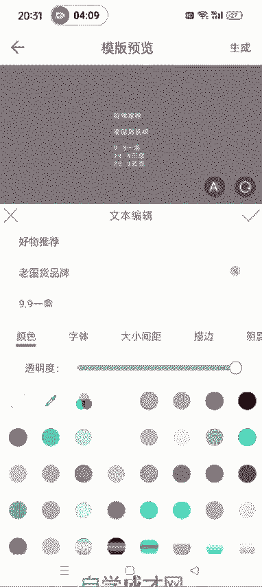
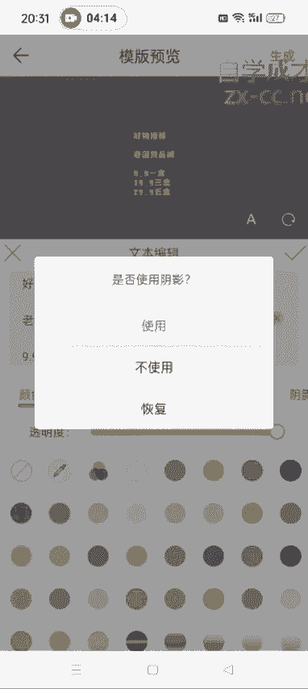
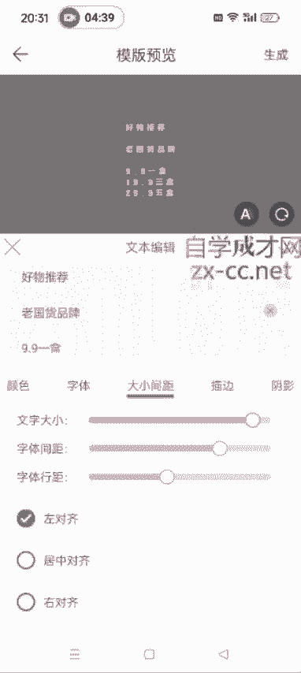

# 【视频号运营教程1000集】新手小白别再盲目自学了,保姆级视频号自媒体运营教程｜整整1000集，学不会我直播吃键盘 - P26：3.如何制作直播间贴图 - 抱月楼老金头 - BV1x5Yhe6EmV

好，各位同学大家好啊，就是呃我给大家说一下，就是我们在开直播的时候，有的时候你看有的那些直播间它会有这么一个贴图，就是毫物推荐老国货黄氏霜9块91盒，19块9块3盒，29块95盒。

像这种贴图它是怎么做的啊？这种截图怎么做的？其实微商水印相机就可以做啊。大家在大家在应用商店下载一个微商啊，水印相机。现在它是叫那个微麦水印相机啊，之前是叫微商水印相机。

大家直接搜就微麦水印相机进来之后，我们去找这个往下滑啊，不需要开会员啊，我们用那个不是会员的那个功能也可以完成。这儿有一个水印库，看到没？暂不开通？然后我们这点击更多水印，然后水印模板。

在里面找到横竖文字，比如说用第一个这个是吧？然后我们就可以写上好物推荐。然后。嗯。老国货品牌。呃，我这个是以这个他这个为例啊，就其他的品类，你看看别的直播间写的什么，你就直接模仿就行了。9块91盒。

19。9块。两盒。49块9两盒吗。啊，19块9块3盒。嗯。29块95盒啊，我就大概这么写一下，告诉大家是怎么做的。然后这个。颜色可以变啊。好，推荐这个颜色可以变。比如说你想要。彩色的是吧。

下面这种的都可以变啊，知道了吧？粉色的也可以。然后字体也可以调。OK了是吧。然后这个。呃，最重要的是这个背景色啊，背景色这。然后这儿可以调节这个背景色背景色我们一定要选择这个啊，没有背景的。

这儿有一个斜杠的，这个看我点在这啊，一定要点这儿知道吧？不要选择那种有背景的，有背景的，到时候进去之后，它就不是透明的了，知道了吧？它相当于是直播间呃，你这几个字后面还它不像他那种就是呃全透明的。

全透明的啊，一定要选择呃像这种透明的，不显示背景的啊。不显示背景的都调到0，然后点一下这儿。然后点生成就OK了啊。到时候你就可以在你的直播间去加上这个图了。然我给大家演示一下啊。稍等啊。

然后比如说我们发起直播直播，对吧？

然后这个画面里面加上这个贴图。

再选择这个手机相册的图片，哎，我刚才没保存上。那保存一下啊。然后点开这个你刚才做好的这个，让他存入相册。

然后直播的时候用啊。画面截图。手机相册选择。

确定哎，这样的话就加进去了，你可以调整啊。调整它这个大小。然后加到你的这个直播间就可以了，知道了吧？呃，如果字号太小的话，它这里边可以调节这个字号啊。我可以继续编辑它。

字体。😔，大小间距，文字大小。这个都可以调字体行距啊都可以调。然后大家到时候需要的话，你就自己在这去搞一个贴图就行了啊。然后再点点生成啊，这个研究一下应该也都会。

