# 【视频号运营教程1000集】新手小白别再盲目自学了,保姆级视频号自媒体运营教程｜整整1000集，学不会我直播吃键盘 - P5：4.视频号保证金，带货权限，直播权限解读 - 抱月楼老金头 - BV1x5Yhe6EmV

各位同学大家好啊，继续讲我们视频号的基础片啊。然后我们在创作者中心这个板块点开右上角这个人头，就可以看到你自己的这个带货身份啊。呃，一个是达人，一个是那个。一个是商家啊，然后我们是可以可以选择啊。

就是你这个就是万一弄错了，也可以去修改，后期都可以修改，知道了吧？这个没有关系啊，然后经营资质这这个就。需不需要关注啊，然后下边这个带货权限，带货权限这儿是怎么个意思啊？呃，您看有视频带货，有橱窗带货。

有直播带货，这三个板块分别是什么意思啊？我给大家说一下。这个视频带货上面这个视频带货它指的是什么呀？指的是你这个视频里面挂就类似抖音那个挂小黄车，我们随便点开一个，没有标志抖音视频。

你看他这不是有一个小黄车嘛，是吧？就是你发视频的时候可以挂车，它是这个意思。然后视频号的这个挂车的这个视频也有啊，你像这种的，它就是挂车的视频。🎼还有几天就要过年了。

年夜饭大避风唐然后你点开大概等个三五秒钟，这就示出一个橙色购物车频是橙色的购物车，然后你可以直接点开去去购买，知道了吧？这个是那个视频带货啊。这个视频带货是要的。发的频创的。另就是说呃你满足一0粉有。

样话频的个小程车一做搬运账个权限很难。我们基上就是用不到这个啊，就是即便你这个权限开通了之后，后期你但凡有一次违规，它这个权限也就直接给你封了。就像我这个账号就频货这个功能给我封。

进了就是说我发我发视频的时候不可以挂车，但是依然可以通过橱窗去卖货啊，就是别人点开我橱窗依然是可以购买的。然后直播带货这个我给你讲一下啊，直播带货这个呃。呃，视频带货这个大家了解了吗？

就是视频带带货这个啊就是你发视频的时候挂车啊，我这儿好几个例子，然后这个也是发视频的时候挂的车。🎼好好把刚下下来，首先8块1斤的排骨冷口上锅。然后我们在评论区可以改看到他这个挂的这个车。

在评论区点开也可以在视频里面也可以啊。当然这个功能嗯就一般人没有这个权限啊，1000粉丝，然后视频号必须是原创的。这个就是如果大家能开通的话，就用。如果实在开通不了，也不要纠结这个东西啊。

我们基本上用不到这个就通过橱窗去带货，或者说直播去带货就OK了啊。然后下边这个直播带货者啊，直播带货它是有条件的。现在呃我们都知道啊就是。以前的话就是一个人可以实名5个微信。

然后你这5个微信都可以通过自己的实名去5个视频号。呃，就是这5个微信带的视频号，你也可以去实名5个视频号，但是现在的话就是你虽然可以实名5个微信，但是你只能实名5个微信里边其中两个视频号。

就是通过你的实名去实名啊，就是你这个微信支付里边认证的是谁的信息，然后你视频号也认认证谁的信息。但是现在只能实名两个视频号啊，这是今年刚改刚改的规则。呃，如果说大家在直播过程当中，就是我们开直播的话。

他现在是呃。就是你需要有1000个粉丝才能在你的直播间去挂商品，你要不满足1000个粉丝，就是你直播间不能挂商品，但是你那个橱窗可以用啊，就是视频号，现在直播要求1000粉丝。呃，才能在直播间挂商品。

领粉丝也可以开直播。呃，我给大家。大家看一下啊，我刚才录了一个屏，就是说。

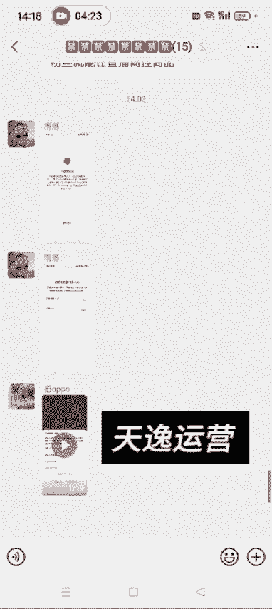

你如果点这个发起直播的话。

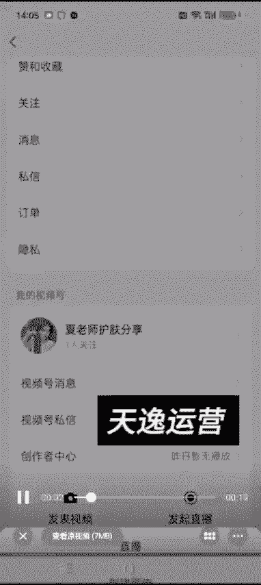

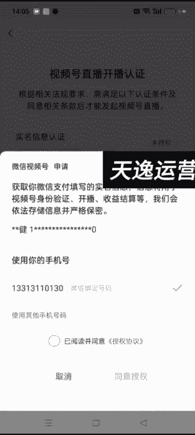

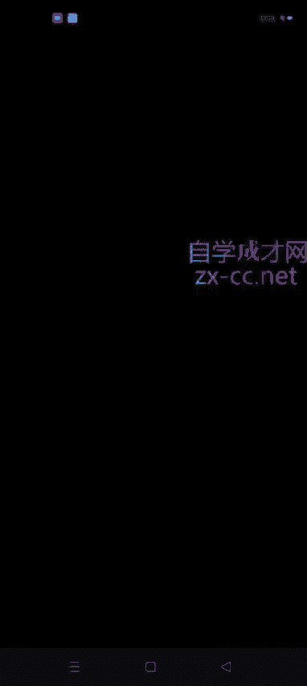

看到未？是。就是你这个如果你的这个已经认证过两个视频号了，然后你现在他就是开播的时候需要认证一下，你是认证不通过的，知道了吧？

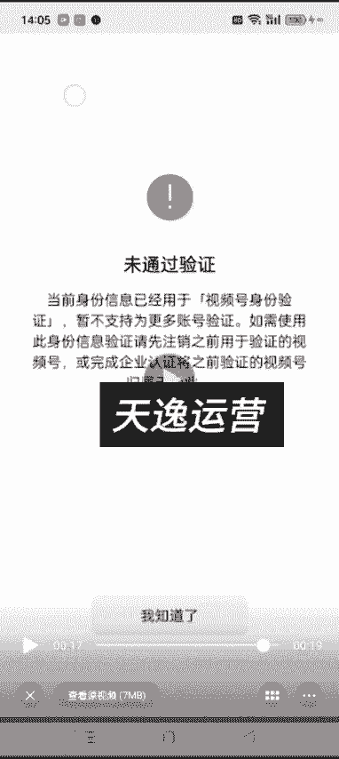

就一个人现在只能认证两个啊，然后我给大家再看一下，就是我们直播的时候。

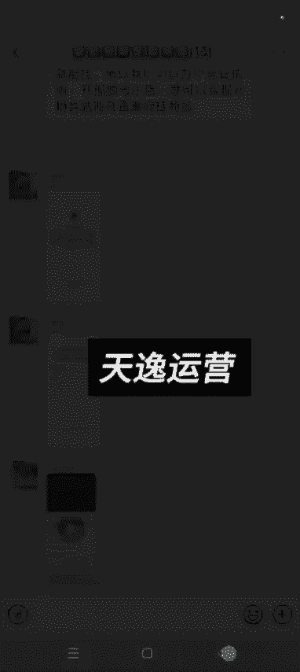

我这个账号它现在是可以直播的，我这个大号是可以直播的。发起直播直播。然后商品。然后去添加。还超。

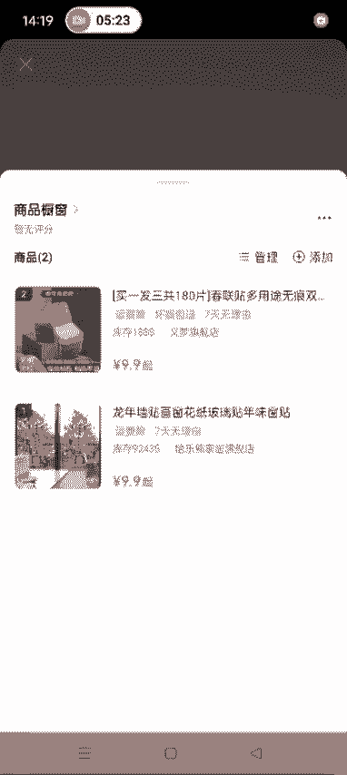

然后就可以开始去直播了啊。呃，位置什么这些都都写一下就可以了。我随便写一下啊，就是主要就给大家展示一下。然后这个时候就可以开始播直播了。我这个前置摄像头坏了啊。

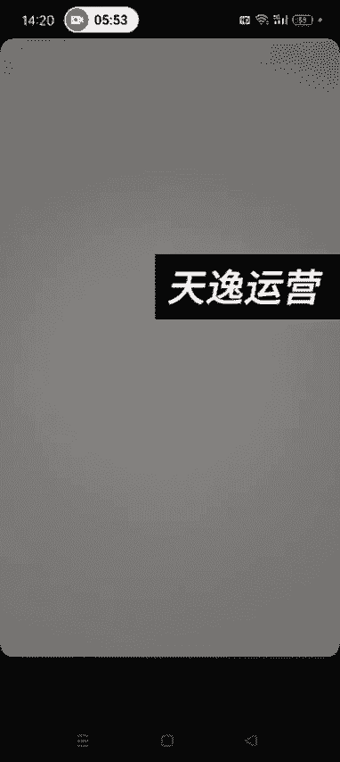

这个时候就可开始直播了，看到了吧啊。😊，然后结束直播就OK了。为什么我这个号可以直播啊？是因为我现在我这个粉丝已经满足要求了啊，我这个3000多粉丝所以就可以直播。但是这个号你可以看一下啊。

这个号它就是直播不了，什么样的人出出来？

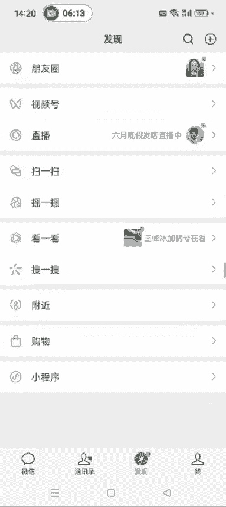

发起直播直播。

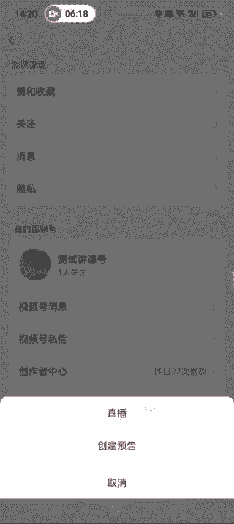

然后商品。为达到直播条件啊，视频号有效关注1000人才可以进行直播带货。也就是说你直播间里面加商品。知道了吧。这个是他现在的要求啊，不满足1000粉丝。我们这个账号，你虽然橱窗能用。

但是你在直播间是不能挂挂商品的，明白这个意思了吗？啊，就是你直播间不能挂商品，所以说我们现在就通过开视频号小店的方式。去去那个搞直播啊，开视频号小店的话，他就是说现在想直播间挂商品两呃。

要不然你满足1000粉丝，要不然你这个账号开通了视频号小店，知道了吧？所以说我们到时候在淘宝办一个那个营业执照就行了，知道了吧？嗯，后面的话这个详细的开店流程，包括你那个怎么弄这个营业执照。

我后面都会讲，后面的课程都会讲到你如果现在不会也没事，后面的课程都会讲到啊，这个就是给大家普及一下，先让大家心里有数啊。好啦。

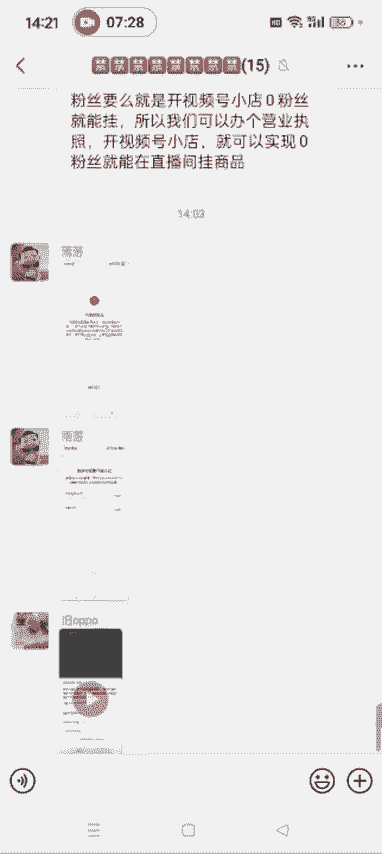

好，这节课就讲到这。