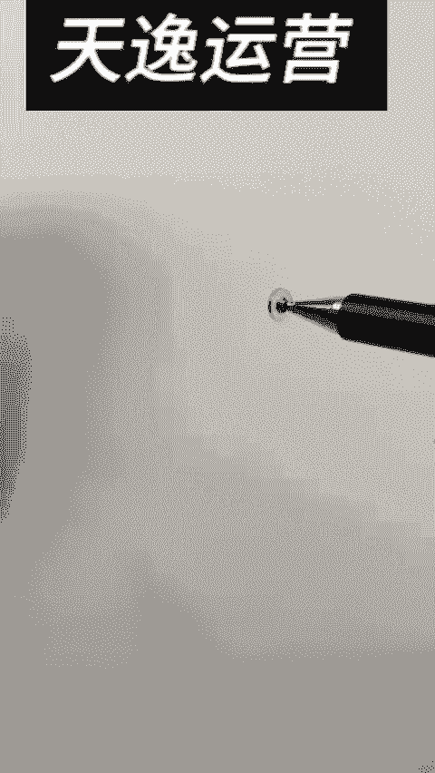
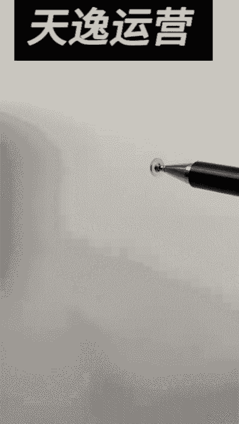

# 【视频号运营教程】视频号从0~1搭建账号全过程，不要白白去交学费了，看完这个视频人人都能做。 - P12：6.搬运混剪方法三 - 好久不见鸭一 - BV1h9Yve8EeW

Yeah。hello大家好啊，今天这节课我们来聊一下好物分享如何去找到我们要的一些素材，我们不需要自己拍啊，去找这些素材拿下来去用。那么有多种方法呢？我大概啊整理我有4种啊。

第一种呢搜索一些视频搜索话题啊，关注同行，还有选品观赏，这些都可以去帮我们去找到我们要的这一些素材，你们首先看一下前两个啊，就是一个搜索视频加我们的一个啊关注同行这一块，举个例子，怎么搜索呢？

我们可以点击右上角的放大镜，那么举一个简单的例子，我们来找个垃圾袋，那么搜完垃圾袋之后呢，哪里手的话有很多很多，对吧？这有个视频。好，我们找到视频里面，大家可以看一下，看到没有？

这里面全都是我们可以去用到的素材，在这里我们都可以找得到，举一个例子，看一下这个把家里的黑垃圾袋都扔了吧。这是这个是完全我们可以拿下来用的啊，拿下来用的那么。😊，怎么去用啊？你们点击右下角保存复附链接。

然后把它用小程序去去寻就OK了。这些把家里的黑垃圾袋都扔了吧。这一些视频啊，这些素材每一个你都可以把它扒下去用啊全部的把家里啊每一个都肯素材里面，特别是我们去找一些点赞不要太差的不万。

因为它之所以为什么报证明它的画面是观众喜欢的，所以大家尽量不会去找一些点赞比较低的啊，就是这种其实都可以啊，几万的几十万，这种是出过爆款的啊，其实这种呢我们可以去把它拿下来去拆去剪。

那么怎么拆怎么剪的啊，下一节课呢我们会给大家讲的，我们先跟大家讲怎么去搜索啊，这些都全都是垃圾袋拉下来而且都是比较热门的一些我们都给扒下来。那么另外一个点呢有一个重点。

你们可以往前面后面后面就我前面跟大家讲的，我们可以通过第二种就搜索话题我们往后面翻翻翻翻到这边呢有个话题，我们点话题话题。😊，垃圾袋抽绳垃圾袋，像这一些里面你都是可以用的垃圾袋点开看到没有？

里面这些都是一些爆款的一些视频垃圾袋。像这个对吧？把家里的黑垃圾袋都30万，你就可以找到的。像这个垃圾袋，把家里的黑垃圾袋都扔了吧，你这对吧？像这些里面你的素材就特别多了。

还有像比如说你做一个是抽绳的垃圾袋，像这些对吧？全部都可以用了，喉朋会的省奇个哎呀，其实我觉得这两个方式已经足够我们去用了，啊，足够用了好吧，那还有第三种什么第三种，比如说你是做我们的一个叫做好物分享。

也是看到那么你们就尽量关注一些好物分享找看他们什么活，你就去研究一下，你关注大量同行吧，同行活什么对吧？你就把它视频可以拔下来，然后去找一些就是很多同行都在做了，你们都可以去下载，你把关注10个同行。

10个同行视频下载下来，那不就10个素材的吗？都前面挺简单的，对不对？那么第四个点。😊，我们可以去选品广场，选品广场在哪里呢？我给大家去看一下选品广场就是在你们的一个啊商品橱窗里面去找。

我找一下我们选品广场给大家去打开去看一下，在我们这里商品橱窗里面呢有一个选品广场。好，那我们直接点击我们选品广场，比如说咱们啊对吧？抽绳垃圾袋，他们给我给我打出来了，我们点这个垃圾袋，好。

那在下方呢这里就会有很多很多的垃圾袋，对吧？你点击这一条视频，在它下方大家可以看一下，这里是不是就有很多相关的视频，啊，这视频肯定就带了这个货嘛，对吧？

OK那么我们在这一块其实也是可以找到很多你要量万播放量，好好还可以吧，还可以，对吧？你可以下载下载保存复制链件，像下方这一些找嘛？这些都是可以帮你找到一些啊，没有灵感。

你要自里找看一下他们去做的什么视频，剪辑有什么思误啊，按照他们思路去往这里有很多相关视频。好吧，大概呢。😊。

其实有还有很多很多种，其实我觉得这四种呢是完全足够用的，特别是前两种已经够了啊。OK那么这一节课我们怎么去找我们的好物分享素材呢？我们就大概跟大家分享到这里好吧？O我们下一节课来跟大家讲。

我们找到素材之后呢，我们如何去进行混剪，如何剪辑啊，这个才是比较关键的。OK啊，同学们，我们下一节课见。😊，Okay。hello，大家好啊，今天这节课我们来具体的聊一下好物分享视频混剪的一个实操案例。

我们怎么去混剪，怎么去防搬运。在这一节课会来给大家去做一个完整的一个分享啊，素材找下来之后怎么去做。那么大概呢我们有几个思路啊，比如说怎么去混剪完之后呢，我们才可以发布出去。

如何让我们的视频做到一个防搬运的效果。那么这节课我们来好好来给大家去做一个视频啊，通过做完这个视频，大家知道就知道怎么去玩了。好吧，那首先一样的，回到咱们抖音里面，如果我们去找素材，怎么找呢？一样的。

点击放大镜，我们今天这节课就是来做一个垃圾袋。好吧，那么点击一个垃圾袋，点击我们的视频。然后在下方就会有很多很多素材，我们先找素材，我觉得找大概3到5个啊，你至少要的啊，你越多可能越好。

在每一个视频里面找到你要的画面。就OK了。那么这个高一点啊，其实我们我就随便找啊，你们后面去慢慢研究一下，找哪一些房子这里找点一看把家里的黑垃圾袋都。好，那么我们先去点击右下角点击我们这边这个复制链接。

我们点击复制链接啊，不要直接下载下载用水印的。那么去打开找到咱们微信里面的个小程序啊，去找到小程序，就做青抖去水啊，你们去找到我们小程序系去叫做青抖啊，西果啊，什多都可以，你们随便找点击去水印。

然后点击这边去复制链接，点击一键去水印，点击okK然后点击保存到相册，那么现在你的视频里面就得到了一个特别特别干净的一个素材啊，这个素材就是找的是这样子，对吧？它是没有水印的，没有水印。

同样我们这个方法呢，你可以直接在抖里面去找。比如这个把家里的黑垃圾袋对吧？你也可以在复制链接，然后把它下载，保存到相册，全部圾袋找大概3到5个找找3到5个okK你就下来，我已经找完了啊。

你们就是下去找就OK了。那么找完之后呢，我们就是打开，先等一下啊，找完之后，我们先去把我们这个视频，这个音频家的黑垃圾袋你可以点击下方这个音频里面估计有很多人在用。3000多万左右对吧？

马家里的黑垃圾袋多。好，那我们点击收藏，我们要他这个音频okK好，那回到咱们剪。打开我们的开始创作啊，我这里找了六段素材，我们就挑嗯挑三段用啊，随便去挑，我就挑123啊，大概这样子的一个三个画面。算了。

我就挑嗯挑挑这个吧。好吧，O调这三个片段来来去用啊，大家可以看一下。首先呢我们去调整一下我们视频比例，无论你做什么视频，你上来第一个动作，一定要去调整一个你的一个9比16。

那么接下来我们需要去做一个什么动作呢。我们先把我们这三段视频。我前面跟大家讲过了，他需要嗯我的大概建议呢你们可以去做四个做这8个动作啊，放大分割打乱顺序啊，加镜像抽帧调试加画中画加音频。

你都可以一个一个来去照作啊，那首先我们来给他做一个动作，叫做放大放大有个好处啊，我觉得这个视频你肯定要去放大一点，放大一点，其实它跟原本的视频它是不太一样的。对吧？我们把每一段画面都给它放大一点。比如。

这个第二段画面我们也给它放大一点啊，稍微放大一点。好，这个画面呢我们再给它放大一点。好，第一个动作做完了，放大。那么第二个动作干嘛呢？我们去点击我们添加音频，去刚刚收藏的这个音频。

把家里的黑垃圾袋都扔了吧，这是可以点击保存。这音频呢就大概这么差。那么我们可以稍微给这一段音频呢去采个点，你就大概知道你要做多少段素材才能够用，点踩点，对吧？来看一下。把家里的黑垃圾袋。

然后它上方有一个音频，我先把它这个音频原视频音频拿关掉。好，然后在这里买点菜点。🎼看一下把家里的黑垃圾袋都扔了吧，这是抖音上9。9块能买五大卷的垃圾袋，用一年都用不完，手提式设计，黑垃圾不来看一下。

用一年都用不完，手提是设计，黑垃圾不伤手也不伤手，并且承重效果也非常好，装个十几二十斤都没问题，真的好用，大概可能就这么几个片段嘛，你们可以感受一下嘛，把家里的黑垃圾袋都扔了？扔的吧，对吧？

一个画面就能买五大卷的垃圾袋，五大卷的垃圾袋，对吧？一个画面对吧？用一年都用不完，用一年用不完，对吧？😊，手机式设计，提垃圾不伤手，也不伤手，并且承重效果也非常好，承重效果非常好啊，它还可以是一个画面。

对吧？装个十几二十斤都没问题，真的好用还不贵，对吧？二十斤都没问题，好用不贵。那么后面你可以搞个实惠点啊，这个承重你就要配一些他拉东西提东西的画面，对吧？好，那大概我们的思路有了啊。

思路有一开始把家里的黑垃圾袋都扔了吧，你就得是扔掉扔掉的画面，那么我们就找一些扔掉的画面啊，我们刚找的这三段素材呢，大家一定要先通过这段音频去感受一下，你需要什么画面垃圾袋都丢了。

那么你就第一个画面肯定得是这个丢掉的画面，那么这一段画面我们是肯定不能要的对吧？丢掉的这个画面我们是可以要的好吧，那举一个例子，我们就拿这个吧啊，给大家看一下，把家里的黑垃圾袋都扔了吧，这是抖音上去啊。

扔了吧。好，那我们扔了吧，就到这里都扔了吧。好，扔了吧。好，那么大概这个界面啊，他会跳过来。那我们就到这个界面我们去剪辑呢，我的建议是大家。你每一个画面你不要超过2秒钟。好，剪辑吧。

那么这个画面我们就是我们要的了。好吧，那么后面呢我们可以干嘛？这是抖音上9。9块能买五大卷的垃圾袋啊，抖音上面9。9块能买能买多少卷的一个垃圾袋，那么这个画面我们需要去展示一下这个垃圾袋，它的画面对吧？

你要展示一下，你有五卷啊，对吧？我就你便宜，对吧？就是抖音上9。9块能买五大卷的垃圾啊，那么去找一下有没有这个画面，这一段素材我们就不用了啊，我们换另外素材。看一下这个画面有没有。这里有啊这里有9。

95大卷的垃圾袋，那么这个是可以用的。对吧这个是可以用的，包括像后面我估计这里也有对吧？哎，这个也有对吧？9。9块能买五大卷，那我们就拿这个吧。好吧，就拿这个OK好，那找到大概你把它你可以放大一点啊。

它会有个画面切的。好，那我们切的准一点。这个呢我们点击分割。好，前面这一段不要它我们后面这一段。对吧。拉垃圾袋的这个过程。好，那这个套套套东西的我们就不要了。大概到这里。好，分割这一段呢多少秒呢。

我看一下这段好像有点长，我们两2。7秒有点长了，我们放到前面这里再看一下了。好吧，把家里的黑垃圾袋都扔了吧。这是抖音上9。9块能买五大卷的垃圾袋，用一年都用，看一下了，对吧？是抖音上9。

9块能买五大卷的垃圾袋，用一好，大概这个画面okK了，用一年都用不完，对吧？用一年都用不完，首先式设计，提垃圾不伤手也不伤手，用一年都用完，我们就可找一个就是也是稍微展示它效果的一个东西。这个是拉的。

这个是用的啊，因一点都用不完。我们随便找大概。嗯，这个这个用一年都用不完，我们可以找一个，我们再找一道嘛啊，我们刚添加了好几段的，刚添加是。呃，这一段这一段唉，怎么刚添加只有两段呢，不是三段嘛？

我们再找加个加两段嘛啊，把它加进来，看一下有没有我们要的画面，用一点的啊，用一点晚安，这个画面就就还可以，对吧？因为这个画面就还可以。呃，用一年的用过，我们就来这个吧。好好。

这个开箱的这个动作就代表它比较多嘛。好，那这个我一样的放大一点。前面分割不要它好，来看一下，用一年都用不完。大概呢到这里它是另外画面。OK点击分割。好，这一段我们一段段找可能会更加更加精准一点。好。

大概这样子来配嘛。看见了把，家里的黑垃圾袋都扔了吧，这是抖音上9。9块能买五大卷的垃圾袋，用一年都用不完。嗯，看一下呢，如果这个画面呢我们就用一年都用不完，这个画面就短一点。好，这个画面给别人看的感觉。

啊，最后面也不要了。这不要了，然后这个也不要了。大概这样子看一下。🎼用一年都用不完，扫提试试。😡，这个。长一点，这个长一点。Yeah。🎼。9块能买五大卷的垃圾袋，用一年都用不完，手提式设计啊。

大概这样就OK了。因为它刚好这个画面给别人看，因为会有很多嘛，用一年也不完嘛，对吧？然后下一步呢看一下来都用不完，手提式设计，提垃圾不伤手也不伤手，并且手提式试计，那么我们就可能得用到这个画面。

手提式试计，对吧？好，那大概这样子，手提式刚好这个画面就配的很准了。手提式设计，手提式。好，大概这里前面这个不要它。大概这样子。🎼用一年都用不完，手提式设计，提垃圾不伤手，也不伤，可以再快一点。

🎼木玩手提式设计，提拉圾不伤手也不伤手，并且承重。看一下OK我们再给它混剪一下。那么这个画面我们就不因为它是一段素材嘛，我们就。可以把它不要，就大概这样子，我们给它换一个画面，因为它这个是一段的。

手提式是计，我们找一个手提式的好，这个提水的吧，对吧？手提式设计。大概这样子。OK哦，这个画面我们前面这个分割往前面是不要它，尽量找的精精准一点。因为我觉得后面他画面感那个跟你声音是要配得上。

它才会比较有感觉，才会让人感觉。哎，这个东西对吧？它是它是有画面感的，看一下来。🎼脏手也不脏手，看一下，用一年都用不完，手提式设计，提垃圾不脏手也不脏。手提是我们刚刚这里在前面的。😡。

🎼设计提垃圾不伤手，也不伤手，并且承重效果也非常好，装个十几二。这个画面其实还不是很好，找一下。手提式，那么我们直接用这个吧。这个可能还更好一点，这个比较冲击感，我们直接用这个吧。对呀。

这个这个因为它装的是水，可能我觉得跟这个画面会更加有感觉，你们去找就ok了。🎼看一下当手，并且承重效果也非常好，装个十几二十斤都没问题，真的好用还不贵。唉，那似于放上去了。在这里哎。

我们刚那个视频在哪里？跑哪去了？跑前面去了，看一下。🎼用一年都用不完，手提式设计，提垃圾不伤手也不伤手，并且乘坐去这个返回来一点。🎼管手提式设计，提垃圾不伤手也不伤手，并且承重效果也好。

OK那这个画面挺好了，承重效果嘛。对垃圾不伤手也不伤手，并且承重效果也非常好，装个十几二十斤都没有，承重效果来再看一下来，伤手也不伤手，并且来。不伤手也不伤手，并且啊，这个太长了，我们再短一点。短点好。

再看一下来，在后面再给他加一个其他呗。对吧再提个水嘛，差不多了，伤手也不伤手，并且承重效果也非常好，装个十对啊，承重效果对吧？再装个啥呢，非常好，装个十几二十斤都没问题，真的好用，装个十几二十斤。

那么我们就给他装个桩头吧，或者装个叉。装个这个也可以，这个也可以哎，给他装个桩头吧啊，这个好一点。好，我们来这个画面点击删除我们要的他这个体砖头这个画面。啊，这个可能更有感觉一点，来，把它调到下面去。

调到1234567，我们刚看到的是他提水桶的这个界面，在这里吧，不是，还要再往前一点。还没有还在往前。他这里。🎼还没到吗？看一下垃迪不伤手也不伤手，并且承重效果也非常好，装个十几二十斤都没问题。

真的好用还不贵。嗯，好，大概大概这样子截差不多，我们把这个水把它放前面去。🎼大概刚好卡住了，看一下，不行，再挑，把家里的黑垃圾袋都扔了吧。这是抖音上9。9块能买五大卷的垃圾袋，用一年都用不完。

手提式设计黑垃圾不伤手也不手，并且承重效果也非常好装个十几二十斤都没问题，真的好用还不。好O我觉得已经挺完美的。这个视频简的好，大概后面的不要了，删除掉，全部删除，全部删除啊，大概画面配合完。

我们再看一遍有没有家里的黑垃圾袋都扔了吧。是抖音上9。9垃圾袋用一年设计圾不手也不垃圾并且承重效也装个十几二十斤都没问题，好用还不对吧？大概其实我觉得已经挺完美的，就就大概这个效果吧啊。

你们再去有更好的，你们可以再去加好吧，那接下来我们再去给他做一些就是防防的效果有什么效果呢？我们刚讲了放大分割打乱顺序，我们做过了，我们接下来做两个镜像抽真调试来那什么叫镜像的，镜像其实很简单。

比如说它这个。就在左边对吧？我们点击一下，在下方呢会出现一个叫做一个。唉，镜像跑哪去了？我找一下啊，点编辑啊，应该在编辑里面，编辑有一个叫镜像旋转，好吧他手就编到这边来了。

那么他就是把家里的黑垃圾袋都扔了吧，那是抖音上9。9块OK我们随便再找。比如说这个我们也可以随便你不用每个都加镜像，你就挑几个去加其其实够的了啊。啊，镜像。然后再挑多这个你再挑一个镜像都可以了。

就尽量去捣乱它原来视频的一个一个一个画面。OK镜像。然后呢，下一个动作我们可以去给它做一个抽帧。那什么叫抽帧呢？我们把视频放大放到放到最大之后，大家可以看一下。

它里面呢是有个F的6F7F8F每一个F就代表了一张照片，我们可以在视频中点击分割，然后给它去删除掉一张画面。啊，点击删除掉一张画面，OK这个画面就删除掉一张了，对吧？

一张照片它其实是不会去影响你整个视频的效果的。我们可以去每一段视频都里面去给它抽一点点放大啊，放大放大放大放到最大放不了。okK你点击分割，点击我们的这边点个分割。整割不了，太太短了的一张照片。

一张照片它是不会影响你的画面的。好吧，大概呢你可以这么去抽抽抽掉一针两针抽一针就慢慢抽抽完之后效果。你看它整个视频它其实是没有任何的影响的。它画面感几乎是跟原来是一样的，因为它呢就是一张照片。

