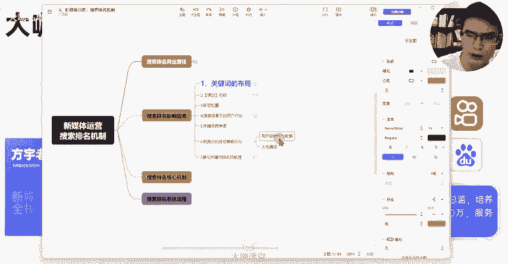
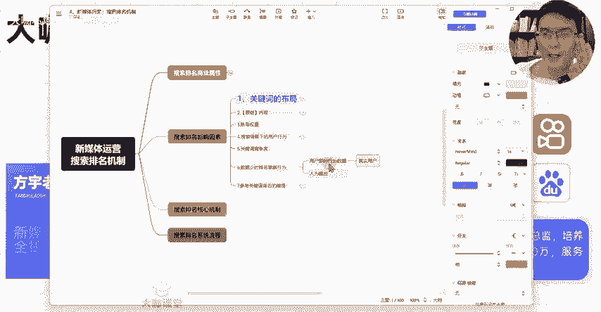
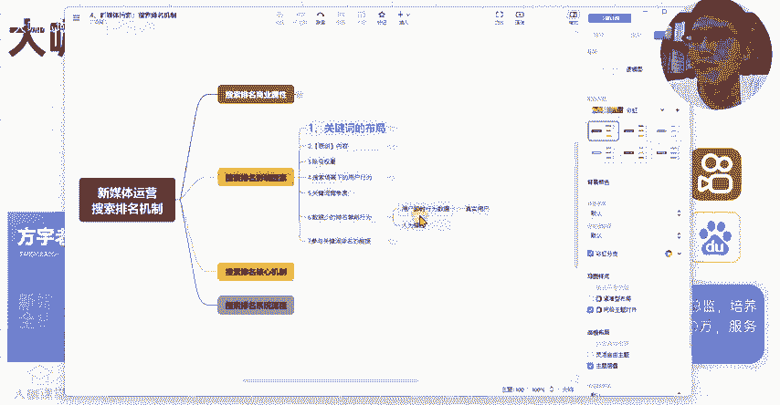
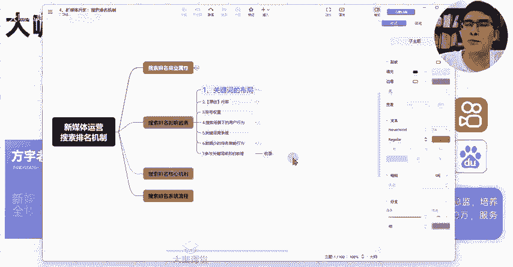

# 【转行新媒体运营必备课程!】7天学完小红书运营全流程操作 起号／剪辑／文案／变现 从入门到实战 免费课件领取！ - P16：15、新媒体运营第九课：笔记关键词搜索排名影响因素（2） - 大咖私域运营 - BV1jim5YaE9X

第五点呢就是我们某个关键词的一个竞争度了。我们知道这个图文笔记平台上面呢，你去搜索一个关键词，在它这个下面呢，它会展示哎有多少篇跟这个相关的笔记。那么相关的笔记数量越高，代表着这个词汇。

它的这个怎么说呢？它竞争度越高。什么意思呢？比如说我们搜索英语口语，下面呢可能有100万篇笔记，对吧？但是呢我们搜索口英语口语的训练方法，下面可能只有3030万篇笔记。

那么你们觉得哪一个词下面的一个竞争度会更低呢？或者哪个词的竞争度会更高呢？明显英语口语这种量特别大，笔记流量特别大的？你在这么大的一个笔记流量池里边，你想把排名往前靠。那么你面对的竞争自然就是越多的。

所以说关键词竞争度也取决于也也决定了我们这个笔记呢可能会获得什么样的一个搜索排名。因为我们做搜索排名，我们做关键词的话，并不是说每一个关键词都能向我们理想的那种情况去靠的很靠前。😊。

我们通常的行为呢，就是你没有办法做的特别靠前的话，我们可能会通过多篇笔记来重点竞争这个关键词。那么如果说这个关键词对我们的影响还不是特别大，有可能这个关键词我们就就放弃了OK。

OK那么这是关于关键词的一个竞争度。然后呢，还有一种情况，就是我们去这个平台上去搜索图文笔记平台上去搜索。我们有时候可能会发现某些搜索词的一个场景下面啊，一些笔记数据比较少的。

比如说这种点赞只有两三百的，他可能还跑排的比较靠前，对吧？二三名的这个样子，然后呢，第一名、第二名、第四名这种可能都是点赞数据啊，暂藏数据啊，在呃几千甚至上万的这种，那为什么这种几百的他能靠的比较前呢？

有一种什么情况呢？啊，而且呢这个笔记呢可能还是新发的什么情况呢？就是这个短时间内的一个用户及时行为数据，也就是说比如说。

我们某一篇笔记发布出去之后，哎，真实的用户在浏览这篇数据的时候，他得到的数据特别强。比如说我这篇笔记只有1000的浏览量，但是呢这篇笔记当中绝大部分用户都给我提供了非常不错的数据。而且在搜索场景下。

我一开始排的比较靠后，但是搜索场景下很多人都愿意来点击我的这篇笔记。

那么我这篇笔记，即使现在就是分发出去正常分发的数据比较少，那么我也可能得到一个不错的这么一个排名。那么你们想一想，在这种体系下，我们要实现的目标是什么？就是一个用户的及时行为数据。

用户的及时行为数据是怎么判定的啊，这里一定是什么呀？

一定是真实用户一定是真实用户。那你们你们想一想，我们假设说人为来操作这些事情的话，有没有办法去操作？

在你们想来有没有办法去操作？

是有办法的。我们真实用户一般是怎么来判定的呢？

真实用户呃，系统现在判断真实用户的一个指标是非常强的。你这个用户呢，其异常以前的一个浏览的时长，你正常使用我app去刷，我给你推荐这种内容的一个呃时长，你在某些数据下面的一些评论行为，你的数据行为。

然后你这一批用户，他们所在的IP地址，然后呢，他们的设备的不同。然后呢，他们可能对在系统这一块用户标签的不同。这些都能够形成系统来判断你是否是一个真实用户。

所以说我们很多时候有一些同学呢去考虑这个刷数据类的这种行为来做。为什么这种对账号的一个争议不大。因为所有的系统，他现在判定这个用户的一个真实数据的一个呃要求是非常严苛的。

但是你们想一想在这种严苛的行为下面有没有办法。😊。

去把这种真实用户给他数据做出来是有办法的，所以就会衍生一个什么呢？人为操控的这么一个行为。就是有有一些啊这个搜索排名下面是有能够实现人为操控的这种数据排名的。OK这个你们了解一下，好吧。

那么用户及时行为数据是决定我们笔记啊，能够快速获得一个不错排名的一个这么一个前提。当然这个抛开这个人为操控的这个情景下面，我们需要保证我们笔记做的确实足够优质。好吧。

然后呢，在某图文笔记平台上面，我们还需要了解一个情况，就是我们笔记发布出去之后，哪怕有浏览量，对吧？它有不错的数据啊，它有几百小眼睛，它也有暂藏。那么这种情况下。

有些笔记它就是参与不了搜索排名是什么问题呢？啊，是取决于一个收录问题，你们要了解什么是收入，就是收录呢，我们大部分的笔记，我们很多人我们很多同学去做这个图文笔记平台，你们去发布的这个笔记之后啊。

这个笔记呢，它是有这个收录关系的，并不是你所有的笔记都会被系统收录。你发布的这个笔记，它收录的这个前提或者影响因素有很多。那么。😊。

只有收录的笔记，他才有可能参与我们某个搜索词下面的一个排名。这个收录怎么去查呢？我们把某篇笔记的这个标题呀，复制一下，放到搜索框里边，完整的标题哈，放到这个搜索框里边去搜索，能否搜索到你的笔记，能搜到。

那么就是被收录了。如果说搜不到的话，你这篇笔记呃就是没有被收录的情况，哪怕他有小眼睛，它暂时有数据。那么这个你没有被收录，你就没有搜索排名啊。这个呢其实收录也跟什么呀？也跟我们的账号权重是有一点关联的。

😊。

收入呢也跟我们账号权重是有一点关联的。然后呢，跟我们的笔记的一个质量啊也有一定的关联。而且呢还有一点就是你的笔记当下没被收入，不代表以后都一直不被收入了。OK那么这是我们呃在这个新媒体运营机制里边呢。

就是我们的搜索排名机制里边，影响我们搜索排名结果的一些绝大部分的这个因素。那么我们做运营要做的就是把所有的这个因素啊，我们能够把它这个指标尽量的往上提。那么你在这个搜索结果下的排名呢。

才能够得到一个更好的展现。OK那么这节课呢就先跟大家讲到这里，我们下节课再见。

