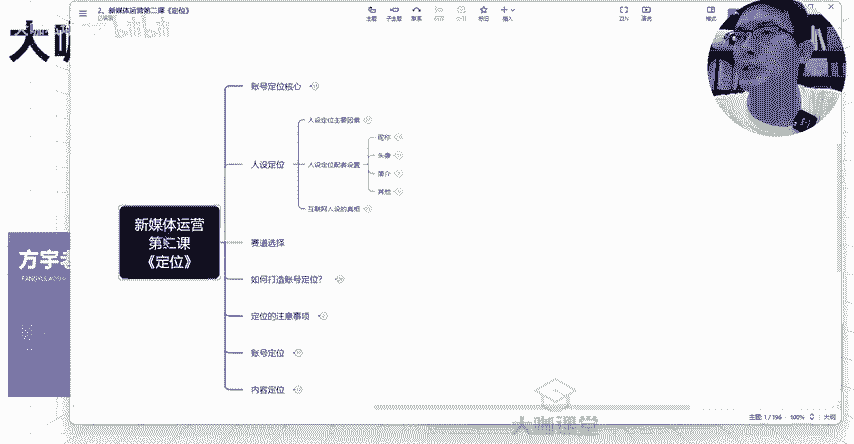
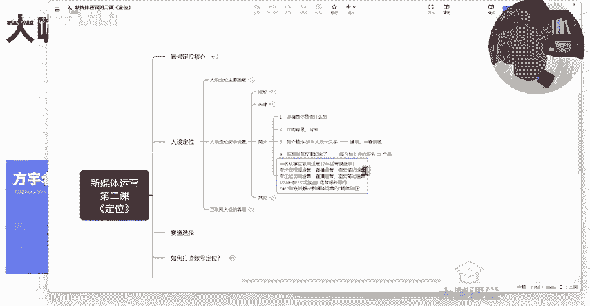
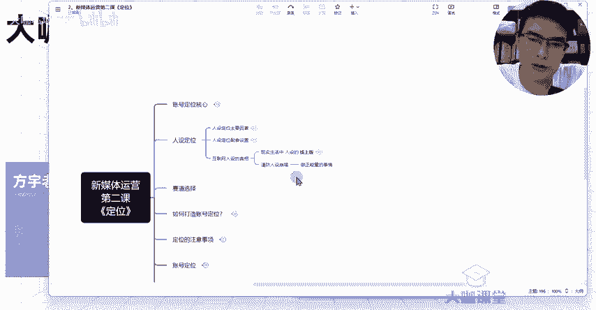
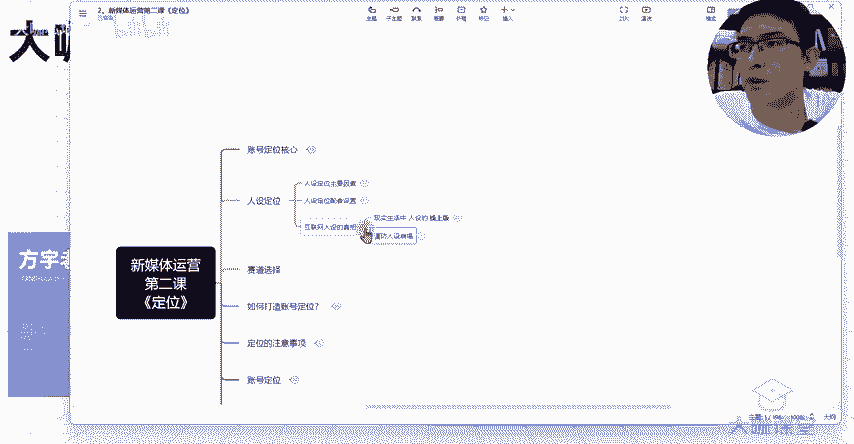

# 【转行新媒体运营必备课程!】7天学完小红书运营全流程操作 起号／剪辑／文案／变现 从入门到实战 免费课件领取！ - P7：6、新媒体运营 IP人设塑造：人设定位的配置及背后的意义 - 大咖私域运营 - BV1jim5YaE9X

hello，同学们，大家好，欢迎大家来到这堂课。那么我是方宇老师。那么这一堂课呢我们来聊一聊关于人设定位的一些其他的配套设置啊，这个呢比较简单，也是我们基本上照着去做，但是有一些地方呢。

我们需要去注意的。第一个呢就是关于昵称了啊，我们的账号设置这一块，我们的昵称头像简介这3块呢各有各的作用，对吧？昵称呢这一块是去告诉别人我叫什么，对不对？那么昵称这一块我们很多人遇到的坑。

就是自己取昵称呢，取昵称这一块确实没有特别特别好的思路啊，可能会在纠结我这个昵称到底取得好不好，到底别人能不能记得住等等等等。其实呢你注意这两个点，其他的不要去过多思考就OK了，你的昵称取得再亮眼。

你的昵称取得再好，再优秀，他是无法让通过一让用户通过一个昵称就觉得你这个人呢啊，我能记住你或者说你这个人有什么样的一个点。我前面也跟大家讲了。😊。

人设这个东西呢，它是通过你长期的一个运营，你账号的一个成长情况，你账号的一个人群覆盖情况这种来得来的。你最终是否能把这个人设打造起来，对不对？人设只是我们在这个日常的运营。

还有我们的一个内容的一个角色穿插。还有我们整个自己定位的这一块的一个体现。那么你只需要注意这两个点，那么你的昵称呢基本上不会有太大的问题。第一个昵称里边不要去放一些复杂的文字。

比如说我们知道有一些偏僻的这个生僻字，这些生僻字呢，他撰写起来难度会高一点。那么我们可能考虑一种什么情况呢？在用户他去搜索你的昵称的时候，他不知道从什么渠道知道这个人，他要去搜索你的时候呢。

你的这个文字上面，哪怕说整个不是那么通顺哈，但是你最起码你不要说有让他特别难打的字。你像我们现在很多这个平台。对你像我们之前有一些平台呢，在这个昵称这一块是有很严格的每个读一的这个把控的。

但是现在呢我们了解的短视频平台，还有呢我们的这个图文笔记平台，还有我们的这个啊我们。😊。

在这个昵称这一块是可以理解为是独一无二的。但是呢在其他的平台上面这一块它会有很强的一个重复性。那么你打了一个用户呢，他打了一个错字，甚至说同样的一个昵称的情况下。

他都有可能分不清到底哪个是你我们通常呢找一些不知名的账号，都是通过什么ID对吧？你的这个什么什么号，那么你在这一块，如果说你的这个文字呢，呃，第一个你设置的特别难打的情况下。

用户呢他找不出来这个字会消耗他去搜索的这个时间。然后呢，呃那么你在这个传播性呢，可能会遇到一点点的问题。😊。

像我们以前做这个呃SU的时候，我们做网站，我们的域名，包括呢我们品牌名这一块，大家都在尽力去考虑一个什么问题呢？就是呃我的域名呢要短，对吧？然后呢我的域名呢如果说能够通过拼音的形式能念得通，唉。

那更好对吧？用户呢他偶尔记住了他输入这个拼音来访问我的网站那更加的简单啊，又要短对吧？又要简又要这个呃能读得通，对吧？如果说我在里边加点什么数字啊，我加点什么符号啊。

那这种完全都是不利于用户的一个记忆和搜索行为的，那么昵称不过长，就跟我们刚才讲的这个你的域名啊不要太长的是一个道理，对吧？你的昵称呢太长很乱，那么这这个这个这个基本上它就很难形成一个什么呢？

呃你的一个人设情况呢，我们通常的品牌名，我们也会考虑说你的公司名啊，然后你的品牌名你肯定取一个缩短的这样方便记忆嘛，对吧？你的昵称只要具备这几个点就O了。你像呢第二点呢就是昵称呢，如果说你做的某个赛道。

你能去在这个赛道方面有一定的可代表性，那也是。😊。

还可以的。但是这一点呢并不是特别的强求，但是你能够实现，它也会有一点点的这种加分项。比如说哎萌萌老师产后修复，对吧？那这个时候大家刷到这个账号，他能知道这个账号的呃背后的人物，他是专门做什么呀？

做这个负责产后修复的。他的这所有的内容，我会去他的账号里边找一些有没有我想要看的内容。比如说我最近遇到的产后修复的一些大难题，对吧？我的妊娠纹就是去不了，或者说呢我的身材就是恢复不了。我试了很多的方法。

我来看一下他提供的这些视频讲解里边有没有我觉得靠谱的东西，我到底是否要关注这个人O。😊。

然后呢，关于旅游的对吧？哎某某某某旅行日记，对吧？某某某某旅行的这个啊攻略啊，或者类似于这样的啊攻略可能就有点太直白了，对不对？你跟旅行呢能挂挂钩是吧？然后呢呃旅行本地宝等等等等等这种这种都可以啊。

都可以。然后呢做健身的呃，某某某某这个健身教练，或者说爱健身的某某某都可以，对吧？这些呢都是能够跟我们一些赛道上面去挂钩的。那么如果说我们是做什么呢？我们某些方面啊，我们做一些这个类似于偏生活类的赛道。

那么这一类的赛道呢，你并不一定要求你跟这个赛道去进行一个强挂钩，你的昵称方面。但是如果说你是做知识类型的，你是做什么心理的呀，对吧？你是做这个呃金融的呀，或者说你做这个知识的，做这个考研的。

做这个考公的，那么你的昵称这一块，我建议大家要跟你的什么呢？要跟你的行业去挂钩，对吧？你做这个考公的，你的账号呢，就是哎某某某某考工老师，或者说某某某某考工某某某某考工商啊某某某对吧？😊。

你的考研对吧？考研的一些呃你的一个角色，大三大四啊，或者说什么我么考研党等等等等。那这种呢你最好是去挂钩一下。因为这一块呢你在有明确的这个业务需求方面呢，它会有一定的这个搜索属性在里边呢。

这个我们后期会讲到这个搜索属性也会有那么一点点的加分。但是呢这个也是相应的，它会有一些好处。那么这一块呢，我们尽量去把它做。那么昵称呢其他的基本上都不重要。你注意这几个点能够去完善就OK了。

不要把这个事情想的特别复杂。OK那么关于头像这一块其实也是一样啊，挑头像呢，不要说我今天我一定要去挑一个特别完美的头像，你能把这些点符合起来就okK了。这里也给大给大家列好了。😊。

你是呃头像第一个啊，这个呢是要跟赛道相关的。不管你说你是做什么呢？你是做这个生活类的，你就突出啊，你做宝妈的，你就跟孩子的合照就可以了。是露脸的呀，或者说是你们的一个背影都O。

你或者说你单独展示宝宝的一个这样的一个头像也可以，对吧？那如果说你是做健身的呢，你就直接把你的身材展示出来就可以了。你是女性的关注健身的，或者说男性健身的，你把你的身材秀出来就O了。

当时呢要注意这个啊尺度啊，要注意尺度。然后呢呃另外呢就是头像这一块呢呃在像我们生活这一块，我们就要突出什么呢？突出它的一个真实性。你跟生活赛道挂钩的。比如说穿搭呀。

比如说这个啊母婴啊或者说时尚一类的护肤等一类的呀，你就要跟你这一块的啊突出它的一个真实性。然后如果这里呢要突出专业性的这一点，我也跟大家讲了，某些特殊的这种赛道，对吧？对身份有一定要求的这种赛道。

就是你这个人呢一定的是这个领域有一定的我能在至少在我看来你的这个角色他是有一定的这个。😊。

专业程度在里边的，一般人讲不了的这种，比如说老师对吧？然后呢，律师、医生、金融这种非常明显的，你就得在你的头像上面突出你整个人的一个专业性啊，你要以自己职业性的代表这种来作为你的头像。

这种才能突出你的专业性。OK这一点注意一下，好吧，然后这是头像这方面，其次呢就是关于简介了。简介这一块呢，其实真的他并不是特别难哈。但是我遇到过一些同学呢，他会在简介里边去把一些呃很简单的话，😊。

他去把它复杂化啊，讲的特别复杂，讲的特别不通顺。然后呢甚至呢在里边放入广告。这种呢都是呃很多人前期会踩的坑。简介这个东西呢，说白了就是我要让用户去了解我的时候，他不知道我是做什么的时候。

他通过简介去看两眼去知道哎，这是我的一个个人的介绍啊，你大致看一下这个介绍呢，你把这几点去弄好就OK了。第一个呢你的简介里边可以讲清楚，你是做什么的，你是什么角色，你是什么背景，你有什么样的一个背书。

你在这个行业里边，你做的什么样的一个情况，你有什么样的成就，你参与过哪些事情简短的列，不要想着把所有的都列出来。OK而且呢要这个段落有序。你比如说啊我一段文字，你比如说我下面啊这都已经放出来了。

没有什么杂念这这这个这这。😊。

呃，你看啊比如说你写的一个呃段落，你是这样的啊，你是这样的。那么相比下来，你在这种一长串的堆在一起呢，用户看起来呢确实会有点吃力。那么我们把它分段放，对吧？我们把它分段放不同的。

稍等一下啊。

你不同的内容呢，你让他分层嘛，是不是你让他分层一层一层的让用户唉一句话一行或者说怎么样的，他能看懂你是做什么的就O了。甚至在这里边呢还可以加点什么表情服务号。

你像这种呢呃呃我写的是我这里做了一个简单的例子，对吧？一名从事互联网运营12年的运营操盘手，然后呢专注甚至说这里边还有点重复，我把这个玩意儿给它去掉，对吧？一名从事互联网12年的运营操盘手。

专注短视频运营直播运营，还有图文笔记运营，对吧？100多家中大型企业的一个运营服务顾问，然后24小时在线解决，这个呢就是呃提供我是可以提供什么内容的，然后呢，这个呢是我的背书。

然后这个呢就是我是做什么的，我有什么样的一个经验，我有什么样的一个角色，我是什么样的一个角色，O就是你的简介能够通过这种方式告诉别人就O了，告诉你告诉别人，你的观众你的这些信息，那就很简单，好吧。

不要把这个玩意儿也做的特别复杂，然后呢让你们不要放广告的一个点，就是我们前期账号呢，你现在就去放一些广告营销性的东西呢，你的简介有可能。😊。

啊，会违规啊，甚至哪怕说你没有什么联系方式，也有可能产生违规，对吧？这个你们在前期刚开始做的时候，你这个敏感词啊把控的并不是特别好。所以说这一块呢就先不要去放。

那么当当你后期你的账号呢做了一段时间的这个内容啊，你的流量起来了，你的这个分发的流量层级啊，你的账号权重起来了之后呢，你再在你的简介当中，像我这样加上你的哎你的服务啊，或者说你的产品呢。

或者你能提供什么样的方式啊，哎，私信我或者什么等等这种都可以O这简介，然后其他的呢基本上就没什么要点了。你像背景图封面还有资料，这种正常的去填写就O了，正常的去填写，不要搞得特别复杂啊。然后呢。😊。

呃，简介里边有一个点啊，就是这个职业标签就资料这一块。我们现在呢有些平台呃图文笔记平台呢上面，你把你的这个职业标签填写进去，呃，它呢会在你的主页上面去显示一下。这个呢也能作为什么呢？

你人设这一块的一个简单的加分项，好吧，这个需要去设置一下，其他的像什么性别啊，学校这个呃照你真实的情况去填，或者说你实在没有这一块的，你包装一下嘛，对吧？然后呢。

封面呢所有的内容封面这一块的一个统一风格是需要提前设计的。这个我在我们后期呢讲整个我们的一个主页吸粉这一块，我们会讲到，然后呢，背景图啊，你背景图这一块就跟我们设置头像这一块是一样的，你是专业的。

你就得突出你的一个专业性，你呢是生活类型的赛道。那么这一类的内内容呢，你就突出真实就可以了，好吧，挺简单，然后呢我再跟大家聊一聊关于现在互联网人设的这个基本的情况哈，就人设这一块的真相。

其实呢我们现在互联网上看到的所有的这种博主啊，我们关注的人，他们的人设，其实我们再来想一下，其实。😊。

一种什么情况啊，就是我们线下每个人在你的身边的朋友，你的家人，还有你的职场，你的领导等等。还有你在路人眼中的这么一个人设的他的一个线上的版本，对不对？那比如说我们来看一下。

在朋友当中，你可能会是什么样的一个人设呢？对吧？你有可能是比较内向，对吧？然后呢，不是特别会说话，或者说不是特别爱说话的，也有可能你是一个开朗的人设，然后脾气不好啊，或者说哎平时比较搞笑一类的啊。

经常戏精附身的是我们这个整个呃朋友圈里边啊，我们朋友的群体当中呢比较呃能活跃气氛的那个人，哎，大家都知道你是什么样的。😊。

然后呢，你像这些呢都是在朋友眼里边的一个人设，对不对？然后呢，你像富二代，对吧？像成功人士，那这一类的怎么去凸显呢？你的实力来能来凸显你作为一个富二代。但是呢同时呢你也可以通过包装嘛，对吧？你的车啊。

你的这个用品啊，你的穿戴呀、穿着啊，然后呢你的这个呃出行以及呢我们之前很多这种啊某些商圈里边，大家会去共享拍这个什么来着？哎，喜提什么保时捷呀，哎，喜提什么帕拉梅拉啊，什么劳斯莱斯啊等等啊，这种什么呢？

这其实就是一个人设的塑造人设的一个包装，对不对？然后呢你像啊作为一个成功人士怎么去衡量，如果说在你朋友眼里，你是一个成功人士，那么你的言行举止，或者说你独特的这种观点，你每次能恰到好处的去点到一些事情。

或者说你现在正在做的事，你过往做的这些事情，是不是都能在朋友眼里边去塑造成你是一个成功人士的形象啊，那么我们再来看一下职场中的人设。😊。

我们作为一个上班族，我们在工作当中，我们怎么去给自己立一个还对自己自己比较有利的一个人设，对吧？首先呢第一个我们得要是一个什么？我们得要是一个不好惹的这个角色，就是你如果太老实巴交呢？啊，那这种情况下。

你的这个这个这个工作的难度或者说工作的困境啊，他是必然会有的啊，你不要觉得我真的我这个人特别老实，我特别真诚，我特别实诚，别人就一定会对我多么多么好啊，这种情况呢？

我也希望大家你们可以在这一块呢把这个情况呢在你们入职啊，或者工作当中呢，把这个这个这个这个人设呢，你也可以去塑造一下，对不对啊，然后呢很精明的一个人设以及呢啊这个的这个这些人设是不是？

那这些人设都是通过什么形式的去塑造的。你们想一想这些人设他是怎么来的朋友眼中的人设还有职场中的人设，怎么来的。😊。

是不是通过朋友跟你长期的相处，他看到你的言行举止，看到你的行为和你日常交流的过程中。

去总结出来的对吧？然后呢，职场中的人设是大家相互工作啊，呃，我们相互得这个相处，我今天拜托你去做点事儿，然后你是什么样的一个反应，你给我一个什么样的一个反馈，让我知道你这个人哎。

你到底能不能接受这种事情，然后你的底线等等等等这些东西是怎么去塑造就是其实就是通过我们自己主动去告诉别人的，对不对？你想在别人面前展现一个什么样，展现你是什么样的一个人，通过什么情况。

第一个你要么就去包装，要么就是展示你本身的那个原来的这样的一个面目，是不是？那么我们在互联网上做的是什么，我们做的就是包装嘛，对不对？

那么如果说你在线下或者说你在线下你自己假设说你的人设不是特别好的情况下，那么你是不是能把身边比较好的这种人的一个行为举止，他的一个生活方式，他的什么各方面的一个特色，我们把它复刻一下啊。

在我们的线上去展现出来呢？或者说我们在线下本身的一个人设还不错的情况下，我们能否把这种人设也搬到线上去做一下复刻，然后做一下我们自己的人设包装呢？这个也是大家可以考虑的问题。O。😊。

人设这个东西嘛？就取决于你想给别人看什么，你给别人看的这些东西有没有你的规划在里边。这个东西叫做人设。那么同样的在这一块呢，我们现在做互联网，很多的同学呢，你们在最终这个流量起来了之后。

或者说你做到一定方向了之后，一定要注意一件事情。就是呢在做新媒体这一块呢，保持自己的一个本心。好吧，保持自己的一个初心。虽然说我们去做这个账号，我们是需要去怎么说呢？去通过粉丝经济来实现一个变现。

或者说实现自我的一个价值。但是你的最终的一个方向，你一定要保持自己做的是一个正能量的事情。那么人设崩塌这种事呢，我相信你们应该看到过不少啊，整个互联网上崩塌的大把的，还有很多呢是我们不知道的啊。

像什么小羊呃这个这杀羊的拔羊的这个这个某然后呢还有这个之前呢去新疆那边小伙谈恋爱搞带货的这种大把的，我们都能数得出来，还有很多很多。那么这种情况下，你在人设崩塌之后，你所需要付出的很多的代价。

包括你前面付出的这些。😊。

东西呢他不一定说能让你后面呢呃。

得到一个不错的结果，对不对？所以说在做人设这一块，我们呢在自己范围内我们去尝试去把它做好，但是不要超越红线OK。

这就是我们这两节课就跟大家讲的关于人设这块塑造。人设呢，它其实塑造起来并不难。你需要掌握的就是这几个核心点，然后再结合自我的情况，再结合我们要选择的赛道，我们去把这一块去落地实施出来。

你就能知道自己是什么样的一个人设了。OK那么这节课呢我们就先讲到这里。😊。

