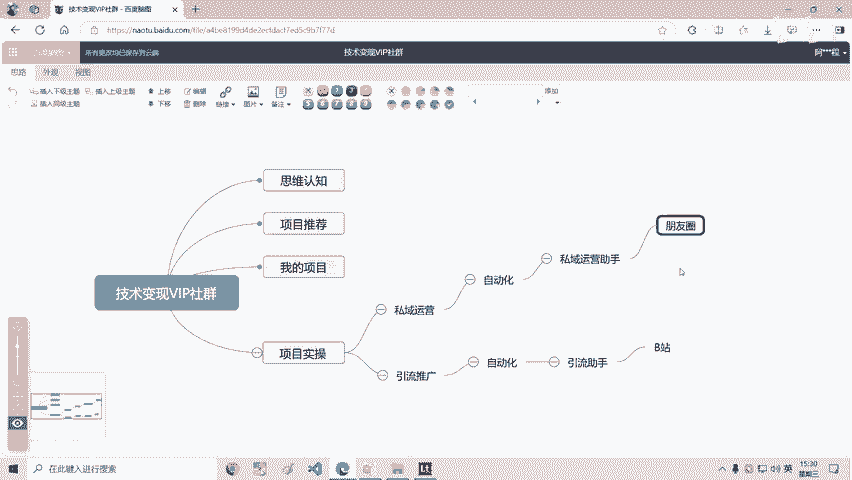
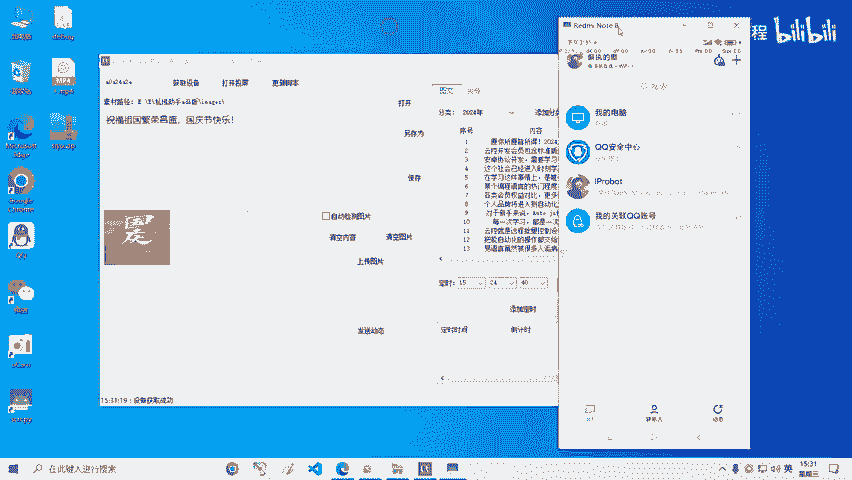
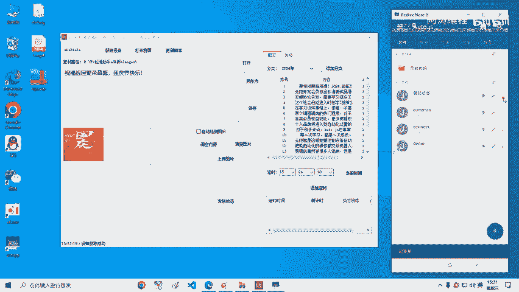
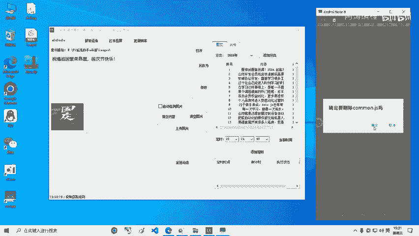
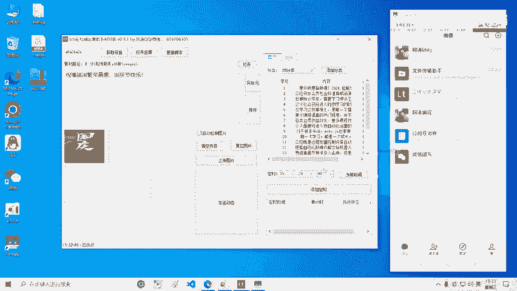
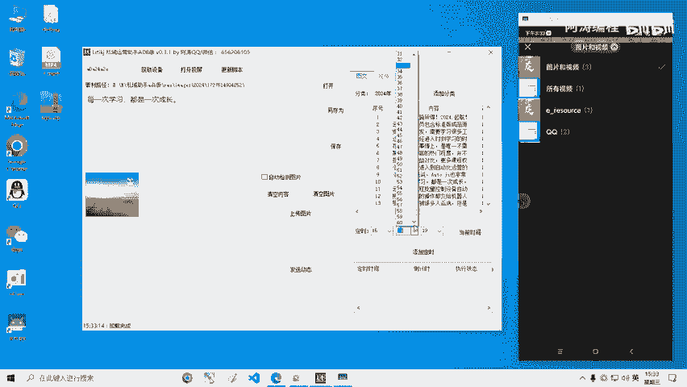
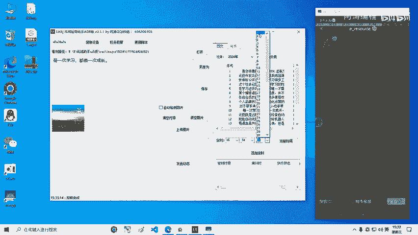
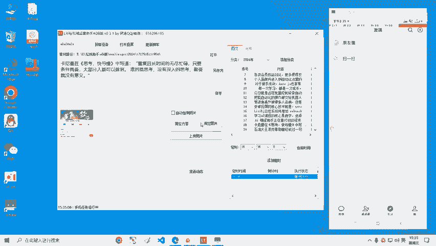
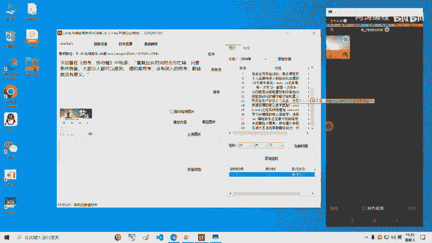
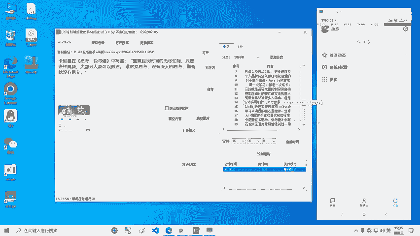

# 【软件】私域运营助手 v0.3.1版本 演示 自动发微信、QQ。 Autojs自动化脚本 RPA机器人 - P1 - 阿涛编程 - BV1Dn43eGE5t

好，那这段视频呢给大家演示一下私域语音助手这样的一个软件，它是它的一些功能。好了，那我们首先呢来说一下这个软件，为什么要开发这样的一个软件啊。

那这个是我们啊这个是我们技术变现VI社VIP社群里边其中的一个。小小的一个程序吧，小小的一个程序。那为什么要开发它呢？是因为我们在技术变现，这里边有一个项项目实操的一个板块，那要进行项目实操的话。

不不管是我们做什么项目都会涉及到两个方面，一个是私域私域的运营，对吧？比如说发发朋友圈了，发发一些这种视频或者说一些内容，是不是都要进行私域运营啊，还有一个的话就是引流推广，对吧？

这两方面我们做好了以后呢，基本上这个项目就没有问题。啊，那那既然涉及到私域运营，啊，那我们就是一方面呃一种方式呢，就是我们每天拿着手机自己去操作，找这些素材，找好了以后呢，自己给它去发送，这是一方面。

另外一方面的话，我们就是可以实现自动化，对吧？既然我们是技术变现，是不是我们得用我们自己的技术给他去。帮助我们去实现实现一些东西啊，对吧？所以说我们自动化的话，我们就开发出来这样的一个私域运营助手。嗯。

当然了，我们自己嗯包括我们自己也是在使用的，在使用这个私域运营助助手，也是根据我们自己的一个需求去给它进行设计和开发的那目前的话它是进行一像一些朋友圈了QQ这个动态了，都可以自动发送的。

其实到我们后边的话，只要我们脚本端嗯，电脑端目前我们开发的已经没有啥问题了，对吧？嗯，后边的话就是脚本端，只要支持其他的平台了以后呢，我们会进行其他的平台的一个支持。其他的平台也可以去支持上支持上的。

好了，那我们就简单的来看一下目前我们这个私域运营助手，它是什么样的一个情况。它现在的话能够进行图书管理了。后边的我们在升级的时候，就是这个视频。目前的话视频还没有没有去做。好了，那图书管理的话。

我们可以通过这个图文。

的一些分类了，给它添加分类都可以给它放到这里边，对吧？给它进行一些啊管理维护。因为我有的时候我们的这这些内容，你不是发一次的对吧？或者说你要进行发很多次，那我们就可以给他管理起来。

并且每天去想去发送的时候，一个是你可以直接去发送。另外一个的话，你可以进行一个定时。把每天要发的，我们都可以给他定定时到这儿，到他发的时候呢，就会自动去发好了，那这是我们呃这个。😊。

电脑端它是通过一言开发的，然后我们脚本端呢接的是auto GS好了，我们可以打开投屏。首先呢我们获取一下，目前我们这个是。控制单设备的，也就只能控制一个设备。后边的话我们会把批量的这个控制给它去做上去。

好了，然后点打开投屏。打开了以后呢，这是我的这个手机连着电脑的一个手机的一个投屏。那我们打开这个凹 to GS好了，那在这里边我们就可以先把这里边的内容给它去删除掉。

这之前的一些。程序先给他删除掉。

好了删除。然后呢，我们可以去点击这个更新脚本。那这个脚本呢其实就是在我们的这个目录像有一个S呃，这这里边是有这个GS文件。那我们这个点击这个按钮的话，就是相当于把那些文件就直接拷贝到手机里边了。好了。

点击更新，点击刷新。O它就进来了。进来了以后呢，我们可以点击一下这个连接啊，点击运行好，点击管理这儿其实就已经运行起来了。当我们点击连接了以后呢，它就会每隔好像是5秒5秒还是10秒啊，它会进行判断一次。

看一下我们这儿有没有发指令。如果说我们这儿发指令了，它就开始执行。好了，我们简单的去发一个吧，假如说我们这儿啊就就发这个吧，就发这个，然后的话我们就是直接。😊，啊，直接写一下吧，直直接这个直接发送。好。

点击发送。点击确定。

好了，他开始执行任务。好了，这个过程的话其实就跟我们之前讲的这个IP robot，也就是我们。呃，讲到脚本端的一些自动化的时候就一样了，它就是进行一些自动化的一个操作。好了。

然后呢我们可以在这里边去选择一些，比如说选择一些程序，我们给它是定一个时都是可以的啊。比如说我们选选择呃一分钟以后吧，一分钟以后。

好，点击添加定时。这样的话我们这个啊这个它就已经定上时了。但这个走完了以后呢，它就会去执行这个程序执行这个内容。好了，他现在正在正在去发送。如果说我们这儿脚本端正在运行着，它这到了以后呢。

它也不会去执行。因为它会检测到在这里边呢，有程序正在运行。那，我们可以再去看一下再去。再去找一个吧。点击。添加定时。当前时间。啊，35。确定。😔，好了，目前我们呃目前我们的这个定时的话。

只能定当天的那我们后边的这个更新计划当中呢，会给他进行一个。呃，进行更新的时候，比如说定定上选择日期，可能你定一个星期的，或者说定一个月的，都是可以去给它设定的。并且说目前只能是选择一个程序，对吧？

选择一个程序你去进行。那到后边的话，我们可以选择多条内容。然后呢，每天可以让他每天每个时间时间点去随机发送也好，或者说按顺序发送也好，到时候都会发送。好了，那现在的话，刚才那个。😊，呃，它已经消失了。

就证明那个已经执行了。就在我们的这个定时里边呢，它已经执行过去了。我们可以看到它现在又开始了，是不是又开始新的一轮的一些发送啊，这个就是我们目前目前能实现的一些内容。当然像这些功能了。

都是呃进行一些这种图入管理的时候，像这些功能会用到其实像自动化的话，就是依靠手机上的auto GS，它会通过在这个手机上的这个autoGS呢实现一个自动化。目前我们是只适配了这个QQ和微信，对吧？

这两个因为微信和QQ的话，这我们可以把它当成我们自己的一个思域去运行。到后边的话，我们会接入。

啊，更多的一个平台。你不管哪个平台，你是想进行这个运营的时候，对吧？你你进行运营的时候，反正就是一要么图文，要么是文章，要么是视频，是就这些东西。其实我们在电脑端把这些东西给它去设置好，到后边我们去。

呃，进行功能的一个扩展的时候，那也就是手机端的一个功能扩展。好了，那我们这个就先给大家演示到这儿，后边我们再有更新的时候呢，我们再去给大家录视频。好，再见。

