# 【运营干货】双十一大促临近，新手开拼多多店铺如何快速起店 - P1 - 拼多多老兵 - BV12J11YdE7A

一个拼多店铺从零做到日销几千单以上，其实并不难，做的好的话，基本上一个月都要不到。很多人店铺做了好几个月都没访客，没订单，那基本上都是因为自己没有正确的操作思路，没有好的操作方法。

这个视频来给各位做一个总结，如何在一个月之内快速起店，建议点赞保存好。视频中提及到的一些玩法操作以及更多的一个配套运营资料，大家都可以按评论区所述方法自行领取。接下来正式进入我们的话题。

首先呢我们店铺开好了之后都是比较基础的。第一件事情是上架，上架的话呢，如果你有款不要上太多，一次性上个一两款两三款就可以了。

然后呢核心的工作就是先去做DSR在店铺后台首页可以看到你的DSR需要在近30天之内有50条有效评价才能显示出来。假设一条评价67块钱，对妮只需要30来块钱就可以把这个事情搞定。

只需要4天时间就能触屏做出来之后呢，这个权重加成才有。然第二件事情就去破层级。不要让店铺一直停留在一层级二层级样流量天花板很低。😡。

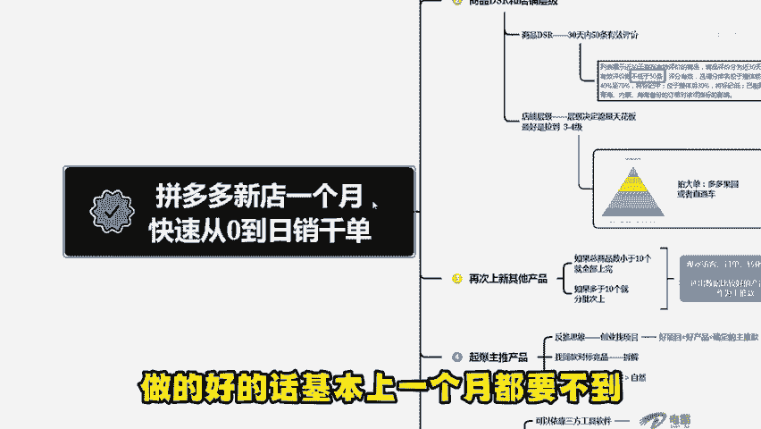

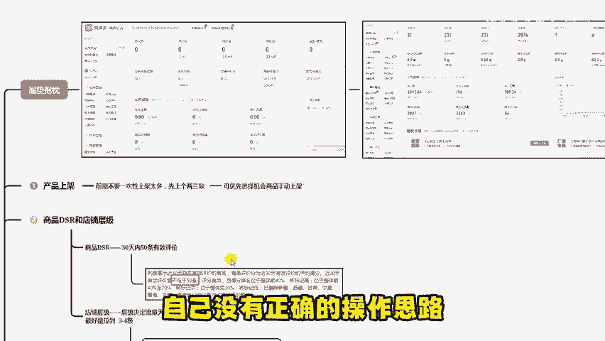

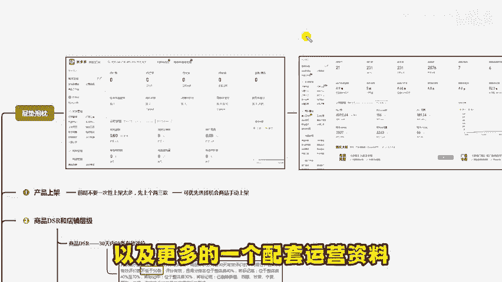

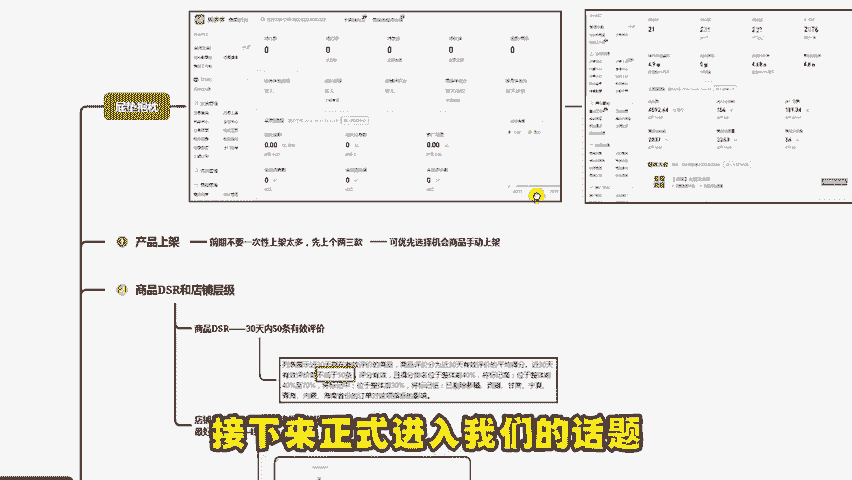

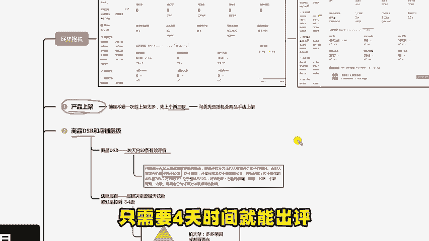

拿不到流量，要直接干到三层级、四层级以上。到我们的经营总览里面，可以看到你要在近30天之内达到多少销售额才能突破到第三层级或者四层级。对应着你就直接补大单就完事了。补大单的方法。

你可以选择多多果源或者直通车都可以把这两个核心工作做好了，你再开始去上新你其他的款式。这个时候店铺全都是非常O的。这个时候上新才会拿到流量复制。所以说不要一次性上太多，留到这个时候来去进行突破。

对应着你上新了之后观察几天的时间，看一下你这些上新的产品。他们哪个产品的数据最好，我们到商品数据里面去注意观察，看他的访客订单转化收藏这四个核心指标就可以了，选出来数据最好的，作为我们的主推款。

然后呢再去给他做评价，基本上做到这一步也就顶多十几天的时间，可能13天14天就全部搞定了。那后面还有半个月就是主要做这个主推款。首先的话呢我教你们一个思维叫反推思维，就跟创业找项目一样。

首先一得要找个好项目。😊。

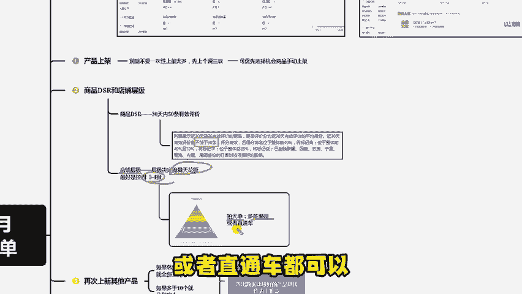

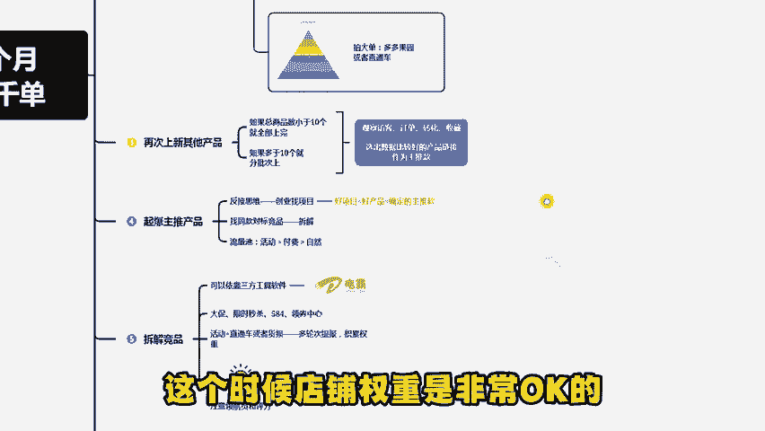

好项目的话呢，在PO里边就相当于一个好的产品。我们的主推款就是我们确定下来的好产品。好的产品，好的项目能够挣钱，先确定一个大前提，然后你就需要去拆解这个好项目，好产品是如何去做的，对不对？我们倒推一下。

如果说一个好的产品，在PO上面，它一天可以发千单万单，那我们就要研究它是怎么样去出单的，出单的流量位置是哪一些呢？在PO多里边的话，我给你普及一个经验啊，流量最大的属于活动流量，其次呢是付费流量。

再然后才是自然流量，什么意思呢？如果说你看到一个日发万单的店铺，它大概率是通过活动资源位上的首页推荐，而不是所谓的直通车硬拉升强拉升，更不是所谓的单纯的自然流量。当然你可以这么理解啊。

活动流量你也可以等同于免费流量啊，一个人一个说法。那首先我们定位了它是通过活动爆发的那我们就要分析这个产品参与了某种活动。那这个的话呢，你刷这个软件也好，或者说你通过第三方的工具。😡。

查到这个产品上了某个活动，比如说大促，比如说限时秒杀，比如说584，比如说一些领券中心，当你拿到了这个信息，你就知道哦，我的产品原来是通过这个活动能够爆发的，对不对？当然这个条件还不足以满足。

你要知道活动它是必须要配合直通车去进行的。或者说配合一定的货损经过两轮到三轮的提报权重的积累慢慢累积的这块穿插一个知识点啊，叫领航员和评分，很多大流量活动考核的是领航员和评分啊。

这也是前面我为什么让你们一定要把DS2评分做出来的原因之一。除了之后店铺后期的活动包括活动推荐都会在一定的范围之内去筛选一些特定的活动给你，那么当你知道这一步，你就知道你需要用的工具是哪一些了。

直通车活动相当部分的货损O那么就是一个顺序的问题。我这块教你一个顺序啊。首先我们如果说是一个大单量红海类目的话呢，一定是通过活动爆发的。但活动的前提支撑是必须。😡。

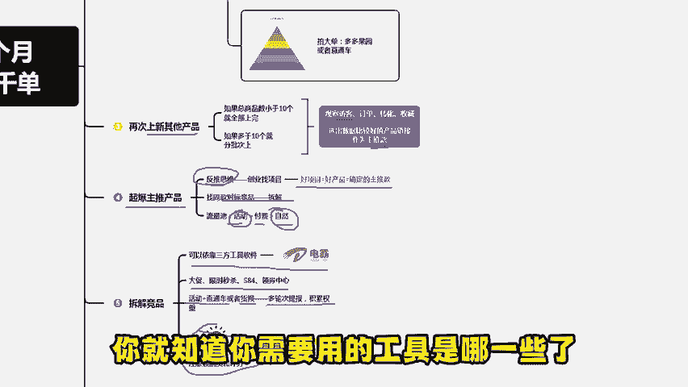

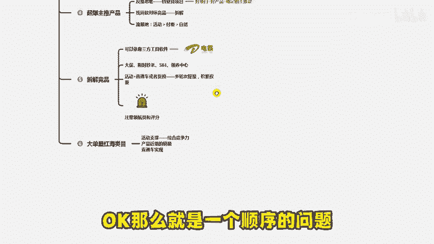

需要有近期的销量。这个叫综合竞争力。大家可以记个笔记啊，何为综合竞争力呢？就是产品近期的日销近7天的近14天的怎么样达到呢？你没有想过呢？怎样达到呢？我刚教过反推性思维。通过直通车去去拉生什么补单呀。

刷单啊压克力点用都没有，它不叫有效坑产，通过平台出了单，才能够累计真实的评分真实的领航员，所以你只有一个工具，就叫直通车，当然这里我也不能一棒子打死。如果你的刷补单是成交到直通车里应该也是可以的。

那回归到我们刚才所说的付费流量它是有限的，对不对？所以付费流量只能够达到一定的单量，而不能让你完全的爆发，所以在付费流量达到刚才所说的综合竞争力等于近7天的日销之后呢中间穿插报名活动。

让活动给直通车加权加曝光配合的方式拿到你想要的单量。如果觉得有用，请不要吝啬你的一键三连。另外还想要学习更多运营干货或者找我诊断店铺，获求一些。

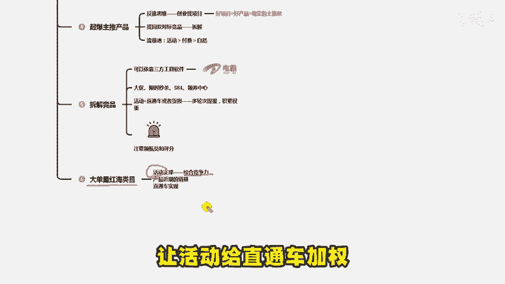

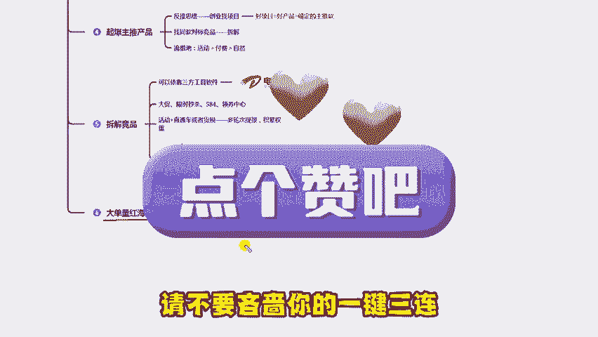

店不上的建议和规划的，可以评论区自行领取。