# 【运营干货】新手想开拼多多店铺，标品一定要慎选 - P1 - 拼多多老兵 - BV1RZ2UYnETW

这是一个骨灰盒标品，如果让你去运营，你会怎么做，你可能会说不就一个字吗？耍没错，是个电商人都会这么说。但是我想让你理解的更深刻一些。现在那我们先从下单决策点的角度来思考问题。首先下面这两个产品。

如果是你你会选哪个思考3秒钟。大多数人应该都会选第二个，因为价格更便宜，这里是标品的第一个下单决策点，价格到商品差异化不大时，价格决定了转化力，下面呢还是这两个产品。

这个时候你会选哪个你可能根本不会犹豫，转头就选了第一个为什么因为第一个销量太高了，哪怕另外一个便宜几10块，你也不敢买，怕踩坑呢？这里是标品的第二个下单决策点，销量思考到这一层。

你基本上就抓住了标品的核心要素，销量为我。因为这类产品差异化空间较小，买家。😡。

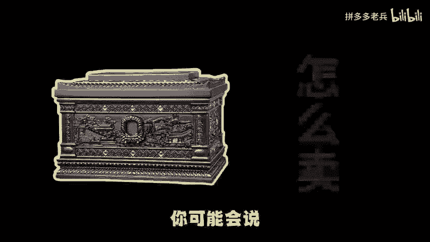

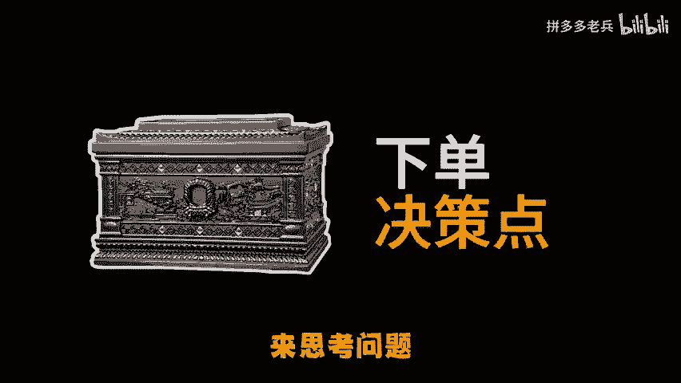

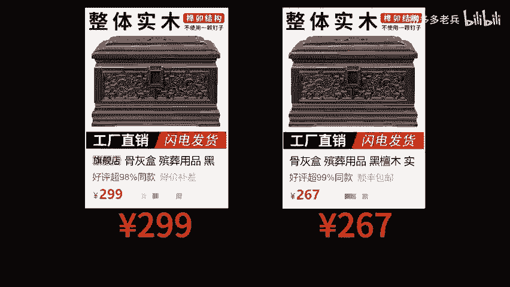

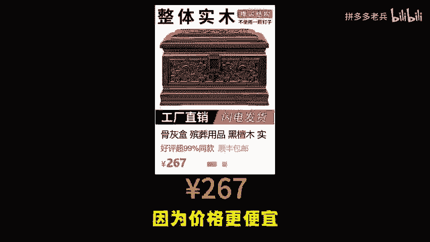

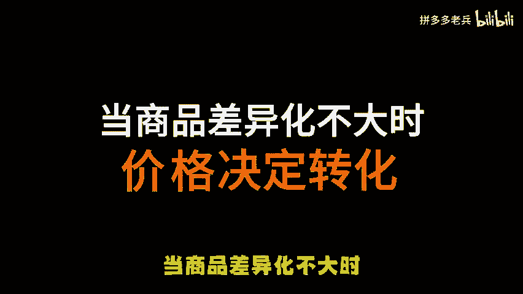

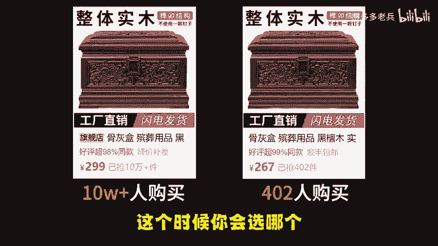

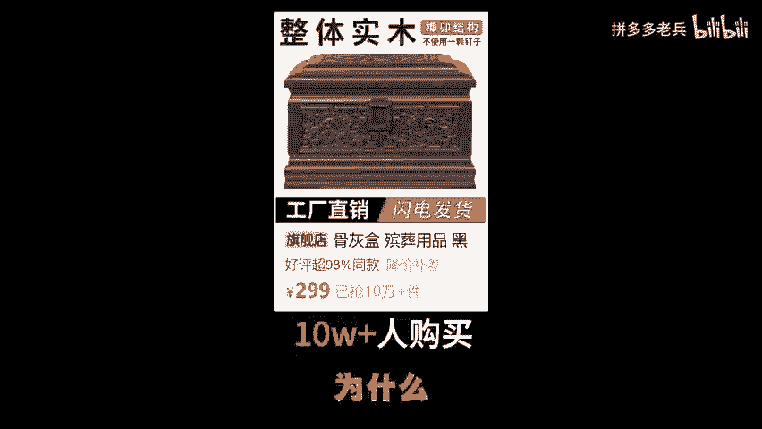

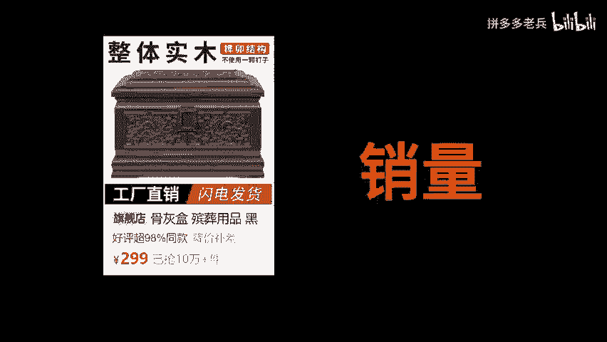

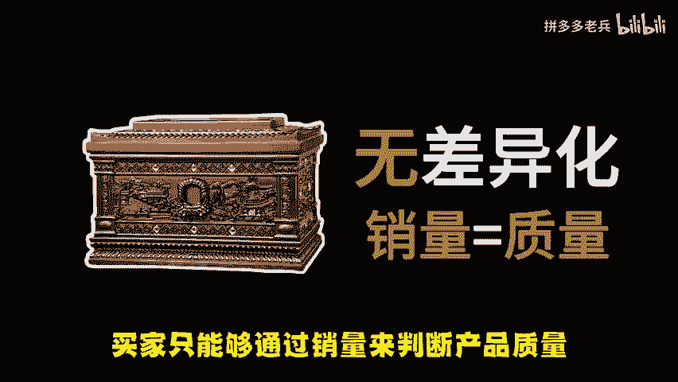

只能够通过销量来判断产品质量。所以标品的玩法最常见的手段就是批销量。比如说袜子。😡。

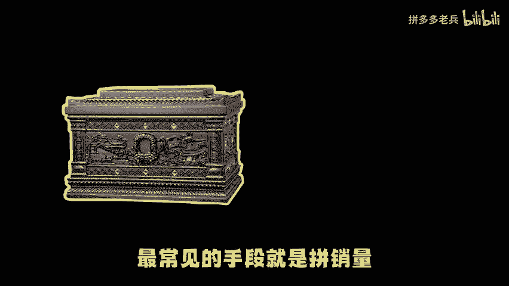

哦，不好意思，发错了啊，下面一个。哎，不对不对，不是，这个不是这个啊，就拿普通袜子来说，成本1块钱的袜子，我卖20元，你觉得贵。但是因为我的月销只有100件。但我做到月销1万件的时候。

你会觉得是因为我的品质好，所以贵。但我做到月销10万加的时候，你会觉得我是大品牌。这种情况下，那些9。93件装还包邮的袜子，在消费者心里就变成了劣质低价的产品了。我说我家袜子透气耐磨不凑价，穿了能知之。

你的会员以下线，因为我的销量摆在这里，所以为什么会有那么多的卖价前期各种活动冲量，因为量变产生了质变。当你个销量达到一个临界值的时候，去开直通车基本上可以把转化来吧。转化率高，人均标签呢自然会精准。

那么自然收索流量也起来了，这就是标品操作逻辑啊其实很简单，但是得及资源很难，大多数卖家的资金预算是值。😡。

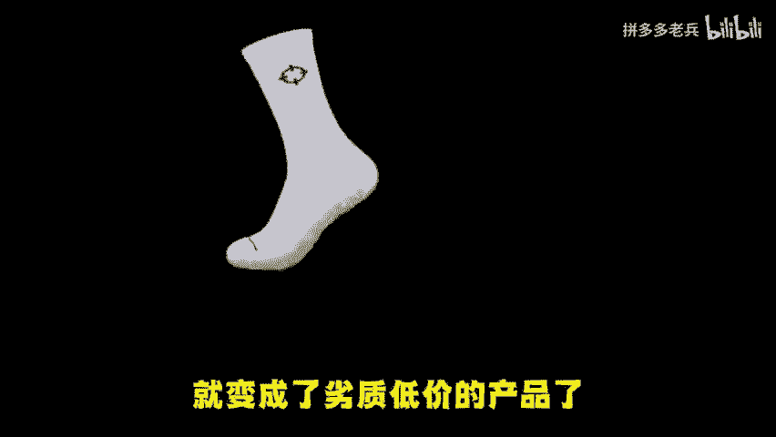

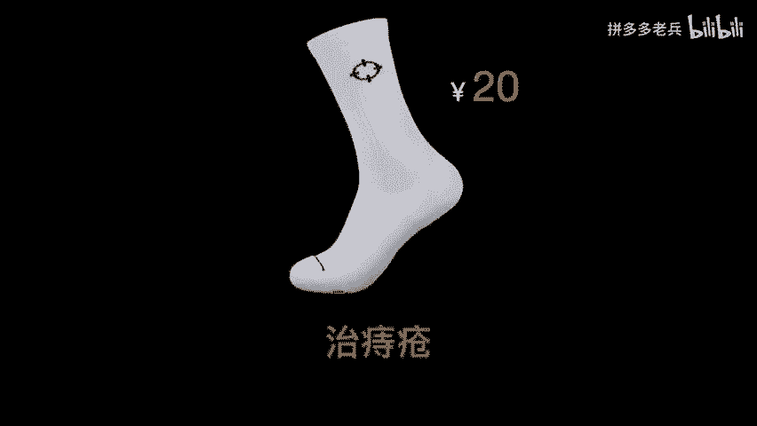

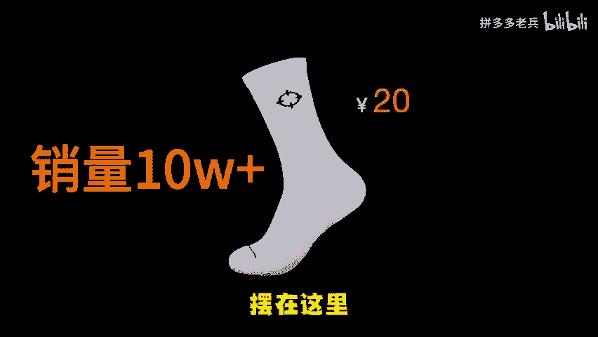

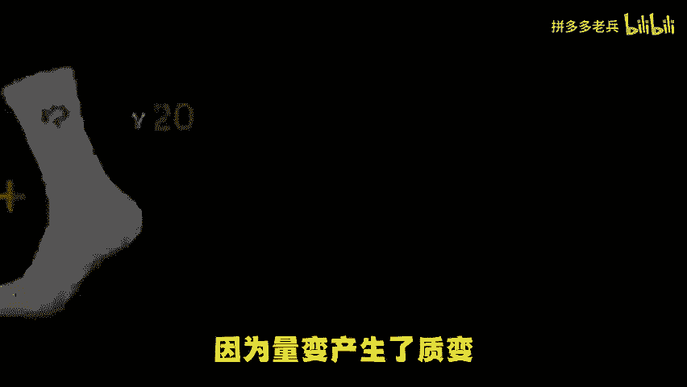

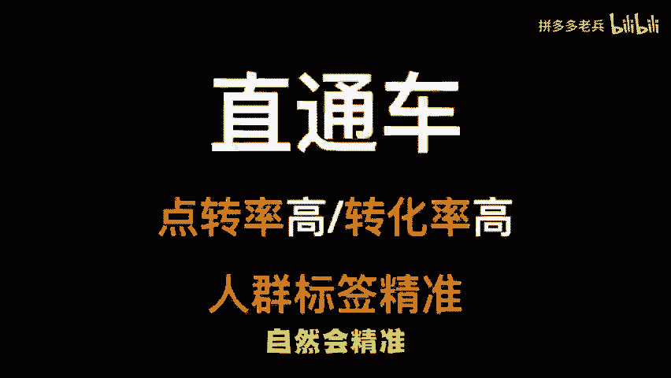

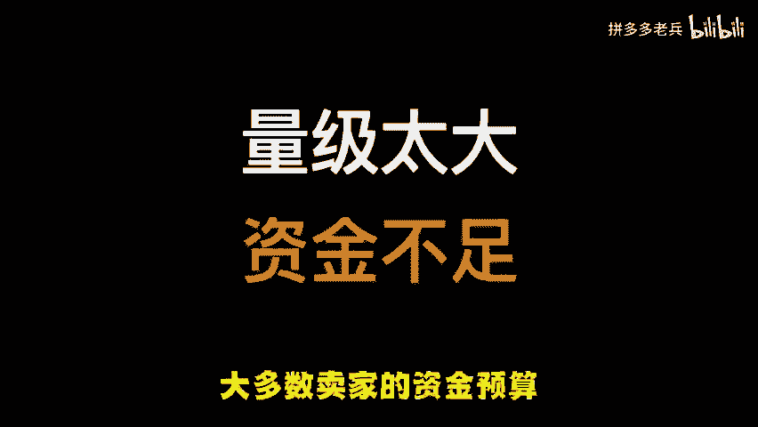

撑不起他们所做产品的量级的。因为无论是低价跑直通车还是低价走活动，前期啊都是亏损的。除非啊你有大量的老客户群，但你可以安全且低成本的完成原始的销量积累。但是新店基本上不可能具备这样的资源的。

所以啊有资源真的什么拼度而做。但是呢如果你又没资源又没资金，就不要去碰那种纯粹的标品呢，什么是纯粹标品，就是没有半点可以差异化空间的产品，只能拼销量和价格的产品。不果你拼不过还去做。

那最后只能是钱货两空。好了，了解更多拼多多运营干货，评论区找我领取。😡。

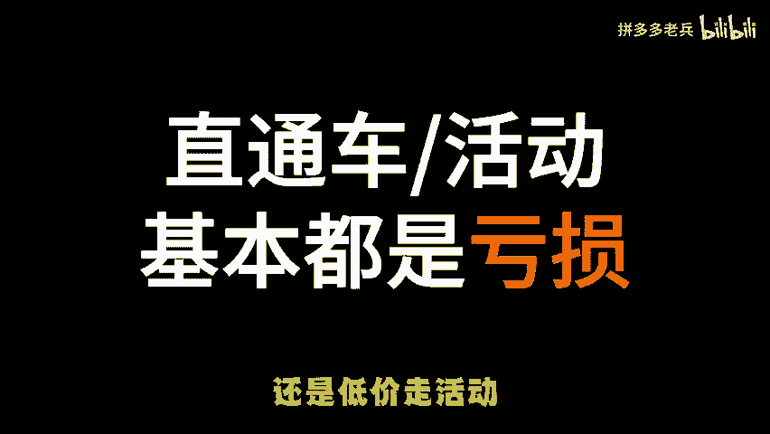

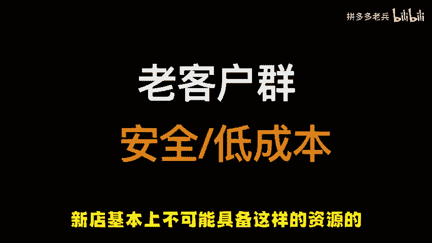

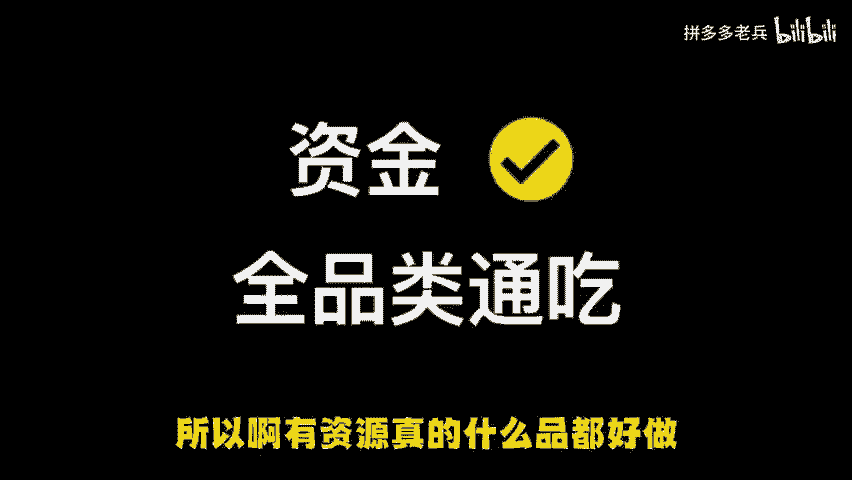

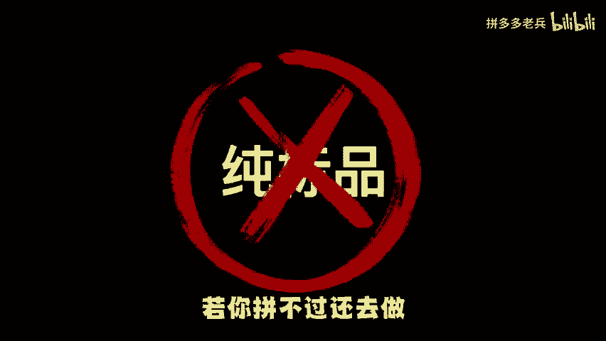