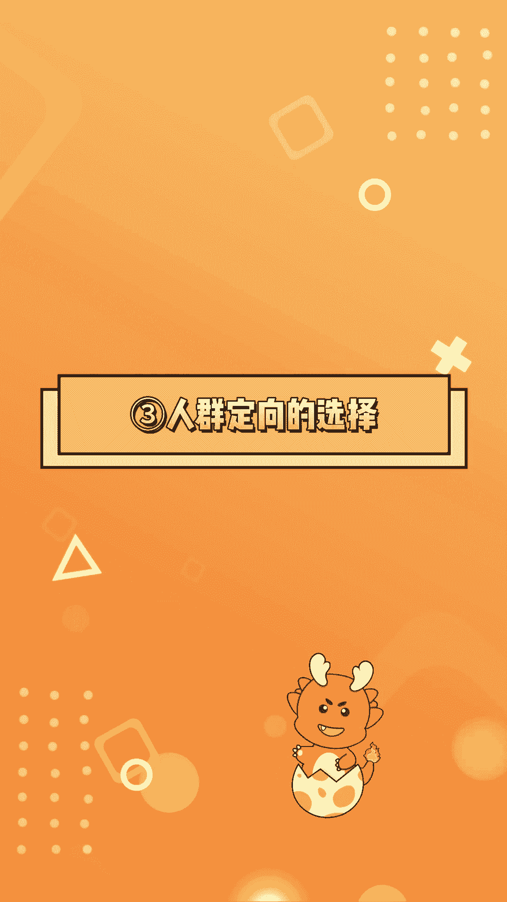
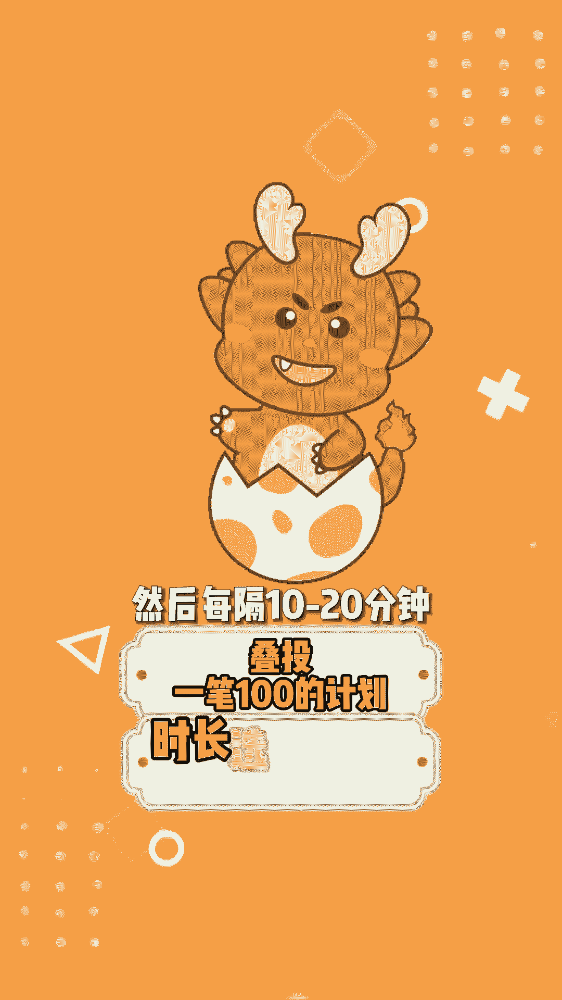

# 【随心推】低客单直播间起号怎么投？一分钟看懂直播间的随心推投放流程 - P1 - 小火龙随心推 - BV1Ci421C7Ei

低客单预算有限的直播间起号怎么投放，随心推，今天分享完整的投放流程。

首先是优化目标的选择，预算有限时随心推，就只跑直播间成交的深层目标就行了。

不要去跑直播间下单的浅层目标，因为我们要拿到比较精准的流量去建立模型。

然后是选择投直播间画面还是投短视频引流，如果直播间主播能力比较强。

尤其是主播能够自然转化流量的，就选直投直播间画面。

但如果主播能力一般或者表现平平，那么头短视频素材更适合。

因为短视频相当于先种草了一遍，那么观众愿意通过短视频进到你直播间，说明本身已经是有兴趣了，即使主播表现力不是很强，只要产品讲解到位。

下单购买的可能性会大很多，接下来是人群定向的选择，选择达人相似可以帮助我们更快的打上标签。

但投达人相似，想要有比较好的效果。

除了你的主播要接得住流量外，产品本身也需要比你的对标达人更具优势。

特别是价格的优势，否则可能跑不出去，或者把人拉过来了，但是没有转化。

如果你觉得自己比对标达人弱，那么就选择自定义或智能推荐就行了，最后是投放的节奏。

开播先投放两笔100元的计划，第一条计划投放半个小时。

快速引入流量，拉高人气和在线主播要配合拉停留和互动，第二条计划投放两个小时，投放时长拉长会让流量来的更加匀速，保证流量比较精准。

才能有成交，然后每隔十至20分钟叠头，一比100的计划时长选择两小时。

下播前一小时停止叠头，然后在盯盘过程中，一旦发现计划消耗比较快，而且ROI跑得正要及时追投，如果觉得人工盯盘手动操作比较麻烦。

可以用小火龙分批定时投放计划，并设置好自动追投规则。

起号阶段可以一直按这样的节奏投放，以成交计划为主。

当你的账号累积了出了几百单后，可以逐渐转向用ROI计划进行投放，以实现更低的转化成本和更稳定的RI。

关注小火龙主页。

