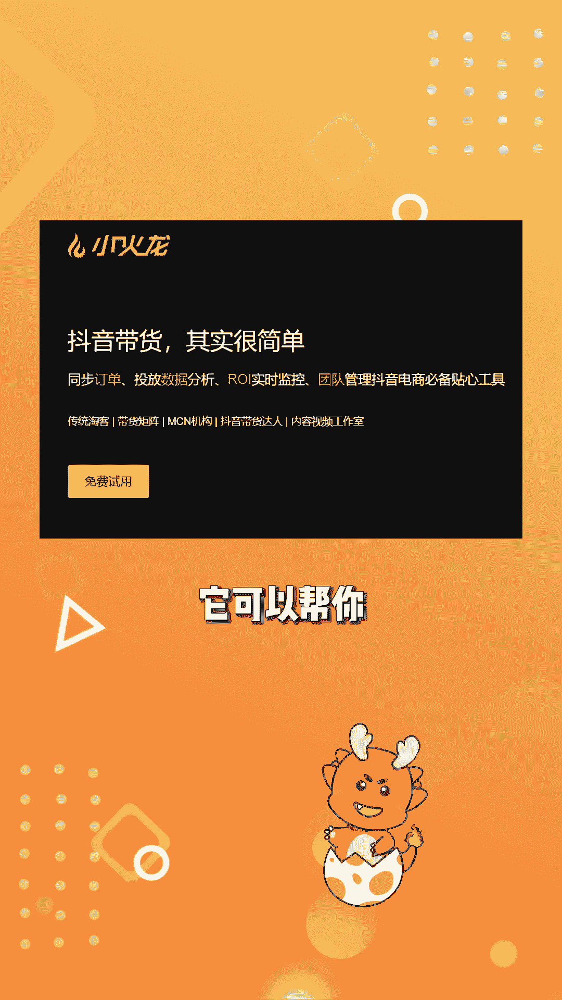

# 【随心推】新手投放要注意什么？看透3个问题帮你加速起号！ - P1 - 小火龙随心推 - BV1Zs421N7JF

新手投放小店随心推要注意什么，很多人刚接触小店随心推，投放时总会碰到各种问题，流量来了却不见转化，手动出价又害怕亏本，别担心。

今天就来讲讲新手投放小店随心推，需要注意的几点地方，首先不要只依赖自动出价和系统智能推荐。

虽然自动计划看似方便，但对于新手来说，自定义人群和手动出价才是关键，因为新号没有标签属性，出单数据和人群模型系统，前期不清楚什么样的人群适合你的账号和商品，自动出价的人群可能并不准确。

容易导致有流量不出单，会有流量只出几单的情况，前期应该以手动出价为主，找到一个人群不会犯，但是流量又比较多的出价范围等计划能出单，且RR是正的时机，在乙醇自动出价区放量，第二不要害怕手动出价拿不准。

很多新手一听手动出价要出佣金的一点几倍，甚至两倍就慌了，觉得手动出价太高，肯定会亏损，但其实手动出价只是设定一个最高价系统，不是只探索这个最高价的人群，而是所有比这个价格低的人群都会去探索，帮你抢流量。

只要素材优质，有时候出价非常低，也可能抢到流量，而且不是一下子让你出价几倍，如果计划消耗的很慢。

再看看压价，如果计划消耗的太快，可以适当降价，第三要根据出单量选择定向方式。

出单已经比较多，就投系统智能推荐，因为出单多的时候，成交人群画像比较精准，智能定向也不容易跑偏，前期出单少，还没有人群模型，就投自定义定向人群，或者前期可以自定义加智能推荐并行，但不要只投放智能推荐。

你要知道随心推投放还有一个视频建模的过程，需要不断出单探索和数据反馈，来推送更精准的人群，降低你的成本，以上就是新手投放随心推需要注意的点了，最后如果你想要更智能化的投放随心推。

可以使用小火龙，它可以帮你批量投放。

随心推自动关停亏损计划，自动复投，高产计划等，提升投放效率。

把更多精力放在素材制作上，关注小火龙主页。

