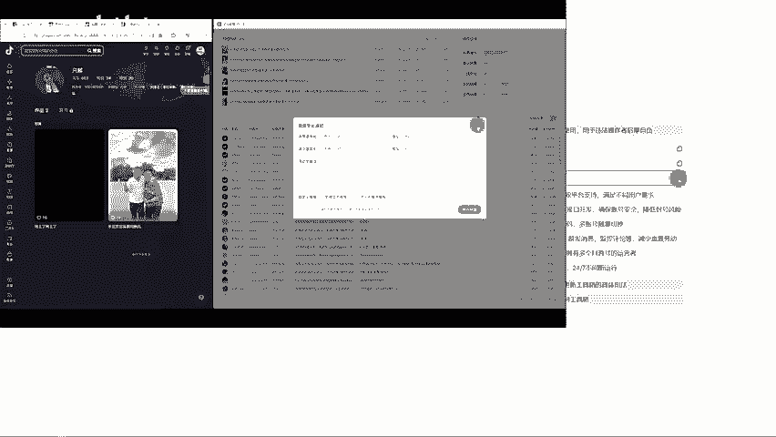
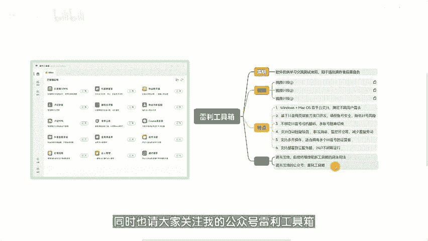

# 【雷利工具箱-简介】抖音运营的得力助手，提升私域转化和精准获客的利器！ - P1 - 雷利工具箱 - BV1Yr8de7ECo

大家好，我是雷利。今天来跟大家分享一款呃抖音运营的辅助工具，雷利抖音工具箱。首先我要声明一下，这个软件仅供学习交流、测试使用，用于违法操作者后果自负。那在开始之前呢，我们就先来看几个这个视频片段。

🎼发送666。🎼等待工具箱响应。🎼卡片发送成功，点击卡片跳转。🎼长按识别二维码。🎼选择采集账号设置采集信息。🎼添加达人主义。🎼打开监控开关。🎼自动采集新增粉丝。🎼手动采集历史粉丝。🎼粉丝采集完成。

🎼展示粉丝信息。🎼支持多通道二维码。🎼点击头像进入主页。🎼点击抖音后进行复制。🎼点击已处理进行标记。🎼支持多种筛选。🎼支持数据导出到本地。添加药采及评论的视频。

🎼支持通过视频链接、达人主页链接以及关键词搜索添加视频。🎼支持部分选择或全选。🎼手动采集和自动采集均为采集新增评论。🎼可在批量操作中选择采集历史评论。🎼评论采集完成。🎼点击达人昵称，进入达人主页。

🎼点击粉丝昵称展示详情。🎼提供多种方式触达粉丝。🎼点击与处理进行标记。🎼支持多种筛选。🎼支持多条目数据导出。🎼支持实时导出数据。🎼支持数据变化通知。🎼多种变量丰富你的通知内容。

🎼好的，相信已经有细心的朋友发现了一些端倪。没错，从左图中我们可以看到雷利抖音工具箱有诸多功能，前面的视频片段向我们展示了其中的一部分。下面呢我来简单介绍一下这个工具箱的几个特点。🎼第一点。

windows和麦go OS双平台支持满足不同用户的需求。这一点从前面的视频片段里，我们是可以看出来的。第一个视频片段是在micgo OS上录制的，后面的两个都是在windows上录制的。第二点。

lady抖音工具箱的插件基于抖音网页端官方接口开发，不会因为软件本身导致封号，可以在一定程度上确保账号的安全。🎼第三点，软件不绑定抖音号或机器码，可以随时切换账号，也可以随时更换设备。第四点。

软件支持自动回复私信群发消息、监控评论等等，可以减少重复劳动，提高操作效率。第五点，软件支持多开操作，适合拥有多个抖音账号的运营者。第六点还是第一个视频片段应该有细心的小伙伴注意到了。

我是通过远程连接的那台苹果电脑。也就是说，我们可以将软件部署到云服务器7成24小时不间断运行，保证服务不中断。🎼受时间和精力的限制，软件的更多功能和具体用法，我就不在这里一一展示了。

想要了解的朋友可以关注我，后续我将会把每个插件的使用方法更新发布出来。同时也请大家关注我的公众号la利工具箱，与大家一起分享更多精彩内容。

谢谢大家的观看。