# 【顶级零基础新媒体运营教程】小红书运营最全讲解 起号涨粉／流量玩法／引流变现 一套打通运营 高薪就业！ - P17：16、新媒体运营第十课：笔记关键词排名机制演示 - 大咖私域运营 - BV1dHiueKEvf

哈喽大家好，我是方宇老师，欢迎大家来到我们这一堂课，那么这堂课呢我们继续来深入研究。

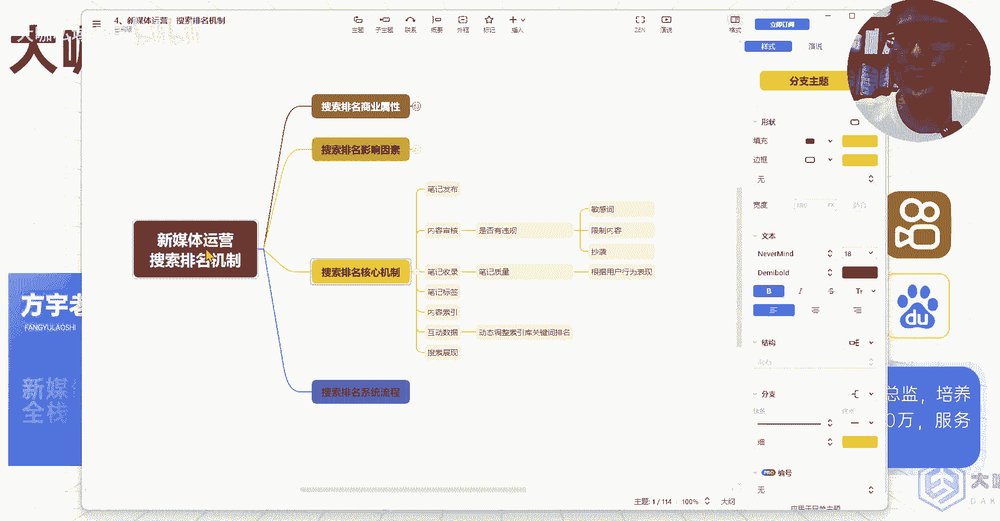

我们现在新媒体平台这样一个搜索排名。

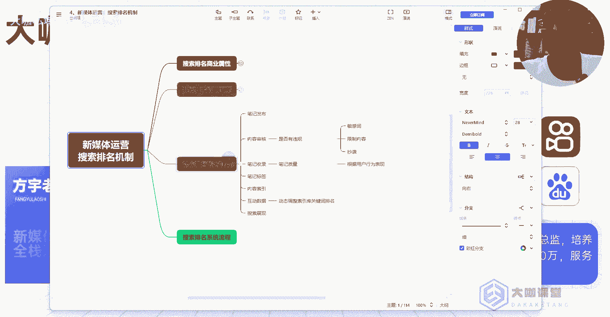

它的一个核心的机制，好吧，我们逐步来，大家带着大家把这个流程走一遍，OK好，那么首先呢我们从我们的笔记发布之后，我们开始我们来看一下它笔记发布之后，到底系统会对这个笔记做哪些工作。

第一步呢就是一个内容的审核了，内容审核呢主要就是看这篇笔记呢有没有违规。

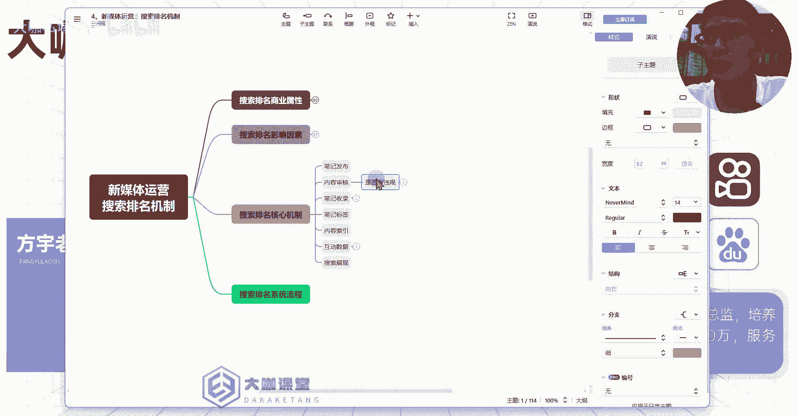

对吧，违规主要看哪些呢，你是否有敏感词，然后呢你是否有这个平台限制准入的这种类目，或者一些其他的非法的这种东西，OK然后呢其次呢再看你这篇笔记，他有没有这个抄袭，有没有这个呃抄袭别人的东西。

然后呢包括你的这个素材的重复啊，然后呢你的这个非原创的东西啊，这种呢一定会去审核一下的，好吧，当然这个我们都啊上堂课也讲了。

这第二步内容审核，当你的内容审核过关了之后呢，就进入到第三步，也就是我们笔记的一个收录问题了，那么笔记收入根据什么来决定的呢。

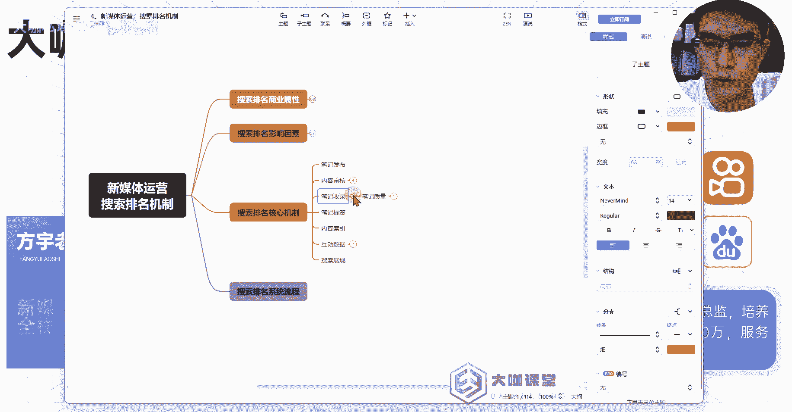

笔记收入呢根据我们的一个账号权重，和我们的笔记的质量，账号权重这一点就不多说了呢，你的账号所带，目前所在这个系统里边，所占据的这个流量层级啊，就代表了你这个账号，群众到账号只有一个权重的到一个高低。

然后呢这是其中一个因素，还有一个因素就是笔记的一个质量啊，并不是说你的这个账号呢目前权重比较高，你的账号的流量层级比较高，你发布的笔记他就一定会参与，一定会被收录，也会出现不被收录的情况。

那么这个笔记质量就来决定了，笔记质量是根据什么来确定的呢，质量这个东西到底是谁来决定的呢，呃相信看过这一整套课程下来的同学，应该都知道了什么决定的用户对吧，用户的一个行为表现。

能决定你这篇笔记的一个质量怎么样，那么尤其是到了一定流量层级的这种呢，笔记他的这个呃笔记质量的一个凸显，是更加的直观的，你比如说你的这个账号目前权重很高对吧，你的笔记发布出去之后，你的基础播放。

你的基础曝光啊，就有1万个，那么这1万个曝光里边，我们正常的可能讲，至少说10/10分之二对吧，3/10这样的一个情况，会有用户呢来点击你的这个笔记，那么如果说你的某一篇笔记的点击量。

连1/10都到不了对吧，也就是说你连1000个小眼睛都没有，你只有这么两三百个小眼睛，那你这篇笔记肯定是有问题的，那么用户的一个行为就能告诉系统，你这篇笔记不行，那么如果说你。

比如说我们现在的流量层级还比较低，你的初始的小眼睛呢，你的这个曝光呢就只有千把对吧，然后呢千把的曝光，或者说甚至1000曝光都没有500的曝光，哎这里边呢你能有200的一个小眼睛，虽然说小眼睛数量不多。

但是整体的你的这个呃笔记质量，可能说在这个流量层级上面表现的还可以，那么在这种情况下，你也可能你这篇笔记被收录的可能性就会更高。

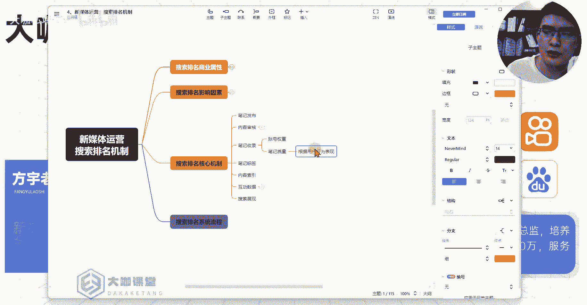

OK这个是笔记收录，那么当你的笔记收录进去之后的同时啊，我们可以可以讲收入的同时，你的这篇笔记呢，系统就会对你的这个内容啊进行一个分析，分析，什么呢，分析你这篇笔记的一个特征，知道还有没有同学记得。

我之前讲的这个内容当中呢，有关于笔记特征提取的这么一节课，这么一节课里边讲，我们呃系统它会根据你的笔记的内容的关键词，你的tag标签，还有你的某些其他的这个呃账号的一个，历史行为数据的表现来提取。

你这篇笔记可能是跟哪些内容相关的，还有用户的一个反馈，也就是说你分发出去的100个用户里边，十个用户跟旅游相关对吧，假设说你现在做的是旅游的内容对吧，十个用户对旅游感兴趣，然后十个用户呢对女装感兴趣。

还有十个用户呢对数码感兴趣，诶这100个用户，十个分类当中有一个跟你的这个领域搭配的，这个十个旅游相关的人群，他们对你的笔记表现还可以对吧，那么就可以从侧面反映出，你这篇笔记可能是跟什么啊。

跟旅游相关的，那么这就是提取我们的标签和特征了，这个时候呢它就会提取你的标签对吧，你的笔记他会给你打上，你这个笔记是关于什么的呀对吧，是关于旅游的啊，还是关于什么内容的，你的从哪些方面来提取啊。

这个标签的提取就是我们前面讲的，你像这个啊，我们先把用户标签写进来吧，然后呢用户的标签，还有你的这个呃账号历史数据对吧，你历史你以前发的这个笔记，然后呢给你打上的标签是什么，然后除了历史数据呢。

还有你的这个标题呀，啊就是你的关键词了啊，剩下的就是你的关键词，也就是说从你这篇文案当中拆分出来，提炼出来的，你这篇笔记是关于什么的这样的一个关键词，好吧，这个关键词我就不写了。

它里边的因素在前面我都已经讲了，这个就是标签好吧，它来对你的标签呢进行一个分类，最终呢得到的比较关键的值，反馈出来的就是标签这么个东西，也就是说会给你的笔记呢打上一些这个啊，打标签好吧，打标签好。

那么接下来呢就到了我们的内容索引了啊，内容索引是什么意思呢，就是它会根据提炼出来的这些标签啊，在它的系统里边对你的内容，在不同的关键词里边去进行一个排序啊，就是他提前给你把这个关键词的排名。

已经给你排好了，不是说你搜索完关键词，它再重新在这个数据库里面，对你的这个呃内容去进行排序，不是的，它是在这个笔记收录之后，把你的标签打好好之后，它就会根据你的标签的历史数据表现啊。

呃就是现在的数据表现以及提炼的这个标签啊，以及它的这个呃后面的一个数据波动，来决定你在某些标签下面的一个关键词排名，那么内容索引这个东西呢，它是一个呃比较复杂的动态化过程。

但是呢我也有办法来跟大家演示出来。

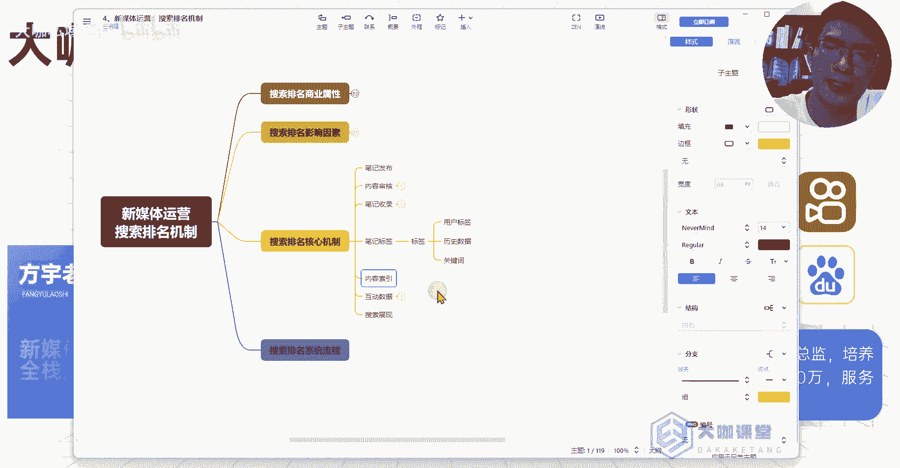

那么呢这里呢我准备了一个画图好吧，准备了一个画图，这个画图呢我们用这个画图呢。

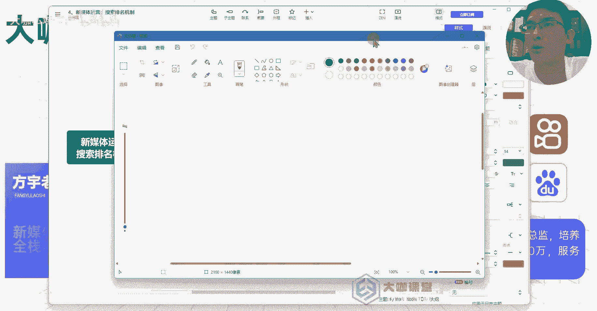

来跟大家展示一下，系统到底是怎么来给我们调整我们的排名。

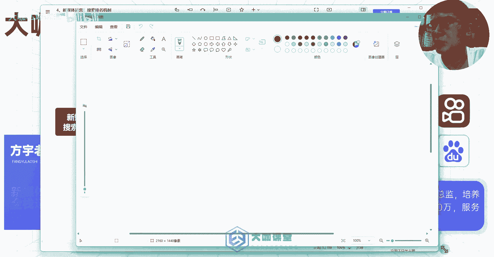

或者说在索引库里边来给我们做排名的，当然了，我们要做这个事情之前呢，我们得先要有一个笔记，OK有一个笔记，那么笔记这里呢我就写个标题好了啊，我们就写个标题，我喜欢的微软雅黑呢啊好，就这个这个笔记标题呢。

我想想啊，我们写个什么呢，我们写个跟旅游相关的吧，嗯8月去云南，云南，旅旅游的完整攻略，学生党必看，完整避坑攻略吧，OK然后呢我们给它加个粗，然后改个颜色，我觉得这个字还有点小了，给它加到14吧，16。

好那么假设说我们现在呢写了这么一篇笔记哈，我们写了这么一篇笔记，这个就没有办法调整了吗，好没办法调整算了，咳咳那我们现在写了一篇这个笔记，我们先不管文案内容哈，我们来看一下系统。

从我们的标题和从我们的文案内容当中，它可能会拆分出哪些标签来，那我们先列一下啊，我们从这里开始列嗯，首先第一个哈，我们先取几个代表性的吧，啊云南对吧，这是第一个，然后呢除了云南还有什么呃旅游哎。

这个能不能保持一样的高度啊，旅游，OK然后的话呢还有个是云南旅游，云南旅游，然后学生，然后呢还有避坑耶，我的字写错了哈，才发现咦，哦我还想起来一个事，那上个视频呢，呃不是点了B站某些视频吗。

呃上个课程里边，然后我本来是把系统声音关了的，结果呢我后来浏览发现诶这个系统关了，跟我这个手机的好像没有多大区别，然后呢还是这个声音给录下来了，那么给所有的这个耳机党同学们道个歉啊，不太好意思。

这个这个后面呢我注意啊，注意尽量我们呃不在这里边去播放这个视频，或者说我提前准备好，OK好，那么呢这里呢我们暂时就通过这个标题呢，我们先得出来这么几个标签，那么系统呢我们模仿系统。

它现在把我们的这个笔记啊，分割到了这么几个标签里面，我们来看一下，假设说我们来模拟一下啊，假设说我们在这个云南下面有这个呃A笔记，然后呢还有B笔记，C笔记，D笔记，一笔记F笔记。

OK然后呢这里边呢我们现在我们是基笔记，然后呢我们给他改个颜色，哎我们现在排名在哎，这个不是很好，不是很亮眼哈，我们呢现在在这个记笔记这里，我给它打个标识，啊啊就这样嗯，好我们现在呢是在云南，这里呢。

在索引库里边提取到我们关于云南的笔记，因为我们这个笔记里边肯定会有这些词，我们现在模拟这个过程好吧，这个是呃云南下面的好，然后呢接下来是关于旅游的，然后呢在旅游下面，我们在这个下面我们的笔记排名诶。

可能就不是这个了，我们在这个旅游下面的笔记呢，我们可能排在这个F这一位，好然后呢除此之外，云南旅游，云南旅游，那么我们这篇笔记呢排在这个D这里吧好吧，D这里，然后呢在学生这里，来。

学生这里呢我们排在这个额，排在H吧，稍等一下啊，这个不是很智能，也没办法复制啊，可能我不太会用这个画图啊，然后呢在避坑唉，这个字怎么又打错了，还筛了半天的好，然后呢在B坑这里呢。

我们可能处于排名一的位置，OK然后好，那么我们现在就是系统的对我们的笔记，进行拆分之后，每个比如说云南这个标签下面，它会有这么多的笔记排在这里，在它的索引库里边，那么我们笔记发完之后被收录了之后。

我们可能在这个笔记库里边，我们排名在这个位置啊，我们排名在这个位置，然后呢我们在旅游这个层面下面诶，我们的笔记也参与了排名，他在排名在这个地方啊，排名在这个地方F的位置。

然后云南旅游呢我们暂时排在地这个地方，然后呢，学生学生这个地方他也会参与一定的排名，然后呢这个呃关于避坑，它也会有一定的排名，也就是说相应的词汇，只要他体能提炼出来这种词汇。

我们笔记在相应下面也会有一定的排名，但这个排名数据呢它就不一样，也就是说在索引库里边，我们现在的这个索引库里边，也就是说我们在现在的这个索引库里边，我们的笔记呢排名都已经是定好了的。

然后呢当用户搜索云南旅游，他就会按照这个顺序呢去给用户去做展示啊，用给用户去做这个展示，但是这里边有一个问题，就是我们的笔记啊，它跟这些内容啊，比如说学生啊，我们是讲旅游的嘛。

我们的毕竟不是讲学生相关的话题，那么这个东西呢不相关，那么前期他会在这里有一定的排名，到了后期会有个什么情况呢，就是在这里边长期没有得到点击，长期没有得到数据支撑，那么后面呢你这个笔记就会从什么呀。

就会从这里被踢出，关于学生的一个排名，也就是说在初始的情况下，你是有这个的啊，这怎么调粗细来着，那么在初始的情况下，你的你后面呢你是有这个排名，但是在后面呢你长期没有这个数据表现。

那么这个地方就会把你的给踢出去，那么后面的学生你就没有这个笔记的呃，内容参与了，然后呢避坑也是一样，可能说避坑这个东西呢，我们没有专门去讲这个避坑，当然我是就情况来讲啊，就情况来讲。

我没有专门去讲这个鼻孔，那么这个时候呢你的笔记到后期在这里的排名，他也会被删除，也会被剔除，也就是说你的笔记后期参与不了这个排名诶，那么假设说我们现在笔记诶在旅游下面，还有云南，下面还有云南旅游，下面。

我们最终系统发现，我们的笔记在云南旅游下面呢，它得到的这个点击量和这个点击的这个数据，也就是根据我们上一节讲的这个。

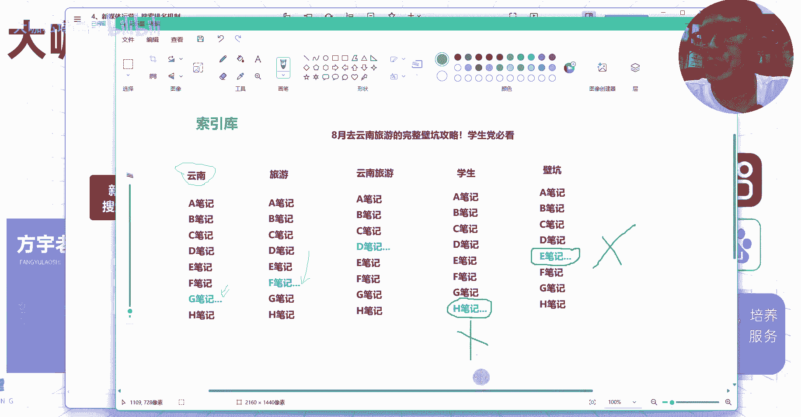

我们搜索排名的这个一些影响因素对吧，影响因素在这些影响性因素下面，我们得到的这个结果还不错。

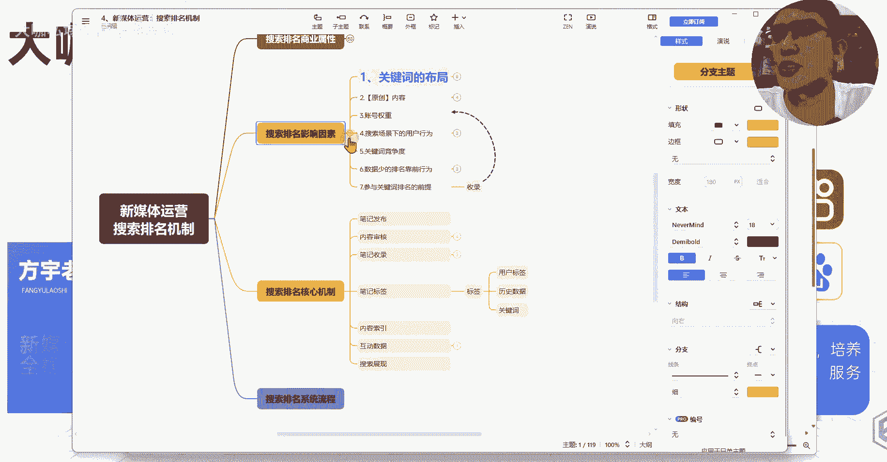

那么这个时候呢，你的笔记在这里边得到的一个数据，它就会有一定排名的上升，它就会索引库里边上升，唉也许到你上升到了第二名啊，也许你就上升到了第二名，那么同样的在其他的这个笔记下面，你有一定的点击数据。

这些标签下面你有一定的点击数据，但这些你可能你的这个，因为长期你的笔记内容跟他们不相关对吧，呃搜旅游的人呢，他可能了解的不是云南旅游，他们这部分人他就不想看云南旅游了，他就想看别的地方旅游。

那么你这个这个笔记呢在旅游这个大词下面呢，它就可能会下降，对吧，排到后面去，但是呢你又跟旅游有相关，有一定的展现，他也会有一定的点击行为，只不过睡得比较少，他不会完全剔除，然后呢包括云南也是一样的。

你的这个笔记啊，它的排名会继续往下坠，但是呢它不会完全删除，就是相关，所以说我们整个系统索引库，他在把你的笔记在他的一个索引库里边，去进行一个排序的时候啊，它是会有一个动态调整。

也就是初始排名和后续的一个变动排名，这个大家一定要了解好吧，一定要了解，这就是我们整个索引库的，我们模拟它的一个这样的一个过程，OK我们模拟它的一个这样的一个过程。

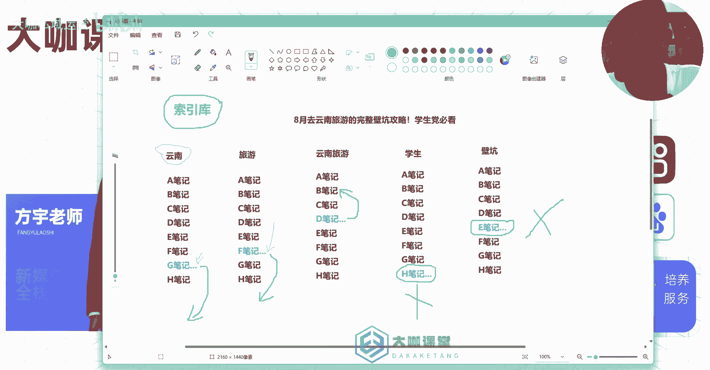

然后呢在这个过程当中，我们刚才所展示的他的一个变化，对不对，它的一个变化情况是根据什么呀，我们根据后期我们讲的，影响这个我们关键词展现的这些因素，比如说点击率对吧，搜索点击率，搜索的一个场景下的跳出率。

还有搜索场景下的一个用户的一个行为数据。

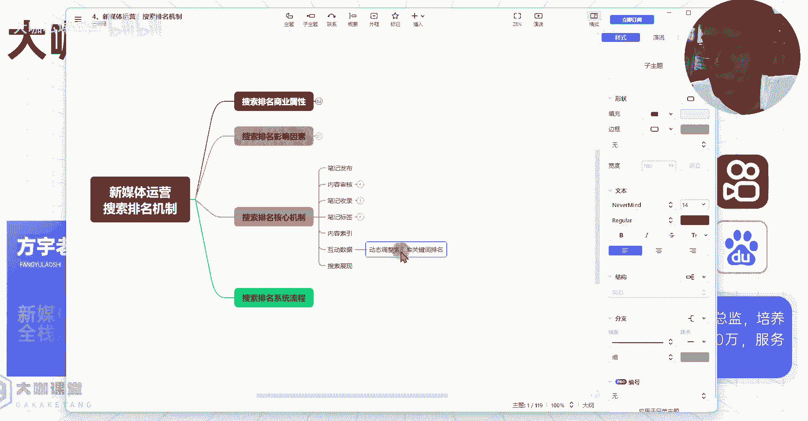

这些都会影响我们的笔记，在不同关键词下面的一个排名情况。

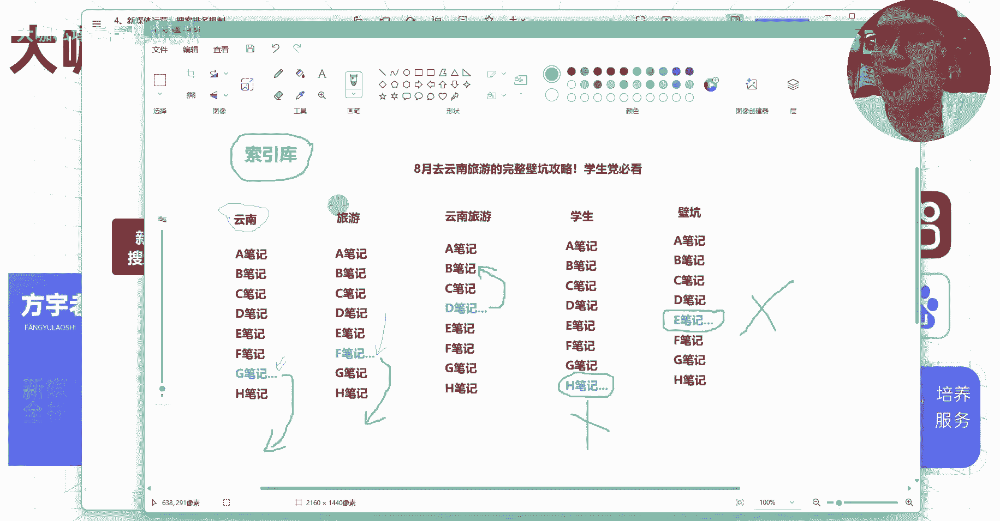

这个相信非常直观，大家也能了解了好吧，然后呢，当你的这个关键词在索引库里边，去调整好了排名之后呢。

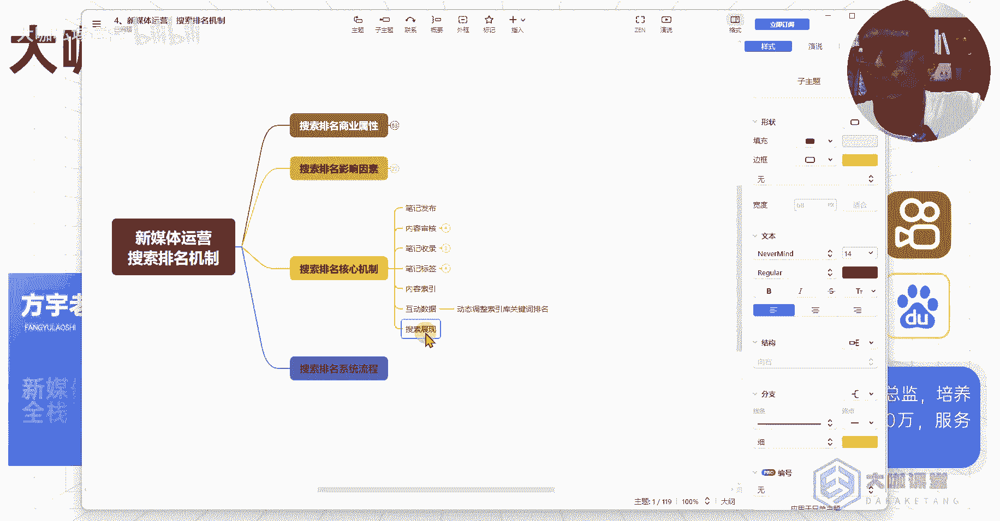

用户只要有搜索，你像搜索这个云南旅游哎，它就会按照这种排序来给你展现，然后呢搜索云南你可能排的比较靠后，但是你也会有展现，可能说你往后面多翻一翻，你能翻到，然后旅游也是一样。

但是学生和避坑这种特别不相关的，他可能到后期呢你就没有了，你参与不了了，当然这个呢我们一般很难去发现啊，比如说我们现在拿某图文平台来看，还有一个情况，就是有一个东西叫做还有一个东西啊。

有一个东西叫做动态排名，啊这个你们也要了解一下，什么叫做动态排名呢，就是我们现在新媒体这些平台啊，他们是非常聪明的，也非常智能的，就是他去做这些排名的决策啊，他去做这些排名的决策，你在某些情况下面。

哪怕说你已经得到了一个还不错的，这个排名数据，但是每一个用户他的一个搜索展现之后，搜索展现的时候，你的排名都可能会有一点动荡，甚至说呃同样一个词儿下面，你像我们这里有A笔记，B笔记，C笔记是吧。

他可能在这个地方啊，我再来给你们讲一下，好那么我们来看这个情况哈，在这种情况下面，某些搜索词啊，他会在下面呢去根据用户的一个行为数据啊，为了更好的去匹配用户的一个兴趣爱好。

就是给用户看更多他喜欢看的内容，他不会把这个搜索排名完全固定，就以我们这个什么呢，所以我们图文笔记平台，它会在这个地方去动态展示，你看C笔记是不是一样的，你看啊这个C笔记是不是一样的。

但是这个2号笔记AB笔记，这两个是不是就是不一样的啦，我这里用这个区分数字来标识了啊，一笔记又代表着排名第一的是另外一篇笔记，已经不是A笔记了，然后B笔记排第二的这个地方，已经变成了另外一篇。

叫做二笔记的一个图文内容了，然后C笔记可能是一样的，然后你的D笔记可能原本在这里，结果呢在这个新的排序下面，它排在了这个地方，这个原本的位置呢也不一样了，这一一对应的一个排名结果，这个大家能理解吧。

啊应该能够理解哈，也就是说在系统的它的这个某些关键词下面，这些热门的关键词或者一些呃呃，其他的关键词下面，它会有一些不同的这个索引库的一个值啊，会有一些不同的这种索引库的值，它不会像我们以前做搜索引擎。

我们以前做搜索引擎的优化，我们的关键词可能下面的排名数据，它就是一直固定的，你的更新呢也不会说很频繁，我们某一个搜索词场景下面，只要是我们的数据，我们的这个网站排的比较靠前的。

我们可能短时间内它就排的比较靠前，然后他的12345678名，基本上都是固定的，不会有太大的变化，都是同一个索引库的展现，但是现在的新媒体平台它变聪明了，他因他深知一个道理，什么道理呢。

就是你像我们现在笔记平台，图文笔记平台和我们的视频平台，你们会发现所有的内容他们的一个重复度，重复的这个概率是很高的，也就是说同样一篇呃，两篇笔记可能说他们的文字内容不同，但是他们讲的都是同样一个点啊。

你又不能说它说它不好，但是在这种情况下面，你在笔记内容严重同质化的情况下，我们平台要把流量平均分发给不同的博主，他就要给别人机会，他就不能把这个关键词排名去固定，那么他就得去腾出多个索引库。

我们这里演示了两个，他可能还有更多对吧，他可能还有更多通过这种方式去动态调整，不同数据，不同笔记，在这个呃搜索结果下面的一个展现情况，那么这一点大家能理解了吧，OK那么这就是我们这一节课要跟大家讲的。

我们呃这个新媒体平台，现在的一个整个搜索排名机制的完整流程，和它的一个呃动态索引的一个步骤。

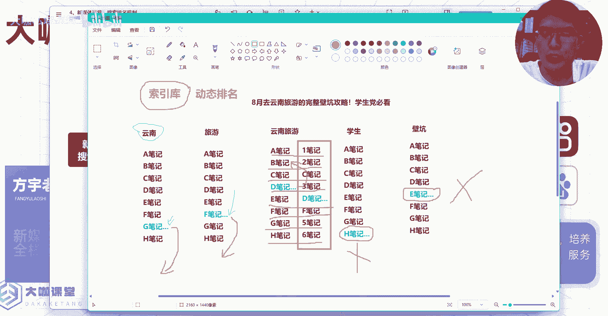

OK那么这节课就先给大家讲到这里。