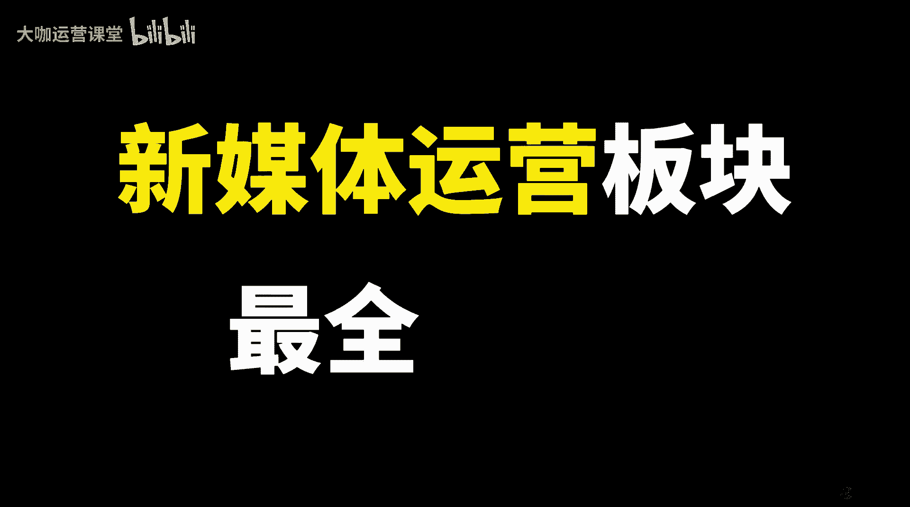
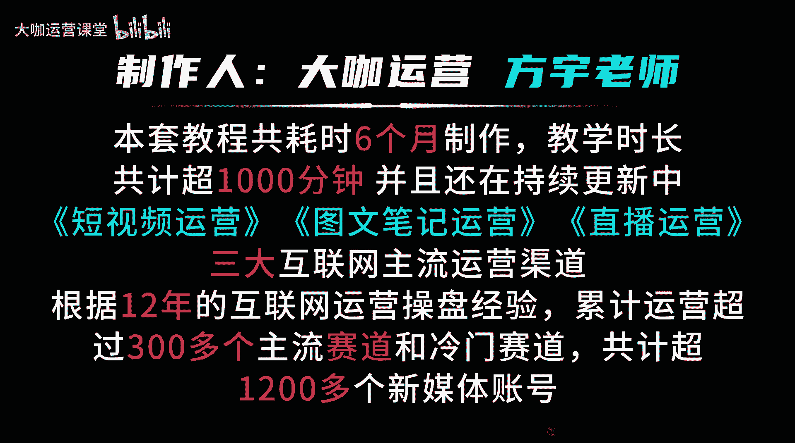
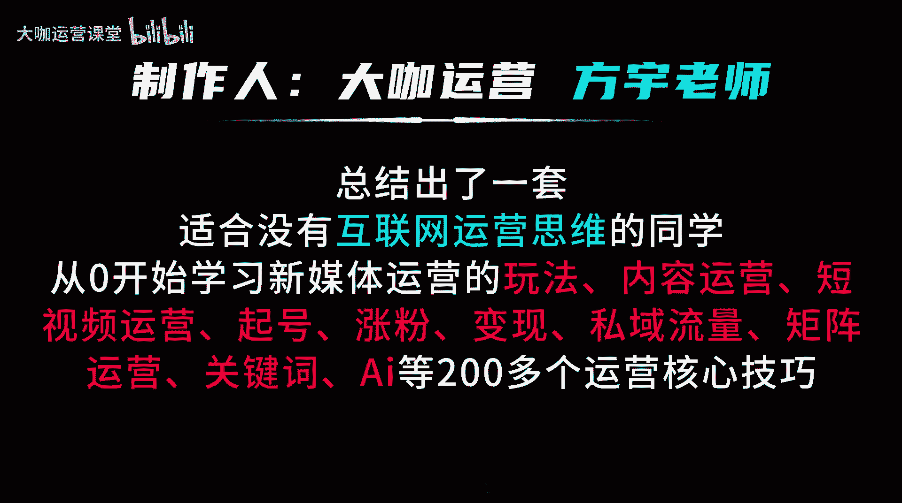

# 【预测这是9月最火的新媒体运营教程】小红书运营高阶教程 运营起号／涨粉技巧／爆文打造／流量算法 全程陪跑 15天就业！ - P1：001.新媒体运营 全套教学课程 必学第一课 - 大咖运营课堂 - BV1sCs5eTEtK

视频教会你新媒体运营，这是一套截止目前你从未见过的新媒体运营板块最全最新最深层的教程。本套新媒体运营教程共耗时6个月制作，教学时长共计超100分钟，并且还在持续更新中。

其中包括短视频运营图文笔记运营直播运营三大互联网主流运营渠道。根据12年的互联网运营操盘经验，累计运营超过300多个主流赛道和冷门赛道，共计超1200多个新媒体账号。

总结出了一套适合没有互联网运营思维的同学，从零开始学习新媒体运营的玩法内容运营短视频运营旗号涨粉变现、思域流量矩阵运营关键词AI等200多个运营核心技巧。大家好，我是方宇老师。

我从2012年开始步入互联网运营领域。截止目前呢已经有超过12年的互联网运营操盘经验，从2023年开始，我在B站分享的新媒体运营公开课视频呢累计播放已经超过130万。

那么这个播放数据呢在将来还会越来越高。那么这期间呢我也帮助了很多想要从事或者转行新媒体运营的同学成功拿到了具有一定实操运营经验的岗位offer。那么我在教学从业期间。😊。

带领和教学过超过100多家的企业运营团队，帮助他们呢去搭建新媒体的运营渠道、账号规划运营方案以及项目规划的SOP等等。同时呢我也会去教他们如何系统化的去运营一个或者说操盘多个账号。那么本套课程呢。

我会结合我12年以来的运营经验，针对目前互联网的主流的四个大方向进行深度讲解，分别是图文笔记运营短视频运营直播运营以及时下的互联网新兴产物AI的实战应用。那么本套教程呢，我会以通俗易懂的方式。

以小白能够理解的方式，深入为大家讲清楚目前的互联网各大平台的底层流量推送逻辑，账号的流量层级增长规则，搞清楚流量它到底怎么来流量呢又如何提升账号的权重呢又该如何去运营。

新手呢他又如何能够从0到1打造一个账号的爆款内容。不管是短视频也好还是图文笔记也好，通过运营的手法和技巧，让我们把所有在新手眼里，本来无法把控的运营问题，变得能够做到，诸如爆款复刻模式复制等等。

那么这套教程涉及的。知识点会非常非常多。当你开始学习的那一刻啊，我相信你会停不下来。并且呢每一节课你都会反复查看。那么接下来呢我们就正式进入到课。😊。

