# 【预测这是9月最火的新媒体运营教程】小红书运营高阶教程 运营起号／涨粉技巧／爆文打造／流量算法 全程陪跑 15天就业！ - P31：29、运营工具篇-运营必备 营销日历 每天都可以蹭热点 - 大咖运营课堂 - BV1sCs5eTEtK

hello大家好，欢迎大家来到我们这一堂课。那么这堂课呢我给大家分享一个我们做运营经常会用到的一个工具。那么这个工具呢我们一般叫它叫人营销日历。也就是说什么意思呢？我们做运营嘛，我们不管说拍摄短视频。

还是说我们需要去创作一些呃符合热点的这样的一个内容。其实呢我们有时候起号，或者说我们获取流量最快的方式，就是我们去抓取，或者说我们去了解今天明天后天或者这一段时间有哪些节日，有哪些热点。

或者说有哪些日常呃这个里边的一些经典故事什么的，我们可以去蹭的这些点，其实都是我们运营要关注的。因为做为运营，你就得了解有哪些东西是我快速可以让我们的短视频的流量可以起来的。那么这个营销日历是什么呢？

我们一起来看一下，那么我们可以看到有这样的一个界面，它可以根据每一天提供当天这一天的一个呃一些非常著名的，比如说中国大学的物理支付啊，中国物理学之付，这个事事，或者说英国的这个保罗安德人的诞辰啊。

然后呢这些都是一些相当于是呃可以说是什么呢？历史上的一些唉事件，我们呢去做内容。如果说你的内容呢能。😊。

刚好去挂靠上这一块的一个热点呢，那么你的流量基数就不会特别少。像什么宝马公司成立。那么坐汽车的可不可会以做。然后呢呃这个茶花女在威尼斯首演。

然后呢还有一些国际妇女节、马航MH370等等这一些呃热点话题都是我们可以去根据日期来规划做内容的。那么除此之外呢，比如说中宝马汽车公司成立，我们点击进去，他还可以提供给我们一些其他人在这一块。

其他的品牌方他们在这一块做的非常不错的广告。那么这个工具呢，我们在一些电商啊和一些这个什么呢？比如说618啊，比如说双十一或者是一些特别的节点，在这个时间呢。

就是很多人会提前去规划这样的一个节点去做什么样的一个内容做调整啊，一周内一个月的一个季度内，然后这个广告的一个它的一个给我们提供的一些参考或者思路呃，是我们做运营的一个我觉得非常有效的工具。

那比如说我们找一个啊。😊。

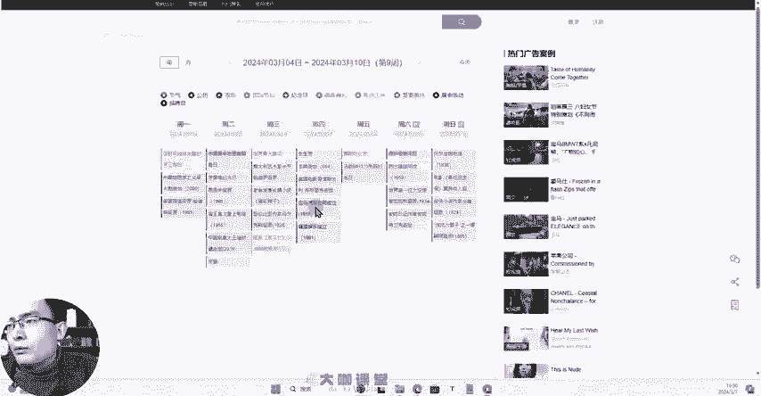

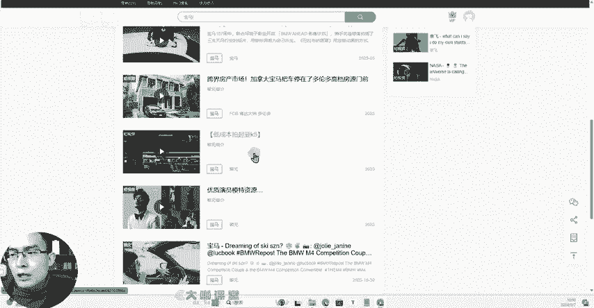

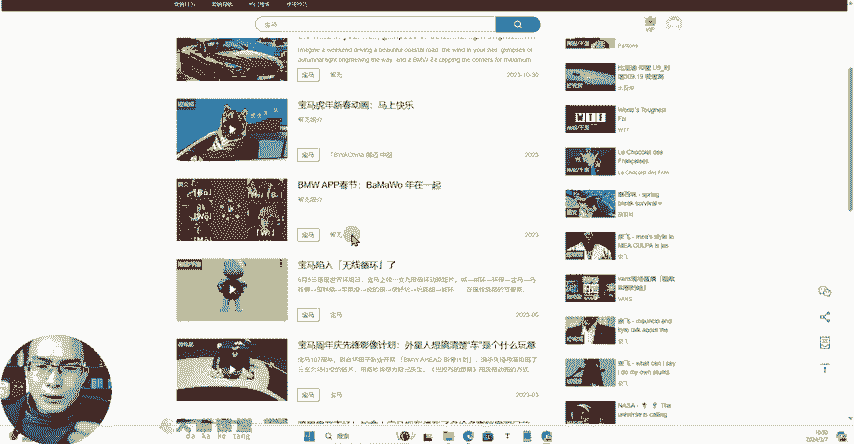

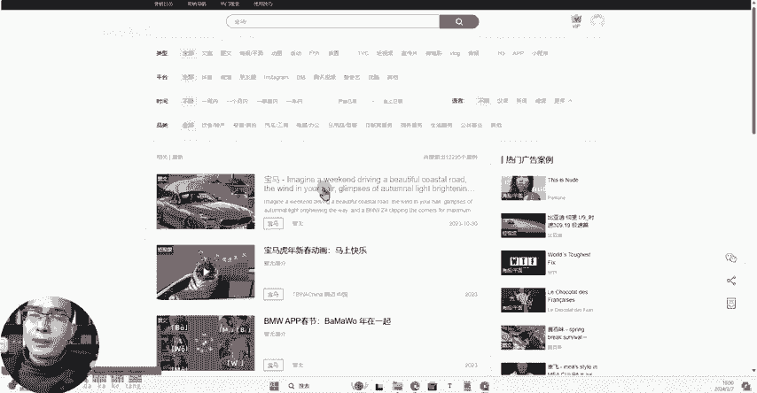

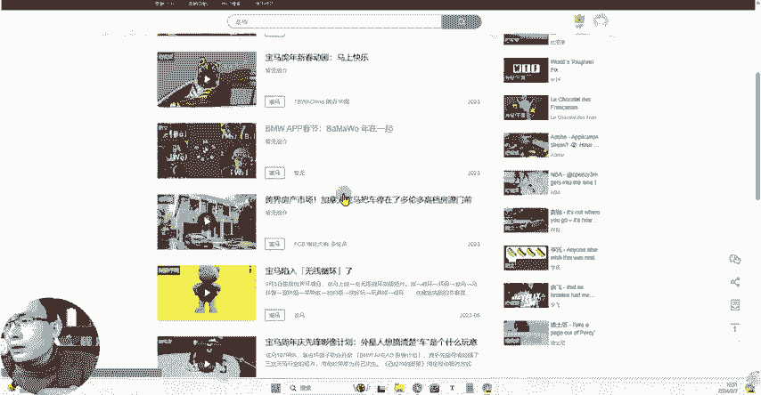

跨界房产市场啊，你看这个结合，这个就是房产和什么呀？房产和我们的这个呃。

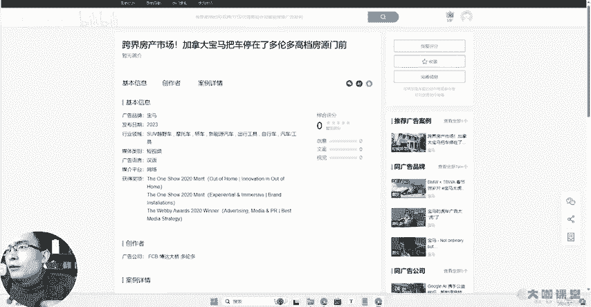

宝马汽车的一个结合点。

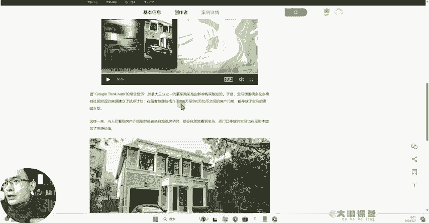

啊，我们可以看到它有具体的内容，我们可以结合相应的这样的一个内容来判断我们到底怎么去蹭上这个热点啊，像平台、抖音有哪些啊instagram有哪些B站、腾讯等等这些平台呢它做了一个整合。

那么能够给我们提供非常好的运营这一块的一个思路的方向。那么这个工具呢他的领取地址也一样，我放在我们视频评论区的一个置定评论，需要的同学可以去领取。然后呢呃我们后续也一样会持续分享更多运营这一块。

非常有用的工具。如果说你觉得内容还不错的，请给我的视频呢投个币点赞。然后呢分享给你身边有很多想学运营的朋友，让他们来看一看这套非常强大非常厉害的运营运营的系统化教学课。😊。

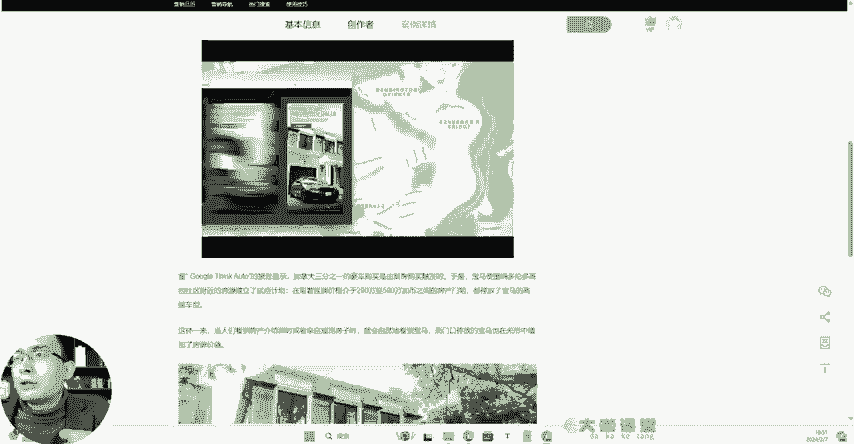

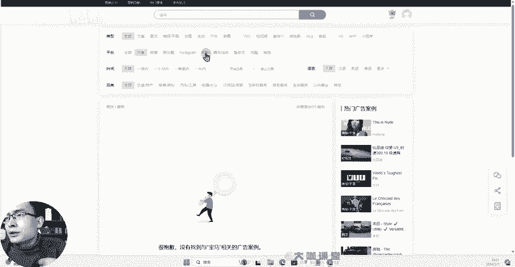

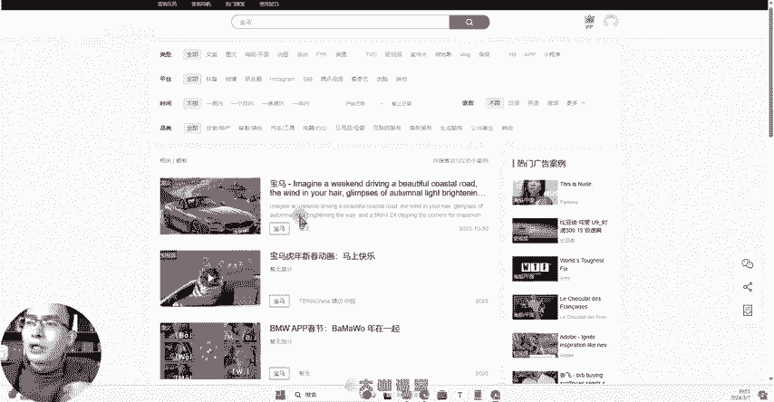

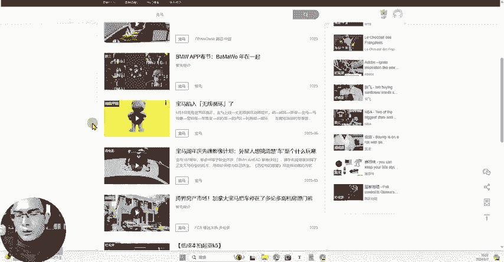