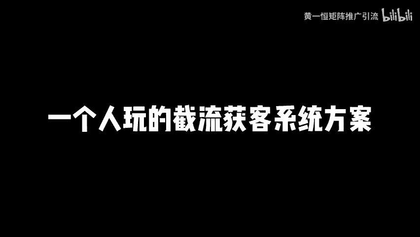
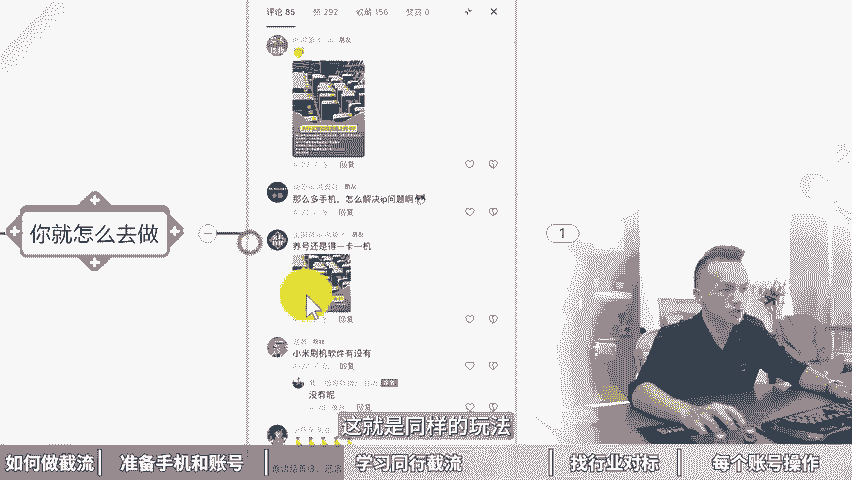

# 一个人玩的截流获客系统方案，截流引流5大具体步骤！截流是什么，截流获客工具，截流获客软件，同行截流玩法，获客截流系统，截流软件靠谱吗，获客渠道有哪些？ - P1 - 黄一恒矩阵推广引流 - BV12r421M7M7

🎼截牛你都不懂怎么玩，截牛还有人不懂怎么玩的，不过来问佩服他们不懂就问三人行吧，必有我师。今天就给大家拆解下解牛。🎼到三意一生万物，就从一开始一个人怎么完转截流季节废话，一个视频给你分享。

一个人玩的节流获客系统方案。节流引流五大具体步骤是不有点长，记得先收藏，一起来看，我要告诉你如何做节流，怎样准备手机和账号，如何学习同行截流，找行业对标，以及每个账号到底该如何去操作，频率是多少。

咱们先来看第一步如何做节流，很多伙伴搞截流，就是想找一个科技，想找一个脚本，挂在电脑上面点击开始之后就自动操作。我告诉大家，现在已经完全不行了。这种方式呢非常费账号，基本上每节10个流量。

你这个账号就挂了，所以搞节流相对来说会比较辛苦一点。他就需要把人效打满，锤人工操作，而且截流呢行业不限，可以说所有的行业都适合进行一个操作。只要有的行业有同行发作品，有目标群体，有目标用户。

我们就可以到上面去搞这个截流。那玩截流的时候，我们得熟悉一些规则。比如说用什么设备配什么账号，连什么网络发评论的频率是多少，这些我们都需要了解截流呢，他不适合说一天搞几千个人。

有的伙伴想一天加51000个人说截流能不能做到截流是做不到的。但是截流，如果你每个员工定个目标加个几十个粉还是可以完成的那该如何操作，怎么来看。第二步，准备手机和账号。我们在打节奏的时候，有个标准。

就是每个人呢至少得配1台设备，那10台设备呢就包含了10个手机，10个账号。那账号这一块它就需要去配什么，配10张听卡，什么的听卡呢，也就是我们去办理这个手机卡手机卡这一块呢。

建议大家尽量的去办这个18151319号端的死卡。如果你办的是虚拟号段，像比如说有的平台它会强制跳死名。你注册不使名就没办法往下操作。那有的平台如果是不跳实名的那你办这个虚拟号端呢也可以。

只不过目前这个三大运营商的这个死卡的话，30天啊，最多只能办一张。所以呢它是一定限制的，需要得记一段时间。为了确保我们操作是稳定性啊，咱们尽量的确保一机一号一网络，这个什么意思？相当于每一台手机。

我们单个平台是只搞一个账号的，但是可以搞多个平台，比如说啊我下载这个抖音快手视频号、小红书B站西瓜啊，注册账号，这个没问题。因为它属于不同的平台，不会关。另外每个手机呢需要配一个卡，这个卡也就是流量卡。

我们讲的是一个网络。也就伙伴呀，十台手机全部连系wifi，结果账号全部关联都挂掉了。所以咱们在做的时候，证的全部连审，每个手机都需要单独给他配一个流量卡。同时我们10个账号头像名称呢有个建议。

建议大家头像统一，然后呢明字这块呢抬头尽量统一。就比如说黄一横几证推广，黄一横几证号推广，黄一横几证推广引流，黄一横几证账号推广，黄一行几证营销，这样做的目的主要是为了加深印象，因为有的客户啊。

他看你一次看你两次没找你。但是看5至10字之后印象深刻，他觉得一这个人还比较勤快，他就来找你了，就获得了什么物业客度线索。另外咱们在搞节论的时候，对有个心态，什么心态呢？记住封号可以说是常态。

因有的时候啊咱们可能把控不好频率，把控不内容发上去之后呢，结果被禁言了，严重者来账号直接就挂掉，所以呢一定要习惯封号，账号挂了之后呢，我们要想办法赶紧去什么换下一批账号，然后呢进行操作。好，第三步。

我们下去学习同行是怎么搞节流的，大部分行业其实都有人在玩节流，你需要做的就找到他们学习他们，模仿他们其实就可以了。所以你要去学习他们是怎么做的。然后呢，你就怎么做，他们的节流文案，你可以作为参考。

拿过来改改修改一下，那么变成自己的就可以发布啊，比如说这里面像我这个评论区，大家如果经常看看，就发现很多人在搞节流，比如说像我讲到这个账号注册的呀，就人下面在卖流量卡了。

我们讲一级也号有网络立马他就来了IP流量卡为什么要买纯流量上网卡。然后呢，养号还得什么一级一卡，你看这里面很多都是什么，搞这个啊流量卡的。那如果我是卖了一张卡的，我参考他们他们怎么做，那我就怎么做。

是不是就完成了。再比如说这里面有一个做这个黄金项链的，我们找到对标。然后呢，这里面有一个数人号，他评论说这个怎么买？那么贴了个图，下方就有小号，立马评论说你搜什么里面有的哎，这就是什么团的玩法。哎。

再比如说这里面还有一个做珠宝的，然后呢，有一个数人号，我第一个不好看退了，但还好第二个超好看的项链都被问爆了。你看。

400多条评论是不是非常的夸张？点进来之后呢，全部都是求链接求链接求链接，光靠这一条评论就获得了什么上百个线索，上百个精准的名单和客户。那如何去找这个团行解决来？其实非常简单。

我们可以把自己当成一个真实的人，当成一个素人号。然后呢在这个素材号下面去进行一个评论，表达出自己有需求。比如现在啊我是要买这个珠宝的，我就去搜一些珠宝。比如说我们在这里面给大家示范一下啊。

比如说我们打开之后在这里面搜索这个。手镯。搜索完成之后，那这里面就会有很多很多的一些手术内容。为了方便寻找呢，咱们比如说就点开第一个点开第一个之后啊，我们打开评论区，在评论区这里面你就可以看到了啊。

比如说你可以。呃，那么在这里面表达一下你有意向，就是你吸对这个你比较感兴趣，这时候啊就会有人自动的拿去给你互动啊，包括来找你你就可以看一下别人整个流程怎么玩的那如果你想看别人的评论其实怎么发的人，哎。

你就可以去什么，可以去直接去看别人的评论就可以了。反正不管做哪个行业，一定要去多刷一些作品，这些作品都有很多人在进行一个操作啊，你可以看一下男朋友送的真的好看，那，这些都是一些什么啊，参考的评论。

在哪买的好看。你看下面立马就有人在什么再进行一个评论互动啊，这里面就会有人在搞这个截流，啊，表达自己的需求。那如果你的同行没有人做怎么办啊，其实有的行业确实存在这个情况，因为截流这个方法。

在圈子里面搞的人比较多，圈子外的话，其实啊玩的人比较少。所以我们可以找到一些热门的同行，比如说大健康减肥护肤。如果实在不知道，你就看看我的作品下面，包括。刚才演示的这个手镯。

包括还有前面讲到的一些黄金项链都可以的。以用户的方式去进行评论，那么会有人私你啊，会有人去啊艾特你去找你啊，当别人啊私信你的时候，你发什么话意啊，保存好，作为参考，跟进你的行业。

把别人私信的这些文案拿过来改改，最后变成自己的就可以了。所以咱不会的，一定要去找同行，同行永远是我们最好的老师，他们怎么做，我们怎么做，你需要做的就是找到他们诱化他们。第四步，找行业对标。啊。

行业对标怎么去找。接下来我们如果已经学习了怎么去做截流，我们需要找到一些爆款的视频。那视频的话，我们可以直接去搜索。就比如说啊像刚才我搜索这个手镯，找到一些账号，那么这些账号呢，我就可以把它记录下来。

并且摸索到这个博主，他平常习惯几点钟更新作品。比如他每天早上10点钟更新。那每天上午10点钟，我首先就在他的账号里面啊进行一个评论啊，这是最简单的，然后呢找到一周里面的评论，评论这一块要简单进行筛选。

因为有的评论呢可能不太精准，有的评论意向都比较高，对这些评论并不是说什么人我们都要去进行一个啊联系或者去艾特他的这点非常重要。我们需要找到符合我们产品，符合用户的一个评论。

然后来去联系他们去进行一个截流。具体我们打开评论去哎去找一下。比如说。我们来这里面看看，你看这里面有一个是真的吗？还有活动吗？你看这种就代表它是非常有意向啊，对这个手头非常感兴趣。

那我们是不是立马就可以去啊联系他，就可以去找他呢？啊，包括再往下方来筛选一些比较好的。好，我们再往下面滑啊，可以来挑一下每个行业。我就是带不上，还有吗？你看我也去买一个那这个是不是也是一项度非常高的。

那么节论的过程当中呢，一定要注意你的节点，你的行业里面的敏感词啊，否则呢很容易吞评论。而且这个评论呢是要注意一些啊规则的。这个后面我们会讲到否则的评论呢可能很快就什么啊就没有了。那第五步该怎么操作。

来看一下。第五，每个账号的操作。首先每小时我们最多只评论3条，必须要认真的看完内容，认真的总结评论不要瞎评论啊，要做一些高质量的评论，用心的评论。然后呢，10个设备维圈。

相当于就是我们先操作第一台手机操作完一条，我们换第二个手机，第二个时机操作完换第三个好换一人之后啊，又轮到了第一台手机好，这种评论第二条，那么这样循环下来它间隔时间更像是一个真实的用户。

而不是咔咔咔的复制粘贴，一下堆几10个平台放过你这个博主他也不放过你。所以呢咱们1一000只评论一条效果更好。一个小时之后怎么操作？一个小时之后呢，我们需要关注评论区的人。

因为当你发了一些特别像那种钩子评论的时候，比如这里面大家刷的人看这种就是什么钩子评论，那么有的钩子评论啊，它就会有人去进行互动。那互动的时候你要随着关注，如果你不关注啊。

有可能就会错过一些什么比较高的这种意向客户。然后呢我们就可以私发去钩子利益最大化啊，如果你不知道会不会违规其他的一个办法，就是说有的伙伴担心我发的评论会不会被吞掉。

那么你可以用小号那么去看一下你这个视频里面的评论，它有没有存在啊，有没有保留下来。那检查评论这块的非常重要。一般我们可以放到稍微再看这个啥意思？比如说我在这一条下面晒了我的钩子啊。

也像前面的这些小伙伴一样，直接晒了自己的一个。啊，那么搜着啊这样晒了那晒了之后呢，过一会儿我要看一下这条评论到底有没有在，那怎么办？我们可以长按这个视频。然后呢。

我们在下方这里面有一个叫做添加到稍后再看好，添加完了之后，你点这个去看看这里面就会有我们稍后再看哪个作品，你就可以来检查一下到底哪些被吞的，哪些被屏蔽了。好了，各伙伴，我是黄一恒，只做落地推广方法。

刚才咱们学习的截流如何去操作，以及给大家分享的一些操步骤。那如果我们想去扩展流量渠道，这里面我给大家准备的是8个平台的详细打法，教大家如何布局多流量管道，这些呢都是我原创的，可以通过主页来您且进行学习。

如果觉得这个视频比较不错的，请大家一键三连，感谢大家支持。咱们下个视频呢再会。