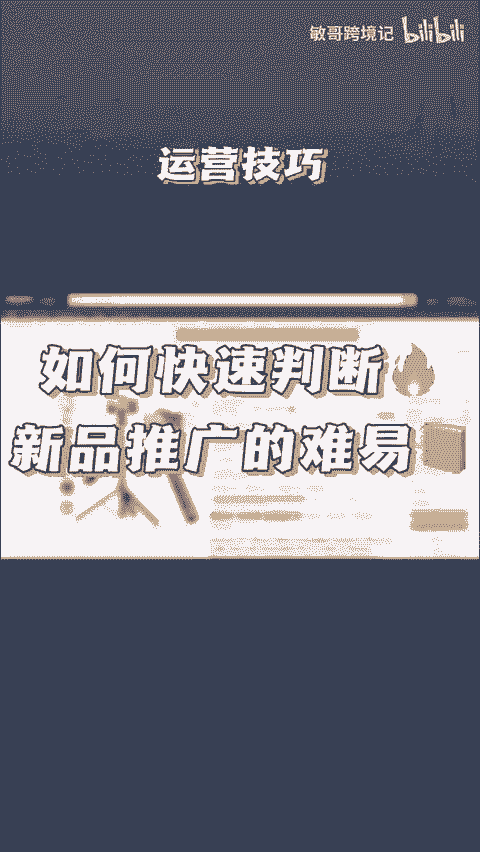
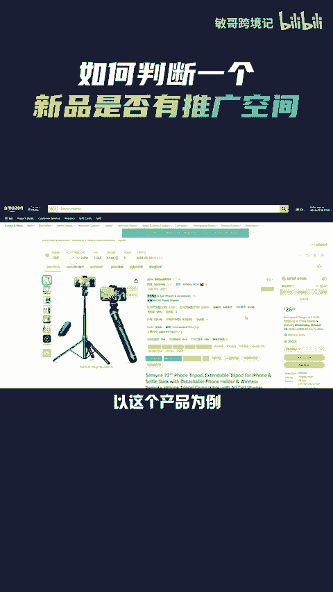
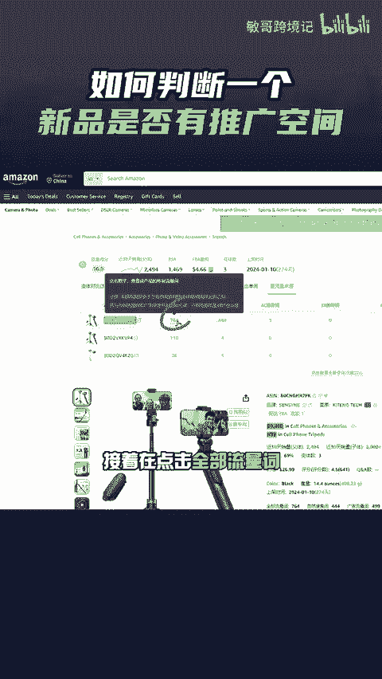
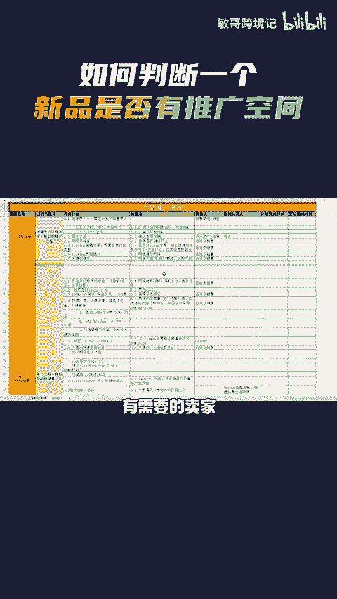

# 一个方法，教你快速判断亚马逊上一个类目下的新品推广难易程度！ - P1 - 敏哥跨境记 - BV1uB23Y6Ei8

🎼当卖家选好一个产品之后，如何去判断该产品好不好去推呢？以这个产品为例，点击页面上方的卖家经灵的查流量来源，接着再点击全部流量词，往下拉就能看到该产品所有的流量词了。

而我们只要锁定那一个流量最高的关键词，将它复制到查流量来源中，点击查询，接着就能看到，在近30天的时间里，共有363个产品进入搜索结果前三页，而亚马逊一页是有50个产品的。前三页大概有150个产品。

所以在这30天内，前三页的排名变动并不大，所以后续新品想要进入这个市场，在运营上还是有点困难的。你学会了吗？

🎼最后我这里有一份亚马逊新品上市准备工作全流程文档，有需要的卖家点赞评论666，给你安排。

