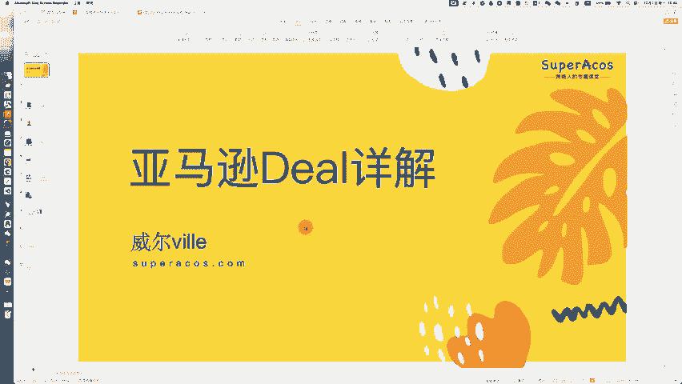
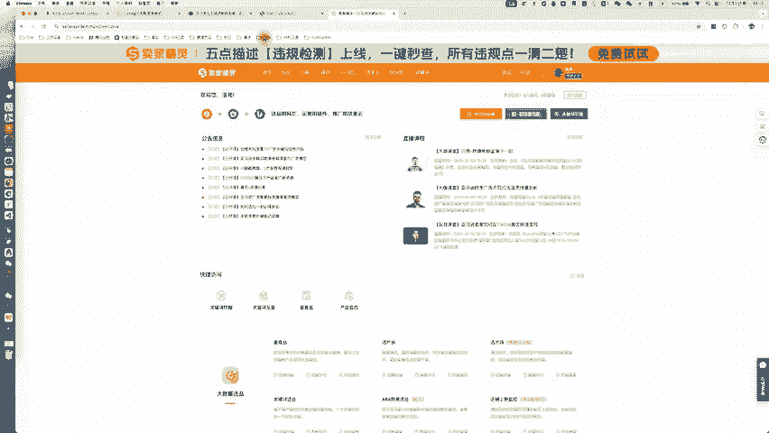
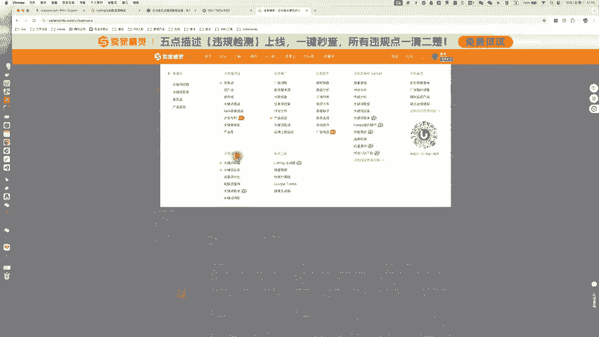
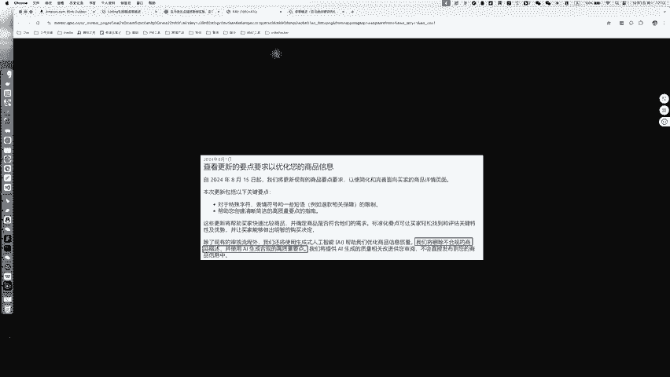
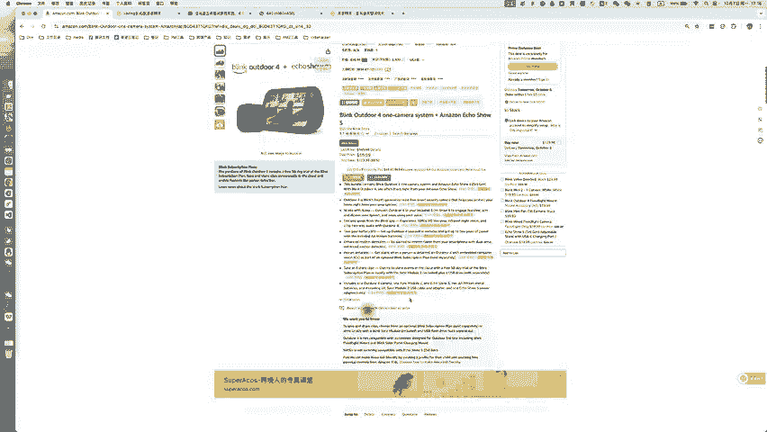
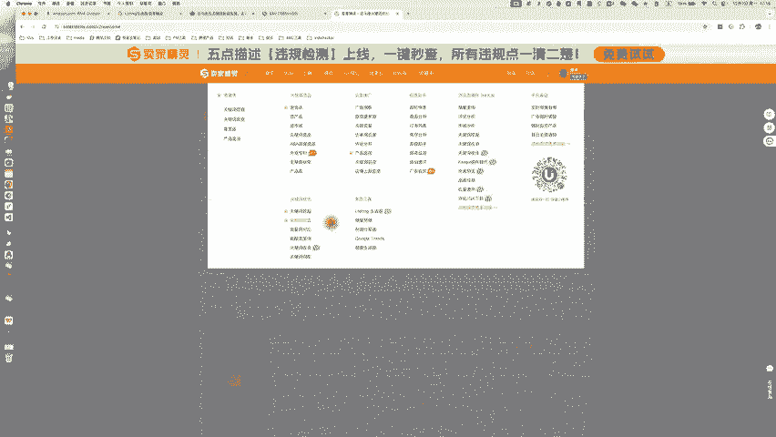
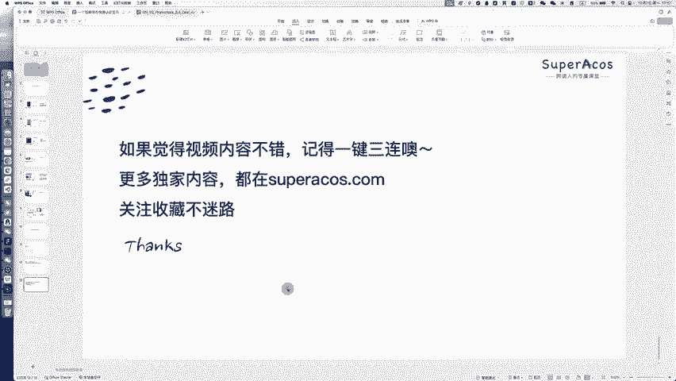

# 一个视频带你掌握亚马逊Deal促销 - P1 - SuperAcos - BV1tU2LYJE9D

大家好，我是威尔。今天这个视频呢我们来讲一下亚马逊的deo一个视频帮你快速了解亚马逊deo的一些详情。啊那首先的话我们来看一下亚马逊平台上有哪些折扣的这个标识呢？

啊我们来看一下第一种这种呢在这个listing详情页。在你的这个商品价格旁边呢，它会直接有一个折扣的百分比。那这个的话是系统自动给那些在30天内最低价的这个商品旁边所添加的一个折扣的图标。

也就是说如果你的商品的这个新的价格是30天内的一个最低价。那么亚马逊的系统呢就会自动给你的商品旁边增加一个折扣的图标。那在这个图标的下面呢也会有这个划线价格，也就是原价啊。

那上面的话是折扣之后的这个价格啊，那这是第一种这个折扣标识。

那第二种的话，我们可以经常看到就是这种啊优惠券。比如说这个是一个10美金的一个co一个优惠券。那这个优惠券的话是在卖家后台设置的促销优惠券折扣啊，在卖家后台促销，然后创建促销啊。

选这个personoff啊，就可以创建这种优惠券的折扣了啊，可以使用固定价格的折扣，或者是百分比的折扣都是可以的。那第三种呢，我们可以看到这个啊折扣旁边呢它会有一个倒计时啊，上面会有一个时间。

那这种倒计时的折扣一般是lightning，也就是限时秒杀。也就是我们常说的这个LD它的运行时长一般是4到12小时啊，所以它上面会有一个倒计时。那下面这两个呢是一个促销的折扣优惠优惠券折扣码啊。

那使用这个折优惠券折扣码呢可也可以享受到优惠。当然它这里设置了一个条件，就是购买金额要超过指定值才能够啊使用这个优惠券所以这个listing它整体的话是有多个这个优惠的。然后我们再看一下这个类次型。

这个类次型的话，它上面会有一个listing price啊deal price还有us save就是原价折扣价，还有你将省多少钱。那这种的话一般是那个best deal，也就是7DD啊，中文也叫Z划算。

然后它的运行时长一般是7到14天啊，这种折扣的话也是比较常见的。然后这个是amdon choice ，amdon choice的话是亚马逊系统根据listing的表现而分配给少数listing的啊。

带有amdon choice标识的这个listing呢，买家可以直接通过amon eco音箱来进行一个购买啊，这是亚马逊推荐的一个标识。有了这个标识之后呢，你的整个listing的转化率会提升很多。

这个vis prime的话是亚马逊pri会员的一个专属折扣啊，你可以给你的listing设置prime会员专属折扣。这样的话，对于prime会员来说也会非常有吸引力，能够提升一定的这个转化率。

然后这个的话是在亚马逊today页面，我们可以看到有一些商品它会有这个LT的秒杀进度。这个秒杀进度呢指的就是你的这个秒杀的折扣被使用的这个比例。那么这个进度会实时的去提醒顾客，让他们更快的去下单。

然后右边这个呢是pri early，还有pri early access。这两个呢一般是prim会员早享日的活动秒杀啊，prim会员早享日是亚马逊新推出来的一个啊活动。那么在这个活动呢。

我们也可以去创建秒杀。这是我们在亚马逊平台上常见的一些折扣标识。那接下来的话我们来详细去拆解一下亚马逊平台的de类型。首先我们来看一下de的一个定义啊，de活动的话是亚马逊上可见度非常高。

能够帮助卖家快速提高，并且积累销量的一个促销活动。那参加de活动的这个商品呢能够在亚马逊的today's这个页面去进行一个展示，还有带来一个销量。那today'sd这个页面，它的这个流量是非常高的。

在这个页面上呢常见的这个de活动有这样几种。首先的话是秒杀也就是eningd其次的话是Z划算bd镇店之宝de of the day以及奥特莱斯的现时促销特莱这四种这个de类型呢，他们都是各有千秋。

但是流量都都很高。待会我们会详细去讲解他们的一个区别。嗯，那要注意的是同一个asen不能同时参加多个de活动。那而且只有的黄金购物车啊拥有者才能够去申报以及参加de。

那首先的话我们来看一下这个秒杀吧也就是简称的话就是LDLD的话它是一种现实的短时间内拥有高流量的一个展示活动。参加秒杀的这个商品呢，不仅可以设置有限的几个小时的短时促销价。

而且在时间恢复后就可以恢复原价，还可以设置促销总量销完为止，这样既有机会获得比较大的流量，并且瞬间报单，也没有啊需要准备大量库存的这个压力。那在消费者看来呢。

在这个today这个页面能够看到你的LD的一个促销活动，在所有结果的这个商品列表页也能够看到LD的这个促销。在商品详情页也会有对应的这个标识。

会显示原价促销价以及消费者将将节省多少钱啊这样一个标识都会有这是秒杀的一个介绍。那我们为什么要去使用秒杀呢？通常你报了这个秒杀之后，在today页面就会有更多的顾客能够去发现你的商品。

并且你的listing有了秒杀的这个标识之后呢，能够帮你快速去拉升后续。的这个销量，尤其尤其是对于推新品来说是比较有用的。第三点呢就是帮助你快速去啊清掉那个积压的库存。

如果说有一些尾货可以通过秒杀去消化掉。但是报秒杀的话也是有一定的条件和成本的啊，我们来看一下爆秒杀的一个条件。首先秒杀它的运行时长是4到12小时，并且它的折扣要求。美国站呢是至少比参考价要优惠15%。

欧洲站的话是啊不同国家它的要求不一样，但至少也是5%啊，它的这个折扣是有一定要求的。然后卖家资格的话至少是四星。然后商品商品资格的话，这边的要求比较多，大家可以自己去看一下啊，配送方式的话。

FBA呃SS卖家自配送，还有符合要求的这个卖家自配送啊，都可以。秒杀的申报方式在这个广告，然后秒杀这个菜单下。然后如果说有亚马逊给你推荐推荐的这个秒杀的商品呢，然后我们选择这个商品。

然后按照步骤去啊创建秒杀的计划就可以了。这个非常简单啊。创建完成之后呢，我们就可以提交秒杀。提交之后可可以看到我们秒杀的这个效果数据。那秒杀的费用呢，北美站点的话是150美金。欧洲站点的话。

英国25英镑，德国是35欧，法国、意大利、西班牙是20欧，日本站点的话是4000日元啊，特殊促销活动期间呢，它的标准有所会有所变更。一般的话是这样一个价格，所以其实也不便宜。嗯，我们要注意的一些事项。

就是在秒杀期间呢，不要去调整你的这个商品的定价，以及不要删除或停售商品，以及不要去创建新的这个thezen。接下来我们来讲一下Z划算Z划算就是白d，常用的这个简称的是7DD，它与秒杀类似。

Z划算的话也是一种现实的促销优惠啊，区别的话是在亚马逊促销页面的显示时间会不同。那Z划算的商品它的这个促销页面显示时间一般是7天。具体的话可能会有一些调整。

但是大大多数都是7天创建Z划算的话也是可以帮助我们去快速提高我们的销量的那在todayd这个页面，还有所有结果页以及商品详情也都会有这个对应的这个标识。Z划算的一个标识。内划算的这个创业条件。

它的运营时长是7到14天。然后折扣要求的话，美国站一般是比日常的这个参考价要优惠至少10%。欧洲站的话至少也是要5%。那卖家资格和商品资格大家可以自己看一下，还有配送方式。

那内划算的申报方式这个的话也是在我们的秒杀页面。如果说你有满足要求的这个内划算的商品呢，亚马逊会给你推荐这个呃可以去报秒杀了。那么你。根据亚马逊推荐的这个秒杀商品呢，去创建这个内划算的秒杀活动就可以了。

按照步骤去创建完成。那么待秒杀至金结束之后呢，就可以看到这个内划算的一个数据。那么利划算的收费标准是怎么样的呢？在北美站点的话，一般是300美金。欧洲站点的话像英国是50英镑，德国是70欧。

法国、意大利、西班牙的话是40欧。日本站点的话一般是8000日元。啊，注意事项的话，当像我们如果有一组商品需要参加Z划算活动的时候，最多只能为50个asen提交促销的信息。商品在21天之内不能重复申报。

并且在30天内，如果说啊。必须在30天内未参加秒杀活动，且60天内未参与镇店之宝活动才可以去申报的。在微划算活动进行的时候，是不能够去啊改动价格的。那第三种dell类型是镇店之宝。

也就是de the day简称的DOTDDOTD的话它是呃非常高流量的，并且要求非常严非常严格的一种dell活动，申报也是非常严格的。目前的话，大部分站点的这个镇店之宝实行的是邀请制。

必须通过客户经理来进行一个申报。那镇店之宝它也会出现在这个today'sd以及搜索结果页，还有商品详情页。那为什么要使用镇店之宝呢？啊，如果说你拿到这个镇店之宝这个de呢？

促销期间商品页面将获得DOTD的一个标识，且促销商品一定会获得today's deal页面最前端的黄金位置的展示机会，有比较大几率，为商品带来很高的这个销量。那第二点呢是可以提升品牌和商品的曝光量。

以店铺为单位进行活动申报。一般1个DOTD入口可以展示多个店铺内的多个产品，且商品展示页面至少拥有2级至2至3级入口，有机会通过一个或多个商品带动整个店铺的销量，从而加大品牌的知名度。

针店之宝的商品必须是热销的这个单品。一般亚马逊会主动去给你发送这个邀请，它的要求的话也是非常高的。比如说你的折扣的话，折扣后的价格必须不高于过去30天内最低成交价的8折。嗯。

那么A的销售历史是至少一个月，然后必须是四星以上啊，符合亚马逊prem的要求，库存充足新品，然后促销频率的话，各站点不同，获得购物车这些都是必须的。如果说你呃没有这个客户经理的联系方式。

也可以扫这个二维码，添加亚马逊小助手的一个微信。如果说你已经有账户经理了，就可以不用去那个添加这个微信了，可以直接去咨询你的账户经理。像日本站点的话，已经开启镇店之宝的自助申报通道啊。

可以自己去提报这个秒杀活动，获取升级镇店之宝活动的申请。镇店之宝的话，它是一个免费的促销工具，是不需要额外去啊付费的。那么这个D活动是非常非常好的。如果有机会的话，也一定要去啊申请一下镇店之宝。

能够快速帮你去带来大量的流量和订单。最后呢我们也是给大家送上一个福利。卖家精灵的推荐码，使用下面这些卖家精灵的这个推荐码呢，就可以免费使用卖家精灵的会员功能3人天。那如果说你想要购买卖家精灵的这个套餐。

一定要记得输入我们的这个优惠码，使用这个苏八72这个优惠码呢，可以享受单人版包年7。2折，使用苏八78这个优惠码呢，可以使用可以享受标准高级VIP包年7。8折。那如果说你要购买卖家精灵的这个套餐的话。

一定要记得输入我们的这个优惠码，输入优惠码才会有这个折扣。那卖家卖家精灵呢是一个呃选品选词非常强大的一个亚马逊运营的一个工具。那它的功能非常强大。它的像那个亚马逊卖家常用到的一些啊功功能呢。

它都会它都有。那这里的话我就不赘述了。

介绍一下它最近上新的一个功能。那像亚马逊在8月15号，他提出了一个邀新的要求，就是说他们会审核listing的这个文案质量。如果说listing的文案质量比较差的话，将会被亚马逊给删除商品描述。

或者说用AI去直接去帮它修改。所以我们需要提前去针对亚马逊的这个新的政策呢去优化我们的listing五点描述。那麦家精灵的话就提嗯推出了一个自动化的这样一个检测和优化的工具啊，我们可以来看一下。

那么在你安装了这个麦家精灵的插件之后呢，在listing的详情页就会有这个违规检测以及listing优化这两个按钮。那么你点这个违规检测这个按钮之后呢。

麦家精灵的这个插件就会自动的去帮你检测你的五脸描述中的一些呃问题，帮你去查缺不。比如说这边它会提示我每一段它的一个字符的数量，以及仅删除巨末的这个标点符号。

那我们就可以根据它的这些提示去进行五点描述的一个优化，非常方便。

除此之外呢，如果你想要去优化你的这个listing，点它这个listing优化这个按钮，那么就会到卖家经灵的这个网页。你可以基于它的这个啊提示呢去自动化的去优化你的这个五点描述。

比如说在这边你可以编辑你的这个词库。输入你想要在listing里面埋入的这个关键词。输入之后呢，那么可以去一键去编辑listing的内容。在这里可以输入产品的特征。

客户特征特征以及不希望出现的词汇展示的品牌名称等等。那根据这些信息的话，可以用AI去生成这个listing的标题，以及用AI去优化你的这个五点描述。那在优化的过程中呢。

就会自动把你刚刚啊输入的这些关键词埋到你的这个listing的标题和五点描述里面去。它的埋效果就会非常好。并且它生成的整体的这个标题和五点描述都是符合规范的，能够达到亚马逊的这个要求。

那亚马逊官方的话也会给我们有一些这个商品无点描述的一个要求和建议。比如说啊不能使用特殊的这个字符，不能包含任何表情符号，A字里面也不是不能够有这种啊上待决定待决定这种字样。那么也有一些短语不能使用。

比如说生态友好环境友好抗微生物等等，还有保证信息公司信息，这些都不能使用要点也不能重复等等。那下面这些的话是亚马逊建议我们的一个编写指南。比如说用大写字母去开头啊，采用句段形式。

请勿使用句末尾嗯请勿使用末尾的这个标点符号，使用分号分。个短语在一个要点当中，那么使用10个以上的字符，但不要超过255个字符，写出数字1到9的这个文字形式，但名称、型号和测量值除外。

那这些的话都是在编写标题和无点描述的时候一些注意点。如果说你不知道你的这个liing标题无点描述是否是符合规范的啊，可以使用麦精灵的这个插件去进行一个违规的检测。如果检测到有需要调整的地方呢。

那么可以快速的去进行一个修改调整。那么如果你使用了这个优麦云的话，也可以在这边一键去更新这个listing的标题和无脸描述，它是非常方便的。因为优麦云的话。

它可以使用亚马逊的这个API去自动去帮你进行一个更新。O以上的话是关于这个麦家精灵这个标题和物点描述检测这个功能的介绍。那麦家精灵呢它的功能其实非常强大。我们可以看到它在选品啊关键词优化运营推广。

还有经营助手啊，这些方面呢它的功能都非常全。我也是一直在用这个麦家精灵。这边的话也推荐给大家。如果大家想要去免费体验的话呢，可以使用我们这个推荐码，使用这些推荐码的话。

可以免费使用麦家精灵的会员功能30天。那如果你要想要购买卖家精灵的这个套餐的话，可以使用我们的这个优惠码，可以拿到最低7。2折的一个折扣，一定要记得输入我们的这个优惠码哦。

O以上的话就是我们本期视频的全部内容了。如果你觉得视频内容不错，记得一键三连哦，更多独家内容都在点com关注收藏不迷路。我是下期再见，拜拜。

