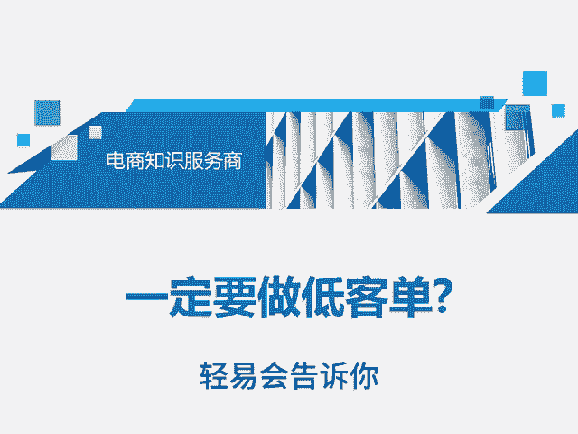
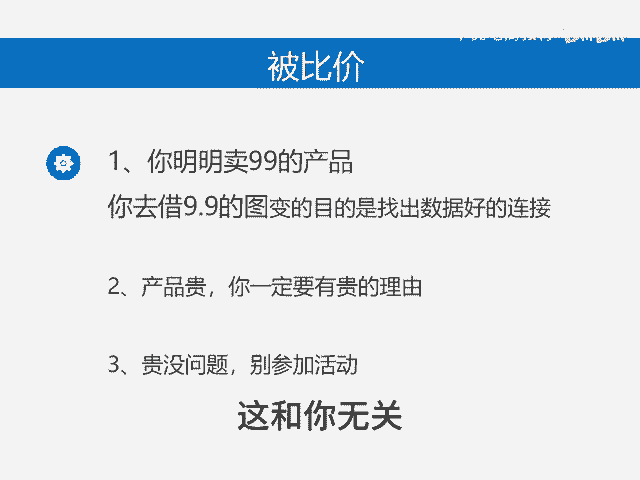
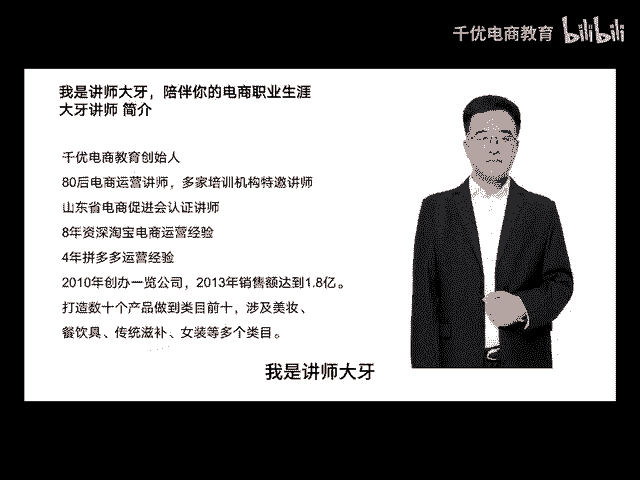

# 一定要做低客单？ - P1 - 千优电商教育 - BV1mZm5YjEdw

很多朋友他思路有问题。今天我这个视频可能没有人轻易会告诉你。听完我这个视频也可能会让你豁然开朗。我们知道拼多多它是一个低价平台，所以很多朋友说呢我也要做低价，其实你必须知道低价呢？是平台要做的。

它主打极致性价比，这和你有什么关系呢？你干嘛一定要配合平台。那有些朋友说我不配合被比价，它能不被比价吗？你明明卖的99的产品，你是卷了一个9。9块的图，然后还说为什么我不出单，还有一个自己的产品贵。

那它就贵吧。可是呢你没有找到你贵的理由，如果你的产品有什么不一样，那么你一定要表现出来，你不要和9。9块的那些东西，它完全一样。再一个你的产品贵，那你就别参加活动了，你就老老实实开车。

你只要参加活动立刻就比价，我们知道低客单是平台要做的，这和你无关，你的目的是盈利，所以你不要一味的去配合平台，我是讲师大牙，欢迎大家扫码添加我的微信，不方便扫码的朋友可以添加。😡。

加我的微信号80221430。在这里给大家准备到了一套新手运营入门的大礼包，希望能够帮助大家。

