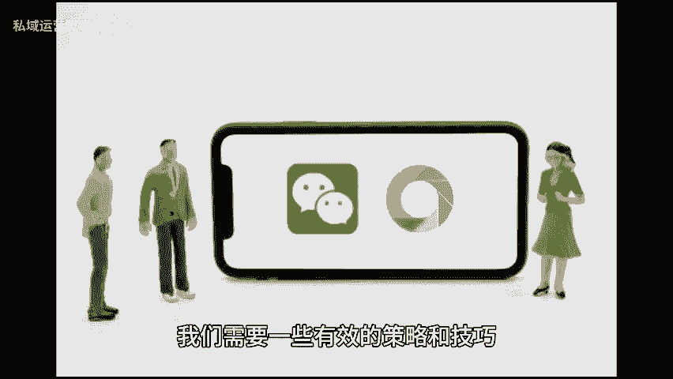
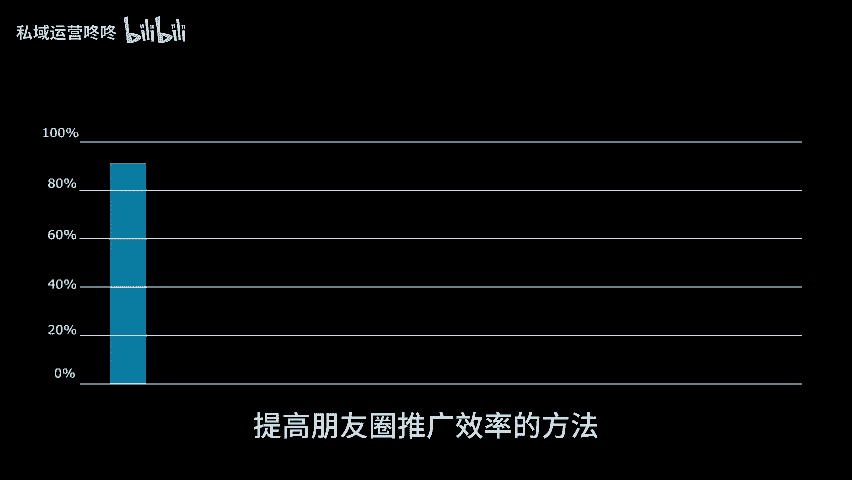
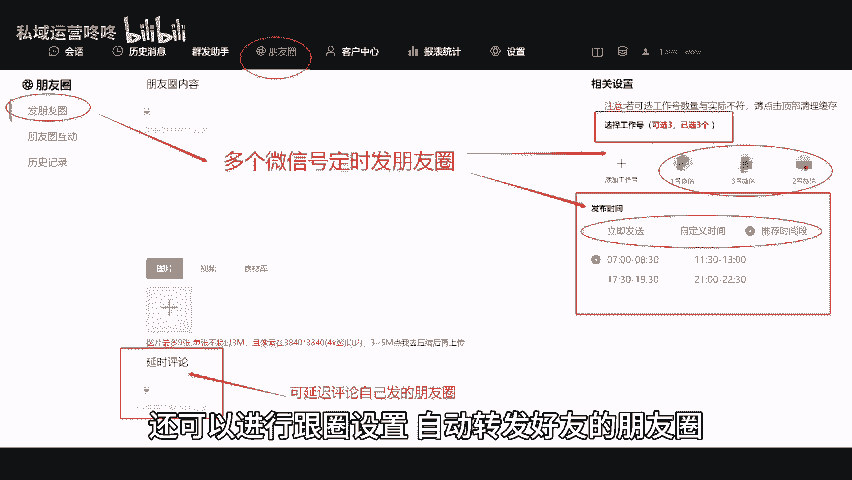

# 三招让你的朋友圈推广效率翻倍，赶紧学起来！ - P1 - 私域运营咚咚 - BV1ZS411A783

🎼现如今，要想在朋友圈中取得良好的推广效果，我们需要一些有效的策略和技巧。今天就给大家分享三个能，提高朋友圈推广效率的方法，帮助大家实现更好的推广效果，以明确定位和目标。首先，我们需要明确自己。

在朋友圈中的定位和目标，清晰的了解自己发朋友圈的目的是什么？是为了展示个人生活推广产品还是建立人脉，同时也要明确目标受众是谁。他们有什么需求和兴趣，只有确定好定位和目标。

我们才能有针对性的制定推广策略和内容。2、利用工具提升效率，我们可以利用一些工具来提升朋友圈推广的效率，通过微信管理系统可以帮助我们同时管理多个微信号，实现及时或定时发圈的功能。

还可以进行跟圈设置自动转发好友的朋友圈，加快推广效率，同时，系统还能快速给好友进行点赞评论和转发，增加互动率，通过使用工具，我们可以更高效的管理朋友圈，提升推广效果。3内容规划。😊。

🎼朋友圈推广的成功，离不开有价值、利他性的内容以及合理的内容规划。我们应该注重提供有价值的内容，可以分享自己的经验观点，也可以为他人提供帮助和建议。同时，内容也要具有多样性，不要只关注某一种类型的内容。

以免让用户感到单调乏味。此外，合理安排发布频率也很重要，过于频繁或过于稀少，都会影响推广效果，以上就是提升朋友圈推广效率的三个方法，希望这三招对大家在朋友圈推广中有所帮助。咱们下期再见。😊。

