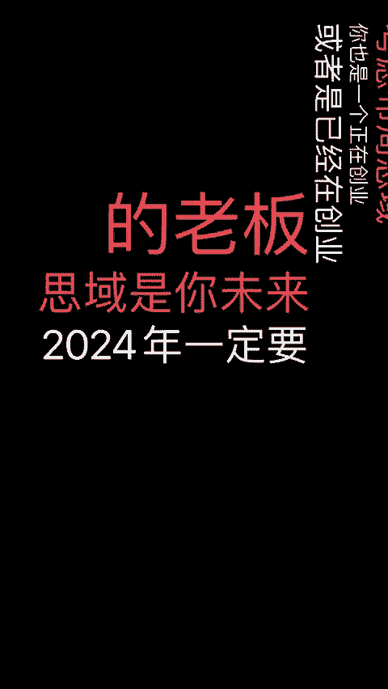
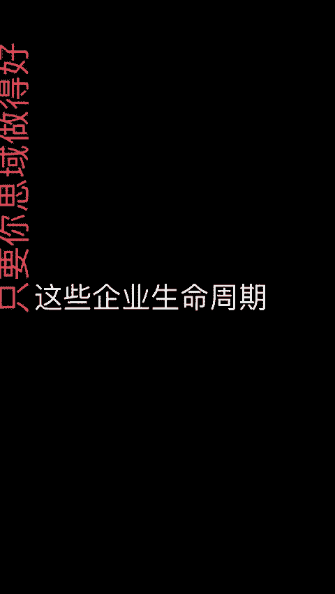

# 不做私域你就会在下一个十年被淘汰 - P1 - 渡鸦科技-小米米 - BV1xqxEeQEDV

🎼2024年一定要做私域私域绝对是下一个十年的风口。那我在直播间连了很多老板做服装的护肤品一个餐饮都在关心如何做私域。因为现在公寓和线下实体越来越难做。

他会看到自己身边很多朋友通过私域高收入布局私你也是一个正在创业或者已经在创业的老思域是你未2024一定要关注一个方向。22行越来情况下差异化的服务和产品的营销的地方就是在私域。如果你的产品没有差异化。

在公寓上跟别人。但凡是你有差异的产通过私域让差异客户更加这里反复的去复购，粉丝和用户到私域里面一种差异化的产品和服务是未来所有的老板和业利润核心。

我做私域域私域大越认识到私域的价值就因为我们服务了这几千个客户其有很多客户他们真的是把私域当作战略这越来。我回发现他们比去年意还要通过私域客户的复。

🎼这3到5年，客户基数是越来越多的。只要你私域做的好，这些企业公益救济就比那些只会做公益的企业要活的时间长。未来2024年不许用我的私域能够保住利用。

