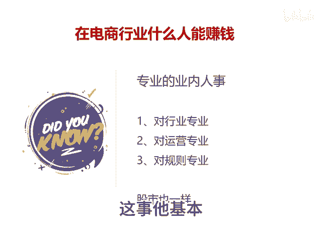

# 不如去炒股 - P1 - 千优电商教育 - BV14Q2mYiEcf

做电商亏损不如去炒股。昨天看到有朋友在评论区留言说坑多多太坑了，不如去炒股。其实我个人感觉呢，这和另外一个言论差不多。他说做坑多多太坑了啊，不如去做淘宝。那为什么这两个言论是一致呢？

首先我们知道赚钱是你对一个行业的高度认知？所谓降维打击是站得高才能看得更远，赚钱是对你认知的奖赏。那很多人说多多，我们研究透，现在去炒股。那么请问你了解哪只股票，很多朋友他昨天可能刚学会的开户。

你对一个股票的了解可能仅仅限于股票名称和代码。那么请问你到股市又有多少机会呢？我们说什么人能够赚钱，是专业的人能够赚钱？什么叫专业在电商里面对行业专业，你的行业你了如指掌。你的行业里面你有多少同行。

同行的产品和你的差距在哪里？同行每天都在干什么？再一个呢，你对运营专业，就是你这个产品上架。😡。

之前你都会规划下一步怎么成长。中间遇到问题怎么解决。再一个呢，你对规则专业，你要知道一个平台规则是它的底线。其实呢我想说的是，股市它也一样，你不要想着在电商里面没赚钱，对股市你不了解。

然后你糊里巴涂进去就能够赚钱这事儿它基本不太可能。我是讲师大牙，欢迎大家扫码添加我的微信，不方便扫码的朋友可以添加我的微信号，80221430。在这里给大家准备到了一套新手运营入门的大礼包。

希望能够帮助大家。😡。

