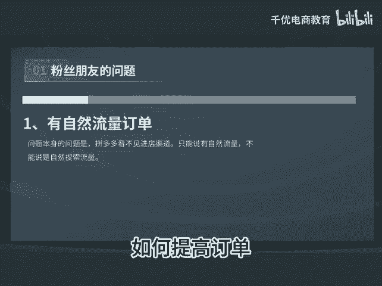

# 不开车如何提高单量 - P1 - 千优电商教育 - BV1Vn1kY8E11

昨天有位粉丝朋友问了我一个非常有意思的问题，在这里解答一下，不知道这位粉丝朋友能不能看到他说自然搜索有订单持续进来，怎么样使搜索更猛一些，排除开车。首先呢我们说这个问题它是有问题的。为什么在拼多多上呢。

我们不能看到用户的进店渠道，它不像淘宝那样，所以说呢它只能说你现在是有自然流量的订单，而不能说是有自然搜索订单。不过呢我个人认为他是推荐流量更多一些。因为拼多多的平台搜索流量本来就不多嘛。好。

那第二个问题就是如何提高订单。那这位朋友说呢，他说排除开车。但是我们知道如果你要迅速的提高订单量，开直通车是最快的方式。如果我们要排除直通车，那么还有方法吗？有还有如下的三种方式。

第一个可以提报各式各样的活动。比如说是新品的话，可以提报21365，还有各种大促，像什么9。9块日常热心，这些呢都是可以带来流量的。另外你直接降价也。😊。

可以，因为拼多多上只要你价格低，你获得流量的机会就要多一些。你说我也不参加活动，因为要降价，我直接降价也不参加，那有方法吗？有第三种方式，我们知道如果一个链接持续获得流量的前提是什么？

是点击率转化率坑产没问题。好，那么它目前这个品点击率和转化率应该是不错。因为有自然流量进来呢？所以我们可以考虑提高坑产，那如何提高坑产呢？很简单，用补大单的方式，就你一天补一单就行，一单多件。

那么多少金额呢？一单在1500到2000块之间持续一周相信你的链接呢，单量会提升一些。我是讲师大牙，欢迎大家扫码添加我的微信，不方便扫码的朋友可以添加我的微信号，80221430。

在这里给大家准备到了一套新手运营入门的大礼包，希望能够帮助大家。😊。

