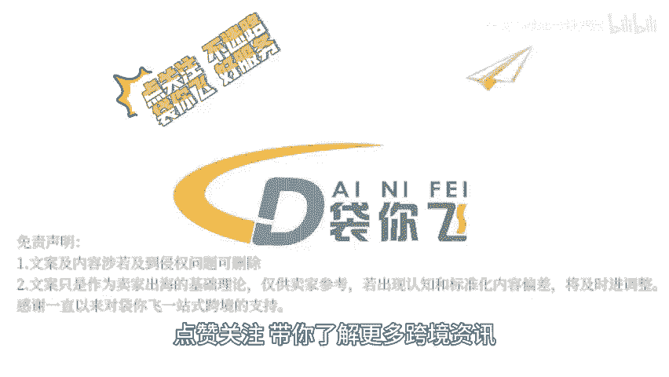

# 专利制度解析 - P1 - 袋你飞进亚马逊课堂 - BV1wGszevEkB

🎼欢迎收看带你非电商小课堂。今天我们来了解一下各个国家的专利制度，以及如何合规经营。对于亚马逊卖家来说，在各国销售产品时，卖家需要了解专利权的基本知识。

包括专利权的定义类型保护期限等专利权是创新者对其发明创造享有的独占权，分为发明专利、实用新型专利和外观设计专利三种类型，不同类型的专利在保护对象，授权条件和保护期限等方面有所不同。

由于各国专利制度存在差异，卖家在销售产品前需要了解目标市场的专利法规和政策，在美国发明专利保护期限为20年，自申请日起计算，美国没有专门的实用新型专利制度。

但可以通过申请小专利来保护产品的外观设计或某些非功能性创新。外观设计专利保护期限为15年，保护产品的整体或局部外观设计，卖家需要在美国专利商标局USPTO进行专。😊。

🎼搜索，确保产品不侵犯任何现有专利权。欧盟市场中发明专利需要通过欧洲专利局EPO申请保护期限为20年。部分欧盟成员国提供实用新型专利保护。但具体制度因国家而异。

外观设计专利在欧盟内部市场协调局po注册保护期限为25年。卖家需要注意C标志等合规要求，并确保产品符合欧盟的相关法规，在亚马逊上销售产品前，卖家应进行全面的专利搜索和风险评估，以避免侵犯他人的专利权。

对于亚马逊卖家来说，在处理不同类型专利时，需要注意各国专利制度的差异，进行全面的专利搜索和风险评估，制定合规策略以及积极应对侵权指控，通过这些措施。

卖家可以确保在亚马逊平台上合规经营并保护自己的知识产权。点关注不迷路带你飞好服务，点赞关注，带你了解更多跨境资讯。

