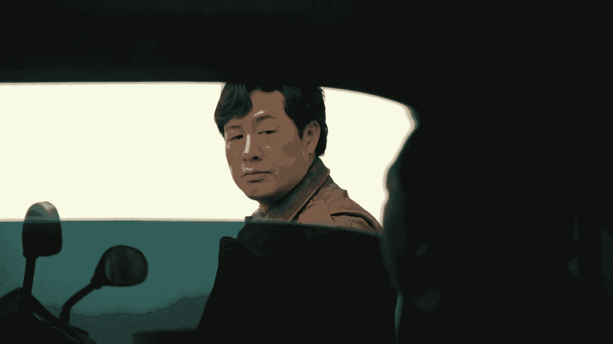
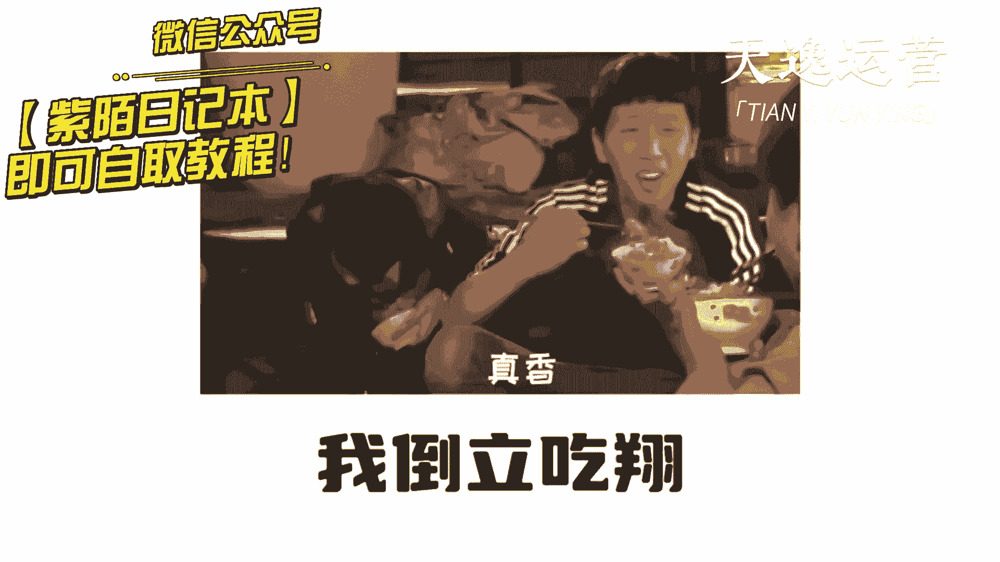
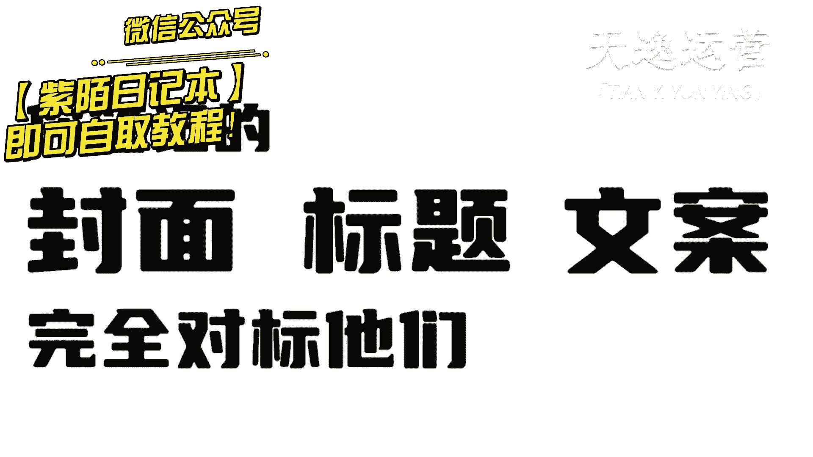
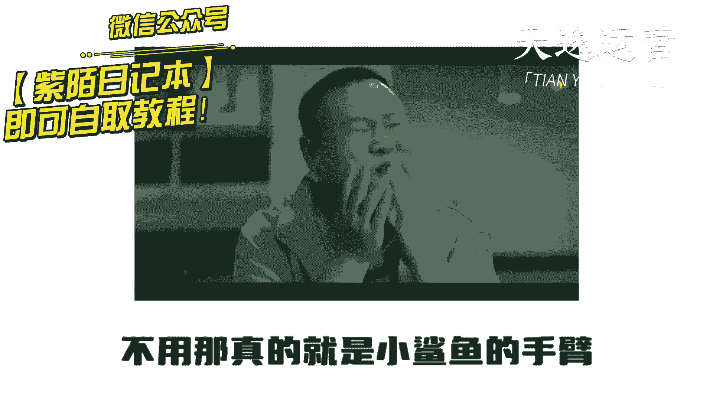
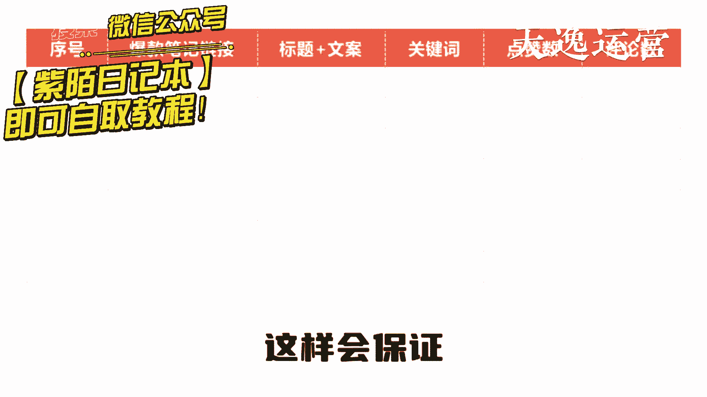
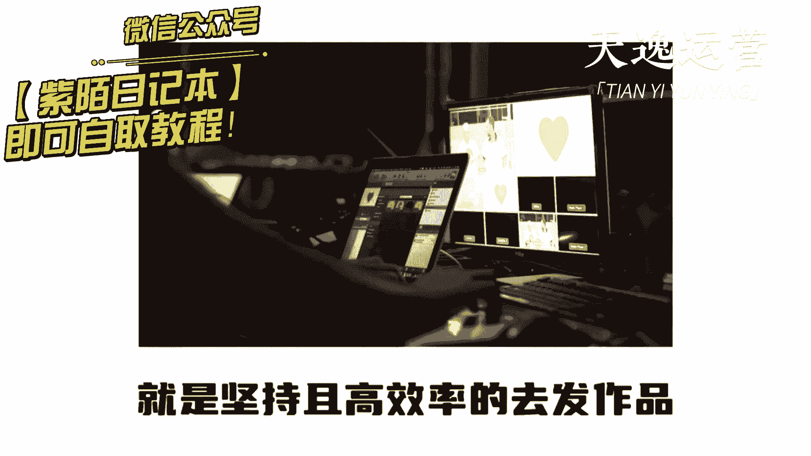
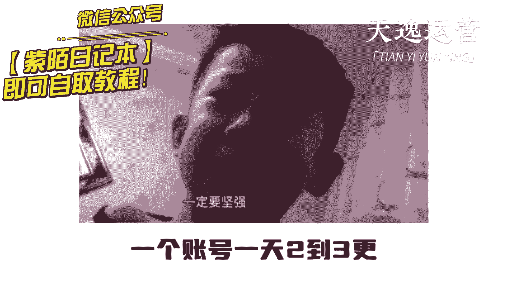
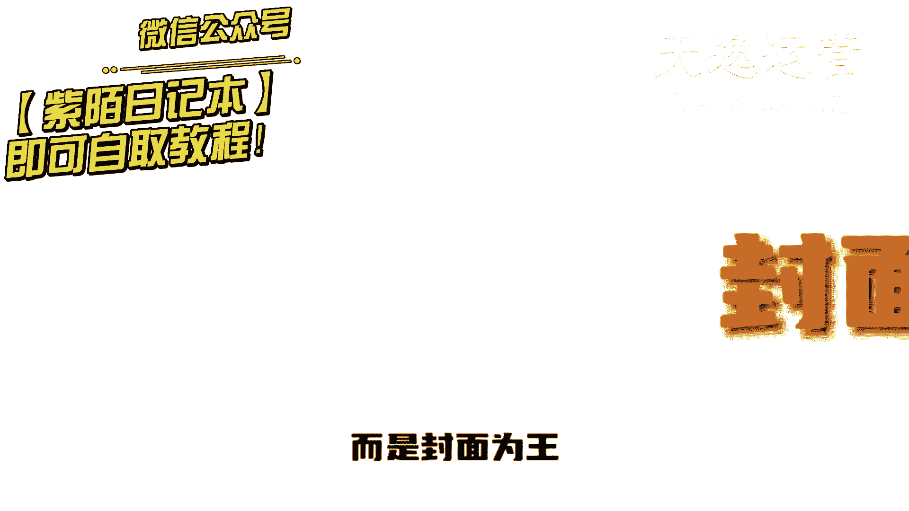
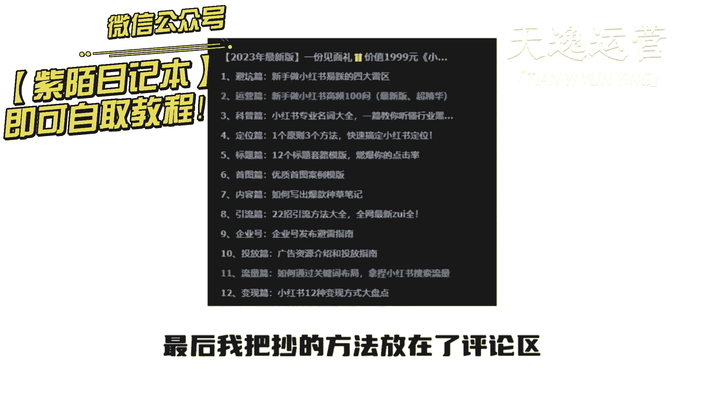

# 两个小时学会小红书运营-原来打造爆款笔记这么简单！！！小白零基础入门必学的小红书笔记公式拆解，最简单的起号教程，快来学！！！ - P2：小红书起号，封面 - 我皮卡丘呀 - BV135tfe2EVT

你猜我小孩子还猜，所有人都告诉你，今年必须要做小红书，但从来没有人讲清楚到底怎么做，你以为做小红书就跟我二奶发朋友圈一样，随手一拍的照片，加上个令人感动的文案，刻字，它就不断就能年入100万。

结果发完作品你没5分钟就打开一看，卧槽怎么没有人看，真是老太太钻被窝给爷整笑了，今天我用一条视频讲清楚做小红书。

如何用一周时间快速起号，如果没有效果，我倒立吃翔。

第一步要明确你的定位，你是谁，你是做什么的，你能给用户带来什么价值，还有你的变现路径以及产品，第二步，找到你这个领域内，最近30天的第一份报文笔记，你笔记的封面标题文案完全对标，他们不要问。

为什么同行已经替你测出了爆款结构，不用，那真的就是小鲨鱼的手臂。

整理出来之后呢，像我这样拉出来建立自己的选题库，这样会保证之后你的账号不会轻易断更。

第三步就是坚持且高效率的去发作品。

做小红书一定要矩阵起号，用数量博概率，一个账号一天两到三更不出。

一周必出小爆款，做小红书从来都不是内容为王，而是封面为王。

因为一个赛道有价值的内容来来回回就这么多，大家都在互相的抄。

反复的用复制能力，可以说是老太太上楼梯，不服不行，但最终决定笔记在小红书上面到底火不火，90%取决于你的封面，小红书不同于抖音，抖音是沉浸式观看，强制把内容推送给用户，用户就像开盲盒一样。

不知道下一条推送是什么，通过前三秒完播率来决定要不要继续看下去，小红书是双列的信息流，用户自己去选择封面点击，所以即便你的内容很优质，但是用户点不进去，你也不会有观看量，我们团队自己做账号。

从来都不会在内容上有过多的纠结，我们花费的最多的时间永远在封面上，因为内容不用去想，直接抄就可以了，但是封面不行，因为只靠抄都是同质化的那种。

用户是不买单的，最后我把抄的方法放在了评论区。

大家直接去拿就可以，学小红书只讲实操，不讲废话，谁他妈还没有点副业呀，窗外雨声滴滴答答。