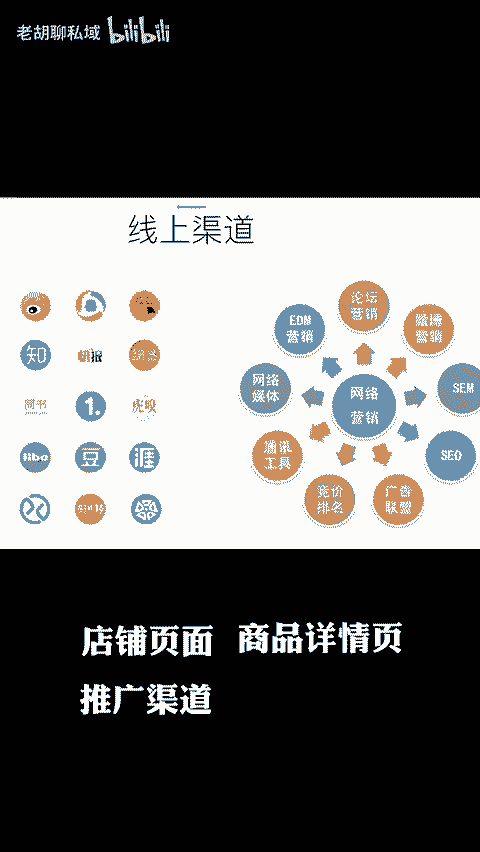

# 严禁商家导流私域，天猫真的能做到吗？ - P1 - 老胡聊私域 - BV1KAhHegEAt

🎼严禁商家导流私域啊，天猫真的能做到吗？依我看还真有点难。昨天啊也就是7月1号，天猫新版的诱导第三方规则正式生效了，明确禁止商家在包裹中乱塞小卡片等引流至第三方平台的行为。新规强调了商家在店铺页面。

商品详情页推广渠道、旺旺聊天、直播互动以及实物包裹等任何与消费者交互的环节中，都不得发布或者推送可能引发交易风险的第三方商品或信息，尤其引人关注的是啊。

新规明确禁止商家通过包裹卡等方式进行微信的私域引流。在新规的视例配图中啊，微信的logo清晰可见，可以说这意思已经表达的非常之明确了，就差直接说禁止引流到微信了。那么对于违反规定的商家呢。

天猫也将采取严厉的处罚措施。包括啊商品下架，扣分支付违约金，甚至直接清理店铺，在处罚方式上啊，一共分为三档，分别是情节一般情节。😡。

🎼严重和情节特别严重，情节一般的呢基本上都是首次违规罚款2000块，情节严重的扣12分罚款2万块，情节特别严重的啊，直接清退店铺，实话说啊，这个新规的天猫平台呢，倒是一个很好的保护措施。

避免了客户呢被商家不断的用蚂蚁搬家的方式呢搬到微信去，否则呢真的有一天整个平台都会被搬空了。毕竟千里达堤也会溃于蚁穴。但是商家们肯定是不乐意的，甚至在一定程度上我觉得啊这条新规是挡了商家们的财路。

我们回过头来想想啊，为什么现在天猫京东、拼多多，甚至是抖音的商家都不断的要把客户引流到微信里去的。这还不是被各大平台都逼的嘛。平台要价格力，要低价来吸引消费者让商家必须处在这种极端恶劣的低价竞争环境中。

在这种低价的竞争中，很多商家刨出掉平台的广告费，抽佣公司运营成本的，很多都是平进拼出，根本不赚钱，甚至还有很多是亏损的。😡。

🎼这时候他们能怎么办？还不是想着把客户导流到微信私域里，靠后续在私域的运营来提升消费者的复购，从而实现整体的盈亏平衡吗？说白了就是在平台卖货不赚钱，我就是赚个流量，然后呢靠在微信里面经营赚钱。

而且呢在微信私域里面做经营啊，包括私信的触达呀，发朋友圈啊等，都不需要额外的营销成本，对吧？这个营销成本几乎为0，也不需要在公益平台那样，每次触达都需要花广告费，所以商家导流私域的动力啊非常足。

当然还有一部分商家啊，他们不是引导客户到思域里面去做经营，而是直接把这些流量啊，通过包裹卡的方式啊卖给外部的第三方，通过这种出售流量方式呢变现，尤其是我们很多做淘宝客的，做法定机器人的。

甚至在私域里面做直营的，都会通过这种方式去找这些商家们买流量。但是因家不是有一个商家说他们在某平台啊去年做了两个亿的销售额，但是一年下来呢只赚了55万的利润嘛。之所以能赚到这55万。

还是因为他们每天发货的包裹量很大，帮助一家公司在包裹里面塞卡片赚到的钱。😡，🎼所以对这部分商家来说啊，天猫平台的新规呀，对他们来说简直就是断了财路啊，他们肯定不会同意的，肯定会想着其他方法来继续导流的。

具体有哪些方法能导流的。我在这里也不方便说，知道的可以在评论区说说。😡。