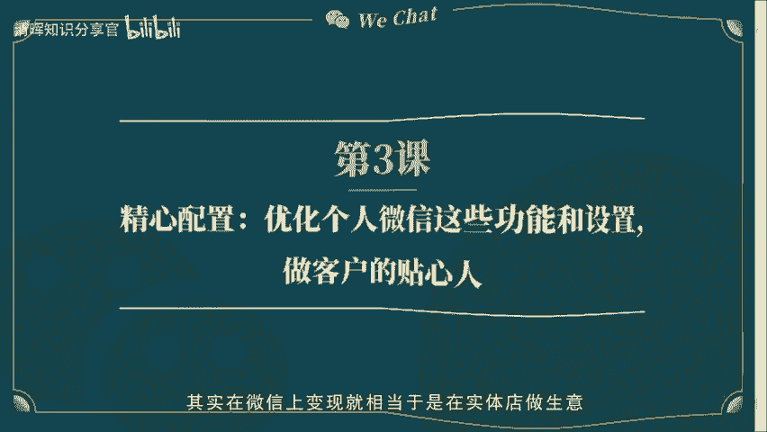
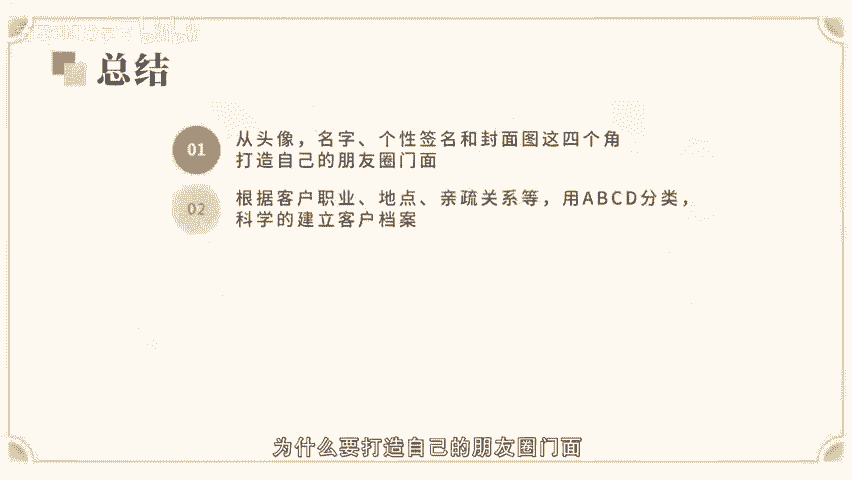
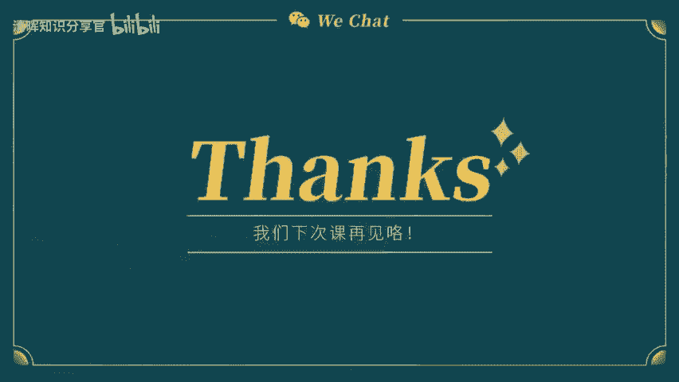
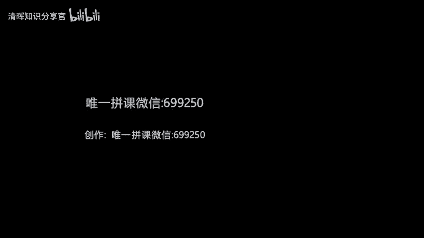

# 个人微信如何化身流量池？ - P1：第3课-精心配置：优化个人微信这些功能和设置，做客户的贴心人 - 清晖知识分享官 - BV1zi421Y7th

🎼。

🎼上一节课程中，老师和大家讲啊关于微信变现的IP应该怎么打造，大家有没有用比分纸写下来自己的优势在哪里呢？自己可以延展的IP有哪一些呢？有没有准备开始行动起来呢？今天啊主要想跟大家讲一下，有了IP之后。

你应该怎么优化自己的个人微信，其实在微信上变现就相当于是在实体店做生意，我们现在使用最多的就是朋友圈，所以你的朋友圈就相当于实体店的门面，提到实体店，我们的第一个反应是谈下个店面，第一件事肯定是装修。

装修的更好看，根据品牌的调性，装修出一家店特有的品位，才能够更吸引客户进到你的店铺里面来观看，对吧？那么大家是不是会想我就是一个微信号还能像实体店一样装修吗？需要买什么材料来包装呢？

我们家之前开实体店的装修。

🎼做设计风格、做门牌、广告牌、灯箱，还有室内软装设计，我都有接触。但是到线上朋友圈来，我怎么打造，怎么装修呢？我一窍不通呀。🎼大家不要着急，我一步步来教你微信虽然是一款聊天工具，但前面的课程我说到了。

它是可移动可视化动态的。今天给大家讲讲怎么让微信变得更加可视化。首先跟大家说一下，你的头像和名字，就是你的个人微信名片。不知道大家有没有平繁的更换头像的一个习惯呢？至少呀我在做微信变现之前。

会经常更换自己的头像，导致我朋友圈的好友经常说的一句话，就是你怎么又换头像了？差点找不到你。这就导致了我朋友圈的好友对我本人的印象不是特别深刻。过一段时间就要重新建立一个我的新头像的认知。

你咋留下深刻的印象。🎼所以今天第一点就想和大家说说头像的重要性。其实呀固定头像就像是咱们一家实体店的招牌一样，真的很重要。这决定了你的店铺是否可以被潜在的消费者记住。而不是当客户路过你朋友圈的时候。

一眼没认出你来，那就很尴尬了。🎼大家回想一下，你经常去的实体店会不会经常更换招牌呢？如果你经常去的一家店突然换了个招牌，你是不是会觉得有点奇怪呢？其实头像就是一个品牌的代言人，而在朋友圈变现中。

我们就是自己产品最好的代言人。所以我们在选定头像之后，建议半年到一年才更新，在头像的选择上，当然了，我们朋友圈还是有一类人是根据自己的喜好来挑选的，在个人自拍风景或者是卡通形象，或者是纯粹的产品照片。

这些其实就像是一个虚拟的没有情感链接的头像，让朋友圈的潜在消费者无法真正的了解你信任度比较弱。而且需要增加信任度的耗时也会比较长。所以总结下来，在这里我建议想要做个人微信赚钱的小伙伴们。

在自己的头像选择上以个人形象照为主，可以结合自己的个人IP。🎼去呈现。比如说是画画的，可以拍一组画画的形象照。当然啦，如果有带产品的形象照也是可以的。形象照选择以贴近生活为主，展现自己的专业性为上。

说了那么多关于头像的事儿。那朋友圈第二大要点，其实就是我们的微信名字啦。名字就相当于实体店的店名了。这么一说，大家肯定都懂了，这也是很多大咖在各大平台都使用统一名称的原因。第二。

自己的个人品牌名字更有传播力，让人不断记住，关于名字这一块有三个规则。第一，建议大家最好用自己的名字可以中英混搭，原则是简单易记，朗朗上口。第二，不要用太复杂的英文或者是图标和符号。

因为用符号或者是很难记住的。一般人家想找你都无法搜索到你，大大降低了客户的购买欲望。要知道，在微信电信中，你能被谁第一。🎼时间记住并找到你销售承担的可能性才更大。第三。

名字和个人IP或是产品名称绑定在一起。比如alice高绘画jack陈小董美妆。类似这种，可以更好的让别人了解你是哪个行业的，比如知名运动品牌永不止步广告。这句不仅表达了其品牌持续向上的运动精神，同时。

不这个字也一语双安的为其品牌的穴位做了一个伏笔的广告。再举个例子，国内某知名饮品公司的宣传广告词。就是怕上火喝王老吉等等的6个字不仅把产品的功效性能表达出来了。同时还把产品名称也涵盖在其中，给大家一种。

如果自己要上火了。就要去喝这款饮料。该品牌的广告标语不仅朗朗上口，简单好记，口碑传播的力度也非常之惊人。🎼经我这样一说，你会不会觉得在变现的朋友圈里，你的这句代表着你个人的个性签名就变得很重要了呢？

我刚刚列举的这两个例子哈，都呈现了品牌的调性和产品的功效性能？甚至还让消费者更好的记住了这个品牌。那么回到我们朋友圈变现中的个性签名，有哪些点需要注意的呢？🎼大家要知道，和一个品牌一样。

别人了解你是什么样的人，可能就是通过这一句价值观呈现的个性签名来了解的。所以个性签名可以包含以下三个特征。第一，职业标签，包括自己的主页和副业。第二，个人成就。第三，呈现个人价值观的名言警句。

这样就可以建立一个陌生人对你的基本印象啊，选在消费者在你之前精心设置好的那些功能之后，他们想要更了解你的话，就是看你的朋友圈，而点进你朋友圈看的第一张照片，无疑就是你朋友圈的封面了。

封面我们可以用来做些什么呢？其实呀这里也是给自己做宣传的一个版面。比如说详细的自我介绍。大家要知道就像一个杂志的封面一样，是不是会把最重要的产品和代言人或者主题都放在封面呢？所以要好好。

🎼的重视封面的打造。一个好的封面是要让别人进一步了解你的前提。如果利用好这个模块，大家其实可以做一个个性签名的可视化升级版。比如一张带有个人自我介绍。

包含了头像名称、职业从业经历、个人成就、销售业绩等关键信息的简介图，或者是个人参加的重要活动的照片和个人成就奖状。这也是迅速让别人了解你的方法哦。说完这些收回我们的朋友圈。

其实大家都知道我们现在的朋友圈早就已经不仅仅局限于朋友这个类别，还有父母经济，甚至是领导、同事，还有更多的是我们从未见过的陌生人，对吗？那么我也知道，有一些小伙伴是在政府机关事业单位工作的。

还有规定不能做兼职的企业，或者是想发广告给特定的用户群体的小伙伴。🎼有困惑，自己到底要不要屏蔽部分人，一般来咨询，我都会给大家建议和自己本职工作相关的利益相关的人，建议做好分组屏蔽，做好分组之后。

今天我还想教大家好好利用一些暗藏小窍门。根据关键词，快速缠绕你想要的内容，能够轻松快速的了解你的合作伙伴。这个小窍门就是根据年月爬楼，了解一个新朋友过去几年的历史，也可以更好的考察一个人是否靠谱。

大家知道，人与人之间的信任，来自于长久的累积。那么我们如果刚认识一个人的时候，就想更深入的了解对方应该怎么做呢？第一种就是带着自己的问题去咨询，和对方一对一沟通，更好的了解品牌，了解产品。

🎼第二种就是我想教大家的一个爬楼小技巧，可以根据联系人搜索朋友圈，然后找到对方的名字，选择对应联系人，点击发布时间，然后就可以选择自己想要查看的时间节点和内容啊。

这个方法是有利于大家在还不熟悉你想要考察的产品的联系人情况下，去爬楼了解对方的过去的。这样可以更好的看到对方的品牌经营之路。这个小技能也可以帮助你在短期内快速建立起可信度调查。当然啦。

朋友圈搜索不仅仅是针对联系人，也可以在对应的联系人下面找到对应的高频词汇。比如说电信卖货收款等等。你还可以通过关键词，搜索到你朋友圈所有好友发布的同类关键词。如果是在经营产品的时候。

找到同期的素材就很方便啦。其实啊分类。🎼并不只是为了发朋友圈的时候屏蔽相关人员使用的，更多的是为了帮助大家在发朋友圈的时候，建立客户档案，更好的去追踪客户的信息，了解客户的状况。在朋友圈分组的分支下面。

我们还需要做的一个动作，就是把朋友圈的每一个好友做好对应的备注，建立好客户档案。这个档案呢包括名字、城市、职业、生日等等。这些是为了可以和客户建立一个更好链接的一个渠道。🎼当然了，如果是已有产品在经营。

并且有客户群体的情况下，我会建议大家把客户分成ABCD4个大类分类原理是根据不同的客户性质，购买数量、心密程度等等，来做这个备注。比如A是成交客户。B是咨询客户，D是未成交客户。D是点赞人群。

大家可以在变现的过程当中，不断标注和修改自己的客户类型，这样更利于在联系的时候，方便快速找到客户类型，及时做好跟踪。至于这个ABCD大家可以根据自己的个人喜好设计，1234可以，或者是符号也可以。

最重要的是，这个标记可以为你所用，让你更好的提升自己的销售业绩，做好客户回访，产生链接，增享客户关系促成复购。你做的每一个标注。🎼都是有利于你之后的二次互动群发。

我相信哈我们应该每一个人都遇到过被群发的现象。但是呢有的时候因为群发给我们的人没有做好客户分类，反复不断的重复打同一条信息，发给你的时候，你就会在这个人产生一种不好的情绪。进而可能会删除。

那我们如果说做好了客户档案管理和标签，我们是不是可以针对不同类型的人群发不同类型的消息，尤其是在逢阳过节的时候，跟老朋友建立关系，针对性群发也是很有帮助的。比如说哈你在建立客户档案的时候。

能够标注清楚某个人是属于哪个地区的，是不是可以在某天履行方店的时候可以约见拜访，或者说是你了解到对方的职业类型之后，你可以产生链接和合作，或者是做引荐两个同行业。的人认识资源互换。

🎼假如你遇到了对方相关行业的咨询，你是否可以群发并及时的提供资料给到他们为对方提供服务？其实啊这些小细节都是为了在做销售和朋友圈变现。但在此之前，我想教你做一个能提供价值的人，才能做客户的贴薪人。

如果你可以根据客户档案不断的为你的潜在客户提供价值，还怕客户记不住你不为你的价值买单吗？这里还有一点想提醒大家，群发的时候，一定要是自己写的内容，并且凭字尽可能盯，最好是以互动问候提供价值的群发为主。

如果是自己收到都想删除的群发内容，就不建议发了，会损坏自己的口碑。🎼好了，说完群发可以再教大家一招，就是你的图片跟正文当中不含广告的情况下，同时把自己需要宣传的产品信息插入在你的朋友圈。

那就是你的朋友圈地址栏，具体操作步骤如下。朋友圈编辑好以后，点击所在位置。在搜索框任意输入文字，在没有找到你的位置点击，然后在位置名称处填写自己的产品名称，在详细地址里面可以写上自己的产品介绍。

这部分内容可以稍微多一些。如果有客户点击进去，可以看到你的完整产品介绍哦。至于最后的联系电话，大家可以根据自己的要求来确定是否需要填写。get了以上小技能之后，大家可以赶紧把自己的门面重新装修一下了。

但是光装修还是不够的。我们还需要有条理有逻辑的去丰富自己的朋。🎼友圈做好产品分类，分门别类的标注好各大信息来源，在客户来咨询的时候，可以做到随时随地调取有用的信息，对吧？

我们一般在准备开始做朋友圈变现之前呢，有大量的产品资料要学习。还有许多的产品素材图持续更新着，那么应该如何去分类呢？不着急，在这里我就要教大家一些整理分类的小技巧，是包含在微信客户端的，当然了。

也有同步到云端的APP后期呢也会在使用工具课程中，给大家分享到更多的使用APP今天主要想给大家分享的就是暗藏在微信客户端和同步云端的APP首先微信APP中的左下角点击我可以看到有个收藏。

我们可以看到更新后的微信，把以前没有的分类，现在升级分到8类。大家可以在平时搜。🎼收藏类别中找到对应的收藏素材，但是这个收藏分类是根据你的收藏属性系统自动分类的。那么，如何做到随时跳取呢？

第一种是你记住了某个分类当中的关键词，可以在最上方的搜索弹幕里找到，但是往往会出现很多的同类关键词，那么这个时候就需要我们做详细的分类了。🎼我们可以在收藏夹的大列表当中点击你想单独收藏的那一条选择。

多选，把左边的圈圈打勾，然后再添加到最下方中间的标签。那这里你还可以继续给你的收藏标签分组，假设你是做护肤品的，那么你可以根据你的收藏分组标签为清洁水乳面膜等等。根据类别来分。如果是其他的产品。

大家也可以根据不同的需求来分类。当你需要调取的时候，你只需要在收藏的搜索当中去找到对应的分组了，是不是很简单呢？当然了，微信的内存总归是有限的。这个时候就需要我们用到外部的APP来协助收藏。

比如说很多客户的产品反馈图，培训合成的音频PDF wordexcel等资料。这个时候我就推荐大家。🎼一款特别实用的APP印象笔记。如果适合微信绑定的账户。

可以直接把微信里面的音频PDF wordexcel直接备份到云端，不占用微信的存储空间。同时，对于照片和案例太多的小伙伴利用印象笔记建立不同的文件夹上传内容，之后也可以直接从印象笔记回传到微信。

大大减少了需要反复下载或者临时去相册找素材的时间。这是老师微信电线两年以来最推荐的一款APP之一。后面还会有更多使用的APP讲解，期待一下接下来的课程吧。好啦，今天主要给大家讲了一下。

为什么要打造自己的朋友圈门面，从头像名字个性签名封面图在四个角度去装修自己的朋友圈，让客户在第一时间更好的了解你认识你。与此同时还将。

🎼教大家根据客户的职业、地点、亲疏关系等，用ABCD分类方法，科学的建立客户档案，也介绍了微信当中所暗藏的更好的调查、增进信任度的一些爬楼小技巧，朋友圈不直接发广告，也可以暗草广告的小窍门。

还有分门别类的收藏产品资料案例反馈，快速提取产品信息的APP希望这些小技巧呢，大家都可以在实际经验当中用起来，打造好自己的门店，欢欢喜喜的迎接新客人的到来。今天的课程就到这里啦。我们下次课再见。

