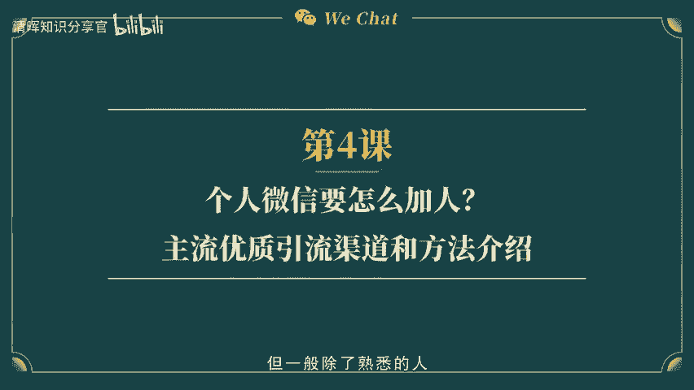
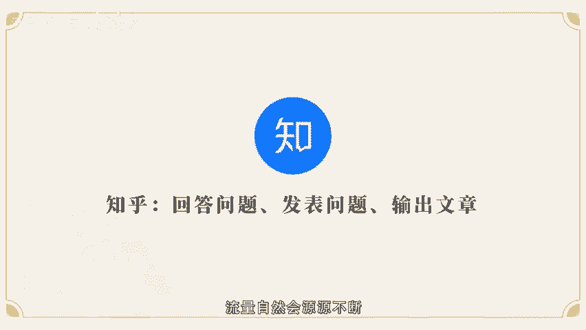
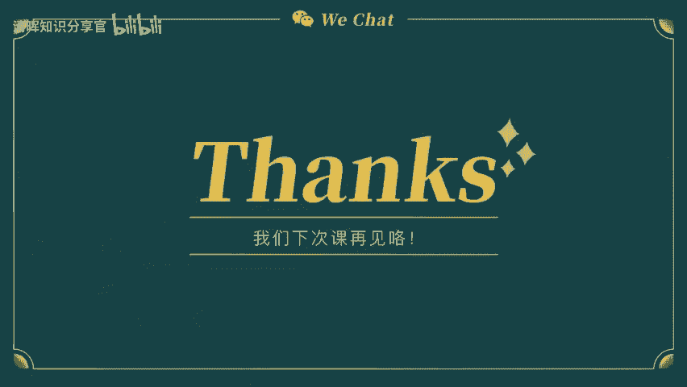
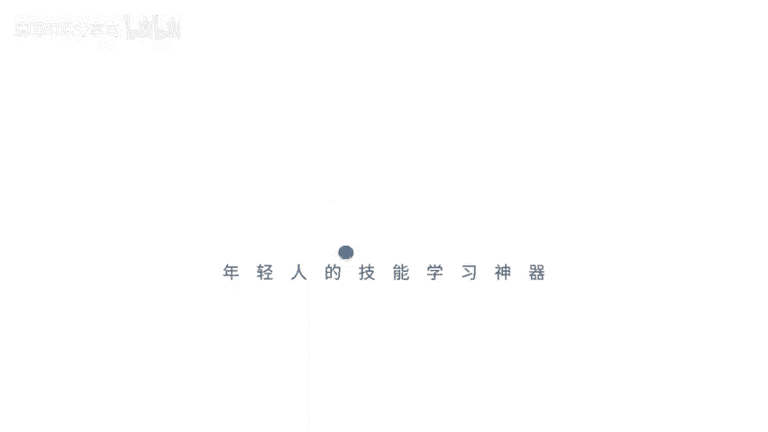
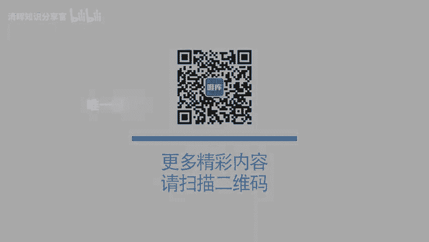
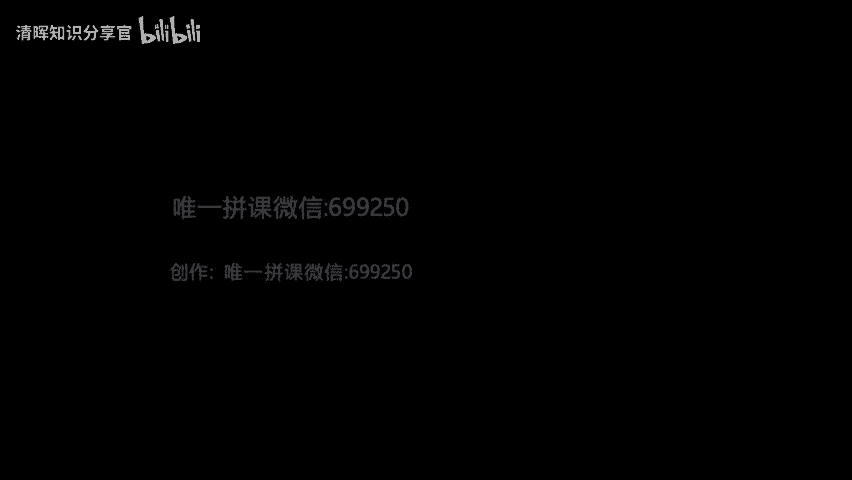

# 个人微信如何化身流量池？ - P2：第4课-个人微信要怎么加入？主流优质引流渠道和方法介绍 - 清晖知识分享官 - BV1zi421Y7th

🎼。🎼嗨大家好，上一节课呢跟大家讲了一些大发朋友圈门面装修升级的技巧。不知道同学们有没有开始用起来呢？其实啊门面装修好了，我们是不是就要开始给自己做推广了呢？因为任何一家新店在开业出期。

都是希望有更多的客户光云做推广，让生意更火爆最好，那么我们在微信个人变现的渠道，客户没有办法真正的来到我们的店铺，那我们需要做的是什么呢？老师在之前的课程说过，一开始只有几百个人是没有关系的。

但是你必须要扩大自己的鱼塘，让自己的朋友圈有更多的潜在消费者，但一般除了熟悉的人，我们很少有陌生的朋友，对吧？那么今天我就来跟大家讲一讲怎么让自己的朋友圈的精准客户多起来。现在大家都知道流量是非常贵的。

在2014到2015年，微信电现刚刚掀起的那段时间，每个流量都要。😊。

🎼一毛钱甚至一分钱就可以买到什么意思呢？就是说那个时候微信买一个粉丝，成为好友，只要一分钱。但是那个时候很多人是不注重流量的，只是觉得在朋友圈变现，我就是把货卖给熟人。但是现在呢随着时间的推移。

市场不断的扩大。越来越多的人也能够接受在微信上成交生意的方式，越来越多的人也发现，通过社交网络的链接，其实真正的微信电现的生意并不只是卖给熟人。

还有很多熟人推荐的陌生好友或者是有过点头直销的微信好友也会来购买我们的产品。这个时候大家就开始重视流量的重要性。据统计，目前平均一个流量差不多就要200块钱，这是什么意思呢？就是说你朋友圈的每一个好友。

他们所占的每一个好友位置都是价值200块钱呢。这么说，你可能没有太大感觉。但家现在可以拿起手机拉开自。🎼自己的通讯录联系人，看一下你现在有多少个好友呢？然后你把它乘以200。

你就知道你现在这个微信号值多少钱。如果是3000人，那你的微信号就值6万。如果是300人，那就是6000块。现在你觉得你的微信号是一个值钱的账号吗？这也是为什么会有些人专门用来养号。

然后把这个微信号卖给一些有需要的人。当然啦，我们是想个人在微信做朋友圈变现的。所以我今天主要是想告诉大家，你朋友圈的每一个好友，其实他们都是非常珍贵的资源，而且这些资源如果能被你激活，好好的经营。

加以变现的话，是可以为你创造无穷无尽的财富。我为什么这么说呢？大家可以这样去算一笔账哈。如果说你的微信里面有5000个好友，有10%的人会成为你的客户，那就是500个人。根据28法则，500个人当中。

🎼可能有20%是你的忠实客户。也就是说有100个人会持续不断的在你的个人微信号上去消费。假设每一个粉丝每个季度消费3000元，一年100个忠实客户给你产生120万的销售。这个只是一个大概的计算。

实际上一个忠实的客户一年给你产生的价值远远不止这些。还有更多的精准客户会成为你的合作伙伴，从产品的消费者变成经销商。这样一说，大家会不会觉得自己的朋友圈其实是一个非常重要又值钱的渠道呢？

我知道很多小伙伴的人际圈，还局限于自己的同学、同乡啊、同事啊，还有亲戚好友之类的。大部分人的基数都是在200到400之间，甚至有一些社交洁癖的人，他们的好友数量会在70到200之间。

有一本书叫做人脉就是钱卖，看这个书名就知道啦。🎼你有多少人脉就等于你有多少钱啦。那现在大家看看你微信好友的数量就代表着你的钱。大家想想是5000多人的微信号，它的人脉更广。

还是说200个人好友的微信人脉会更广呢？不用我多说流量的重要性，现在大家都知道了吧。所以有更多的流量和人脉是我们在微信电现这个行业当中不断要去拓展的一个环节。好了。

那么我们接下来说说到底该从哪里来引流呢？第一个给大家分享的引流渠道，这是社群。大家知道从2015年知识付费人员开始涌现了很多的付费社群。这些社群的涵盖，从知识教育科技技术等等。

还有手工收纳插花、绘画摄影，这些技能性的课程，在市面上都有很多付费社群，也有一些免费的社群。比如说是宝妈群啊、辅食群、团购砍价群啊，还有一。🎼些同城吃喝玩乐、小区拼团的社群。

一般用社群两个字来表达一个群的属性，代表着群里的人是有共同的兴趣爱好、共同话题和目标的。如果说没有共同属性的话，不会进到同一个群里去。那我们通过社群怎样去引流呢？首先第一条规则只进付费的社群。

不管这个社群是以学习还是以分享为主，我们尽量选择付费的，因为这类社群品质会比较高，然后同时社群本身也帮你筛选了你的潜在客户购买能力。为什么要进付费社群？第一，你们是有共同的话题的，这个共同话题是什么呢？

就比如我自己其实和大多数小伙伴都是一样的，在我最初做微信电线之前，好友只有400多人，那我是怎么引流的呢？当时也没有人教我，但我自己本身是一个比较爱学习的人，所以我从自己的。🎼兴趣爱好出发。

选择一个线下的课程，主要是讲如何冥想的半天课程。我会在课上的时候讨论自己的冥想体验。课程结束后，在线上的课程中，由21天的共同打卡。我在这个过程当中持续的去分享自己的感受，引起话题讨论。

影响这个课题本身就是群内所有人的共同话题。所以大家都会参与讨论，一来二去，大家也从陌生人变成了一个熟人，产生了深度链接，信任度也越来越高，逐步的就从陌生人变成熟人，变成客户和合作伙伴，甚至是成为好友。

🎼第二点，付费社群里面的人都已经养成了付费的习惯。这类人愿意投资自己。我们在朋友圈变现做生意也是需要投资的。关于付费思维这一点，说简单一点，就是会花钱，要舍得花钱。我有一个代理商一直不愿意花钱去学习。

所以他能够链接到的资源都是一些收入有限的全职宝妈出入家庭情况，全职太太的固有思维总是以划算为主，很多宝妈来跟他购买产品的时候都要跟他谈价格，她觉得很痛苦，问我怎么改变这个现状，我说了三个字，换圈子。

他问我怎么换。我就告诉他，你只需要花钱进优质社群学习，就可以改变这个问题。其实本质上付费并不是钱的问题，而是这是一道门槛，会把那些不愿意付费的人删除在外面。我的代理商狠狠心报了一个。

🎼00块的线下课程之后，回来和我说，真的感觉去了这种社群，自己都学到了很多知识，还认识了很多同类的小伙伴。🎼所以后来他在这类社群成交的客户合作都是非常愉快，从未产生过还价的行为。所以结果可想而知啦。

第三，付费社群里面的人背后的资源是高端的。在高端的付费社群中，除了用产品链接你前边的客户，你还可以挖掘社群成面背后的资源，也能链接到许多优质的客户，其实大家在做微信变现的时候，要学会经营自己。

并不仅仅只是局限于卖这一款产品。因为你的产品线可能会随着时间的推移，不断的扩大增加。那我们卖的产品可能当下是合作。那未来是不是会有更好的产品来替代呢？基于这一点考虑，我们肯定要挖掘客户背后的需求。

我有一个学员他是特别喜欢学习的。但是他不仅仅只是为了微信变现，为了成交他学习的同时，会把两个社群之间。🎼共同兴趣爱好的高质量人士链接在一起，为双方搭建一座沟通的桥梁，引荐同行业的人士认识。

给双方提供了价值。实际上，这和他的微信变现，没有产生直接的关系，对吧？但到最后呢过年的时候，其中一位在公司年会时大批量采购了他的产品，作为年会的礼品赠送给员工。另外一位采购了几箱产品给家里人使用。

其实很多时候我们做的工作看上去是没有用的。但是要挖掘事物背后的逻辑，每个人的背后其实都有潜在的消费群体，那么我们不仅仅要作为一个经营者，而是以一个经营者的心态去经营你所选择的微信变现产品。

去长久的经营自己的人脉，挖掘背后的可能性。讲完社群引流的优势之后，我们可以把目光转换到第二个渠道，就是贴吧豆瓣。🎼小红书、抖音这四个网络渠道，也都是基于社交属性的。这些渠道上的用户。

消费者大部分都是个人，也有部分商家去做网文推广？像我们作为个体的微信电现者，我们也要学会从消费者视角开发流量？从一个分享者的角度去展示我们的产品？具体使用步骤，大家可以遵循这个逻辑？第一。

从分享我们的使用体验开始，这个体验的过程包括你是因为什么原因接触这款产品的故事。第二，你是怎么用的，你用了有什么效果？第三，你为什么会来分享这款产品，它的优势在哪里？第四，消费者可以在哪些渠道采购？

大家有没有发现，平时我们就是这么神不知鬼不觉的对很多博主种草的？因为这个视角是以消费者自身的角度出发去写产品的体验感受。而。🎼不是从销售者的角度去陈述产品多么的高大上，代言人多么牛，产品的成分多么优质。

其实消费者要的是体验感和效果并不是那些和使用者本人无关的东西，这些平台的呈现形式，是以文字图片和视频为主的。但是宗旨都是依照我上面的逻辑来完成的。不仅仅是在这些平台上引流的时候需要这么写。

我们在朋友圈变现的时候，也可以从这个角度出发去写自己的体验。那接下来我们说说第三个引流渠道QQ通讯录导入和QQ空间，这个是全网最大的公开流量。大家都知道，微信是腾讯旗下的另外一款产品。

🎼在微信刚上市的时候，很多人都是不看好微信的这个产品功能的，因为大部分人都是基于在QQ上去聊天，尤其是90后。当然，现在还有大部分的00后还是活跃在QQ端口的。那么QQ的优势在哪里呢？

QQ的优势就是你可以从QQ里面导流找到你的微信上来，可以在微信朋友圈发送的广告同步到你的QQ空间去。同时你在QQ空间上的通讯录名单。只要对方把QQ号同时作为微信号。

那么你可以在微信号上收到对方的推荐好友，顺势把对方加到你的微信上来。如果是之前有做过关联授权的小伙伴很幸运。现在腾讯已经取消了这个功能，那我们通过通讯录还可以做什么呢？

🎼其实啊我们可以利用通讯录好友的QQ空间去找到我们想要的变现流量。每个QQ用户都有QQ空间。那么QQ空间下面你的好友当中，如果有其他人去点赞的时候，你是可以看到对方好友当中的QQ号，根据对方的QQ号。

你在朋友圈搜索，那么就可以找到对方的微信号。这种方法呢是没有限制的。同时也是可以获取真实粉丝的一种有效方法，但这种方法的效率相对来说是比较耗时间的对吧？

但他的优势就在于你所加进来的每一个人都是有共同好友，而且你可以在任何一个可公开搜索的。点在消费者的空间。去找到他背后的潜在客户以其建立关系。🎼第四种QQ群搜索这一招很强大。

因为可以批量找到你产品的潜在精准客户，你甚至不用自建鱼塘，只需要去别人的群里引流就可以啦。你可以搜索QQ群，比如说你做的是美妆护肤类产品。那么你可以找到这种群。

在加了群主之后可以看到群主的空间里面有谁给他点赞，还有一些人会在群主的空间去留言去求助。那么你是不是可以把这些人加回来呢？除了群主最重要的就是我们说的QQ群啦，比如说有个叫抗痘祛痘QQ群。

假设有500人，那么这些人是有实际需求的，所以财务群，如果你的产品正好可以解决他们的痛点，你可以在群内先混个脸熟，然后逐步把这些人直接转化到你的微信上来在。🎼微信朋友圈。

对方看到你的产品正好是可以解决问题的。进而咨询成交。那这个群里可以说你的每一个客户都是精准的，比你在茫茫人海当中去拉一个人，问他需不需要这个东西，这其实是最省力的方法啦。

因为QQ群的属性已经帮你筛选过一次你的潜在客户了。最重要的是，你需要把你的潜在客户，导流到你的微信电信号上，用来垫现。🎼最重要的一点，QQ群是有无数个的，这个渠道和平台潜力巨大。

大家还可以根据自己的产品和行业的属性，找到对应的群关键词，比如说创业家庭主妇创业、女人创业、美妆护肤、祛痘美白等等。这些关键词你都可以找到很多自字群。其实我相信很多人还会觉得这一招是比较笨比较慢的方法。

但是大家要知道，所有的事情和练习武功是一样的。你与其学会一万个招式，不如像武林盟主一样，把一招练到极致，然后用你的独门绝招去开拓你未来的市场。第五种设计好文案邮件群发。

这个几乎也是零成本广撒网的一种方式。平时呢我们在工作中才会用到邮箱，然后大部分时间我们的邮箱都是用来接收推送广告啊、信用卡账单啊、理财报告啊这些。🎼的，但是有没有想过，其实邮箱是最好的开拓客户方法之一。

比如我了解到的外贸行业，基本上都是通过自己在搜索引擎上搜到对方公司的邮箱账号，然后不断的去发邮件，给潜在的公司群发邮件，然后才能获取客户信任，才产生询价报价，进而沟通合作。

🎼相比较于外贸行业的公司对公司的合作，我们微信个人变现是以个人为主的一种人与人的交互方式。腾讯早已经为我们做好了一个市场的筛选一个分类，这个分类是什么呢？就是我们刚刚说的。

在混QQ群的基础上衍生出来的深度沟通，自动投递广告邮件的优势比一对一互动更好的地方在于你可以以图文的形式PPT甚至是视频的形式，更好的呈现自己的产品。所晚发QQ邮件的时候。

我会更建议大家给群主及核心成员自群发邮件，大家可以根据地域去搜集你所在的区域相关行业群。根据你的产品属性，找到用户群，大家一定要记得做好备注和分类标签。比如在哪几个QQ群。加了哪一些成员的邮箱。

然后再对应发送群邮件。🎼当然了，做好了以上的工作，我们的邮件也不会是像运广一样随机发送的，而是根据不同的客户属性，分不同的频次，不同的阶段去发送文案。现在大部分的广告，我们基本上都是不会看的。

那我会建议大家去设计一个关于自己的产品推广文案。文案主要是以故事性为主，引发客户的好奇心，然后逐步递增到功效，最后变成招商合作。以这个阶段去递进合作的过程。第六，除了腾讯序，我还想和大家说说头条号。

这个和当下爆火的抖音是同一家公司的产品，他们是一家以数据化原创性、智能推荐的营营渠道。要求来说相对严格。第一，如果是同一篇文章，必须是在头条号上首发。如果是在其他平台发布过系统查重就会默认降级。🎼推送。

第二，文章内容中不得出现产品、销售等字眼，如果出现会被封号，所以大家在头条号推荐产品的时候，不要直接推荐账号一旦查封，很难追回。因为头条号都是需要实名认证的。第三，不可以在文章中出现个人联系方式。

包括自我介绍当中也不可以。但是我们可以把联系方式用谐音字或者是藏头诗的形式放在推文中。说到这里肯定会有不少小伙伴说，既然这么难，那为什么还要推荐大家去做呢？因为头条号的曝光率真的是很惊人的。

我一个朋友写头条用自己设计的文案，一篇文章的推送高达10万，一晚上引流80多人。我自己曾经在头条号引流阅读量大约在1。5到3万之间，引流数量是每篇文章3到8个人。当然啦，在公开平台引流随机性比较。

🎼高因为你无法和读者之间产生沟通，但最重要的是你的文章足够有吸引力，每天坚持去做，那么你的引流就会人人不殆。🎼最后也是第七点，还有一个写文章的渠道分享给大家，就是知乎。在知乎。

你们每个人都有机会成为知乎大V转化流量。你可以在知乎上选择回答问题，发表问题，甚至写针对问题的解答文章。但有两种情况，第一是针对你的潜在客户去回答与你产品和行业相关的话题。

如果你的回答能够精准覆盖到你的客户群体，你的流量就多。第二，针对大众热点高的话题去回答经营粉丝到微信号来关注，从而实现变现转化。好了，今天给大家主要讲7种互联网的引流渠道。第一是当下效果的学习型社群。

给自己链接高质量人脉。第二，四大互联网渠道和消费者的角度去阐述自己的产品体验，但在消费者视角去引流卖货。第三。🎼从QQ通讯录到QQ空间，采集活粉丝。第四，从QQ群找到产品属性相关群体和潜在客户建立同盟。

第五，找到关键人物的QQ邮箱，从公共流量引流变现。第六，利用好头条号提高产品的宣传力度，从而引流变现。第七，知乎问答，写文章引流。以上七大方法，其实你只要找到一种最适合自己的不断进阶流量自然会人源不断。

好啦，这就是今天的课程，我们下次课再见。

