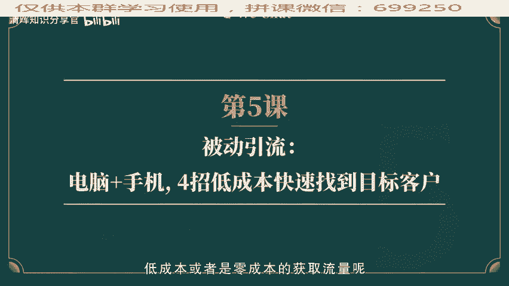
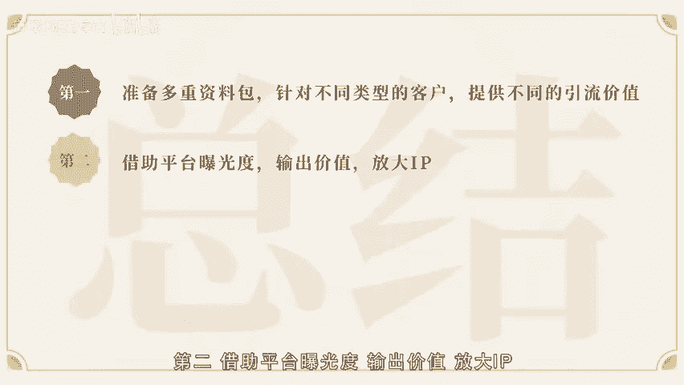
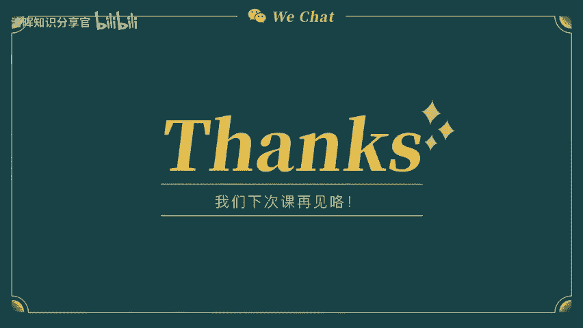
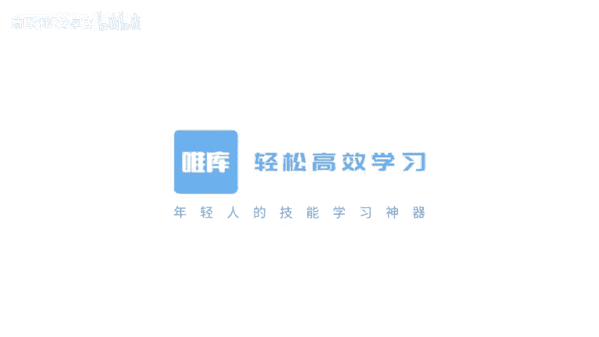
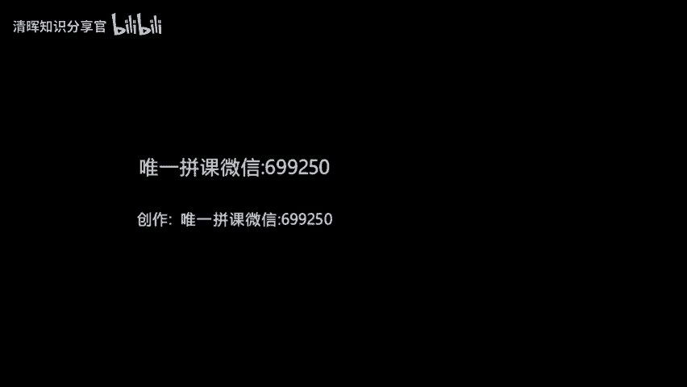

# 个人微信如何化身流量池？ - P3：第5课-被动引流：电脑+手机，4招低成本快速找到目标客户 - 清晖知识分享官 - BV1zi421Y7th

🎼。🎼嗨小伙伴们，上一次老师给大家主要讲7种互联网的引流渠道，你们开始记做了吗？每个人的个人IP不一样，每个人喜欢的平台也不同，一周的时间很短，没有找到的话，咱们可以慢慢来。

我相信上一节课的7种引流方法应该给了你不少许发。那么我们今天就来讲讲如何主动司机找流量去引流呢？第一个就是低成本资料包共享。上一节课跟大家说到了，现在平均一个流量，一个粉丝的成本大概是需要200块钱。

😊，🎼那么我们如何在互联网撕业的流量争夺战当中低成本或者是零成本获取流量呢？今天就给大家讲讲自己怎么制作零成本的引流素材，其实很简单，就是利用好互联网的电子版资料。这里的重点是电子版。第一，电子版资料。

成本低，只要找到一个素材，你是可以重复永久的使用的。第二，传播率高，这意味着你只需要在你所含的电子材料当中设计好你暗含自己产品的广告。无论是谁都可以成为你的传播者。你的广告会被附带传播给很多人。第三。

让人有占便宜的愉悦感。从消费者角度，其实大家都是喜欢占便宜的，而不是买便宜。好比我们去商场买酸奶。很多时候消费者会被搭赠的杯子和碗儿吸引，而不是酸奶本身。

🎼大家好好想想，我们的生活中有没有因为被赠品吸引而下单的购物经历呢？既然是这样，我们在朋友圈变现没有实体赠品的时候，我们就可以准备电子版赠品。那有些什么呢？大部分同学第一时间想到的可能是电子书比较多。

但其实还有更多可以开发的哦。首先你可以准备分门别类的电子书、电视剧、电影、学习音频、音乐甚至是CD资料等电子资料，然后针对这些素材做一个总体的分类，比如根据人群属性分类。

可以有针对学习人群的全职宝妈的职场新人的，在这个分类下，我们还可以做材料的不同阶段的分类。比如说技能型材料。儿童不同阶段的音频材料或者是阅读主题类电子材料，会不会有小伙伴觉得寻找。

🎼这些素材需要很多时间吗？其实并没有这多材料都是在网上公开的素材，只是说平时我没有习惯留意观察，然后就整理分类，也没有想到这类素材可拿来或引流的附加值，对吧？现在大家知道了以后。

是不是可以开始做自己的引流素材包吗？第二个，我们要建立于平台讲课，让自己发声，借助平台被看见，也就是提高曝光率了。我们知道现在知时的各的平台，个人也可以申请做主播录制书籍或者课程，打造自己的影响力。

提高自身的曝光度，然后引流到朋友圈做微信电现。目前有音频里喜马拉雅，可以通过频道自己做主播，录制读书音频或者是开通自己的动材专栏，做每周问答等内容输出的分享。这种是通过音频的方式。

提高自己传播率引流的方式还。🎼有学习新平台千聊APP这个也可以开课当讲师，并且可以自己设置付费课程。如果你是财务人员，也许可以开设财务相关的分支课程。大家也可以从自己的专业角度去延展。当然。

你说如果本职的工作不够专业，无法系统化输出。那么建议大家从自己的兴趣爱好去作付出。我朋友圈有一个女孩子，她是从自己的阅读爱好出发。累积读书心得，通过在千聊讲课开始引流，同步收费。

粉丝累积到500人左右课程开始收费，费用从9。9块到29。9块，涨到199。9元。她是通过她的高质量阅读信心从默默打造了自己的个人IP最后引流到微信号上卖她经营的亲子产品。所以销量可想而知，十分火爆。

当然还有大家都知道的抖音是视频娱乐的引流渠道。😊，🎼很多抖音爆款视频博主最后的带货能力是非常强大的。可能平时我们把抖音当成娱乐放松的一个平台，没有想过。

其实在这个平台自己也是可以输出内容资本引流到朋友圈进行兑现的。大家可能一时还想不到自己通过这些平台做一些什么类型的分享，对吧？这里其实也可以用到我的前面课程当中说到的。

结合自己的个人IP去分享你所知道的东西。个人IP的曝光率不仅仅是文字图片，随着5G时代的来临，现在都是以视频音频的方式呈现了。所以要在这些平台上持续不断的输出自己的生活观价值观。

输出自己的课程可以是育儿课程或者是美德早餐等等。学会利用平台建立自己的品牌美誉度及个人信誉度，是线上引流的一个重要环节。我自。🎼就因为曾经输出的课程到现在还会有许多粉丝会不定时的引流到微信上来。

只有你输出更多后期粉丝了解你的渠道会更多。信任度随之也会越来越高，转化到微信朋友圈的几率也就越大，变现率就可想而知了。关于平台的优势和好处是完全免费的。

大家保持输出个人IP的作品有足够的吸引力获得关注度，变现转化率就更大了。讲完平台的优势。那么接下来讲讲诱人福利合作福利款，转发名片送礼物，定期送实体礼物抽奖。说到送福利。大家都知道，在实体店。

我们经常逢年过节啊，6一881发双十一都是会有活动的。那我们在朋友圈变现的时候，朋友圈就是一家店铺，那我们是不是也可以选择在这一些节日做活动，或者是在平时也送送福利呢？想知道怎么送福利吗？

🎼有以下三种形式。第一种，直接点赞送礼物，送的礼物可以是自己的产品或者是产品的组合推广，也就是自己的产品和其他有价值的产品绑定赠送。再或者就是自己旅行带回来的小纪念品。点赞送福利的形式。

可以是在节日热点个人纪念日，或者是设计一个大家来找茬对比图，脑筋急转弯，或者是求助朋友圈，让大家产生互动，点赞评论的小活动，一般建议一个月2到3次即可让朋友圈的潜在客户保持对你朋友圈的关注度。

让大家养成在你朋友圈有福利和领取的期待感。第二种可以跟外部的品牌合作，拿到低的折扣价之后和自己的产品绑定，送给你的潜在客户，这相当于是给潜在客户的一个福利。平时想买一些产品，但是又没有折。

🎼扣如果能谈到折扣价，再结合自己的产品，做一个捆绑的销售，对于两个品牌都有推广和宣传，同时也挖掘了一些潜在客户，让对方体验到了你的产品。所以大家可以在平时有其他品牌方合作的时候，借助与品牌折扣优势。

为自己的产品挖掘潜在客户。比如你是做美容仪器类产品的。你可以和市面上口碑较好的品牌经销商谈合作，两款产品绑定一起销售，以组合打包价卖套餐，为两个品牌都做推广，双方都有盈利。

我有一个朋友在微信朋友圈变现的时候，同时选择了几款产品，他找了一家线下的实体店，把他的零食产品和其他品牌的果汁饮品搭配成一个组合销售。客户体验感非常好。很多客户都会在等待有活动的时候选择复购。当然啦。

这种活动不宜经常。🎼做建议1到2个月1次。如果活动过于频繁，消费者就不愿意购买正价产品了。第三种就是转发名片做推广。做这个活动，一般是让对方在朋友圈推荐你的名片、微信号、电话。

或者说是自我介绍和产品宣传手册产品链接，一般情况下，大部分的潜在客户为了体验你的福利产品，是会愿意帮你转发广告信息的。这种福利，你可以提供小红包或者是小礼品，或者是给大家赠送购物折扣券。

比如说你可以制作一张10块、20块的电子折扣券，形式就是你可以用黄豆相机等软件，制作电子图片，标注好使用的时间和金额、抵扣的产品等内容，或者是在微店当中设置一个产品链接，拍下0。1元的产品抵扣券。

下次可以直接凭下单记录。🎼抵扣10元，这样拿到你的推广体验装的客户，在下一次到本店来购买的话，就可以直接提动。这种优惠也是会让潜在客户惊动的。这种方法不仅仅适合潜在的客户建立了联系。

同时你的潜在客户也在帮你做个人引流推广，是一举两得的好方法哦。说到最后一点送礼物，也就是第四点。送实体礼物的话，我会建议大家在生日会周年庆或者是纪念日给客户送礼。

因为我们当下都是一个讲究仪式感的社会送礼，大家可以针对性的送。比如说曾经在你朋友圈购买产品超过1000元，或者是35000元产品的客户，以这个基准去分类优质客户，给他们赠送礼物。当然啦。

具体的金额和评选标准，大家可以通过购买的频次购买金额大款来分类。🎼同时也可以采取在朋友圈抽奖的方式，让所有人都有参与感，让大家都知道每个人都有中奖的可能。抽奖的形式可以选择建立一个零时微信群。

发红包抽奖，或者是在某一套朋友圈点赞的好友随机派送。比如最近是妈妈生日。如果有人在朋友圈留言点赞给妈妈送祝福的小伙伴，凡言第88、28、38的小伙伴，可以获得产品体验装或者是18。8块的红包一份。

如果说是有准备超过价值200元以上的感恩回馈礼品，就可以建立一个临时微信群，扫码前100位进群，可以抢红包送礼物，等到有人进群可以号召群类的小伙伴邀请对产品或是分享感兴趣的好友进群，感谢大家祝福的同时。

可以给产品做简样的宣传。同样告诉所有人。🎼中奖者都可以享受活动优惠，领取礼品。这一举动不仅仅是激活了你的全在客户，同时也帮你把潜在客户的人脉开发了一次。引流的范围就扩大了一个圈。最后呢还有一个引流渠道。

就是微博多方位引流。其实我们每天都刷微博看新闻和八卦。大家知道吗？我们其实是可以使用微博借立营销。借立营销是指借助于外力或者别人的优势资源，达到实现自己定制的营销目标或者是营销效果。

通俗来讲的意思就是说，我个人的能力有限，但我想扩大自己品牌的影响力。那我就要借助于大咖的影响力来到宣传效果。简单的说就是大咖说的话，更有权威性，比我们小个体说的更有信任度，在微博中，大家都知道。

有很多各行各业的大V，并且都拥有大案。🎼粉丝和高信誉度大V的微博转发量一般都很高。这个时候我们可以借助这些大V来加粉。比如说你可以在你关注的微博大V和你所选统的行业当中的大V的微博下去互动。

我相信很多人都看到过微博互动评论带广告语的对吧？当然，你也可以在发微博的时候经常去艾特他。如果其中有一个人转发了，或者评论了你的微博，你的粉丝数量就会直线上升。微博的引爆能力是很强的。

只要有一个大V转发了，就会有接二连三的大V转发产生连麦效应。当然，作为行业新人，我们主要是在朋友圈变现的，我们可以对自己的要求降低一点，不一定非要几千万粉丝的大咖。

我们可以去艾一些3到10万粉丝的小而精的行业微博号。🎼这样不仅你的微博能被大V看见的几率会增加，被转发的机会也可能提高。我曾经就见证过一个微博小号，因为优质内容被微博大V转发，而粉丝量暴增的一个现象。

具体怎么吸引微博大咖的注意力呢？比如激烈的文字有建地的观点文章，最简洁的就是将大V的红利，帮助他整理它的优质运动，最简单的就是大V的经典语录可以做成图定的形式，帮助提升大V本身的影响力和传播力度。

大家在帮助传播的时候，一定要尊重版权，记得转发原博主，标注影幕来源。这样也是借助大V给自己造示，提升影响力基本的一个方法。其实还有另外一种免费模式，就是专门的电商大号为粉丝提供信息发布服务。

我们可以私信投稿，让他们帮我们发布推广。🎼案最后总结一下，今天一共给大家讲了4种快速获客的方法。一，提前准备好多重资料包，针对不同类型的客户提供不同的引流价值。第二，借助平台曝光度输出价值。

放大IP给粉丝更多了解你的机会，增进信任度。第三，提供无法拒绝的礼物，让对方有赚到的感觉。第四，利用微博多方位引流泄历实意，扩大自己的影响力。好啦，这就是本次课程的全部内容。我们下次课再见。

