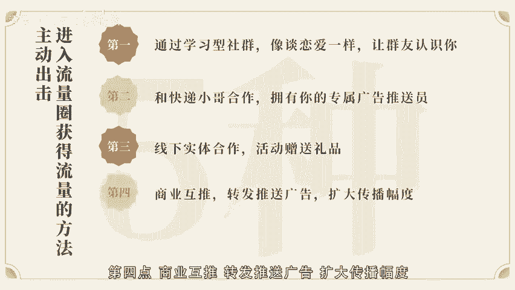
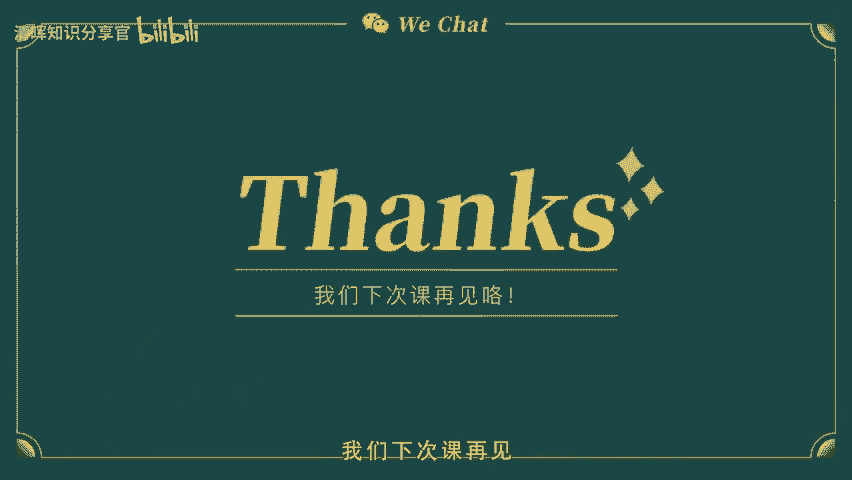

# 个人微信如何化身流量池？ - P4：第6课-主动导流：机智进群入圈，轻松捕获精准高质量客户 - 清晖知识分享官 - BV1zi421Y7th

🎼。

🎼嗨同学们，一周一课的时间又到了，时间过得很快，整个课程我们已经快上完3分之1了。有不少学员给我反馈，上完第三课，感觉自己以前的微信都白用了。听完第四课又一些新的引流方法。甚至还有小伙伴告诉我。

已经开始尝试自己的IP设定。准备找榜样来拆写模仿，开启自己的IP之路了。听到这些我很高兴，希望大家把接下来的课程听完之后能梳理出一套完整的变现流程，让自己的微信变现之路，顺利开启越走越宽。

上一节课呢阿老师一共给大家讲了4种自动找到目标客户的方法，利用多重资料包提供引流价值，借助平台提高曝光度，放IP提供无法拒绝的礼物。微博多方位引流。大家有开始时间起来吗？今天我们就继续来讲讲自己如何。

😊，🎼动出金入群gap新流量。我相信哈知识付费的年代，在我们的微信群里多多少少总会有几个学习型社群吧。那么老师今天就教大家如何在学习型社群引流。国内目前学习型社群。

比如有行动派趁早1点读书会咱登读书会教练技术形象美学 master等俱乐部，这些都是不同类型的学习，或者是读书技能提升型社群。首先大家可以根据自己的兴趣爱好出发，找到自己感兴趣的社群。

然后进入付费社群先学习，在付费社群的选择上，我建议大家一定要是抱着学习的目标去交朋友的，而不是抱着变现卖货去找资源嘛。你所需要的资源是在学习中不断筛选出来的，而不是目的性的去卖货得到的。

我刚刚列举国内目前比较火的一些社群。

🎼都是以读书学习和技能提升为主的社群。如何在这些社群留下第一印象呢？首先，第一步塑造好自己的个人形象。在网络上，别人无法和我们面对面交流，也没有办法让别人第一次接触，就来自我们的过往。

那么我们可以尝试着像做简历一样，做一份关于自己的个人线上简历。好让微信群内的其他小伙伴更快速的认识到我是怎样的一个人，这里有个小建议，我们在不同学习社群主题都是不同的。

那么同一份自我介绍是不是可以通用呢？答案显而易见是否定的。大家记住，我们要向面试不同公司的不同岗位一样，给自己的自我介绍，及时做调整。比如是阅读群，那我们可以说说自己的阅读经历。

比如大学期间阅读100本书籍投稿发表过多少篇文章。如果是关。🎼影群，那就可以介绍自己写过多少影评在哪里发表，或者是有哪些影评作品被大咖点赞。那如果是新媒体的学习，就可以用粉丝数据说话。

比如公众号1篇拿下原创粉丝几千几万等等。总而言之就是针对不同的社群，要把和社群相关的数据呈现出来，让自己更有价值的地方展现出来，让大家记住你。比如我自己在不同的社群学习都会更新一下自己的个人简介。

举个例子，大部分的主要简介都包含姓名郭阿静居住地点，上海和广州职业标签，前世界五百强白领现自由职业者维护微信变现讲师个人的高光时刻，专业领域，我有英语专业8级证书、B商务证书口译证书职业经历之外的成就。

比如我自己就是坚持在业余时间。🎼友圈变现两年之后，从世界五百强辞职，在上海买下了人生第一套房子，然后从事自由职业，这些标签都是给人留下深刻印象的一个闪光点，然后就是针对性的个人标签。

可以根据主题来描述个人成就。比如我在电影群里我会选一个标签，大学期间观影200家影片，发表过5篇优质影评，与豆瓣排名前二0的经典影片资源，欢迎大家链接，这样根据主题去描述自己做过什么，可以提供什么？

有需要的人会主动来链接你。然后上一节课我不是教大家准备了免费的电子资料分享给不同的类型的人吗？我相信很多小伙伴有疑问，分享给谁呢？那这里就来了。第二步提供价值留下好印象，你可以分享给社群里域。

因为这些资料是大家都需要也都想要的。你准备的这个资料。🎼学习社群里大家都需要的共同材料，比如亲子的阅读绘本、英语朗诵和听力提高资料，这个是学习群的基础资料库。当然了，这个也是根据社群主题来准备的资料包。

你每天都可以把电子资料作为无法拒绝的礼物分享给大家。坚持在群内共享是提升好感度的一个技巧。这个技巧可以让大家都记住你乐于分享的特质，也能培养群内小伙伴有需要找资料就会来找你的习惯。

这就是让潜在消费者记住的一个好方法啦。第三步，共同话题表达观点。建立一对一链接。这个就是说大家可以学会在社群里学习，并且输出表达自己的观点。我相信很多小伙伴其实在社群学习技能的时候。

社会有自己的作业要做的。这个时候不仅可以在APP里面打卡。我们还。🎼可以在群里晒出来，让大家一起来互动，相互学习。这样不仅可以带动其他同学的作业完成，也可以让群内的氛围活跃起来。

因为前面有你的自我介绍和无法拒绝的礼物铺荐。大家其实对你已经很熟悉了。这个时候你可以主动出击链接好友，而你认为合适的小伙伴导流加到你的微信好友圈来，这就相当于是谈恋爱一样，初步认识了，建立好感了。

然后就可以将微信私聊啦。接下来我还想分享第二个方法借用资源找快递合作的引用方法给大家，我们都知道，随着互联网购物的申情，淘宝、天猫、京东、当当、亚马逊等电商平台的购物越来越便利了。

我们越来越多的人会选择在网络上去采购自己需要的生活用品。大部分情况下，很多人都是收快递一族，对吧？不知道有没有人去观察过。🎼小区每天快递的投放量，比如说你们小区有多少个快递柜子呢？以我居住的小区为例。

有天天中通、圆通、韵达、顺丰、5家快递，我和快递员聊了一下，基本上平均每一家快递有200到400个件，你最低的200个件来算，每天一个小区有1000个快递发出，你统计好这个数据之后。

可以去选择跟快递小哥谈合作，那这个合作是怎样的一个形式呢？比如说付费请快递小哥在投送了200个件上，在包装上贴上你的二维码宣传广告，或者是说把你的名片放在快递盒子里。

如果你们小区有5家快递公司把他们分别谈合作，请他们帮你贴，那么每天1000个广告就投放出去了，这个成本是极低的。如果你把附近的小区都开发起来呢？你的广告每天可以投放到多少人手里，是不是？

🎼极大可能性提高了你的引流数量。还有另外一种就是我刚刚提到的。你有统计小区快递柜的数量吗？大家可以留意一下快递柜的数量。如果是在工业园区上班的一个园区至少有10个快递柜子，一个蜂巢柜子有95个快递箱。

每一天快递箱周转的速度，我们就按照周转一次来算的话，那么一天一个柜子就会有190个人取件。如果是10个柜子，那一天至少有1900次，你的广告可以投递出去的机会。每天有1900个人看到产品的广告。

对于个人引流来说，是不是量非常大了。我知道很多小伙伴不是全职在做微信电线这件事，可能会觉得自己去投放比较困难，那么你也可以请自己身边的小伙伴，或者是请大学生去帮忙做投递广告这么一件事。

尽量你最少的成本外包，至于广告素材。🎼贴纸大家可以在淘宝上打印贴纸基本上20元左右就能打印400到500张。如果是只有个人二维码的4块钱就能打印1000张。这个大家可以去做对比筛选了。

第三招线下实体合作活动赠送礼品实体课，我们上一节课说到了一点点关于实体可做的项目怎么做的。但这节课主要是想跟大家分享实体店可以怎样去做人员呢？我们知道大部分的实体店在北上广深都是有大众点评的。

我们可以根据大众点评，把那些与以产品相关的店铺的二维码找到，或者说是把店长的联系方式找到收集起来，然后呢先把微信加回来，因为没有店铺不拒绝自己的消费者，然后第二步就是预约到店拜访。

到店拜访的形式可以开门见山，主要是以合作为主。我给大家说说我之前做过。🎼的一个合作形式。🎼我之前做过一个眼贴活动，对方是眼镜店，然后正好我手里有一款产品，它是和眼镜相关的物理眼镜的产品，可以替带眼药水。

但是不可以替代眼镜的功能。当时我跟店家谈合作，比如来配眼镜的人有配超过1000元以上的眼镜，那么他可以填写一个客户资料表。我把二维码放在他店里，客户填写完资料表就可以扫码添加我的微信。

凭借单据照片留下地址之后，我就会快递和我的产品给他。我帮商家分析了这样合作的优势。第一，没有我的产品本身和他的眼镜店的产品，没有随际冲突，不会影响眼镜的销量。第二，我们给他的客户带出更多的增值服务。

也就是说我帮商家出钱或他品牌的广告网。他比他的竞争对手更有优势，和商家反复谈判之后，有确保。🎼不会占用他的客户资源，不打扰客户。所以他欣然接受了。还有第二种，有些商家不愿意给你客户资源。

害怕你去抢占他的流量和资源。那么你可以提供免费的培训课程。比如我可以提供眼部护理知识给到商家的客户，在他的客户群去做分享。培训结束之后，每个人凭微信好友截图，可以领取一份免费体验装。

这样也是可以你们的方法。第四招，商业互推，本质上是指两个收入和资源差不多的一些小伙伴做互推，比如说你和对方的产品不是同一个行业，但是你们双方的产品是可以互补的，那么就可以进行商业互推。

这个互推的形式是指你跟对方谈合作，让对方在他的朋友圈发一张你的名片，或者让对方把你的产品宣文广告文推荐到对方现在所在的群里面，以这样的形式去做推广。🎼合作同样你也可以帮对方做相同的推广。

其实啊这也是一种个体权威影响力。因为我们每个人在自己的朋友圈都是有一定的信任基础的。我们可以借助个体的影响力，提高自己产品的影响力。比如说我自己我曾经做过很多培训。我在朋友圈给自己做宣传的时候。

点赞评论的几乎都是客户和同行，直到有一天，一个曾经的陌生好友，在别人的朋友圈看到了我的课程的时候，主动来找我咨询，并且购买了产品，这是为什么呢？因为客户在我们的共同好友的朋友圈里看到了我的实力。

我有能力和团队培训，说明我的带货能力是不错的，还能教别人做微信变现，他就很好奇。其实啊这就是用我们共同好友的朋友圈为我做了助力，做了信任背书。第五章互惠换群商业合作换群这种形式说的。

🎼通俗易统就是换鱼塘，换流量池，回归到生活里，就是说换圈子。比如说你是汽车行业的，你有金融行业的朋友，可以带你混入金融行业的酒会，便些和本驰行业不同的人，找到潜在客户。回归线上微信变现当中。

因为每一个鱼塘或者是圈子里的流量池，总有开发完的时候，而且大家也知道，在一个群里待久了，大家的互动率就会直线下降。那这个时候我们就要去换群，因为每个人接触的社群类型都是不一样的。你喜欢亲子育儿。

对方喜欢绘画设计，这背后的资源都是不一样的对吧？那么换群的形式有哪些呢？换群啊是指有利于互换原则的。本质上说就是你想要换的群，里面有你的潜在客户或者是合作伙伴。你觉得对方的资源是符合你的产品的潜在客户。

或者说你的群可以为对。🎼的产品匹配对应的价值，那么你就可以去谈合作了。上边讲的是两个行业资源不同的人换群，这是可以链接资源的一个途径，是以个人为主，扩大交际圈去开发潜在消费者的一种方式。

属于点对点式引流。那么下面讲的是同一领域的合作换群。就是以点对面的引流方式，就是同行业合作换群。比如说吧我会建议大家如果你是销售母婴产品的，可以跟宝妈群主去换群。那如果是卖化妆品的。

可以跟一些实体店可有合作，给他们的客户群提供试用装，为其品牌提供附加值。同时如果老板愿意把你的产品作为组合销售。那你换群背后换来的可能就是一大批潜在消费者哦。好了，今天的课程主要给大家讲了5种主动出击。

进入流量圈获得流量的方法。我们一。🎼起来回顾一下。第一，通过学习云社群像谈恋爱一样，让群友认识你。第二，和快递小哥合作，拥有你的专属广告推送员。第三，线下实体合作活动，赠送礼品。第四。

商业互推转发推送广告，扩大传播幅度。第五，互惠换群与其链接一个人不如链接一群人，大家get了这些知识点了。期待大家根据自己的定位，一步步走出微信电线之路。好啦，今天的课程就到这里，我们下次课再见。

