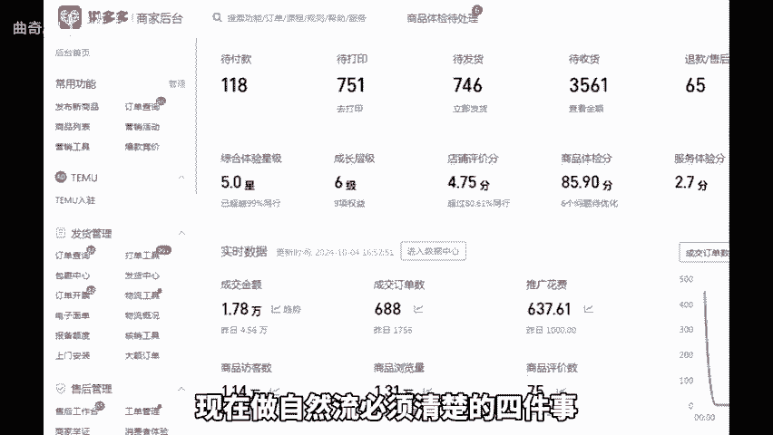
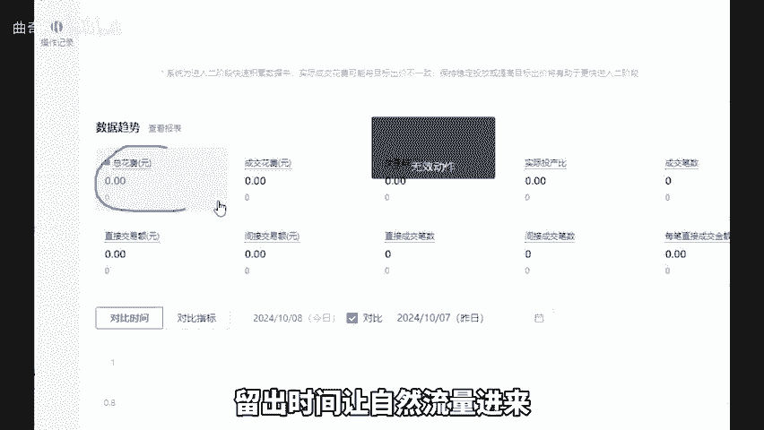
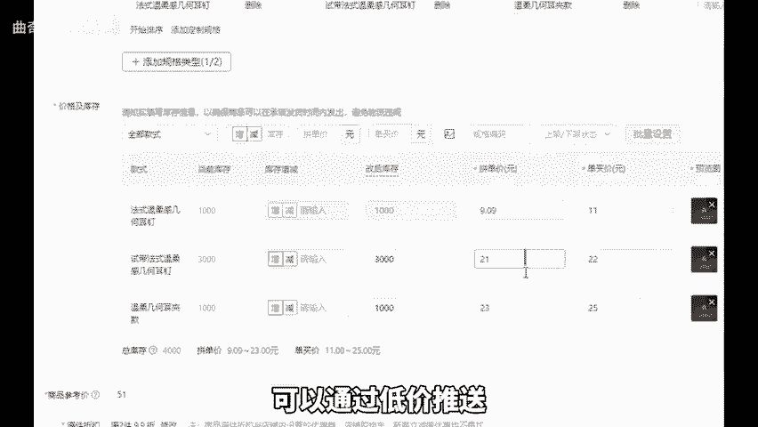
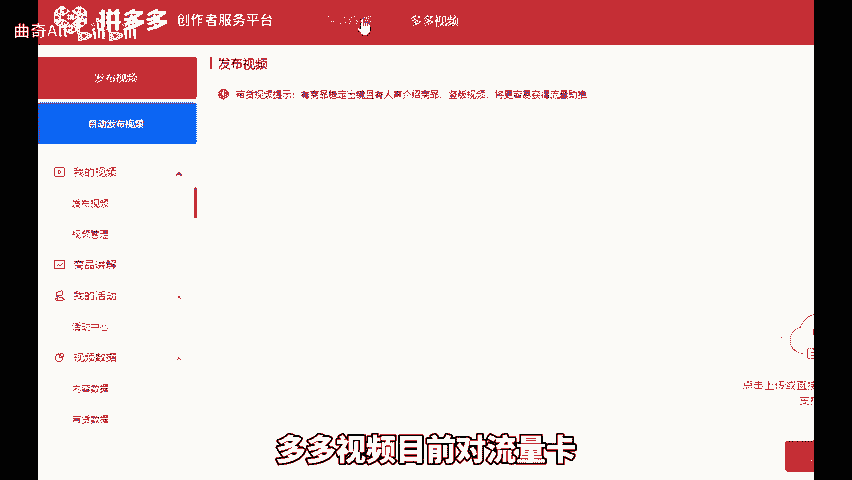
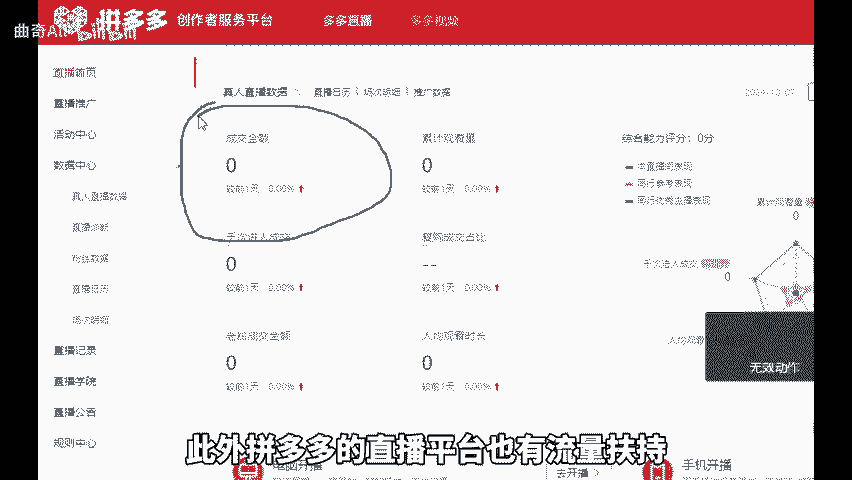
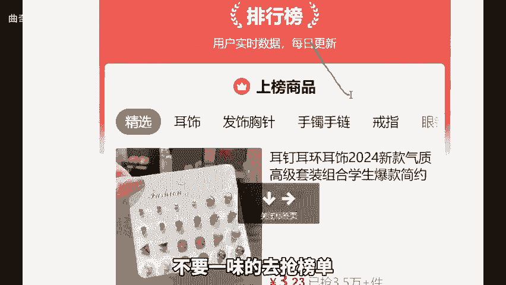
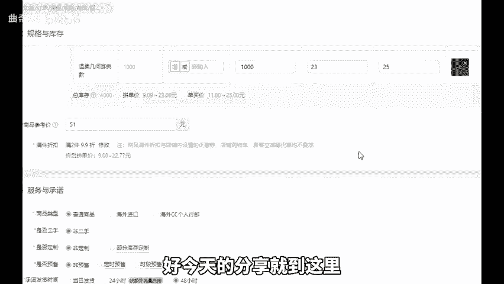

# 临近双十一拼多多想提升自然流亮必须清楚的四件事！ - P1 - 曲奇All - BV13E2GYGEK7

今年拼多多的双十一从10月14号0点就全面开始了。那如今该如何才能获取自然流呢？不少商家朋友拿不定主意。今天我就来给大家分享，现在做自然流必须清楚的四件事。首先，第一个推广实物比卡好日线额。

不要直接全天去开。如果直接开全天自然流量就会很少，且基本上会被付费推广消耗掉。如果一天只能花费几10块，那就直接暂停这个计划流出时间让自然流量进来。

第二个具有绝对价格优势的产品可以通过低价推送建筑平台资源位以及比价资源位实现自然流量的增长，并且这类产品一定是多品去操作，且大多具备价格优势。第三个，小众类幕产品就是具有独特特色的产品。

如果在平台上同质化严重，那自然流量很难进来，除非价格极低。第四个，活动资源位，产品去参加活动符合平台折扣且有利润，这种可以多品去打造。第五个，视频和直播多多视频目前对流量卡给出的流量相当的可观。此外。

拼多多的直播平台。

也有流量扶持，通过这些方式都能实现自然流量，不要一味的去抢榜单，也不要把所有希望都寄托在一个链接上。要多找产品多用心，把上述几点做好，自然流量会让你满意。但这里的满意并非只爆单，而是利润。好。

今天的分享就到这里，还有不懂的可以后台找我。

