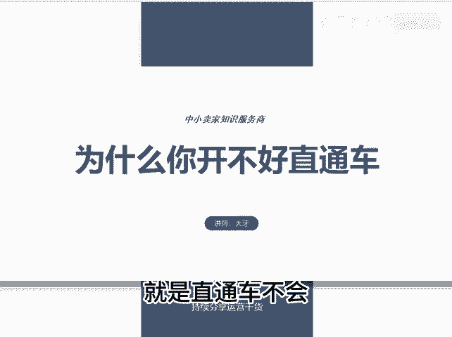
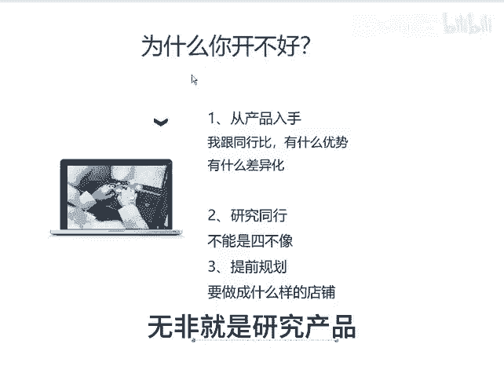

# 为什么你开不好直通车 - P1 - 千优电商教育 - BV1wfxVewExs

你为什么开不好直通车？很多朋友说呢，他说我别的都差不多，就是直通车不会。其实呢我想说的是直通车，你真会为什么直通车它仅仅是一个引流工具，现在它几乎是没有任何的技术含量。那我们看上车的过程。

它就这样的几个按钮吗？日限额出价方式出价以及急速起量。那这几个该怎么开，其实它很简单，首先出价呢，我建议你是先低后高逐步调整，什么意思呢？就是叫猥琐型出价，我先从低出或者投产比呢。

我从高出逐渐的降低投产比。这种有一个缺点就它比较慢，但是呢它不会让你多花钱跑动。比如说你先出我的投产比跑动吗？跑动，我在5。85。6，我逐渐降低，或者你如果成交出价，你说我先出10块卖出10。05毛。

这11这样逐步调整，建议这样然后呢像限额这个咱们大家你要注意限额只能增加，不能减少。当你降低了限额意味着你给拼多多充值变少，那么你的流量会出问题。再一个极速。😡。

起量开不开呢？极速起量其实这玩意它没意义。首先它已经有了出价，然后再有急速起量，它无非就让你多投入嘛。这个如果你不会玩就不开。如果会玩的话再开好，直通车其实整体操作就这么简单。

那么为什么你还开不好直通车直通车它就是一个购买流量的工具，怎么叫购买流量就相当于你发传单吗？发传单这玩意儿有技术含量吗？可能没多少技术含量。那为什么你开不好，那么你首先应该研究你的产品。

就是你现在做电商一定要从产品入手，产品定位产品的布局，再就是你和同行比你的产品有什么优势。那很多朋友经常说呢？我研究同行了，我同行怎么样？其实呢你今天研究一个同行，明天研究一个同行。

每个同行学了一点学了一个四不像，再一个你现在一定要从产品入手，产品为王嘛？你一定要转变技术运营那种思维，下一步的运营，无非就是研究产品和研究营销，我是讲师大牙，欢迎大家扫码添加我的微。😡。

不方便扫码的朋友可以添加我的微信号，80221430。在这里给大家准备到了一套新手运营入门的大礼包，希望能够帮助大家。😊。

